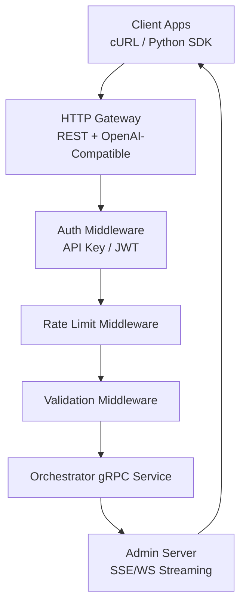
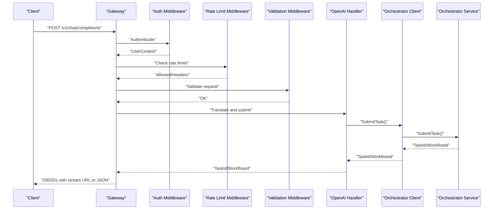
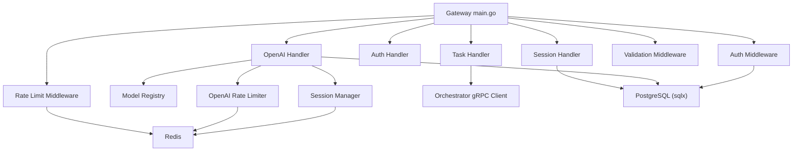

# API Reference

<cite>
**Referenced Files in This Document**
- [main.go](file://go/orchestrator/cmd/gateway/main.go)
- [task.go](file://go/orchestrator/cmd/gateway/internal/handlers/task.go)
- [session.go](file://go/orchestrator/cmd/gateway/internal/handlers/session.go)
- [auth.go](file://go/orchestrator/cmd/gateway/internal/handlers/auth.go)
- [handler.go](file://go/orchestrator/cmd/gateway/internal/openai/handler.go)
- [orchestrator.proto](file://protos/orchestrator/orchestrator.proto)
- [session.proto](file://protos/session/session.proto)
- [auth.go](file://go/orchestrator/cmd/gateway/internal/middleware/auth.go)
- [ratelimit.go](file://go/orchestrator/cmd/gateway/internal/middleware/ratelimit.go)
- [validation.go](file://go/orchestrator/cmd/gateway/internal/middleware/validation.go)
- [ratelimit.go](file://go/orchestrator/cmd/gateway/internal/openai/ratelimit.go)
- [registry.go](file://go/orchestrator/cmd/gateway/internal/openai/registry.go)
- [session.go](file://go/orchestrator/cmd/gateway/internal/openai/session.go)
- [client.py](file://clients/python/src/shannon/client.py)
</cite>

## Table of Contents
1. [Introduction](#introduction)
2. [Project Structure](#project-structure)
3. [Core Components](#core-components)
4. [Architecture Overview](#architecture-overview)
5. [Detailed Component Analysis](#detailed-component-analysis)
6. [Dependency Analysis](#dependency-analysis)
7. [Performance Considerations](#performance-considerations)
8. [Troubleshooting Guide](#troubleshooting-guide)
9. [Conclusion](#conclusion)
10. [Appendices](#appendices)

## Introduction
This document provides comprehensive API documentation for Shannon’s REST and OpenAI-compatible interfaces, along with the internal gRPC service definitions used by the system. It covers:
- REST endpoints for task submission, session management, streaming, and administrative functions
- OpenAI-compatible API endpoints for drop-in compatibility
- Internal gRPC service definitions for orchestrator and session services
- Authentication methods, API key management, and rate limiting
- Request/response schemas, parameter validation, and error handling
- Practical examples using cURL and the Python SDK
- API versioning, backward compatibility, and migration guidance
- Security, monitoring, and performance optimization strategies

## Project Structure
Shannon’s gateway exposes REST and OpenAI-compatible endpoints and proxies streaming to an admin server. Requests are authenticated and rate-limited before being forwarded to the orchestrator gRPC service. The orchestrator translates requests into workflows and emits events streamed back to clients.

**Diagram sources**
- [main.go](file://go/orchestrator/cmd/gateway/main.go#L135-L538)
- [auth.go](file://go/orchestrator/cmd/gateway/internal/middleware/auth.go#L49-L156)
- [ratelimit.go](file://go/orchestrator/cmd/gateway/internal/middleware/ratelimit.go#L35-L73)
- [validation.go](file://go/orchestrator/cmd/gateway/internal/middleware/validation.go#L22-L85)

**Section sources**
- [main.go](file://go/orchestrator/cmd/gateway/main.go#L135-L538)

## Core Components
- HTTP Gateway: Registers REST and OpenAI endpoints, applies middleware, and proxies streaming.
- Orchestrator gRPC Service: Executes tasks, manages control state, and supports scheduling.
- Session Management: Provides session continuity for multi-turn conversations.
- OpenAI-Compatible Layer: Translates OpenAI requests to internal tasks and streams events.
- Authentication and Rate Limiting: Supports API keys and JWTs; enforces per-user and per-API-key limits.

**Section sources**
- [main.go](file://go/orchestrator/cmd/gateway/main.go#L97-L120)
- [orchestrator.proto](file://protos/orchestrator/orchestrator.proto#L10-L36)
- [session.proto](file://protos/session/session.proto#L12-L33)

## Architecture Overview
The gateway initializes services, constructs handlers, and wires middleware. OpenAI endpoints are conditionally enabled and integrate with a model registry, session manager, and rate limiter.

**Diagram sources**
- [main.go](file://go/orchestrator/cmd/gateway/main.go#L502-L538)
- [handler.go](file://go/orchestrator/cmd/gateway/internal/openai/handler.go#L63-L190)
- [orchestrator.proto](file://protos/orchestrator/orchestrator.proto#L10-L11)

**Section sources**
- [handler.go](file://go/orchestrator/cmd/gateway/internal/openai/handler.go#L63-L190)

## Detailed Component Analysis

### REST API: Task Submission
- Base Path: /api/v1
- Authentication: Required for all endpoints except health and OpenAPI spec
- Rate Limiting: Applied to selected endpoints
- Validation: Route-specific parameter validation

Endpoints:
- POST /api/v1/tasks
  - Purpose: Submit a task asynchronously
  - Auth: Required
  - Body: TaskRequest
  - Response: TaskResponse
  - Notes: Generates session_id if omitted; returns X-Workflow-ID and X-Session-ID headers
- POST /api/v1/tasks/stream
  - Purpose: Submit task and receive a stream URL
  - Auth: Required
  - Response: JSON with workflow_id, task_id, stream_url
  - Notes: Link header includes stream URL; headers include X-Workflow-ID and X-Session-ID
- GET /api/v1/tasks
  - Purpose: List tasks with pagination and filters
  - Auth: Required
  - Query Params: limit (1–100), offset (≥0), session_id, status
  - Response: ListTasksResponse
- GET /api/v1/tasks/{id}
  - Purpose: Get task status and result
  - Auth: Required
  - Response: TaskStatusResponse
  - Notes: Includes raw result and optionally parsed JSON response; enriches with usage and metadata
- GET /api/v1/tasks/{id}/stream
  - Purpose: Stream task events via SSE
  - Auth: Required
  - Notes: Proxied to admin server; supports types and last_event_id query params
- GET /api/v1/tasks/{id}/events
  - Purpose: Retrieve persistent event history
  - Auth: Required
  - Response: Array of Event objects
- POST /api/v1/tasks/{id}/cancel
  - Purpose: Cancel a running task
  - Auth: Required
  - Response: Boolean success
- POST /api/v1/tasks/{id}/pause
  - Purpose: Pause a running task
  - Auth: Required
  - Response: Boolean success
- POST /api/v1/tasks/{id}/resume
  - Purpose: Resume a paused task
  - Auth: Required
  - Response: Boolean success
- GET /api/v1/tasks/{id}/control-state
  - Purpose: Get control state (paused/cancelled)
  - Auth: Required
  - Response: ControlState

Request/Response Schemas:
- TaskRequest
  - Fields: query (required), session_id (optional), context (optional), mode (optional), model_tier (optional), model_override (optional), provider_override (optional), research_strategy (optional), max_iterations (optional), max_concurrent_agents (optional), enable_verification (optional)
- TaskResponse
  - Fields: task_id, status, message, created_at
- TaskStatusResponse
  - Fields: task_id, workflow_id, status, result, response (parsed JSON), error, created_at, updated_at, query, session_id, mode, context, model_used, provider, usage, metadata

Validation and Error Handling:
- ValidationMiddleware enforces ID formats, pagination bounds, and optional parameters
- Typical errors: 400 (invalid request), 401 (unauthorized), 403 (forbidden), 404 (not found), 429 (rate limit), 5xx (server error)

Practical Examples:
- cURL: Submit task
  - curl -X POST "$BASE_URL/api/v1/tasks" \
    -H "Authorization: Bearer $ACCESS_TOKEN" \
    -H "Content-Type: application/json" \
    -d '{"query":"Summarize climate change impacts","context":{"force_research":true}}'
- cURL: Submit task and get stream URL
  - curl -X POST "$BASE_URL/api/v1/tasks/stream" \
    -H "Authorization: Bearer $ACCESS_TOKEN" \
    -H "Content-Type: application/json" \
    -d '{"query":"Explain quantum computing"}'
- Python SDK:
  - Submit task: client.submit_task(query="...", context={"force_research": True})
  - Wait for completion: client.wait(task_id)
  - Get status: client.get_status(task_id)

**Section sources**
- [main.go](file://go/orchestrator/cmd/gateway/main.go#L185-L314)
- [task.go](file://go/orchestrator/cmd/gateway/internal/handlers/task.go#L308-L358)
- [task.go](file://go/orchestrator/cmd/gateway/internal/handlers/task.go#L377-L466)
- [task.go](file://go/orchestrator/cmd/gateway/internal/handlers/task.go#L468-L558)
- [task.go](file://go/orchestrator/cmd/gateway/internal/handlers/task.go#L560-L715)
- [task.go](file://go/orchestrator/cmd/gateway/internal/handlers/task.go#L717-L800)
- [validation.go](file://go/orchestrator/cmd/gateway/internal/middleware/validation.go#L22-L85)
- [client.py](file://clients/python/src/shannon/client.py#L163-L251)

### REST API: Session Management
- Base Path: /api/v1/sessions
- Authentication: Required

Endpoints:
- GET /api/v1/sessions
  - Purpose: List user sessions
  - Auth: Required
  - Query Params: limit (1–100), offset (≥0)
  - Response: ListSessionsResponse
- GET /api/v1/sessions/{sessionId}
  - Purpose: Get session metadata
  - Auth: Required
  - Response: SessionResponse
  - Notes: Uses dual ID matching (UUID or external_id in context)
- GET /api/v1/sessions/{sessionId}/history
  - Purpose: Get session task history
  - Auth: Required
  - Response: SessionHistoryResponse
- GET /api/v1/sessions/{sessionId}/events
  - Purpose: Get grouped turns/events for UI
  - Auth: Required
  - Query Params: limit (1–100), offset (≥0), include_payload (true/false)
  - Response: Turn-based events
- PATCH /api/v1/sessions/{sessionId}
  - Purpose: Update session title
  - Auth: Required
- DELETE /api/v1/sessions/{sessionId}
  - Purpose: Soft delete session (idempotent)
  - Auth: Required

Request/Response Schemas:
- SessionResponse
  - Fields: session_id, user_id, context, token_budget, tokens_used, task_count, created_at, updated_at, expires_at, is_research_session, research_strategy
- SessionHistoryResponse
  - Fields: session_id, tasks (array of TaskHistory), total
- TaskHistory
  - Fields: task_id, workflow_id, query, status, mode, result, error_message, total_tokens, total_cost_usd, duration_ms, agents_used, tools_invoked, started_at, completed_at, metadata
- SessionEventTurn
  - Fields: turn, task_id, user_query, final_output, timestamp, events, metadata (tokens_used, execution_time_ms, agents_involved)

Practical Examples:
- cURL: Get session
  - curl -X GET "$BASE_URL/api/v1/sessions/{sessionId}" \
    -H "Authorization: Bearer $ACCESS_TOKEN"
- cURL: Get session events
  - curl -X GET "$BASE_URL/api/v1/sessions/{sessionId}/events?limit=10&include_payload=true" \
    -H "Authorization: Bearer $ACCESS_TOKEN"
- Python SDK:
  - List sessions: client.list_sessions(limit=20, offset=0)
  - Get session: client.get_session(session_id)
  - Get events: client.get_session_events(session_id, limit=10)

**Section sources**
- [main.go](file://go/orchestrator/cmd/gateway/main.go#L331-L399)
- [session.go](file://go/orchestrator/cmd/gateway/internal/handlers/session.go#L132-L337)
- [session.go](file://go/orchestrator/cmd/gateway/internal/handlers/session.go#L339-L518)
- [session.go](file://go/orchestrator/cmd/gateway/internal/handlers/session.go#L520-L800)
- [client.py](file://clients/python/src/shannon/client.py#L800-L1200)

### REST API: Scheduling
- Base Path: /api/v1/schedules
- Authentication: Required

Endpoints:
- POST /api/v1/schedules
  - Purpose: Create schedule
  - Auth: Required
  - Body: CreateScheduleRequest
  - Response: CreateScheduleResponse
- GET /api/v1/schedules
  - Purpose: List schedules
  - Auth: Required
  - Query Params: page_size (1–100), page (≥1), status (ACTIVE|PAUSED|ALL)
  - Response: ListSchedulesResponse
- GET /api/v1/schedules/{id}
  - Purpose: Get schedule
  - Auth: Required
  - Response: GetScheduleResponse
- GET /api/v1/schedules/{id}/runs
  - Purpose: Get schedule runs
  - Auth: Required
  - Response: Array of runs
- PUT /api/v1/schedules/{id}
  - Purpose: Update schedule
  - Auth: Required
  - Body: UpdateScheduleRequest
  - Response: UpdateScheduleResponse
- POST /api/v1/schedules/{id}/pause
  - Purpose: Pause schedule
  - Auth: Required
  - Response: PauseScheduleResponse
- POST /api/v1/schedules/{id}/resume
  - Purpose: Resume schedule
  - Auth: Required
  - Response: ResumeScheduleResponse
- DELETE /api/v1/schedules/{id}
  - Purpose: Delete schedule
  - Auth: Required
  - Response: DeleteScheduleResponse

Request/Response Schemas:
- CreateScheduleRequest
  - Fields: name, description, cron_expression, timezone, task_query, task_context, max_budget_per_run_usd, timeout_seconds
- ScheduleInfo
  - Fields: schedule_id, name, description, cron_expression, timezone, task_query, task_context, max_budget_per_run_usd, timeout_seconds, status, created_at, updated_at, last_run_at, next_run_at, total_runs, successful_runs, failed_runs

Practical Examples:
- cURL: Create schedule
  - curl -X POST "$BASE_URL/api/v1/schedules" \
    -H "Authorization: Bearer $ACCESS_TOKEN" \
    -H "Content-Type: application/json" \
    -d '{"name":"Daily Report","cron_expression":"0 9 * * *","task_query":"Generate daily summary","task_context":{"report_type":"daily"}}'

**Section sources**
- [main.go](file://go/orchestrator/cmd/gateway/main.go#L401-L500)
- [orchestrator.proto](file://protos/orchestrator/orchestrator.proto#L240-L352)

### REST API: Authentication and API Keys
- Base Path: /api/v1/auth
- Authentication: Optional for registration/login; required for protected endpoints

Endpoints:
- POST /api/v1/auth/register
  - Purpose: Register new user
  - Response: RegisterResponse
  - Notes: Auto-creates default API key for new users
- POST /api/v1/auth/login
  - Purpose: Login and obtain tokens
  - Response: RegisterResponse
- POST /api/v1/auth/refresh
  - Purpose: Refresh access token
  - Response: RefreshResponse
- GET /api/v1/auth/me
  - Purpose: Get profile and quotas
  - Auth: Required
  - Response: MeResponse
- POST /api/v1/auth/refresh-key
  - Purpose: Rotate API key
  - Auth: Required
  - Response: RefreshKeyResponse
- GET /api/v1/auth/api-keys
  - Purpose: List API keys
  - Auth: Required
  - Response: ListAPIKeysResponse
- POST /api/v1/auth/api-keys
  - Purpose: Create API key
  - Auth: Required
  - Body: CreateAPIKeyRequest
  - Response: CreateAPIKeyResponse
- DELETE /api/v1/auth/api-keys/{id}
  - Purpose: Revoke API key
  - Auth: Required
  - Response: Success object

Request/Response Schemas:
- RegisterRequest/LoginRequest
  - Fields: email, username, password, full_name (register)
- RegisterResponse/MeResponse
  - Fields: user_id, tenant_id, access_token, refresh_token, expires_in, api_key (register), tier, is_new_user, quotas, user (info)
- APIKeyInfo
  - Fields: id, name, key_prefix, description, created_at, last_used_at, is_active

Practical Examples:
- cURL: Register
  - curl -X POST "$BASE_URL/api/v1/auth/register" \
    -H "Content-Type: application/json" \
    -d '{"email":"user@example.com","username":"user","password":"SecurePass!123"}'
- cURL: Create API key
  - curl -X POST "$BASE_URL/api/v1/auth/api-keys" \
    -H "Authorization: Bearer $ACCESS_TOKEN" \
    -H "Content-Type: application/json" \
    -d '{"name":"My Key","description":"For CI"}'

**Section sources**
- [main.go](file://go/orchestrator/cmd/gateway/main.go#L145-L183)
- [auth.go](file://go/orchestrator/cmd/gateway/internal/handlers/auth.go#L166-L274)
- [auth.go](file://go/orchestrator/cmd/gateway/internal/handlers/auth.go#L276-L356)
- [auth.go](file://go/orchestrator/cmd/gateway/internal/handlers/auth.go#L358-L393)
- [auth.go](file://go/orchestrator/cmd/gateway/internal/handlers/auth.go#L395-L456)
- [auth.go](file://go/orchestrator/cmd/gateway/internal/handlers/auth.go#L458-L509)
- [auth.go](file://go/orchestrator/cmd/gateway/internal/handlers/auth.go#L511-L570)
- [auth.go](file://go/orchestrator/cmd/gateway/internal/handlers/auth.go#L572-L631)
- [auth.go](file://go/orchestrator/cmd/gateway/internal/handlers/auth.go#L633-L683)

### OpenAI-Compatible API
- Base Path: /v1
- Authentication: Required
- Endpoints:
  - POST /v1/chat/completions
    - Purpose: Chat completions compatible with OpenAI
    - Auth: Required (API key or JWT)
    - Body: OpenAI ChatCompletionRequest
    - Response: OpenAI ChatCompletionResponse (streaming or non-streaming)
    - Notes: Integrates with model registry, session manager, and rate limiter
  - GET /v1/models
    - Purpose: List available models
    - Auth: Optional for listing
    - Response: OpenAI ModelsResponse
  - GET /v1/models/{model}
    - Purpose: Get model info
    - Auth: Optional for lookup
    - Response: OpenAI ModelObject

Request/Response Schemas:
- ChatCompletionRequest
  - Fields: model (optional), messages (required), stream (boolean), stream_options (optional), temperature, max_tokens, etc.
- ChatCompletionResponse
  - Fields: id, object, created, model, choices (array), usage (optional)
- ModelsResponse/ModelObject
  - Fields: object, data (models), id, object, created, owned_by

Practical Examples:
- cURL: Chat completion
  - curl -X POST "$BASE_URL/v1/chat/completions" \
    -H "Authorization: Bearer $ACCESS_TOKEN" \
    -H "Content-Type: application/json" \
    -d '{"model":"shannon-chat","messages":[{"role":"user","content":"Hello"}],"stream":false}'
- cURL: Chat completion (streaming)
  - curl -N -X POST "$BASE_URL/v1/chat/completions" \
    -H "Authorization: Bearer $ACCESS_TOKEN" \
    -H "Content-Type: application/json" \
    -d '{"model":"shannon-chat","messages":[{"role":"user","content":"Explain quantum"}],"stream":true}'
- Python SDK:
  - client.chat.completions.create(model="shannon-chat", messages=[{"role":"user","content":"..."}])

**Section sources**
- [main.go](file://go/orchestrator/cmd/gateway/main.go#L502-L538)
- [handler.go](file://go/orchestrator/cmd/gateway/internal/openai/handler.go#L63-L190)
- [handler.go](file://go/orchestrator/cmd/gateway/internal/openai/handler.go#L371-L417)
- [registry.go](file://go/orchestrator/cmd/gateway/internal/openai/registry.go#L170-L257)
- [session.go](file://go/orchestrator/cmd/gateway/internal/openai/session.go#L62-L133)
- [ratelimit.go](file://go/orchestrator/cmd/gateway/internal/openai/ratelimit.go#L49-L126)

### Internal gRPC Services

#### OrchestratorService
- Methods:
  - SubmitTask, GetTaskStatus, CancelTask, ListTasks
  - GetSessionContext, ListTemplates
  - ApproveTask, GetPendingApprovals
  - PauseTask, ResumeTask, GetControlState
  - CreateSchedule, GetSchedule, ListSchedules, UpdateSchedule, DeleteSchedule, PauseSchedule, ResumeSchedule

Key Messages:
- SubmitTaskRequest/Response
- GetTaskStatusRequest/Response
- TaskStatus enum
- ScheduleInfo, CreateScheduleRequest, UpdateScheduleRequest

**Section sources**
- [orchestrator.proto](file://protos/orchestrator/orchestrator.proto#L10-L36)
- [orchestrator.proto](file://protos/orchestrator/orchestrator.proto#L63-L96)
- [orchestrator.proto](file://protos/orchestrator/orchestrator.proto#L109-L119)
- [orchestrator.proto](file://protos/orchestrator/orchestrator.proto#L240-L352)

#### SessionService
- Methods:
  - CreateSession, GetSession, UpdateSession, DeleteSession
  - ListSessions, AddMessage, ClearHistory

Key Messages:
- CreateSessionRequest/Response
- GetSessionRequest/Response
- Session, SessionSummary, Message, SessionMetrics

**Section sources**
- [session.proto](file://protos/session/session.proto#L12-L33)
- [session.proto](file://protos/session/session.proto#L35-L50)
- [session.proto](file://protos/session/session.proto#L135-L145)

## Dependency Analysis
The gateway composes multiple handlers and middleware, and integrates with Redis for rate limiting and session storage. OpenAI endpoints depend on a model registry and session manager.

**Diagram sources**
- [main.go](file://go/orchestrator/cmd/gateway/main.go#L110-L120)
- [handler.go](file://go/orchestrator/cmd/gateway/internal/openai/handler.go#L37-L61)
- [registry.go](file://go/orchestrator/cmd/gateway/internal/openai/registry.go#L52-L102)
- [session.go](file://go/orchestrator/cmd/gateway/internal/openai/session.go#L45-L52)
- [ratelimit.go](file://go/orchestrator/cmd/gateway/internal/openai/ratelimit.go#L28-L35)

**Section sources**
- [main.go](file://go/orchestrator/cmd/gateway/main.go#L110-L120)
- [auth.go](file://go/orchestrator/cmd/gateway/internal/middleware/auth.go#L24-L46)
- [ratelimit.go](file://go/orchestrator/cmd/gateway/internal/middleware/ratelimit.go#L15-L32)
- [validation.go](file://go/orchestrator/cmd/gateway/internal/middleware/validation.go#L13-L20)

## Performance Considerations
- Streaming: Use SSE for long-running tasks; gateway disables write timeouts for SSE to support extended sessions.
- Rate Limiting: Per-user HTTP rate limiting and per-API-key OpenAI rate limiting with token accounting.
- Caching and Proxies: Enable CORS for development; consider CDN caching for static assets and OpenAPI spec.
- Timeouts: Long polling for non-streaming OpenAI responses; configurable timeouts for deep research workflows.
- Monitoring: Expose rate limit headers and include traceparent propagation for distributed tracing.

[No sources needed since this section provides general guidance]

## Troubleshooting Guide
Common Issues and Resolutions:
- Authentication failures
  - Ensure Authorization: Bearer <access_token> or X-API-Key is set correctly
  - For JWT, verify token validity; for API keys, normalize format (sk-shannon- → sk_)
- Rate limit exceeded
  - Inspect X-RateLimit-* headers; reduce request frequency or upgrade plan
  - OpenAI endpoints also expose X-RateLimit-Remaining-Tokens and Retry-After
- Invalid parameters
  - ValidationMiddleware rejects malformed IDs, pagination bounds, and invalid status values
- Task not found
  - Verify task_id format and existence; use GET /api/v1/tasks/{id} to confirm
- Streaming connectivity
  - Confirm workflow_id query param and optional types filtering; check admin server reachability

**Section sources**
- [auth.go](file://go/orchestrator/cmd/gateway/internal/middleware/auth.go#L159-L210)
- [ratelimit.go](file://go/orchestrator/cmd/gateway/internal/middleware/ratelimit.go#L106-L117)
- [validation.go](file://go/orchestrator/cmd/gateway/internal/middleware/validation.go#L200-L204)
- [handler.go](file://go/orchestrator/cmd/gateway/internal/openai/handler.go#L508-L528)

## Conclusion
Shannon provides a robust REST and OpenAI-compatible API layered on top of an internal gRPC orchestrator. The gateway enforces authentication, validation, and rate limiting, while enabling flexible task execution, session continuity, and streaming. The Python SDK simplifies integration, and the model registry and session manager enhance compatibility and usability.

[No sources needed since this section summarizes without analyzing specific files]

## Appendices

### Authentication Methods
- API Keys
  - Supported via X-API-Key header or Authorization: Bearer with normalized format
  - Created and managed via /api/v1/auth endpoints
- JWT Tokens
  - Supported via Authorization: Bearer when JWT middleware is enabled
  - Used for traditional session-based access

**Section sources**
- [auth.go](file://go/orchestrator/cmd/gateway/internal/middleware/auth.go#L159-L210)
- [auth.go](file://go/orchestrator/cmd/gateway/internal/handlers/auth.go#L572-L631)

### Rate Limiting
- HTTP Gateway
  - Per-user sliding window (default 60 requests/minute)
  - Headers: X-RateLimit-Limit, X-RateLimit-Remaining, X-RateLimit-Reset, Retry-After
- OpenAI-Compatible
  - Per-API-key sliding window (requests and tokens)
  - Headers: X-RateLimit-Limit-Requests, X-RateLimit-Remaining-Requests, X-RateLimit-Limit-Tokens, X-RateLimit-Remaining-Tokens, Retry-After

**Section sources**
- [ratelimit.go](file://go/orchestrator/cmd/gateway/internal/middleware/ratelimit.go#L15-L32)
- [ratelimit.go](file://go/orchestrator/cmd/gateway/internal/openai/ratelimit.go#L13-L35)

### API Versioning and Backward Compatibility
- REST API
  - Versioned under /api/v1; maintain backward compatibility for existing fields
  - Introduce new optional fields and deprecate selectively
- OpenAI-Compatible
  - Align with OpenAI API semantics; preserve existing request/response shapes
  - Use model registry to manage breaking changes per model

**Section sources**
- [main.go](file://go/orchestrator/cmd/gateway/main.go#L135-L143)
- [registry.go](file://go/orchestrator/cmd/gateway/internal/openai/registry.go#L170-L257)

### Migration Guide
- From OpenAI to Shannon
  - Replace base URL to point to gateway; keep /v1 endpoints
  - Use X-API-Key or Authorization: Bearer for auth
  - Map model names to registry equivalents
- From legacy endpoints
  - Tasks: Use /api/v1/tasks and /api/v1/tasks/stream
  - Sessions: Use /api/v1/sessions and related endpoints
  - Schedules: Use /api/v1/schedules

**Section sources**
- [handler.go](file://go/orchestrator/cmd/gateway/internal/openai/handler.go#L63-L190)
- [main.go](file://go/orchestrator/cmd/gateway/main.go#L502-L538)

### Security Best Practices
- Use HTTPS in production
- Rotate API keys regularly via /api/v1/auth/refresh-key
- Enforce rate limits and monitor abuse
- Validate and sanitize inputs; rely on ValidationMiddleware
- Propagate traceparent for observability

**Section sources**
- [auth.go](file://go/orchestrator/cmd/gateway/internal/handlers/auth.go#L458-L509)
- [validation.go](file://go/orchestrator/cmd/gateway/internal/middleware/validation.go#L22-L85)

### Monitoring and Observability
- Metrics
  - Track requests, tokens, latency, and error rates
  - Use rate limit headers and custom headers (X-Workflow-ID, X-Session-ID)
- Tracing
  - Propagate traceparent; correlate gateway, orchestrator, and admin server logs
- Logging
  - Audit authentication, rate limit violations, and task lifecycle events

**Section sources**
- [handler.go](file://go/orchestrator/cmd/gateway/internal/openai/handler.go#L167-L182)
- [main.go](file://go/orchestrator/cmd/gateway/main.go#L606-L613)