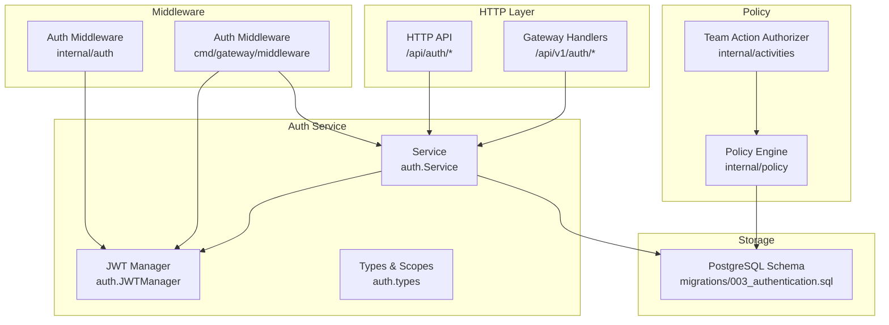
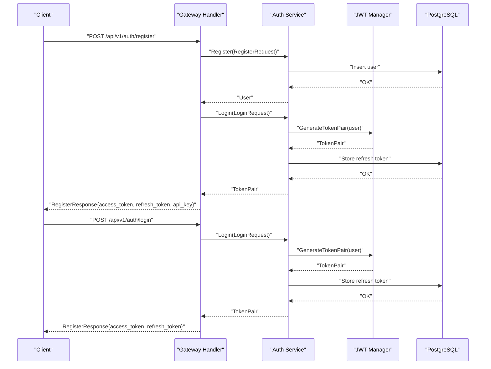
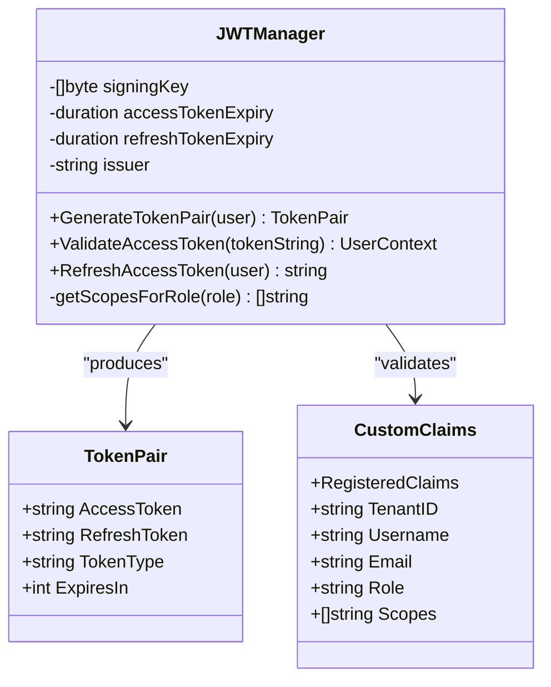
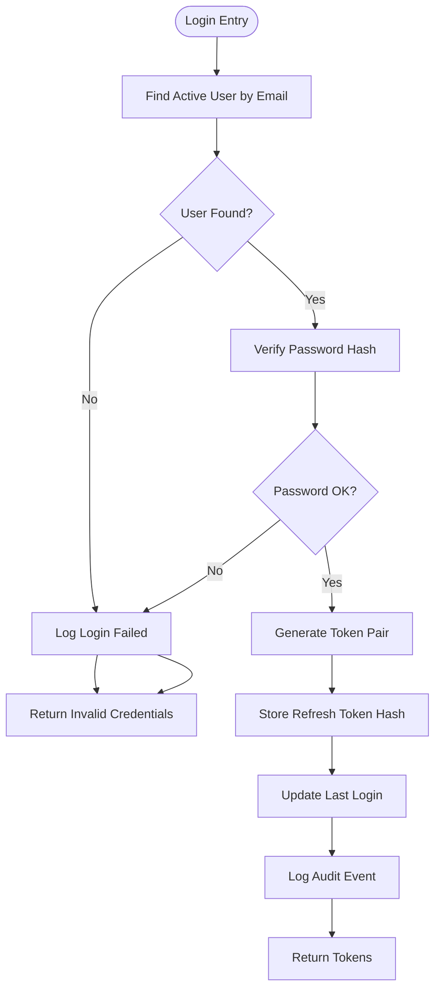
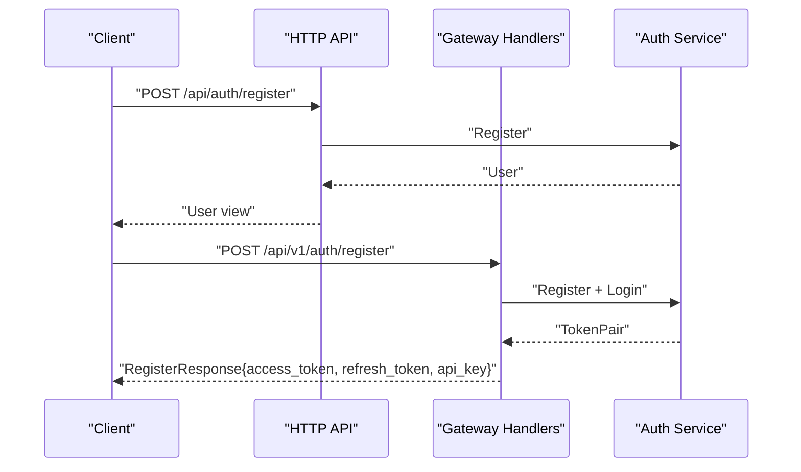
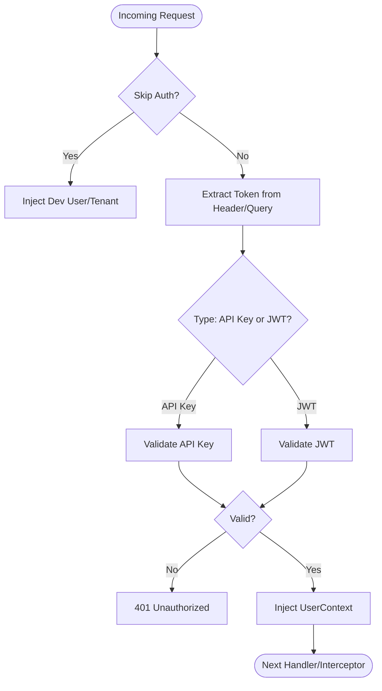
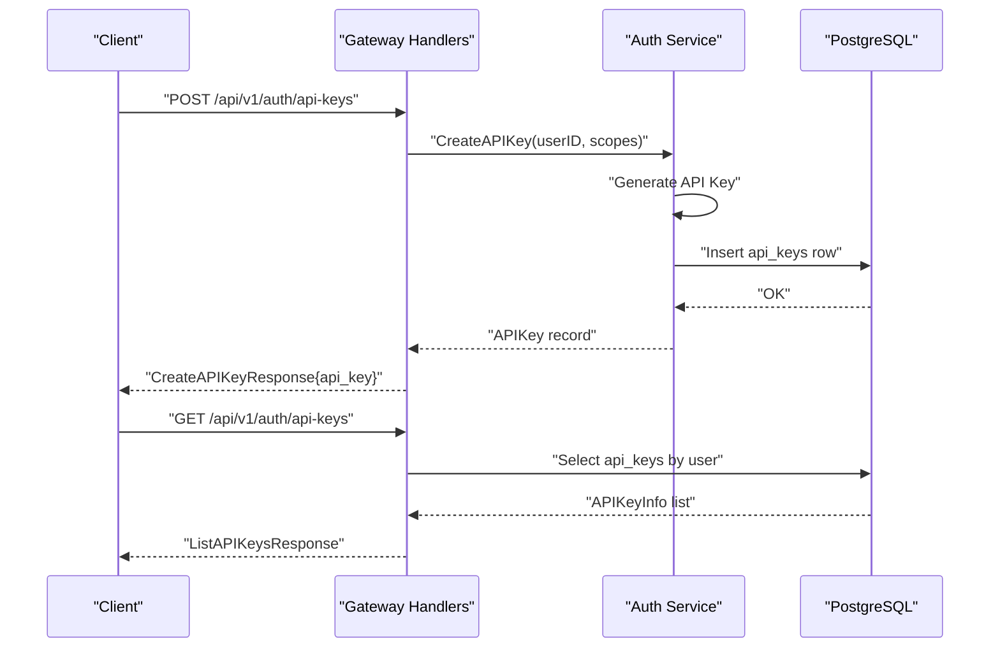
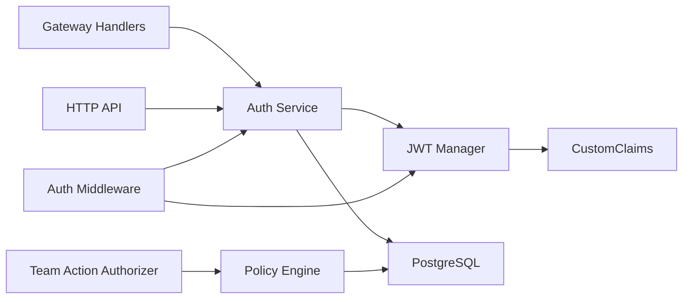
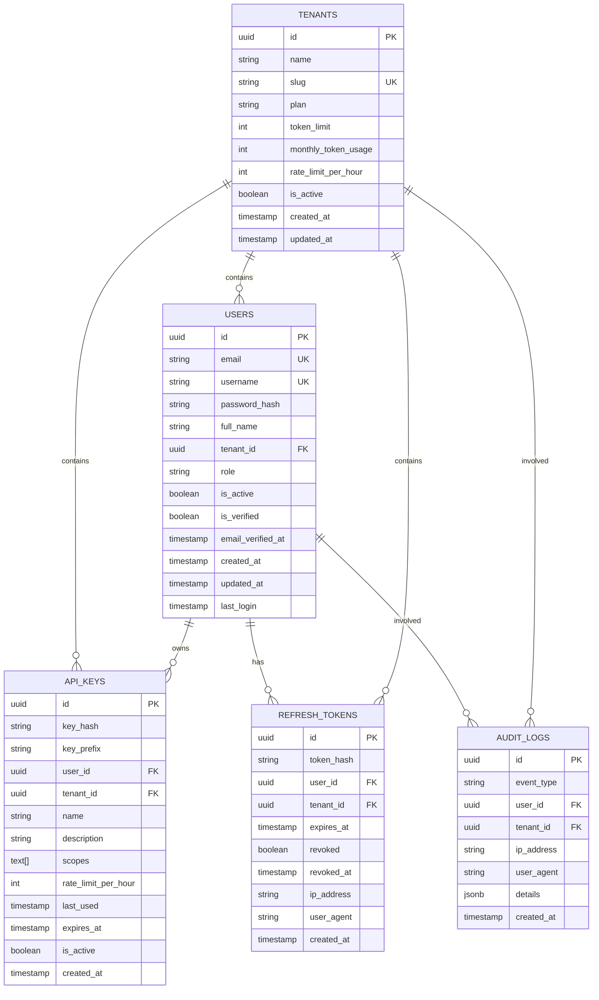

# Authentication & Authorization

<cite>
**Referenced Files in This Document**
- [jwt.go](file://go/orchestrator/internal/auth/jwt.go)
- [middleware.go](file://go/orchestrator/internal/auth/middleware.go)
- [service.go](file://go/orchestrator/internal/auth/service.go)
- [types.go](file://go/orchestrator/internal/auth/types.go)
- [auth.go](file://go/orchestrator/internal/httpapi/auth.go)
- [auth.go](file://go/orchestrator/cmd/gateway/internal/handlers/auth.go)
- [auth.go](file://go/orchestrator/cmd/gateway/internal/middleware/auth.go)
- [authorization.go](file://go/orchestrator/internal/activities/authorization.go)
- [engine.go](file://go/orchestrator/internal/policy/engine.go)
- [003_authentication.sql](file://migrations/postgres/003_authentication.sql)
</cite>

## Table of Contents
1. [Introduction](#introduction)
2. [Project Structure](#project-structure)
3. [Core Components](#core-components)
4. [Architecture Overview](#architecture-overview)
5. [Detailed Component Analysis](#detailed-component-analysis)
6. [Dependency Analysis](#dependency-analysis)
7. [Performance Considerations](#performance-considerations)
8. [Troubleshooting Guide](#troubleshooting-guide)
9. [Conclusion](#conclusion)
10. [Appendices](#appendices)

## Introduction
This document provides comprehensive authentication and authorization guidance for the platform. It covers JWT token lifecycle (generation, validation, refresh), API key management, multi-tenant isolation, user context propagation, role-based access control (RBAC), tenant scoping, permission enforcement, authentication middleware, header propagation, session management, OAuth integration points, and security best practices. It also includes examples of authenticated requests, token acquisition flows, error handling, token rotation, and audit logging.

## Project Structure
Authentication and authorization spans several layers:
- HTTP API handlers expose registration, login, refresh, and API key management endpoints.
- An authentication service manages users, tenants, API keys, and JWT refresh tokens.
- JWT utilities define token claims, signing, validation, and bearer extraction.
- Middleware enforces authentication for HTTP and gRPC, propagating user context.
- Policy engine supports dynamic authorization decisions (team actions and broader policy enforcement).
- Database schema defines tenants, users, API keys, refresh tokens, and audit logs.



**Diagram sources**
- [auth.go](file://go/orchestrator/cmd/gateway/internal/handlers/auth.go#L166-L393)
- [auth.go](file://go/orchestrator/internal/httpapi/auth.go#L26-L122)
- [service.go](file://go/orchestrator/internal/auth/service.go#L25-L36)
- [jwt.go](file://go/orchestrator/internal/auth/jwt.go#L17-L33)
- [types.go](file://go/orchestrator/internal/auth/types.go#L165-L182)
- [auth.go](file://go/orchestrator/cmd/gateway/internal/middleware/auth.go#L24-L46)
- [middleware.go](file://go/orchestrator/internal/auth/middleware.go#L23-L37)
- [authorization.go](file://go/orchestrator/internal/activities/authorization.go#L25-L39)
- [engine.go](file://go/orchestrator/internal/policy/engine.go#L21-L30)
- [003_authentication.sql](file://migrations/postgres/003_authentication.sql#L8-L104)

**Section sources**
- [auth.go](file://go/orchestrator/cmd/gateway/internal/handlers/auth.go#L166-L393)
- [auth.go](file://go/orchestrator/internal/httpapi/auth.go#L26-L122)
- [service.go](file://go/orchestrator/internal/auth/service.go#L25-L36)
- [jwt.go](file://go/orchestrator/internal/auth/jwt.go#L17-L33)
- [types.go](file://go/orchestrator/internal/auth/types.go#L165-L182)
- [auth.go](file://go/orchestrator/cmd/gateway/internal/middleware/auth.go#L24-L46)
- [middleware.go](file://go/orchestrator/internal/auth/middleware.go#L23-L37)
- [authorization.go](file://go/orchestrator/internal/activities/authorization.go#L25-L39)
- [engine.go](file://go/orchestrator/internal/policy/engine.go#L21-L30)
- [003_authentication.sql](file://migrations/postgres/003_authentication.sql#L8-L104)

## Core Components
- JWT Manager: Generates access tokens with custom claims, validates tokens, and refreshes access tokens.
- Authentication Service: Registers users, logs in users, issues token pairs, stores refresh tokens, validates API keys, and logs audit events.
- HTTP Handlers: Expose endpoints for registration, login, refresh, and API key management.
- Middleware: Enforces authentication for HTTP and gRPC, extracts tokens from headers or query parameters, and injects user context.
- Policy Engine: Evaluates dynamic authorization decisions (e.g., team actions) using Rego policies.
- Database Schema: Defines tenants, users, API keys, refresh tokens, and audit logs.

**Section sources**
- [jwt.go](file://go/orchestrator/internal/auth/jwt.go#L17-L33)
- [service.go](file://go/orchestrator/internal/auth/service.go#L18-L36)
- [auth.go](file://go/orchestrator/internal/httpapi/auth.go#L11-L31)
- [auth.go](file://go/orchestrator/cmd/gateway/internal/handlers/auth.go#L22-L42)
- [middleware.go](file://go/orchestrator/internal/auth/middleware.go#L23-L37)
- [authorization.go](file://go/orchestrator/internal/activities/authorization.go#L25-L39)
- [engine.go](file://go/orchestrator/internal/policy/engine.go#L21-L30)
- [003_authentication.sql](file://migrations/postgres/003_authentication.sql#L11-L104)

## Architecture Overview
The authentication subsystem integrates HTTP and gRPC gateways with the auth service and JWT manager. Tokens are propagated via Authorization headers or query parameters for streaming endpoints. API keys are supported as an alternative to JWTs. User context is injected into request contexts for downstream services. Policy decisions can augment RBAC for dynamic enforcement.



**Diagram sources**
- [auth.go](file://go/orchestrator/cmd/gateway/internal/handlers/auth.go#L166-L274)
- [service.go](file://go/orchestrator/internal/auth/service.go#L38-L168)
- [jwt.go](file://go/orchestrator/internal/auth/jwt.go#L45-L64)
- [003_authentication.sql](file://migrations/postgres/003_authentication.sql#L44-L74)

**Section sources**
- [auth.go](file://go/orchestrator/cmd/gateway/internal/handlers/auth.go#L166-L274)
- [service.go](file://go/orchestrator/internal/auth/service.go#L38-L168)
- [jwt.go](file://go/orchestrator/internal/auth/jwt.go#L45-L64)
- [003_authentication.sql](file://migrations/postgres/003_authentication.sql#L44-L74)

## Detailed Component Analysis

### JWT Token Management
- Claims: Subject (user ID), Issuer, IssuedAt, ExpiresAt, NotBefore, ID; plus TenantID, Username, Email, Role, Scopes.
- Access token generation: Uses HS256 signing with a shared secret; scopes derived from role.
- Validation: Verifies signing method, issuer, and parses UUIDs; returns UserContext.
- Refresh: Stores refresh token hash in DB; refresh endpoint rotates tokens atomically.



**Diagram sources**
- [jwt.go](file://go/orchestrator/internal/auth/jwt.go#L17-L33)
- [jwt.go](file://go/orchestrator/internal/auth/jwt.go#L45-L64)
- [jwt.go](file://go/orchestrator/internal/auth/jwt.go#L94-L143)
- [jwt.go](file://go/orchestrator/internal/auth/jwt.go#L150-L177)

**Section sources**
- [jwt.go](file://go/orchestrator/internal/auth/jwt.go#L17-L33)
- [jwt.go](file://go/orchestrator/internal/auth/jwt.go#L45-L64)
- [jwt.go](file://go/orchestrator/internal/auth/jwt.go#L94-L143)
- [jwt.go](file://go/orchestrator/internal/auth/jwt.go#L150-L177)

### Authentication Service
- Registration: Checks uniqueness, hashes password, assigns role, creates tenant if needed, logs audit.
- Login: Finds active user, verifies password, generates token pair, stores refresh token, updates last login, logs audit.
- Refresh: Validates refresh token, reissues tokens atomically, revokes old token, updates last login, logs audit.
- API Key Validation: Constant-time hash comparison, expiration checks, rate-limit metadata, logs audit.
- API Key Creation: Generates key with hash/prefix, sets default scopes, persists record, logs audit.



**Diagram sources**
- [service.go](file://go/orchestrator/internal/auth/service.go#L118-L168)
- [service.go](file://go/orchestrator/internal/auth/service.go#L171-L241)

**Section sources**
- [service.go](file://go/orchestrator/internal/auth/service.go#L38-L168)
- [service.go](file://go/orchestrator/internal/auth/service.go#L171-L241)
- [service.go](file://go/orchestrator/internal/auth/service.go#L243-L322)
- [service.go](file://go/orchestrator/internal/auth/service.go#L324-L390)

### HTTP API Endpoints
- Minimal HTTP endpoints: POST /api/auth/register, POST /api/auth/login, POST /api/auth/refresh.
- V1 gateway endpoints: POST /api/v1/auth/register, POST /api/v1/auth/login, POST /api/v1/auth/refresh, GET/POST /api/v1/auth/me, POST /api/v1/auth/refresh-key, GET/POST /api/v1/auth/api-keys.



**Diagram sources**
- [auth.go](file://go/orchestrator/internal/httpapi/auth.go#L26-L31)
- [auth.go](file://go/orchestrator/internal/httpapi/auth.go#L33-L94)
- [auth.go](file://go/orchestrator/cmd/gateway/internal/handlers/auth.go#L166-L274)

**Section sources**
- [auth.go](file://go/orchestrator/internal/httpapi/auth.go#L26-L31)
- [auth.go](file://go/orchestrator/internal/httpapi/auth.go#L33-L94)
- [auth.go](file://go/orchestrator/cmd/gateway/internal/handlers/auth.go#L166-L274)

### Authentication Middleware
- HTTP Middleware: Extracts Authorization header or X-API-Key; supports Bearer tokens and API keys; handles SSE/WebSocket via query params; injects UserContext into request context.
- gRPC Interceptor: Extracts metadata from incoming context; supports authorization header and x-api-key; injects UserContext; skips auth for health checks; respects dev-mode headers.
- Scope Enforcement: RequireScopes checks required scopes against user context.



**Diagram sources**
- [middleware.go](file://go/orchestrator/internal/auth/middleware.go#L39-L114)
- [middleware.go](file://go/orchestrator/internal/auth/middleware.go#L116-L193)
- [middleware.go](file://go/orchestrator/internal/auth/middleware.go#L195-L217)
- [auth.go](file://go/orchestrator/cmd/gateway/internal/middleware/auth.go#L48-L157)

**Section sources**
- [middleware.go](file://go/orchestrator/internal/auth/middleware.go#L39-L114)
- [middleware.go](file://go/orchestrator/internal/auth/middleware.go#L116-L193)
- [middleware.go](file://go/orchestrator/internal/auth/middleware.go#L195-L217)
- [auth.go](file://go/orchestrator/cmd/gateway/internal/middleware/auth.go#L48-L157)

### RBAC, Tenant Scoping, and Permission Enforcement
- Roles: user, admin, owner; scopes assigned per role; RequireScopes enforces permissions.
- Tenant isolation: Users and API keys are bound to TenantID; DB queries scoped by tenant; audit logs capture tenant context.
- Dynamic authorization: Team actions evaluated via policy engine; policy input enriched with session, user, agent, and context.

```mermaid
classDiagram
class UserContext {
+UUID UserID
+UUID TenantID
+string Username
+string Email
+string Role
+[]string Scopes
+bool IsAPIKey
+string TokenType
}
class Scopes {
<<constants>>
"workflows : read"
"workflows : write"
"agents : execute"
"sessions : read"
"sessions : write"
"api_keys : manage"
"users : manage"
"tenant : manage"
}
class Roles {
<<constants>>
"user"
"admin"
"owner"
}
UserContext --> Scopes : "has"
UserContext --> Roles : "has"
```

**Diagram sources**
- [types.go](file://go/orchestrator/internal/auth/types.go#L104-L117)
- [types.go](file://go/orchestrator/internal/auth/types.go#L165-L182)

**Section sources**
- [types.go](file://go/orchestrator/internal/auth/types.go#L165-L182)
- [middleware.go](file://go/orchestrator/internal/auth/middleware.go#L195-L217)
- [authorization.go](file://go/orchestrator/internal/activities/authorization.go#L25-L39)
- [engine.go](file://go/orchestrator/internal/policy/engine.go#L32-L60)

### API Key Management
- Generation: Random 32 bytes, formatted as sk_<hex>; hash and prefix stored; default scopes applied if none provided.
- Validation: Lookup by key prefix, constant-time hash comparison, expiration check, last-used update, user lookup, audit logging.
- Operations: List, Create, Revoke, Refresh (regenerate with optional revocation of previous key).



**Diagram sources**
- [service.go](file://go/orchestrator/internal/auth/service.go#L324-L390)
- [auth.go](file://go/orchestrator/cmd/gateway/internal/handlers/auth.go#L572-L631)
- [auth.go](file://go/orchestrator/cmd/gateway/internal/handlers/auth.go#L511-L570)

**Section sources**
- [service.go](file://go/orchestrator/internal/auth/service.go#L324-L390)
- [auth.go](file://go/orchestrator/cmd/gateway/internal/handlers/auth.go#L572-L631)
- [auth.go](file://go/orchestrator/cmd/gateway/internal/handlers/auth.go#L511-L570)

### Session Management
- Sessions are tenant-scoped; user context injected via middleware; refresh tokens enable long-lived sessions with short-lived access tokens.
- Streaming endpoints support API key propagation via query parameters for browsers’ EventSource limitations.

**Section sources**
- [003_authentication.sql](file://migrations/postgres/003_authentication.sql#L88-L104)
- [middleware.go](file://go/orchestrator/internal/auth/middleware.go#L73-L90)

### OAuth Integration Points
- External identity providers can integrate by issuing JWTs compatible with the platform’s validation logic (issuer, claims, signing method).
- API key mode supports programmatic integrations without JWT issuance.
- Token normalization and detection logic accommodates external API key formats (sk-shannon-xxx → sk_xxx).

**Section sources**
- [auth.go](file://go/orchestrator/cmd/gateway/internal/middleware/auth.go#L192-L223)
- [jwt.go](file://go/orchestrator/internal/auth/jwt.go#L202-L210)

### Examples of Authenticated Requests
- Using Bearer token:
  - Authorization: Bearer <access_token>
- Using API key:
  - X-API-Key: <api_key>
  - Or for streaming: ?api_key=<api_key>
- Token acquisition:
  - POST /api/v1/auth/register → receive access_token, refresh_token, optional api_key
  - POST /api/v1/auth/login → receive access_token, refresh_token
  - POST /api/v1/auth/refresh → receive new access_token, refresh_token
- API key operations:
  - POST /api/v1/auth/api-keys → create key
  - GET /api/v1/auth/api-keys → list keys
  - POST /api/v1/auth/refresh-key → regenerate key
  - DELETE /api/v1/auth/api-keys/{id} → revoke key

**Section sources**
- [auth.go](file://go/orchestrator/cmd/gateway/internal/handlers/auth.go#L276-L393)
- [auth.go](file://go/orchestrator/internal/httpapi/auth.go#L96-L122)
- [auth.go](file://go/orchestrator/cmd/gateway/internal/handlers/auth.go#L572-L631)
- [auth.go](file://go/orchestrator/cmd/gateway/internal/handlers/auth.go#L511-L570)
- [auth.go](file://go/orchestrator/cmd/gateway/internal/handlers/auth.go#L458-L509)

### Error Handling
- HTTP handlers return structured errors with codes and messages; sanitize error outputs for clients.
- Middleware returns 401 for missing/unauthorized auth; 403 for insufficient scopes.
- Audit logs capture security events (login, logout, token refresh, API key creation/use/deletion).

**Section sources**
- [auth.go](file://go/orchestrator/internal/httpapi/auth.go#L131-L140)
- [auth.go](file://go/orchestrator/cmd/gateway/internal/handlers/auth.go#L687-L694)
- [middleware.go](file://go/orchestrator/internal/auth/middleware.go#L195-L217)
- [service.go](file://go/orchestrator/internal/auth/service.go#L444-L465)

## Dependency Analysis
- JWT Manager depends on the shared signing secret and claims structure.
- Auth Service depends on DB for users, tenants, API keys, refresh tokens, and audit logs.
- HTTP and gRPC middleware depend on Auth Service and JWT Manager for validation.
- Policy engine depends on OPA and policy files; team action authorizer depends on policy engine.



**Diagram sources**
- [jwt.go](file://go/orchestrator/internal/auth/jwt.go#L17-L33)
- [types.go](file://go/orchestrator/internal/auth/types.go#L36-L52)
- [service.go](file://go/orchestrator/internal/auth/service.go#L18-L36)
- [auth.go](file://go/orchestrator/cmd/gateway/internal/handlers/auth.go#L22-L42)
- [auth.go](file://go/orchestrator/internal/httpapi/auth.go#L16-L24)
- [auth.go](file://go/orchestrator/cmd/gateway/internal/middleware/auth.go#L24-L46)
- [authorization.go](file://go/orchestrator/internal/activities/authorization.go#L25-L39)
- [engine.go](file://go/orchestrator/internal/policy/engine.go#L85-L93)

**Section sources**
- [jwt.go](file://go/orchestrator/internal/auth/jwt.go#L17-L33)
- [service.go](file://go/orchestrator/internal/auth/service.go#L18-L36)
- [auth.go](file://go/orchestrator/cmd/gateway/internal/handlers/auth.go#L22-L42)
- [auth.go](file://go/orchestrator/internal/httpapi/auth.go#L16-L24)
- [auth.go](file://go/orchestrator/cmd/gateway/internal/middleware/auth.go#L24-L46)
- [authorization.go](file://go/orchestrator/internal/activities/authorization.go#L25-L39)
- [engine.go](file://go/orchestrator/internal/policy/engine.go#L85-L93)

## Performance Considerations
- Token validation is CPU-bound; caching refresh token hashes reduces DB lookups.
- API key validation uses prefix-first lookup followed by constant-time hash comparison.
- Sliding window rate limiting in gateway handlers mitigates brute-force attempts.
- Policy engine includes an LRU cache for decisions; consider external caching for high-throughput scenarios.

[No sources needed since this section provides general guidance]

## Troubleshooting Guide
Common issues and resolutions:
- Invalid authorization header: Ensure “Bearer” prefix and valid token format.
- Invalid API key: Confirm key format and prefix; normalize sk-shannon-xxx to sk_xxx; verify active status and expiration.
- Invalid token: Check issuer, expiration, and signing key; rotate tokens if expired.
- Missing authentication: Provide either Authorization: Bearer or X-API-Key; for streaming endpoints use query param api_key.
- Permission denied: Verify user role and required scopes; adjust scopes or role accordingly.
- Audit logs: Review auth.audit_logs for login, token refresh, API key events, and permission changes.

**Section sources**
- [jwt.go](file://go/orchestrator/internal/auth/jwt.go#L202-L210)
- [auth.go](file://go/orchestrator/cmd/gateway/internal/middleware/auth.go#L192-L223)
- [middleware.go](file://go/orchestrator/internal/auth/middleware.go#L195-L217)
- [service.go](file://go/orchestrator/internal/auth/service.go#L444-L465)
- [003_authentication.sql](file://migrations/postgres/003_authentication.sql#L76-L86)

## Conclusion
The platform implements robust authentication and authorization through JWT-based access tokens, API keys, multi-tenant isolation, and RBAC. Middleware enforces authentication across HTTP and gRPC, while policy-based dynamic authorization extends control for specialized workflows. Audit logging and token rotation support security and operational hygiene.

[No sources needed since this section summarizes without analyzing specific files]

## Appendices

### Data Model Overview


**Diagram sources**
- [003_authentication.sql](file://migrations/postgres/003_authentication.sql#L11-L104)