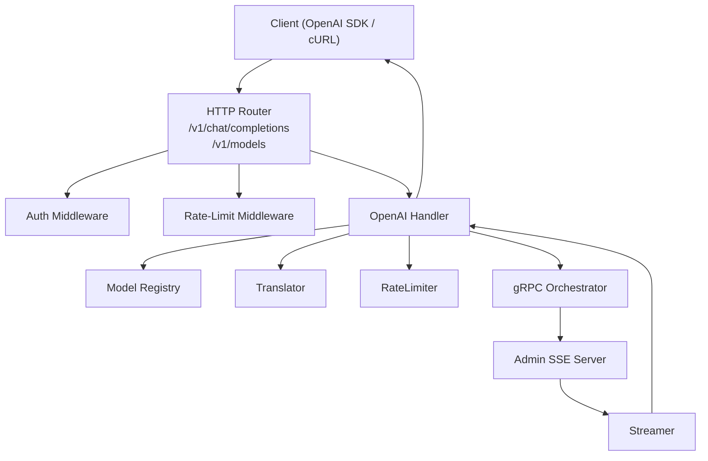
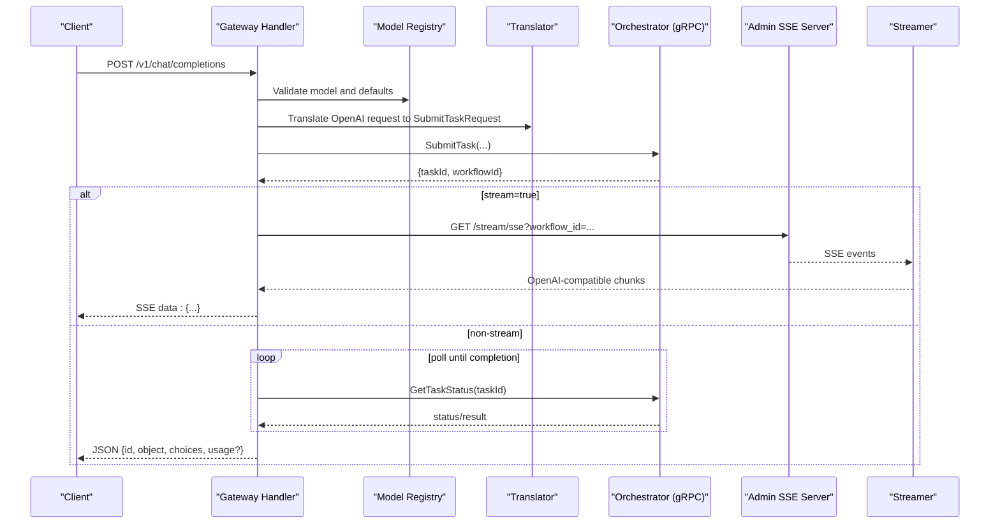
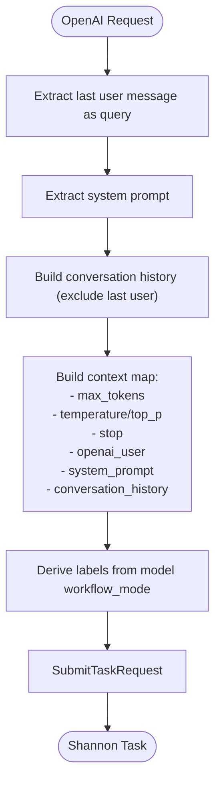
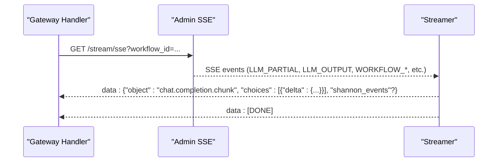
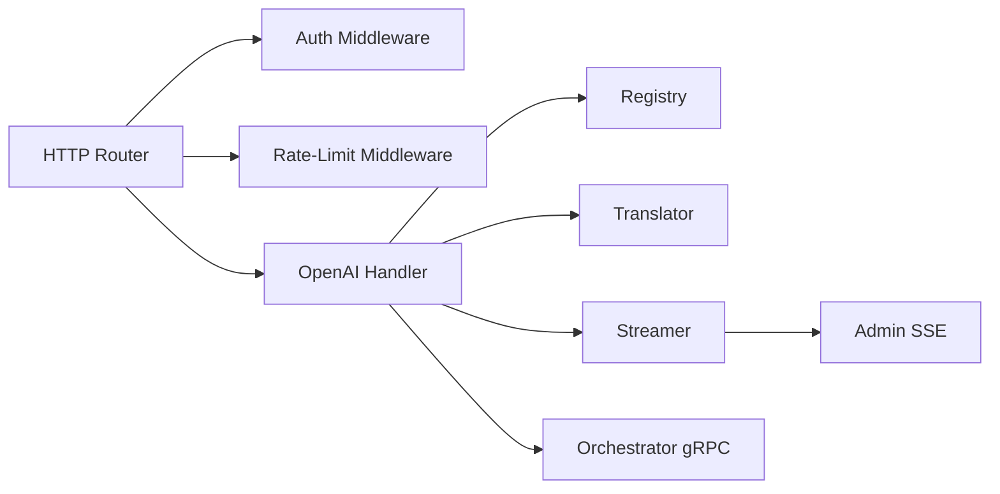

# OpenAI-Compatible API

<cite>
**Referenced Files in This Document**
- [examples/openai-sdk/README.md](file://examples/openai-sdk/README.md)
- [examples/openai-sdk/python_example.py](file://examples/openai-sdk/python_example.py)
- [examples/openai-sdk/curl_examples.sh](file://examples/openai-sdk/curl_examples.sh)
- [go/orchestrator/cmd/gateway/main.go](file://go/orchestrator/cmd/gateway/main.go)
- [go/orchestrator/cmd/gateway/internal/openai/handler.go](file://go/orchestrator/cmd/gateway/internal/openai/handler.go)
- [go/orchestrator/cmd/gateway/internal/openai/types.go](file://go/orchestrator/cmd/gateway/internal/openai/types.go)
- [go/orchestrator/cmd/gateway/internal/openai/translator.go](file://go/orchestrator/cmd/gateway/internal/openai/translator.go)
- [go/orchestrator/cmd/gateway/internal/openai/streamer.go](file://go/orchestrator/cmd/gateway/internal/openai/streamer.go)
- [go/orchestrator/cmd/gateway/internal/openai/registry.go](file://go/orchestrator/cmd/gateway/internal/openai/registry.go)
- [go/orchestrator/cmd/gateway/internal/middleware/auth.go](file://go/orchestrator/cmd/gateway/internal/middleware/auth.go)
- [go/orchestrator/cmd/gateway/internal/middleware/ratelimit.go](file://go/orchestrator/cmd/gateway/internal/middleware/ratelimit.go)
- [config/openai_models.yaml](file://config/openai_models.yaml)
- [config/models.yaml](file://config/models.yaml)
</cite>

## Table of Contents
1. [Introduction](#introduction)
2. [Project Structure](#project-structure)
3. [Core Components](#core-components)
4. [Architecture Overview](#architecture-overview)
5. [Detailed Component Analysis](#detailed-component-analysis)
6. [Dependency Analysis](#dependency-analysis)
7. [Performance Considerations](#performance-considerations)
8. [Troubleshooting Guide](#troubleshooting-guide)
9. [Conclusion](#conclusion)
10. [Appendices](#appendices)

## Introduction
This document describes the OpenAI-compatible API implemented by the gateway for drop-in compatibility with existing OpenAI SDKs and tooling. It covers:
- Endpoints: POST /v1/chat/completions and GET /v1/models (with model introspection)
- Request/response schemas and parameter mapping from OpenAI format to Shannon internals
- Streaming with Server-Sent Events (SSE) and optional usage inclusion
- Authentication, rate limiting, and error responses
- Python SDK and cURL examples
- Model mapping, temperature handling, and response formatting differences
- Migration guidance from OpenAI SDKs and compatibility limitations

## Project Structure
The OpenAI-compatible API is implemented in the gateway service and wired into the HTTP router. The key pieces are:
- HTTP router registers /v1/* endpoints and applies middleware
- OpenAI handler parses requests, validates models, enforces rate limits, resolves sessions, translates to internal tasks, and streams responses
- Translator maps OpenAI request fields to internal context and labels
- Streamer transforms internal SSE events into OpenAI-compatible chunks
- Registry defines available models and default limits
- Auth and rate-limit middleware enforce security and quotas

**Diagram sources**
- [go/orchestrator/cmd/gateway/main.go](file://go/orchestrator/cmd/gateway/main.go#L502-L538)
- [go/orchestrator/cmd/gateway/internal/openai/handler.go](file://go/orchestrator/cmd/gateway/internal/openai/handler.go#L63-L190)
- [go/orchestrator/cmd/gateway/internal/openai/translator.go](file://go/orchestrator/cmd/gateway/internal/openai/translator.go#L32-L99)
- [go/orchestrator/cmd/gateway/internal/openai/streamer.go](file://go/orchestrator/cmd/gateway/internal/openai/streamer.go#L93-L227)
- [go/orchestrator/cmd/gateway/internal/openai/registry.go](file://go/orchestrator/cmd/gateway/internal/openai/registry.go#L104-L168)
- [go/orchestrator/cmd/gateway/internal/middleware/auth.go](file://go/orchestrator/cmd/gateway/internal/middleware/auth.go#L48-L156)
- [go/orchestrator/cmd/gateway/internal/middleware/ratelimit.go](file://go/orchestrator/cmd/gateway/internal/middleware/ratelimit.go#L34-L74)

**Section sources**
- [go/orchestrator/cmd/gateway/main.go](file://go/orchestrator/cmd/gateway/main.go#L502-L538)

## Core Components
- OpenAI Handler: Parses requests, validates models, checks rate limits, resolves sessions, translates to internal tasks, and streams responses
- Translator: Converts OpenAI request fields (messages, parameters) into internal SubmitTaskRequest with context and labels
- Streamer: Transforms internal SSE events into OpenAI-compatible chunks, optionally including usage in the final chunk
- Registry: Provides model definitions, defaults, and rate-limit settings
- Auth Middleware: Supports API keys and JWTs; normalizes external API key format
- Rate-Limit Middleware: Enforces per-minute request quotas with Redis

**Section sources**
- [go/orchestrator/cmd/gateway/internal/openai/handler.go](file://go/orchestrator/cmd/gateway/internal/openai/handler.go#L63-L190)
- [go/orchestrator/cmd/gateway/internal/openai/translator.go](file://go/orchestrator/cmd/gateway/internal/openai/translator.go#L32-L99)
- [go/orchestrator/cmd/gateway/internal/openai/streamer.go](file://go/orchestrator/cmd/gateway/internal/openai/streamer.go#L93-L227)
- [go/orchestrator/cmd/gateway/internal/openai/registry.go](file://go/orchestrator/cmd/gateway/internal/openai/registry.go#L104-L168)
- [go/orchestrator/cmd/gateway/internal/middleware/auth.go](file://go/orchestrator/cmd/gateway/internal/middleware/auth.go#L48-L156)
- [go/orchestrator/cmd/gateway/internal/middleware/ratelimit.go](file://go/orchestrator/cmd/gateway/internal/middleware/ratelimit.go#L34-L74)

## Architecture Overview
The gateway exposes OpenAI-compatible endpoints and forwards requests to the orchestrator. Streaming responses are produced via SSE from the admin server and transformed into OpenAI-compatible chunks.

**Diagram sources**
- [go/orchestrator/cmd/gateway/internal/openai/handler.go](file://go/orchestrator/cmd/gateway/internal/openai/handler.go#L63-L190)
- [go/orchestrator/cmd/gateway/internal/openai/streamer.go](file://go/orchestrator/cmd/gateway/internal/openai/streamer.go#L93-L227)
- [go/orchestrator/cmd/gateway/internal/openai/translator.go](file://go/orchestrator/cmd/gateway/internal/openai/translator.go#L32-L99)
- [go/orchestrator/cmd/gateway/internal/openai/registry.go](file://go/orchestrator/cmd/gateway/internal/openai/registry.go#L104-L168)

## Detailed Component Analysis

### OpenAI-Compatible Endpoints

#### POST /v1/chat/completions
- Purpose: Chat completions with optional streaming
- Authentication: Required (API key or JWT)
- Rate limiting: Enforced per user/key
- Session management: Optional via X-Session-ID header
- Streaming: Enabled by stream=true; SSE chunks include OpenAI-compatible choices and optional shannon_events

Request schema (OpenAI-compatible):
- model: string (required if not configured in registry)
- messages: array of {role, content, name?}
- stream: boolean (optional)
- stream_options: {include_usage?: boolean} (optional)
- max_tokens: integer (optional)
- temperature: number (optional)
- top_p: number (optional)
- n: integer (optional)
- stop: string[] (optional)
- presence_penalty: number (optional)
- frequency_penalty: number (optional)
- user: string (optional)

Response schema (non-streaming):
- id: string
- object: "chat.completion"
- created: integer (unix timestamp)
- model: string
- choices: [{index, message: {role, content}, finish_reason}]
- usage?: {prompt_tokens, completion_tokens, total_tokens}

Response schema (streaming):
- Each SSE event is a "chat.completion.chunk"
- choices: [{index, delta: {role?, content}, finish_reason?}]
- shannon_events?: [{type, agent_id?, message?, timestamp?, payload?}] (Shannon-specific)
- Final event includes finish_reason and optional usage

Notes:
- Role is included in the first content chunk for streaming
- Usage is included in the final chunk when stream_options.include_usage is true
- Session ID is echoed back via X-Session-ID and X-Shannon-Session-ID headers

**Section sources**
- [go/orchestrator/cmd/gateway/internal/openai/types.go](file://go/orchestrator/cmd/gateway/internal/openai/types.go#L11-L82)
- [go/orchestrator/cmd/gateway/internal/openai/handler.go](file://go/orchestrator/cmd/gateway/internal/openai/handler.go#L63-L190)
- [go/orchestrator/cmd/gateway/internal/openai/streamer.go](file://go/orchestrator/cmd/gateway/internal/openai/streamer.go#L418-L477)

#### GET /v1/models
- Purpose: List available models and inspect model metadata
- Response: {object: "list", data: [{id, object: "model", created, owned_by}]}

Notes:
- Model descriptions are exposed via X-Model-Description header when retrieving a specific model

**Section sources**
- [go/orchestrator/cmd/gateway/internal/openai/handler.go](file://go/orchestrator/cmd/gateway/internal/openai/handler.go#L371-L417)
- [go/orchestrator/cmd/gateway/internal/openai/types.go](file://go/orchestrator/cmd/gateway/internal/openai/types.go#L94-L106)

#### GET /v1/models/{model}
- Purpose: Retrieve details for a specific model
- Response: {id, object: "model", created, owned_by}
- Header: X-Model-Description (when present)

**Section sources**
- [go/orchestrator/cmd/gateway/internal/openai/handler.go](file://go/orchestrator/cmd/gateway/internal/openai/handler.go#L389-L417)
- [go/orchestrator/cmd/gateway/internal/openai/types.go](file://go/orchestrator/cmd/gateway/internal/openai/types.go#L94-L106)

### Parameter Mapping: OpenAI to Shannon Internals

- model: mapped to workflow mode and injected context (e.g., force_research, research_strategy)
- messages: last user message becomes the query; system prompt extracted; conversation history included as context
- max_tokens: bounded by registry.max_tokens_limit; applied to internal context
- temperature/top_p: applied to internal context when provided; otherwise default from registry
- stop: converted to array for internal context
- user: stored as openai_user for tracking
- stream/stream_options: control SSE streaming and whether to include usage in final chunk

**Diagram sources**
- [go/orchestrator/cmd/gateway/internal/openai/translator.go](file://go/orchestrator/cmd/gateway/internal/openai/translator.go#L176-L289)

**Section sources**
- [go/orchestrator/cmd/gateway/internal/openai/translator.go](file://go/orchestrator/cmd/gateway/internal/openai/translator.go#L32-L99)
- [go/orchestrator/cmd/gateway/internal/openai/translator.go](file://go/orchestrator/cmd/gateway/internal/openai/translator.go#L176-L289)

### Streaming with Server-Sent Events (SSE)
- Gateway connects to Admin SSE server with workflow_id and subscribes to multiple event types
- Streamer filters and transforms events into OpenAI-compatible chunks
- Keepalive comments are emitted to maintain connections
- Final chunk includes finish_reason and optional usage

**Diagram sources**
- [go/orchestrator/cmd/gateway/internal/openai/handler.go](file://go/orchestrator/cmd/gateway/internal/openai/handler.go#L192-L289)
- [go/orchestrator/cmd/gateway/internal/openai/streamer.go](file://go/orchestrator/cmd/gateway/internal/openai/streamer.go#L93-L227)

**Section sources**
- [go/orchestrator/cmd/gateway/internal/openai/handler.go](file://go/orchestrator/cmd/gateway/internal/openai/handler.go#L192-L289)
- [go/orchestrator/cmd/gateway/internal/openai/streamer.go](file://go/orchestrator/cmd/gateway/internal/openai/streamer.go#L93-L227)

### Authentication Methods
- API Keys: Supported via Authorization: Bearer or X-API-Key
- JWT: Optional; detected by token format and validated if configured
- Token normalization: External format sk-shannon-xxx is normalized to internal sk_xxx
- Dev mode: GATEWAY_SKIP_AUTH enables bypass (development only)

Headers:
- Authorization: Bearer <token>
- X-API-Key: <api_key>
- X-Session-ID: <session_id> (multi-turn continuity)

**Section sources**
- [go/orchestrator/cmd/gateway/internal/middleware/auth.go](file://go/orchestrator/cmd/gateway/internal/middleware/auth.go#L159-L246)
- [go/orchestrator/cmd/gateway/internal/openai/handler.go](file://go/orchestrator/cmd/gateway/internal/openai/handler.go#L443-L502)

### Rate Limiting
- Per-user quota enforced via Redis with 1-minute windows
- Default: 60 requests/minute, burst 10
- Headers: X-RateLimit-Limit, X-RateLimit-Remaining, X-RateLimit-Reset, Retry-After
- Token-based accounting: usage recorded for streaming responses

**Section sources**
- [go/orchestrator/cmd/gateway/internal/middleware/ratelimit.go](file://go/orchestrator/cmd/gateway/internal/middleware/ratelimit.go#L15-L123)
- [go/orchestrator/cmd/gateway/internal/openai/handler.go](file://go/orchestrator/cmd/gateway/internal/openai/handler.go#L102-L119)

### Error Responses
- OpenAI-compatible error format: {error: {message, type, param, code}}
- Common types: invalid_request_error, authentication_error, permission_error, not_found_error, rate_limit_error, server_error
- Codes: invalid_request, invalid_api_key, model_not_found, rate_limit_exceeded, insufficient_quota, internal_error

**Section sources**
- [go/orchestrator/cmd/gateway/internal/openai/types.go](file://go/orchestrator/cmd/gateway/internal/openai/types.go#L108-L150)
- [go/orchestrator/cmd/gateway/internal/openai/handler.go](file://go/orchestrator/cmd/gateway/internal/openai/handler.go#L508-L539)

### Model Mapping and Defaults
- Registry maps OpenAI-style model names to workflow modes and context
- Default model: shannon-chat
- Global limits: max_tokens_limit, default_temperature, session_ttl
- Model-specific rate limits apply when configured

Available models (as defined in registry/config):
- shannon-chat (simple)
- shannon-quick-research (research)
- shannon-standard-research (research)
- shannon-deep-research (research)
- shannon-academic-research (research)
- shannon-ads-research (simple)
- shannon-complex (supervisor)

**Section sources**
- [config/openai_models.yaml](file://config/openai_models.yaml#L8-L109)
- [go/orchestrator/cmd/gateway/internal/openai/registry.go](file://go/orchestrator/cmd/gateway/internal/openai/registry.go#L104-L168)
- [go/orchestrator/cmd/gateway/internal/openai/registry.go](file://go/orchestrator/cmd/gateway/internal/openai/registry.go#L225-L257)

### Temperature Settings and Response Formatting Differences
- Temperature/top_p are passed through when provided; otherwise default from registry
- Response formatting differences:
  - Streaming: role included in first content chunk; final chunk includes finish_reason and optional usage
  - Non-streaming: single JSON response with choices and usage
  - shannon_events: optional field in streaming chunks for agent lifecycle and progress

**Section sources**
- [go/orchestrator/cmd/gateway/internal/openai/translator.go](file://go/orchestrator/cmd/gateway/internal/openai/translator.go#L245-L254)
- [go/orchestrator/cmd/gateway/internal/openai/streamer.go](file://go/orchestrator/cmd/gateway/internal/openai/streamer.go#L418-L477)
- [go/orchestrator/cmd/gateway/internal/openai/types.go](file://go/orchestrator/cmd/gateway/internal/openai/types.go#L82-L92)

### Python SDK and cURL Examples
- Python SDK: Demonstrates listing models, simple chat, streaming, multi-turn, and deep research
- cURL: Shows model listing, non-streaming, streaming, session headers, rate limit headers, and shannon_events

Common environment variables:
- SHANNON_API_KEY
- SHANNON_BASE_URL (default: https://api.shannon.run/v1)

**Section sources**
- [examples/openai-sdk/README.md](file://examples/openai-sdk/README.md#L1-L166)
- [examples/openai-sdk/python_example.py](file://examples/openai-sdk/python_example.py#L1-L201)
- [examples/openai-sdk/curl_examples.sh](file://examples/openai-sdk/curl_examples.sh#L1-L187)

## Dependency Analysis
The gateway composes several layers:
- HTTP routing and middleware stack
- OpenAI handler orchestrating translation, rate limiting, and streaming
- Translator and Registry for model mapping
- Streamer transforming SSE to OpenAI chunks
- Auth and rate-limit middleware

**Diagram sources**
- [go/orchestrator/cmd/gateway/main.go](file://go/orchestrator/cmd/gateway/main.go#L502-L538)
- [go/orchestrator/cmd/gateway/internal/openai/handler.go](file://go/orchestrator/cmd/gateway/internal/openai/handler.go#L63-L190)
- [go/orchestrator/cmd/gateway/internal/openai/translator.go](file://go/orchestrator/cmd/gateway/internal/openai/translator.go#L32-L99)
- [go/orchestrator/cmd/gateway/internal/openai/streamer.go](file://go/orchestrator/cmd/gateway/internal/openai/streamer.go#L93-L227)
- [go/orchestrator/cmd/gateway/internal/openai/registry.go](file://go/orchestrator/cmd/gateway/internal/openai/registry.go#L104-L168)

**Section sources**
- [go/orchestrator/cmd/gateway/main.go](file://go/orchestrator/cmd/gateway/main.go#L502-L538)

## Performance Considerations
- Streaming: SSE keepalive comments prevent idle timeouts; scanner buffers configurable via environment variables
- Long-running tasks: Non-streaming requests may wait up to 35 minutes for completion
- Token accounting: Usage recorded and forwarded to rate limiter for token-based quotas
- Connection tuning: WriteTimeout disabled for SSE; IdleTimeout set for long-lived connections

[No sources needed since this section provides general guidance]

## Troubleshooting Guide
- Authentication failures: Verify Authorization header or X-API-Key; ensure token normalization for external format
- Rate limit exceeded: Inspect X-RateLimit-* headers; adjust usage or wait for reset window
- Streaming issues: Confirm SSE connectivity to admin server; check for keepalive comments and [DONE] termination
- Model not found: Ensure model name matches registry; use GET /v1/models to list available models
- Session continuity: Provide X-Session-ID header for multi-turn conversations

**Section sources**
- [go/orchestrator/cmd/gateway/internal/middleware/auth.go](file://go/orchestrator/cmd/gateway/internal/middleware/auth.go#L159-L246)
- [go/orchestrator/cmd/gateway/internal/middleware/ratelimit.go](file://go/orchestrator/cmd/gateway/internal/middleware/ratelimit.go#L106-L123)
- [go/orchestrator/cmd/gateway/internal/openai/handler.go](file://go/orchestrator/cmd/gateway/internal/openai/handler.go#L192-L289)
- [go/orchestrator/cmd/gateway/internal/openai/handler.go](file://go/orchestrator/cmd/gateway/internal/openai/handler.go#L371-L417)

## Conclusion
The gateway provides a robust, drop-in OpenAI-compatible API with streaming support, model mapping, and comprehensive middleware for authentication and rate limiting. Applications using the OpenAI SDK can integrate seamlessly, with attention to streaming semantics, session headers, and model-specific behaviors.

[No sources needed since this section summarizes without analyzing specific files]

## Appendices

### API Definitions

- POST /v1/chat/completions
  - Headers: Authorization, X-API-Key, X-Session-ID (optional)
  - Body fields: model, messages, stream, stream_options, max_tokens, temperature, top_p, n, stop, presence_penalty, frequency_penalty, user
  - Response: Non-streaming JSON or SSE chunks with OpenAI-compatible schema

- GET /v1/models
  - Response: List of models with id, created, owned_by

- GET /v1/models/{model}
  - Response: Model details; X-Model-Description header may be present

**Section sources**
- [go/orchestrator/cmd/gateway/internal/openai/types.go](file://go/orchestrator/cmd/gateway/internal/openai/types.go#L11-L106)
- [go/orchestrator/cmd/gateway/internal/openai/handler.go](file://go/orchestrator/cmd/gateway/internal/openai/handler.go#L371-L417)

### Migration Guide from OpenAI SDKs
- Replace base URL with your gateway endpoint
- Use Authorization: Bearer <SHANNON_API_KEY>
- For streaming, ensure stream=true and handle SSE data: lines; the final [DONE] terminates the stream
- For usage reporting in streaming, set stream_options.include_usage=true to receive usage in the final chunk
- For multi-turn conversations, include X-Session-ID header to persist context
- Model names differ; consult GET /v1/models and map to shannon-* models

**Section sources**
- [examples/openai-sdk/README.md](file://examples/openai-sdk/README.md#L1-L166)
- [examples/openai-sdk/python_example.py](file://examples/openai-sdk/python_example.py#L1-L201)
- [examples/openai-sdk/curl_examples.sh](file://examples/openai-sdk/curl_examples.sh#L1-L187)

### Compatibility Limitations
- Model names: Use shannon-* models; mapping defined in registry
- Streaming: Requires SSE support; shannon_events extension is optional
- Rate limits: Enforced per user/key; token-based accounting may differ from provider-side limits
- Session management: Requires explicit X-Session-ID header for continuity

**Section sources**
- [config/openai_models.yaml](file://config/openai_models.yaml#L8-L109)
- [go/orchestrator/cmd/gateway/internal/openai/streamer.go](file://go/orchestrator/cmd/gateway/internal/openai/streamer.go#L314-L378)
- [go/orchestrator/cmd/gateway/internal/middleware/ratelimit.go](file://go/orchestrator/cmd/gateway/internal/middleware/ratelimit.go#L15-L123)