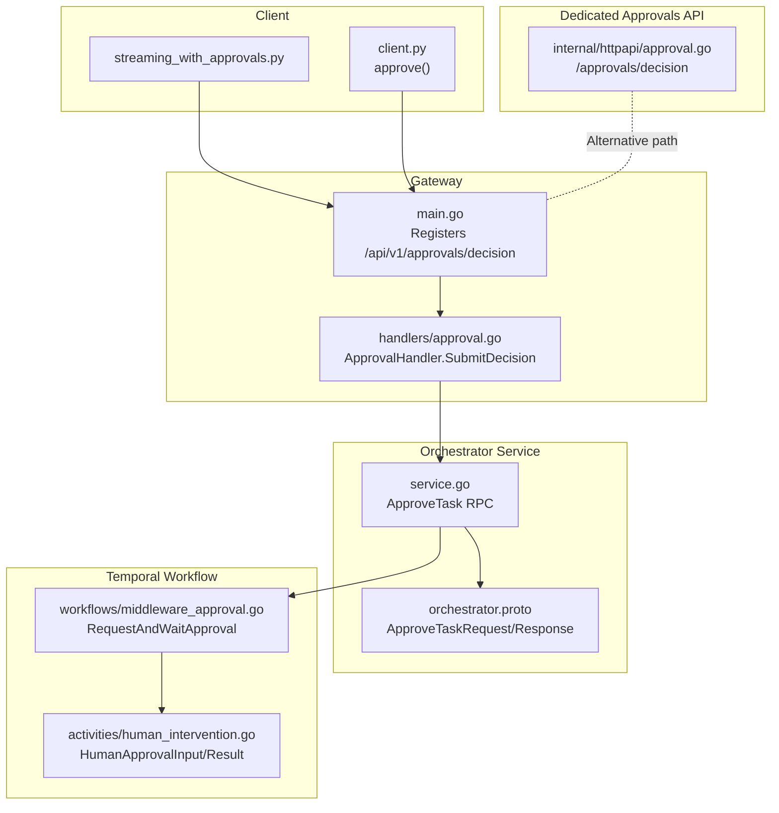
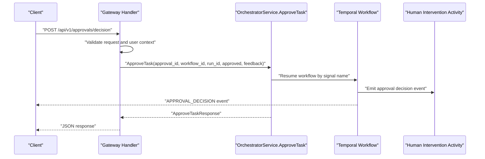
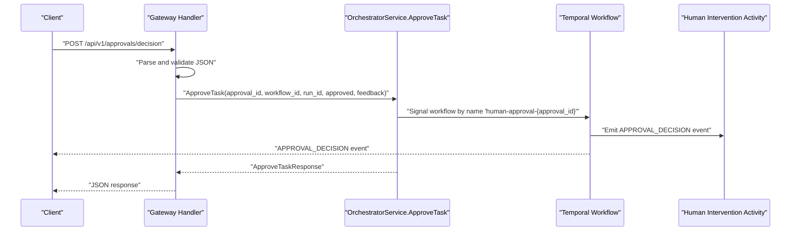
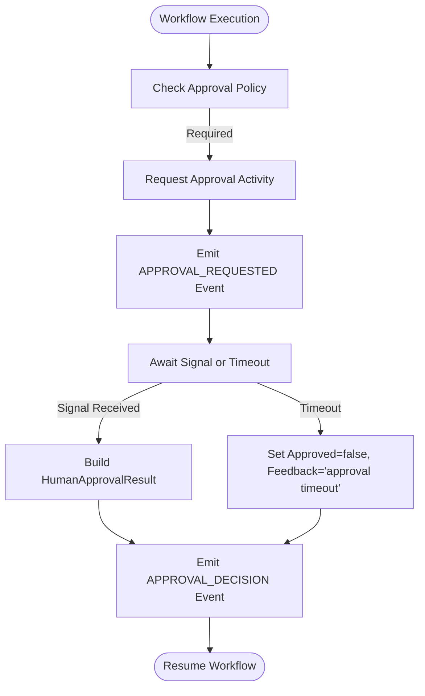
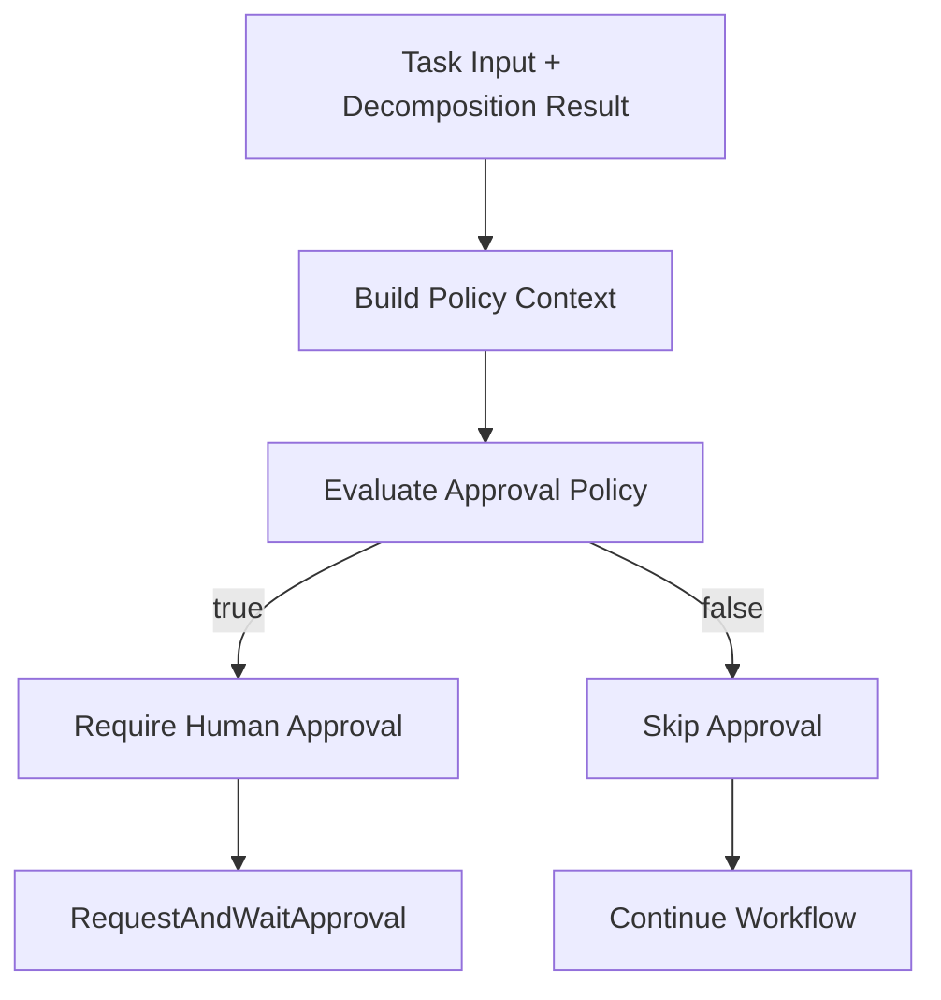
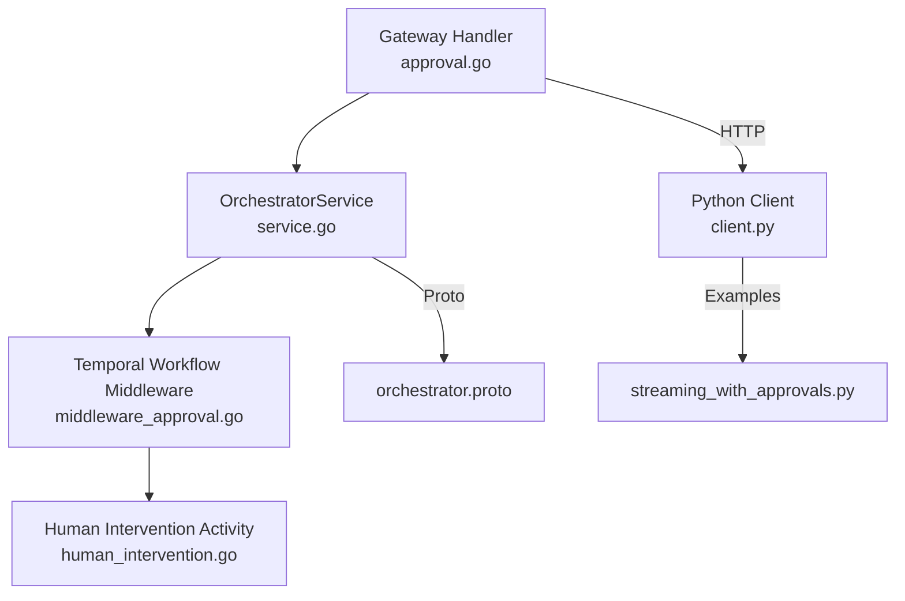

# Approval Workflow Endpoints

<cite>
**Referenced Files in This Document**
- [approval.go](file://go/orchestrator/cmd/gateway/internal/handlers/approval.go)
- [approval.go](file://go/orchestrator/internal/httpapi/approval.go)
- [middleware_approval.go](file://go/orchestrator/internal/workflows/middleware_approval.go)
- [main.go](file://go/orchestrator/cmd/gateway/main.go)
- [service.go](file://go/orchestrator/internal/server/service.go)
- [types.go](file://go/orchestrator/internal/activities/types.go)
- [human_intervention.go](file://go/orchestrator/internal/activities/human_intervention.go)
- [streaming_with_approvals.py](file://clients/python/examples/streaming_with_approvals.py)
- [client.py](file://clients/python/src/shannon/client.py)
- [README.md](file://clients/python/README.md)
- [README.md](file://go/orchestrator/cmd/gateway/README.md)
- [orchestrator.proto](file://python/llm-service/llm_service/grpc_gen/orchestrator/orchestrator_pb2.py)
</cite>

## Table of Contents
1. [Introduction](#introduction)
2. [Project Structure](#project-structure)
3. [Core Components](#core-components)
4. [Architecture Overview](#architecture-overview)
5. [Detailed Component Analysis](#detailed-component-analysis)
6. [Dependency Analysis](#dependency-analysis)
7. [Performance Considerations](#performance-considerations)
8. [Troubleshooting Guide](#troubleshooting-guide)
9. [Conclusion](#conclusion)
10. [Appendices](#appendices)

## Introduction
This document provides comprehensive documentation for the approval workflow REST endpoints and related systems. It covers:
- Retrieving pending approvals
- Submitting approval decisions
- Approval request creation and escalation
- Approval routing and state transitions
- Audit trail and notifications
- Security, delegation, and compliance considerations
- Integration patterns and examples

The approval workflow integrates HTTP endpoints, gRPC services, Temporal workflows, and event streaming to support human-in-the-loop controls for sensitive operations.

## Project Structure
The approval workflow spans multiple layers:
- Gateway HTTP server exposing REST endpoints
- Orchestrator gRPC service handling approval decisions
- Temporal-based workflow orchestration for approval signaling
- Event emission for audit and UI updates
- Client SDK and examples for end-to-end usage

**Diagram sources**
- [main.go](file://go/orchestrator/cmd/gateway/main.go#L316-L329)
- [approval.go](file://go/orchestrator/cmd/gateway/internal/handlers/approval.go#L44-L127)
- [service.go](file://go/orchestrator/internal/server/service.go#L2670-L2759)
- [middleware_approval.go](file://go/orchestrator/internal/workflows/middleware_approval.go#L46-L120)
- [human_intervention.go](file://go/orchestrator/internal/activities/human_intervention.go#L67-L120)
- [approval.go](file://go/orchestrator/internal/httpapi/approval.go#L44-L101)
- [streaming_with_approvals.py](file://clients/python/examples/streaming_with_approvals.py#L1-L102)
- [client.py](file://clients/python/src/shannon/client.py#L2259-L2265)
- [orchestrator.proto](file://python/llm-service/llm_service/grpc_gen/orchestrator/orchestrator_pb2.py#L1-L200)

**Section sources**
- [main.go](file://go/orchestrator/cmd/gateway/main.go#L316-L329)
- [approval.go](file://go/orchestrator/cmd/gateway/internal/handlers/approval.go#L1-L137)
- [approval.go](file://go/orchestrator/internal/httpapi/approval.go#L1-L123)
- [middleware_approval.go](file://go/orchestrator/internal/workflows/middleware_approval.go#L1-L121)
- [service.go](file://go/orchestrator/internal/server/service.go#L2670-L2759)
- [orchestrator.proto](file://python/llm-service/llm_service/grpc_gen/orchestrator/orchestrator_pb2.py#L1-L200)

## Core Components
- Gateway HTTP handler for submitting approval decisions
- Orchestrator gRPC service implementing ApproveTask RPC
- Temporal workflow middleware for requesting approvals and awaiting signals
- Human intervention activity for generating approval IDs and metadata
- Dedicated approvals HTTP server for direct decision submission
- Client SDK and example for streaming and auto-approval flows

Key responsibilities:
- Validate and authorize requests
- Convert HTTP payloads to gRPC requests
- Signal Temporal workflows with approval results
- Emit events for audit and UI updates
- Enforce timeouts and return structured responses

**Section sources**
- [approval.go](file://go/orchestrator/cmd/gateway/internal/handlers/approval.go#L15-L137)
- [approval.go](file://go/orchestrator/internal/httpapi/approval.go#L16-L123)
- [middleware_approval.go](file://go/orchestrator/internal/workflows/middleware_approval.go#L44-L121)
- [human_intervention.go](file://go/orchestrator/internal/activities/human_intervention.go#L67-L120)
- [service.go](file://go/orchestrator/internal/server/service.go#L2670-L2759)

## Architecture Overview
The approval workflow follows a layered architecture:
- HTTP ingress validates and authenticates requests
- Gateway forwards decisions to the Orchestrator gRPC service
- Orchestrator triggers a Temporal workflow to await human approval
- Upon receiving a decision (via dedicated approvals API or gateway), the workflow resumes and emits audit events

**Diagram sources**
- [approval.go](file://go/orchestrator/cmd/gateway/internal/handlers/approval.go#L44-L127)
- [service.go](file://go/orchestrator/internal/server/service.go#L2670-L2759)
- [middleware_approval.go](file://go/orchestrator/internal/workflows/middleware_approval.go#L70-L120)
- [orchestrator.proto](file://python/llm-service/llm_service/grpc_gen/orchestrator/orchestrator_pb2.py#L1-L200)

## Detailed Component Analysis

### Endpoint: POST /api/v1/approvals/decision
Purpose:
- Accepts human approval decisions for workflows requiring human oversight.

Request schema:
- workflow_id: string (required)
- run_id: string (optional)
- approval_id: string (required)
- approved: boolean (required)
- feedback: string (optional)
- modified_action: string (optional)
- approved_by: string (optional; defaults to authenticated user)

Response format:
- status: string ("sent")
- success: boolean
- message: string
- workflow_id: string
- run_id: string
- approval_id: string

Behavior:
- Validates presence of workflow_id and approval_id
- Uses authenticated user as approved_by if not provided
- Propagates auth/tracing headers to gRPC metadata
- Calls ApproveTask RPC on OrchestratorService
- Logs approval decision
- Returns JSON response

Error handling:
- Unauthorized if missing/invalid user context
- Bad Request for invalid JSON or missing fields
- Not Found for unknown workflow/approval
- Permission Denied for insufficient permissions
- Internal Server Error for other failures

Security:
- Requires authentication middleware
- Rate limiting and idempotency middleware applied
- Tracing headers propagated for observability

**Section sources**
- [approval.go](file://go/orchestrator/cmd/gateway/internal/handlers/approval.go#L32-L127)
- [main.go](file://go/orchestrator/cmd/gateway/main.go#L316-L329)

### Endpoint: GET /api/v1/approvals (pending approvals)
Purpose:
- Retrieve pending approval requests with optional filtering by user and session.

Request parameters:
- user_id: string (optional)
- session_id: string (optional)
- limit: integer (optional)
- offset: integer (optional)

Response format:
- approvals: array of PendingApproval objects
  - approval_id: string
  - workflow_id: string
  - query: string
  - proposed_action: string
  - reason: string
  - requested_at: timestamp
  - metadata: object

Behavior:
- Implemented in OrchestratorService.GetPendingApprovals RPC
- Filters by user_id and session_id when provided
- Returns paginated results

Note: The gateway does not directly expose GET /api/v1/approvals. Pending approvals are managed by the OrchestratorService and accessed via its RPC interface.

**Section sources**
- [service.go](file://go/orchestrator/internal/server/service.go#L2670-L2759)
- [orchestrator.proto](file://python/llm-service/llm_service/grpc_gen/orchestrator/orchestrator_pb2.py#L1-L200)

### Approval Decision Submission Flow
This flow covers the end-to-end process from HTTP request to workflow resumption and event emission.

**Diagram sources**
- [approval.go](file://go/orchestrator/cmd/gateway/internal/handlers/approval.go#L44-L127)
- [service.go](file://go/orchestrator/internal/server/service.go#L2670-L2759)
- [middleware_approval.go](file://go/orchestrator/internal/workflows/middleware_approval.go#L70-L120)

### Approval Request Creation and Escalation
Approval requests are created during workflow execution when policies require human oversight.

Creation:
- Workflow executes an activity to request approval
- Generates approval_id and associated metadata
- Emits APPROVAL_REQUESTED event for audit and UI

Escalation:
- Workflow awaits signal with configurable timeout
- On timeout, sets decision to denied with feedback
- Emits APPROVAL_DECISION event

**Diagram sources**
- [middleware_approval.go](file://go/orchestrator/internal/workflows/middleware_approval.go#L44-L121)
- [human_intervention.go](file://go/orchestrator/internal/activities/human_intervention.go#L67-L120)

### Approval Routing Based on Roles and Policies
Routing and policy evaluation:
- Approval policy considers complexity score, suggested tools, and configured thresholds
- Tools such as file_system and code_execution trigger approval requirements
- Policy evaluation occurs before requesting approvals

**Diagram sources**
- [middleware_approval.go](file://go/orchestrator/internal/workflows/middleware_approval.go#L12-L42)

### Audit Trail Generation and Notifications
Audit trail:
- APPROVAL_REQUESTED event emitted with approval_id and metadata
- APPROVAL_DECISION event emitted with decision outcome
- Events include timestamps and agent identifiers

Notifications:
- Clients can stream events to receive real-time updates
- Example demonstrates parsing approval_id from events and auto-submitting approvals

**Section sources**
- [middleware_approval.go](file://go/orchestrator/internal/workflows/middleware_approval.go#L70-L120)
- [streaming_with_approvals.py](file://clients/python/examples/streaming_with_approvals.py#L52-L83)

### Examples of Approval Scenarios
- Streaming with approvals: Demonstrates detecting APPROVAL_REQUESTED events and auto-submitting approvals
- CLI approve command: Shows how to submit approvals via the client CLI

**Section sources**
- [streaming_with_approvals.py](file://clients/python/examples/streaming_with_approvals.py#L1-L102)
- [README.md](file://clients/python/README.md#L104-L104)
- [README.md](file://clients/python/README.md#L128-L128)
- [client.py](file://clients/python/src/shannon/client.py#L2259-L2265)

### Bulk Approval Operations
Bulk operations are not exposed as dedicated endpoints. Typical approaches:
- Iterate over pending approvals and submit individual decisions
- Use client SDK to loop through approvals and call approve()

Security note:
- Ensure proper authorization and rate limiting for bulk submissions

[No sources needed since this section provides general guidance]

### Integration with External Approval Systems
Integration patterns:
- Use the dedicated approvals HTTP server for external systems to submit decisions
- The server enforces Bearer token authentication and signals Temporal workflows
- Gateway handler delegates to OrchestratorService for centralized processing

**Section sources**
- [approval.go](file://go/orchestrator/internal/httpapi/approval.go#L16-L123)
- [approval.go](file://go/orchestrator/cmd/gateway/internal/handlers/approval.go#L44-L127)

### Approval Security, Delegation Patterns, and Compliance
Security:
- Authentication middleware required for /api/v1/approvals/decision
- Rate limiting and idempotency middleware applied
- Tracing headers propagated for observability

Delegation:
- approved_by field allows capturing who performed the decision
- User context is validated and used when approved_by is omitted

Compliance:
- Audit events (APPROVAL_REQUESTED, APPROVAL_DECISION) provide immutable records
- Feedback field supports justification for decisions
- Timeouts and denials are recorded for accountability

**Section sources**
- [approval.go](file://go/orchestrator/cmd/gateway/internal/handlers/approval.go#L47-L127)
- [main.go](file://go/orchestrator/cmd/gateway/main.go#L316-L329)
- [middleware_approval.go](file://go/orchestrator/internal/workflows/middleware_approval.go#L70-L120)

## Dependency Analysis
The approval workflow involves several interdependent components:

**Diagram sources**
- [approval.go](file://go/orchestrator/cmd/gateway/internal/handlers/approval.go#L1-L137)
- [service.go](file://go/orchestrator/internal/server/service.go#L2670-L2759)
- [middleware_approval.go](file://go/orchestrator/internal/workflows/middleware_approval.go#L1-L121)
- [human_intervention.go](file://go/orchestrator/internal/activities/human_intervention.go#L67-L120)
- [client.py](file://clients/python/src/shannon/client.py#L2259-L2265)
- [streaming_with_approvals.py](file://clients/python/examples/streaming_with_approvals.py#L1-L102)
- [orchestrator.proto](file://python/llm-service/llm_service/grpc_gen/orchestrator/orchestrator_pb2.py#L1-L200)

**Section sources**
- [approval.go](file://go/orchestrator/cmd/gateway/internal/handlers/approval.go#L1-L137)
- [service.go](file://go/orchestrator/internal/server/service.go#L2670-L2759)
- [middleware_approval.go](file://go/orchestrator/internal/workflows/middleware_approval.go#L1-L121)
- [human_intervention.go](file://go/orchestrator/internal/activities/human_intervention.go#L67-L120)
- [client.py](file://clients/python/src/shannon/client.py#L2259-L2265)
- [streaming_with_approvals.py](file://clients/python/examples/streaming_with_approvals.py#L1-L102)
- [orchestrator.proto](file://python/llm-service/llm_service/grpc_gen/orchestrator/orchestrator_pb2.py#L1-L200)

## Performance Considerations
- HTTP timeouts: Gateway handler uses short timeouts for request parsing and gRPC calls
- Temporal signal timeouts: Workflow awaits signals with configurable timeouts (default 1 hour)
- Rate limiting and idempotency: Applied at gateway level to prevent abuse and duplicate processing
- Streaming: Dedicated approvals server uses short read/write timeouts suitable for quick decision submissions

Recommendations:
- Tune approval timeouts based on operational SLAs
- Monitor approval decision latency and failure rates
- Apply appropriate caching for frequently accessed approvals

[No sources needed since this section provides general guidance]

## Troubleshooting Guide
Common issues and resolutions:
- Unauthorized: Ensure Authorization header is present and valid
- Invalid JSON: Verify request body conforms to approval decision schema
- Missing fields: Provide workflow_id and approval_id
- Not Found: Confirm workflow_id and approval_id exist
- Forbidden: Check user permissions for the target resource
- Internal Server Error: Review Orchestrator logs for underlying causes

Operational tips:
- Use client SDK examples to validate end-to-end flows
- Inspect audit events for approval lifecycle visibility
- For bulk operations, implement retry logic with idempotency keys

**Section sources**
- [approval.go](file://go/orchestrator/cmd/gateway/internal/handlers/approval.go#L54-L127)
- [approval.go](file://go/orchestrator/internal/httpapi/approval.go#L44-L101)

## Conclusion
The approval workflow provides a secure, auditable, and extensible mechanism for human-in-the-loop controls. It integrates HTTP endpoints, gRPC services, and Temporal workflows to manage approval requests, enforce policies, and emit comprehensive audit trails. With proper security measures, delegation patterns, and compliance safeguards, it supports robust governance for sensitive operations.

[No sources needed since this section summarizes without analyzing specific files]

## Appendices

### API Reference Summary
- POST /api/v1/approvals/decision
  - Request: workflow_id, run_id (optional), approval_id, approved, feedback (optional), modified_action (optional), approved_by (optional)
  - Response: status, success, message, workflow_id, run_id, approval_id
  - Security: Requires authentication; rate limiting and idempotency applied

- GET /api/v1/approvals (pending approvals)
  - Query: user_id (optional), session_id (optional), limit (optional), offset (optional)
  - Response: approvals array with approval_id, workflow_id, query, proposed_action, reason, requested_at, metadata

**Section sources**
- [approval.go](file://go/orchestrator/cmd/gateway/internal/handlers/approval.go#L32-L127)
- [service.go](file://go/orchestrator/internal/server/service.go#L2670-L2759)
- [orchestrator.proto](file://python/llm-service/llm_service/grpc_gen/orchestrator/orchestrator_pb2.py#L1-L200)