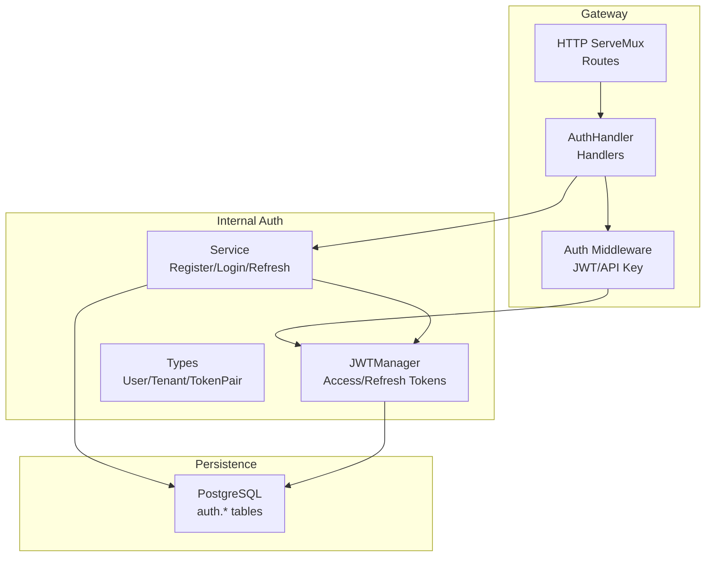
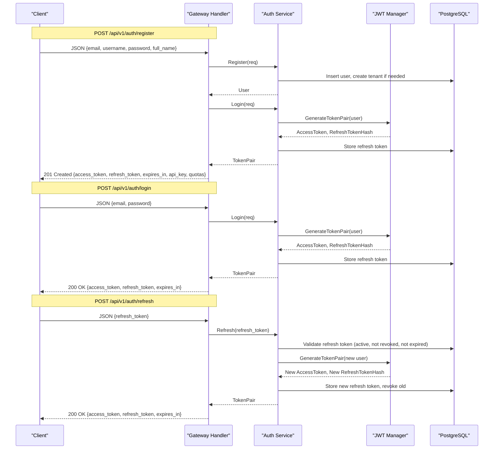
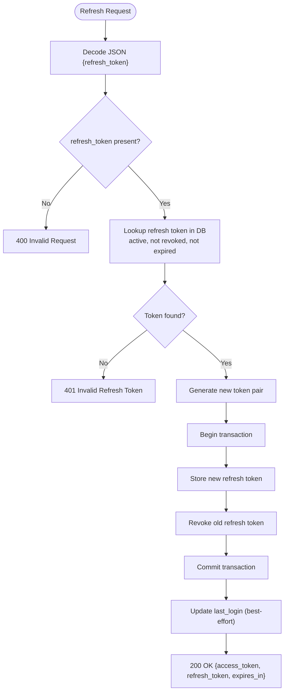
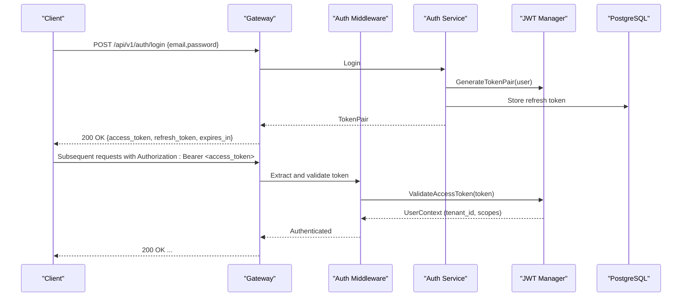
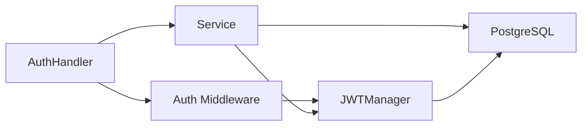

# Authentication Endpoints

<cite>
**Referenced Files in This Document**
- [auth.go](file://go/orchestrator/cmd/gateway/internal/handlers/auth.go)
- [types.go](file://go/orchestrator/internal/auth/types.go)
- [service.go](file://go/orchestrator/internal/auth/service.go)
- [jwt.go](file://go/orchestrator/internal/auth/jwt.go)
- [middleware.go](file://go/orchestrator/internal/auth/middleware.go)
- [auth.go](file://go/orchestrator/cmd/gateway/internal/middleware/auth.go)
- [003_authentication.sql](file://migrations/postgres/003_authentication.sql)
- [main.go](file://go/orchestrator/cmd/gateway/main.go)
</cite>

## Table of Contents
1. [Introduction](#introduction)
2. [Project Structure](#project-structure)
3. [Core Components](#core-components)
4. [Architecture Overview](#architecture-overview)
5. [Detailed Component Analysis](#detailed-component-analysis)
6. [Dependency Analysis](#dependency-analysis)
7. [Performance Considerations](#performance-considerations)
8. [Troubleshooting Guide](#troubleshooting-guide)
9. [Conclusion](#conclusion)
10. [Appendices](#appendices)

## Introduction
This document provides comprehensive documentation for the authentication REST endpoints exposed by the gateway. It covers:
- POST /api/v1/auth/login for user authentication
- POST /api/v1/auth/register for user registration
- Token refresh mechanism via POST /api/v1/auth/refresh
- Session management and logout behavior
- JWT token structure, expiration handling, and refresh token workflow
- Security considerations including rate limiting, token hashing, and tenant isolation
- cURL examples for each endpoint
- Error responses and integration patterns for client applications
- Multi-tenancy support and tenant-specific authentication flows

## Project Structure
The authentication system spans the gateway HTTP handlers, the internal auth service, JWT manager, and database schema. Endpoints are registered in the gateway’s main entry point and protected by middleware.

**Diagram sources**
- [main.go](file://go/orchestrator/cmd/gateway/main.go#L145-L183)
- [auth.go](file://go/orchestrator/cmd/gateway/internal/handlers/auth.go#L166-L393)
- [service.go](file://go/orchestrator/internal/auth/service.go#L38-L241)
- [jwt.go](file://go/orchestrator/internal/auth/jwt.go#L46-L92)
- [003_authentication.sql](file://migrations/postgres/003_authentication.sql#L11-L86)

**Section sources**
- [main.go](file://go/orchestrator/cmd/gateway/main.go#L145-L183)
- [auth.go](file://go/orchestrator/cmd/gateway/internal/handlers/auth.go#L166-L393)

## Core Components
- AuthHandler: Implements HTTP handlers for authentication endpoints, including rate limiting and response shaping.
- Service: Orchestrates registration, login, and refresh operations, manages JWT generation and refresh token storage, and logs audit events.
- JWTManager: Generates access tokens with custom claims and refresh tokens, validates access tokens, and defines scope sets per role.
- Types: Defines request/response models, token pair structure, user and tenant entities, and constants for scopes and roles.
- Middleware: Authenticates requests via JWT or API key, supports query parameter auth for streaming endpoints, and enforces development-mode bypass.

**Section sources**
- [auth.go](file://go/orchestrator/cmd/gateway/internal/handlers/auth.go#L166-L393)
- [service.go](file://go/orchestrator/internal/auth/service.go#L38-L241)
- [jwt.go](file://go/orchestrator/internal/auth/jwt.go#L46-L92)
- [types.go](file://go/orchestrator/internal/auth/types.go#L119-L140)
- [middleware.go](file://go/orchestrator/internal/auth/middleware.go#L39-L114)
- [auth.go](file://go/orchestrator/cmd/gateway/internal/middleware/auth.go#L49-L156)

## Architecture Overview
The gateway exposes REST endpoints under /api/v1/auth. Requests are authenticated either via JWT (Authorization: Bearer) or API key (X-API-Key). Successful login returns a token pair; refresh exchanges a refresh token for a new access token. Registration optionally creates a default API key and a tenant for the user.

**Diagram sources**
- [auth.go](file://go/orchestrator/cmd/gateway/internal/handlers/auth.go#L166-L393)
- [service.go](file://go/orchestrator/internal/auth/service.go#L38-L241)
- [jwt.go](file://go/orchestrator/internal/auth/jwt.go#L46-L92)
- [003_authentication.sql](file://migrations/postgres/003_authentication.sql#L44-L74)

## Detailed Component Analysis

### POST /api/v1/auth/register
- Purpose: Create a new user account and return a token pair and optional default API key.
- Request Schema:
  - email: string, required, validated as email
  - username: string, required, min length 3
  - password: string, required, min length 8
  - full_name: string, required
  - tenant_id: string, optional; if omitted, a new tenant is created for the user
- Response Schema:
  - user_id: string (UUID)
  - tenant_id: string (UUID)
  - access_token: string (JWT)
  - refresh_token: string (opaque)
  - expires_in: integer (seconds)
  - api_key: string (newly generated API key, shown once)
  - tier: string (tenant plan)
  - is_new_user: boolean
  - quotas: object with monthly_tokens, rate_limit_minute, rate_limit_hour
  - user: object {email, username, name, picture}
- Behavior:
  - Validates input length/format.
  - Registers user, optionally creates a tenant, hashes password, and persists user.
  - Immediately issues tokens and stores refresh token hash.
  - Creates a default API key for the user.
  - Returns 201 Created on success; otherwise appropriate error code.
- cURL Example:
  - curl -X POST https://gateway.example.com/api/v1/auth/register \
    -H "Content-Type: application/json" \
    -d '{"email":"alice@example.com","username":"alice","password":"securepass","full_name":"Alice"}'

**Section sources**
- [auth.go](file://go/orchestrator/cmd/gateway/internal/handlers/auth.go#L166-L274)
- [types.go](file://go/orchestrator/internal/auth/types.go#L133-L140)
- [service.go](file://go/orchestrator/internal/auth/service.go#L38-L116)

### POST /api/v1/auth/login
- Purpose: Authenticate an existing user and return a token pair.
- Request Schema:
  - email: string, required
  - password: string, required
- Response Schema:
  - Same as registration response excluding api_key.
- Behavior:
  - Validates credentials against stored hash.
  - Generates token pair and stores refresh token hash.
  - Updates last_login.
  - Returns 200 OK on success; 401 Unauthorized on invalid credentials.
- cURL Example:
  - curl -X POST https://gateway.example.com/api/v1/auth/login \
    -H "Content-Type: application/json" \
    -d '{"email":"alice@example.com","password":"securepass"}'

**Section sources**
- [auth.go](file://go/orchestrator/cmd/gateway/internal/handlers/auth.go#L276-L356)
- [service.go](file://go/orchestrator/internal/auth/service.go#L118-L169)

### POST /api/v1/auth/refresh
- Purpose: Issue a new access token using a valid refresh token.
- Request Schema:
  - refresh_token: string, required
- Response Schema:
  - access_token: string (JWT)
  - refresh_token: string (opaque)
  - expires_in: integer (seconds)
- Behavior:
  - Validates refresh token existence, active status, not revoked, and not expired.
  - Generates new token pair atomically: stores new refresh token before revoking the old one.
  - Updates last_login best-effort.
  - Returns 200 OK on success; 401 Unauthorized on invalid token.
- cURL Example:
  - curl -X POST https://gateway.example.com/api/v1/auth/refresh \
    -H "Content-Type: application/json" \
    -d '{"refresh_token":"<your-refresh-token>"}'

**Section sources**
- [auth.go](file://go/orchestrator/cmd/gateway/internal/handlers/auth.go#L358-L393)
- [service.go](file://go/orchestrator/internal/auth/service.go#L171-L241)

### Token Refresh Workflow

**Diagram sources**
- [auth.go](file://go/orchestrator/cmd/gateway/internal/handlers/auth.go#L358-L393)
- [service.go](file://go/orchestrator/internal/auth/service.go#L171-L241)

### Logout and Session Management
- JWT access tokens are stateless; revocation is not supported without additional state.
- Refresh tokens are stored in DB with revoked flag and expiry; invalidating a session requires:
  - Revoking the refresh token during logout (not implemented in the provided code).
  - Relying on access token expiry and refresh token expiry.
- Recommendations:
  - Implement a blacklist or short-lived access tokens with refresh-only sessions.
  - On logout, revoke the refresh token in DB to prevent further token issuance.

[No sources needed since this section provides general guidance]

### JWT Token Structure and Expiration
- Access Token (JWT):
  - Signing method: HS256
  - Issuer: platform identifier
  - Claims include subject (user UUID), tenant_id, username, email, role, scopes, issued-at, expiry, not-before, and ID.
  - Expires in 30 minutes by default.
- Refresh Token:
  - Opaque random string (non-JWT), hashed and stored in DB.
  - Expires in 7 days by default.
- Scopes:
  - Role-based default scopes for workflows, agents, sessions, API keys, users, and tenant management.

**Section sources**
- [jwt.go](file://go/orchestrator/internal/auth/jwt.go#L35-L92)
- [types.go](file://go/orchestrator/internal/auth/types.go#L165-L182)

### Multi-Tenancy Support
- Users belong to a tenant; all operations are tenant-scoped.
- Registration without tenant_id creates a new tenant for the user.
- API keys are bound to a tenant and user.
- Audit logs capture tenant_id for security events.
- Middleware extracts user context with tenant_id for downstream authorization.

**Section sources**
- [service.go](file://go/orchestrator/internal/auth/service.go#L67-L80)
- [003_authentication.sql](file://migrations/postgres/003_authentication.sql#L11-L42)
- [middleware.go](file://go/orchestrator/internal/auth/middleware.go#L195-L226)

### Authentication Flow (Client Integration)

**Diagram sources**
- [auth.go](file://go/orchestrator/cmd/gateway/internal/handlers/auth.go#L276-L356)
- [middleware.go](file://go/orchestrator/internal/auth/middleware.go#L39-L114)
- [jwt.go](file://go/orchestrator/internal/auth/jwt.go#L94-L143)

## Dependency Analysis
- Handlers depend on Service for business logic and on middleware for authentication.
- Service depends on JWTManager for token generation and PostgreSQL for persistence.
- JWTManager depends on HS256 signing and stores refresh tokens in DB.
- Middleware supports both JWT and API key authentication and integrates with streaming endpoints via query parameters.

**Diagram sources**
- [auth.go](file://go/orchestrator/cmd/gateway/internal/handlers/auth.go#L166-L393)
- [service.go](file://go/orchestrator/internal/auth/service.go#L25-L36)
- [jwt.go](file://go/orchestrator/internal/auth/jwt.go#L25-L33)
- [auth.go](file://go/orchestrator/cmd/gateway/internal/middleware/auth.go#L49-L156)

**Section sources**
- [main.go](file://go/orchestrator/cmd/gateway/main.go#L125-L183)
- [auth.go](file://go/orchestrator/cmd/gateway/internal/handlers/auth.go#L166-L393)
- [service.go](file://go/orchestrator/internal/auth/service.go#L25-L36)
- [jwt.go](file://go/orchestrator/internal/auth/jwt.go#L25-L33)
- [auth.go](file://go/orchestrator/cmd/gateway/internal/middleware/auth.go#L49-L156)

## Performance Considerations
- Rate Limiting:
  - Registration and login: 30 requests per minute per IP.
  - Token refresh: 60 requests per minute per IP.
- Storage:
  - Refresh tokens are hashed and indexed for fast lookup.
  - Audit logs and user tables are indexed by tenant_id and email.
- Token Expiry:
  - Short-lived access tokens reduce risk; refresh tokens provide controlled renewal.

[No sources needed since this section provides general guidance]

## Troubleshooting Guide
Common error responses and causes:
- 400 Bad Request:
  - Invalid JSON or missing fields in requests.
  - Password shorter than minimum length.
- 401 Unauthorized:
  - Invalid email/password during login.
  - Invalid refresh token or expired token.
  - Missing or invalid Authorization header or API key.
- 409 Conflict:
  - Email already registered during registration.
- 429 Too Many Requests:
  - Rate limit exceeded for registration, login, or refresh.

Operational tips:
- Use X-API-Key for programmatic access or Authorization: Bearer for JWT.
- For streaming endpoints, pass API key via query parameter api_key.
- Rotate refresh tokens regularly; revoke on logout if implemented.

**Section sources**
- [auth.go](file://go/orchestrator/cmd/gateway/internal/handlers/auth.go#L166-L393)
- [service.go](file://go/orchestrator/internal/auth/service.go#L118-L169)

## Conclusion
The authentication system provides robust user registration, login, and token refresh with strong tenant isolation and audit logging. JWT access tokens are short-lived for security, while refresh tokens enable seamless session continuity. Clients should integrate with Authorization headers for JWT and X-API-Key for API key flows, and leverage rate-limited endpoints for reliable operation.

[No sources needed since this section summarizes without analyzing specific files]

## Appendices

### Endpoint Reference Summary
- POST /api/v1/auth/register
  - Request: email, username, password, full_name, tenant_id (optional)
  - Response: user_id, tenant_id, access_token, refresh_token, expires_in, api_key, tier, is_new_user, quotas, user
- POST /api/v1/auth/login
  - Request: email, password
  - Response: user_id, tenant_id, access_token, refresh_token, expires_in, tier, quotas, user
- POST /api/v1/auth/refresh
  - Request: refresh_token
  - Response: access_token, refresh_token, expires_in

**Section sources**
- [auth.go](file://go/orchestrator/cmd/gateway/internal/handlers/auth.go#L166-L393)

### Database Schema Highlights
- auth.tenants: tenant metadata and limits
- auth.users: user accounts linked to tenants
- auth.api_keys: hashed API keys with scopes and expiry
- auth.refresh_tokens: hashed refresh tokens with revocation and expiry
- auth.audit_logs: security event logging with tenant context

**Section sources**
- [003_authentication.sql](file://migrations/postgres/003_authentication.sql#L11-L86)