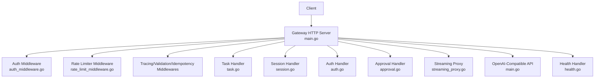
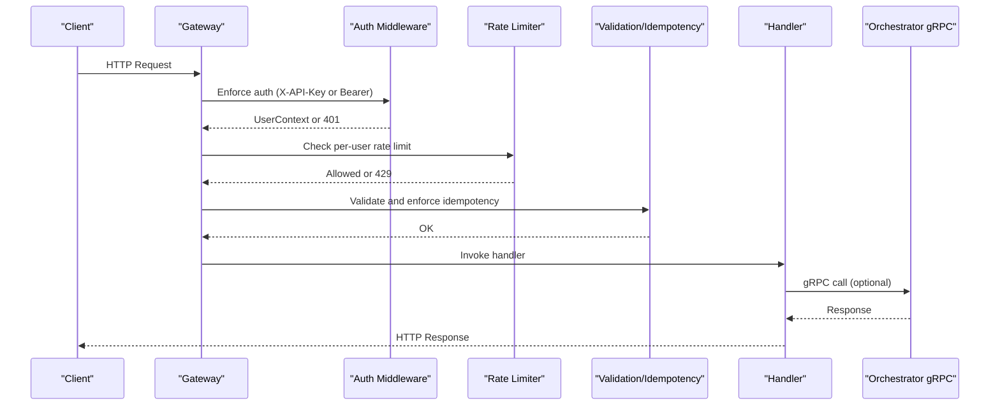
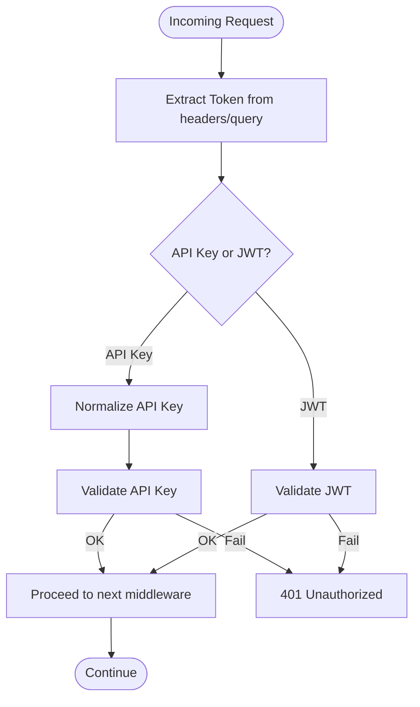
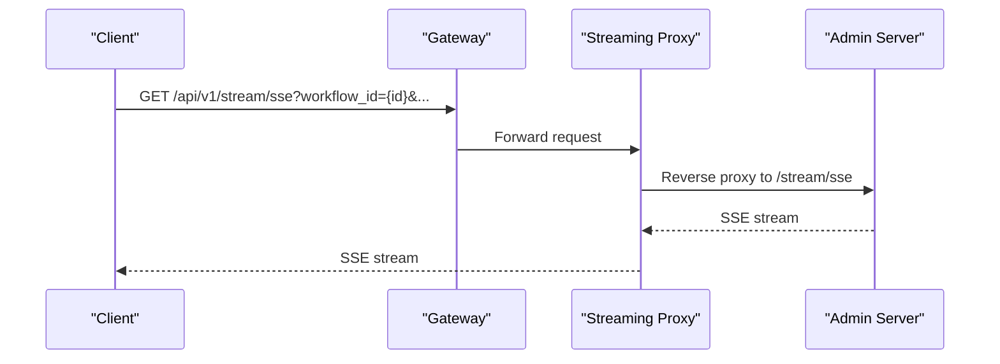
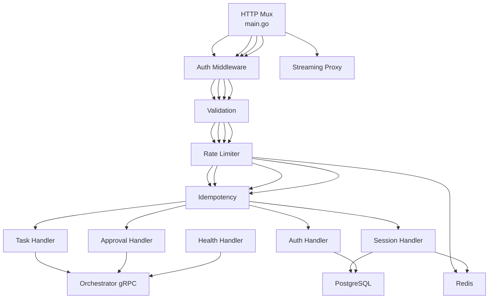

# REST API

<cite>
**Referenced Files in This Document**
- [main.go](file://go/orchestrator/cmd/gateway/main.go)
- [auth.go](file://go/orchestrator/cmd/gateway/internal/handlers/auth.go)
- [task.go](file://go/orchestrator/cmd/gateway/internal/handlers/task.go)
- [session.go](file://go/orchestrator/cmd/gateway/internal/handlers/session.go)
- [approval.go](file://go/orchestrator/cmd/gateway/internal/handlers/approval.go)
- [auth_middleware.go](file://go/orchestrator/cmd/gateway/internal/middleware/auth.go)
- [rate_limit_middleware.go](file://go/orchestrator/cmd/gateway/internal/middleware/ratelimit.go)
- [streaming_proxy.go](file://go/orchestrator/cmd/gateway/internal/proxy/streaming.go)
- [health.go](file://go/orchestrator/cmd/gateway/internal/handlers/health.go)
</cite>

## Table of Contents
1. [Introduction](#introduction)
2. [Project Structure](#project-structure)
3. [Core Components](#core-components)
4. [Architecture Overview](#architecture-overview)
5. [Detailed Component Analysis](#detailed-component-analysis)
6. [Dependency Analysis](#dependency-analysis)
7. [Performance Considerations](#performance-considerations)
8. [Troubleshooting Guide](#troubleshooting-guide)
9. [Conclusion](#conclusion)
10. [Appendices](#appendices)

## Introduction
This document provides comprehensive REST API documentation for Shannon’s HTTP gateway. It covers task management endpoints (submit, status, list), session continuity and approval workflows, authentication and authorization, rate limiting, pagination and filtering, streaming endpoints, CORS configuration, and monitoring endpoints. Practical cURL examples and JSON request/response schemas are included to aid integration.

## Project Structure
The gateway is implemented as a Go HTTP server that:
- Exposes REST endpoints under /api/v1/*
- Proxies streaming endpoints to an admin server
- Applies middleware for authentication, rate limiting, validation, tracing, and idempotency
- Integrates with an orchestrator gRPC service and PostgreSQL/Redis for persistence and rate limiting

**Diagram sources**
- [main.go](file://go/orchestrator/cmd/gateway/main.go#L135-L600)
- [auth_middleware.go](file://go/orchestrator/cmd/gateway/internal/middleware/auth.go#L48-L157)
- [rate_limit_middleware.go](file://go/orchestrator/cmd/gateway/internal/middleware/ratelimit.go#L34-L74)
- [task.go](file://go/orchestrator/cmd/gateway/internal/handlers/task.go#L377-L466)
- [session.go](file://go/orchestrator/cmd/gateway/internal/handlers/session.go#L132-L337)
- [auth.go](file://go/orchestrator/cmd/gateway/internal/handlers/auth.go#L166-L356)
- [approval.go](file://go/orchestrator/cmd/gateway/internal/handlers/approval.go#L43-L127)
- [streaming_proxy.go](file://go/orchestrator/cmd/gateway/internal/proxy/streaming.go#L12-L96)
- [health.go](file://go/orchestrator/cmd/gateway/internal/handlers/health.go#L37-L108)

**Section sources**
- [main.go](file://go/orchestrator/cmd/gateway/main.go#L135-L600)

## Core Components
- Authentication and Authorization
  - Supports API keys and JWTs via a unified middleware.
  - API keys can be supplied via X-API-Key header or Authorization: Bearer <token>.
  - Development mode supports bypass via environment variables (do not use in production).
- Rate Limiting
  - Per-user sliding window rate limiter using Redis.
  - Default 60 requests/minute with burst allowance.
- Validation and Idempotency
  - Request validation middleware and idempotency middleware for safe retries.
- Streaming
  - Reverse proxy to admin server for SSE and WebSocket endpoints.
- Handlers
  - Task, Session, Auth, Approval, Schedules, Health, OpenAI-compatible API.

**Section sources**
- [auth_middleware.go](file://go/orchestrator/cmd/gateway/internal/middleware/auth.go#L48-L157)
- [rate_limit_middleware.go](file://go/orchestrator/cmd/gateway/internal/middleware/ratelimit.go#L34-L74)
- [main.go](file://go/orchestrator/cmd/gateway/main.go#L540-L565)

## Architecture Overview
The gateway composes multiple middlewares around each handler. Requests flow through authentication, rate limiting, validation, and idempotency before reaching the handler. Streaming endpoints are proxied to an admin server.

**Diagram sources**
- [main.go](file://go/orchestrator/cmd/gateway/main.go#L185-L329)
- [auth_middleware.go](file://go/orchestrator/cmd/gateway/internal/middleware/auth.go#L48-L157)
- [rate_limit_middleware.go](file://go/orchestrator/cmd/gateway/internal/middleware/ratelimit.go#L34-L74)
- [task.go](file://go/orchestrator/cmd/gateway/internal/handlers/task.go#L377-L466)

## Detailed Component Analysis

### Authentication and Authorization
- Supported tokens
  - API key: X-API-Key header or Authorization: Bearer <sk_...> or <sk-shannon-...>.
  - JWT: Authorization: Bearer <jwt> (when JWT middleware is enabled).
- Token normalization
  - External format sk-shannon-... is normalized to internal sk_... format.
- Environment-based bypass (development only)
  - GATEWAY_SKIP_AUTH=1 with ENVIRONMENT=development allows bypass; logs warnings.
- Rate limits for auth endpoints
  - Registration/Login: 30/min per IP.
  - Token refresh: 60/min per IP.

**Diagram sources**
- [auth_middleware.go](file://go/orchestrator/cmd/gateway/internal/middleware/auth.go#L159-L210)
- [auth.go](file://go/orchestrator/cmd/gateway/internal/handlers/auth.go#L166-L356)

**Section sources**
- [auth_middleware.go](file://go/orchestrator/cmd/gateway/internal/middleware/auth.go#L48-L157)
- [auth.go](file://go/orchestrator/cmd/gateway/internal/handlers/auth.go#L166-L356)

### Rate Limiting
- Per-user sliding window using Redis.
- Default: 60 requests/minute; burst up to 10.
- Headers:
  - X-RateLimit-Limit, X-RateLimit-Remaining, X-RateLimit-Reset.
  - Retry-After on 429.

**Section sources**
- [rate_limit_middleware.go](file://go/orchestrator/cmd/gateway/internal/middleware/ratelimit.go#L34-L104)

### Task Management Endpoints

#### POST /api/v1/tasks
- Purpose: Submit a new task.
- Authentication: Required (API key or JWT).
- Request body
  - query: string, required.
  - session_id: string, optional; auto-generated if omitted.
  - context: object, optional; merged into task context.
  - mode: string, optional; routing hint (simple, standard, complex, supervisor).
  - model_tier: string, optional; small|medium|large.
  - model_override: string, optional; provider-specific model name.
  - provider_override: string, optional; provider name.
  - research_strategy: string, optional; quick|standard|deep|academic.
  - max_iterations, max_concurrent_agents, enable_verification: optional numeric/boolean overrides.
- Response
  - task_id, status, message, created_at.
- Notes
  - Workflow ID and session ID are returned via headers.
  - gRPC metadata propagation includes auth/tracing headers.

**Section sources**
- [task.go](file://go/orchestrator/cmd/gateway/internal/handlers/task.go#L377-L466)

#### GET /api/v1/tasks/{id}
- Purpose: Retrieve task status and result.
- Authentication: Required.
- Response
  - task_id, workflow_id, status, result, error, created_at, updated_at.
  - query, session_id, mode, context.
  - model_used, provider, usage (tokens, cost), metadata (including citations and task_context).
- Notes
  - Uses database enrichment for metadata and usage.
  - Backward compatibility: result may be parsed into response field if valid JSON.

**Section sources**
- [task.go](file://go/orchestrator/cmd/gateway/internal/handlers/task.go#L560-L715)

#### GET /api/v1/tasks
- Purpose: List tasks for the authenticated user.
- Authentication: Required.
- Query parameters
  - limit: integer, default 20, max 100.
  - offset: integer, default 0.
  - session_id: string, filter by session.
  - status: enum string; QUEUED, RUNNING, COMPLETED, FAILED, CANCELLED, TIMEOUT.
- Response
  - tasks: array of task summaries (task_id, query, status, mode, timestamps, token usage).
  - total_count: integer.

**Section sources**
- [task.go](file://go/orchestrator/cmd/gateway/internal/handlers/task.go#L717-L815)

#### Additional Task Operations
- GET /api/v1/tasks/{id}/events
  - Retrieve event logs for a task with pagination.
- GET /api/v1/tasks/{id}/stream
  - Redirect to SSE endpoint with workflow_id.
- POST /api/v1/tasks/{id}/cancel | pause | resume
  - Control task lifecycle; requires reason (optional).
- GET /api/v1/tasks/{id}/control-state
  - Inspect pause/cancel state.

**Section sources**
- [task.go](file://go/orchestrator/cmd/gateway/internal/handlers/task.go#L817-L1178)

### Session Continuity Endpoints

#### GET /api/v1/sessions/{sessionId}
- Purpose: Retrieve session metadata and usage.
- Authentication: Required.
- Response
  - session_id, user_id, context, token_budget, tokens_used, task_count, created_at, updated_at, expires_at.
  - is_research_session, research_strategy.

**Section sources**
- [session.go](file://go/orchestrator/cmd/gateway/internal/handlers/session.go#L132-L337)

#### GET /api/v1/sessions/{sessionId}/history
- Purpose: Retrieve task history within a session.
- Authentication: Required.
- Response
  - session_id, tasks: array of task history items (status, tokens, cost, metadata, etc.), total.

**Section sources**
- [session.go](file://go/orchestrator/cmd/gateway/internal/handlers/session.go#L339-L518)

#### GET /api/v1/sessions/{sessionId}/events
- Purpose: Retrieve grouped turns/events for a session (chat-like view).
- Authentication: Required.
- Query parameters
  - limit: default 10, max 100.
  - offset: default 0.
  - include_payload: boolean, default false.
- Response
  - session_id, turns: array of turn objects (user_query, final_output, events, metadata).

**Section sources**
- [session.go](file://go/orchestrator/cmd/gateway/internal/handlers/session.go#L520-L800)

### Approval Workflows
- POST /api/v1/approvals/decision
  - Submit an approval decision for a workflow.
  - Request body
    - workflow_id, approval_id, approved, feedback, modified_action, approved_by (optional).
  - Response
    - status, success, message, workflow_id, run_id, approval_id.

**Section sources**
- [approval.go](file://go/orchestrator/cmd/gateway/internal/handlers/approval.go#L43-L127)

### Streaming Endpoints
- GET /api/v1/stream/sse
  - Server-Sent Events endpoint; proxied to admin server.
  - Accepts workflow_id query parameter; optional types and last_event_id.
- GET /api/v1/stream/ws
  - WebSocket endpoint; proxied to admin server.
- GET /api/v1/tasks/{id}/stream
  - Redirects to SSE endpoint with workflow_id.

**Diagram sources**
- [main.go](file://go/orchestrator/cmd/gateway/main.go#L540-L565)
- [streaming_proxy.go](file://go/orchestrator/cmd/gateway/internal/proxy/streaming.go#L12-L96)

**Section sources**
- [main.go](file://go/orchestrator/cmd/gateway/main.go#L540-L565)
- [streaming_proxy.go](file://go/orchestrator/cmd/gateway/internal/proxy/streaming.go#L12-L96)

### Monitoring Endpoints
- GET /health
  - Basic health status of the gateway.
- GET /readiness
  - Checks connectivity to orchestrator by attempting a non-existent task status request.

**Section sources**
- [health.go](file://go/orchestrator/cmd/gateway/internal/handlers/health.go#L37-L108)

## Dependency Analysis
- Routing and middleware stack
  - Each endpoint is wrapped in a consistent order: tracing → auth → validation → rate limiting → idempotency → handler.
- External dependencies
  - Orchestrator gRPC service for task orchestration.
  - PostgreSQL for task/session metadata and quotas.
  - Redis for rate limiting and session token usage.

**Diagram sources**
- [main.go](file://go/orchestrator/cmd/gateway/main.go#L185-L399)
- [task.go](file://go/orchestrator/cmd/gateway/internal/handlers/task.go#L377-L466)
- [session.go](file://go/orchestrator/cmd/gateway/internal/handlers/session.go#L132-L337)
- [auth.go](file://go/orchestrator/cmd/gateway/internal/handlers/auth.go#L166-L356)
- [approval.go](file://go/orchestrator/cmd/gateway/internal/handlers/approval.go#L43-L127)
- [health.go](file://go/orchestrator/cmd/gateway/internal/handlers/health.go#L37-L108)
- [streaming_proxy.go](file://go/orchestrator/cmd/gateway/internal/proxy/streaming.go#L12-L96)

**Section sources**
- [main.go](file://go/orchestrator/cmd/gateway/main.go#L185-L399)

## Performance Considerations
- Streaming
  - No write timeout for SSE/WebSocket to support long-lived connections.
  - Immediate flush for SSE via proxy.
- Rate limiting
  - Redis-backed sliding window; tune defaultRequestsPerMinute and defaultBurstSize as needed.
- Pagination
  - Tasks listing supports limit/offset; choose reasonable defaults to avoid heavy scans.

[No sources needed since this section provides general guidance]

## Troubleshooting Guide
- 401 Unauthorized
  - Missing or invalid X-API-Key or Authorization header.
  - Development bypass not enabled or environment mismatch.
- 403 Forbidden
  - Permission denied for resource (e.g., task/session ownership).
- 404 Not Found
  - Task/session not found; verify IDs and ownership.
- 429 Too Many Requests
  - Per-user rate limit exceeded; inspect X-RateLimit-* headers.
- 500 Internal Server Error
  - Orchestrator connectivity or internal failures; check readiness endpoint.

**Section sources**
- [auth_middleware.go](file://go/orchestrator/cmd/gateway/internal/middleware/auth.go#L233-L239)
- [rate_limit_middleware.go](file://go/orchestrator/cmd/gateway/internal/middleware/ratelimit.go#L106-L117)
- [health.go](file://go/orchestrator/cmd/gateway/internal/handlers/health.go#L54-L108)

## Conclusion
Shannon’s gateway provides a robust, middleware-driven REST API for task management, session continuity, approvals, and streaming. It emphasizes secure authentication, per-user rate limiting, and clear error handling. The documented endpoints and patterns enable reliable integration with minimal friction.

[No sources needed since this section summarizes without analyzing specific files]

## Appendices

### Authentication Requirements
- Preferred method: X-API-Key header.
- Alternative: Authorization: Bearer <token>, where token is either an API key (sk_...) or JWT.
- Development bypass: GATEWAY_SKIP_AUTH=1 with ENVIRONMENT=development (logs warnings).

**Section sources**
- [auth_middleware.go](file://go/orchestrator/cmd/gateway/internal/middleware/auth.go#L159-L210)

### Request/Response Schemas

- POST /api/v1/tasks
  - Request: query, session_id (optional), context (object), mode, model_tier, model_override, provider_override, research_strategy, max_iterations, max_concurrent_agents, enable_verification.
  - Response: task_id, status, message, created_at.

- GET /api/v1/tasks/{id}
  - Response: task_id, workflow_id, status, result, error, created_at, updated_at, query, session_id, mode, context, model_used, provider, usage, metadata.

- GET /api/v1/tasks
  - Query: limit, offset, session_id, status.
  - Response: tasks[], total_count.

- GET /api/v1/sessions/{sessionId}
  - Response: session_id, user_id, context, token_budget, tokens_used, task_count, created_at, updated_at, expires_at, is_research_session, research_strategy.

- GET /api/v1/sessions/{sessionId}/history
  - Response: session_id, tasks[], total.

- GET /api/v1/sessions/{sessionId}/events
  - Query: limit, offset, include_payload.
  - Response: session_id, turns[].

- POST /api/v1/approvals/decision
  - Request: workflow_id, approval_id, approved, feedback, modified_action, approved_by.
  - Response: status, success, message, workflow_id, run_id, approval_id.

**Section sources**
- [task.go](file://go/orchestrator/cmd/gateway/internal/handlers/task.go#L308-L358)
- [task.go](file://go/orchestrator/cmd/gateway/internal/handlers/task.go#L560-L715)
- [task.go](file://go/orchestrator/cmd/gateway/internal/handlers/task.go#L717-L815)
- [session.go](file://go/orchestrator/cmd/gateway/internal/handlers/session.go#L132-L337)
- [session.go](file://go/orchestrator/cmd/gateway/internal/handlers/session.go#L339-L518)
- [session.go](file://go/orchestrator/cmd/gateway/internal/handlers/session.go#L520-L800)
- [approval.go](file://go/orchestrator/cmd/gateway/internal/handlers/approval.go#L43-L127)

### Rate Limiting and Headers
- Default: 60 requests/minute per user.
- Headers: X-RateLimit-Limit, X-RateLimit-Remaining, X-RateLimit-Reset, Retry-After.

**Section sources**
- [rate_limit_middleware.go](file://go/orchestrator/cmd/gateway/internal/middleware/ratelimit.go#L34-L104)

### Pagination and Filtering
- Tasks listing: limit (default 20, max 100), offset (default 0), session_id, status.

**Section sources**
- [task.go](file://go/orchestrator/cmd/gateway/internal/handlers/task.go#L717-L757)

### Security Considerations
- CORS: Enabled for development; Origin set to *. Production deployments should restrict origins.
- TLS: Not enforced by gateway; place behind a TLS-terminating reverse proxy.
- Secrets: Store JWT_SECRET and database credentials in environment variables.

**Section sources**
- [main.go](file://go/orchestrator/cmd/gateway/main.go#L641-L670)

### Monitoring Endpoints
- GET /health: Gateway health.
- GET /readiness: Connectivity to orchestrator.

**Section sources**
- [health.go](file://go/orchestrator/cmd/gateway/internal/handlers/health.go#L37-L108)

### Practical cURL Examples

- Submit a task
  - curl -X POST "$BASE_URL/api/v1/tasks" \
    -H "X-API-Key: YOUR_API_KEY" \
    -H "Content-Type: application/json" \
    -d '{"query":"Summarize quantum computing","context":{"force_research":true}}'

- Get task status
  - curl -H "X-API-Key: YOUR_API_KEY" "$BASE_URL/api/v1/tasks/{task_id}"

- List tasks
  - curl -H "X-API-Key: YOUR_API_KEY" "$BASE_URL/api/v1/tasks?limit=20&offset=0&status=COMPLETED"

- Get session metadata
  - curl -H "X-API-Key: YOUR_API_KEY" "$BASE_URL/api/v1/sessions/{session_id}"

- Get session events (turns)
  - curl -H "X-API-Key: YOUR_API_KEY" "$BASE_URL/api/v1/sessions/{session_id}/events?limit=10&offset=0"

- Submit approval decision
  - curl -X POST "$BASE_URL/api/v1/approvals/decision" \
    -H "X-API-Key: YOUR_API_KEY" \
    -H "Content-Type: application/json" \
    -d '{"workflow_id":"{workflow_id}","approval_id":"{approval_id}","approved":true}'

- Subscribe to SSE
  - curl -N "$BASE_URL/api/v1/stream/sse?workflow_id={workflow_id}"

[No sources needed since this section provides general guidance]