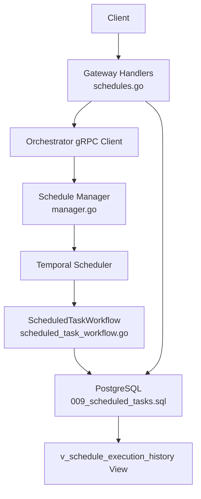
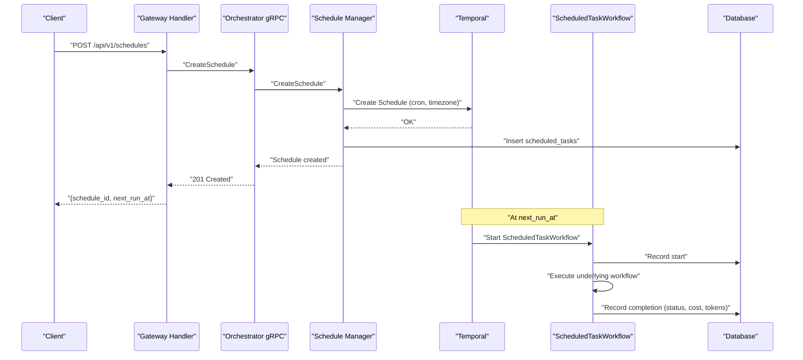
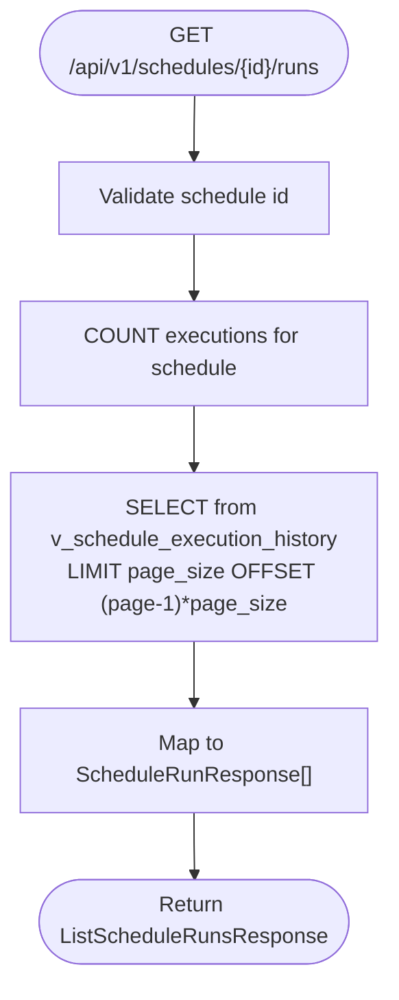
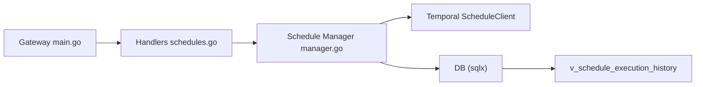

# Schedule Management Endpoints

<cite>
**Referenced Files in This Document**
- [schedules.go](file://go/orchestrator/cmd/gateway/internal/handlers/schedules.go)
- [types.go](file://go/orchestrator/internal/schedules/types.go)
- [manager.go](file://go/orchestrator/internal/schedules/manager.go)
- [db.go](file://go/orchestrator/internal/schedules/db.go)
- [scheduled_task_workflow.go](file://go/orchestrator/internal/workflows/scheduled/scheduled_task_workflow.go)
- [009_scheduled_tasks.sql](file://migrations/postgres/009_scheduled_tasks.sql)
- [main.go](file://go/orchestrator/cmd/gateway/main.go)
- [ratelimit.go](file://go/orchestrator/cmd/gateway/internal/middleware/ratelimit.go)
- [scheduled-tasks.md](file://docs/scheduled-tasks.md)
</cite>

## Table of Contents
1. [Introduction](#introduction)
2. [Project Structure](#project-structure)
3. [Core Components](#core-components)
4. [Architecture Overview](#architecture-overview)
5. [Detailed Component Analysis](#detailed-component-analysis)
6. [Dependency Analysis](#dependency-analysis)
7. [Performance Considerations](#performance-considerations)
8. [Troubleshooting Guide](#troubleshooting-guide)
9. [Conclusion](#conclusion)

## Introduction
This document describes the scheduled task management REST API surface for creating, listing, retrieving, updating, pausing, resuming, and deleting recurring tasks. It covers cron-based scheduling with timezone handling, execution history retrieval, next/previous run inference, and operational controls. It also documents security, rate limiting, and performance considerations for high-frequency schedules.

## Project Structure
The schedule management feature spans the HTTP gateway, schedule manager, Temporal integration, and persistence layer:
- HTTP handlers expose REST endpoints and enforce authentication and rate limiting.
- The schedule manager validates inputs, enforces limits, integrates with Temporal, and persists state.
- Workflows orchestrate each scheduled run and record execution metadata.
- Database migrations define schema and views for schedule configuration and execution history.



**Diagram sources**
- [schedules.go](file://go/orchestrator/cmd/gateway/internal/handlers/schedules.go#L31-L99)
- [manager.go](file://go/orchestrator/internal/schedules/manager.go#L54-L169)
- [scheduled_task_workflow.go](file://go/orchestrator/internal/workflows/scheduled/scheduled_task_workflow.go#L16-L195)
- [009_scheduled_tasks.sql](file://migrations/postgres/009_scheduled_tasks.sql#L30-L155)

**Section sources**
- [schedules.go](file://go/orchestrator/cmd/gateway/internal/handlers/schedules.go#L31-L99)
- [main.go](file://go/orchestrator/cmd/gateway/main.go#L401-L500)

## Core Components
- HTTP handlers implement REST endpoints for schedule lifecycle and execution history.
- Schedule manager encapsulates business logic, validation, and Temporal integration.
- Workflow wrapper executes user tasks and records outcomes.
- Database schema and view support schedule configuration and execution history.

**Section sources**
- [schedules.go](file://go/orchestrator/cmd/gateway/internal/handlers/schedules.go#L31-L99)
- [types.go](file://go/orchestrator/internal/schedules/types.go#L16-L38)
- [manager.go](file://go/orchestrator/internal/schedules/manager.go#L54-L169)
- [db.go](file://go/orchestrator/internal/schedules/db.go#L23-L86)
- [scheduled_task_workflow.go](file://go/orchestrator/internal/workflows/scheduled/scheduled_task_workflow.go#L16-L195)
- [009_scheduled_tasks.sql](file://migrations/postgres/009_scheduled_tasks.sql#L30-L155)

## Architecture Overview
End-to-end flow for creating and executing a schedule:
1. Client posts a schedule definition to the gateway.
2. Gateway forwards to orchestrator gRPC; handler validates and calls schedule manager.
3. Manager validates cron, interval, budget, timezone; creates Temporal schedule; persists to DB.
4. At next scheduled time, Temporal triggers ScheduledTaskWorkflow.
5. Workflow executes the underlying task and records start/completion in DB.
6. Execution history is queryable via a dedicated view.



**Diagram sources**
- [schedules.go](file://go/orchestrator/cmd/gateway/internal/handlers/schedules.go#L31-L99)
- [manager.go](file://go/orchestrator/internal/schedules/manager.go#L54-L169)
- [scheduled_task_workflow.go](file://go/orchestrator/internal/workflows/scheduled/scheduled_task_workflow.go#L16-L195)
- [db.go](file://go/orchestrator/internal/schedules/db.go#L275-L310)

## Detailed Component Analysis

### REST Endpoints

- POST /api/v1/schedules
  - Purpose: Create a new schedule with cron expression, timezone, task query, context, budget, and timeout.
  - Request body fields: name, description, cron_expression, timezone, task_query, task_context, max_budget_per_run_usd, timeout_seconds.
  - Response: schedule_id, message, next_run_at.
  - Security: Requires authentication; gateway applies rate limiting and validation middleware.
  - Error codes: 400 for invalid request/body, 429 for rate limit exceeded, 500 for internal errors.

- GET /api/v1/schedules
  - Purpose: List schedules for the authenticated user with optional status filter.
  - Query params: page, page_size (bounded), status (ACTIVE, PAUSED).
  - Response: list of schedules with metadata and stats.
  - Security: Requires authentication.

- GET /api/v1/schedules/{id}
  - Purpose: Retrieve a single schedule’s configuration and runtime stats.
  - Path param: id (UUID).
  - Response: schedule object including status, next/last run times, totals.
  - Security: Requires authentication.

- PUT /api/v1/schedules/{id}
  - Purpose: Update schedule configuration (partial updates supported).
  - Path param: id (UUID).
  - Request body fields: name, description, cron_expression, timezone, task_query, task_context, max_budget_per_run_usd, timeout_seconds, clear_task_context.
  - Response: updated schedule metadata.
  - Security: Requires authentication.

- POST /api/v1/schedules/{id}/pause
  - Purpose: Pause a schedule to prevent future runs.
  - Path param: id (UUID).
  - Request body: reason (optional note).
  - Response: operation result.
  - Security: Requires authentication.

- POST /api/v1/schedules/{id}/resume
  - Purpose: Resume a previously paused schedule.
  - Path param: id (UUID).
  - Request body: reason (optional note).
  - Response: operation result.
  - Security: Requires authentication.

- DELETE /api/v1/schedules/{id}
  - Purpose: Cancel a schedule (soft-delete).
  - Path param: id (UUID).
  - Response: operation result.
  - Security: Requires authentication.

- GET /api/v1/schedules/{id}/runs
  - Purpose: List execution history for a schedule with pagination.
  - Path param: id (UUID).
  - Query params: page, page_size (bounded).
  - Response: runs array with status, cost, tokens, timestamps, and optional error messages.
  - Security: Requires authentication; additionally verifies ownership against DB.

**Section sources**
- [schedules.go](file://go/orchestrator/cmd/gateway/internal/handlers/schedules.go#L31-L99)
- [schedules.go](file://go/orchestrator/cmd/gateway/internal/handlers/schedules.go#L139-L175)
- [schedules.go](file://go/orchestrator/cmd/gateway/internal/handlers/schedules.go#L101-L137)
- [schedules.go](file://go/orchestrator/cmd/gateway/internal/handlers/schedules.go#L177-L249)
- [schedules.go](file://go/orchestrator/cmd/gateway/internal/handlers/schedules.go#L251-L351)
- [schedules.go](file://go/orchestrator/cmd/gateway/internal/handlers/schedules.go#L353-L394)
- [schedules.go](file://go/orchestrator/cmd/gateway/internal/handlers/schedules.go#L421-L552)

### Schedule Execution History
- Endpoint: GET /api/v1/schedules/{id}/runs
- Data source: PostgreSQL view v_schedule_execution_history joins scheduled_tasks and task_executions.
- Fields include workflow/session identifiers, query, status, result/error, model/provider, tokens, cost, durations, and timestamps.
- Pagination: page/page_size with bounded page_size.



**Diagram sources**
- [schedules.go](file://go/orchestrator/cmd/gateway/internal/handlers/schedules.go#L421-L552)
- [009_scheduled_tasks.sql](file://migrations/postgres/009_scheduled_tasks.sql#L130-L155)

**Section sources**
- [schedules.go](file://go/orchestrator/cmd/gateway/internal/handlers/schedules.go#L421-L552)
- [009_scheduled_tasks.sql](file://migrations/postgres/009_scheduled_tasks.sql#L130-L155)

### Schedule Status Monitoring
- Status values: ACTIVE, PAUSED, DELETED.
- Next/last run times are tracked and updated during create/update/resume operations.
- Temporal’s authoritative next action time is used to keep DB in sync.

**Section sources**
- [types.go](file://go/orchestrator/internal/schedules/types.go#L9-L14)
- [manager.go](file://go/orchestrator/internal/schedules/manager.go#L204-L247)
- [db.go](file://go/orchestrator/internal/schedules/db.go#L180-L187)

### Cron Expressions, Timezones, and Recurrence Patterns
- Cron parsing uses robfig/cron with minute-level precision.
- Timezone validation ensures IANA timezone correctness; default UTC if unspecified.
- Minimum interval enforcement prevents overly aggressive schedules.

**Section sources**
- [manager.go](file://go/orchestrator/internal/schedules/manager.go#L56-L65)
- [manager.go](file://go/orchestrator/internal/schedules/manager.go#L85-L93)
- [manager.go](file://go/orchestrator/internal/schedules/manager.go#L511-L531)

### Schedule Lifecycle Operations
- Pause/Resume: Updates Temporal schedule and DB status; resume recalculates next run.
- Delete: Removes Temporal schedule and marks DB record as DELETED.
- Update: Validates and updates Temporal spec/action; persists DB changes; uses Temporal’s next action time when available.

**Section sources**
- [manager.go](file://go/orchestrator/internal/schedules/manager.go#L171-L202)
- [manager.go](file://go/orchestrator/internal/schedules/manager.go#L204-L247)
- [manager.go](file://go/orchestrator/internal/schedules/manager.go#L249-L277)
- [manager.go](file://go/orchestrator/internal/schedules/manager.go#L279-L439)

### Data Models
```mermaid
classDiagram
class Schedule {
+uuid id
+uuid user_id
+uuid tenant_id
+string name
+string description
+string cron_expression
+string timezone
+string task_query
+map[string]interface{} task_context
+float max_budget_per_run_usd
+int timeout_seconds
+string temporal_schedule_id
+string status
+time created_at
+time updated_at
+time* last_run_at
+time* next_run_at
+int total_runs
+int successful_runs
+int failed_runs
}
class CreateScheduleInput {
+uuid user_id
+uuid tenant_id
+string name
+string description
+string cron_expression
+string timezone
+string task_query
+map[string]interface{} task_context
+float max_budget_per_run_usd
+int timeout_seconds
}
class UpdateScheduleInput {
+uuid schedule_id
+string* name
+string* description
+string* cron_expression
+string* timezone
+string* task_query
+map[string]interface{} task_context
+float* max_budget_per_run_usd
+int* timeout_seconds
}
class ScheduledTaskInput {
+string schedule_id
+string task_query
+map[string]interface{} task_context
+float max_budget_per_run_usd
+string user_id
+string tenant_id
}
```

**Diagram sources**
- [types.go](file://go/orchestrator/internal/schedules/types.go#L16-L76)

**Section sources**
- [types.go](file://go/orchestrator/internal/schedules/types.go#L16-L76)

## Dependency Analysis
- Gateway routes:
  - POST /api/v1/schedules → CreateSchedule
  - GET /api/v1/schedules → ListSchedules
  - GET /api/v1/schedules/{id} → GetSchedule
  - GET /api/v1/schedules/{id}/runs → GetScheduleRuns
  - PUT /api/v1/schedules/{id} → UpdateSchedule
  - POST /api/v1/schedules/{id}/pause → PauseSchedule
  - POST /api/v1/schedules/{id}/resume → ResumeSchedule
  - DELETE /api/v1/schedules/{id} → DeleteSchedule
- Middleware stack: auth → validation → rate limiter → idempotency → tracing.
- Persistence: SQLX connects to PostgreSQL; migrations define tables and view.
- Temporal: ScheduleClient manages cron/timezone and workflow actions.



**Diagram sources**
- [main.go](file://go/orchestrator/cmd/gateway/main.go#L401-L500)
- [schedules.go](file://go/orchestrator/cmd/gateway/internal/handlers/schedules.go#L31-L99)
- [manager.go](file://go/orchestrator/internal/schedules/manager.go#L34-L52)
- [db.go](file://go/orchestrator/internal/schedules/db.go#L13-L21)
- [009_scheduled_tasks.sql](file://migrations/postgres/009_scheduled_tasks.sql#L130-L155)

**Section sources**
- [main.go](file://go/orchestrator/cmd/gateway/main.go#L401-L500)
- [schedules.go](file://go/orchestrator/cmd/gateway/internal/handlers/schedules.go#L31-L99)
- [manager.go](file://go/orchestrator/internal/schedules/manager.go#L34-L52)
- [db.go](file://go/orchestrator/internal/schedules/db.go#L13-L21)
- [009_scheduled_tasks.sql](file://migrations/postgres/009_scheduled_tasks.sql#L130-L155)

## Performance Considerations
- Rate limiting: Per-user sliding window via Redis; default 60 requests/minute with burst 10.
- Min interval enforcement: Prevents excessive schedules; configurable via environment.
- Budget caps: Per-run budget enforced at creation/update; child workflow respects budget.
- Pagination: List endpoints bound page_size; history endpoint bounds page_size.
- Temporal next-run accuracy: Uses Temporal’s authoritative next action time to avoid drift.

**Section sources**
- [ratelimit.go](file://go/orchestrator/cmd/gateway/internal/middleware/ratelimit.go#L15-L32)
- [manager.go](file://go/orchestrator/internal/schedules/manager.go#L27-L32)
- [manager.go](file://go/orchestrator/internal/schedules/manager.go#L511-L531)
- [schedules.go](file://go/orchestrator/cmd/gateway/internal/handlers/schedules.go#L149-L156)
- [schedules.go](file://go/orchestrator/cmd/gateway/internal/handlers/schedules.go#L442-L446)

## Troubleshooting Guide
Common issues and resolutions:
- Unauthorized or missing auth: Ensure Authorization header is present and valid.
- Schedule not found: Verify schedule id and ownership; GET /api/v1/schedules/{id}/runs performs ownership checks.
- Invalid cron expression: Confirm cron syntax and timezone; minimum interval must be satisfied.
- Budget exceeded: Adjust max_budget_per_run_usd to configured cap.
- Rate limit exceeded: Reduce request frequency or wait for window reset; inspect X-RateLimit-* headers.
- Temporal unavailable: Schedule operations may fail if Temporal is unreachable; retry after service restoration.

Operational tips:
- Use GET /api/v1/schedules/{id}/runs to inspect recent runs and statuses.
- Check Temporal UI for schedule status and execution backlog.
- Review database queries for cost analysis and failure rates.

**Section sources**
- [schedules.go](file://go/orchestrator/cmd/gateway/internal/handlers/schedules.go#L421-L552)
- [manager.go](file://go/orchestrator/internal/schedules/manager.go#L511-L531)
- [ratelimit.go](file://go/orchestrator/cmd/gateway/internal/middleware/ratelimit.go#L76-L104)
- [scheduled-tasks.md](file://docs/scheduled-tasks.md#L270-L329)

## Conclusion
The schedule management endpoints provide a robust, production-ready mechanism for creating, operating, and monitoring recurring tasks. They integrate cron-based scheduling with timezone awareness, enforce resource and budget limits, and maintain detailed execution history. With authentication, rate limiting, and Temporal-backed reliability, the system supports high-frequency, high-volume use cases while preserving auditability and observability.