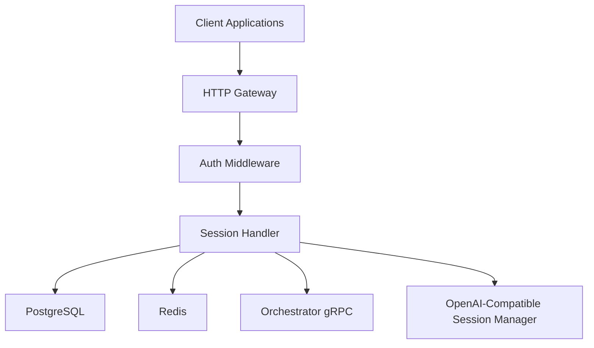
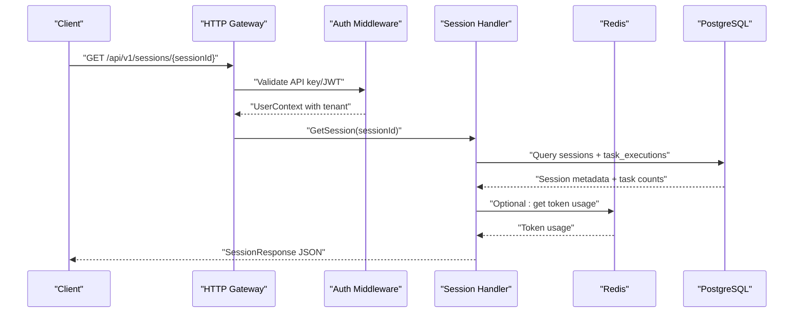
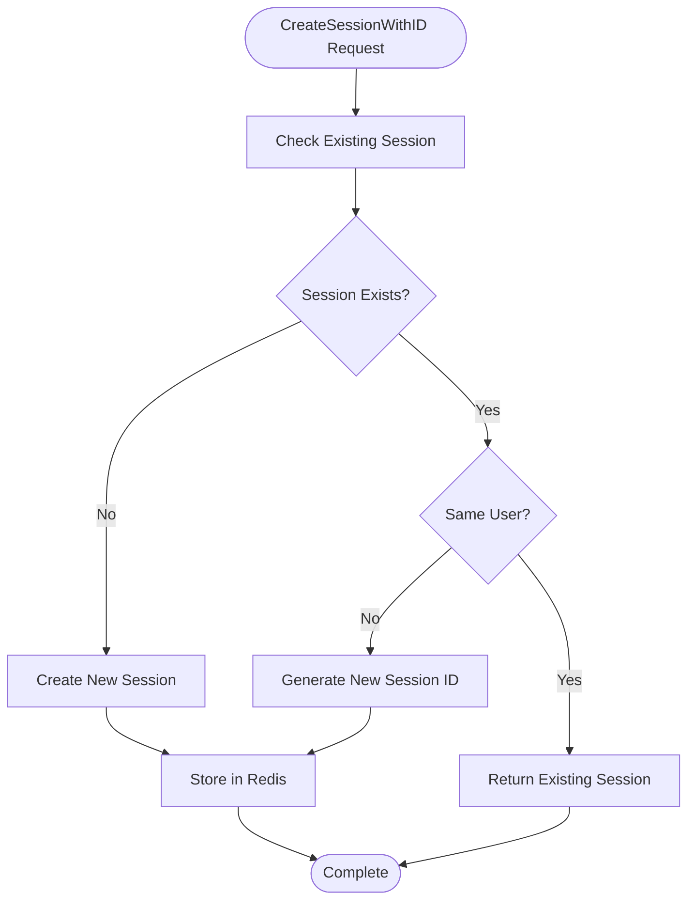
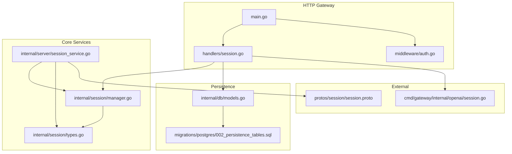

# Session Management Endpoints

<cite>
**Referenced Files in This Document**
- [session.go](file://go/orchestrator/cmd/gateway/internal/handlers/session.go)
- [session.go](file://go/orchestrator/cmd/gateway/internal/openai/session.go)
- [types.go](file://go/orchestrator/internal/session/types.go)
- [manager.go](file://go/orchestrator/internal/session/manager.go)
- [session.proto](file://protos/session/session.proto)
- [session_service.go](file://go/orchestrator/internal/server/session_service.go)
- [auth.go](file://go/orchestrator/cmd/gateway/internal/middleware/auth.go)
- [middleware.go](file://go/orchestrator/internal/auth/middleware.go)
- [session_continuity.py](file://clients/python/examples/session_continuity.py)
- [002_persistence_tables.sql](file://migrations/postgres/002_persistence_tables.sql)
- [main.go](file://go/orchestrator/cmd/gateway/main.go)
- [models.go](file://go/orchestrator/internal/db/models.go)
</cite>

## Table of Contents
1. [Introduction](#introduction)
2. [Project Structure](#project-structure)
3. [Core Components](#core-components)
4. [Architecture Overview](#architecture-overview)
5. [Detailed Component Analysis](#detailed-component-analysis)
6. [Dependency Analysis](#dependency-analysis)
7. [Performance Considerations](#performance-considerations)
8. [Troubleshooting Guide](#troubleshooting-guide)
9. [Conclusion](#conclusion)

## Introduction
This document provides comprehensive documentation for session management REST endpoints in the system. It covers session creation, continuation, and termination endpoints, along with request/response schemas, session metadata, persistence, timeout handling, automatic cleanup, validation middleware, session-based task routing, and session-scoped resource management. It also includes examples for session-aware task submission, session history retrieval, and debugging endpoints, as well as security considerations such as token binding and session hijacking prevention.

## Project Structure
The session management functionality spans multiple layers:
- HTTP Gateway: exposes REST endpoints for session operations
- Authentication Middleware: validates API keys/JWT and enforces tenant isolation
- Session Manager: manages session lifecycle in Redis with local caching
- Persistence Layer: stores task executions and session archives for analytics
- Protobuf Service: defines gRPC session service contract

**Diagram sources**
- [main.go](file://go/orchestrator/cmd/gateway/main.go#L135-L400)
- [auth.go](file://go/orchestrator/cmd/gateway/internal/middleware/auth.go#L48-L157)
- [session.go](file://go/orchestrator/cmd/gateway/internal/handlers/session.go#L132-L337)
- [session.go](file://go/orchestrator/cmd/gateway/internal/openai/session.go#L38-L133)

**Section sources**
- [main.go](file://go/orchestrator/cmd/gateway/main.go#L135-L400)

## Core Components
- Session Handler: Implements REST endpoints for session CRUD, history, and events
- Session Manager: Manages session lifecycle in Redis with local caching and TTL
- OpenAI-Compatible Session Manager: Derives and validates session IDs for OpenAI-compatible API
- Authentication Middleware: Validates API keys/JWT and enforces tenant isolation
- Protobuf Session Service: Defines gRPC contract for session operations
- Persistence Models: Define schema for task executions and session archives

**Section sources**
- [session.go](file://go/orchestrator/cmd/gateway/internal/handlers/session.go#L25-L111)
- [types.go](file://go/orchestrator/internal/session/types.go#L19-L37)
- [manager.go](file://go/orchestrator/internal/session/manager.go#L20-L95)
- [session.go](file://go/orchestrator/cmd/gateway/internal/openai/session.go#L38-L61)
- [auth.go](file://go/orchestrator/cmd/gateway/internal/middleware/auth.go#L24-L46)
- [session.proto](file://protos/session/session.proto#L12-L33)
- [models.go](file://go/orchestrator/internal/db/models.go#L61-L102)

## Architecture Overview
The session management architecture integrates HTTP REST endpoints with Redis-backed session storage and PostgreSQL-backed task execution persistence. Authentication middleware ensures tenant isolation and user authorization. The OpenAI-compatible session manager provides deterministic session derivation for external clients.

**Diagram sources**
- [main.go](file://go/orchestrator/cmd/gateway/main.go#L344-L352)
- [auth.go](file://go/orchestrator/cmd/gateway/internal/middleware/auth.go#L48-L157)
- [session.go](file://go/orchestrator/cmd/gateway/internal/handlers/session.go#L132-L337)

## Detailed Component Analysis

### REST Endpoints

#### Session Creation
- Endpoint: POST /api/v1/sessions
- Purpose: Create a new session with optional initial context and TTL
- Request Schema: CreateSessionRequest (protobuf)
- Response Schema: CreateSessionResponse (protobuf)
- Notes: Tenant-aware creation via auth context

#### Session Retrieval
- Endpoint: GET /api/v1/sessions/{sessionId}
- Purpose: Retrieve session metadata including tokens used, task count, and research session flags
- Response Schema: SessionResponse with fields:
  - session_id, user_id, context, token_budget, tokens_used, task_count
  - created_at, updated_at, expires_at
  - is_research_session, research_strategy

#### Session History
- Endpoint: GET /api/v1/sessions/{sessionId}/history
- Purpose: Retrieve task execution history for a session
- Response Schema: SessionHistoryResponse with:
  - session_id, tasks[], total
  - TaskHistory items include: task_id, workflow_id, query, status, mode, result
  - metrics: total_tokens, total_cost_usd, duration_ms, agents_used, tools_invoked
  - timestamps: started_at, completed_at, metadata

#### Session Events
- Endpoint: GET /api/v1/sessions/{sessionId}/events
- Purpose: Retrieve grouped turns with events per task (excluding LLM_PARTIAL)
- Query Parameters:
  - limit (1-100), offset, include_payload (boolean)
- Response: Grouped turns with events and metadata

#### Update Session Title
- Endpoint: PATCH /api/v1/sessions/{sessionId}
- Purpose: Update session title with validation (60 char max, control chars sanitized)
- Validation: Empty/whitespace-only, control-character-only, length checks

#### Delete Session
- Endpoint: DELETE /api/v1/sessions/{sessionId}
- Purpose: Soft-delete session (idempotent)
- Behavior: Removes session from Redis and local cache

**Section sources**
- [session.go](file://go/orchestrator/cmd/gateway/internal/handlers/session.go#L132-L337)
- [session.go](file://go/orchestrator/cmd/gateway/internal/handlers/session.go#L339-L518)
- [session.go](file://go/orchestrator/cmd/gateway/internal/handlers/session.go#L520-L800)
- [session.go](file://go/orchestrator/cmd/gateway/internal/handlers/session.go#L800-L800)

### Session Metadata
Core session metadata includes:
- session_id: Unique session identifier
- user_id: Owner of the session
- tenant_id: Tenant isolation (via auth context)
- created_at, updated_at, expires_at: Timestamps for lifecycle tracking
- context: Arbitrary JSON context for session state
- tokens_used: Total tokens consumed (from Redis or task aggregation)
- task_count: Number of tasks executed in session
- is_research_session, research_strategy: Flags derived from session context or first task metadata

**Section sources**
- [session.go](file://go/orchestrator/cmd/gateway/internal/handlers/session.go#L45-L111)
- [session.go](file://go/orchestrator/cmd/gateway/internal/handlers/session.go#L150-L326)

### Session Persistence and Timeout Handling
- Redis Storage: Sessions stored as JSON with TTL; keys use "session:{id}" format
- Local Cache: LRU cache with configurable size; maintains access times for eviction
- TTL Management: Default 30 days; can be extended via UpdateSession
- Cleanup: Automatic deletion of expired sessions; periodic cleanup routine available
- Tenant Isolation: Enforced via auth context and Redis key patterns

**Section sources**
- [manager.go](file://go/orchestrator/internal/session/manager.go#L97-L184)
- [manager.go](file://go/orchestrator/internal/session/manager.go#L186-L243)
- [manager.go](file://go/orchestrator/internal/session/manager.go#L266-L294)
- [manager.go](file://go/orchestrator/internal/session/manager.go#L363-L392)

### Automatic Session Cleanup
- Expired Session Deletion: Sessions older than ExpiresAt are removed from Redis and cache
- Periodic Cleanup: Background process iterates keys and deletes expired sessions
- Cache Eviction: LRU eviction when cache exceeds configured max size

**Section sources**
- [manager.go](file://go/orchestrator/internal/session/manager.go#L219-L224)
- [manager.go](file://go/orchestrator/internal/session/manager.go#L415-L451)

### Session Validation Middleware
- Authentication: Supports API keys and JWT tokens
- Token Detection: Automatically detects API key vs JWT format
- Tenant Isolation: Enforces user/tenant boundaries in all session operations
- Development Mode: Optional bypass for development with x-user-id/x-tenant-id headers

**Section sources**
- [auth.go](file://go/orchestrator/cmd/gateway/internal/middleware/auth.go#L24-L157)
- [middleware.go](file://go/orchestrator/internal/auth/middleware.go#L23-L114)

### Session-Based Task Routing
- Session Continuity: Tasks submitted with same session_id continue conversation context
- External ID Support: Sessions can have external_id in context for cross-boundary linking
- Token Tracking: Centralized token usage and cost tracking per session
- Agent State: Maintains agent-specific state within session context

**Section sources**
- [session.go](file://go/orchestrator/internal/session/manager.go#L97-L184)
- [session.go](file://go/orchestrator/internal/session/manager.go#L296-L311)

### Session-Scoped Resource Management
- Message History: Maintains conversation history with configurable limits
- Context Updates: Dynamic context updates for session state
- Metrics Collection: Tracks tokens, costs, and performance metrics
- Archive Integration: Session archives stored in PostgreSQL for analytics

**Section sources**
- [types.go](file://go/orchestrator/internal/session/types.go#L19-L145)
- [models.go](file://go/orchestrator/internal/db/models.go#L154-L170)

### Examples

#### Session-Aware Task Submission
- Demonstrates multi-turn conversation using stable session_id across submissions
- Shows retrieving session info and history after task completion

**Section sources**
- [session_continuity.py](file://clients/python/examples/session_continuity.py#L18-L79)

#### Session History Retrieval
- Fetches task execution history for a given session
- Includes detailed metrics per task execution

**Section sources**
- [session.go](file://go/orchestrator/cmd/gateway/internal/handlers/session.go#L339-L518)

#### Session Debugging Endpoints
- GET /api/v1/sessions/{sessionId}: Basic session metadata
- GET /api/v1/sessions/{sessionId}/history: Complete task history
- GET /api/v1/sessions/{sessionId}/events: Turn-based event streams

**Section sources**
- [main.go](file://go/orchestrator/cmd/gateway/main.go#L344-L373)

### Security Considerations

#### Token Binding and Session Hijacking Prevention
- Session Ownership Validation: When creating sessions with specific IDs, prevents reuse by different users
- Tenant Isolation: Enforced via auth context and Redis key patterns
- OpenAI-Compatible Session Collision Detection: Detects and rejects sessions owned by different users/tenants
- Secure Headers: Authentication via X-API-Key or Authorization: Bearer tokens

**Diagram sources**
- [manager.go](file://go/orchestrator/internal/session/manager.go#L134-L184)

**Section sources**
- [manager.go](file://go/orchestrator/internal/session/manager.go#L134-L184)
- [session.go](file://go/orchestrator/cmd/gateway/internal/openai/session.go#L87-L133)

## Dependency Analysis
The session management system has clear separation of concerns:
- HTTP Gateway depends on Session Handler for REST operations
- Session Handler depends on Database and Redis clients
- Session Manager encapsulates Redis operations and local caching
- Authentication Middleware provides tenant isolation
- Protobuf service defines gRPC contract for session operations

**Diagram sources**
- [main.go](file://go/orchestrator/cmd/gateway/main.go#L110-L120)
- [session.go](file://go/orchestrator/cmd/gateway/internal/handlers/session.go#L25-L43)
- [manager.go](file://go/orchestrator/internal/session/manager.go#L20-L31)
- [session_service.go](file://go/orchestrator/internal/server/session_service.go#L19-L32)
- [models.go](file://go/orchestrator/internal/db/models.go#L61-L102)
- [002_persistence_tables.sql](file://migrations/postgres/002_persistence_tables.sql#L8-L46)
- [session.go](file://go/orchestrator/cmd/gateway/internal/openai/session.go#L38-L61)
- [session.proto](file://protos/session/session.proto#L12-L33)

**Section sources**
- [main.go](file://go/orchestrator/cmd/gateway/main.go#L110-L120)
- [session.go](file://go/orchestrator/cmd/gateway/internal/handlers/session.go#L25-L43)
- [manager.go](file://go/orchestrator/internal/session/manager.go#L20-L31)

## Performance Considerations
- Redis Caching: Local LRU cache reduces Redis load; cache size configurable
- Lazy Loading: Sessions loaded on demand; cached with access time tracking
- Batch Operations: Redis operations batched where possible
- Query Optimization: Database queries optimized with appropriate indexes
- Streaming: SSE endpoints designed for long-lived connections with appropriate timeouts

## Troubleshooting Guide
Common issues and resolutions:
- Session Not Found: Verify session_id format and user ownership
- Authentication Failures: Check API key/JWT validity and format
- Tenant Isolation Errors: Ensure correct tenant context in requests
- Redis Connectivity: Verify Redis URL and credentials
- Database Connection: Check PostgreSQL connectivity and credentials

**Section sources**
- [session.go](file://go/orchestrator/cmd/gateway/internal/handlers/session.go#L171-L179)
- [auth.go](file://go/orchestrator/cmd/gateway/internal/middleware/auth.go#L117-L141)

## Conclusion
The session management system provides robust REST endpoints for session lifecycle operations, backed by Redis for fast access and PostgreSQL for durable persistence. The architecture emphasizes tenant isolation, security through validation and collision detection, and efficient resource management through caching and cleanup. The included examples demonstrate practical usage patterns for session-aware task submission and history retrieval.