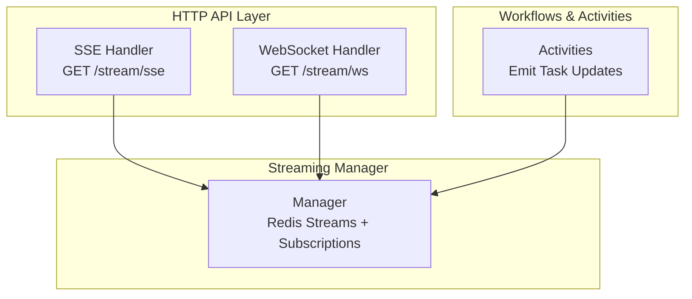
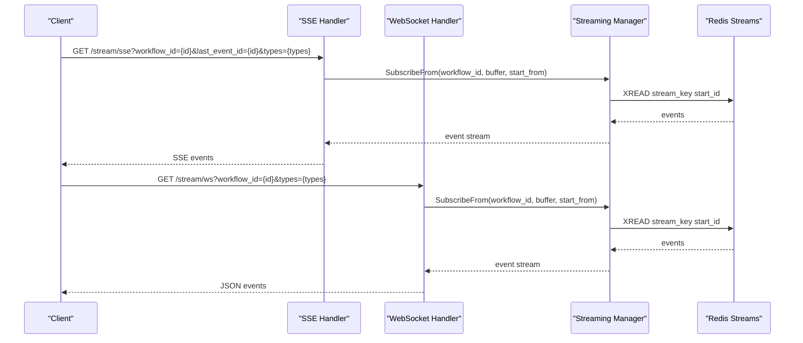
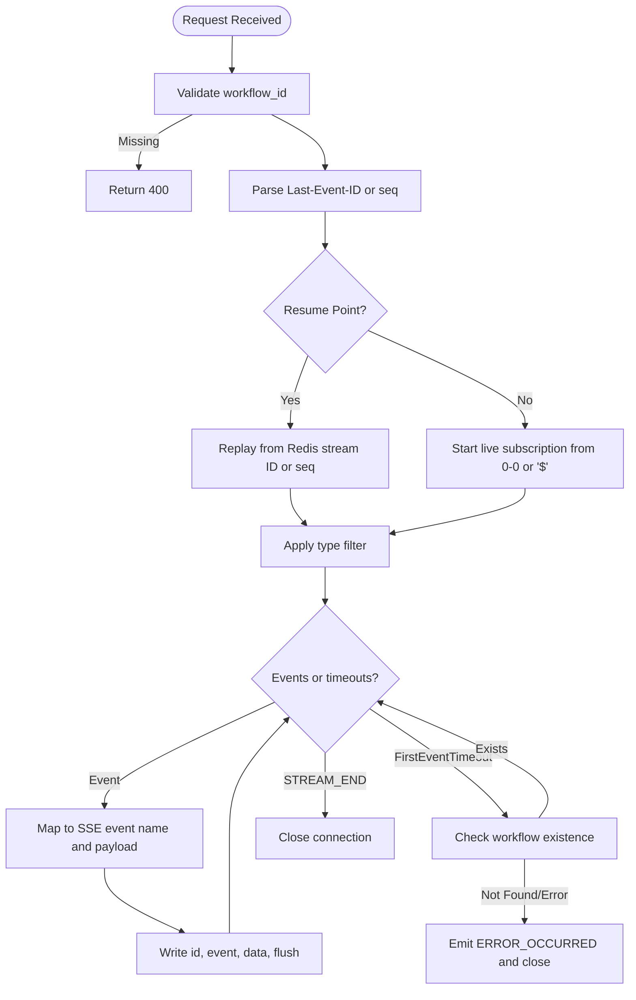
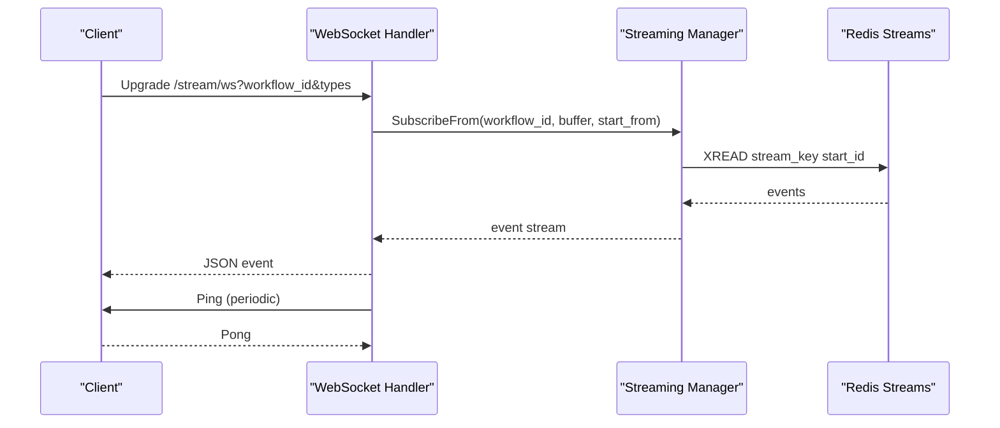
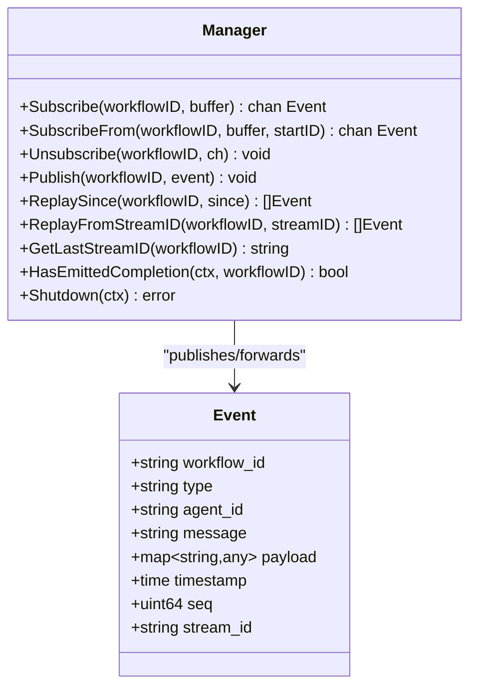
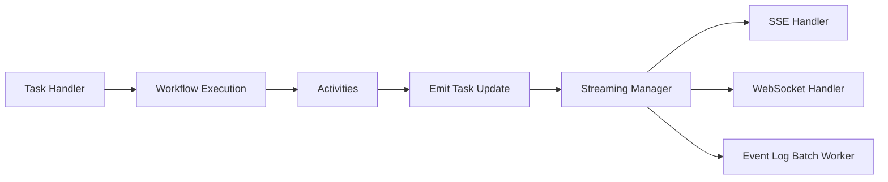

# Streaming Endpoints

<cite>
**Referenced Files in This Document**
- [streaming.go](file://go/orchestrator/internal/httpapi/streaming.go)
- [websocket.go](file://go/orchestrator/internal/httpapi/websocket.go)
- [manager.go](file://go/orchestrator/internal/streaming/manager.go)
- [stream_events.go](file://go/orchestrator/internal/activities/stream_events.go)
- [stream_messages.go](file://go/orchestrator/internal/activities/stream_messages.go)
- [simple_task.go](file://go/orchestrator/internal/activities/simple_task.go)
- [task.go](file://go/orchestrator/cmd/gateway/internal/handlers/task.go)
</cite>

## Table of Contents
1. [Introduction](#introduction)
2. [Project Structure](#project-structure)
3. [Core Components](#core-components)
4. [Architecture Overview](#architecture-overview)
5. [Detailed Component Analysis](#detailed-component-analysis)
6. [Dependency Analysis](#dependency-analysis)
7. [Performance Considerations](#performance-considerations)
8. [Troubleshooting Guide](#troubleshooting-guide)
9. [Conclusion](#conclusion)
10. [Appendices](#appendices)

## Introduction
This document describes the real-time streaming REST and WebSocket endpoints for workflow events. It covers:
- POST /api/v1/tasks/stream for submitting tasks and obtaining immediate streaming access identifiers
- GET /api/v1/stream/sse for Server-Sent Events (SSE) with event types, message formats, and connection handling
- GET /api/v1/stream/ws for WebSocket streaming with bidirectional protocol and connection handling
- Streaming event types and message schemas
- Error handling, connection resumption, filtering, and performance guidance for high-volume scenarios

## Project Structure
The streaming endpoints are implemented in the Go orchestrator service under the HTTP API and streaming manager layers. SSE and WebSocket handlers are registered on the same mux and share the same streaming manager for event publication and subscription.

**Diagram sources**
- [streaming.go](file://go/orchestrator/internal/httpapi/streaming.go#L34-L38)
- [websocket.go](file://go/orchestrator/internal/httpapi/websocket.go#L18-L21)
- [manager.go](file://go/orchestrator/internal/streaming/manager.go#L36-L60)
- [stream_events.go](file://go/orchestrator/internal/activities/stream_events.go#L72-L91)

**Section sources**
- [streaming.go](file://go/orchestrator/internal/httpapi/streaming.go#L34-L38)
- [websocket.go](file://go/orchestrator/internal/httpapi/websocket.go#L18-L21)
- [manager.go](file://go/orchestrator/internal/streaming/manager.go#L36-L60)

## Core Components
- StreamingHandler: Provides SSE and WebSocket endpoints backed by a streaming manager.
- Streaming Manager: Manages Redis Streams, event publishing, replay, and subscriber channels.
- Activities: Emit structured task/streaming events that are published to the stream manager.

Key responsibilities:
- SSE endpoint validates workflow_id, supports resume via Last-Event-ID or numeric seq, applies optional type filters, and emits structured events with heartbeat and completion semantics.
- WebSocket endpoint upgrades connections, supports resume and type filtering, and sends JSON events with periodic ping/pong.
- Streaming Manager persists events to Redis, maintains per-workflow streams, and delivers events to subscribers with backpressure handling.

**Section sources**
- [streaming.go](file://go/orchestrator/internal/httpapi/streaming.go#L18-L38)
- [manager.go](file://go/orchestrator/internal/streaming/manager.go#L36-L60)
- [stream_events.go](file://go/orchestrator/internal/activities/stream_events.go#L72-L91)

## Architecture Overview
The streaming architecture uses Redis Streams as the event backbone. Activities publish events to a per-workflow stream. SSE and WebSocket handlers subscribe to the stream and forward events to clients. Replay is supported via Redis stream IDs or numeric sequence numbers.

**Diagram sources**
- [streaming.go](file://go/orchestrator/internal/httpapi/streaming.go#L42-L366)
- [websocket.go](file://go/orchestrator/internal/httpapi/websocket.go#L23-L154)
- [manager.go](file://go/orchestrator/internal/streaming/manager.go#L157-L321)

## Detailed Component Analysis

### SSE Endpoint: GET /stream/sse
- Purpose: Real-time event streaming via Server-Sent Events.
- Query parameters:
  - workflow_id: Required. Identifies the target workflow.
  - last_event_id: Optional. Resume point; either a Redis stream ID (contains "-") or numeric sequence.
  - types: Optional. Comma-separated event type filter.
- Connection handling:
  - Sets SSE headers and flusher support.
  - Emits an initial comment to confirm connection.
  - Sends periodic heartbeat comments to keep proxies happy.
  - Closes on STREAM_END or after inactivity post completion.
- Replay and resume:
  - If last_event_id is a Redis stream ID, replays from that ID.
  - If numeric, replays events with sequence > since.
  - Continues live subscription from the last sent stream ID to avoid gaps.
- Event mapping:
  - Maps internal event types to SSE event names (e.g., thread.message.delta, thread.message.completed, error, done, workflow.* events).
  - Writes event ID (Redis stream ID or numeric seq), event name, and JSON data.
- Timeouts and termination:
  - First-event timeout checks workflow existence if Temporal client is available.
  - Post-completion inactivity timer closes the stream after a grace period.
  - Heartbeat ticker keeps the connection alive.

**Diagram sources**
- [streaming.go](file://go/orchestrator/internal/httpapi/streaming.go#L42-L366)

**Section sources**
- [streaming.go](file://go/orchestrator/internal/httpapi/streaming.go#L42-L366)

### WebSocket Endpoint: GET /stream/ws
- Purpose: Bidirectional real-time streaming via WebSocket.
- Query parameters:
  - workflow_id: Required. Identifies the target workflow.
  - types: Optional. Comma-separated event type filter.
- Connection handling:
  - Upgrades to WebSocket with dev-friendly origin policy.
  - Supports resume via Redis stream ID or numeric sequence.
  - Sends periodic ping frames and handles pong to keepalive.
- Replay and resume:
  - Same replay logic as SSE: Redis stream ID or numeric sequence.
- Delivery:
  - Forwards events as JSON messages to the client.
  - Ignores client messages (reader goroutine discards inbound frames).

**Diagram sources**
- [websocket.go](file://go/orchestrator/internal/httpapi/websocket.go#L23-L154)
- [manager.go](file://go/orchestrator/internal/streaming/manager.go#L157-L321)

**Section sources**
- [websocket.go](file://go/orchestrator/internal/httpapi/websocket.go#L23-L154)

### Streaming Manager
- Responsibilities:
  - Publishes events to Redis Streams with sequence numbers and TTL.
  - Subscribes clients to per-workflow streams with buffered channels.
  - Replays events from Redis stream ID or numeric sequence.
  - Applies backpressure and logs dropped events for critical types.
  - Persists selected events to PostgreSQL via a batching worker.
- Backpressure and logging:
  - Non-blocking send to subscribers; logs warnings or critical errors when buffers overflow.
  - Critical event types include completion/failure and error markers.
- Persistence:
  - Filters and batches important events (e.g., completion, error, tool invocations) to PostgreSQL.
  - Sanitizes payloads to avoid storing large base64 images.

**Diagram sources**
- [manager.go](file://go/orchestrator/internal/streaming/manager.go#L36-L60)
- [manager.go](file://go/orchestrator/internal/streaming/manager.go#L19-L29)

**Section sources**
- [manager.go](file://go/orchestrator/internal/streaming/manager.go#L36-L60)
- [manager.go](file://go/orchestrator/internal/streaming/manager.go#L19-L29)

### Event Types and Message Schemas
- Internal event types emitted by activities include workflow lifecycle, agent lifecycle, tool invocation, LLM output, and workflow control (pause/resume/cancel).
- SSE mapping:
  - LLM_PARTIAL -> thread.message.delta
  - LLM_OUTPUT -> thread.message.completed
  - ERROR_OCCURRED -> error
  - STREAM_END -> done
  - Workflow control events mapped to workflow.* names
- WebSocket:
  - Events are forwarded as JSON messages with the internal schema.

Representative event fields:
- workflow_id: Target workflow identifier
- type: Event category/type
- agent_id: Optional agent identifier
- message: Human-readable message (may be truncated)
- payload: Structured metadata (e.g., checkpoint, was_paused)
- timestamp: Event timestamp
- seq: Numeric sequence number
- stream_id: Redis stream ID for deduplication

**Section sources**
- [stream_events.go](file://go/orchestrator/internal/activities/stream_events.go#L14-L59)
- [streaming.go](file://go/orchestrator/internal/httpapi/streaming.go#L106-L184)
- [manager.go](file://go/orchestrator/internal/streaming/manager.go#L19-L29)

### Task Submission and Streaming Access
- The repository includes a task submission handler that starts workflows and returns workflow identifiers. Clients can use the returned workflow_id to connect to SSE or WebSocket streaming endpoints.
- The task handler integrates with Temporal and emits initial task events that appear as WORKFLOW_STARTED and related updates in the stream.

Note: The exact POST /api/v1/tasks/stream endpoint is not present in the analyzed files. Based on the repository’s task submission handler and streaming manager, the recommended approach is:
- Submit a task via the existing task submission endpoint to obtain a workflow_id
- Connect to SSE at GET /stream/sse?workflow_id={id} or WebSocket at GET /stream/ws?workflow_id={id}
- Optionally filter events with types and resume with last_event_id

**Section sources**
- [task.go](file://go/orchestrator/cmd/gateway/internal/handlers/task.go)
- [simple_task.go](file://go/orchestrator/internal/activities/simple_task.go#L40-L106)

## Dependency Analysis
- SSE and WebSocket handlers depend on the streaming manager for subscription and replay.
- Activities emit events that are published to Redis and forwarded to subscribers.
- Persistence depends on PostgreSQL via the event log batcher.

**Diagram sources**
- [task.go](file://go/orchestrator/cmd/gateway/internal/handlers/task.go)
- [stream_events.go](file://go/orchestrator/internal/activities/stream_events.go#L72-L91)
- [manager.go](file://go/orchestrator/internal/streaming/manager.go#L662-L696)

**Section sources**
- [task.go](file://go/orchestrator/cmd/gateway/internal/handlers/task.go)
- [stream_events.go](file://go/orchestrator/internal/activities/stream_events.go#L72-L91)
- [manager.go](file://go/orchestrator/internal/streaming/manager.go#L662-L696)

## Performance Considerations
- Buffer sizing: Both SSE and WebSocket handlers use a fixed buffer size when subscribing. Tune buffer sizes according to expected throughput.
- Backpressure: The manager drops events on slow subscribers and escalates logging for critical types. Ensure clients drain channels promptly.
- Replay efficiency: Resume via Redis stream ID avoids re-sending events and reduces bandwidth.
- Persistence batching: Event log batch size and interval are configurable via environment variables. Larger batches reduce DB load but increase latency.
- Connection keep-alive: SSE uses shorter heartbeat intervals and WebSocket uses periodic ping/pong to survive proxy timeouts.
- Payload size: The manager sanitizes payloads to avoid storing large base64 images, reducing Redis and DB footprint.

[No sources needed since this section provides general guidance]

## Troubleshooting Guide
- SSE connection closes unexpectedly:
  - Verify workflow_id is valid and the workflow exists.
  - Check first-event timeout behavior and whether the Temporal client is available.
  - Confirm that the stream ends with STREAM_END or that post-completion inactivity closes the connection.
- WebSocket disconnects:
  - Ensure client responds to ping frames; the server extends read deadlines on pong.
  - Validate resume parameters (last_event_id) and type filters.
- Slow subscribers:
  - Monitor dropped events in logs; critical events are logged with higher severity.
  - Increase subscriber buffer or reduce event frequency.
- Persistence issues:
  - Review event log batch worker logs and adjust batch size/interval.
  - Confirm that only important events are persisted to reduce DB load.

**Section sources**
- [streaming.go](file://go/orchestrator/internal/httpapi/streaming.go#L284-L312)
- [websocket.go](file://go/orchestrator/internal/httpapi/websocket.go#L115-L120)
- [manager.go](file://go/orchestrator/internal/streaming/manager.go#L304-L317)
- [manager.go](file://go/orchestrator/internal/streaming/manager.go#L463-L472)

## Conclusion
The streaming endpoints provide robust, scalable real-time event delivery via SSE and WebSocket, backed by Redis Streams and a managed subscription model. Clients can resume streams, filter events, and receive structured updates for workflow lifecycle, agent actions, tool usage, and LLM outputs. For high-volume scenarios, tune buffers, monitor backpressure, and leverage replay and persistence configurations to balance responsiveness and resource usage.

[No sources needed since this section summarizes without analyzing specific files]

## Appendices

### Example Client Implementation Notes
- SSE client:
  - Use Last-Event-ID header or last_event_id query param to resume.
  - Apply event type filters to reduce noise.
  - Implement exponential backoff on reconnect.
- WebSocket client:
  - Send periodic pings to keep the connection alive.
  - Implement graceful reconnect with resume support.
  - Filter events server-side via types query param.

[No sources needed since this section provides general guidance]