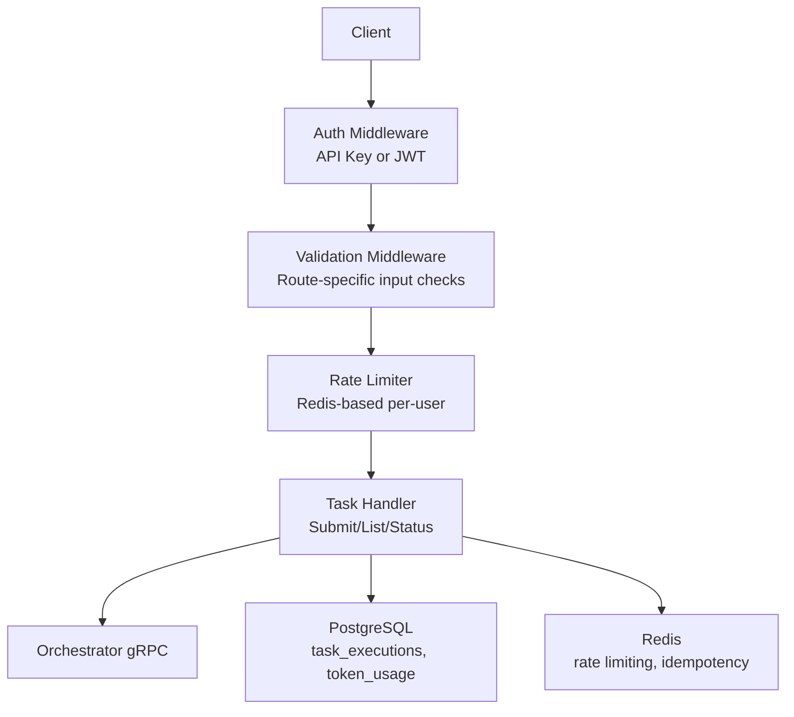
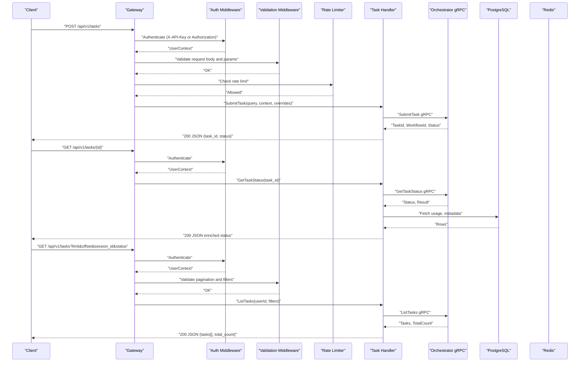
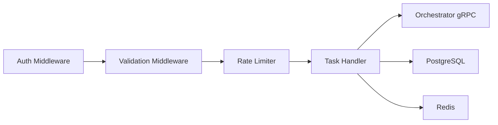

# Task Management Endpoints

<cite>
**Referenced Files in This Document**
- [task.go](file://go/orchestrator/cmd/gateway/internal/handlers/task.go)
- [auth.go](file://go/orchestrator/cmd/gateway/internal/middleware/auth.go)
- [ratelimit.go](file://go/orchestrator/cmd/gateway/internal/middleware/ratelimit.go)
- [validation.go](file://go/orchestrator/cmd/gateway/internal/middleware/validation.go)
- [main.go](file://go/orchestrator/cmd/gateway/main.go)
- [research_strategies.yaml](file://config/research_strategies.yaml)
- [task-submission-api.md](file://docs/task-submission-api.md)
- [simple_task.py](file://clients/python/examples/simple_task.py)
</cite>

## Table of Contents
1. [Introduction](#introduction)
2. [Project Structure](#project-structure)
3. [Core Components](#core-components)
4. [Architecture Overview](#architecture-overview)
5. [Detailed Component Analysis](#detailed-component-analysis)
6. [Dependency Analysis](#dependency-analysis)
7. [Performance Considerations](#performance-considerations)
8. [Troubleshooting Guide](#troubleshooting-guide)
9. [Conclusion](#conclusion)

## Introduction
This document provides comprehensive documentation for the task management REST endpoints exposed by the gateway. It covers:
- POST /api/v1/tasks for task submission with request schema including query, session_id, context, model_tier, model_override, provider_override, research_strategy, and optional execution parameters.
- GET /api/v1/tasks/{id} for task status retrieval with response schema containing task_id, workflow_id, status, result, error, usage metadata, and model/provider information.
- GET /api/v1/tasks for task listing with pagination parameters (limit, offset), filtering by session_id and status, and response format with task summaries.
It also includes request/response examples, error handling scenarios, authentication requirements, rate limiting behavior, and practical usage patterns for different task types.

## Project Structure
The task management endpoints are implemented in the gateway service and wired into the HTTP server:
- Handlers: task submission, status retrieval, and listing are implemented in the task handler.
- Authentication: API key or JWT-based authentication middleware.
- Rate Limiting: per-user Redis-based rate limiter.
- Validation: route-specific input validation for pagination and IDs.
- Routing: endpoints registered in the HTTP server with middleware chaining.

**Diagram sources**
- [main.go](file://go/orchestrator/cmd/gateway/main.go#L185-L314)
- [auth.go](file://go/orchestrator/cmd/gateway/internal/middleware/auth.go#L24-L156)
- [validation.go](file://go/orchestrator/cmd/gateway/internal/middleware/validation.go#L13-L86)
- [ratelimit.go](file://go/orchestrator/cmd/gateway/internal/middleware/ratelimit.go#L15-L104)
- [task.go](file://go/orchestrator/cmd/gateway/internal/handlers/task.go#L28-L306)

**Section sources**
- [main.go](file://go/orchestrator/cmd/gateway/main.go#L185-L314)

## Core Components
- TaskHandler: Implements task submission, status retrieval, and listing. Applies context and model/provider overrides, validates inputs, enriches responses with usage metadata, and integrates with orchestrator gRPC and PostgreSQL.
- Auth Middleware: Supports API key and JWT authentication, with development-mode bypass and header/query param token extraction.
- Rate Limiter: Per-user rate limiting using Redis with 1-minute windows and burst control.
- Validation Middleware: Validates pagination, IDs, and optional filters for task endpoints.

**Section sources**
- [task.go](file://go/orchestrator/cmd/gateway/internal/handlers/task.go#L28-L306)
- [auth.go](file://go/orchestrator/cmd/gateway/internal/middleware/auth.go#L24-L156)
- [ratelimit.go](file://go/orchestrator/cmd/gateway/internal/middleware/ratelimit.go#L15-L104)
- [validation.go](file://go/orchestrator/cmd/gateway/internal/middleware/validation.go#L13-L86)

## Architecture Overview
The gateway exposes REST endpoints that validate, transform, and forward requests to the orchestrator. Responses are enriched with usage metadata from PostgreSQL and optionally include model breakdowns.

**Diagram sources**
- [main.go](file://go/orchestrator/cmd/gateway/main.go#L185-L314)
- [task.go](file://go/orchestrator/cmd/gateway/internal/handlers/task.go#L377-L815)
- [auth.go](file://go/orchestrator/cmd/gateway/internal/middleware/auth.go#L48-L156)
- [validation.go](file://go/orchestrator/cmd/gateway/internal/middleware/validation.go#L22-L86)
- [ratelimit.go](file://go/orchestrator/cmd/gateway/internal/middleware/ratelimit.go#L35-L104)

## Detailed Component Analysis

### POST /api/v1/tasks
Purpose: Submit a task for execution.

- Request Schema
  - query: string, required
  - session_id: string, optional (auto-generated if omitted)
  - context: object, optional (execution context)
  - mode: string, optional ("simple" | "standard" | "complex" | "supervisor")
  - model_tier: string, optional ("small" | "medium" | "large")
  - model_override: string, optional (specific model name)
  - provider_override: string, optional (provider name)
  - research_strategy: string, optional ("quick" | "standard" | "deep" | "academic")
  - max_iterations: integer, optional (legacy; use context.react_max_iterations)
  - max_concurrent_agents: integer, optional (1..20)
  - enable_verification: boolean, optional

- Processing Logic
  - Validates presence of query.
  - Generates session_id if missing.
  - Applies model tier/provider overrides and research strategy presets into context.
  - Enforces conflict validation (disable_ai cannot be combined with model controls).
  - Propagates auth/tracing headers to gRPC metadata.
  - Calls orchestrator SubmitTask and returns task_id, workflow_id, and status.

- Response
  - 200 OK JSON with task_id, status, message, created_at.
  - Headers: X-Workflow-ID, X-Session-ID.

- Examples
  - Basic submission with session and mode.
  - Research strategy preset application.
  - Template-only execution with disable_ai.

- Practical Usage Patterns
  - Simple tasks: use mode "simple" or rely on auto-detection.
  - Supervisor tasks: use mode "supervisor" for multi-agent workflows.
  - Cost-conscious research: choose research_strategy presets and model tiers.
  - Provider/model overrides: use provider_override and model_override for deterministic routing.

**Section sources**
- [task.go](file://go/orchestrator/cmd/gateway/internal/handlers/task.go#L377-L466)
- [task.go](file://go/orchestrator/cmd/gateway/internal/handlers/task.go#L139-L291)
- [task-submission-api.md](file://docs/task-submission-api.md#L12-L134)
- [research_strategies.yaml](file://config/research_strategies.yaml#L12-L52)

### GET /api/v1/tasks/{id}
Purpose: Retrieve task status and enriched metadata.

- Path Parameter
  - id: string, required (task/workflow identifier)

- Response Schema
  - task_id: string
  - workflow_id: string (same as task_id)
  - status: string (enum from orchestrator)
  - result: string (raw result from LLM)
  - response: object (parsed JSON if result is valid JSON)
  - error: string (error message if failed)
  - created_at, updated_at: timestamps
  - query: string (from stored metadata)
  - session_id: string
  - mode: string
  - context: object (task context)
  - model_used: string
  - provider: string
  - usage: object (total_tokens, input_tokens, output_tokens, estimated_cost)
  - metadata: object (citations, model_breakdown, etc.)

- Processing Logic
  - Authenticates request.
  - Calls orchestrator GetTaskStatus.
  - Enriches with stored metadata (query, session_id, mode, model, provider, tokens, cost).
  - Builds model_breakdown from token_usage table for multi-model tasks.

- Examples
  - Completed task with usage and model breakdown.
  - Multi-model breakdown for research workflows.

**Section sources**
- [task.go](file://go/orchestrator/cmd/gateway/internal/handlers/task.go#L560-L715)
- [task.go](file://go/orchestrator/cmd/gateway/internal/handlers/task.go#L1180-L1248)
- [task-submission-api.md](file://docs/task-submission-api.md#L304-L366)

### GET /api/v1/tasks
Purpose: List tasks with pagination and filtering.

- Query Parameters
  - limit: integer, default 20, min 1, max 100
  - offset: integer, default 0, min 0
  - session_id: string, optional (valid ID format)
  - status: string, optional (QUEUED | RUNNING | COMPLETED | FAILED | CANCELLED | CANCELED | TIMEOUT)

- Response Schema
  - tasks: array of task summaries
    - task_id: string
    - query: string
    - status: string
    - mode: string
    - created_at: timestamp
    - completed_at: timestamp
    - total_token_usage: object (total_tokens, cost_usd, prompt_tokens, completion_tokens)
  - total_count: integer

- Processing Logic
  - Authenticates request.
  - Validates pagination and optional filters.
  - Calls orchestrator ListTasks with userId, filters, and pagination.
  - Maps response to HTTP-friendly shape.

**Section sources**
- [task.go](file://go/orchestrator/cmd/gateway/internal/handlers/task.go#L717-L815)
- [validation.go](file://go/orchestrator/cmd/gateway/internal/middleware/validation.go#L29-L39)

### Endpoint Wiring and Middleware Chain
- POST /api/v1/tasks
  - Middleware order: Tracing → Auth → Validation → Rate Limit → Idempotency → Handler
- GET /api/v1/tasks/{id}
  - Middleware order: Tracing → Auth → Validation → Handler
- GET /api/v1/tasks
  - Middleware order: Tracing → Auth → Validation → Rate Limit → Handler

**Section sources**
- [main.go](file://go/orchestrator/cmd/gateway/main.go#L185-L314)

## Dependency Analysis
- Authentication
  - Token extraction supports X-API-Key and Authorization: Bearer.
  - Development mode allows bypass with x-user-id and x-tenant-id headers.
- Rate Limiting
  - Per-user sliding window with Redis.
  - Returns X-RateLimit-* headers and Retry-After on exceedance.
- Validation
  - Route-specific checks for IDs, pagination, and optional filters.
- Data Access
  - PostgreSQL for task metadata and usage aggregation.
  - Redis for rate limiting and idempotency.

**Diagram sources**
- [auth.go](file://go/orchestrator/cmd/gateway/internal/middleware/auth.go#L48-L156)
- [validation.go](file://go/orchestrator/cmd/gateway/internal/middleware/validation.go#L22-L86)
- [ratelimit.go](file://go/orchestrator/cmd/gateway/internal/middleware/ratelimit.go#L35-L104)
- [task.go](file://go/orchestrator/cmd/gateway/internal/handlers/task.go#L28-L306)

**Section sources**
- [auth.go](file://go/orchestrator/cmd/gateway/internal/middleware/auth.go#L48-L156)
- [ratelimit.go](file://go/orchestrator/cmd/gateway/internal/middleware/ratelimit.go#L15-L104)
- [validation.go](file://go/orchestrator/cmd/gateway/internal/middleware/validation.go#L13-L86)

## Performance Considerations
- Rate Limiting: Default 60 requests per minute per user with a 10-request burst. Tune via environment and Redis configuration.
- Pagination: Use limit and offset to control payload sizes for listing endpoints.
- Streaming: Use POST /api/v1/tasks/stream to receive a stream URL for SSE, reducing long-lived polling overhead.
- Model Breakdown: Aggregation queries may be expensive for very large workloads; cache or precompute where appropriate.

[No sources needed since this section provides general guidance]

## Troubleshooting Guide
- Authentication Failures
  - Ensure X-API-Key or Authorization: Bearer token is provided.
  - In development, confirm GATEWAY_SKIP_AUTH is set appropriately and environment is development/test.
- Rate Limit Exceeded
  - Observe X-RateLimit-Limit, X-RateLimit-Remaining, X-RateLimit-Reset headers.
  - Respect Retry-After on 429 responses.
- Invalid Inputs
  - Verify IDs match the allowed pattern and pagination parameters are within bounds.
  - Check status filter values are valid.
- Task Not Found
  - Confirm task_id exists and belongs to the authenticated user.
- Model/Provider Overrides
  - Ensure model_override and provider_override are valid and compatible.
  - Avoid combining disable_ai with model controls.

**Section sources**
- [auth.go](file://go/orchestrator/cmd/gateway/internal/middleware/auth.go#L102-L156)
- [ratelimit.go](file://go/orchestrator/cmd/gateway/internal/middleware/ratelimit.go#L58-L104)
- [validation.go](file://go/orchestrator/cmd/gateway/internal/middleware/validation.go#L90-L161)
- [task.go](file://go/orchestrator/cmd/gateway/internal/handlers/task.go#L587-L598)

## Conclusion
The task management endpoints provide a robust, authenticated, and rate-controlled interface for submitting, monitoring, and listing tasks. They integrate tightly with orchestrator workflows, enrich responses with usage metadata, and support flexible execution modes and model/provider overrides. Following the documented patterns and validations ensures reliable operation across diverse task types and usage scenarios.