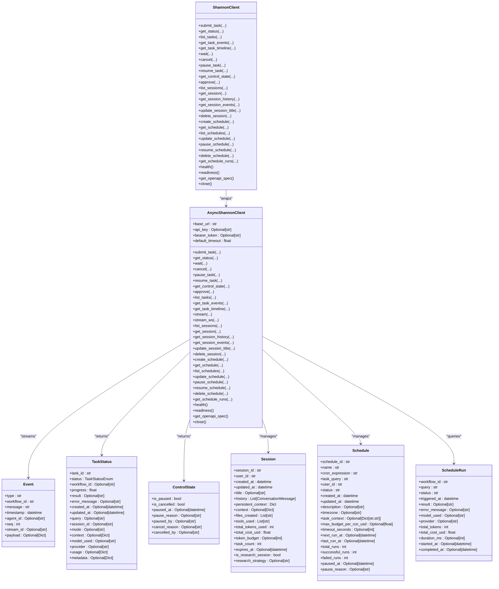

# SDK & Client Libraries

<cite>
**Referenced Files in This Document**
- [README.md](file://clients/python/README.md)
- [pyproject.toml](file://clients/python/pyproject.toml)
- [__init__.py](file://clients/python/src/shannon/__init__.py)
- [client.py](file://clients/python/src/shannon/client.py)
- [models.py](file://clients/python/src/shannon/models.py)
- [errors.py](file://clients/python/src/shannon/errors.py)
- [cli.py](file://clients/python/src/shannon/cli.py)
- [simple_task.py](file://clients/python/examples/simple_task.py)
- [simple_streaming.py](file://clients/python/examples/simple_streaming.py)
- [session_continuity.py](file://clients/python/examples/session_continuity.py)
- [streaming_with_approvals.py](file://clients/python/examples/streaming_with_approvals.py)
- [model_selection.py](file://clients/python/examples/model_selection.py)
- [test_v030_comprehensive.py](file://clients/python/tests/test_v030_comprehensive.py)
</cite>

## Table of Contents
1. [Introduction](#introduction)
2. [Project Structure](#project-structure)
3. [Core Components](#core-components)
4. [Architecture Overview](#architecture-overview)
5. [Detailed Component Analysis](#detailed-component-analysis)
6. [Dependency Analysis](#dependency-analysis)
7. [Performance Considerations](#performance-considerations)
8. [Troubleshooting Guide](#troubleshooting-guide)
9. [Conclusion](#conclusion)
10. [Appendices](#appendices)

## Introduction
This document provides comprehensive SDK and client library documentation for programmatic integration with the Shannon multi-agent AI platform. It covers the official Python SDK, including installation, initialization, configuration, client methods for task submission, status polling, and streaming, as well as the CLI tool, configuration management, and batch processing capabilities. It also includes practical examples for common use cases, error handling, retry mechanisms, timeout management, SDK versioning, compatibility, and migration guidance.

## Project Structure
The Python SDK is organized as a single-package distribution with a clear separation of concerns:
- Public API surface exposed via the package’s top-level module
- Asynchronous and synchronous client implementations
- Data models and typed enums
- Error hierarchy
- CLI tool for operational tasks
- Examples and tests demonstrating usage patterns

**Diagram sources**
- [__init__.py](file://clients/python/src/shannon/__init__.py#L1-L84)
- [client.py](file://clients/python/src/shannon/client.py#L79-L2078)
- [models.py](file://clients/python/src/shannon/models.py#L1-L400)
- [errors.py](file://clients/python/src/shannon/errors.py#L1-L110)
- [cli.py](file://clients/python/src/shannon/cli.py#L1-L490)
- [pyproject.toml](file://clients/python/pyproject.toml#L1-L78)
- [README.md](file://clients/python/README.md#L442-L454)

**Section sources**
- [README.md](file://clients/python/README.md#L442-L454)
- [pyproject.toml](file://clients/python/pyproject.toml#L1-L78)

## Core Components
- AsyncShannonClient: Full-featured asynchronous client implementing all HTTP endpoints, streaming, and utilities.
- ShannonClient: Synchronous wrapper around AsyncShannonClient, enabling blocking usage.
- Models: Strongly typed data models and enums for tasks, sessions, schedules, events, and statuses.
- Errors: Hierarchical exception types for robust error handling.
- CLI: Command-line interface for task submission, status retrieval, streaming, approvals, sessions, and schedules.

Key capabilities:
- Task lifecycle: submit, status, wait, cancel, pause/resume, control-state, events, timeline
- Streaming: SSE-based event streaming with resume, filtering, and retry
- Sessions: list, get, history, events, update title, delete
- Schedules: create, list, get, update, pause/resume, delete, runs
- Approvals: submit decisions
- Health and discovery: health, readiness, OpenAPI spec
- CLI: One-command operations for common tasks

**Section sources**
- [client.py](file://clients/python/src/shannon/client.py#L79-L2078)
- [models.py](file://clients/python/src/shannon/models.py#L12-L400)
- [errors.py](file://clients/python/src/shannon/errors.py#L6-L110)
- [cli.py](file://clients/python/src/shannon/cli.py#L11-L490)

## Architecture Overview
The SDK exposes two client classes that share a common implementation:
- AsyncShannonClient: Uses httpx.AsyncClient for all operations and provides streaming via HTTP SSE.
- ShannonClient: Wraps AsyncShannonClient and executes coroutines synchronously.

**Diagram sources**
- [client.py](file://clients/python/src/shannon/client.py#L79-L2078)
- [models.py](file://clients/python/src/shannon/models.py#L69-L400)

## Detailed Component Analysis

### Installation and Setup
- Install the package in development mode with optional dev dependencies and extras.
- The package declares httpx as a core dependency and optionally supports websockets for WebSocket streaming.
- The CLI script entry point is configured for convenient command-line usage.

Best practices:
- Prefer environment variables for credentials and base URL.
- Use bearer tokens for short-lived access when appropriate.

**Section sources**
- [README.md](file://clients/python/README.md#L7-L15)
- [pyproject.toml](file://clients/python/pyproject.toml#L25-L51)

### Initialization and Configuration
- Initialize either AsyncShannonClient or ShannonClient with base_url, api_key, bearer_token, and default_timeout.
- Authentication is applied via Authorization header (Bearer) or X-API-Key header depending on which credential is provided.
- The client lazily initializes an httpx.AsyncClient and reuses it across calls.

Operational tips:
- Set default_timeout to balance responsiveness and reliability.
- Use idempotency_key for submit_task to ensure idempotent retries.

**Section sources**
- [client.py](file://clients/python/src/shannon/client.py#L82-L122)
- [client.py](file://clients/python/src/shannon/client.py#L194-L250)

### Task Submission and Lifecycle
- submit_task: Submits a query with optional session_id, context, idempotency_key, traceparent, model_tier, model_override, provider_override, mode, and timeout.
- submit_and_stream: Submits a task and returns a TaskHandle plus a stream URL for immediate SSE consumption.
- get_status: Retrieves current status, progress, result, timestamps, model/provider, usage, and metadata.
- wait: Polls status until completion or timeout, configurable poll_interval.
- cancel/pause/resume: Control task execution state; pause/resume are checkpoint-safe.
- get_control_state: Inspect pause/cancel state and reasons.
- get_task_events/get_task_timeline: Retrieve persistent event history and deterministic timeline.

**Diagram sources**
- [client.py](file://clients/python/src/shannon/client.py#L163-L250)
- [client.py](file://clients/python/src/shannon/client.py#L343-L430)
- [client.py](file://clients/python/src/shannon/client.py#L593-L633)

**Section sources**
- [client.py](file://clients/python/src/shannon/client.py#L163-L250)
- [client.py](file://clients/python/src/shannon/client.py#L343-L430)
- [client.py](file://clients/python/src/shannon/client.py#L593-L633)
- [client.py](file://clients/python/src/shannon/client.py#L634-L761)
- [client.py](file://clients/python/src/shannon/client.py#L767-L820)

### Streaming Workflows
- stream: SSE-based streaming with optional type filtering, resume via last_event_id, reconnect with exponential backoff, and total timeout protection.
- stream_ws: Optional WebSocket streaming if the websockets extra is installed.
- Event model supports payload extraction and resume identifiers.

**Diagram sources**
- [client.py](file://clients/python/src/shannon/client.py#L1807-L2007)
- [client.py](file://clients/python/src/shannon/client.py#L1858-L1988)

**Section sources**
- [client.py](file://clients/python/src/shannon/client.py#L1807-L2007)
- [client.py](file://clients/python/src/shannon/client.py#L2009-L2064)

### Approvals and Control Signals
- approve: Submit approval decisions for pending requests with feedback.
- pause_task/resume_task/get_control_state: Manage pause/resume and inspect control state.

**Section sources**
- [client.py](file://clients/python/src/shannon/client.py#L822-L875)
- [client.py](file://clients/python/src/shannon/client.py#L678-L761)
- [client.py](file://clients/python/src/shannon/client.py#L767-L820)

### Session Management
- list_sessions/get_session/get_session_history/get_session_events: Retrieve session summaries, details, history items, and event turns.
- update_session_title/delete_session: Modify titles and delete sessions.

**Section sources**
- [client.py](file://clients/python/src/shannon/client.py#L879-L977)
- [client.py](file://clients/python/src/shannon/client.py#L979-L1045)
- [client.py](file://clients/python/src/shannon/client.py#L1047-L1169)
- [client.py](file://clients/python/src/shannon/client.py#L1171-L1247)

### Schedule Management
- create_schedule/get_schedule/list_schedules/update_schedule/pause_schedule/resume_schedule/delete_schedule/get_schedule_runs: Full CRUD for scheduled tasks with cron expressions, budgets, and execution history.

**Section sources**
- [client.py](file://clients/python/src/shannon/client.py#L1251-L1319)
- [client.py](file://clients/python/src/shannon/client.py#L1321-L1378)
- [client.py](file://clients/python/src/shannon/client.py#L1380-L1443)
- [client.py](file://clients/python/src/shannon/client.py#L1445-L1522)
- [client.py](file://clients/python/src/shannon/client.py#L1524-L1606)
- [client.py](file://clients/python/src/shannon/client.py#L1608-L1642)
- [client.py](file://clients/python/src/shannon/client.py#L1644-L1708)

### CLI Tool Usage
- Global flags: --base-url, --api-key, --bearer-token
- Commands: submit, status, cancel, pause, resume, control-state, stream, approve, session-list, session-get, session-title, session-delete, schedule-create, schedule-list, schedule-get, schedule-update, schedule-pause, schedule-resume, schedule-delete, schedule-runs
- One-liner examples and command-specific help are documented in the README.

**Section sources**
- [README.md](file://clients/python/README.md#L74-L140)
- [cli.py](file://clients/python/src/shannon/cli.py#L11-L490)

### Batch Processing Capabilities
- list_tasks: Paginated listing with filters by status and session_id.
- list_schedules: Paginated listing with status filter.
- get_schedule_runs: Paginated execution history for a schedule.

**Section sources**
- [client.py](file://clients/python/src/shannon/client.py#L432-L505)
- [client.py](file://clients/python/src/shannon/client.py#L1380-L1443)
- [client.py](file://clients/python/src/shannon/client.py#L1644-L1708)

### Common Use Cases and Examples
- Simple task submission and status polling: [simple_task.py](file://clients/python/examples/simple_task.py#L1-L48)
- Simple streaming with filtered event types: [simple_streaming.py](file://clients/python/examples/simple_streaming.py#L1-L45)
- Session continuity across turns: [session_continuity.py](file://clients/python/examples/session_continuity.py#L1-L79)
- Streaming with approval handling: [streaming_with_approvals.py](file://clients/python/examples/streaming_with_approvals.py#L1-L102)
- Model selection parameters: [model_selection.py](file://clients/python/examples/model_selection.py#L1-L38)

**Section sources**
- [simple_task.py](file://clients/python/examples/simple_task.py#L1-L48)
- [simple_streaming.py](file://clients/python/examples/simple_streaming.py#L1-L45)
- [session_continuity.py](file://clients/python/examples/session_continuity.py#L1-L79)
- [streaming_with_approvals.py](file://clients/python/examples/streaming_with_approvals.py#L1-L102)
- [model_selection.py](file://clients/python/examples/model_selection.py#L1-L38)

## Dependency Analysis
External dependencies and optional extras:
- httpx: Core HTTP client for both sync and async operations.
- websockets: Optional extra for WebSocket streaming support.
- Environment variables for credentials and base URL.

**Diagram sources**
- [pyproject.toml](file://clients/python/pyproject.toml#L25-L51)

**Section sources**
- [pyproject.toml](file://clients/python/pyproject.toml#L25-L51)

## Performance Considerations
- Streaming: SSE is the recommended transport; it supports resume, filtering, and automatic reconnect with exponential backoff. Tune total_timeout and reconnect parameters for long-running streams.
- Polling: Use wait with appropriate poll_interval and timeout to avoid excessive load.
- Idempotency: Use idempotency_key for submit_task to safely retry submissions.
- Concurrency: AsyncShannonClient can be used concurrently; avoid sharing a single client across threads without proper synchronization.

[No sources needed since this section provides general guidance]

## Troubleshooting Guide
Common exceptions and handling strategies:
- AuthenticationError: Verify api_key or bearer_token configuration.
- PermissionDeniedError: Check access permissions and scopes.
- RateLimitError: Implement backoff and consider idempotent retries.
- TaskNotFoundError/SessionNotFoundError: Validate IDs and resource existence.
- TaskTimeoutError: Increase timeout or adjust poll_interval.
- ServerError: Retry with backoff; monitor health/readiness endpoints.
- ValidationError: Validate inputs (IDs, lengths, formats).

Retry and timeout patterns:
- SSE streaming includes automatic reconnect with exponential backoff and total timeout protection.
- Application-level retries for idempotent operations (e.g., submit_task) should use idempotency_key and backoff strategies.

**Section sources**
- [errors.py](file://clients/python/src/shannon/errors.py#L6-L110)
- [client.py](file://clients/python/src/shannon/client.py#L124-L159)
- [client.py](file://clients/python/src/shannon/client.py#L1840-L1845)
- [client.py](file://clients/python/src/shannon/client.py#L1967-L1988)

## Conclusion
The Shannon Python SDK provides a robust, asynchronous-first HTTP client with strong typing, comprehensive streaming, and a CLI for operational tasks. It supports modern integration patterns including approvals, sessions, schedules, and batch operations. By leveraging the provided models, errors, and streaming utilities, developers can build reliable, observable integrations tailored to their workflows.

[No sources needed since this section summarizes without analyzing specific files]

## Appendices

### API Reference Highlights
- Task operations: submit_task, get_status, wait, cancel, pause_task, resume_task, get_control_state, get_task_events, get_task_timeline
- Streaming: stream, stream_ws
- Session operations: list_sessions, get_session, get_session_history, get_session_events, update_session_title, delete_session
- Schedule operations: create_schedule, get_schedule, list_schedules, update_schedule, pause_schedule, resume_schedule, delete_schedule, get_schedule_runs
- Health and discovery: health, readiness, get_openapi_spec

**Section sources**
- [client.py](file://clients/python/src/shannon/client.py#L163-L2078)

### Configuration Management
- Environment variables: SHANNON_BASE_URL, SHANNON_API_KEY, SHANNON_BEARER_TOKEN
- CLI flags: --base-url, --api-key, --bearer-token
- Programmatic: base_url, api_key, bearer_token, default_timeout constructor arguments

**Section sources**
- [cli.py](file://clients/python/src/shannon/cli.py#L14-L28)
- [README.md](file://clients/python/README.md#L74-L87)

### Versioning, Compatibility, and Migration
- Current SDK version: 0.5.0
- Breaking changes and new features by version are documented in the changelog
- Backward compatibility maintained for existing APIs; usage metrics supersede deprecated metrics field

Migration guidance:
- Upgrade to 0.5.0 to access schedule management features
- Review changelog for behavioral differences and deprecations
- Ensure idempotency_key usage for submit_task to maintain idempotency across retries

**Section sources**
- [README.md](file://clients/python/README.md#L513-L528)
- [README.md](file://clients/python/README.md#L456-L512)
- [pyproject.toml](file://clients/python/pyproject.toml#L3-L4)

### Example References
- Simple task: [simple_task.py](file://clients/python/examples/simple_task.py#L1-L48)
- Streaming: [simple_streaming.py](file://clients/python/examples/simple_streaming.py#L1-L45)
- Session continuity: [session_continuity.py](file://clients/python/examples/session_continuity.py#L1-L79)
- Approvals: [streaming_with_approvals.py](file://clients/python/examples/streaming_with_approvals.py#L1-L102)
- Model selection: [model_selection.py](file://clients/python/examples/model_selection.py#L1-L38)
- Advanced features validation: [test_v030_comprehensive.py](file://clients/python/tests/test_v030_comprehensive.py#L1-L200)

**Section sources**
- [simple_task.py](file://clients/python/examples/simple_task.py#L1-L48)
- [simple_streaming.py](file://clients/python/examples/simple_streaming.py#L1-L45)
- [session_continuity.py](file://clients/python/examples/session_continuity.py#L1-L79)
- [streaming_with_approvals.py](file://clients/python/examples/streaming_with_approvals.py#L1-L102)
- [model_selection.py](file://clients/python/examples/model_selection.py#L1-L38)
- [test_v030_comprehensive.py](file://clients/python/tests/test_v030_comprehensive.py#L1-L200)