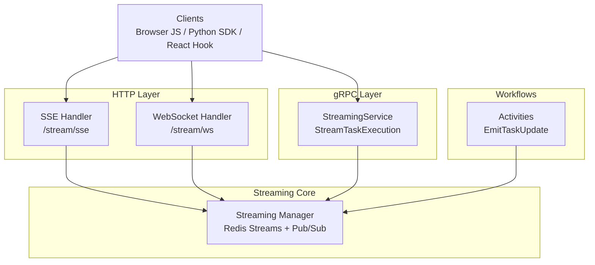
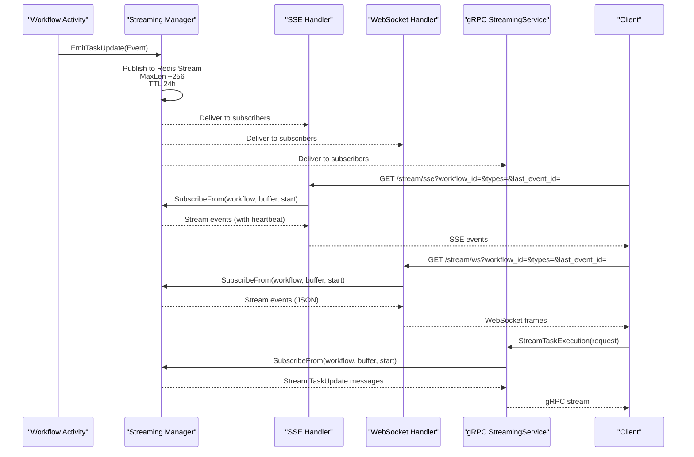
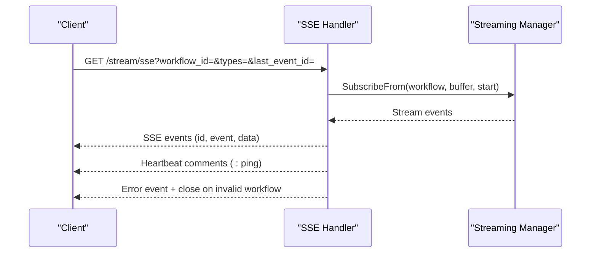
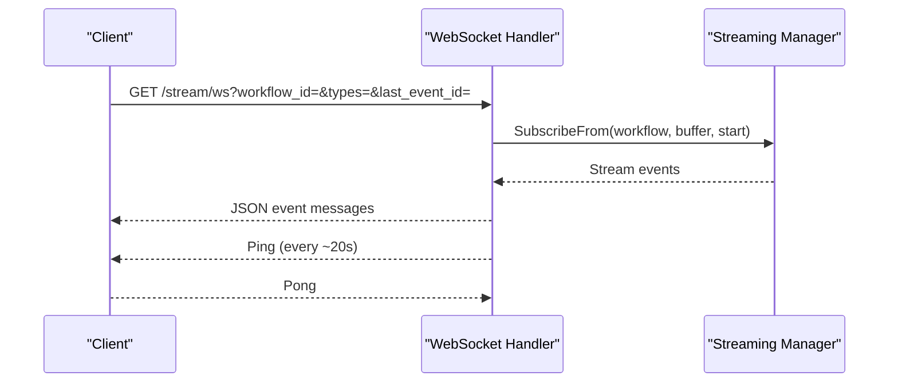
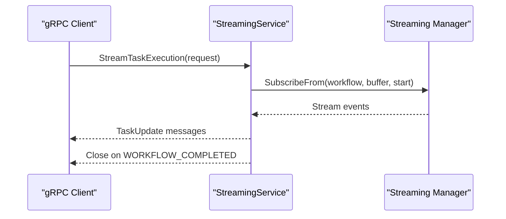
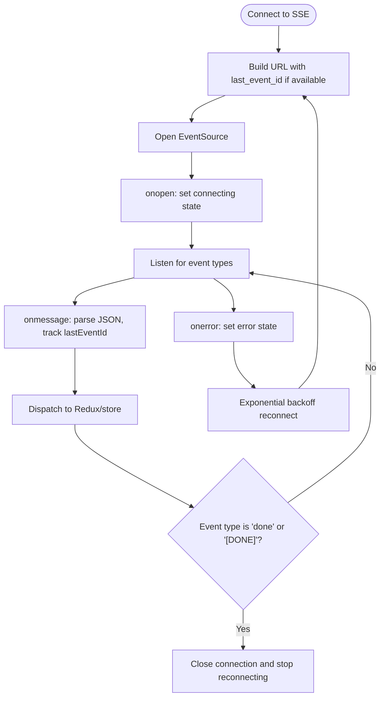
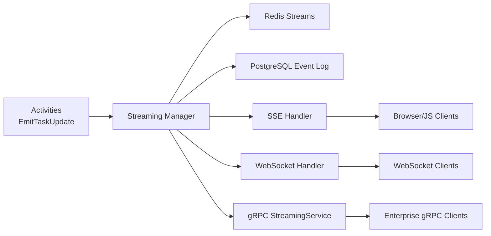

# Streaming API

<cite>
**Referenced Files in This Document**
- [streaming-api.md](file://docs/streaming-api.md)
- [manager.go](file://go/orchestrator/internal/streaming/manager.go)
- [streaming.go](file://go/orchestrator/internal/httpapi/streaming.go)
- [websocket.go](file://go/orchestrator/internal/httpapi/websocket.go)
- [streaming_service.go](file://go/orchestrator/internal/server/streaming_service.go)
- [stream_events.go](file://go/orchestrator/internal/activities/stream_events.go)
- [stream_messages.go](file://go/orchestrator/internal/activities/stream_messages.go)
- [stream.ts](file://desktop/lib/shannon/stream.ts)
- [simple_streaming.py](file://clients/python/examples/simple_streaming.py)
</cite>

## Table of Contents
1. [Introduction](#introduction)
2. [Project Structure](#project-structure)
3. [Core Components](#core-components)
4. [Architecture Overview](#architecture-overview)
5. [Detailed Component Analysis](#detailed-component-analysis)
6. [Dependency Analysis](#dependency-analysis)
7. [Performance Considerations](#performance-considerations)
8. [Troubleshooting Guide](#troubleshooting-guide)
9. [Conclusion](#conclusion)
10. [Appendices](#appendices)

## Introduction
This document provides comprehensive streaming API documentation for real-time event delivery in the system. It covers:
- Server-Sent Events (SSE) endpoint for task event streams
- WebSocket connections for bidirectional communication
- Event types, message formats, and subscription management
- Streaming manager architecture and Redis Streams integration
- Connection lifecycle, reconnection strategies, and error recovery
- Client implementation examples for JavaScript and Python
- Performance considerations, connection limits, and resource management
- Debugging techniques and monitoring approaches

## Project Structure
The streaming subsystem spans multiple layers:
- HTTP API handlers for SSE and WebSocket
- gRPC service for streaming over enterprise channels
- In-memory streaming manager backed by Redis Streams
- Activities that emit deterministic events into the stream
- Client SDKs and UI hooks for consuming streams



**Diagram sources**
- [streaming.go](file://go/orchestrator/internal/httpapi/streaming.go#L34-L38)
- [websocket.go](file://go/orchestrator/internal/httpapi/websocket.go#L18-L21)
- [streaming_service.go](file://go/orchestrator/internal/server/streaming_service.go#L34-L33)
- [manager.go](file://go/orchestrator/internal/streaming/manager.go#L47-L60)
- [stream_events.go](file://go/orchestrator/internal/activities/stream_events.go#L72-L91)

**Section sources**
- [streaming-api.md](file://docs/streaming-api.md#L299-L319)

## Core Components
- Streaming Manager: Manages Redis Streams, per-workflow ring buffers, subscription lifecycle, and event persistence.
- HTTP Handlers: SSE and WebSocket endpoints expose event streams with resume semantics.
- gRPC Service: Provides a strongly-typed streaming interface for enterprise clients.
- Activities: Emit deterministic events into the stream manager, ensuring replay safety and determinism.

Key responsibilities:
- Event publishing to Redis Streams with bounded length and TTL
- Subscription management with backpressure and graceful shutdown
- Replay from Redis stream IDs or numeric sequences
- Type filtering and heartbeat management
- PostgreSQL persistence for important events only

**Section sources**
- [manager.go](file://go/orchestrator/internal/streaming/manager.go#L19-L60)
- [streaming.go](file://go/orchestrator/internal/httpapi/streaming.go#L18-L38)
- [websocket.go](file://go/orchestrator/internal/httpapi/websocket.go#L12-L21)
- [streaming_service.go](file://go/orchestrator/internal/server/streaming_service.go#L17-L33)
- [stream_events.go](file://go/orchestrator/internal/activities/stream_events.go#L72-L91)

## Architecture Overview
The streaming pipeline integrates workflows, the streaming manager, and transport protocols:



**Diagram sources**
- [stream_events.go](file://go/orchestrator/internal/activities/stream_events.go#L72-L91)
- [manager.go](file://go/orchestrator/internal/streaming/manager.go#L364-L492)
- [streaming.go](file://go/orchestrator/internal/httpapi/streaming.go#L40-L366)
- [websocket.go](file://go/orchestrator/internal/httpapi/websocket.go#L23-L154)
- [streaming_service.go](file://go/orchestrator/internal/server/streaming_service.go#L34-L162)

## Detailed Component Analysis

### Streaming Manager
The streaming manager is the central component for Redis Streams-based pub/sub with per-workflow ring buffers and replay support.

```mermaid
classDiagram
class Manager {
-redis : redis.Client
-dbClient : db.Client
-persistCh : chan EventLog
-batchSize : int
-flushEvery : time.Duration
-subscribers : map[string]map[chan Event]*subscription
-capacity : int
-logger : Logger
-shutdownCh : chan struct{}
-wg : WaitGroup
-persistWg : WaitGroup
+Subscribe(workflowID, buffer) chan Event
+SubscribeFrom(workflowID, buffer, startID) chan Event
+Unsubscribe(workflowID, ch) void
+Publish(workflowID, event) void
+ReplaySince(workflowID, since) []Event
+ReplayFromStreamID(workflowID, streamID) []Event
+GetLastStreamID(workflowID) string
+HasEmittedCompletion(ctx, workflowID) bool
+Shutdown(ctx) error
}
class Event {
+string WorkflowID
+string Type
+string AgentID
+string Message
+map~string,any~ Payload
+time Timestamp
+uint64 Seq
+string StreamID
}
Manager --> Event : "publishes"
```

Key behaviors:
- Publish to Redis Streams with MaxLen and TTL
- Replay from Redis stream ID or numeric sequence
- Backpressure-aware delivery with critical event escalation
- Asynchronous event log persistence for important events
- Graceful shutdown with goroutine lifecycle management

Operational notes:
- Capacity defaults to ~256 per workflow; configurable via environment or programmatic configuration
- Heartbeats keep connections alive through intermediaries
- Redis stream IDs are preferred for resume semantics

**Diagram sources**
- [manager.go](file://go/orchestrator/internal/streaming/manager.go#L47-L60)
- [manager.go](file://go/orchestrator/internal/streaming/manager.go#L19-L29)

**Section sources**
- [manager.go](file://go/orchestrator/internal/streaming/manager.go#L364-L492)
- [manager.go](file://go/orchestrator/internal/streaming/manager.go#L698-L807)
- [manager.go](file://go/orchestrator/internal/streaming/manager.go#L809-L862)
- [manager.go](file://go/orchestrator/internal/streaming/manager.go#L864-L921)

### SSE Endpoint (/stream/sse)
The SSE endpoint streams events to browsers and clients supporting Server-Sent Events.

Endpoint:
- Method: GET
- Path: /stream/sse
- Query parameters:
  - workflow_id (required)
  - types (optional, CSV)
  - last_event_id (optional; Redis stream ID or numeric sequence)

Behavior:
- Sets SSE headers and flushes initial comment
- Supports resume via Last-Event-ID header or last_event_id query param
- Maps event types to SSE event names (e.g., thread.message.delta, thread.message.completed)
- Sends heartbeats as comments every ~10s
- Emits an explicit end marker for STREAM_END
- Validates workflow existence with a first-event timeout and Temporal client



**Diagram sources**
- [streaming.go](file://go/orchestrator/internal/httpapi/streaming.go#L40-L366)

**Section sources**
- [streaming.go](file://go/orchestrator/internal/httpapi/streaming.go#L40-L366)

### WebSocket Endpoint (/stream/ws)
The WebSocket endpoint provides bidirectional communication with JSON messages.

Endpoint:
- Method: GET
- Path: /stream/ws
- Query parameters:
  - workflow_id (required)
  - types (optional, CSV)
  - last_event_id (optional; Redis stream ID or numeric sequence)

Behavior:
- Upgrades to WebSocket with permissive origin in development
- Supports resume via last_event_id
- Sends heartbeats as Ping frames every ~20s; expects Pong responses
- Forwards events as JSON messages
- Ignores client messages (reader pump discards)



**Diagram sources**
- [websocket.go](file://go/orchestrator/internal/httpapi/websocket.go#L23-L154)

**Section sources**
- [websocket.go](file://go/orchestrator/internal/httpapi/websocket.go#L23-L154)

### gRPC StreamingService
The gRPC service exposes a strongly-typed streaming interface for enterprise clients.

RPC:
- Method: StreamTaskExecution(stream StreamRequest) returns (stream TaskUpdate)
- Request fields:
  - workflow_id (required)
  - types[] (optional)
  - last_event_id (optional; numeric sequence)
  - last_stream_id (optional; Redis stream ID)

Behavior:
- Replay from Redis stream ID or numeric sequence
- Applies type filtering
- Validates workflow existence using Temporal DescribeWorkflowExecution
- Closes stream upon receiving WORKFLOW_COMPLETED



**Diagram sources**
- [streaming_service.go](file://go/orchestrator/internal/server/streaming_service.go#L34-L162)

**Section sources**
- [streaming_service.go](file://go/orchestrator/internal/server/streaming_service.go#L34-L162)

### Event Types and Message Formats
Event model:
- Fields: workflow_id, type, agent_id?, message?, timestamp, seq, stream_id?
- Deterministic events emitted by workflows and activities

Common event categories:
- Workflow lifecycle: WORKFLOW_STARTED, WORKFLOW_COMPLETED, WORKFLOW_FAILED
- Agent lifecycle: AGENT_STARTED, AGENT_COMPLETED, AGENT_FAILED
- LLM events: LLM_PROMPT, LLM_PARTIAL, LLM_OUTPUT
- Tool events: TOOL_INVOKED, TOOL_OBSERVATION, TOOL_ERROR
- UX and coordination: AGENT_THINKING, PROGRESS, ROLE_ASSIGNED, DELEGATION, TEAM_RECRUITED, TEAM_RETIRED, BUDGET_THRESHOLD
- Control signals: WORKFLOW_PAUSING, WORKFLOW_PAUSED, WORKFLOW_RESUMED, WORKFLOW_CANCELLING, WORKFLOW_CANCELLED
- Stream lifecycle: STREAM_END

SSE mapping examples:
- LLM_PARTIAL → thread.message.delta with delta field
- LLM_OUTPUT → thread.message.completed with response and optional metadata
- STREAM_END → done with [DONE]

Persistence strategy:
- Redis: All events, bounded retention, 24h TTL
- PostgreSQL: Important events only (e.g., WORKFLOW_COMPLETED, AGENT_COMPLETED, TOOL_OBSERVATION, LLM_OUTPUT)

**Section sources**
- [streaming-api.md](file://docs/streaming-api.md#L31-L84)
- [streaming-api.md](file://docs/streaming-api.md#L158-L205)
- [stream_events.go](file://go/orchestrator/internal/activities/stream_events.go#L11-L59)

### Subscription Management and Replay Semantics
- Resume points:
  - Redis stream ID (preferred): last_event_id as "1700000000000-0"
  - Numeric sequence: last_event_id as integer
- Replay:
  - ReplayFromStreamID for precise resume
  - ReplaySince for sequence-based resume
- Subscription lifecycle:
  - Subscribe/SubscribeFrom create channels and background readers
  - Unsubscribe cancels reader goroutines and closes channels
  - Backpressure: non-blocking delivery with warnings for slow subscribers
- Heartbeats:
  - SSE: comments every ~10s
  - WS: Ping frames every ~20s with Pong handling

**Section sources**
- [streaming.go](file://go/orchestrator/internal/httpapi/streaming.go#L59-L83)
- [websocket.go](file://go/orchestrator/internal/httpapi/websocket.go#L46-L62)
- [manager.go](file://go/orchestrator/internal/streaming/manager.go#L152-L178)
- [manager.go](file://go/orchestrator/internal/streaming/manager.go#L180-L321)

### Client Implementation Examples

#### JavaScript (Browser/SSE)
The React hook demonstrates robust SSE consumption with automatic reconnection and resume support.

Key features:
- Tracks last event ID from SSE id field or seq/stream_id
- Reconnects with exponential backoff
- Handles special end markers and error events
- Listens to multiple SSE event types



**Diagram sources**
- [stream.ts](file://desktop/lib/shannon/stream.ts#L30-L182)

**Section sources**
- [stream.ts](file://desktop/lib/shannon/stream.ts#L12-L196)

#### Python (SDK)
The Python example shows streaming task events and handling completion.

Highlights:
- Submits a task and obtains workflow_id
- Iterates over client.stream() with type filters
- Stops on WORKFLOW_COMPLETED

**Section sources**
- [simple_streaming.py](file://clients/python/examples/simple_streaming.py#L22-L36)

## Dependency Analysis
The streaming stack exhibits clear separation of concerns with well-defined dependencies:



**Diagram sources**
- [stream_events.go](file://go/orchestrator/internal/activities/stream_events.go#L72-L91)
- [manager.go](file://go/orchestrator/internal/streaming/manager.go#L364-L492)
- [streaming.go](file://go/orchestrator/internal/httpapi/streaming.go#L34-L38)
- [websocket.go](file://go/orchestrator/internal/httpapi/websocket.go#L18-L21)
- [streaming_service.go](file://go/orchestrator/internal/server/streaming_service.go#L25-L32)

**Section sources**
- [streaming-api.md](file://docs/streaming-api.md#L299-L319)

## Performance Considerations
- Redis Streams capacity: bounded to ~256 events per workflow by default; configurable via environment or programmatic configuration
- Backpressure: non-blocking delivery with warnings for critical events; clients should reconnect with resume points
- Persistence batching: asynchronous PostgreSQL writes with configurable batch size and interval
- UTF-8 and payload sanitization: prevents malformed data and large base64 images from bloating storage
- Heartbeats: keep connections alive through proxies and load balancers
- Fan-out: for high fan-out scenarios, place an external gateway in front; the in-process manager is not a message broker

**Section sources**
- [streaming-api.md](file://docs/streaming-api.md#L280-L298)
- [manager.go](file://go/orchestrator/internal/streaming/manager.go#L95-L127)
- [manager.go](file://go/orchestrator/internal/streaming/manager.go#L538-L659)

## Troubleshooting Guide
Common issues and resolutions:
- No events received:
  - Verify workflow_id exists and is running
  - Ensure streaming_v1 is enabled in the workflow
  - Confirm admin HTTP port accessibility
  - Check that requested event types are actually emitted
- Events missing after reconnect:
  - Use last_event_id parameter or Last-Event-ID header
  - Replay reads from bounded Redis Stream; very old events may be pruned
- Python async runtime errors:
  - Do not await other client calls inside async-for loops over the stream
- High memory usage:
  - Reduce ring buffer capacity in config
  - Implement client-side filtering to reduce event volume
  - Use connection pooling for multiple concurrent streams

Debug commands:
- Health check and basic SSE test
- gRPC service discovery
- Container logs for streaming subsystem

**Section sources**
- [streaming-api.md](file://docs/streaming-api.md#L402-L445)

## Conclusion
The streaming API provides a robust, deterministic, and efficient real-time event delivery system across SSE, WebSocket, and gRPC transports. The Redis Streams-backed architecture ensures bounded memory usage, reliable replay, and strong persistence for important events. With built-in validation, heartbeats, and comprehensive client examples, it supports both simple dashboards and interactive applications requiring bidirectional control.

## Appendices

### Event Persistence Strategy
- Redis (All Events): Last 256 events per workflow, 24h TTL
- PostgreSQL (Important Events Only): Critical events persisted (e.g., completion/failure, tool observations, LLM outputs)

**Section sources**
- [streaming-api.md](file://docs/streaming-api.md#L5-L27)

### Capacity and Replay Behavior
- Live streaming uses Redis Streams with bounded length (~256 per workflow)
- Configurable via STREAMING_RING_CAPACITY or programmatic streaming.Configure(n)

**Section sources**
- [streaming-api.md](file://docs/streaming-api.md#L280-L286)

### Provider Compatibility and Usage Metadata
- Providers: OpenAI, Anthropic, Groq, Google, xAI, OpenAI-compatible
- Usage metadata streaming support varies; documented limitations and fallback behavior

**Section sources**
- [streaming-api.md](file://docs/streaming-api.md#L447-L481)