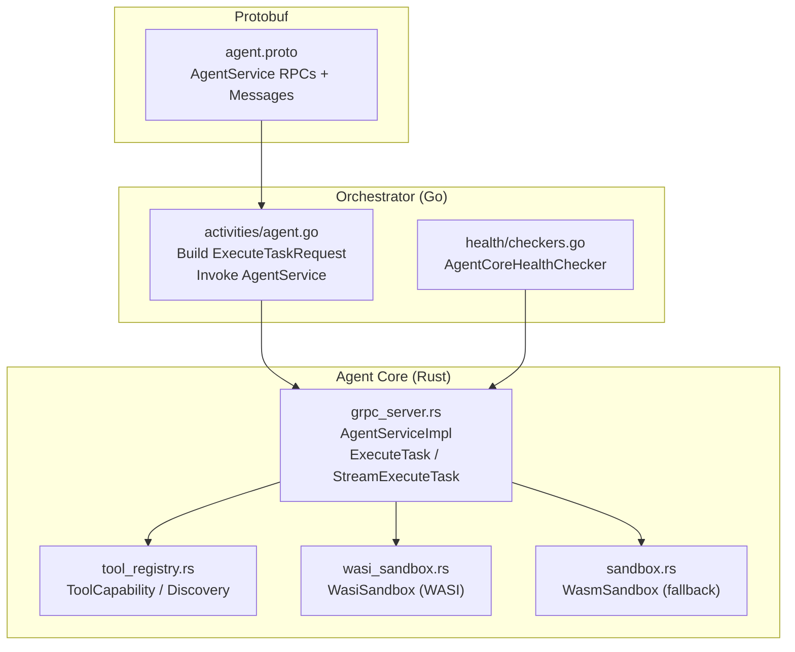
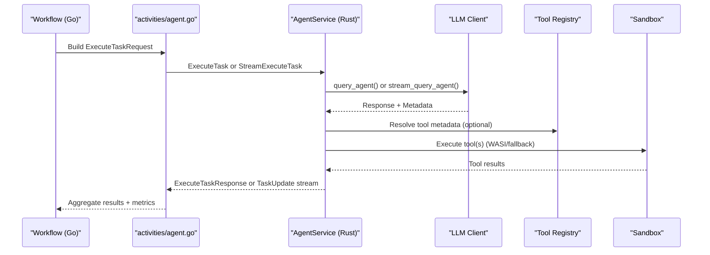
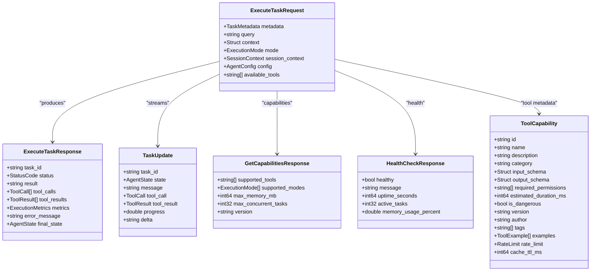
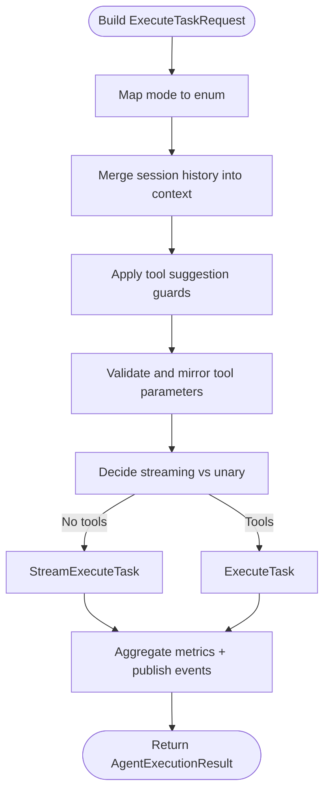
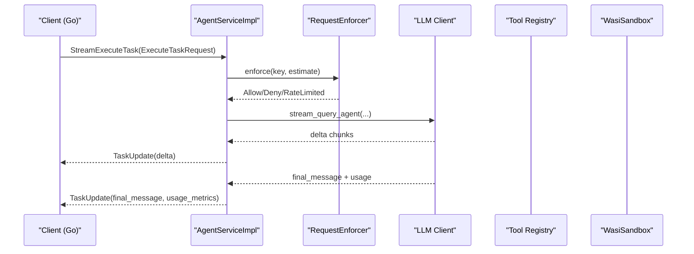
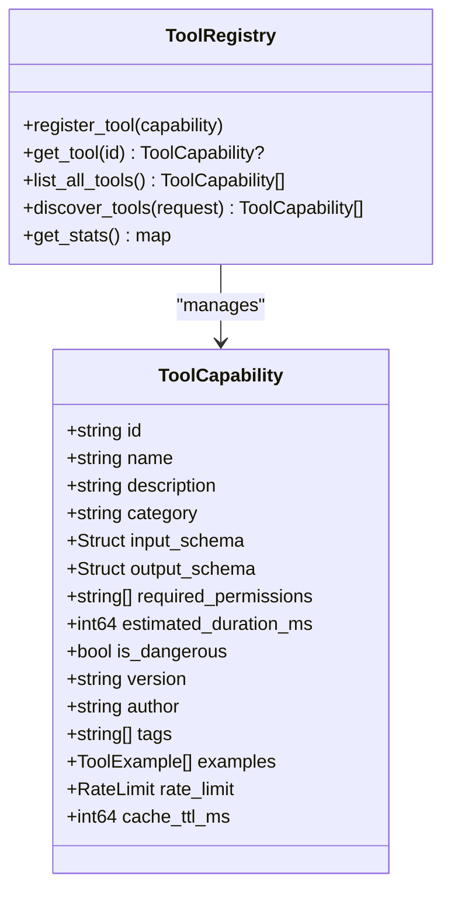
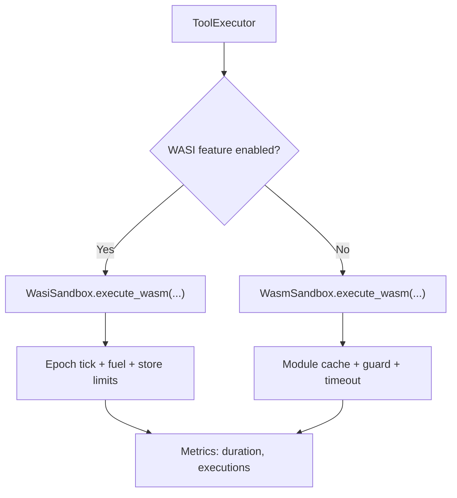
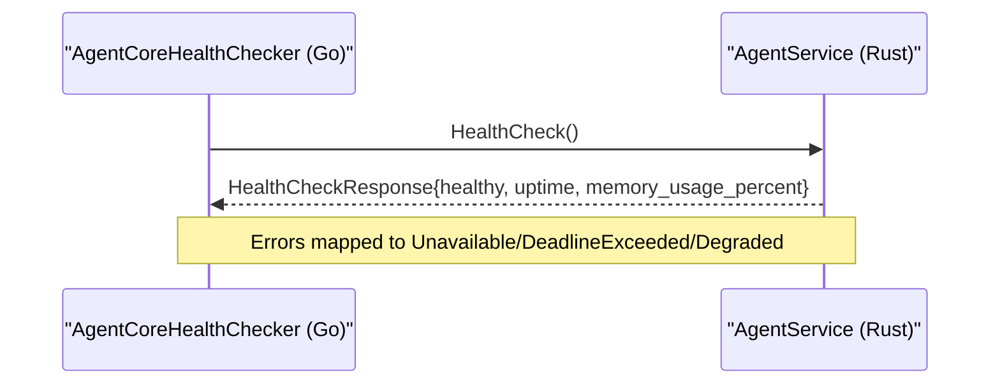
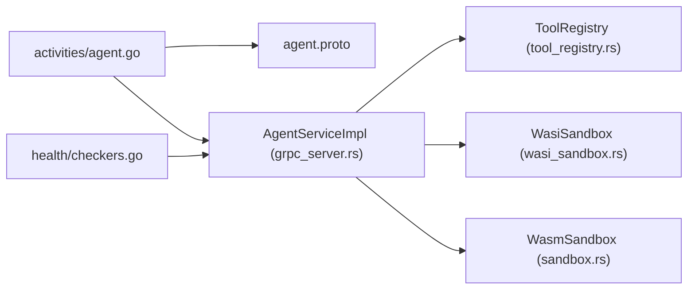

# Agent Service

<cite>
**Referenced Files in This Document**
- [agent.proto](file://protos/agent/agent.proto)
- [agent.go](file://go/orchestrator/internal/activities/agent.go)
- [checkers.go](file://go/orchestrator/internal/health/checkers.go)
- [lib.rs](file://rust/agent-core/src/lib.rs)
- [grpc_server.rs](file://rust/agent-core/src/grpc_server.rs)
- [tool_registry.rs](file://rust/agent-core/src/tool_registry.rs)
- [sandbox.rs](file://rust/agent-core/src/sandbox.rs)
- [wasi_sandbox.rs](file://rust/agent-core/src/wasi_sandbox.rs)
</cite>

## Table of Contents
1. [Introduction](#introduction)
2. [Project Structure](#project-structure)
3. [Core Components](#core-components)
4. [Architecture Overview](#architecture-overview)
5. [Detailed Component Analysis](#detailed-component-analysis)
6. [Dependency Analysis](#dependency-analysis)
7. [Performance Considerations](#performance-considerations)
8. [Troubleshooting Guide](#troubleshooting-guide)
9. [Conclusion](#conclusion)

## Introduction
This document describes the AgentService gRPC interface and its implementation across the orchestrator and agent core. It focuses on agent lifecycle management, task execution coordination, state synchronization, registration and health monitoring, capability negotiation, tool access permissions, performance metrics collection, agent clustering and load balancing, failure recovery, and security boundaries with sandbox enforcement and resource isolation.

## Project Structure
AgentService spans two primary layers:
- Protocol definitions and messages live in Protobuf under protos/agent.
- Orchestrator-side Go code coordinates tasks and invokes the Agent Core via gRPC.
- Agent Core (Rust) implements the AgentService, enforces policies, executes tools, streams updates, and manages sandboxing.

**Diagram sources**
- [agent.proto](file://protos/agent/agent.proto#L10-L17)
- [agent.go](file://go/orchestrator/internal/activities/agent.go#L831-L851)
- [checkers.go](file://go/orchestrator/internal/health/checkers.go#L171-L241)
- [grpc_server.rs](file://rust/agent-core/src/grpc_server.rs#L37-L83)
- [tool_registry.rs](file://rust/agent-core/src/tool_registry.rs#L55-L70)
- [wasi_sandbox.rs](file://rust/agent-core/src/wasi_sandbox.rs#L15-L30)
- [sandbox.rs](file://rust/agent-core/src/sandbox.rs#L102-L118)

**Section sources**
- [agent.proto](file://protos/agent/agent.proto#L1-L156)
- [agent.go](file://go/orchestrator/internal/activities/agent.go#L1-L120)
- [checkers.go](file://go/orchestrator/internal/health/checkers.go#L1-L60)
- [grpc_server.rs](file://rust/agent-core/src/grpc_server.rs#L1-L60)
- [tool_registry.rs](file://rust/agent-core/src/tool_registry.rs#L1-L40)
- [wasi_sandbox.rs](file://rust/agent-core/src/wasi_sandbox.rs#L1-L30)
- [sandbox.rs](file://rust/agent-core/src/sandbox.rs#L1-L30)

## Core Components
- AgentService RPCs:
  - ExecuteTask: Synchronous execution returning a full result with metrics and tool results.
  - StreamExecuteTask: Streaming TaskUpdate messages for incremental progress and tool execution events.
  - GetCapabilities: Reports supported tools, modes, memory limits, concurrency, and version.
  - HealthCheck: Reports health, uptime, active tasks placeholder, and memory usage percent.
  - DiscoverTools / GetToolCapability: Capability discovery and retrieval for tools.
- Orchestrator coordination:
  - Builds ExecuteTaskRequest from workflow context, merges session history, applies policy checks, selects tools, and routes to AgentService.
  - Chooses streaming vs unary based on tool usage and environment flags.
- Agent Core implementation:
  - Implements AgentService, enforces request policy, executes tools (direct or sequences), streams TaskUpdate chunks, and collects metrics.
  - Manages tool capabilities, discovery, and sandboxing (WASI and fallback).

**Section sources**
- [agent.proto](file://protos/agent/agent.proto#L10-L17)
- [agent.go](file://go/orchestrator/internal/activities/agent.go#L1214-L1236)
- [grpc_server.rs](file://rust/agent-core/src/grpc_server.rs#L790-L1147)
- [tool_registry.rs](file://rust/agent-core/src/tool_registry.rs#L55-L70)

## Architecture Overview
AgentService sits between the orchestrator and the agent core. The orchestrator composes requests, applies policy, and invokes either unary ExecuteTask or streaming StreamExecuteTask. The agent core enforces policies, executes tools, and streams progress updates.

**Diagram sources**
- [agent.go](file://go/orchestrator/internal/activities/agent.go#L1319-L1537)
- [grpc_server.rs](file://rust/agent-core/src/grpc_server.rs#L1149-L1354)

## Detailed Component Analysis

### AgentService RPCs and Message Types
- ExecuteTaskRequest: Includes TaskMetadata, query, context, execution mode, available tools, agent config, and session context.
- ExecuteTaskResponse: Contains task_id, status, result text, tool_calls, tool_results, ExecutionMetrics, error_message, and final_state.
- TaskUpdate (streaming): Emits state transitions, tool_call/tool_result events, progress, and token deltas.
- Capabilities and health: GetCapabilitiesResponse, HealthCheckResponse, DiscoverToolsResponse, GetToolCapabilityResponse.
- ToolCapability: Describes tool identity, schema, permissions, rate limits, caching, and examples.

**Diagram sources**
- [agent.proto](file://protos/agent/agent.proto#L29-L74)
- [agent.proto](file://protos/agent/agent.proto#L76-L84)
- [agent.proto](file://protos/agent/agent.proto#L86-L104)
- [agent.proto](file://protos/agent/agent.proto#L106-L143)

**Section sources**
- [agent.proto](file://protos/agent/agent.proto#L19-L156)

### Orchestrator Task Execution Coordination
- Dialing and circuit-breaking: Establishes gRPC connection to agent-core with circuit breaker wrappers and interceptors.
- Mode mapping: Converts string mode to ExecutionMode enum.
- Session context: Merges session history into context for continuity.
- Tool selection guards: Adds web_search when web_fetch is suggested and vice versa; respects research-mode heuristics.
- Tool parameters: Validates and mirrors tool parameters into context; mirrors safe fields into prompt_params for vendor adapters.
- Streaming vs unary: Uses streaming only when no tools are required; otherwise falls back to unary ExecuteTask.
- Metrics aggregation: Computes tokens, cost, duration, and tool usage; publishes streaming events.

**Diagram sources**
- [agent.go](file://go/orchestrator/internal/activities/agent.go#L831-L851)
- [agent.go](file://go/orchestrator/internal/activities/agent.go#L856-L865)
- [agent.go](file://go/orchestrator/internal/activities/agent.go#L867-L875)
- [agent.go](file://go/orchestrator/internal/activities/agent.go#L894-L931)
- [agent.go](file://go/orchestrator/internal/activities/agent.go#L1040-L1129)
- [agent.go](file://go/orchestrator/internal/activities/agent.go#L1319-L1537)

**Section sources**
- [agent.go](file://go/orchestrator/internal/activities/agent.go#L831-L1537)

### Agent Core Implementation and State Synchronization
- AgentServiceImpl: Implements AgentService, enforces policies, executes tools, and streams TaskUpdate messages.
- Execution modes: Supports Simple, Standard, and Complex; passes suggested tools to LLM when provided.
- Tool execution:
  - Direct tool execution from context.tool_parameters bypasses LLM tool selection.
  - Multi-tool sequences from context.tool_calls; supports bounded parallelism via semaphore.
- Streaming pipeline: Emits Planning, Executing, Completed states; streams token deltas; attaches usage metrics as a special tool result.
- Health and capabilities: Returns supported tools, modes, memory limits, concurrency, and version; reports uptime and memory usage percent.

**Diagram sources**
- [grpc_server.rs](file://rust/agent-core/src/grpc_server.rs#L1149-L1354)
- [grpc_server.rs](file://rust/agent-core/src/grpc_server.rs#L1189-L1325)

**Section sources**
- [grpc_server.rs](file://rust/agent-core/src/grpc_server.rs#L790-L1147)
- [grpc_server.rs](file://rust/agent-core/src/grpc_server.rs#L1149-L1354)

### Capability Negotiation and Tool Access Permissions
- ToolCapability: Defines tool identity, schemas, permissions, rate limits, caching, and examples.
- Tool discovery: ToolRegistry supports filtering by query, categories, tags, and dangerousness; returns ranked results.
- Permission enforcement: AgentServiceImpl validates tool availability against request’s available_tools and context-provided allowlists; denies unauthorized tools.
- Rate limiting: ToolCapability includes rate limits; enforcement occurs via RequestEnforcer.

**Diagram sources**
- [tool_registry.rs](file://rust/agent-core/src/tool_registry.rs#L55-L70)
- [tool_registry.rs](file://rust/agent-core/src/tool_registry.rs#L26-L37)

**Section sources**
- [tool_registry.rs](file://rust/agent-core/src/tool_registry.rs#L55-L312)
- [grpc_server.rs](file://rust/agent-core/src/grpc_server.rs#L834-L896)

### Security Boundaries, Sandbox Enforcement, and Resource Isolation
- WASI sandbox (preferred):
  - WasiSandbox configures engine with epoch interruption, guard sizes, fuel metering, and strict store limits.
  - Enforces read-only pre-opened directories, disables inherited environment by default, and validates allowed paths.
  - Executes modules with stdin/stdout/stderr pipes, tracks durations and counts via metrics.
- Fallback sandbox:
  - WasmSandbox provides module caching, memory guard sizes, CPU fuel limits, and timeout enforcement.
- Resource limits:
  - Per-process RLIMITS on Linux (CPU, memory, file descriptors, threads) for non-WASI tool execution.
  - WASI memory/table/instance limits via StoreLimits.
- Permission validation:
  - Validates allowed paths exist and are directories before enabling access.

**Diagram sources**
- [wasi_sandbox.rs](file://rust/agent-core/src/wasi_sandbox.rs#L37-L72)
- [wasi_sandbox.rs](file://rust/agent-core/src/wasi_sandbox.rs#L124-L433)
- [sandbox.rs](file://rust/agent-core/src/sandbox.rs#L161-L452)

**Section sources**
- [wasi_sandbox.rs](file://rust/agent-core/src/wasi_sandbox.rs#L15-L448)
- [sandbox.rs](file://rust/agent-core/src/sandbox.rs#L16-L452)

### Agent Registration, Heartbeat, and Health Monitoring
- Agent registration: Not exposed via AgentService; orchestrator health checker connects to AgentService HealthCheck RPC to monitor liveness.
- Heartbeat: AgentService HealthCheck returns uptime and memory usage percent; orchestrator health checker surfaces errors categorized by gRPC status codes.
- Circuit breaking: Orchestrator wraps gRPC connections and calls with circuit breaker wrappers; AgentServiceImpl validates sandbox permissions early.

**Diagram sources**
- [checkers.go](file://go/orchestrator/internal/health/checkers.go#L171-L241)
- [grpc_server.rs](file://rust/agent-core/src/grpc_server.rs#L1384-L1402)

**Section sources**
- [checkers.go](file://go/orchestrator/internal/health/checkers.go#L171-L241)
- [grpc_server.rs](file://rust/agent-core/src/grpc_server.rs#L1384-L1402)

### Agent Clustering, Load Balancing, and Failure Recovery
- Clustering: Orchestrator dials agent-core address with circuit breaker; AgentServiceImpl exposes capabilities indicating max memory and concurrency.
- Load balancing: Orchestrator can route tasks to multiple agent-core replicas behind a load balancer; circuit breaker protects from cascading failures.
- Failure recovery: Circuit breaker opens on errors; orchestrator retries with backoff; AgentServiceImpl returns DeadlineExceeded or ResourceExhausted for timeouts and rate limits.

**Section sources**
- [agent.go](file://go/orchestrator/internal/activities/agent.go#L831-L851)
- [grpc_server.rs](file://rust/agent-core/src/grpc_server.rs#L1359-L1382)

### Examples of Agent Communication Patterns and Inter-Agent Coordination
- Direct tool execution: Orchestrator injects tool_parameters into context; AgentServiceImpl executes tool directly without LLM involvement.
- Tool sequence execution: Orchestrator injects tool_calls into context; AgentServiceImpl executes multiple tools in sequence or parallel (bounded), aggregates results, and produces a unified response.
- Streaming execution: When no tools are required, orchestrator prefers streaming; AgentServiceImpl emits TaskUpdate messages incrementally and finalizes with usage metrics.

**Section sources**
- [agent.go](file://go/orchestrator/internal/activities/agent.go#L1040-L1129)
- [grpc_server.rs](file://rust/agent-core/src/grpc_server.rs#L834-L896)
- [grpc_server.rs](file://rust/agent-core/src/grpc_server.rs#L1149-L1354)

## Dependency Analysis
- Orchestrator depends on AgentService proto definitions and Rust-generated bindings.
- AgentServiceImpl depends on:
  - ToolRegistry for capability metadata.
  - WasiSandbox/WasmSandbox for execution isolation.
  - LLM client for natural language queries.
  - RequestEnforcer for policy and rate-limit enforcement.
- Health monitoring depends on AgentService HealthCheck RPC and gRPC status mapping.

**Diagram sources**
- [agent.go](file://go/orchestrator/internal/activities/agent.go#L831-L851)
- [grpc_server.rs](file://rust/agent-core/src/grpc_server.rs#L37-L83)
- [tool_registry.rs](file://rust/agent-core/src/tool_registry.rs#L55-L70)
- [wasi_sandbox.rs](file://rust/agent-core/src/wasi_sandbox.rs#L15-L30)
- [sandbox.rs](file://rust/agent-core/src/sandbox.rs#L102-L118)
- [checkers.go](file://go/orchestrator/internal/health/checkers.go#L171-L241)

**Section sources**
- [agent.go](file://go/orchestrator/internal/activities/agent.go#L831-L851)
- [grpc_server.rs](file://rust/agent-core/src/grpc_server.rs#L37-L83)
- [tool_registry.rs](file://rust/agent-core/src/tool_registry.rs#L55-L70)
- [wasi_sandbox.rs](file://rust/agent-core/src/wasi_sandbox.rs#L15-L30)
- [sandbox.rs](file://rust/agent-core/src/sandbox.rs#L102-L118)
- [checkers.go](file://go/orchestrator/internal/health/checkers.go#L171-L241)

## Performance Considerations
- Streaming vs unary: Prefer streaming when no tools are involved to reduce latency and improve UX.
- Tool parallelism: Multi-tool sequences can run in parallel with bounded concurrency; tune TOOL_PARALLELISM for throughput.
- Circuit breaking: Both orchestrator and agent-core wrap calls with circuit breakers to protect from overload.
- Sandbox overhead: WASI sandbox adds security but may increase latency; ensure appropriate timeouts and memory limits.
- Metrics: Track token usage, cost, latency, and tool execution counts to optimize performance and budgeting.

## Troubleshooting Guide
- Health issues:
  - Use AgentCoreHealthChecker to detect Unavailable/DeadlineExceeded/Degraded states and inspect connection state and latency.
- Policy denials:
  - Review policy evaluation logs; in enforce mode, requests may be blocked; in dry-run mode, execution proceeds despite denial.
- Tool execution failures:
  - Check tool availability against available_tools and context allowlists; verify tool_parameters correctness; inspect tool results and error messages.
- Streaming problems:
  - Validate stream buffer size limits and timeout; ensure orchestrator handles EOF and error frames gracefully.
- Sandbox issues:
  - Confirm allowed paths exist and are directories; verify WASI memory/table limits and execution timeouts; review metrics for timeouts and errors.

**Section sources**
- [checkers.go](file://go/orchestrator/internal/health/checkers.go#L193-L241)
- [grpc_server.rs](file://rust/agent-core/src/grpc_server.rs#L850-L895)
- [grpc_server.rs](file://rust/agent-core/src/grpc_server.rs#L1218-L1343)
- [wasi_sandbox.rs](file://rust/agent-core/src/wasi_sandbox.rs#L435-L447)

## Conclusion
AgentService provides a robust, policy-enforced interface for agent lifecycle management, task execution, and state synchronization. The orchestrator composes requests, applies policy, and coordinates streaming/unary execution, while the agent core enforces security via sandboxing, manages tool capabilities, and streams incremental progress. Together, these components enable scalable, secure, and observable multi-agent workflows.