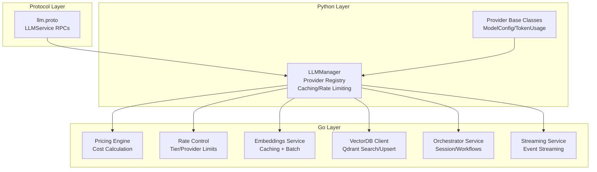
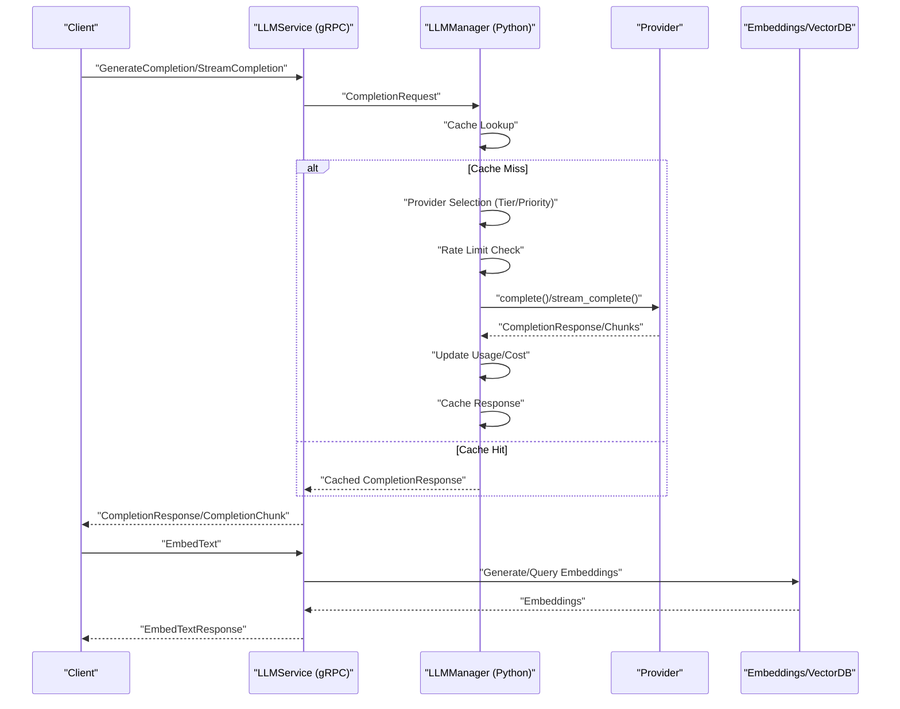
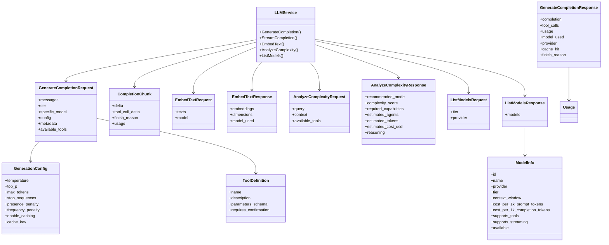
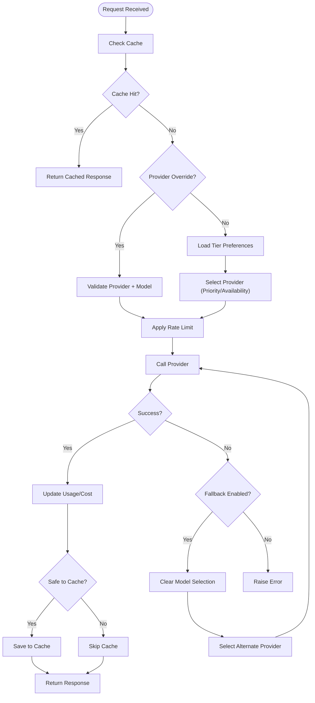
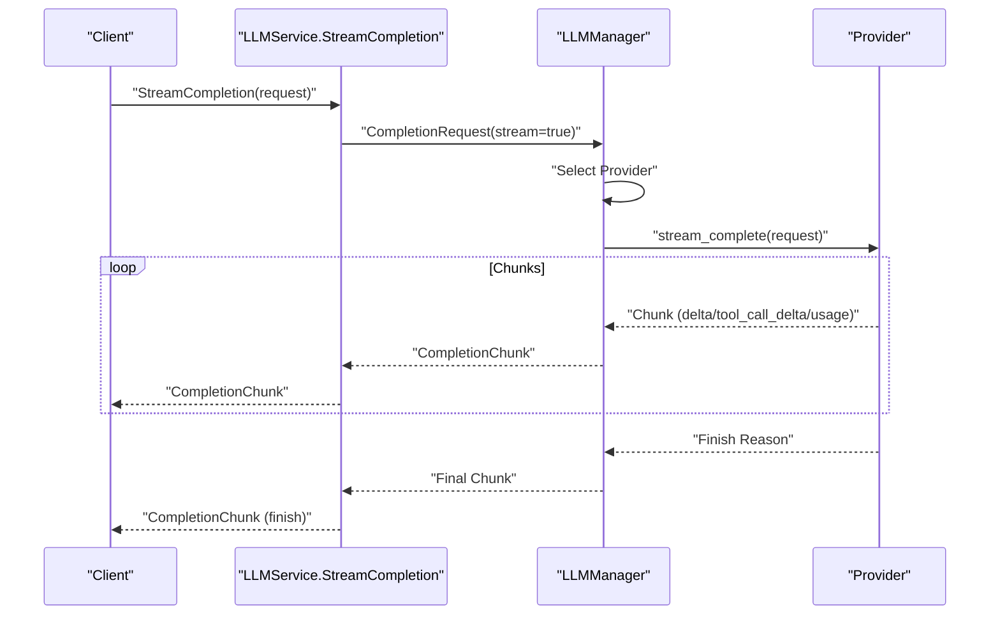
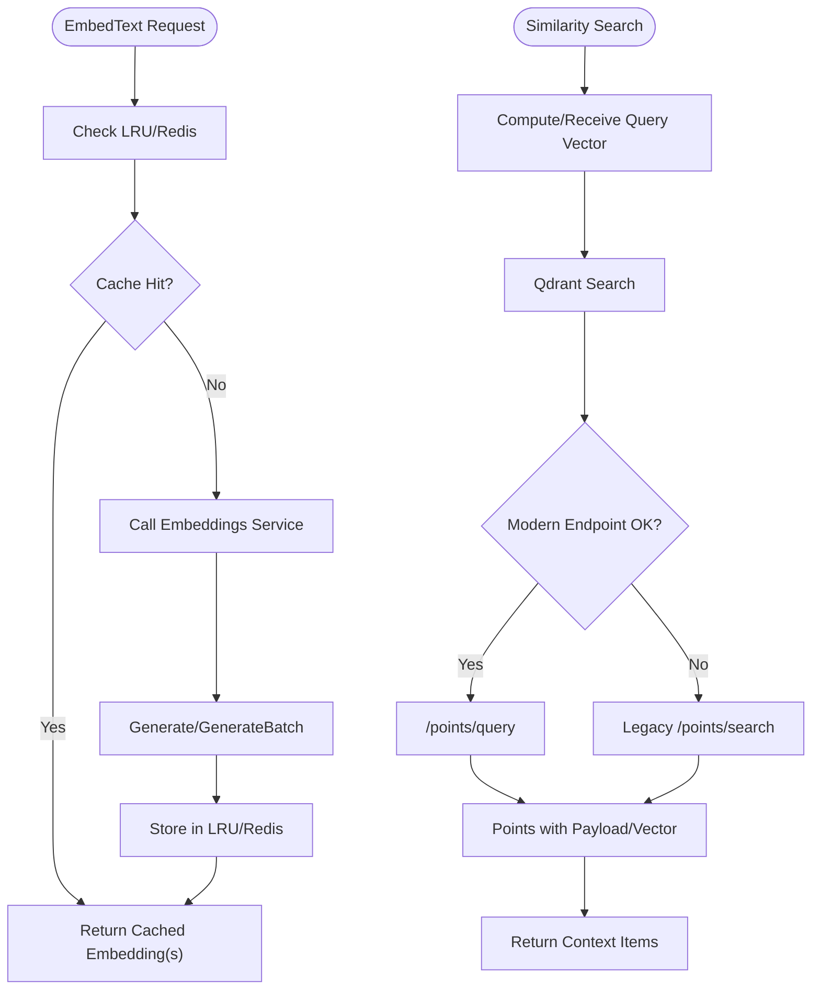
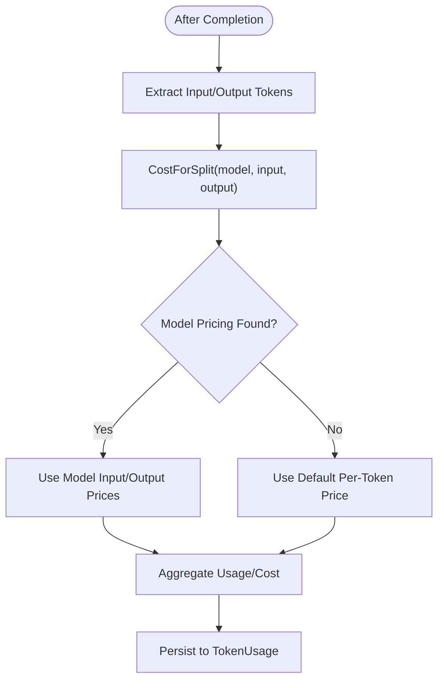
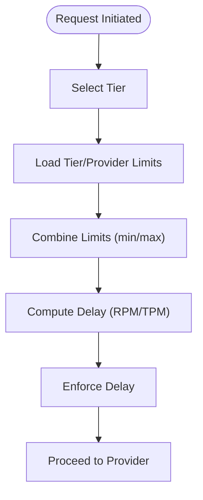
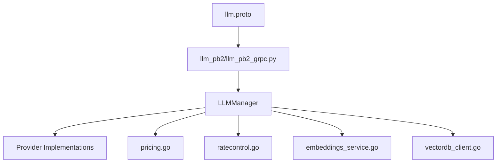

# LLM Service

<cite>
**Referenced Files in This Document**
- [llm.proto](file://protos/llm/llm.proto)
- [llm_pb2_grpc.py](file://python/llm-service/llm_service/grpc_gen/llm/llm_pb2_grpc.py)
- [llm_pb2.py](file://python/llm-service/llm_service/grpc_gen/llm/llm_pb2.py)
- [provider.go](file://go/orchestrator/internal/models/provider.go)
- [types.go](file://go/orchestrator/internal/models/types.go)
- [manager.py](file://python/llm-service/llm_provider/manager.py)
- [base.py](file://python/llm-service/llm_provider/base.py)
- [models.yaml](file://config/models.yaml)
- [pricing.go](file://go/orchestrator/internal/pricing/pricing.go)
- [ratecontrol.go](file://go/orchestrator/internal/ratecontrol/ratecontrol.go)
- [service.go](file://go/orchestrator/internal/server/service.go)
- [streaming_service.go](file://go/orchestrator/internal/server/streaming_service.go)
- [embeddings_service.go](file://go/orchestrator/internal/embeddings/service.go)
- [vectordb_client.go](file://go/orchestrator/internal/vectordb/client.go)
</cite>

## Table of Contents
1. [Introduction](#introduction)
2. [Project Structure](#project-structure)
3. [Core Components](#core-components)
4. [Architecture Overview](#architecture-overview)
5. [Detailed Component Analysis](#detailed-component-analysis)
6. [Dependency Analysis](#dependency-analysis)
7. [Performance Considerations](#performance-considerations)
8. [Troubleshooting Guide](#troubleshooting-guide)
9. [Conclusion](#conclusion)

## Introduction
This document describes the LLMService gRPC interface and its ecosystem, covering language model interactions, completion requests, streaming responses, embeddings, similarity search, provider abstraction, model selection, fallback mechanisms, token usage tracking, cost calculation, and operational controls such as model tier switching, rate limiting, and quota management. It synthesizes the protocol definitions, Python provider manager, Go orchestration internals, and configuration-driven model catalogs to provide a complete picture for both developers and operators.

## Project Structure
The LLMService spans three major layers:
- Protocol Definition: Protobuf schema defines the gRPC contract for completions, streaming, embeddings, complexity analysis, and model listing.
- Python Provider Manager: Implements provider abstraction, model selection, caching, rate limiting, resilience (circuit breakers, hedged requests), and fallback logic.
- Go Orchestration Internals: Provides pricing, rate control, embeddings, vector search, streaming, and session management.

**Diagram sources**
- [llm.proto](file://protos/llm/llm.proto#L9-L15)
- [manager.py](file://python/llm-service/llm_provider/manager.py#L110-L130)
- [base.py](file://python/llm-service/llm_provider/base.py#L154-L181)
- [pricing.go](file://go/orchestrator/internal/pricing/pricing.go#L17-L52)
- [ratecontrol.go](file://go/orchestrator/internal/ratecontrol/ratecontrol.go#L15-L28)
- [embeddings_service.go](file://go/orchestrator/internal/embeddings/service.go#L17-L27)
- [vectordb_client.go](file://go/orchestrator/internal/vectordb/client.go#L19-L27)
- [service.go](file://go/orchestrator/internal/server/service.go#L43-L61)
- [streaming_service.go](file://go/orchestrator/internal/server/streaming_service.go#L17-L24)

**Section sources**
- [llm.proto](file://protos/llm/llm.proto#L1-L49)
- [manager.py](file://python/llm-service/llm_provider/manager.py#L110-L166)
- [base.py](file://python/llm-service/llm_provider/base.py#L154-L181)
- [pricing.go](file://go/orchestrator/internal/pricing/pricing.go#L17-L52)
- [ratecontrol.go](file://go/orchestrator/internal/ratecontrol/ratecontrol.go#L15-L28)
- [embeddings_service.go](file://go/orchestrator/internal/embeddings/service.go#L17-L27)
- [vectordb_client.go](file://go/orchestrator/internal/vectordb/client.go#L19-L27)
- [service.go](file://go/orchestrator/internal/server/service.go#L43-L61)
- [streaming_service.go](file://go/orchestrator/internal/server/streaming_service.go#L17-L24)

## Core Components
- LLMService gRPC interface: Defines unary and streaming completion, embeddings, complexity analysis, and model listing.
- Provider Abstraction: Python LLMProvider base class and registry; provider-specific implementations; unified request/response models.
- Model Catalog and Selection: Configuration-driven model tiers, priorities, and capabilities; provider detection and fallback.
- Pricing and Cost Tracking: Combined and split-token pricing; default fallbacks; cost calculations.
- Rate Control: Tier and provider rate limits; token-aware delays; built-in provider caps.
- Embeddings and Vector Search: Local LRU + Redis cache; batch generation; Qdrant search/upsert; semantic retrieval.
- Streaming: Event streaming for workflow execution; resume/replay semantics.

**Section sources**
- [llm.proto](file://protos/llm/llm.proto#L9-L15)
- [manager.py](file://python/llm-service/llm_provider/manager.py#L110-L166)
- [base.py](file://python/llm-service/llm_provider/base.py#L154-L181)
- [models.yaml](file://config/models.yaml#L16-L122)
- [pricing.go](file://go/orchestrator/internal/pricing/pricing.go#L168-L250)
- [ratecontrol.go](file://go/orchestrator/internal/ratecontrol/ratecontrol.go#L114-L189)
- [embeddings_service.go](file://go/orchestrator/internal/embeddings/service.go#L17-L27)
- [vectordb_client.go](file://go/orchestrator/internal/vectordb/client.go#L19-L27)
- [streaming_service.go](file://go/orchestrator/internal/server/streaming_service.go#L34-L163)

## Architecture Overview
The LLMService integrates a gRPC front-end with a Python provider manager and Go orchestration internals. Requests flow from gRPC to the Python manager for provider selection, caching, and rate limiting, then to providers or vector services as needed.

**Diagram sources**
- [llm.proto](file://protos/llm/llm.proto#L9-L15)
- [manager.py](file://python/llm-service/llm_provider/manager.py#L538-L687)
- [base.py](file://python/llm-service/llm_provider/base.py#L154-L181)
- [embeddings_service.go](file://go/orchestrator/internal/embeddings/service.go#L81-L157)
- [vectordb_client.go](file://go/orchestrator/internal/vectordb/client.go#L96-L169)

## Detailed Component Analysis

### LLMService gRPC Interface
- RPCs:
  - GenerateCompletion: Unary completion with tool calls and token usage.
  - StreamCompletion: Streaming completion chunks with incremental usage.
  - EmbedText: Vector embeddings for texts.
  - AnalyzeComplexity: Complexity analysis with recommended mode and cost estimates.
  - ListModels: Enumerates available models with capabilities and pricing metadata.
- Message Types:
  - Message: Role/content/tool calls.
  - GenerationConfig: Temperature, top-p, max tokens, stop sequences, penalties, caching flags.
  - ToolDefinition: Tool schema and confirmation requirement.
  - GenerateCompletionResponse: Content, tool calls, usage, model/provider, cache hit, finish reason.
  - CompletionChunk: Delta content/tool deltas, finish reason, usage.
  - EmbedTextRequest/Response: Texts, model, embeddings, dimensions, model used.
  - AnalyzeComplexityRequest/Response: Query/context/tools, recommended mode, score, agents, tokens, cost, reasoning.
  - ListModelsRequest/Response: ModelInfo with provider, tier, context window, pricing flags, availability.

**Diagram sources**
- [llm.proto](file://protos/llm/llm.proto#L19-L47)

**Section sources**
- [llm.proto](file://protos/llm/llm.proto#L9-L47)
- [llm_pb2_grpc.py](file://python/llm-service/llm_service/grpc_gen/llm/llm_pb2_grpc.py#L28-L130)
- [llm_pb2.py](file://python/llm-service/llm_service/grpc_gen/llm/llm_pb2.py#L29-L69)

### Provider Abstraction and Model Selection
- Provider Registry: Manages multiple providers (OpenAI, Anthropic, Google, Groq, Qwen, Ollama, VLLM, etc.) with registration and tier routing.
- Model Catalog: Centralized YAML defines model tiers, priorities, capabilities, and pricing.
- Provider Detection: Heuristics to infer provider from model names; catalog-based fallback.
- Selection Strategy: Priority-based selection per tier; fallback to alternate providers; hedged requests for resiliency.
- Fallback Mechanisms: On failure, attempt alternate providers; clear model selection to allow fallback provider to choose compatible model.

**Diagram sources**
- [manager.py](file://python/llm-service/llm_provider/manager.py#L538-L687)
- [manager.py](file://python/llm-service/llm_provider/manager.py#L747-L800)
- [models.yaml](file://config/models.yaml#L16-L122)

**Section sources**
- [manager.py](file://python/llm-service/llm_provider/manager.py#L110-L166)
- [manager.py](file://python/llm-service/llm_provider/manager.py#L538-L687)
- [manager.py](file://python/llm-service/llm_provider/manager.py#L747-L800)
- [base.py](file://python/llm-service/llm_provider/base.py#L154-L181)
- [models.yaml](file://config/models.yaml#L16-L122)

### Streaming Completion Responses
- StreamCompletion returns CompletionChunk messages incrementally.
- Python manager supports streaming with rate limiting and fallback streaming.
- Go streaming service provides event streaming with resume/replay semantics.

**Diagram sources**
- [llm.proto](file://protos/llm/llm.proto#L11-L36)
- [manager.py](file://python/llm-service/llm_provider/manager.py#L688-L746)
- [streaming_service.go](file://go/orchestrator/internal/server/streaming_service.go#L34-L163)

**Section sources**
- [llm.proto](file://protos/llm/llm.proto#L11-L36)
- [manager.py](file://python/llm-service/llm_provider/manager.py#L688-L746)
- [streaming_service.go](file://go/orchestrator/internal/server/streaming_service.go#L34-L163)

### Embedding Operations and Similarity Search
- Embeddings Service: Generates vectors with LRU + Redis caching, batch optimization, and tracing.
- VectorDB Client: Qdrant search/upsert with fallback between query/search endpoints, filters, and MMR support.
- Semantic Retrieval: Session-based semantic search by embedding; optional tenant scoping.

**Diagram sources**
- [embeddings_service.go](file://go/orchestrator/internal/embeddings/service.go#L81-L157)
- [embeddings_service.go](file://go/orchestrator/internal/embeddings/service.go#L159-L273)
- [vectordb_client.go](file://go/orchestrator/internal/vectordb/client.go#L96-L169)
- [vectordb_client.go](file://go/orchestrator/internal/vectordb/client.go#L171-L230)
- [vectordb_client.go](file://go/orchestrator/internal/vectordb/client.go#L232-L304)
- [vectordb_client.go](file://go/orchestrator/internal/vectordb/client.go#L306-L377)

**Section sources**
- [embeddings_service.go](file://go/orchestrator/internal/embeddings/service.go#L17-L27)
- [embeddings_service.go](file://go/orchestrator/internal/embeddings/service.go#L81-L157)
- [embeddings_service.go](file://go/orchestrator/internal/embeddings/service.go#L159-L273)
- [vectordb_client.go](file://go/orchestrator/internal/vectordb/client.go#L96-L169)
- [vectordb_client.go](file://go/orchestrator/internal/vectordb/client.go#L171-L230)
- [vectordb_client.go](file://go/orchestrator/internal/vectordb/client.go#L232-L304)
- [vectordb_client.go](file://go/orchestrator/internal/vectordb/client.go#L306-L377)

### Token Usage Tracking and Cost Calculation
- TokenUsage: Tracks prompt/completion/total tokens and cost.
- Cost Calculation: Combined or split-token pricing; fallback defaults when model not found.
- Pricing Engine: Loads pricing from models.yaml; supports reload; validates entries.

**Diagram sources**
- [types.go](file://go/orchestrator/internal/models/types.go#L91-L100)
- [pricing.go](file://go/orchestrator/internal/pricing/pricing.go#L198-L250)
- [pricing.go](file://go/orchestrator/internal/pricing/pricing.go#L168-L176)

**Section sources**
- [types.go](file://go/orchestrator/internal/models/types.go#L91-L100)
- [pricing.go](file://go/orchestrator/internal/pricing/pricing.go#L198-L250)
- [pricing.go](file://go/orchestrator/internal/pricing/pricing.go#L168-L176)

### Model Tier Switching, Rate Limiting, and Quota Management
- Tier Selection: Priority-based provider/model selection per tier; fallback enabled.
- Rate Control: Combined tier/provider limits; token-aware delays; built-in provider caps.
- Quotas: Centralized configuration for RPM/TPM per tier/provider; reload support.

**Diagram sources**
- [ratecontrol.go](file://go/orchestrator/internal/ratecontrol/ratecontrol.go#L114-L189)
- [models.yaml](file://config/models.yaml#L749-L763)

**Section sources**
- [ratecontrol.go](file://go/orchestrator/internal/ratecontrol/ratecontrol.go#L114-L189)
- [models.yaml](file://config/models.yaml#L749-L763)

### Multi-Provider Configurations and Dynamic Model Selection
- Unified YAML: model_tiers, selection_strategy, provider_settings, model_catalog, pricing.
- Environment-based provider initialization: Minimal fallback loads providers from env.
- Dynamic selection: Provider override, specific model override, tier preferences, and circuit breaker gating.

**Section sources**
- [models.yaml](file://config/models.yaml#L16-L122)
- [models.yaml](file://config/models.yaml#L137-L198)
- [models.yaml](file://config/models.yaml#L533-L700)
- [manager.py](file://python/llm-service/llm_provider/manager.py#L196-L265)
- [manager.py](file://python/llm-service/llm_provider/manager.py#L747-L800)

## Dependency Analysis
- Protocol Dependencies: Python gRPC stubs generated from llm.proto.
- Provider Dependencies: Python manager depends on provider base classes and environment/config.
- Pricing/Rate Control: Go pricing and rate control depend on models.yaml.
- Embeddings/VectorDB: Go services depend on HTTP transport and Qdrant.

**Diagram sources**
- [llm.proto](file://protos/llm/llm.proto#L1-L49)
- [llm_pb2_grpc.py](file://python/llm-service/llm_service/grpc_gen/llm/llm_pb2_grpc.py#L1-L270)
- [manager.py](file://python/llm-service/llm_provider/manager.py#L110-L166)
- [pricing.go](file://go/orchestrator/internal/pricing/pricing.go#L17-L52)
- [ratecontrol.go](file://go/orchestrator/internal/ratecontrol/ratecontrol.go#L15-L28)
- [embeddings_service.go](file://go/orchestrator/internal/embeddings/service.go#L17-L27)
- [vectordb_client.go](file://go/orchestrator/internal/vectordb/client.go#L19-L27)

**Section sources**
- [llm_pb2_grpc.py](file://python/llm-service/llm_service/grpc_gen/llm/llm_pb2_grpc.py#L1-L270)
- [manager.py](file://python/llm-service/llm_provider/manager.py#L110-L166)
- [pricing.go](file://go/orchestrator/internal/pricing/pricing.go#L17-L52)
- [ratecontrol.go](file://go/orchestrator/internal/ratecontrol/ratecontrol.go#L15-L28)
- [embeddings_service.go](file://go/orchestrator/internal/embeddings/service.go#L17-L27)
- [vectordb_client.go](file://go/orchestrator/internal/vectordb/client.go#L19-L27)

## Performance Considerations
- Caching: LRU + Redis caches for embeddings and completion responses; configurable TTL and sizes.
- Batch Embeddings: Single request for multiple texts reduces overhead.
- Hedged Requests: Parallel primary and fallback requests to reduce tail latency.
- Rate Limiting: RPM/TPM enforcement with token-aware delays; built-in provider caps.
- Streaming: Incremental delivery minimizes latency; event streaming supports resume/replay.
- Vector Search: Modern endpoint preferred with fallback; MMR support for diversity.

[No sources needed since this section provides general guidance]

## Troubleshooting Guide
- Provider Circuit Breakers: Monitor breaker open/close probes; fallback provider selection logs.
- Cache Issues: Cache set failures are best-effort; ensure cache backend availability.
- Unknown Provider/Model: Provider detection and selection errors; verify models.yaml and env vars.
- VectorDB Failures: Modern endpoint fallback to legacy search; inspect status codes and payloads.
- Streaming Failures: Fallback streaming attempts; ensure fallback provider supports streaming.

**Section sources**
- [manager.py](file://python/llm-service/llm_provider/manager.py#L62-L64)
- [manager.py](file://python/llm-service/llm_provider/manager.py#L670-L686)
- [vectordb_client.go](file://go/orchestrator/internal/vectordb/client.go#L124-L169)

## Conclusion
The LLMService provides a robust, configuration-driven interface for interacting with multiple LLM providers. It emphasizes reliability through caching, rate limiting, and fallbacks; performance via batching and streaming; and operability via embeddings and vector search. The combination of a clear gRPC contract, a flexible Python provider manager, and Go-based orchestration internals enables scalable, maintainable deployments across diverse model ecosystems.