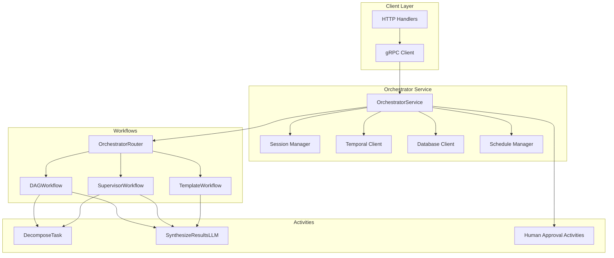
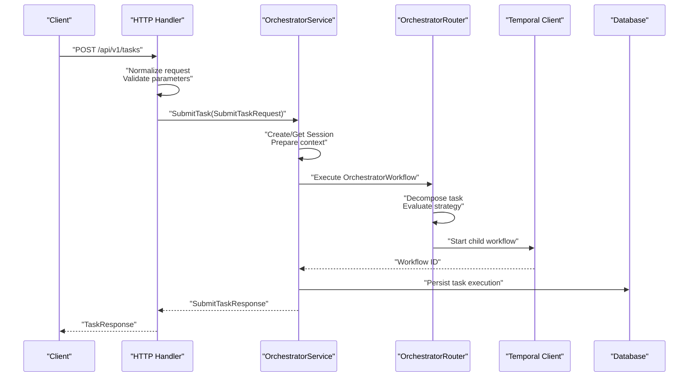
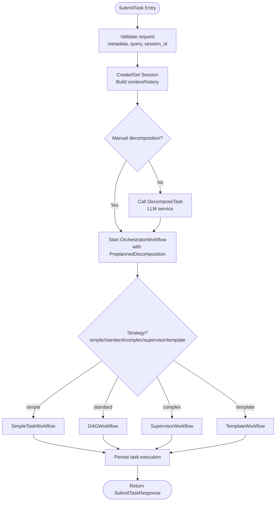
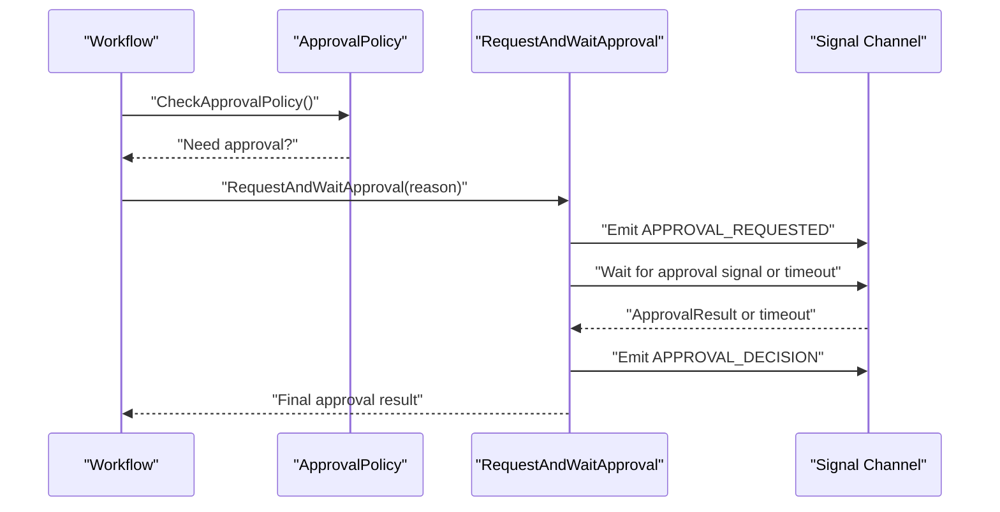
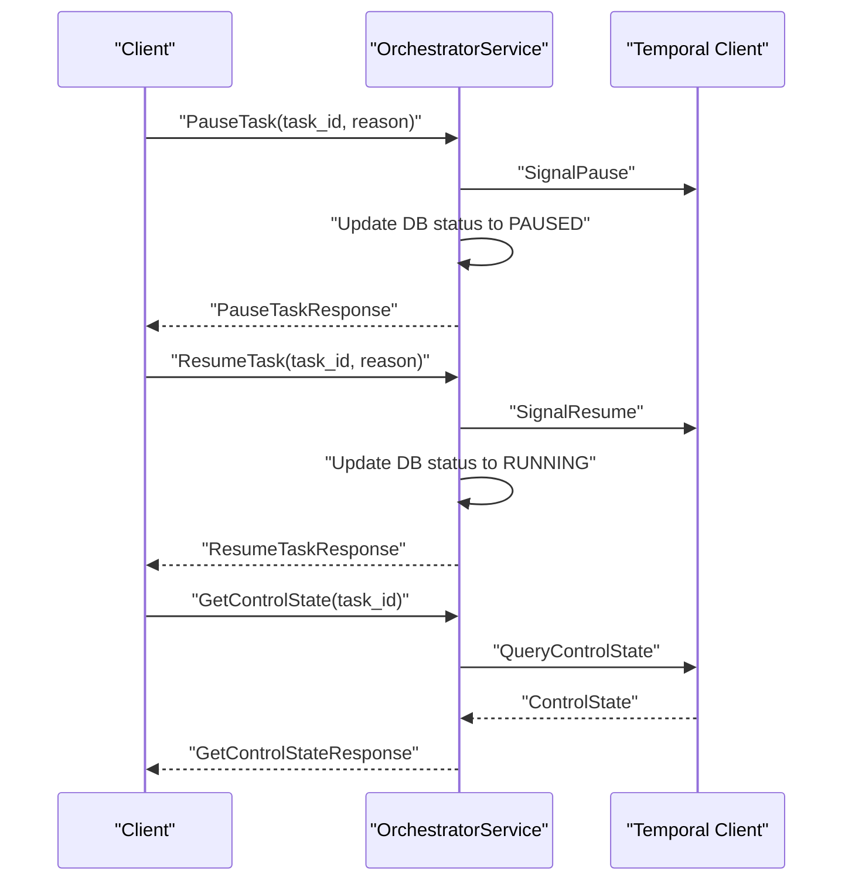
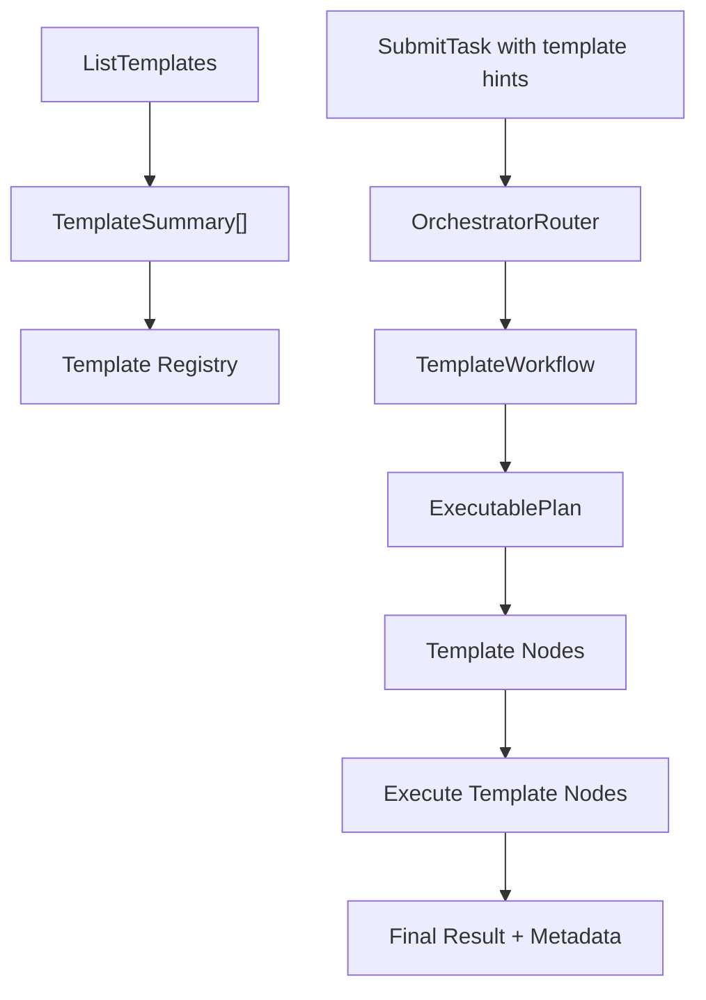
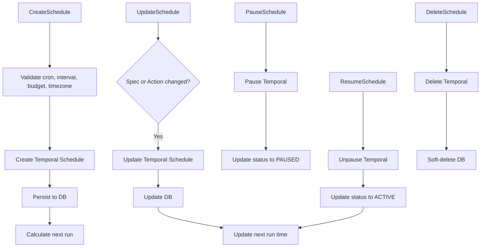
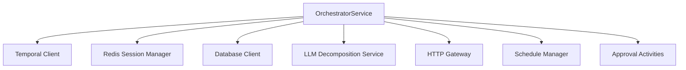

# Orchestrator Service

<cite>
**Referenced Files in This Document**
- [orchestrator.proto](file://protos/orchestrator/orchestrator.proto)
- [service.go](file://go/orchestrator/internal/server/service.go)
- [task.go](file://go/orchestrator/cmd/gateway/internal/handlers/task.go)
- [types.go](file://go/orchestrator/internal/workflows/types.go)
- [dag.go](file://go/orchestrator/internal/workflows/strategies/dag.go)
- [orchestrator_router.go](file://go/orchestrator/internal/workflows/orchestrator_router.go)
- [template_workflow.go](file://go/orchestrator/internal/workflows/template_workflow.go)
- [decompose.go](file://go/orchestrator/internal/activities/decompose.go)
- [manager.go](file://go/orchestrator/internal/session/manager.go)
- [middleware_approval.go](file://go/orchestrator/internal/workflows/middleware_approval.go)
- [manager.go](file://go/orchestrator/internal/schedules/manager.go)
</cite>

## Table of Contents
1. [Introduction](#introduction)
2. [Project Structure](#project-structure)
3. [Core Components](#core-components)
4. [Architecture Overview](#architecture-overview)
5. [Detailed Component Analysis](#detailed-component-analysis)
6. [Dependency Analysis](#dependency-analysis)
7. [Performance Considerations](#performance-considerations)
8. [Troubleshooting Guide](#troubleshooting-guide)
9. [Conclusion](#conclusion)

## Introduction
This document provides comprehensive documentation for the OrchestratorService gRPC interface. It covers all service methods, request/response message types, parameter validation rules, error handling, task decomposition structures, DAG workflows, agent coordination patterns, session context management, human intervention workflows, workflow control mechanisms, template catalog operations, and schedule management. It also includes practical client implementation guidance with examples of task submission using auto-decomposition versus manual decomposition, along with retry strategies and error handling patterns.

## Project Structure
The OrchestratorService spans multiple layers:
- Protocol Buffers define the gRPC contract and message schemas.
- The Go service implements the gRPC server, integrates with Temporal workflows, manages sessions, and coordinates approvals and scheduling.
- Handlers translate HTTP requests to gRPC calls and normalize parameters.
- Workflows orchestrate task execution, decomposition, synthesis, and control signals.
- Activities encapsulate LLM calls, tool execution, and auxiliary operations.



**Diagram sources**
- [service.go](file://go/orchestrator/internal/server/service.go#L44-L97)
- [task.go](file://go/orchestrator/cmd/gateway/internal/handlers/task.go#L29-L34)
- [orchestrator_router.go](file://go/orchestrator/internal/workflows/orchestrator_router.go#L26-L731)
- [dag.go](file://go/orchestrator/internal/workflows/strategies/dag.go#L26-L800)
- [template_workflow.go](file://go/orchestrator/internal/workflows/template_workflow.go#L32-L172)

**Section sources**
- [orchestrator.proto](file://protos/orchestrator/orchestrator.proto#L10-L36)
- [service.go](file://go/orchestrator/internal/server/service.go#L44-L97)
- [task.go](file://go/orchestrator/cmd/gateway/internal/handlers/task.go#L29-L34)

## Core Components
- OrchestratorService: Implements the gRPC service, manages sessions, routes tasks to workflows, handles control signals, and coordinates approvals and schedules.
- Session Manager: Manages multi-turn conversation context, history, and token usage with Redis-backed persistence and local caching.
- Workflow Router: Determines execution strategy (simple, DAG, supervisor, template) based on decomposition results, cognitive strategies, and configuration.
- DAG Workflow: Executes multi-agent tasks with parallel/sequential/hybrid patterns, synthesis, citations, and optional reflection.
- Supervisor Workflow: Coordinates sub-teams, handles dynamic recruitment/retirement, P2P coordination, and intelligent retry strategies.
- Template Workflow: Executes deterministic plans from compiled templates with pattern-based strategies and budget-aware execution.
- Approval Middleware: Evaluates approval policies and coordinates human approvals with timeouts and signals.
- Schedule Manager: Manages cron-based recurring tasks with resource limits, validation, and Temporal integration.

**Section sources**
- [service.go](file://go/orchestrator/internal/server/service.go#L44-L97)
- [manager.go](file://go/orchestrator/internal/session/manager.go#L21-L94)
- [orchestrator_router.go](file://go/orchestrator/internal/workflows/orchestrator_router.go#L26-L731)
- [dag.go](file://go/orchestrator/internal/workflows/strategies/dag.go#L26-L800)
- [supervisor_workflow.go](file://go/orchestrator/internal/workflows/supervisor_workflow.go#L42-L800)
- [template_workflow.go](file://go/orchestrator/internal/workflows/template_workflow.go#L32-L172)
- [middleware_approval.go](file://go/orchestrator/internal/workflows/middleware_approval.go#L14-L120)
- [manager.go](file://go/orchestrator/internal/schedules/manager.go#L35-L52)

## Architecture Overview
The OrchestratorService exposes a gRPC interface for task orchestration. Clients submit tasks with optional auto-decomposition or manual decomposition. The service:
- Creates or retrieves sessions, enriching context and history.
- Routes to OrchestratorWorkflow which performs decomposition and selects an execution strategy.
- Starts appropriate child workflows (DAG, Supervisor, Template) or simple tasks.
- Emits streaming events and persists task execution metadata.
- Supports workflow control (pause/resume/cancel), human approvals, and scheduled tasks.



**Diagram sources**
- [task.go](file://go/orchestrator/cmd/gateway/internal/handlers/task.go#L378-L466)
- [service.go](file://go/orchestrator/internal/server/service.go#L194-L841)
- [orchestrator_router.go](file://go/orchestrator/internal/workflows/orchestrator_router.go#L26-L731)

**Section sources**
- [service.go](file://go/orchestrator/internal/server/service.go#L194-L841)
- [orchestrator_router.go](file://go/orchestrator/internal/workflows/orchestrator_router.go#L26-L731)

## Detailed Component Analysis

### gRPC Service Methods and Contracts
The OrchestratorService defines the following RPCs:
- SubmitTask: Submits a new task with optional auto/manual decomposition and session context.
- GetTaskStatus: Retrieves task status, progress, result, metrics, and agent statuses.
- CancelTask: Requests cancellation of a running task.
- ListTasks: Lists tasks for a user or session with pagination and filtering.
- GetSessionContext: Retrieves session context, recent tasks, and token usage.
- ListTemplates: Lists available template catalog entries.
- ApproveTask and GetPendingApprovals: Human intervention endpoints for approvals.
- PauseTask, ResumeTask, GetControlState: Workflow control operations.
- Schedule management: Create, get, list, update, delete, pause, resume schedules.

Message types include TaskDecomposition, AgentTask, DAGStructure, SessionContext, and numerous request/response messages for each RPC.

**Section sources**
- [orchestrator.proto](file://protos/orchestrator/orchestrator.proto#L10-L36)
- [orchestrator.proto](file://protos/orchestrator/orchestrator.proto#L63-L96)
- [orchestrator.proto](file://protos/orchestrator/orchestrator.proto#L146-L153)
- [orchestrator.proto](file://protos/orchestrator/orchestrator.proto#L163-L167)
- [orchestrator.proto](file://protos/orchestrator/orchestrator.proto#L170-L202)
- [orchestrator.proto](file://protos/orchestrator/orchestrator.proto#L205-L237)
- [orchestrator.proto](file://protos/orchestrator/orchestrator.proto#L240-L352)

### Task Submission and Decomposition
- Auto-decomposition: OrchestratorWorkflow calls the LLM decomposition service to produce a plan with subtasks, dependencies, and execution strategy.
- Manual decomposition: Clients provide TaskDecomposition with AgentTask entries and DAGStructure for direct execution.
- Session continuity: SessionContext maintains conversation history, persistent context, files created, tools used, and token usage.



**Diagram sources**
- [service.go](file://go/orchestrator/internal/server/service.go#L194-L841)
- [orchestrator_router.go](file://go/orchestrator/internal/workflows/orchestrator_router.go#L26-L731)
- [dag.go](file://go/orchestrator/internal/workflows/strategies/dag.go#L26-L800)
- [template_workflow.go](file://go/orchestrator/internal/workflows/template_workflow.go#L32-L172)
- [decompose.go](file://go/orchestrator/internal/activities/decompose.go#L49-L117)

**Section sources**
- [service.go](file://go/orchestrator/internal/server/service.go#L194-L841)
- [orchestrator_router.go](file://go/orchestrator/internal/workflows/orchestrator_router.go#L26-L731)
- [decompose.go](file://go/orchestrator/internal/activities/decompose.go#L49-L117)

### Session Context Management
- Session creation and retrieval with Redis-backed storage and local caching.
- Message history management with configurable limits.
- Token usage tracking and session-level metadata.
- Tenant isolation and ownership verification.

```mermaid
classDiagram
class SessionManager {
+CreateSession(ctx, userID, tenantID, metadata) *Session
+CreateSessionWithID(ctx, sessionID, userID, tenantID, metadata) *Session
+GetSession(ctx, sessionID) *Session
+AddMessage(ctx, sessionID, msg) error
+UpdateContext(ctx, sessionID, key, value) error
+ExtendSession(ctx, sessionID, duration) error
+CleanupExpired(ctx) (int, error)
}
class Session {
+string ID
+string UserID
+string TenantID
+time Time CreatedAt
+time Time UpdatedAt
+time Time ExpiresAt
+map~string,interface{}~ Metadata
+map~string,interface{}~ Context
+[]Message History
+int TotalTokensUsed
+bool IsExpired()
}
class Message {
+string ID
+string Role
+string Content
+time Time Timestamp
+int TokensUsed
}
SessionManager --> Session : "manages"
Session --> Message : "contains"
```

**Diagram sources**
- [manager.go](file://go/orchestrator/internal/session/manager.go#L21-L94)
- [manager.go](file://go/orchestrator/internal/session/manager.go#L98-L184)
- [manager.go](file://go/orchestrator/internal/session/manager.go#L187-L243)

**Section sources**
- [manager.go](file://go/orchestrator/internal/session/manager.go#L21-L94)
- [manager.go](file://go/orchestrator/internal/session/manager.go#L98-L184)
- [manager.go](file://go/orchestrator/internal/session/manager.go#L187-L243)

### Human Intervention and Approvals
- Approval policy evaluation based on complexity, tools, and budget.
- RequestAndWaitApproval initiates an approval request and waits for signal or timeout.
- Events emitted for approval requests and decisions.



**Diagram sources**
- [middleware_approval.go](file://go/orchestrator/internal/workflows/middleware_approval.go#L14-L120)

**Section sources**
- [middleware_approval.go](file://go/orchestrator/internal/workflows/middleware_approval.go#L14-L120)

### Workflow Control Mechanisms
- PauseTask, ResumeTask, GetControlState manage workflow lifecycle with ownership checks.
- Control signals propagated to workflows via Temporal signals and queries.
- Status mapping accounts for Temporal states and control state overrides.



**Diagram sources**
- [service.go](file://go/orchestrator/internal/server/service.go#L1640-L1868)

**Section sources**
- [service.go](file://go/orchestrator/internal/server/service.go#L1640-L1868)

### Template Catalog Operations
- ListTemplates returns template summaries from the registry.
- TemplateWorkflow executes compiled templates with deterministic plans, pattern strategies, and budget-aware execution.



**Diagram sources**
- [service.go](file://go/orchestrator/internal/server/service.go#L99-L113)
- [orchestrator_router.go](file://go/orchestrator/internal/workflows/orchestrator_router.go#L90-L215)
- [template_workflow.go](file://go/orchestrator/internal/workflows/template_workflow.go#L32-L172)

**Section sources**
- [service.go](file://go/orchestrator/internal/server/service.go#L99-L113)
- [template_workflow.go](file://go/orchestrator/internal/workflows/template_workflow.go#L32-L172)

### Schedule Management Operations
- CreateSchedule validates cron expressions, intervals, budgets, and timezones; persists to DB and registers with Temporal.
- UpdateSchedule modifies spec/action parameters atomically; recalculates next run time.
- PauseSchedule/ResumeSchedule toggle Temporal schedule state and update DB.
- DeleteSchedule soft-deletes and removes Temporal schedule.
- ListSchedules supports pagination and status filtering.



**Diagram sources**
- [manager.go](file://go/orchestrator/internal/schedules/manager.go#L55-L169)
- [manager.go](file://go/orchestrator/internal/schedules/manager.go#L172-L247)
- [manager.go](file://go/orchestrator/internal/schedules/manager.go#L250-L277)
- [manager.go](file://go/orchestrator/internal/schedules/manager.go#L280-L439)

**Section sources**
- [manager.go](file://go/orchestrator/internal/schedules/manager.go#L55-L169)
- [manager.go](file://go/orchestrator/internal/schedules/manager.go#L172-L247)
- [manager.go](file://go/orchestrator/internal/schedules/manager.go#L250-L277)
- [manager.go](file://go/orchestrator/internal/schedules/manager.go#L280-L439)

### Client Implementation Examples and Best Practices
- Task submission with auto-decomposition:
  - Build SubmitTaskRequest with metadata, query, and optional context.
  - Call SubmitTask; handle gRPC status codes and propagate auth/tracing headers.
  - Use X-Workflow-ID/X-Session-ID headers for tracing and correlation.
- Task submission with manual decomposition:
  - Provide TaskDecomposition with AgentTask entries and DAGStructure.
  - Set mode and include complexity score for routing.
- Error handling and retry:
  - Map gRPC codes to HTTP responses (InvalidArgument, ResourceExhausted).
  - Retry transient errors with exponential backoff; avoid retrying non-transient errors.
  - For rate limits, implement client-side throttling and queueing.
- Status polling:
  - Use GetTaskStatus with include_details for richer metadata.
  - Poll until terminal states (COMPLETED, FAILED, CANCELLED, TIMEOUT).
- Workflow control:
  - Use PauseTask/ResumeTask with reasons; check GetControlState for current state.
- Approvals:
  - Honor RequireApproval flag; handle approval timeouts gracefully.
- Schedules:
  - Validate cron expressions and minimum intervals; enforce budget limits.

**Section sources**
- [task.go](file://go/orchestrator/cmd/gateway/internal/handlers/task.go#L378-L466)
- [task.go](file://go/orchestrator/cmd/gateway/internal/handlers/task.go#L561-L715)
- [service.go](file://go/orchestrator/internal/server/service.go#L1574-L1637)
- [service.go](file://go/orchestrator/internal/server/service.go#L1640-L1868)

## Dependency Analysis
The OrchestratorService integrates several subsystems:
- Temporal SDK for workflow orchestration and control signals.
- Redis for session persistence and local caching.
- Database for task execution persistence and token usage aggregation.
- HTTP gateway for translating HTTP requests to gRPC calls.
- LLM service for task decomposition.



**Diagram sources**
- [service.go](file://go/orchestrator/internal/server/service.go#L44-L97)
- [task.go](file://go/orchestrator/cmd/gateway/internal/handlers/task.go#L29-L34)

**Section sources**
- [service.go](file://go/orchestrator/internal/server/service.go#L44-L97)
- [task.go](file://go/orchestrator/cmd/gateway/internal/handlers/task.go#L29-L34)

## Performance Considerations
- Session caching reduces Redis load; tune cache size and TTL for optimal hit rates.
- Decomposition latency impacts overall task start time; configure timeouts and consider caching decomposition results when safe.
- Token usage aggregation consolidates costs and tokens; ensure consistent metadata to avoid recomputation.
- Workflow control signals minimize overhead by avoiding full restarts.
- Schedule validation prevents excessive resource usage; enforce minimum intervals and budget caps.

## Troubleshooting Guide
- Authentication failures: Ensure proper auth headers and tenant context; service returns Unauthenticated for missing context.
- Task not found: Ownership checks via workflow memo; tenant isolation prevents leaking existence.
- Rate limiting: gRPC ResourceExhausted mapped to HTTP 429; implement client-side backoff.
- Decomposition errors: LLM service errors recorded and surfaced; verify LLM_SERVICE_URL and network connectivity.
- Approval timeouts: Default 60-minute timeout; adjust via ApprovalTimeout in task input.
- Schedule validation: Invalid cron expressions, intervals too short, budget exceeded, or invalid timezone cause specific errors.

**Section sources**
- [service.go](file://go/orchestrator/internal/server/service.go#L1580-L1637)
- [service.go](file://go/orchestrator/internal/server/service.go#L1640-L1868)
- [middleware_approval.go](file://go/orchestrator/internal/workflows/middleware_approval.go#L86-L120)
- [manager.go](file://go/orchestrator/internal/schedules/manager.go#L56-L94)

## Conclusion
The OrchestratorService provides a robust, extensible framework for multi-agent task orchestration. Its gRPC interface, combined with workflow strategies, session management, approvals, and scheduling, enables flexible automation with strong control and observability. Clients should leverage auto-decomposition for simplicity, manual decomposition for precision, and comprehensive error handling with retries for resilient operation.