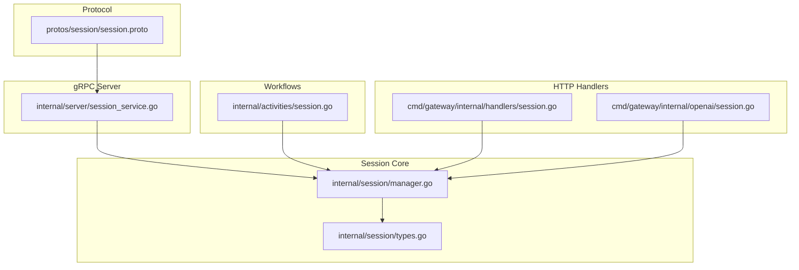
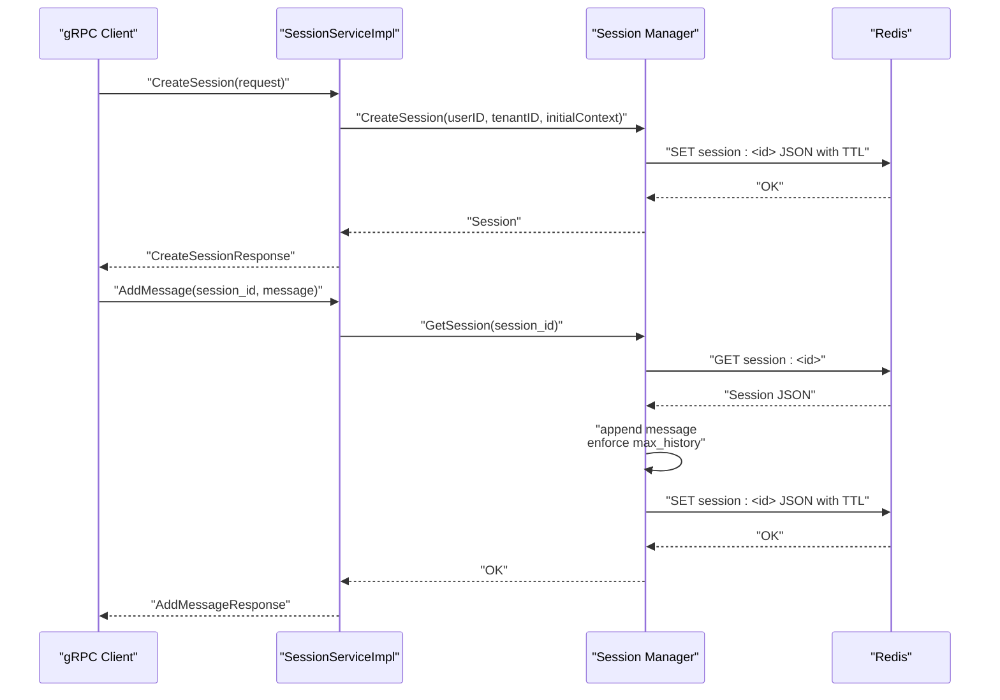
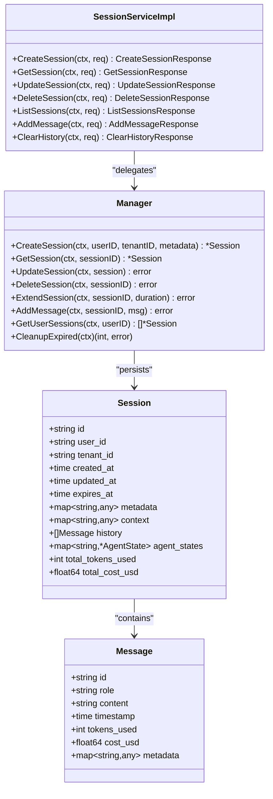

# Session Service

<cite>
**Referenced Files in This Document**
- [session.proto](file://protos/session/session.proto)
- [session_service.go](file://go/orchestrator/internal/server/session_service.go)
- [types.go](file://go/orchestrator/internal/session/types.go)
- [manager.go](file://go/orchestrator/internal/session/manager.go)
- [session.go](file://go/orchestrator/internal/activities/session.go)
- [session.go](file://go/orchestrator/cmd/gateway/internal/handlers/session.go)
- [session.go](file://go/orchestrator/cmd/gateway/internal/openai/session.go)
- [session_continuity.py](file://clients/python/examples/session_continuity.py)
</cite>

## Table of Contents
1. [Introduction](#introduction)
2. [Project Structure](#project-structure)
3. [Core Components](#core-components)
4. [Architecture Overview](#architecture-overview)
5. [Detailed Component Analysis](#detailed-component-analysis)
6. [Dependency Analysis](#dependency-analysis)
7. [Performance Considerations](#performance-considerations)
8. [Troubleshooting Guide](#troubleshooting-guide)
9. [Conclusion](#conclusion)
10. [Appendices](#appendices)

## Introduction
This document describes the SessionService gRPC interface for managing multi-turn conversations and session state. It covers session lifecycle operations (create, get, update, delete), conversation history management, context persistence, and metadata storage. It also documents message types for snapshots, context updates, and state queries, along with security, access control, data isolation, scaling, distributed state management, conflict resolution, and practical examples for session-based task execution and multi-turn conversations.

## Project Structure
The SessionService spans protocol definitions, a gRPC server implementation, a session manager backed by Redis, and activity integrations that update session state after workflow execution. HTTP handlers and OpenAI compatibility utilities demonstrate how sessions integrate with broader systems.

**Diagram sources**
- [session.proto](file://protos/session/session.proto#L1-L176)
- [session_service.go](file://go/orchestrator/internal/server/session_service.go#L1-L373)
- [types.go](file://go/orchestrator/internal/session/types.go#L1-L145)
- [manager.go](file://go/orchestrator/internal/session/manager.go#L1-L475)
- [session.go](file://go/orchestrator/internal/activities/session.go#L1-L146)
- [session.go](file://go/orchestrator/cmd/gateway/internal/handlers/session.go#L1-L800)
- [session.go](file://go/orchestrator/cmd/gateway/internal/openai/session.go#L1-L283)

**Section sources**
- [session.proto](file://protos/session/session.proto#L1-L176)
- [session_service.go](file://go/orchestrator/internal/server/session_service.go#L1-L373)
- [types.go](file://go/orchestrator/internal/session/types.go#L1-L145)
- [manager.go](file://go/orchestrator/internal/session/manager.go#L1-L475)
- [session.go](file://go/orchestrator/internal/activities/session.go#L1-L146)
- [session.go](file://go/orchestrator/cmd/gateway/internal/handlers/session.go#L1-L800)
- [session.go](file://go/orchestrator/cmd/gateway/internal/openai/session.go#L1-L283)

## Core Components
- SessionService gRPC API: Defines CreateSession, GetSession, UpdateSession, DeleteSession, ListSessions, AddMessage, ClearHistory RPCs and associated request/response/message types.
- SessionServiceImpl: Implements the gRPC service and delegates to the session Manager.
- Session Manager: Provides CreateSession, GetSession, UpdateSession, DeleteSession, ExtendSession, AddMessage, GetUserSessions, CleanupExpired with Redis-backed persistence and local caching.
- Session Types: Core data structures for Session, Message, AgentState, and token/cost tracking.
- Activities Integration: Updates session with workflow results, tokens, costs, and maintains conversational context.
- HTTP Handlers and OpenAI Compatibility: Provide session metadata, history, and OpenAI session mapping for continuity.

**Section sources**
- [session.proto](file://protos/session/session.proto#L11-L33)
- [session_service.go](file://go/orchestrator/internal/server/session_service.go#L19-L373)
- [types.go](file://go/orchestrator/internal/session/types.go#L19-L145)
- [manager.go](file://go/orchestrator/internal/session/manager.go#L20-L475)
- [session.go](file://go/orchestrator/internal/activities/session.go#L15-L146)
- [session.go](file://go/orchestrator/cmd/gateway/internal/handlers/session.go#L25-L800)
- [session.go](file://go/orchestrator/cmd/gateway/internal/openai/session.go#L38-L283)

## Architecture Overview
The SessionService exposes a gRPC interface for session lifecycle and conversation history management. The gRPC server converts protobuf messages to internal session types, persists them via the Manager (Redis + local cache), and integrates with workflow activities to update token usage and context after tasks complete.

**Diagram sources**
- [session_service.go](file://go/orchestrator/internal/server/session_service.go#L34-L82)
- [session_service.go](file://go/orchestrator/internal/server/session_service.go#L233-L278)
- [manager.go](file://go/orchestrator/internal/session/manager.go#L97-L132)
- [manager.go](file://go/orchestrator/internal/session/manager.go#L296-L311)

## Detailed Component Analysis

### SessionService gRPC API
- Service definition: CreateSession, GetSession, UpdateSession, DeleteSession, ListSessions, AddMessage, ClearHistory.
- Message types: CreateSessionRequest/Response, GetSessionRequest/Response, UpdateSessionRequest/Response, DeleteSessionRequest/Response, ListSessionsRequest/Response, AddMessageRequest/Response, ClearHistoryRequest/Response, Session, SessionSummary, Message, SessionMetrics.

Key behaviors:
- CreateSession: Accepts user_id, initial_context, max_history, ttl_seconds; returns session_id, created_at, expires_at, status, message.
- GetSession: Returns full Session with optional history inclusion.
- UpdateSession: Supports incremental context updates and TTL extension; returns success, new_expires_at, status, message.
- DeleteSession: Removes session from Redis and local cache.
- ListSessions: Placeholder returning empty list (future Redis-backed listing).
- AddMessage: Appends a Message to history and enforces max_history.
- ClearHistory: Clears history and optionally resets context.

**Section sources**
- [session.proto](file://protos/session/session.proto#L11-L176)
- [session_service.go](file://go/orchestrator/internal/server/session_service.go#L34-L328)

### SessionServiceImpl Implementation
- Logging and tenant-awareness: Extracts tenant from auth context for multi-tenancy.
- CreateSession: Converts Struct to map, merges max_history into context, computes expires_at (default 30 days or provided ttl_seconds).
- GetSession: Loads session, converts to protobuf, respects include_history flag.
- UpdateSession: Merges context updates, optionally extends TTL, persists session.
- DeleteSession: Delegates to manager.
- ListSessions: Currently returns empty list; intended for Redis-backed listing.
- AddMessage: Converts protobuf Message to internal format, appends to history, returns updated size.
- ClearHistory: Clears history and optionally resets context.

**Section sources**
- [session_service.go](file://go/orchestrator/internal/server/session_service.go#L34-L328)

### Session Manager (Redis + Local Cache)
Responsibilities:
- CreateSession: Generates UUID, initializes context/history, persists with TTL, caches locally.
- GetSession: Checks local cache (LRU), falls back to Redis, enforces tenant isolation, updates cache access time.
- UpdateSession: Persists to Redis with computed TTL, updates local cache.
- DeleteSession: Removes from Redis and local cache.
- ExtendSession: Updates ExpiresAt and persists.
- AddMessage: Appends to history and trims to max_history.
- GetUserSessions: Scans Redis keyspace for user sessions (placeholder logic).
- CleanupExpired: Iterates keyspace, deletes expired sessions.
- Local cache: LRU eviction when exceeding configured capacity.

Security and isolation:
- Tenant enforcement: Compares session tenant with auth context; denies cross-tenant access.
- Session ID reuse protection: Manager prevents hijacking by generating new ID if requested ID exists under another user.

**Section sources**
- [manager.go](file://go/orchestrator/internal/session/manager.go#L97-L184)
- [manager.go](file://go/orchestrator/internal/session/manager.go#L186-L243)
- [manager.go](file://go/orchestrator/internal/session/manager.go#L245-L283)
- [manager.go](file://go/orchestrator/internal/session/manager.go#L285-L294)
- [manager.go](file://go/orchestrator/internal/session/manager.go#L296-L311)
- [manager.go](file://go/orchestrator/internal/session/manager.go#L328-L361)
- [manager.go](file://go/orchestrator/internal/session/manager.go#L363-L392)
- [manager.go](file://go/orchestrator/internal/session/manager.go#L415-L451)

### Session Data Model
Core structures:
- Session: id, user_id, tenant_id, created_at, updated_at, expires_at, metadata, context, history, agent_states, totals for tokens and cost.
- Message: id, role, content, timestamp, tokens_used, cost_usd, metadata.
- AgentState: agent_id, last_active, state, memory, tools_used, tokens_used.
- Utilities: IsExpired, Get/SetContextValue, GetAgentState/SetAgentState, GetRecentHistory, GetHistorySummary, UpdateTokenUsage.

**Section sources**
- [types.go](file://go/orchestrator/internal/session/types.go#L19-L145)

### Workflow Integration: UpdateSessionResult
After workflow execution, activities update session state:
- Compute cost using centralized pricing (per-agent, model, or default).
- Append assistant message to history with tokens and cost.
- Enforce max history limit.
- Update context with last_updated_at, totals, and truncated previews.
- Persist session via Manager.

**Section sources**
- [session.go](file://go/orchestrator/internal/activities/session.go#L15-L146)

### HTTP Handlers and OpenAI Compatibility
- HTTP SessionHandler: Provides session metadata and history endpoints, enforcing user and tenant access controls, aggregating token usage from Redis or DB, detecting research sessions from context or first task metadata.
- OpenAI SessionManager: Derives or validates OpenAI-compatible session IDs, maps to Shannon session IDs, tracks usage, and handles collisions by generating new sessions.

**Section sources**
- [session.go](file://go/orchestrator/cmd/gateway/internal/handlers/session.go#L132-L800)
- [session.go](file://go/orchestrator/cmd/gateway/internal/openai/session.go#L62-L283)

### Example: Session Continuity (Python)
Demonstrates multi-turn conversation using a stable session_id across tasks, fetching session info/history, updating title, and listing sessions.

**Section sources**
- [session_continuity.py](file://clients/python/examples/session_continuity.py#L1-L79)

## Dependency Analysis

**Diagram sources**
- [session_service.go](file://go/orchestrator/internal/server/session_service.go#L19-L373)
- [manager.go](file://go/orchestrator/internal/session/manager.go#L20-L475)
- [types.go](file://go/orchestrator/internal/session/types.go#L19-L145)

**Section sources**
- [session_service.go](file://go/orchestrator/internal/server/session_service.go#L19-L373)
- [manager.go](file://go/orchestrator/internal/session/manager.go#L20-L475)
- [types.go](file://go/orchestrator/internal/session/types.go#L19-L145)

## Performance Considerations
- Local cache: Manager maintains an LRU cache keyed by session_id with access tracking; cache size capped to configured max to reduce Redis load.
- Redis TTL: Sessions are persisted with TTL derived from ExpiresAt; on update, TTL is recalculated to match expiration.
- History trimming: AddMessage enforces max_history to bound memory growth.
- Circuit breaker: Redis operations are wrapped to protect upstream services from transient failures.
- Metrics: Cache hits/misses, evictions, and session counts are tracked to monitor performance.

Recommendations:
- Tune ManagerConfig (MaxHistory, TTL, CacheSize) based on workload characteristics.
- Monitor cache hit ratio and adjust CacheSize accordingly.
- Use ExtendSession to dynamically adjust TTL for long-running conversations.

**Section sources**
- [manager.go](file://go/orchestrator/internal/session/manager.go#L40-L95)
- [manager.go](file://go/orchestrator/internal/session/manager.go#L186-L243)
- [manager.go](file://go/orchestrator/internal/session/manager.go#L296-L311)
- [manager.go](file://go/orchestrator/internal/session/manager.go#L415-L451)

## Troubleshooting Guide
Common issues and resolutions:
- Session not found: Returned when Redis has no session or when tenant isolation blocks access. Ensure correct session_id and user/tenant context.
- Session expired: Manager deletes expired sessions on retrieval; recreate or extend TTL.
- Cross-tenant access denied: Tenant enforcement prevents leaking session existence; verify auth context matches session tenant.
- Session ID reuse collision: Manager generates new ID if requested ID exists under another user; avoid reusing IDs across users.
- ClearHistory behavior: Clearing history without keep_context resets context; use keep_context=true to preserve context while clearing messages.

Operational tips:
- Use GetSession with include_history=false for lightweight reads.
- Use UpdateSession to extend TTL proactively for long conversations.
- Monitor cache metrics to detect hotspots and tune CacheSize.

**Section sources**
- [manager.go](file://go/orchestrator/internal/session/manager.go#L226-L232)
- [manager.go](file://go/orchestrator/internal/session/manager.go#L285-L294)
- [manager.go](file://go/orchestrator/internal/session/manager.go#L134-L152)
- [session_service.go](file://go/orchestrator/internal/server/session_service.go#L280-L328)

## Conclusion
The SessionService provides a robust, tenant-aware, and scalable foundation for multi-turn conversations. It combines protobuf-defined APIs, a Redis-backed Manager with local caching, and workflow integrations to maintain context, track tokens and costs, and support continuity across tasks. Security is enforced through tenant isolation and session ownership checks, while performance is optimized via caching and TTL management.

## Appendices

### Session Lifecycle Operations
- Create: Provide user_id, optional initial_context, max_history, ttl_seconds; receive session_id and expires_at.
- Continue: Use AddMessage to append user/assistant/system messages; leverage UpdateSession to extend TTL and update context.
- Terminate: DeleteSession to remove session state.

**Section sources**
- [session.proto](file://protos/session/session.proto#L35-L90)
- [session_service.go](file://go/orchestrator/internal/server/session_service.go#L34-L82)
- [session_service.go](file://go/orchestrator/internal/server/session_service.go#L233-L278)
- [session_service.go](file://go/orchestrator/internal/server/session_service.go#L116-L185)
- [session_service.go](file://go/orchestrator/internal/server/session_service.go#L187-L213)

### Conversation History Management
- AddMessage: Append a Message with role/content/timestamp; history trimmed to configured max_history.
- ClearHistory: Reset history; optionally keep context by passing keep_context=true.

**Section sources**
- [session.proto](file://protos/session/session.proto#L108-L133)
- [session_service.go](file://go/orchestrator/internal/server/session_service.go#L233-L278)
- [session_service.go](file://go/orchestrator/internal/server/session_service.go#L280-L328)
- [manager.go](file://go/orchestrator/internal/session/manager.go#L296-L311)

### Session Metadata Storage
- Session: Stores context, history, metrics, and metadata; includes tenant_id for isolation.
- Message: Tracks tokens_used and cost_usd; supports metadata for extended attributes.
- AgentState: Per-agent state, memory, tools used, and tokens used.

**Section sources**
- [types.go](file://go/orchestrator/internal/session/types.go#L19-L145)
- [session.proto](file://protos/session/session.proto#L135-L176)

### Message Types for Snapshots, Context Updates, and Queries
- Snapshot: Session includes context, history, metrics, timestamps.
- Context update: UpdateSessionRequest.context_updates merges into session.Context.
- State query: GetSessionRequest.include_history controls whether history is included.

**Section sources**
- [session.proto](file://protos/session/session.proto#L52-L63)
- [session.proto](file://protos/session/session.proto#L65-L78)
- [session.proto](file://protos/session/session.proto#L135-L156)

### Security, Access Control, and Data Isolation
- Tenant enforcement: Session retrieval compares session.TenantID with auth context; denies cross-tenant access.
- Ownership checks: Manager prevents hijacking of session IDs across users.
- HTTP handlers: Enforce user_id and tenant_id filters on DB queries and Redis lookups.

**Section sources**
- [manager.go](file://go/orchestrator/internal/session/manager.go#L226-L232)
- [manager.go](file://go/orchestrator/internal/session/manager.go#L134-L152)
- [session.go](file://go/orchestrator/cmd/gateway/internal/handlers/session.go#L162-L180)

### Scaling, Distributed State, and Conflict Resolution
- Redis backend: Centralized state for sessions with TTL and atomic operations.
- Local cache: Reduces latency and load; LRU eviction keeps cache bounded.
- Conflict resolution: On session ID reuse, Manager generates a new ID to prevent hijacking.
- OpenAI compatibility: SessionManager maps OpenAI session IDs to Shannon sessions, handling collisions by generating new IDs.

**Section sources**
- [manager.go](file://go/orchestrator/internal/session/manager.go#L40-L95)
- [manager.go](file://go/orchestrator/internal/session/manager.go#L134-L152)
- [session.go](file://go/orchestrator/cmd/gateway/internal/openai/session.go#L62-L133)

### Examples: Session-Based Task Execution and Multi-Turn Conversations
- Python example demonstrates multi-turn conversation using a stable session_id, fetching session info/history, updating title, and listing sessions.

**Section sources**
- [session_continuity.py](file://clients/python/examples/session_continuity.py#L18-L78)

### Backup, Recovery, and Audit Logging
- Backup: Sessions are persisted in Redis; ensure Redis persistence/replication is configured externally.
- Recovery: On startup, Manager reconnects to Redis and continues serving sessions; expired sessions are cleaned up by CleanupExpired.
- Audit: HTTP handlers aggregate token usage and task metrics; OpenAI SessionManager tracks usage counters.

Note: The gRPC service itself does not implement dedicated audit logs; integrate external logging/metrics as needed.

**Section sources**
- [manager.go](file://go/orchestrator/internal/session/manager.go#L61-L67)
- [manager.go](file://go/orchestrator/internal/session/manager.go#L363-L392)
- [session.go](file://go/orchestrator/cmd/gateway/internal/handlers/session.go#L209-L250)
- [session.go](file://go/orchestrator/cmd/gateway/internal/openai/session.go#L255-L282)