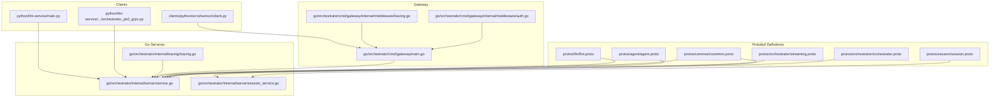
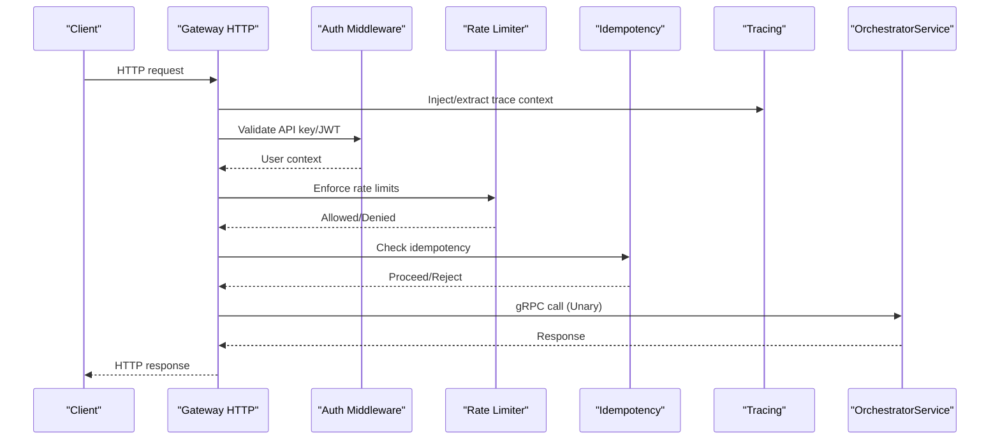
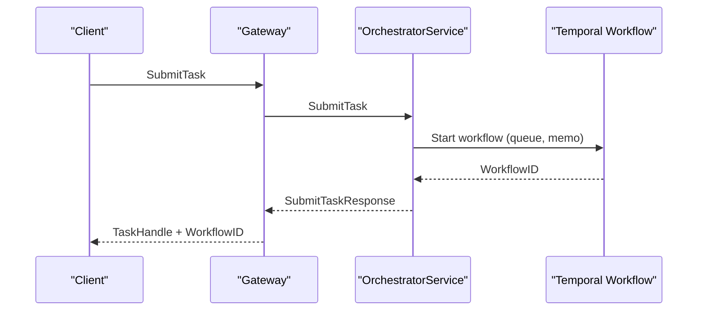
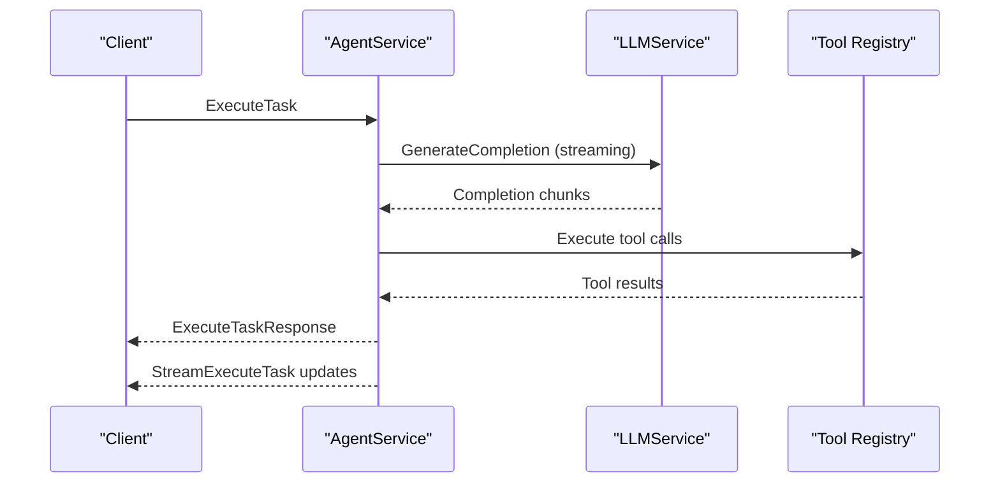
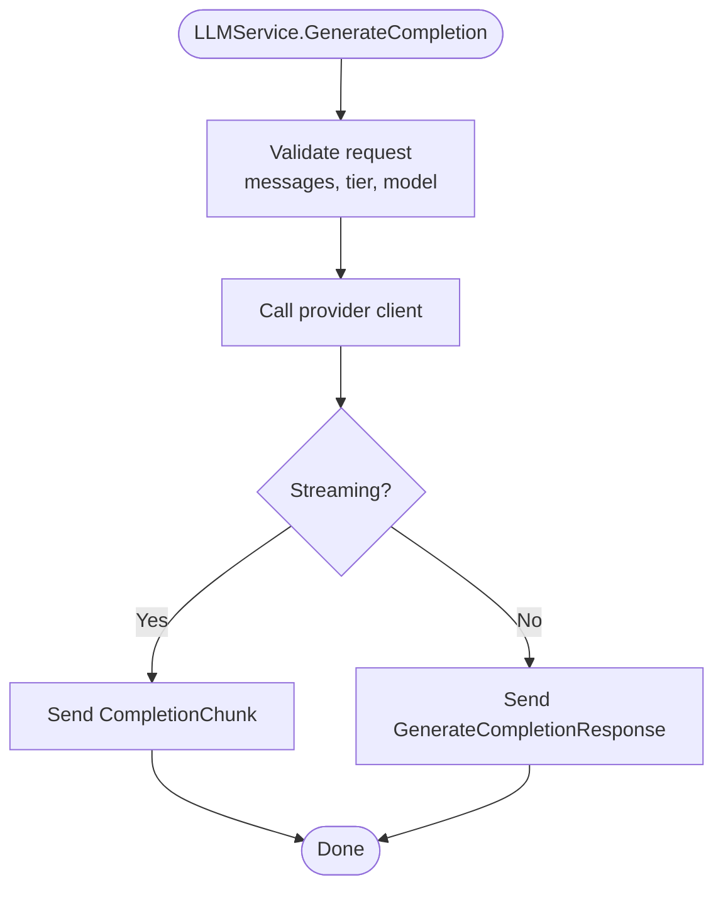
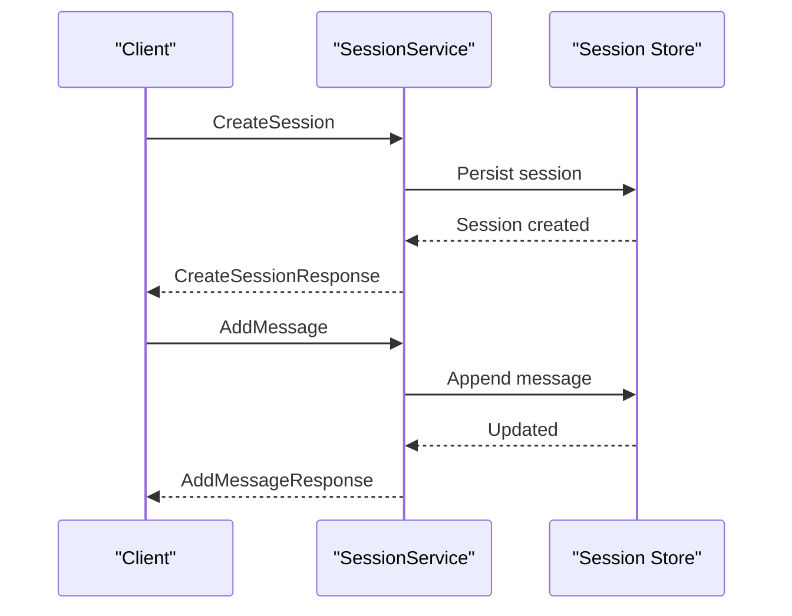
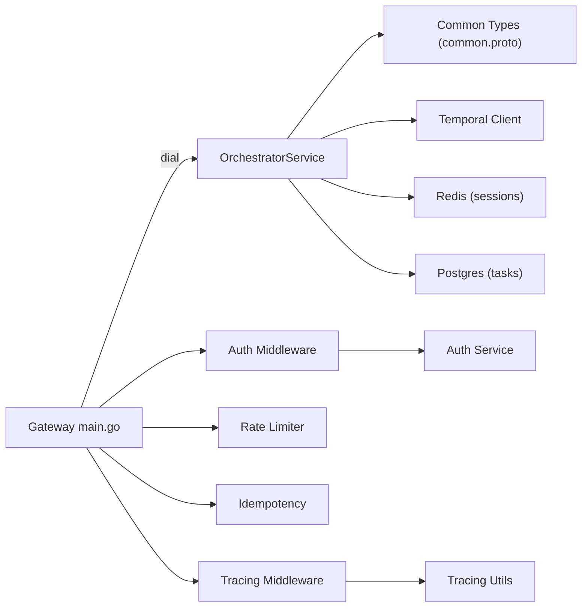

# gRPC API

<cite>
**Referenced Files in This Document**
- [orchestrator.proto](file://protos/orchestrator/orchestrator.proto)
- [streaming.proto](file://protos/orchestrator/streaming.proto)
- [agent.proto](file://protos/agent/agent.proto)
- [llm.proto](file://protos/llm/llm.proto)
- [session.proto](file://protos/session/session.proto)
- [common.proto](file://protos/common/common.proto)
- [main.go](file://go/orchestrator/cmd/gateway/main.go)
- [service.go](file://go/orchestrator/internal/server/service.go)
- [session_service.go](file://go/orchestrator/internal/server/session_service.go)
- [auth.go](file://go/orchestrator/cmd/gateway/internal/middleware/auth.go)
- [tracing.go](file://go/orchestrator/cmd/gateway/internal/middleware/tracing.go)
- [middleware.go](file://go/orchestrator/internal/auth/middleware.go)
- [tracing.go](file://go/orchestrator/internal/tracing/tracing.go)
- [client.py](file://clients/python/src/shannon/client.py)
- [orchestrator_pb2_grpc.py](file://python/llm-service/llm_service/grpc_gen/orchestrator/orchestrator_pb2_grpc.py)
- [main.py](file://python/llm-service/main.py)
</cite>

## Table of Contents
1. [Introduction](#introduction)
2. [Project Structure](#project-structure)
3. [Core Components](#core-components)
4. [Architecture Overview](#architecture-overview)
5. [Detailed Component Analysis](#detailed-component-analysis)
6. [Dependency Analysis](#dependency-analysis)
7. [Performance Considerations](#performance-considerations)
8. [Troubleshooting Guide](#troubleshooting-guide)
9. [Conclusion](#conclusion)
10. [Appendices](#appendices)

## Introduction
This document provides comprehensive gRPC API documentation for internal service communication in the Shannon platform. It covers service definitions for OrchestratorService, AgentService, LLMService, and SessionService, including method signatures, request/response message types, and streaming RPCs. It also documents service discovery, load balancing, connection management, metadata propagation, authentication headers, and tracing integration. Client code examples are included for multiple languages, along with error handling, retry policies, timeout configurations, performance optimization guidelines, and monitoring integration.

## Project Structure
The gRPC APIs are defined in Protocol Buffers under the protos directory and implemented in Go for internal services. Clients exist in Python and are generated from the protobuf definitions. The gateway exposes HTTP endpoints that proxy to internal gRPC services.

**Diagram sources**
- [orchestrator.proto](file://protos/orchestrator/orchestrator.proto#L1-L353)
- [streaming.proto](file://protos/orchestrator/streaming.proto#L1-L29)
- [agent.proto](file://protos/agent/agent.proto#L1-L156)
- [llm.proto](file://protos/llm/llm.proto#L1-L49)
- [session.proto](file://protos/session/session.proto#L1-L176)
- [common.proto](file://protos/common/common.proto#L1-L95)
- [service.go](file://go/orchestrator/internal/server/service.go#L1-L3182)
- [session_service.go](file://go/orchestrator/internal/server/session_service.go#L1-L373)
- [main.go](file://go/orchestrator/cmd/gateway/main.go#L1-L688)
- [auth.go](file://go/orchestrator/cmd/gateway/internal/middleware/auth.go#L1-L247)
- [tracing.go](file://go/orchestrator/cmd/gateway/internal/middleware/tracing.go#L1-L100)
- [middleware.go](file://go/orchestrator/internal/auth/middleware.go#L1-L227)
- [tracing.go](file://go/orchestrator/internal/tracing/tracing.go#L1-L148)
- [client.py](file://clients/python/src/shannon/client.py#L1-L800)
- [orchestrator_pb2_grpc.py](file://python/llm-service/llm_service/grpc_gen/orchestrator/orchestrator_pb2_grpc.py#L1-L833)
- [main.py](file://python/llm-service/main.py#L1-L164)

**Section sources**
- [orchestrator.proto](file://protos/orchestrator/orchestrator.proto#L1-L353)
- [streaming.proto](file://protos/orchestrator/streaming.proto#L1-L29)
- [agent.proto](file://protos/agent/agent.proto#L1-L156)
- [llm.proto](file://protos/llm/llm.proto#L1-L49)
- [session.proto](file://protos/session/session.proto#L1-L176)
- [common.proto](file://protos/common/common.proto#L1-L95)
- [main.go](file://go/orchestrator/cmd/gateway/main.go#L1-L688)

## Core Components
This section summarizes the four primary gRPC services and their responsibilities.

- OrchestratorService: Manages task submission, status, cancellation, listing, session context retrieval, template catalogs, human approvals, workflow control (pause/resume/cancel), and scheduling operations.
- AgentService: Executes tasks, streams task updates, discovers capabilities, reports health, and manages tool discovery and capability queries.
- LLMService: Generates completions (streaming and non-streaming), embeds text, analyzes complexity, and lists models with provider and tier information.
- SessionService: Creates, retrieves, updates, deletes, lists, adds messages, and clears session history for multi-turn conversations.

Each service defines request/response messages and enums in their respective protobuf files. Common types (StatusCode, ExecutionMode, ModelTier, TokenUsage, ExecutionMetrics) are defined centrally to ensure consistency across services.

**Section sources**
- [orchestrator.proto](file://protos/orchestrator/orchestrator.proto#L10-L36)
- [agent.proto](file://protos/agent/agent.proto#L10-L17)
- [llm.proto](file://protos/llm/llm.proto#L9-L15)
- [session.proto](file://protos/session/session.proto#L12-L33)
- [common.proto](file://protos/common/common.proto#L9-L95)

## Architecture Overview
The gateway exposes HTTP endpoints that validate authentication, apply rate limiting and idempotency, and forward requests to internal gRPC services. The gateway connects to OrchestratorService over gRPC with default call options including a large receive buffer. Distributed tracing is supported via W3C traceparent propagation.

**Diagram sources**
- [main.go](file://go/orchestrator/cmd/gateway/main.go#L92-L108)
- [auth.go](file://go/orchestrator/cmd/gateway/internal/middleware/auth.go#L49-L156)
- [tracing.go](file://go/orchestrator/cmd/gateway/internal/middleware/tracing.go#L25-L57)
- [service.go](file://go/orchestrator/internal/server/service.go#L194-L202)

**Section sources**
- [main.go](file://go/orchestrator/cmd/gateway/main.go#L92-L108)
- [auth.go](file://go/orchestrator/cmd/gateway/internal/middleware/auth.go#L49-L156)
- [tracing.go](file://go/orchestrator/cmd/gateway/internal/middleware/tracing.go#L25-L57)
- [service.go](file://go/orchestrator/internal/server/service.go#L194-L202)

## Detailed Component Analysis

### OrchestratorService
- Purpose: Central orchestration for tasks, workflows, approvals, control states, and schedules.
- Key Methods:
  - SubmitTask: Submits a task with optional auto-decomposition and session context.
  - GetTaskStatus: Retrieves task status, progress, metrics, and agent statuses.
  - CancelTask: Cancels a running task.
  - ListTasks: Lists tasks with filtering and pagination.
  - GetSessionContext: Retrieves session context for continuity.
  - ListTemplates: Lists available template catalogs.
  - ApproveTask and GetPendingApprovals: Human intervention endpoints.
  - PauseTask, ResumeTask, GetControlState: Workflow control operations.
  - CreateSchedule, GetSchedule, ListSchedules, UpdateSchedule, DeleteSchedule, PauseSchedule, ResumeSchedule: Scheduling management.
- Streaming RPC: StreamingService.StreamTaskExecution provides event streaming with resume support.
- Validation Rules:
  - TaskStatus enum covers unspecified, queued, running, completed, failed, cancelled, timeout, paused.
  - SessionContext includes history, persistent context, files created, tools used, token usage, and cost.
  - ScheduleInfo includes cron expression, timezone, task query/context, resource limits, status, timestamps, and run statistics.
- Error Handling:
  - Uses gRPC status codes for unavailability, internal errors, and service-specific failures.
  - Metrics recorded for gRPC calls to monitor latency and outcomes.

**Diagram sources**
- [orchestrator.proto](file://protos/orchestrator/orchestrator.proto#L63-L96)
- [service.go](file://go/orchestrator/internal/server/service.go#L194-L202)
- [service.go](file://go/orchestrator/internal/server/service.go#L584-L750)

**Section sources**
- [orchestrator.proto](file://protos/orchestrator/orchestrator.proto#L10-L36)
- [orchestrator.proto](file://protos/orchestrator/orchestrator.proto#L63-L153)
- [orchestrator.proto](file://protos/orchestrator/orchestrator.proto#L240-L352)
- [streaming.proto](file://protos/orchestrator/streaming.proto#L8-L29)
- [service.go](file://go/orchestrator/internal/server/service.go#L194-L202)
- [service.go](file://go/orchestrator/internal/server/service.go#L584-L750)

### AgentService
- Purpose: Executes agent tasks, streams updates, discovers capabilities, reports health, and manages tool discovery.
- Key Methods:
  - ExecuteTask: Executes a task with mode, context, and agent configuration.
  - StreamExecuteTask: Streams task updates (state, tool calls/results, progress, deltas).
  - GetCapabilities: Reports supported tools, execution modes, memory limits, concurrency, and version.
  - HealthCheck: Reports health status, uptime, active tasks, and memory usage.
  - DiscoverTools and GetToolCapability: Tool discovery and capability queries.
- Validation Rules:
  - AgentState enum covers unspecified, idle, planning, executing, waiting, completed, failed.
  - SessionContext includes session_id, history, persistent context, files created, tools used, token usage, and cost.
  - ToolCapability includes id, name, description, category, input/output schemas, permissions, duration, danger level, version, author, tags, examples, rate limits, and cache TTL.

**Diagram sources**
- [agent.proto](file://protos/agent/agent.proto#L29-L74)
- [agent.proto](file://protos/agent/agent.proto#L107-L143)

**Section sources**
- [agent.proto](file://protos/agent/agent.proto#L10-L17)
- [agent.proto](file://protos/agent/agent.proto#L29-L84)
- [agent.proto](file://protos/agent/agent.proto#L107-L156)

### LLMService
- Purpose: Provides text generation, embeddings, complexity analysis, and model listings.
- Key Methods:
  - GenerateCompletion: Non-streaming completion with tool definitions and generation config.
  - StreamCompletion: Streaming completion with token deltas and tool call deltas.
  - EmbedText: Embeddings for input texts.
  - AnalyzeComplexity: Recommends execution mode and estimates resources.
  - ListModels: Lists available models with provider, tier, context window, costs, and capabilities.
- Validation Rules:
  - Provider enum includes unspecified, OpenAI, Anthropic, Google, DeepSeek, Qwen, Bedrock, Ollama, vLLM.
  - GenerationConfig supports temperature, top_p, max_tokens, stop sequences, penalties, caching, and cache key.
  - ToolDefinition includes name, description, parameters schema, and confirmation requirement.
  - ModelInfo includes id, name, provider, tier, context window, costs, tool/streaming availability, and availability flag.

**Diagram sources**
- [llm.proto](file://protos/llm/llm.proto#L21-L36)
- [llm.proto](file://protos/llm/llm.proto#L42-L48)

**Section sources**
- [llm.proto](file://protos/llm/llm.proto#L9-L15)
- [llm.proto](file://protos/llm/llm.proto#L21-L48)

### SessionService
- Purpose: Manages multi-turn conversation sessions with context, history, and metrics.
- Key Methods:
  - CreateSession, GetSession, UpdateSession, DeleteSession, ListSessions, AddMessage, ClearHistory.
- Validation Rules:
  - Session includes id, user_id, context, history, timestamps, and metrics.
  - SessionSummary includes id, user_id, timestamps, counts, and activity flags.
  - Message includes id, role, content, timestamp, tokens used, and metadata.

**Diagram sources**
- [session.proto](file://protos/session/session.proto#L35-L50)
- [session.proto](file://protos/session/session.proto#L234-L278)

**Section sources**
- [session.proto](file://protos/session/session.proto#L12-L33)
- [session.proto](file://protos/session/session.proto#L136-L176)
- [session_service.go](file://go/orchestrator/internal/server/session_service.go#L34-L82)
- [session_service.go](file://go/orchestrator/internal/server/session_service.go#L234-L278)

## Dependency Analysis
The gateway connects to OrchestratorService over gRPC with default call options including a large receive buffer. Authentication middleware supports API keys and JWTs, with optional development-mode bypass. Tracing middleware injects/extracts W3C traceparent headers. Internal services rely on shared common types and tracing utilities.

**Diagram sources**
- [main.go](file://go/orchestrator/cmd/gateway/main.go#L92-L108)
- [auth.go](file://go/orchestrator/cmd/gateway/internal/middleware/auth.go#L49-L156)
- [tracing.go](file://go/orchestrator/cmd/gateway/internal/middleware/tracing.go#L25-L57)
- [middleware.go](file://go/orchestrator/internal/auth/middleware.go#L117-L193)
- [tracing.go](file://go/orchestrator/internal/tracing/tracing.go#L27-L82)

**Section sources**
- [main.go](file://go/orchestrator/cmd/gateway/main.go#L92-L108)
- [auth.go](file://go/orchestrator/cmd/gateway/internal/middleware/auth.go#L49-L156)
- [tracing.go](file://go/orchestrator/cmd/gateway/internal/middleware/tracing.go#L25-L57)
- [middleware.go](file://go/orchestrator/internal/auth/middleware.go#L117-L193)
- [tracing.go](file://go/orchestrator/internal/tracing/tracing.go#L27-L82)

## Performance Considerations
- Connection Management:
  - The gateway dials OrchestratorService with insecure credentials and a large receive buffer (50 MB) to accommodate large responses.
- Streaming:
  - StreamingService supports resuming from a specific event ID or Redis stream ID for robustness.
  - AgentService supports streaming task updates for real-time progress.
- Timeouts and Retries:
  - HTTP server uses read timeout and extended idle timeouts for SSE/WebSocket support.
  - Retry policies are not explicitly configured in the gateway; clients should implement retries with exponential backoff and jitter for transient failures.
- Load Balancing:
  - The gateway connects to a single OrchestratorService address. For production, configure DNS or service discovery to distribute load across multiple instances.
- Caching and Circuit Breakers:
  - Degradation manager monitors Redis and database circuit breakers to prevent cascading failures during backend issues.
- Monitoring:
  - gRPC metrics are recorded for OrchestratorService methods.
  - OpenTelemetry tracing is initialized in the LLM service and can be extended to other services.

**Section sources**
- [main.go](file://go/orchestrator/cmd/gateway/main.go#L98-L102)
- [streaming.proto](file://protos/orchestrator/streaming.proto#L12-L27)
- [service.go](file://go/orchestrator/internal/server/service.go#L194-L202)
- [main.py](file://python/llm-service/main.py#L48-L69)

## Troubleshooting Guide
- Authentication Failures:
  - Ensure X-API-Key or Authorization: Bearer headers are present. For SSE/WebSocket, query parameters api_key or token are supported.
  - Development mode bypass should only be used in controlled environments.
- Tracing Issues:
  - Verify traceparent header propagation and W3C compliance. Use X-Trace-ID or X-Request-ID as fallbacks.
- gRPC Connectivity:
  - Confirm ORCHESTRATOR_GRPC environment variable points to a reachable address.
  - Large responses may require increased receive buffer sizes.
- Error Codes:
  - Unauthenticated: Missing or invalid API key/JWT.
  - Permission Denied: Insufficient scopes for the operation.
  - Internal/Unavailable: Backend service issues or circuit breaker tripping.

**Section sources**
- [auth.go](file://go/orchestrator/cmd/gateway/internal/middleware/auth.go#L102-L156)
- [tracing.go](file://go/orchestrator/cmd/gateway/internal/middleware/tracing.go#L61-L81)
- [middleware.go](file://go/orchestrator/internal/auth/middleware.go#L155-L193)

## Conclusion
The Shannon platform’s internal gRPC APIs provide a cohesive foundation for orchestration, agent execution, LLM interactions, and session management. Protobuf definitions ensure strong typing and cross-language compatibility. The gateway enforces authentication, tracing, and rate limiting, while internal services leverage shared common types and tracing utilities. Clients should implement robust retry/backoff strategies, propagate traceparent headers, and configure timeouts appropriate for streaming and long-running tasks.

## Appendices

### Service Discovery and Load Balancing
- Environment-driven connectivity:
  - ORCHESTRATOR_GRPC controls the OrchestratorService address.
  - REDIS_URL and POSTGRES_* configure auxiliary services.
- Recommendations:
  - Use Kubernetes services or DNS for dynamic discovery.
  - Configure client-side load balancing with round-robin or ring hash policies.
  - Implement health checks and circuit breakers.

**Section sources**
- [main.go](file://go/orchestrator/cmd/gateway/main.go#L58-L108)

### Metadata Propagation and Headers
- Authentication:
  - X-API-Key for API key authentication.
  - Authorization: Bearer <JWT> for JWT authentication.
  - For SSE/WebSocket, accept api_key and token query parameters.
- Tracing:
  - traceparent (W3C) for distributed tracing.
  - X-Trace-ID and X-Request-ID as alternatives.
- Idempotency:
  - Idempotency-Key header for idempotent operations.

**Section sources**
- [auth.go](file://go/orchestrator/cmd/gateway/internal/middleware/auth.go#L161-L190)
- [tracing.go](file://go/orchestrator/cmd/gateway/internal/middleware/tracing.go#L61-L81)
- [client.py](file://clients/python/src/shannon/client.py#L110-L122)

### Client Examples

#### Python (HTTP Client)
- The Python client demonstrates submitting tasks, streaming URLs, polling status, and handling errors. It supports API keys and JWTs, idempotency keys, and traceparent propagation.

**Section sources**
- [client.py](file://clients/python/src/shannon/client.py#L163-L251)
- [client.py](file://clients/python/src/shannon/client.py#L252-L342)
- [client.py](file://clients/python/src/shannon/client.py#L343-L431)

#### Python (gRPC Stub Generation)
- Generated stubs for OrchestratorService are available in the Python LLM service. Use these stubs to call SubmitTask, GetTaskStatus, and other methods directly over gRPC.

**Section sources**
- [orchestrator_pb2_grpc.py](file://python/llm-service/llm_service/grpc_gen/orchestrator/orchestrator_pb2_grpc.py#L28-L127)

#### Python (FastAPI + OpenTelemetry)
- The LLM service initializes OpenTelemetry tracing and exposes metrics. This pattern can be adopted by other services.

**Section sources**
- [main.py](file://python/llm-service/main.py#L48-L69)

### Error Handling, Retry Policies, and Timeouts
- HTTP Client:
  - Raises specific exceptions for authentication, permission, rate limit, validation, server, and connection errors.
  - Implements polling with configurable timeouts and intervals.
- gRPC:
  - Use exponential backoff and jitter for retries.
  - Respect deadlines/timeouts on the client side.
  - Handle transient errors (Unavailable, Unavailable) with retries; do not retry non-transient errors (InvalidArgument, NotFound).

**Section sources**
- [client.py](file://clients/python/src/shannon/client.py#L124-L159)
- [client.py](file://clients/python/src/shannon/client.py#L593-L633)

### Monitoring Integration
- gRPC Metrics:
  - OrchestratorService records metrics for method latency and outcomes.
- OpenTelemetry:
  - Initialize OTLP exporter and instrument HTTP and gRPC clients.
  - Use W3C traceparent for end-to-end tracing across services.

**Section sources**
- [service.go](file://go/orchestrator/internal/server/service.go#L198-L202)
- [main.py](file://python/llm-service/main.py#L48-L69)
- [tracing.go](file://go/orchestrator/internal/tracing/tracing.go#L27-L82)