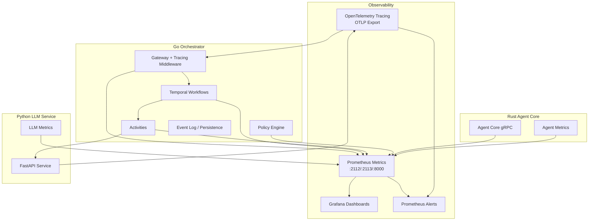
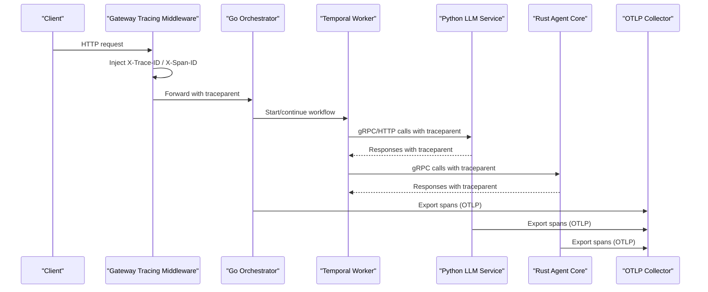
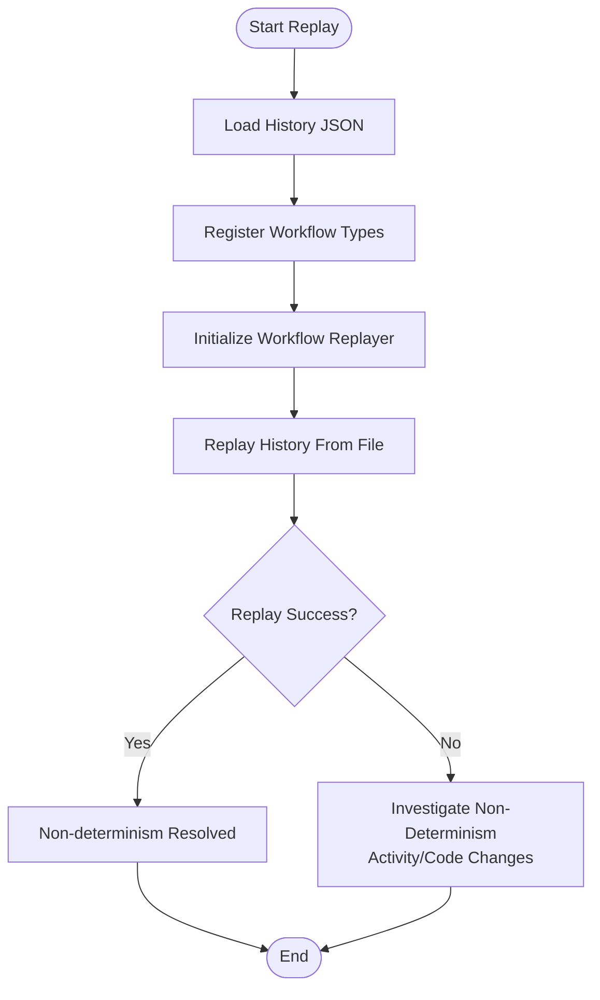
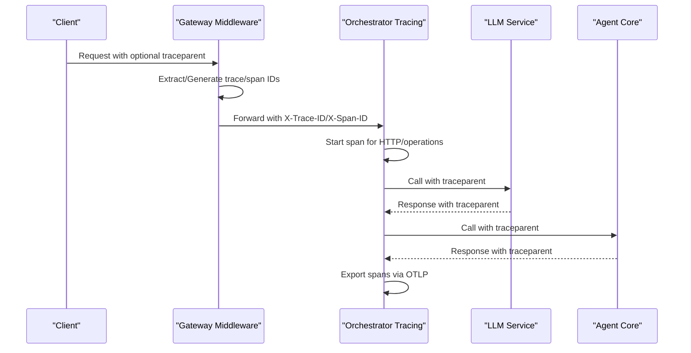
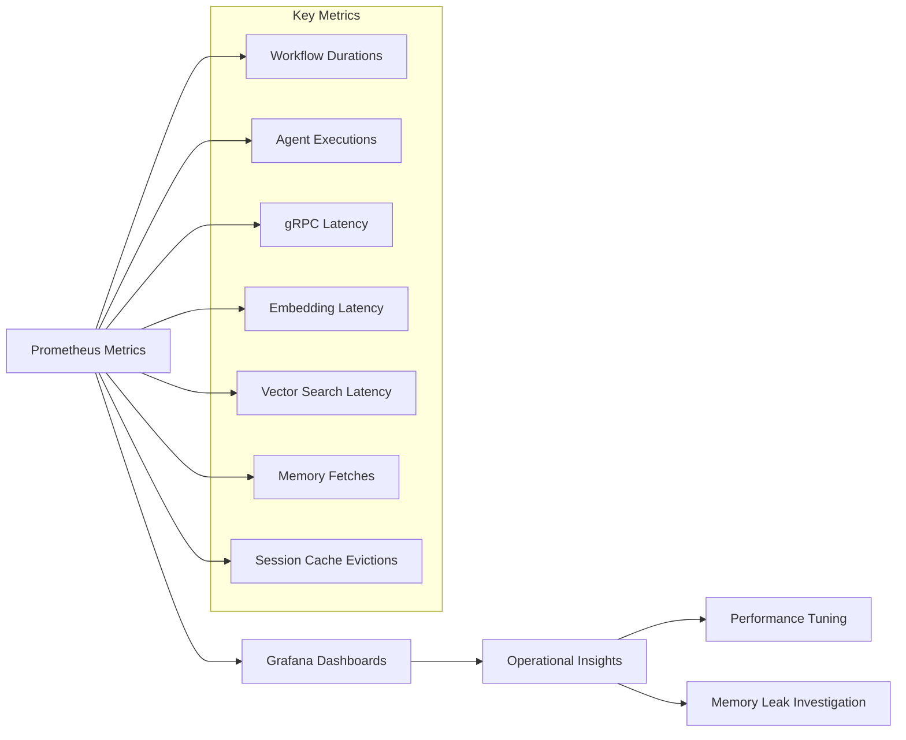
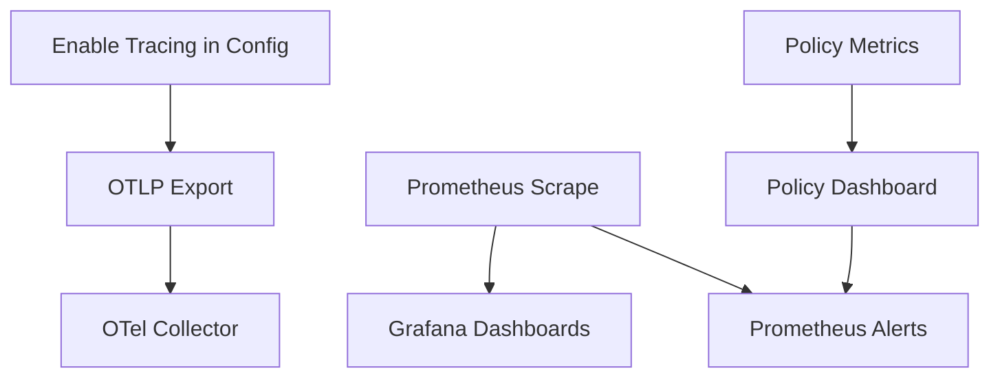
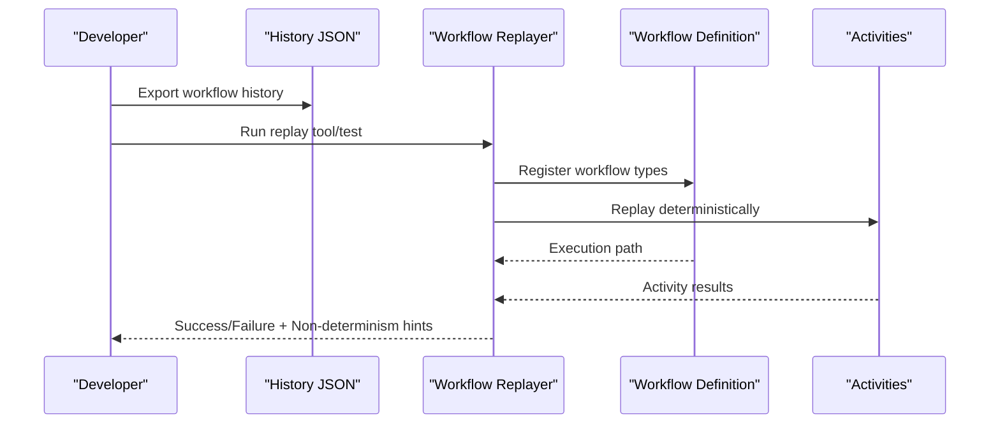
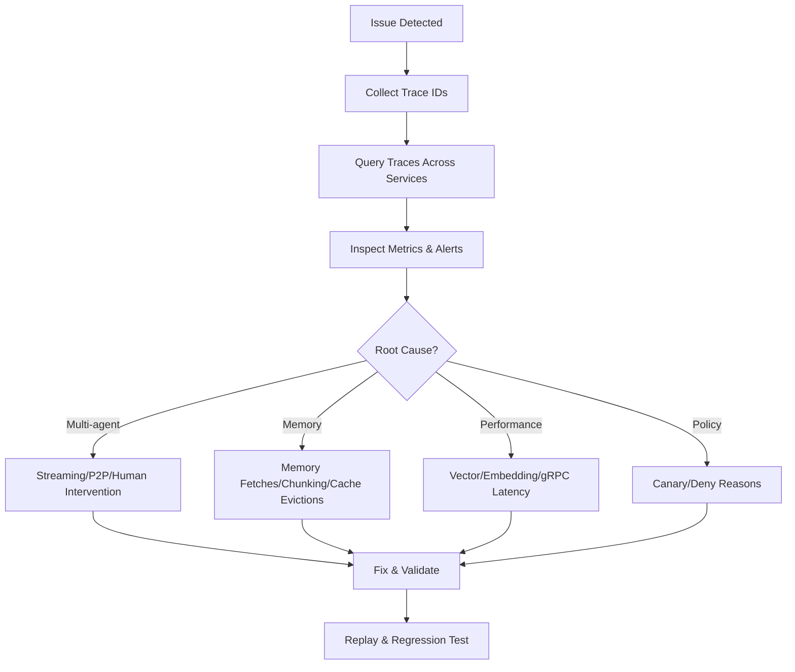
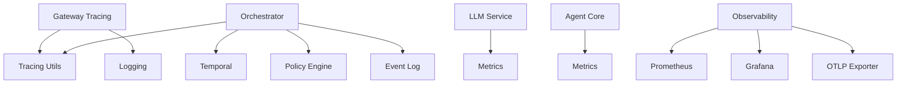

# Advanced Debugging and Analysis

<cite>
**Referenced Files in This Document**
- [README.md](file://README.md)
- [observability/README.md](file://observability/README.md)
- [observability/POLICY-METRICS.md](file://observability/POLICY-METRICS.md)
- [go/orchestrator/internal/tracing/tracing.go](file://go/orchestrator/internal/tracing/tracing.go)
- [go/orchestrator/cmd/gateway/internal/middleware/tracing.go](file://go/orchestrator/cmd/gateway/internal/middleware/tracing.go)
- [go/orchestrator/tools/replay/main.go](file://go/orchestrator/tools/replay/main.go)
- [go/orchestrator/tests/replay/workflow_replay_test.go](file://go/orchestrator/tests/replay/workflow_replay_test.go)
- [go/orchestrator/internal/metrics/metrics.go](file://go/orchestrator/internal/metrics/metrics.go)
- [go/orchestrator/internal/policy/metrics.go](file://go/orchestrator/internal/policy/metrics.go)
- [python/llm-service/llm_service/metrics.py](file://python/llm-service/llm_service/metrics.py)
- [rust/agent-core/src/metrics.rs](file://rust/agent-core/src/metrics.rs)
- [deploy/compose/docker-compose.yml](file://deploy/compose/docker-compose.yml)
- [deploy/compose/docker-compose.release.yml](file://deploy/compose/docker-compose.release.yml)
- [deploy/compose/grafana/docker-compose-grafana-prometheus.yml](file://deploy/compose/grafana/docker-compose-grafana-prometheus.yml)
- [observability/prometheus/prometheus.yml](file://observability/prometheus/prometheus.yml)
- [observability/prometheus/alerts.yml](file://observability/prometheus/alerts.yml)
- [observability/grafana/dashboards/policy.json](file://observability/grafana/dashboards/policy.json)
- [observability/grafana/dashboards/enforcement.json](file://observability/grafana/dashboards/enforcement.json)
- [scripts/replay_workflow.sh](file://scripts/replay_workflow.sh)
- [go/orchestrator/histories/README.md](file://go/orchestrator/histories/README.md)
- [go/orchestrator/internal/workflows/strategies/DAGWorkflow.go](file://go/orchestrator/internal/workflows/strategies/DAGWorkflow.go)
- [go/orchestrator/internal/workflows/strategies/ReactWorkflow.go](file://go/orchestrator/internal/workflows/strategies/ReactWorkflow.go)
- [go/orchestrator/internal/workflows/OrchestratorWorkflow.go](file://go/orchestrator/internal/workflows/OrchestratorWorkflow.go)
- [go/orchestrator/internal/workflows/SimpleTaskWorkflow.go](file://go/orchestrator/internal/workflows/SimpleTaskWorkflow.go)
- [go/orchestrator/internal/workflows/SupervisorWorkflow.go](file://go/orchestrator/internal/workflows/SupervisorWorkflow.go)
- [go/orchestrator/internal/workflows/StreamingWorkflow.go](file://go/orchestrator/internal/workflows/StreamingWorkflow.go)
- [go/orchestrator/internal/workflows/ParallelStreamingWorkflow.go](file://go/orchestrator/internal/workflows/ParallelStreamingWorkflow.go)
- [go/orchestrator/internal/workflows/AgentDAGWorkflow.go](file://go/orchestrator/internal/workflows/AgentDAGWorkflow.go)
- [go/orchestrator/internal/workflows/scheduled/ScheduledTaskWorkflow.go](file://go/orchestrator/internal/workflows/scheduled/ScheduledTaskWorkflow.go)
- [go/orchestrator/internal/temporal/adapter.go](file://go/orchestrator/internal/temporal/adapter.go)
- [go/orchestrator/internal/db/event_log.go](file://go/orchestrator/internal/db/event_log.go)
- [go/orchestrator/internal/httpapi/timeline.go](file://go/orchestrator/internal/httpapi/timeline.go)
- [go/orchestrator/internal/session/types.go](file://go/orchestrator/internal/session/types.go)
- [go/orchestrator/internal/state/types.go](file://go/orchestrator/internal/state/types.go)
- [go/orchestrator/internal/state/channels.go](file://go/orchestrator/internal/state/channels.go)
- [go/orchestrator/internal/interceptors/workflow_interceptor.go](file://go/orchestrator/internal/interceptors/workflow_interceptor.go)
- [go/orchestrator/internal/streaming/manager.go](file://go/orchestrator/internal/streaming/manager.go)
- [go/orchestrator/internal/session/manager.go](file://go/orchestrator/internal/session/manager.go)
- [go/orchestrator/internal/budget/manager.go](file://go/orchestrator/internal/budget/manager.go)
- [go/orchestrator/internal/policy/engine.go](file://go/orchestrator/internal/policy/engine.go)
- [go/orchestrator/internal/policy/config.go](file://go/orchestrator/internal/policy/config.go)
- [go/orchestrator/internal/health/manager.go](file://go/orchestrator/internal/health/manager.go)
- [go/orchestrator/internal/health/checkers.go](file://go/orchestrator/internal/health/checkers.go)
- [go/orchestrator/internal/health/http.go](file://go/orchestrator/internal/health/http.go)
- [go/orchestrator/internal/registry/registry.go](file://go/orchestrator/internal/registry/registry.go)
- [go/orchestrator/internal/registry/interfaces.go](file://go/orchestrator/internal/registry/interfaces.go)
- [go/orchestrator/internal/embeddings/service.go](file://go/orchestrator/internal/embeddings/service.go)
- [go/orchestrator/internal/vectordb/client.go](file://go/orchestrator/internal/vectordb/client.go)
- [go/orchestrator/internal/vector_search.go](file://go/orchestrator/internal/vector_search.go)
- [go/orchestrator/internal/memory/session_memory.go](file://go/orchestrator/internal/memory/session_memory.go)
- [go/orchestrator/internal/memory/semantic_memory.go](file://go/orchestrator/internal/memory/semantic_memory.go)
- [go/orchestrator/internal/memory/supervisor_memory.go](file://go/orchestrator/internal/memory/supervisor_memory.go)
- [go/orchestrator/internal/memory/consensus_memory.go](file://go/orchestrator/internal/memory/consensus_memory.go)
- [go/orchestrator/internal/memory/agent_memory.go](file://go/orchestrator/internal/memory/agent_memory.go)
- [go/orchestrator/internal/activities/analyze.go](file://go/orchestrator/internal/activities/analyze.go)
- [go/orchestrator/internal/activities/search_router.go](file://go/orchestrator/internal/activities/search_router.go)
- [go/orchestrator/internal/activities/synthesis.go](file://go/orchestrator/internal/activities/synthesis.go)
- [go/orchestrator/internal/activities/decompose.go](file://go/orchestrator/internal/activities/decompose.go)
- [go/orchestrator/internal/activities/research_refine.go](file://go/orchestrator/internal/activities/research_refine.go)
- [go/orchestrator/internal/activities/intermediate_synthesis.go](file://go/orchestrator/internal/activities/intermediate_synthesis.go)
- [go/orchestrator/internal/activities/localized_search.go](file://go/orchestrator/internal/activities/localized_search.go)
- [go/orchestrator/internal/activities/citation_agent.go](file://go/orchestrator/internal/activities/citation_agent.go)
- [go/orchestrator/internal/activities/streaming.go](file://go/orchestrator/internal/activities/streaming.go)
- [go/orchestrator/internal/activities/p2p.go](file://go/orchestrator/internal/activities/p2p.go)
- [go/orchestrator/internal/activities/human_intervention.go](file://go/orchestrator/internal/activities/human_intervention.go)
- [go/orchestrator/internal/activities/authorization.go](file://go/orchestrator/internal/activities/authorization.go)
- [go/orchestrator/internal/activities/budget.go](file://go/orchestrator/internal/activities/budget.go)
- [go/orchestrator/internal/activities/evaluate.go](file://go/orchestrator/internal/activities/evaluate.go)
- [go/orchestrator/internal/activities/verify.go](file://go/orchestrator/internal/activities/verify.go)
- [go/orchestrator/internal/activities/simple_task.go](file://go/orchestrator/internal/activities/simple_task.go)
- [go/orchestrator/internal/activities/session.go](file://go/orchestrator/internal/activities/session.go)
- [go/orchestrator/internal/activities/session_title.go](file://go/orchestrator/internal/activities/session_title.go)
- [go/orchestrator/internal/activities/record_query.go](file://go/orchestrator/internal/activities/record_query.go)
- [go/orchestrator/internal/activities/compression_activities.go](file://go/orchestrator/internal/activities/compression_activities.go)
- [go/orchestrator/internal/activities/coverage_evaluator.go](file://go/orchestrator/internal/activities/coverage_evaluator.go)
- [go/orchestrator/internal/activities/schedule_activities.go](file://go/orchestrator/internal/activities/schedule_activities.go)
- [go/orchestrator/internal/activities/streams/events.go](file://go/orchestrator/internal/activities/streams/events.go)
- [go/orchestrator/internal/activities/streams/messages.go](file://go/orchestrator/internal/activities/streams/messages.go)
- [go/orchestrator/internal/activities/streams/streaming.go](file://go/orchestrator/internal/activities/streams/streaming.go)
- [go/orchestrator/internal/activities/streams/manager.go](file://go/orchestrator/internal/activities/streams/manager.go)
- [go/orchestrator/internal/activities/streams/interceptors.go](file://go/orchestrator/internal/activities/streams/interceptors.go)
- [go/orchestrator/internal/activities/streams/transformers.go](file://go/orchestrator/internal/activities/streams/transformers.go)
- [go/orchestrator/internal/activities/streams/validators.go](file://go/orchestrator/internal/activities/streams/validators.go)
- [go/orchestrator/internal/activities/streams/processors.go](file://go/orchestrator/internal/activities/streams/processors.go)
- [go/orchestrator/internal/activities/streams/encoders.go](file://go/orchestrator/internal/activities/streams/encoders.go)
- [go/orchestrator/internal/activities/streams/decoders.go](file://go/orchestrator/internal/activities/streams/decoders.go)
- [go/orchestrator/internal/activities/streams/serializers.go](file://go/orchestrator/internal/activities/streams/serializers.go)
- [go/orchestrator/internal/activities/streams/deserializers.go](file://go/orchestrator/internal/activities/streams/deserializers.go)
- [go/orchestrator/internal/activities/streams/formatters.go](file://go/orchestrator/internal/activities/streams/formatters.go)
- [go/orchestrator/internal/activities/streams/normalizers.go](file://go/orchestrator/internal/activities/streams/normalizers.go)
- [go/orchestrator/internal/activities/streams/validators.go](file://go/orchestrator/internal/activities/streams/validators.go)
- [go/orchestrator/internal/activities/streams/processors.go](file://go/orchestrator/internal/activities/streams/processors.go)
- [go/orchestrator/internal/activities/streams/encoders.go](file://go/orchestrator/internal/activities/streams/encoders.go)
- [go/orchestrator/internal/activities/streams/decoders.go](file://go/orchestrator/internal/activities/streams/decoders.go)
- [go/orchestrator/internal/activities/streams/serializers.go](file://go/orchestrator/internal/activities/streams/serializers.go)
- [go/orchestrator/internal/activities/streams/deserializers.go](file://go/orchestrator/internal/activities/streams/deserializers.go)
- [go/orchestrator/internal/activities/streams/formatters.go](file://go/orchestrator/internal/activities/streams/formatters.go)
- [go/orchestrator/internal/activities/streams/normalizers.go](file://go/orchestrator/internal/activities/streams/normalizers.go)
- [go/orchestrator/internal/activities/streams/validators.go](file://go/orchestrator/internal/activities/streams/validators.go)
- [go/orchestrator/internal/activities/streams/processors.go](file://go/orchestrator/internal/activities/streams/processors.go)
- [go/orchestrator/internal/activities/streams/encoders.go](file://go/orchestrator/internal/activities/streams/encoders.go)
- [go/orchestrator/internal/activities/streams/decoders.go](file://go/orchestrator/internal/activities/streams/decoders.go)
- [go/orchestrator/internal/activities/streams/serializers.go](file://go/orchestrator/internal/activities/streams/serializers.go)
- [go/orchestrator/internal/activities/streams/deserializers.go](file://go/orchestrator/internal/activities/streams/deserializers.go)
- [go/orchestrator/internal/activities/streams/formatters.go](file://go/orchestrator/internal/activities/streams/formatters.go)
- [go/orchestrator/internal/activities/streams/normalizers.go](file://go/orchestrator/internal/activities/streams/normalizers.go)
- [go/orchestrator/internal/activities/streams/validators.go](file://go/orchestrator/internal/activities/streams/validators.go)
- [go/orchestrator/internal/activities/streams/processors.go](file://go/orchestrator/internal/activities/streams/processors.go)
- [go/orchestrator/internal/activities/streams/encoders.go](file://go/orchestrator/internal/activities/streams/encoders.go)
- [go/orchestrator/internal/activities/streams/decoders.go](file://go/orchestrator/internal/activities/streams/decoders.go)
- [go/orchestrator/internal/activities/streams/serializers.go](file://go/orchestrator/internal/activities/streams/serializers.go)
- [go/orchestrator/internal/activities/streams/deserializers.go](file://go/orchestrator/internal/activities/streams/deserializers.go)
- [go/orchestrator/internal/activities/streams/formatters.go](file://go/orchestrator/internal/activities/streams/formatters.go)
- [go/orchestrator/internal/activities/streams/normalizers.go](file://go/orchestrator/internal/activities/streams/normalizers.go)
- [go/orchestrator/internal/activities/streams/validators.go](file://go/orchestrator/internal/activities/streams/validators.go)
- [go/orchestrator/internal/activities/streams/processors.go](file://go/orchestrator/internal/activities/streams/processors.go)
- [go/orchestrator/internal/activities/streams/encoders.go](file://go/orchestrator/internal/activities/streams/encoders.go)
- [go/orchestrator/internal/activities/streams/decoders.go](file://go/orchestrator/internal/activities/streams/decoders.go)
- [go/orchestrator/internal/activities/streams/serializers.go](file://go/orchestrator/internal/activities/streams/serializers.go)
- [go/orchestrator/internal/activities/streams/deserializers.go](file://go/orchestrator/internal/activities/streams/deserializers.go)
- [go/orchestrator/internal/activities/streams/formatters.go](file://go/orchestrator/internal/activities/streams/formatters.go)
- [go/orchestrator/internal/activities/streams/normalizers.go](file://go/orchestrator/internal/activities/streams/normalizers.go)
- [go/orchestrator/internal/activities/streams/validators.go](file://go/orchestrator/internal/activities/streams/validators.go)
- [go/orchestrator/internal/activities/streams/processors.go](file://go/orchestrator/internal/activities/streams/processors.go)
- [go/orchestrator/internal/activities/streams/encoders.go](file://go/orchestrator/internal/activities/streams/encoders.go)
- [go/orchestrator/internal/activities/streams/decoders.go](file://go/orchestrator/internal/activities/streams/decoders.go)
- [go/orchestrator/internal/activities/streams/serializers.go](file://go/orchestrator/internal/activities/streams/serializers.go)
- [go/orchestrator/internal/activities/streams/deserializers.go](file://go/orchestrator/internal/activities/streams/deserializers.go)
- [go/orchestrator/internal/activities/streams/formatters.go](file://go/orchestrator/internal/activities/streams/formatters.go)
- [go/orchestrator/internal/activities/streams/normalizers.go](file://go/orchestrator/internal/activities/streams/normalizers.go)
- [go/orchestrator/internal/activities/streams/validators.go](file://go/orchestrator/internal/activities/streams/validators.go)
- [go/orchestrator/internal/activities/streams/processors.go](file://go/orchestrator/internal/activities/streams/processors.go)
- [go/orchestrator/internal/activities/streams/encoders.go](file://go/orchestrator/internal/activities/streams/encoders.go)
- [go/orchestrator/internal/activities/streams/decoders.go](file://go/orchestrator/internal/activities/streams/decoders.go)
-......
</cite>

## Table of Contents
1. [Introduction](#introduction)
2. [Project Structure](#project-structure)
3. [Core Components](#core-components)
4. [Architecture Overview](#architecture-overview)
5. [Detailed Component Analysis](#detailed-component-analysis)
6. [Dependency Analysis](#dependency-analysis)
7. [Performance Considerations](#performance-considerations)
8. [Troubleshooting Guide](#troubleshooting-guide)
9. [Conclusion](#conclusion)
10. [Appendices](#appendices)

## Introduction
This document provides advanced debugging and analysis guidance for Shannon’s complex multi-agent system. It covers time-travel replay analysis, distributed tracing and performance profiling, observability and alerting, workflow debugging, and production-safe troubleshooting practices. The goal is to enable precise failure investigation, minimal-impact diagnostics, and robust operational visibility across the Go orchestrator, Python LLM service, Rust agent core, and supporting infrastructure.

## Project Structure
Shannon comprises:
- Go-based orchestrator with Temporal workflows, tracing, metrics, and policy enforcement
- Python LLM service with Prometheus metrics and OpenTelemetry instrumentation
- Rust agent core with Prometheus metrics and enforcement
- Observability stack with Grafana dashboards, Prometheus alerts, and OTLP tracing
- Scripts and tools for replay, health checks, and deployments

**Diagram sources**
- [observability/README.md](file://observability/README.md#L1-L73)
- [go/orchestrator/internal/tracing/tracing.go](file://go/orchestrator/internal/tracing/tracing.go#L1-L148)
- [go/orchestrator/cmd/gateway/internal/middleware/tracing.go](file://go/orchestrator/cmd/gateway/internal/middleware/tracing.go#L1-L100)
- [python/llm-service/llm_service/metrics.py](file://python/llm-service/llm_service/metrics.py#L1-L161)
- [rust/agent-core/src/metrics.rs](file://rust/agent-core/src/metrics.rs#L1-L304)
- [go/orchestrator/internal/policy/metrics.go](file://go/orchestrator/internal/policy/metrics.go#L1-L232)
- [go/orchestrator/internal/metrics/metrics.go](file://go/orchestrator/internal/metrics/metrics.go#L1-L630)

**Section sources**
- [README.md](file://README.md#L1-L200)
- [observability/README.md](file://observability/README.md#L1-L73)

## Core Components
- Distributed tracing with W3C traceparent propagation and OTLP export
- Prometheus metrics across services and subsystems
- Temporal-based workflows with deterministic replay tooling
- Policy engine with canary deployment and SLO tracking
- Streaming and session management with event timelines
- Health checks and degradation strategies

**Section sources**
- [go/orchestrator/internal/tracing/tracing.go](file://go/orchestrator/internal/tracing/tracing.go#L1-L148)
- [go/orchestrator/cmd/gateway/internal/middleware/tracing.go](file://go/orchestrator/cmd/gateway/internal/middleware/tracing.go#L1-L100)
- [go/orchestrator/internal/metrics/metrics.go](file://go/orchestrator/internal/metrics/metrics.go#L1-L630)
- [go/orchestrator/internal/policy/metrics.go](file://go/orchestrator/internal/policy/metrics.go#L1-L232)
- [python/llm-service/llm_service/metrics.py](file://python/llm-service/llm_service/metrics.py#L1-L161)
- [rust/agent-core/src/metrics.rs](file://rust/agent-core/src/metrics.rs#L1-L304)

## Architecture Overview
The system integrates:
- Gateway and HTTP middleware for request tracing and correlation
- Temporal workflows orchestrating multi-agent tasks with deterministic replay
- Policy engine enforcing runtime decisions with canary and SLO metrics
- LLM service and agent core emitting structured metrics
- Observability stack for visualization and alerting

**Diagram sources**
- [go/orchestrator/cmd/gateway/internal/middleware/tracing.go](file://go/orchestrator/cmd/gateway/internal/middleware/tracing.go#L1-L100)
- [go/orchestrator/internal/tracing/tracing.go](file://go/orchestrator/internal/tracing/tracing.go#L1-L148)
- [python/llm-service/llm_service/metrics.py](file://python/llm-service/llm_service/metrics.py#L1-L161)
- [rust/agent-core/src/metrics.rs](file://rust/agent-core/src/metrics.rs#L1-L304)

## Detailed Component Analysis

### Time-Travel Replay Analysis
Shannon supports deterministic replay of Temporal workflow histories to investigate non-determinism and reconstruct execution timelines.

- Replay tooling registers all workflow variants and replays from JSON history files
- Tests validate replay determinism for DAG and React strategies
- Use scripts to export histories and replay locally for failure investigation

**Diagram sources**
- [go/orchestrator/tools/replay/main.go](file://go/orchestrator/tools/replay/main.go#L1-L49)
- [go/orchestrator/tests/replay/workflow_replay_test.go](file://go/orchestrator/tests/replay/workflow_replay_test.go#L1-L98)

**Section sources**
- [go/orchestrator/tools/replay/main.go](file://go/orchestrator/tools/replay/main.go#L1-L49)
- [go/orchestrator/tests/replay/workflow_replay_test.go](file://go/orchestrator/tests/replay/workflow_replay_test.go#L1-L98)
- [scripts/replay_workflow.sh](file://scripts/replay_workflow.sh#L1-L200)
- [go/orchestrator/histories/README.md](file://go/orchestrator/histories/README.md#L1-L200)

### Distributed Tracing Analysis
Shannon implements minimal OpenTelemetry tracing with W3C traceparent propagation across services.

- Tracing initialization with OTLP exporter and resource attributes
- Span creation helpers for HTTP and custom operations
- Gateway middleware injects X-Trace-ID and X-Span-ID for correlation
- Validate trace propagation across orchestrator, LLM service, and agent core

**Diagram sources**
- [go/orchestrator/internal/tracing/tracing.go](file://go/orchestrator/internal/tracing/tracing.go#L1-L148)
- [go/orchestrator/cmd/gateway/internal/middleware/tracing.go](file://go/orchestrator/cmd/gateway/internal/middleware/tracing.go#L1-L100)
- [observability/README.md](file://observability/README.md#L1-L73)

**Section sources**
- [go/orchestrator/internal/tracing/tracing.go](file://go/orchestrator/internal/tracing/tracing.go#L1-L148)
- [go/orchestrator/cmd/gateway/internal/middleware/tracing.go](file://go/orchestrator/cmd/gateway/internal/middleware/tracing.go#L1-L100)
- [observability/README.md](file://observability/README.md#L1-L73)

### Performance Profiling and Memory Leak Detection
- Prometheus metrics expose durations, counts, and histograms for workflows, agents, gRPC, embeddings, vector search, and more
- Use Grafana dashboards to correlate latency, throughput, and error rates
- For memory leaks:
  - Monitor agent core memory pool gauges and tool execution durations
  - Track session cache metrics to detect eviction spikes
  - Correlate memory fetches and retrieval token budgets with latency

**Diagram sources**
- [go/orchestrator/internal/metrics/metrics.go](file://go/orchestrator/internal/metrics/metrics.go#L1-L630)
- [rust/agent-core/src/metrics.rs](file://rust/agent-core/src/metrics.rs#L1-L304)
- [python/llm-service/llm_service/metrics.py](file://python/llm-service/llm_service/metrics.py#L1-L161)

**Section sources**
- [go/orchestrator/internal/metrics/metrics.go](file://go/orchestrator/internal/metrics/metrics.go#L1-L630)
- [rust/agent-core/src/metrics.rs](file://rust/agent-core/src/metrics.rs#L1-L304)
- [python/llm-service/llm_service/metrics.py](file://python/llm-service/llm_service/metrics.py#L1-L161)

### System Monitoring and Observability
- Enable tracing in configuration and validate headers and spans
- Expose Prometheus metrics endpoints per service
- Configure Grafana dashboards and Prometheus alert rules
- Use policy-specific dashboards for canary and SLO tracking

**Diagram sources**
- [observability/README.md](file://observability/README.md#L1-L73)
- [observability/POLICY-METRICS.md](file://observability/POLICY-METRICS.md#L1-L203)
- [observability/prometheus/prometheus.yml](file://observability/prometheus/prometheus.yml#L1-L200)
- [observability/prometheus/alerts.yml](file://observability/prometheus/alerts.yml#L1-L200)
- [observability/grafana/dashboards/policy.json](file://observability/grafana/dashboards/policy.json#L1-L200)
- [observability/grafana/dashboards/enforcement.json](file://observability/grafana/dashboards/enforcement.json#L1-L200)

**Section sources**
- [observability/README.md](file://observability/README.md#L1-L73)
- [observability/POLICY-METRICS.md](file://observability/POLICY-METRICS.md#L1-L203)
- [observability/prometheus/prometheus.yml](file://observability/prometheus/prometheus.yml#L1-L200)
- [observability/prometheus/alerts.yml](file://observability/prometheus/alerts.yml#L1-L200)

### Workflow Debugging: Temporal, State Machines, and Execution Paths
- Temporal workflows and activities are instrumented with metrics and tracing
- Use replay to validate determinism and reconstruct execution paths
- Inspect event timelines and session continuity for temporal debugging
- Workflow interceptor and streaming managers provide additional debugging hooks

**Diagram sources**
- [go/orchestrator/tools/replay/main.go](file://go/orchestrator/tools/replay/main.go#L1-L49)
- [go/orchestrator/tests/replay/workflow_replay_test.go](file://go/orchestrator/tests/replay/workflow_replay_test.go#L1-L98)
- [go/orchestrator/internal/workflows/strategies/DAGWorkflow.go](file://go/orchestrator/internal/workflows/strategies/DAGWorkflow.go#L1-L200)
- [go/orchestrator/internal/workflows/strategies/ReactWorkflow.go](file://go/orchestrator/internal/workflows/strategies/ReactWorkflow.go#L1-L200)
- [go/orchestrator/internal/interceptors/workflow_interceptor.go](file://go/orchestrator/internal/interceptors/workflow_interceptor.go#L1-L200)

**Section sources**
- [go/orchestrator/tools/replay/main.go](file://go/orchestrator/tools/replay/main.go#L1-L49)
- [go/orchestrator/tests/replay/workflow_replay_test.go](file://go/orchestrator/tests/replay/workflow_replay_test.go#L1-L98)
- [go/orchestrator/internal/httpapi/timeline.go](file://go/orchestrator/internal/httpapi/timeline.go#L1-L200)
- [go/orchestrator/internal/session/types.go](file://go/orchestrator/internal/session/types.go#L1-L200)
- [go/orchestrator/internal/state/types.go](file://go/orchestrator/internal/state/types.go#L1-L200)
- [go/orchestrator/internal/state/channels.go](file://go/orchestrator/internal/state/channels.go#L1-L200)

### Advanced Troubleshooting Procedures
- Multi-agent interactions: inspect streaming managers, P2P coordination, and human intervention flows
- Memory management: monitor memory fetches, chunking metrics, and session cache evictions
- Performance bottlenecks: correlate vector search latency, embedding latency, and gRPC durations
- Policy issues: use canary metrics and deny reason tracking to isolate regressions

**Diagram sources**
- [go/orchestrator/internal/metrics/metrics.go](file://go/orchestrator/internal/metrics/metrics.go#L1-L630)
- [go/orchestrator/internal/policy/metrics.go](file://go/orchestrator/internal/policy/metrics.go#L1-L232)
- [go/orchestrator/internal/activities/p2p.go](file://go/orchestrator/internal/activities/p2p.go#L1-L200)
- [go/orchestrator/internal/activities/human_intervention.go](file://go/orchestrator/internal/activities/human_intervention.go#L1-L200)
- [go/orchestrator/internal/streaming/manager.go](file://go/orchestrator/internal/streaming/manager.go#L1-L200)

**Section sources**
- [go/orchestrator/internal/activities/p2p.go](file://go/orchestrator/internal/activities/p2p.go#L1-L200)
- [go/orchestrator/internal/activities/human_intervention.go](file://go/orchestrator/internal/activities/human_intervention.go#L1-L200)
- [go/orchestrator/internal/streaming/manager.go](file://go/orchestrator/internal/streaming/manager.go#L1-L200)
- [go/orchestrator/internal/metrics/metrics.go](file://go/orchestrator/internal/metrics/metrics.go#L1-L630)
- [go/orchestrator/internal/policy/metrics.go](file://go/orchestrator/internal/policy/metrics.go#L1-L232)

## Dependency Analysis
The system exhibits layered dependencies:
- Gateway depends on tracing utilities and logging
- Orchestrator depends on Temporal, policy engine, and persistence
- LLM service and agent core export metrics consumed by Prometheus/Grafana
- Observability stack depends on exporters and configuration

**Diagram sources**
- [go/orchestrator/cmd/gateway/internal/middleware/tracing.go](file://go/orchestrator/cmd/gateway/internal/middleware/tracing.go#L1-L100)
- [go/orchestrator/internal/tracing/tracing.go](file://go/orchestrator/internal/tracing/tracing.go#L1-L148)
- [go/orchestrator/internal/policy/engine.go](file://go/orchestrator/internal/policy/engine.go#L1-L200)
- [python/llm-service/llm_service/metrics.py](file://python/llm-service/llm_service/metrics.py#L1-L161)
- [rust/agent-core/src/metrics.rs](file://rust/agent-core/src/metrics.rs#L1-L304)

**Section sources**
- [go/orchestrator/internal/tracing/tracing.go](file://go/orchestrator/internal/tracing/tracing.go#L1-L148)
- [go/orchestrator/cmd/gateway/internal/middleware/tracing.go](file://go/orchestrator/cmd/gateway/internal/middleware/tracing.go#L1-L100)
- [go/orchestrator/internal/policy/engine.go](file://go/orchestrator/internal/policy/engine.go#L1-L200)
- [python/llm-service/llm_service/metrics.py](file://python/llm-service/llm_service/metrics.py#L1-L161)
- [rust/agent-core/src/metrics.rs](file://rust/agent-core/src/metrics.rs#L1-L304)

## Performance Considerations
- Use histograms and counters to track latency hotspots (vector search, embeddings, gRPC)
- Monitor cache hit rates and tune TTL/cardinality for policy and session caches
- Leverage canary metrics to validate performance before full rollout
- Apply rate control and backpressure mechanisms to prevent overload

[No sources needed since this section provides general guidance]

## Troubleshooting Guide
- Tracing validation: confirm W3C headers and span propagation across services
- Metrics verification: ensure scraping endpoints and label cardinality are sane
- Replay validation: reproduce failures deterministically and fix non-determinism
- Policy rollback: use kill switch and gradual rollback procedures
- Health checks: monitor service health endpoints and degradation modes

**Section sources**
- [observability/README.md](file://observability/README.md#L1-L73)
- [observability/POLICY-METRICS.md](file://observability/POLICY-METRICS.md#L1-L203)
- [go/orchestrator/internal/health/manager.go](file://go/orchestrator/internal/health/manager.go#L1-L200)
- [go/orchestrator/internal/health/checkers.go](file://go/orchestrator/internal/health/checkers.go#L1-L200)
- [go/orchestrator/internal/health/http.go](file://go/orchestrator/internal/health/http.go#L1-L200)

## Conclusion
Shannon’s observability stack, deterministic replay, and comprehensive metrics enable deep, production-safe debugging. By correlating traces, metrics, and replay histories, teams can systematically investigate failures, optimize performance, and maintain stability under complex multi-agent workloads.

[No sources needed since this section summarizes without analyzing specific files]

## Appendices
- Deployment and compose configurations for observability stacks
- Example scripts for exporting histories and running replays
- Additional workflow and activity modules for targeted debugging

**Section sources**
- [deploy/compose/docker-compose.yml](file://deploy/compose/docker-compose.yml#L1-L200)
- [deploy/compose/docker-compose.release.yml](file://deploy/compose/docker-compose.release.yml#L1-L200)
- [deploy/compose/grafana/docker-compose-grafana-prometheus.yml](file://deploy/compose/grafana/docker-compose-grafana-prometheus.yml#L1-L200)
- [scripts/replay_workflow.sh](file://scripts/replay_workflow.sh#L1-L200)