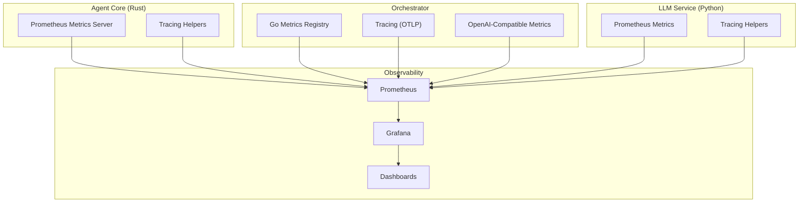
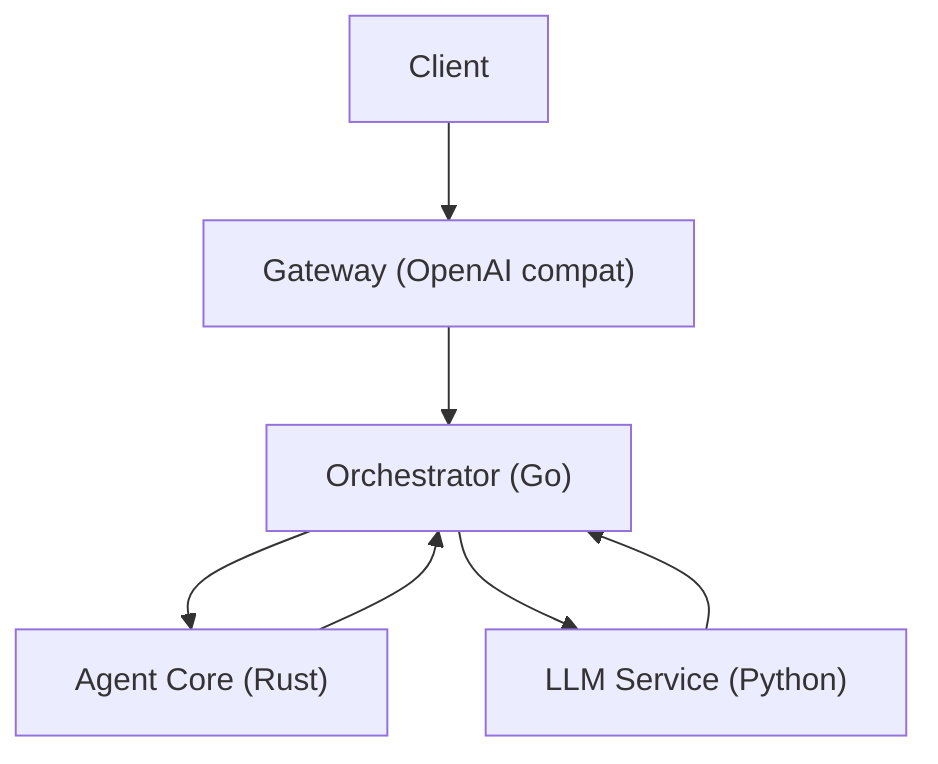
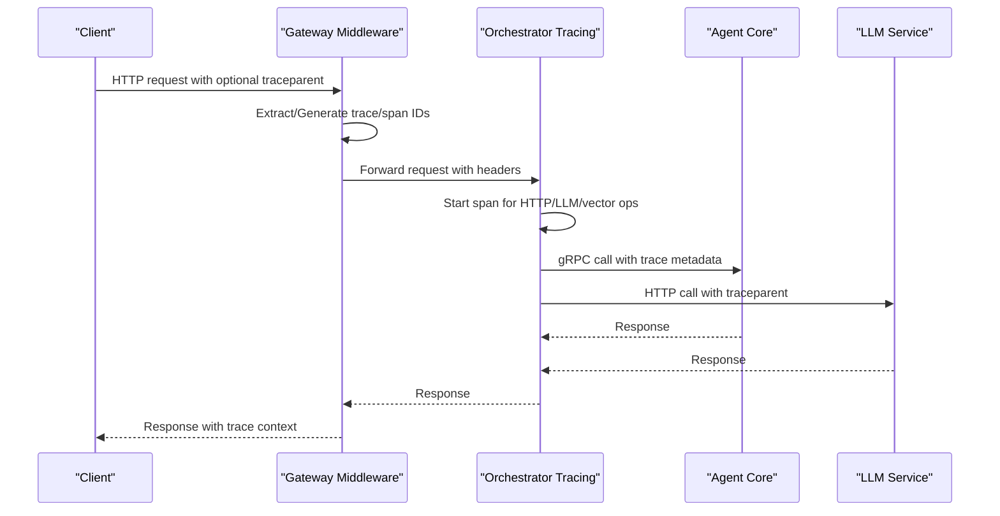
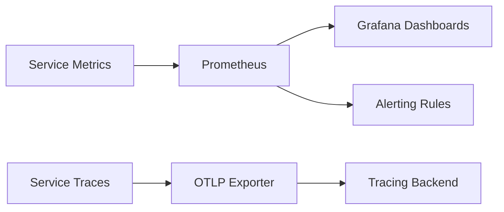

# Performance Profiling and Analysis

<cite>
**Referenced Files in This Document**
- [observability/README.md](file://observability/README.md)
- [observability/POLICY-METRICS.md](file://observability/POLICY-METRICS.md)
- [go/orchestrator/internal/metrics/metrics.go](file://go/orchestrator/internal/metrics/metrics.go)
- [go/orchestrator/cmd/gateway/internal/openai/metrics.go](file://go/orchestrator/cmd/gateway/internal/openai/metrics.go)
- [go/orchestrator/internal/policy/metrics.go](file://go/orchestrator/internal/policy/metrics.go)
- [go/orchestrator/internal/tracing/tracing.go](file://go/orchestrator/internal/tracing/tracing.go)
- [go/orchestrator/cmd/gateway/internal/middleware/tracing.go](file://go/orchestrator/cmd/gateway/internal/middleware/tracing.go)
- [rust/agent-core/src/metrics.rs](file://rust/agent-core/src/metrics.rs)
- [python/llm-service/llm_service/metrics.py](file://python/llm-service/llm_service/metrics.py)
- [deploy/compose/grafana/docker-compose-grafana-prometheus.yml](file://deploy/compose/grafana/docker-compose-grafana-prometheus.yml)
- [observability/grafana/dashboards/enforcement.json](file://observability/grafana/dashboards/enforcement.json)
</cite>

## Table of Contents
1. [Introduction](#introduction)
2. [Project Structure](#project-structure)
3. [Core Components](#core-components)
4. [Architecture Overview](#architecture-overview)
5. [Detailed Component Analysis](#detailed-component-analysis)
6. [Dependency Analysis](#dependency-analysis)
7. [Performance Considerations](#performance-considerations)
8. [Troubleshooting Guide](#troubleshooting-guide)
9. [Conclusion](#conclusion)
10. [Appendices](#appendices)

## Introduction
This document provides comprehensive performance profiling and analysis guidance for Shannon’s distributed system. It covers built-in metrics, distributed tracing, and observability tooling across the orchestrator, agent core, and LLM services. It explains how to identify bottlenecks, profile memory/CPU/network, and apply optimization strategies for multi-agent workflows, streaming, and memory-intensive operations. It also outlines performance testing and benchmarking practices suitable for production environments.

## Project Structure
Shannon’s performance monitoring stack is composed of:
- Prometheus endpoints exposed by each service
- Grafana dashboards for visualization
- OpenTelemetry tracing with W3C traceparent propagation
- Component-specific metrics registries and histograms

**Diagram sources**
- [observability/README.md](file://observability/README.md#L44-L73)
- [go/orchestrator/internal/metrics/metrics.go](file://go/orchestrator/internal/metrics/metrics.go#L1-L630)
- [go/orchestrator/cmd/gateway/internal/openai/metrics.go](file://go/orchestrator/cmd/gateway/internal/openai/metrics.go#L1-L234)
- [go/orchestrator/internal/policy/metrics.go](file://go/orchestrator/internal/policy/metrics.go#L1-L232)
- [go/orchestrator/internal/tracing/tracing.go](file://go/orchestrator/internal/tracing/tracing.go#L1-L148)
- [go/orchestrator/cmd/gateway/internal/middleware/tracing.go](file://go/orchestrator/cmd/gateway/internal/middleware/tracing.go#L1-L100)
- [rust/agent-core/src/metrics.rs](file://rust/agent-core/src/metrics.rs#L1-L304)
- [python/llm-service/llm_service/metrics.py](file://python/llm-service/llm_service/metrics.py#L1-L161)

**Section sources**
- [observability/README.md](file://observability/README.md#L1-L73)
- [deploy/compose/grafana/docker-compose-grafana-prometheus.yml](file://deploy/compose/grafana/docker-compose-grafana-prometheus.yml#L1-L86)

## Core Components
- Prometheus metrics endpoints:
  - Orchestrator: :2112/metrics
  - Agent Core: :2113/metrics
  - LLM Service: :8000/metrics
- Distributed tracing:
  - Minimal OpenTelemetry with W3C traceparent propagation
  - OTLP export to configurable endpoint
- Grafana dashboards:
  - Enforcement gateway
  - Policy engine SLOs and canary metrics
  - Node exporter for host-level metrics

Practical usage:
- Enable tracing in configuration and validate headers propagate across services
- Scrape metrics endpoints and import dashboards via Grafana API or provisioning
- Use SLO-focused queries to detect regressions and hotspots

**Section sources**
- [observability/README.md](file://observability/README.md#L44-L73)
- [observability/POLICY-METRICS.md](file://observability/POLICY-METRICS.md#L1-L203)
- [observability/grafana/dashboards/enforcement.json](file://observability/grafana/dashboards/enforcement.json#L1-L55)

## Architecture Overview
The system instruments three primary layers with metrics and tracing:
- Orchestrator (Go): workflow, task, agent, memory, gRPC, vector DB, embedding, and policy metrics; OpenAI-compatible API metrics; tracing with OTLP
- Agent Core (Rust): task execution, FSM, tool execution, memory pool, enforcement metrics; embedded metrics HTTP server
- LLM Service (Python): LLM requests, tokens, costs, MCP, planner fallbacks; active connections; tracing helpers

**Diagram sources**
- [go/orchestrator/internal/tracing/tracing.go](file://go/orchestrator/internal/tracing/tracing.go#L1-L148)
- [go/orchestrator/cmd/gateway/internal/middleware/tracing.go](file://go/orchestrator/cmd/gateway/internal/middleware/tracing.go#L1-L100)
- [rust/agent-core/src/metrics.rs](file://rust/agent-core/src/metrics.rs#L1-L304)
- [python/llm-service/llm_service/metrics.py](file://python/llm-service/llm_service/metrics.py#L1-L161)

## Detailed Component Analysis

### Orchestrator Metrics (Go)
Key categories:
- Workflows: started/completed, duration, tokens, cost
- Tasks: submission counts, token usage, cost
- Agents: executions, durations
- Sessions: created, active, tokens
- Memory: fetches, items retrieved, hit rate computation
- gRPC: requests, latency
- Vector DB: searches, latency
- Embeddings: requests, latency
- Decomposition, refinement, learning router, chunking, complexity
- Model tier/provider selection drift
- OpenAI-compatible API: requests, latency, tokens, errors, rate limits, sessions, streaming, time-to-first-token

Profiling techniques:
- Use histograms to compute p50/p95 latencies for critical paths (vector search, embedding, agent execution)
- Track token budgets and compression ratios to identify memory pressure
- Correlate gRPC latency by service/method to locate upstream bottlenecks
- Monitor session cache hits/misses and evictions to tune cache sizing

Optimization strategies:
- Tune provider/model tiers to reduce drift and improve cost/performance balance
- Adjust rate-limit delays and backoff to smooth bursty workloads
- Optimize memory fetch strategies and chunk sizes to improve retrieval throughput

**Section sources**
- [go/orchestrator/internal/metrics/metrics.go](file://go/orchestrator/internal/metrics/metrics.go#L1-L630)

### OpenAI-Compatible API Metrics (Go)
Focus areas:
- Request volume, latency, token usage per model and endpoint
- Error types and codes
- Rate limit hits
- Active sessions, collisions
- Streaming metrics: chunks, duration, errors, time-to-first-token

Profiling techniques:
- Monitor streaming latency and time-to-first-token to detect network or backend stalls
- Track rate-limit hits to identify throttling hotspots
- Correlate token usage with cost histograms to spot oversized prompts

Optimization strategies:
- Implement adaptive batching and backpressure for endpoints exceeding thresholds
- Tune streaming chunk sizes to balance latency and throughput

**Section sources**
- [go/orchestrator/cmd/gateway/internal/openai/metrics.go](file://go/orchestrator/cmd/gateway/internal/openai/metrics.go#L1-L234)

### Policy Engine Metrics (Go)
Focus areas:
- Evaluation counts, duration, error rates
- Cache hits/misses and size
- Canary routing decisions and mode comparisons
- Denial reasons (hashed to control cardinality)
- SLO latency and error rate tracking

Profiling techniques:
- Use latency histograms and cache hit ratios to assess policy engine performance
- Compare dry-run vs enforce decisions to anticipate impact before full rollout
- Monitor top denial reasons for anomaly detection

Optimization strategies:
- Reduce policy complexity and leverage caching for repeated inputs
- Use canary rollouts with SLO-based gating

**Section sources**
- [go/orchestrator/internal/policy/metrics.go](file://go/orchestrator/internal/policy/metrics.go#L1-L232)
- [observability/POLICY-METRICS.md](file://observability/POLICY-METRICS.md#L1-L203)

### Agent Core Metrics (Rust)
Focus areas:
- Task totals, durations, tokens
- FSM state transitions and current state
- Tool execution counts and durations
- Tool selection latency
- gRPC requests and latency
- Enforcement drops and allowed counts
- Memory pool usage and capacity

Profiling techniques:
- Track tool selection and execution latency to identify slow tools
- Monitor memory pool gauges to prevent out-of-memory conditions
- Observe FSM transitions to detect unexpected state churn

Optimization strategies:
- Cache tool results and reuse tool instances
- Tune memory pool size and garbage collection intervals
- Apply circuit breaker patterns for failing tools/services

**Section sources**
- [rust/agent-core/src/metrics.rs](file://rust/agent-core/src/metrics.rs#L1-L304)

### LLM Service Metrics (Python)
Focus areas:
- LLM requests, duration, tokens, cost
- Active connections
- MCP requests and durations
- Planner fallbacks
- Error types and components

Profiling techniques:
- Monitor LLM latency distributions and token throughput
- Track active connections to size concurrency appropriately
- Measure MCP latency to identify tool-side bottlenecks

Optimization strategies:
- Implement request/response caching for repeated prompts
- Tune model tiers and provider overrides to balance latency and quality
- Use streaming and chunking to reduce tail latency

**Section sources**
- [python/llm-service/llm_service/metrics.py](file://python/llm-service/llm_service/metrics.py#L1-L161)

### Distributed Tracing (Go)
Implementation highlights:
- Minimal OpenTelemetry setup with OTLP exporter
- W3C traceparent propagation across HTTP and gRPC
- Span creation helpers for HTTP operations
- Middleware to inject trace identifiers and log request context

Profiling techniques:
- Correlate trace IDs across gateway, orchestrator, agent-core, and LLM service
- Use p50/p95 trace durations to identify slow spans
- Propagate traceparent headers to downstream services for end-to-end visibility

Optimization strategies:
- Reduce cross-service round-trips by batching operations
- Optimize long-running spans by splitting into smaller, measurable steps

**Section sources**
- [go/orchestrator/internal/tracing/tracing.go](file://go/orchestrator/internal/tracing/tracing.go#L1-L148)
- [go/orchestrator/cmd/gateway/internal/middleware/tracing.go](file://go/orchestrator/cmd/gateway/internal/middleware/tracing.go#L1-L100)
- [observability/README.md](file://observability/README.md#L5-L43)

### Tracing Flow Across Services

**Diagram sources**
- [go/orchestrator/cmd/gateway/internal/middleware/tracing.go](file://go/orchestrator/cmd/gateway/internal/middleware/tracing.go#L25-L57)
- [go/orchestrator/internal/tracing/tracing.go](file://go/orchestrator/internal/tracing/tracing.go#L99-L123)
- [observability/README.md](file://observability/README.md#L9-L42)

## Dependency Analysis
Observability dependencies and relationships:
- Prometheus scrapes metrics from all services
- Grafana consumes Prometheus data and renders dashboards
- Tracing exporters send spans to OTLP collector
- Metrics are instrumented at component boundaries (API, agent-core, LLM service)
- Policy and orchestrator metrics feed SLO calculations and alerts

**Diagram sources**
- [observability/README.md](file://observability/README.md#L44-L73)
- [observability/POLICY-METRICS.md](file://observability/POLICY-METRICS.md#L48-L101)

**Section sources**
- [observability/README.md](file://observability/README.md#L1-L73)
- [observability/POLICY-METRICS.md](file://observability/POLICY-METRICS.md#L1-L203)

## Performance Considerations
- Latency profiling
  - Use histograms to compute p50/p95 for critical paths (vector search, embedding, agent execution, LLM requests)
  - Track streaming durations and time-to-first-token to detect network or backend stalls
- Throughput and resource usage
  - Monitor active connections, session cache metrics, and memory pool gauges
  - Track token usage and cost histograms to correlate performance with expenses
- Bottleneck identification
  - Cross-correlate gRPC latency by service/method and orchestrator workflow durations
  - Compare policy engine cache hit rates and SLO latency to isolate policy overhead
- Multi-agent and streaming
  - Reduce agent execution time by optimizing tool selection and execution
  - Improve streaming by tuning chunk sizes and reducing first-token latency
- Memory-intensive operations
  - Monitor memory pool usage and adjust pool size; track chunking metrics to optimize retrieval budgets

[No sources needed since this section provides general guidance]

## Troubleshooting Guide
Common issues and resolutions:
- High latency
  - Check cache hit rates and policy complexity; review vector search and embedding latencies
  - Inspect streaming metrics for stalled or delayed chunks
- High error rates
  - Review policy engine error metrics and deny reason distributions
  - Examine LLM service error types and component breakdown
- High denial rates
  - Investigate policy changes and user patterns; correlate with security events
- Low cache hit rate
  - Increase cache size or adjust TTL for workload characteristics
- Circuit breaker activity
  - Inspect enforcement drops and adjust thresholds or upstream retry/backoff

**Section sources**
- [observability/POLICY-METRICS.md](file://observability/POLICY-METRICS.md#L166-L187)
- [observability/grafana/dashboards/enforcement.json](file://observability/grafana/dashboards/enforcement.json#L1-L55)

## Conclusion
Shannon’s observability stack provides robust instrumentation across the orchestrator, agent core, and LLM service, complemented by distributed tracing and Grafana dashboards. By leveraging histograms, counters, and SLO-focused metrics, teams can identify bottlenecks, optimize resource usage, and maintain performance SLAs in production. Adopt the recommended profiling techniques and optimization strategies to sustain high throughput and low latency under varied workloads.

[No sources needed since this section summarizes without analyzing specific files]

## Appendices

### Practical Examples
- End-to-end latency analysis
  - Query trace durations and correlate with orchestrator workflow histograms to identify slow stages
- Streaming performance
  - Monitor streaming chunks and time-to-first-token to detect network or backend delays
- Policy SLO validation
  - Use policy latency SLO histograms and error counters to gate canary rollouts
- Memory pressure detection
  - Track memory pool gauges and chunking metrics to prevent overuse and optimize retrieval budgets

[No sources needed since this section provides general guidance]