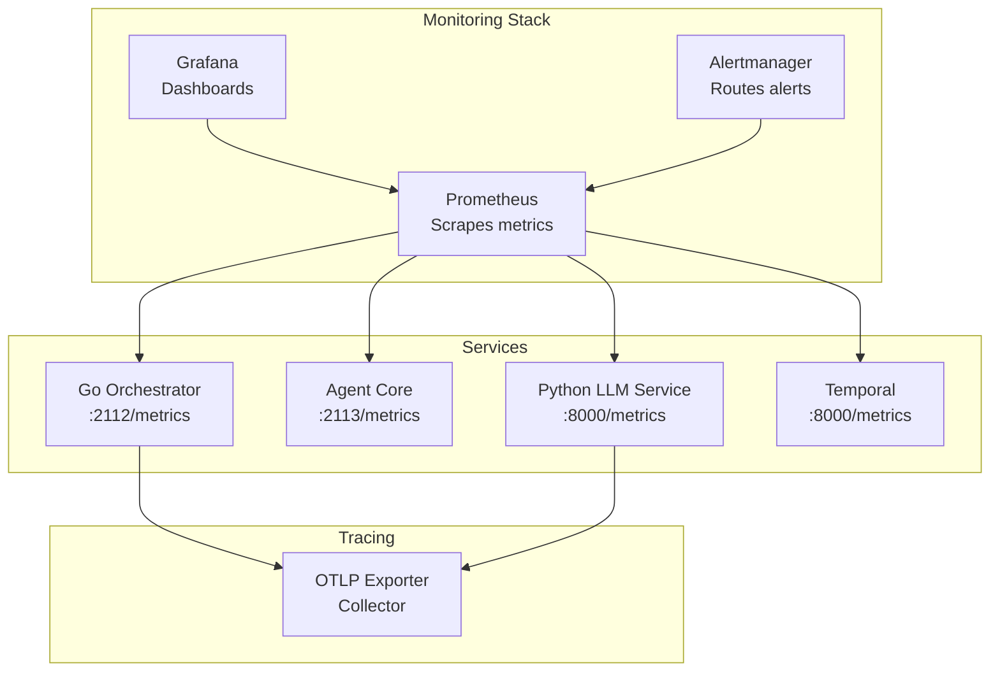
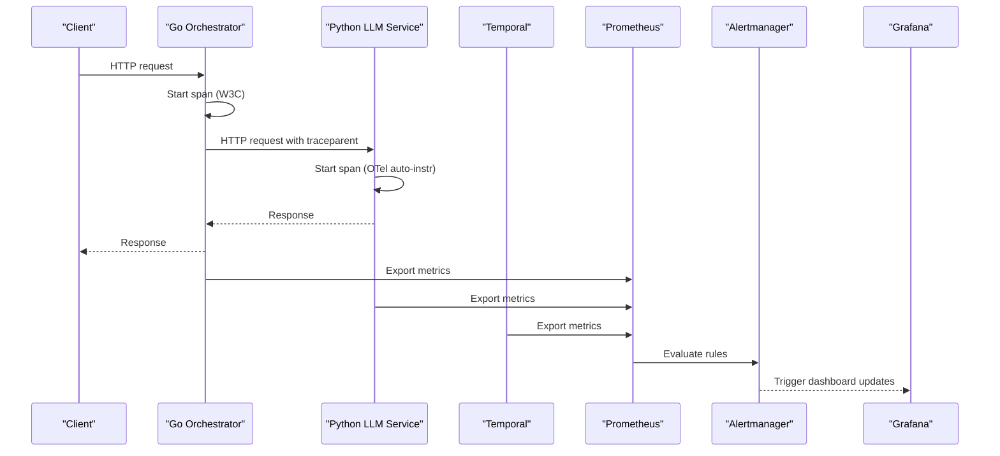
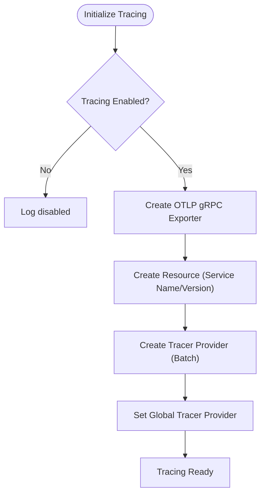
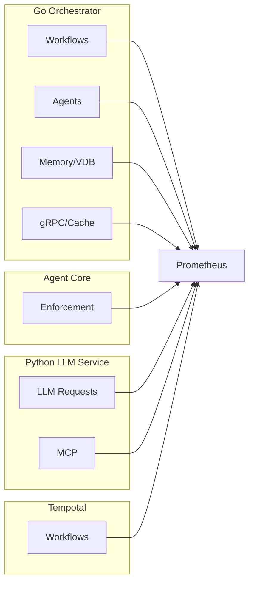
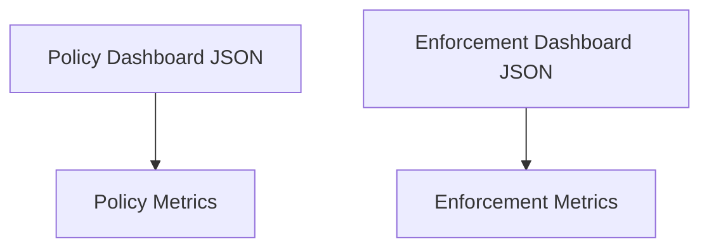
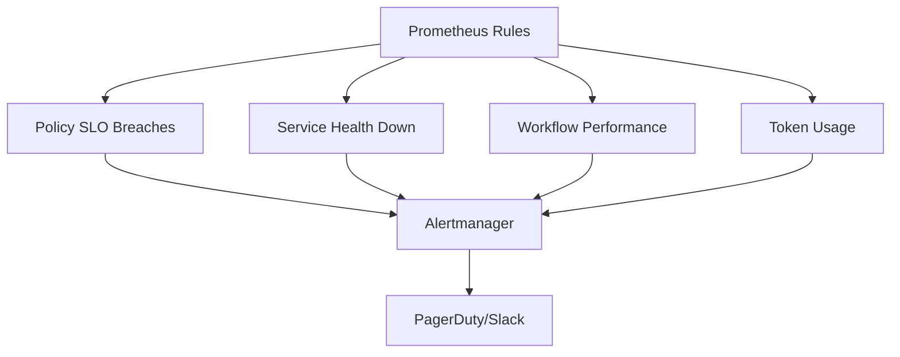
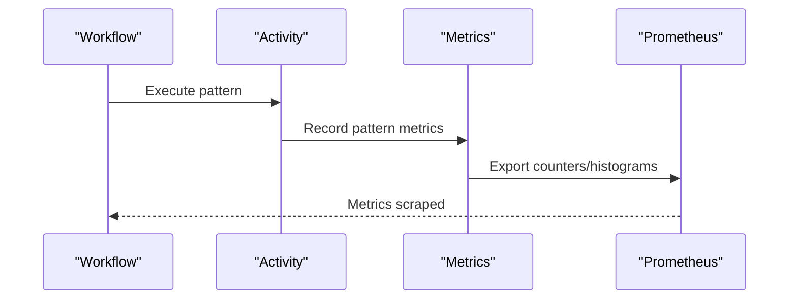
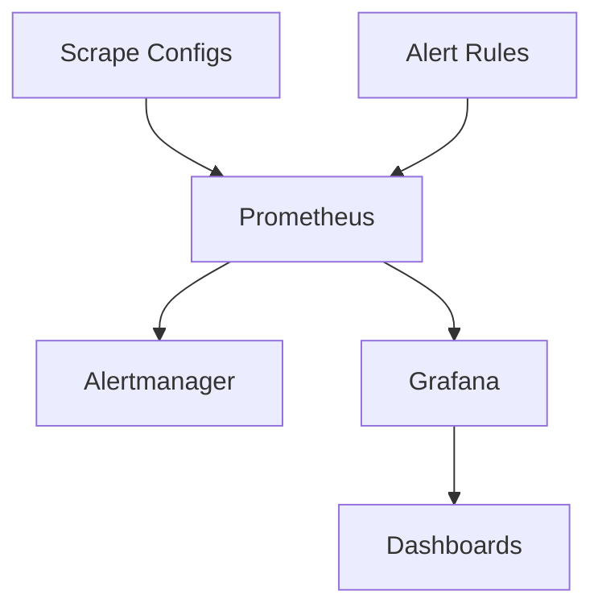

# System Monitoring and Observability

<cite>
**Referenced Files in This Document**
- [observability/README.md](file://observability/README.md)
- [observability/POLICY-METRICS.md](file://observability/POLICY-METRICS.md)
- [observability/prometheus/prometheus.yml](file://observability/prometheus/prometheus.yml)
- [observability/prometheus/alerts.yml](file://observability/prometheus/alerts.yml)
- [deploy/compose/grafana/docker-compose-grafana-prometheus.yml](file://deploy/compose/grafana/docker-compose-grafana-prometheus.yml)
- [observability/grafana/dashboards/enforcement.json](file://observability/grafana/dashboards/enforcement.json)
- [observability/grafana/dashboards/policy.json](file://observability/grafana/dashboards/policy.json)
- [go/orchestrator/internal/metrics/metrics.go](file://go/orchestrator/internal/metrics/metrics.go)
- [go/orchestrator/internal/policy/metrics.go](file://go/orchestrator/internal/policy/metrics.go)
- [go/orchestrator/internal/activities/metrics.go](file://go/orchestrator/internal/activities/metrics.go)
- [python/llm-service/llm_service/metrics.py](file://python/llm-service/llm_service/metrics.py)
- [go/orchestrator/internal/tracing/tracing.go](file://go/orchestrator/internal/tracing/tracing.go)
</cite>

## Table of Contents
1. [Introduction](#introduction)
2. [Project Structure](#project-structure)
3. [Core Components](#core-components)
4. [Architecture Overview](#architecture-overview)
5. [Detailed Component Analysis](#detailed-component-analysis)
6. [Dependency Analysis](#dependency-analysis)
7. [Performance Considerations](#performance-considerations)
8. [Troubleshooting Guide](#troubleshooting-guide)
9. [Conclusion](#conclusion)
10. [Appendices](#appendices)

## Introduction
This document describes the monitoring and observability stack for Shannon’s production environment. It covers the tracing implementation, Prometheus metrics exposed by services, Grafana dashboards, and alerting rules. It also explains how to interpret system metrics, trace distributed requests across microservices, monitor multi-agent workflow execution, develop custom metrics for workflows, configure alerts for critical events, and analyze logs. Practical examples address common issues such as memory pressure, performance degradation, and workflow failures. Finally, it outlines operational procedures for incident response, system health assessment, and capacity planning using monitoring data.

## Project Structure
Shannon’s observability is organized into three primary layers:
- Tracing: OpenTelemetry-based with W3C traceparent propagation across services.
- Metrics: Prometheus metrics exported by each service.
- Visualization and Alerting: Grafana dashboards and Prometheus alert rules.

**Diagram sources**
- [observability/prometheus/prometheus.yml](file://observability/prometheus/prometheus.yml#L21-L54)
- [deploy/compose/grafana/docker-compose-grafana-prometheus.yml](file://deploy/compose/grafana/docker-compose-grafana-prometheus.yml#L2-L15)
- [observability/README.md](file://observability/README.md#L44-L63)

**Section sources**
- [observability/README.md](file://observability/README.md#L1-L73)
- [observability/prometheus/prometheus.yml](file://observability/prometheus/prometheus.yml#L1-L78)
- [deploy/compose/grafana/docker-compose-grafana-prometheus.yml](file://deploy/compose/grafana/docker-compose-grafana-prometheus.yml#L1-L86)

## Core Components
- Tracing
  - Minimal OpenTelemetry with W3C traceparent propagation.
  - Services: Go orchestrator and Python LLM service export OTLP spans.
  - Headers: traceparent and X-Workflow-ID/X-Run-ID propagated across services.
- Metrics
  - Prometheus endpoints per service expose counters, histograms, and gauges for workflows, agents, memory, vector search, embeddings, caching, and policy evaluation.
- Dashboards
  - Grafana dashboards for policy engine, enforcement gateway, and workflow metrics.
- Alerts
  - Prometheus alert rules for policy SLOs, service health, workflow performance, and token usage.

**Section sources**
- [observability/README.md](file://observability/README.md#L5-L73)
- [observability/grafana/dashboards/policy.json](file://observability/grafana/dashboards/policy.json#L1-L651)
- [observability/grafana/dashboards/enforcement.json](file://observability/grafana/dashboards/enforcement.json#L1-L55)
- [observability/prometheus/alerts.yml](file://observability/prometheus/alerts.yml#L1-L143)

## Architecture Overview
The observability pipeline integrates services, Prometheus, Alertmanager, and Grafana. Tracing spans are exported via OTLP to a collector, while metrics are scraped by Prometheus and visualized in Grafana dashboards. Alert rules trigger notifications for critical and warning conditions.

**Diagram sources**
- [observability/README.md](file://observability/README.md#L9-L42)
- [observability/prometheus/prometheus.yml](file://observability/prometheus/prometheus.yml#L21-L54)
- [observability/prometheus/alerts.yml](file://observability/prometheus/alerts.yml#L1-L143)
- [deploy/compose/grafana/docker-compose-grafana-prometheus.yml](file://deploy/compose/grafana/docker-compose-grafana-prometheus.yml#L19-L36)

## Detailed Component Analysis

### Tracing Implementation
- Go Orchestrator
  - Initializes OTLP tracer provider and exports spans to a configurable endpoint.
  - Propagates W3C traceparent and injects X-Workflow-ID/X-Run-ID metadata in gRPC and HTTP calls.
- Python LLM Service
  - Uses OpenTelemetry auto-instrumentation for FastAPI and httpx.
  - Exports OTLP spans to the same collector endpoint.
- Validation
  - After enabling tracing, verify spans and headers across service boundaries.

**Diagram sources**
- [go/orchestrator/internal/tracing/tracing.go](file://go/orchestrator/internal/tracing/tracing.go#L27-L82)

**Section sources**
- [observability/README.md](file://observability/README.md#L9-L42)
- [go/orchestrator/internal/tracing/tracing.go](file://go/orchestrator/internal/tracing/tracing.go#L1-L148)

### Prometheus Metrics Exposure
- Go Orchestrator
  - Exposes metrics at :2112/metrics including:
    - Workflow lifecycle and durations
    - Agent execution counts and timings
    - Memory fetches and retrieval token budgets
    - Vector search and embedding latencies
    - gRPC request totals and durations
    - Caching and session cache metrics
    - Model tier selection drift and provider overrides
- Agent Core
  - Exposes enforcement drops and allowed requests, plus circuit breaker state.
- Python LLM Service
  - Exposes LLM request totals/durations, tokens, cost, active connections, errors, and MCP metrics.
- Temporal
  - Exposes workflow metrics and scheduling latencies for alerting.

**Diagram sources**
- [go/orchestrator/internal/metrics/metrics.go](file://go/orchestrator/internal/metrics/metrics.go#L8-L630)
- [go/orchestrator/internal/policy/metrics.go](file://go/orchestrator/internal/policy/metrics.go#L11-L143)
- [python/llm-service/llm_service/metrics.py](file://python/llm-service/llm_service/metrics.py#L6-L161)

**Section sources**
- [observability/README.md](file://observability/README.md#L44-L50)
- [go/orchestrator/internal/metrics/metrics.go](file://go/orchestrator/internal/metrics/metrics.go#L1-L630)
- [go/orchestrator/internal/policy/metrics.go](file://go/orchestrator/internal/policy/metrics.go#L1-L232)
- [python/llm-service/llm_service/metrics.py](file://python/llm-service/llm_service/metrics.py#L1-L161)

### Grafana Dashboards
- Policy Engine Production Dashboard
  - Tracks error rate SLO, latency SLO (P50/P95/P99), cache hit rate, canary rollout status, top deny reasons, and dry-run vs enforce comparisons.
- Enforcement Gateway Dashboard
  - Shows enforcement drops vs allowed and circuit breaker state.

**Diagram sources**
- [observability/grafana/dashboards/policy.json](file://observability/grafana/dashboards/policy.json#L1-L651)
- [observability/grafana/dashboards/enforcement.json](file://observability/grafana/dashboards/enforcement.json#L1-L55)

**Section sources**
- [observability/grafana/dashboards/policy.json](file://observability/grafana/dashboards/policy.json#L1-L651)
- [observability/grafana/dashboards/enforcement.json](file://observability/grafana/dashboards/enforcement.json#L1-L55)

### Alerting Rules
Prometheus alert rules cover:
- Policy engine SLO breaches (error rate, latency)
- Emergency kill switch activation
- Service health (orchestrator, agent-core, llm-service)
- Workflow error rate and scheduling latency
- Token budget exceeded rate and spikes

**Diagram sources**
- [observability/prometheus/alerts.yml](file://observability/prometheus/alerts.yml#L1-L143)

**Section sources**
- [observability/prometheus/alerts.yml](file://observability/prometheus/alerts.yml#L1-L143)

### Custom Metric Development for Workflow-Specific Monitoring
To instrument multi-agent workflow execution:
- Record workflow lifecycle metrics (started, completed, duration) with labels for workflow_type and mode.
- Track agent executions and durations per agent_id and mode.
- Aggregate tokens used and cost per task and per session.
- Instrument activity-level metrics (pattern execution counts, improved reflection, token usage).
- Expose these metrics on the service’s Prometheus endpoint and visualize in Grafana.

**Diagram sources**
- [go/orchestrator/internal/metrics/metrics.go](file://go/orchestrator/internal/metrics/metrics.go#L518-L531)
- [go/orchestrator/internal/activities/metrics.go](file://go/orchestrator/internal/activities/metrics.go#L21-L52)

**Section sources**
- [go/orchestrator/internal/metrics/metrics.go](file://go/orchestrator/internal/metrics/metrics.go#L1-L630)
- [go/orchestrator/internal/activities/metrics.go](file://go/orchestrator/internal/activities/metrics.go#L1-L53)

### Interpreting System Metrics
- Policy Engine
  - Error Rate SLO: Compare error counts to total evaluations; alert thresholds defined in alert rules.
  - Latency SLO: P50/P95/P99 quantiles; cache-hit labeled series help isolate cache performance.
  - Cache Hit Rate: Monitor for degradation indicating request variability or cache sizing issues.
  - Top Deny Reasons: Identify recurring policy denials and potential misconfigurations or attacks.
- Workflows and Agents
  - Workflow durations and error rates: Use histograms and counters to detect bottlenecks.
  - Agent execution durations: Identify slow agents or heavy workloads.
- Memory and Retrieval
  - Memory fetches and retrieval token budgets: Watch for increased misses or budget spikes.
- LLM and MCP
  - LLM request durations and token throughput: Track provider/model performance and cost.
  - MCP request success/failure: Monitor tool execution reliability.

**Section sources**
- [observability/POLICY-METRICS.md](file://observability/POLICY-METRICS.md#L13-L203)
- [go/orchestrator/internal/metrics/metrics.go](file://go/orchestrator/internal/metrics/metrics.go#L1-L630)
- [python/llm-service/llm_service/metrics.py](file://python/llm-service/llm_service/metrics.py#L1-L161)

### Tracing Distributed Requests Across Microservices
- Enable tracing in configuration for orchestrator and set environment variables for Python service.
- Verify:
  - HTTP requests carry traceparent and X-Workflow-ID/X-Run-ID headers.
  - gRPC metadata includes x-workflow-id and x-run-id.
  - Spans continue across service boundaries with the same trace ID.
- Use Grafana Tempo or the collector backend to explore traces and correlate metrics.

**Section sources**
- [observability/README.md](file://observability/README.md#L20-L42)
- [go/orchestrator/internal/tracing/tracing.go](file://go/orchestrator/internal/tracing/tracing.go#L84-L147)

### Monitoring Multi-Agent Workflow Execution
- Use workflow-level metrics to track start/completion rates and durations.
- Drill down by agent_id and mode to identify hotspots.
- Combine with memory and vector search metrics to detect retrieval bottlenecks.
- Visualize in Grafana dashboards and alert on sustained high latencies or error spikes.

**Section sources**
- [go/orchestrator/internal/metrics/metrics.go](file://go/orchestrator/internal/metrics/metrics.go#L8-L630)
- [observability/grafana/dashboards/policy.json](file://observability/grafana/dashboards/policy.json#L1-L651)

### Log Analysis Techniques
- Correlate logs with trace IDs to investigate failures.
- Filter by service, component, and severity to isolate incidents.
- Use alert correlation to pivot from metrics to logs for root cause analysis.
- Export high-denial-rate events for SIEM correlation.

**Section sources**
- [observability/POLICY-METRICS.md](file://observability/POLICY-METRICS.md#L188-L203)

## Dependency Analysis
The observability stack depends on:
- Prometheus scraping jobs for orchestrator, agent-core, llm-service, temporal, and exporters.
- Alert rules evaluating SLOs and service health.
- Grafana dashboards consuming Prometheus metrics.

**Diagram sources**
- [observability/prometheus/prometheus.yml](file://observability/prometheus/prometheus.yml#L21-L78)
- [observability/prometheus/alerts.yml](file://observability/prometheus/alerts.yml#L1-L143)

**Section sources**
- [observability/prometheus/prometheus.yml](file://observability/prometheus/prometheus.yml#L1-L78)
- [observability/prometheus/alerts.yml](file://observability/prometheus/alerts.yml#L1-L143)

## Performance Considerations
- Optimize policy evaluation by reducing rule complexity and improving cache hit rate.
- Monitor vector search and embedding latencies; scale Qdrant or adjust collection sizes.
- Control token usage spikes with budgeting and throttling; review provider tier selection drift.
- Tune gRPC request batching and connection pooling to reduce overhead.

[No sources needed since this section provides general guidance]

## Troubleshooting Guide
Common issues and remediation steps:
- High Policy Error Rate
  - Validate policy syntax and input formats; review logs for evaluation failures.
- High Policy Latency
  - Investigate cache hit rate; reduce rule complexity; analyze query patterns.
- High Denial Rate
  - Compare with security events; assess recent policy changes; review user behavior.
- Low Cache Hit Rate
  - Adjust cache size or TTL; reduce request variability; monitor cache entries.
- Workflow Failures
  - Inspect workflow error rates and scheduling latency; check provider availability and rate limits.
- Token Budget Exceeded
  - Reduce token usage spikes; adjust budget thresholds; monitor provider costs.
- Service Down
  - Confirm up{job="..."} metrics; check health endpoints; verify network connectivity.

**Section sources**
- [observability/POLICY-METRICS.md](file://observability/POLICY-METRICS.md#L166-L187)
- [observability/prometheus/alerts.yml](file://observability/prometheus/alerts.yml#L62-L143)

## Conclusion
Shannon’s observability stack provides comprehensive visibility into policy decisions, workflow execution, and service health. By leveraging tracing, metrics, dashboards, and alert rules, operators can quickly diagnose issues, maintain SLOs, and plan capacity effectively. Adopt the recommended practices for metric instrumentation, alert tuning, and incident response to sustain a resilient production environment.

[No sources needed since this section summarizes without analyzing specific files]

## Appendices

### Operational Procedures
- Incident Response
  - Acknowledge alerts; triage by severity; correlate metrics and traces; escalate as needed; document findings and remediation steps.
- System Health Assessment
  - Daily review of policy SLOs, workflow error rates, and cache performance; weekly trend analysis of denial reasons and provider usage.
- Capacity Planning
  - Track token usage growth, provider cost trends, and vector search latency; plan scaling for Qdrant and LLM providers accordingly.

[No sources needed since this section provides general guidance]