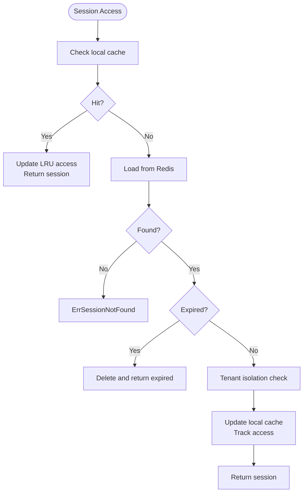

# Troubleshooting Guides and Best Practices

<cite>
**Referenced Files in This Document**
- [troubleshooting.md](file://docs/troubleshooting.md)
- [main.go](file://go/orchestrator/cmd/gateway/main.go)
- [engine.go](file://go/orchestrator/internal/policy/engine.go)
- [config.go](file://go/orchestrator/internal/policy/config.go)
- [manager.go](file://go/orchestrator/internal/streaming/manager.go)
- [manager.go](file://go/orchestrator/internal/session/manager.go)
- [types.go](file://go/orchestrator/internal/session/types.go)
- [manager.go](file://go/orchestrator/internal/health/manager.go)
- [checkers.go](file://go/orchestrator/internal/health/checkers.go)
- [metrics.go](file://go/orchestrator/internal/metrics/metrics.go)
- [signals.go](file://go/orchestrator/internal/workflows/control/signals.go)
- [workflow_interceptor.go](file://go/orchestrator/internal/interceptors/workflow_interceptor.go)
- [manager.go](file://go/orchestrator/internal/budget/manager.go)
</cite>

## Table of Contents
1. [Introduction](#introduction)
2. [Project Structure](#project-structure)
3. [Core Components](#core-components)
4. [Architecture Overview](#architecture-overview)
5. [Detailed Component Analysis](#detailed-component-analysis)
6. [Dependency Analysis](#dependency-analysis)
7. [Performance Considerations](#performance-considerations)
8. [Troubleshooting Guide](#troubleshooting-guide)
9. [Conclusion](#conclusion)
10. [Appendices](#appendices)

## Introduction
This document provides comprehensive troubleshooting guides and best practices for debugging Shannon’s complex multi-agent system. It focuses on systematic approaches to investigate workflow failures, memory problems, performance bottlenecks, multi-agent coordination issues, streaming infrastructure problems, and policy enforcement failures. It also covers safe debugging practices for production environments, including non-invasive investigation methods, impact-minimizing techniques, and systematic problem isolation. The guide includes troubleshooting workflows for different system components, escalation procedures, recovery strategies, tools integration, log analysis techniques, and automated diagnostic procedures.

## Project Structure
Shannon comprises:
- A Go-based orchestrator with HTTP/gRPC gateway, policy enforcement, streaming, sessions, health checks, metrics, and budget management.
- Python clients and services for LLM orchestration and tool execution.
- Desktop application for UI and developer tools.
- Observability stack with Grafana dashboards and Prometheus metrics.
- Configuration and templates for workflows and policies.

**Diagram sources**
- [main.go](file://go/orchestrator/cmd/gateway/main.go#L30-L688)
- [engine.go](file://go/orchestrator/internal/policy/engine.go#L85-L115)
- [manager.go](file://go/orchestrator/internal/streaming/manager.go#L36-L106)
- [manager.go](file://go/orchestrator/internal/session/manager.go#L20-L95)
- [manager.go](file://go/orchestrator/internal/health/manager.go#L22-L81)
- [metrics.go](file://go/orchestrator/internal/metrics/metrics.go#L8-L516)
- [manager.go](file://go/orchestrator/internal/budget/manager.go#L59-L146)
- [signals.go](file://go/orchestrator/internal/workflows/control/signals.go#L5-L11)
- [workflow_interceptor.go](file://go/orchestrator/internal/interceptors/workflow_interceptor.go#L12-L73)

**Section sources**
- [main.go](file://go/orchestrator/cmd/gateway/main.go#L30-L688)

## Core Components
- Policy Engine: Evaluates OPA-based policies with configurable modes (off/dry-run/enforce), canary rollouts, and emergency kill switches.
- Streaming Manager: Manages Redis-backed event streams for workflow telemetry and observability.
- Session Manager: Handles Redis-backed session persistence, caching, and tenant isolation.
- Health Manager: Provides component health checks with critical/non-critical classification and background polling.
- Metrics: Exposes Prometheus metrics for workflows, agents, sessions, memory, and more.
- Budget Manager: Tracks token budgets, enforces limits, and applies backpressure and rate limiting.
- Control Signals: Pause/resume/cancel workflow control and state queries.
- Workflow Interceptors: Injects workflow metadata into HTTP/gRPC calls.

**Section sources**
- [engine.go](file://go/orchestrator/internal/policy/engine.go#L21-L30)
- [manager.go](file://go/orchestrator/internal/streaming/manager.go#L36-L60)
- [manager.go](file://go/orchestrator/internal/session/manager.go#L20-L30)
- [manager.go](file://go/orchestrator/internal/health/manager.go#L22-L32)
- [metrics.go](file://go/orchestrator/internal/metrics/metrics.go#L8-L516)
- [manager.go](file://go/orchestrator/internal/budget/manager.go#L59-L110)
- [signals.go](file://go/orchestrator/internal/workflows/control/signals.go#L5-L11)
- [workflow_interceptor.go](file://go/orchestrator/internal/interceptors/workflow_interceptor.go#L12-L23)

## Architecture Overview
The gateway exposes HTTP and gRPC APIs, authenticates requests, and proxies to the orchestrator. The orchestrator coordinates workflows, manages sessions, enforces policies, streams events, tracks budgets, and monitors health. Observability integrates via Prometheus metrics and Grafana dashboards.

**Diagram sources**
- [main.go](file://go/orchestrator/cmd/gateway/main.go#L135-L600)
- [manager.go](file://go/orchestrator/internal/streaming/manager.go#L364-L492)
- [manager.go](file://go/orchestrator/internal/session/manager.go#L186-L242)

## Detailed Component Analysis

### Policy Enforcement Debugging
Common issues:
- Policy engine disabled or no policies loaded.
- Evaluation errors or input conversion failures.
- Canary rollout misconfiguration causing unexpected enforcement.
- Emergency kill switch forcing dry-run mode.

Safe debugging steps:
- Verify policy engine mode and canary configuration.
- Inspect policy load logs and compilation results.
- Confirm decision cache effectiveness and hit rates.
- Review SLO thresholds and automatic rollback triggers.

**Diagram sources**
- [engine.go](file://go/orchestrator/internal/policy/engine.go#L197-L282)
- [config.go](file://go/orchestrator/internal/policy/config.go#L85-L126)

**Section sources**
- [engine.go](file://go/orchestrator/internal/policy/engine.go#L197-L282)
- [config.go](file://go/orchestrator/internal/policy/config.go#L85-L126)

### Streaming Infrastructure Debugging
Common issues:
- Subscriber lag causing event drops.
- Redis connectivity or stream capacity problems.
- Event sanitization removing sensitive data unintentionally.
- Replay inconsistencies.

Safe debugging steps:
- Monitor critical event drops and warn conditions.
- Verify stream capacity and TTL settings.
- Inspect event sanitization for base64 images and UTF-8 validity.
- Use replay APIs to compare event sequences.

**Diagram sources**
- [manager.go](file://go/orchestrator/internal/streaming/manager.go#L364-L492)
- [manager.go](file://go/orchestrator/internal/streaming/manager.go#L180-L321)

**Section sources**
- [manager.go](file://go/orchestrator/internal/streaming/manager.go#L364-L492)
- [manager.go](file://go/orchestrator/internal/streaming/manager.go#L180-L321)

### Session Management Debugging
Common issues:
- Session not found or expired.
- Tenant isolation violations.
- Local cache growth and eviction.
- History truncation affecting context.

Safe debugging steps:
- Validate session existence and expiration.
- Check tenant isolation logic.
- Monitor session cache hits/misses and evictions.
- Verify history size limits and truncation behavior.

**Diagram sources**
- [manager.go](file://go/orchestrator/internal/session/manager.go#L186-L242)
- [types.go](file://go/orchestrator/internal/session/types.go#L8-L17)

**Section sources**
- [manager.go](file://go/orchestrator/internal/session/manager.go#L186-L242)
- [types.go](file://go/orchestrator/internal/session/types.go#L8-L17)

### Health Monitoring and Diagnostics
Common issues:
- Redis or database connectivity problems.
- High latency or connection pool exhaustion.
- Agent Core service unavailability or slowness.
- LLM service health checks not implemented.

Safe debugging steps:
- Use health manager endpoints to query overall and component status.
- Inspect circuit breaker states for Redis and DB.
- Review detailed health results and timing.
- Adjust check intervals and timeouts for noisy environments.

**Diagram sources**
- [manager.go](file://go/orchestrator/internal/health/manager.go#L22-L81)
- [checkers.go](file://go/orchestrator/internal/health/checkers.go#L19-L88)

**Section sources**
- [manager.go](file://go/orchestrator/internal/health/manager.go#L161-L246)
- [checkers.go](file://go/orchestrator/internal/health/checkers.go#L19-L88)

### Budget and Performance Controls
Common issues:
- Budget exceeded causing hard limits or warnings.
- Backpressure delays and circuit breaker activation.
- Rate limit throttling.
- Cost tracking discrepancies.

Safe debugging steps:
- Review budget thresholds and warning percentages.
- Inspect backpressure calculations and delays.
- Check rate limiter configurations.
- Validate cost estimations and actual usage.

**Diagram sources**
- [manager.go](file://go/orchestrator/internal/budget/manager.go#L175-L288)
- [manager.go](file://go/orchestrator/internal/budget/manager.go#L677-L726)

**Section sources**
- [manager.go](file://go/orchestrator/internal/budget/manager.go#L175-L288)
- [manager.go](file://go/orchestrator/internal/budget/manager.go#L677-L726)

### Workflow Control Signals
Common issues:
- Pause/Resume/Cancellation not taking effect.
- Control state queries inconsistent.
- Metadata propagation to downstream calls.

Safe debugging steps:
- Verify control signal names and payloads.
- Query control state to confirm current status.
- Ensure workflow metadata is injected into HTTP/gRPC calls.

**Diagram sources**
- [signals.go](file://go/orchestrator/internal/workflows/control/signals.go#L5-L41)
- [workflow_interceptor.go](file://go/orchestrator/internal/interceptors/workflow_interceptor.go#L25-L44)

**Section sources**
- [signals.go](file://go/orchestrator/internal/workflows/control/signals.go#L5-L41)
- [workflow_interceptor.go](file://go/orchestrator/internal/interceptors/workflow_interceptor.go#L25-L44)

## Dependency Analysis
Key dependencies and coupling:
- Gateway depends on orchestrator services and external systems (Redis, DB).
- Policy engine depends on OPA and policy files.
- Streaming and session managers depend on Redis.
- Budget manager depends on DB and pricing configuration.
- Health manager depends on Redis, DB, and Agent Core.

**Diagram sources**
- [main.go](file://go/orchestrator/cmd/gateway/main.go#L97-L108)
- [engine.go](file://go/orchestrator/internal/policy/engine.go#L117-L195)
- [manager.go](file://go/orchestrator/internal/streaming/manager.go#L82-L106)
- [manager.go](file://go/orchestrator/internal/session/manager.go#L39-L95)
- [manager.go](file://go/orchestrator/internal/health/manager.go#L50-L81)
- [manager.go](file://go/orchestrator/internal/budget/manager.go#L72-L146)

**Section sources**
- [main.go](file://go/orchestrator/cmd/gateway/main.go#L97-L108)

## Performance Considerations
- Use streaming manager batching and flush intervals to balance latency and throughput.
- Tune session manager cache size and eviction strategy.
- Monitor budget pressure levels and adjust backpressure thresholds.
- Leverage Prometheus metrics to identify hotspots and regressions.
- Apply rate limiting to protect upstream providers.

[No sources needed since this section provides general guidance]

## Troubleshooting Guide

### Systematic Approaches
- Start with health manager endpoints to assess overall system status.
- Inspect recent events via streaming manager replay and timeline proxy.
- Validate session state and tenant isolation.
- Review policy decisions and canary rollout effects.
- Analyze budget usage and backpressure behavior.

**Section sources**
- [manager.go](file://go/orchestrator/internal/health/manager.go#L161-L246)
- [manager.go](file://go/orchestrator/internal/streaming/manager.go#L698-L754)
- [manager.go](file://go/orchestrator/internal/session/manager.go#L186-L242)
- [engine.go](file://go/orchestrator/internal/policy/engine.go#L197-L282)
- [manager.go](file://go/orchestrator/internal/budget/manager.go#L175-L288)

### Workflow Failures
Symptoms:
- Workflows stuck in paused or cancelled state.
- Control state queries return inconsistent results.
- Downstream calls missing workflow metadata.

Debugging steps:
- Confirm control signals were received and applied.
- Query control state to verify current status.
- Ensure workflow interceptors are injecting headers for HTTP/gRPC.

Recovery:
- Send resume/cancel signals as appropriate.
- Reset workflow state if necessary.

**Section sources**
- [signals.go](file://go/orchestrator/internal/workflows/control/signals.go#L5-L41)
- [workflow_interceptor.go](file://go/orchestrator/internal/interceptors/workflow_interceptor.go#L25-L44)

### Memory Problems
Symptoms:
- High memory usage or frequent evictions.
- Session history truncation affecting context quality.

Debugging steps:
- Monitor session cache metrics (hits, misses, evictions).
- Review session TTL and max history settings.
- Check memory fetches and retrieval token budgets.

Recovery:
- Increase cache capacity or tune eviction strategy.
- Adjust session history limits and retention.

**Section sources**
- [metrics.go](file://go/orchestrator/internal/metrics/metrics.go#L228-L254)
- [manager.go](file://go/orchestrator/internal/session/manager.go#L415-L451)

### Performance Bottlenecks
Symptoms:
- High latency in streaming or session operations.
- Redis/database latency spikes.
- Budget pressure causing backpressure delays.

Debugging steps:
- Use health manager to identify slow components.
- Inspect streaming manager event delivery and sanitization.
- Review budget pressure levels and backpressure delays.
- Monitor rate limiter and circuit breaker states.

Recovery:
- Scale Redis/DB resources.
- Adjust backpressure thresholds and rate limits.
- Optimize streaming batch sizes and flush intervals.

**Section sources**
- [manager.go](file://go/orchestrator/internal/health/manager.go#L285-L349)
- [manager.go](file://go/orchestrator/internal/streaming/manager.go#L107-L127)
- [manager.go](file://go/orchestrator/internal/budget/manager.go#L677-L726)

### Multi-Agent Coordination Issues
Symptoms:
- Agents not communicating or coordinating.
- Role assignments or delegation events missing.

Debugging steps:
- Inspect streaming events for role-assigned and delegation events.
- Verify event persistence for important workflow events.
- Check session context for agent-specific state.

Recovery:
- Ensure coordinator agents publish coordination events.
- Validate event persistence and replay mechanisms.

**Section sources**
- [manager.go](file://go/orchestrator/internal/streaming/manager.go#L500-L536)
- [manager.go](file://go/orchestrator/internal/session/manager.go#L95-L132)

### Streaming Infrastructure Problems
Symptoms:
- Events dropped due to subscriber lag.
- Base64 images bloating storage.
- UTF-8 encoding errors.

Debugging steps:
- Monitor critical event drops and warn conditions.
- Review event sanitization for base64 images and UTF-8.
- Use replay APIs to compare event sequences.

Recovery:
- Increase subscriber buffer sizes.
- Adjust stream capacity and TTL.
- Sanitize payloads before persistence.

**Section sources**
- [manager.go](file://go/orchestrator/internal/streaming/manager.go#L305-L343)
- [manager.go](file://go/orchestrator/internal/streaming/manager.go#L538-L659)

### Policy Enforcement Failures
Symptoms:
- Unexpected allow/deny decisions.
- Canaries not rolling out as expected.
- Emergency kill switch overriding enforcement.

Debugging steps:
- Verify policy engine mode and canary configuration.
- Inspect policy load logs and compilation results.
- Review decision cache effectiveness and SLO thresholds.

Recovery:
- Adjust canary percentages and user/agent overrides.
- Disable emergency kill switch if unintended.
- Reload policies and monitor cache hit rates.

**Section sources**
- [engine.go](file://go/orchestrator/internal/policy/engine.go#L117-L195)
- [config.go](file://go/orchestrator/internal/policy/config.go#L85-L126)

### Safe Debugging Practices for Production
Non-invasive investigation:
- Use health manager endpoints and metrics without altering state.
- Leverage streaming replay and timeline proxy for inspection.
- Avoid modifying active sessions or workflows directly.

Impact-minimizing techniques:
- Use dry-run mode for policy testing.
- Apply backpressure and rate limiting to protect systems.
- Monitor SLO thresholds and auto-rollback triggers.

Systematic problem isolation:
- Start from gateway logs and move to orchestrator services.
- Validate Redis and DB connectivity before blaming application logic.
- Check policy engine mode and canary rollout before blaming workflows.

Escalation procedures:
- If health manager reports critical failures, engage platform team.
- If policy engine fails closed, temporarily disable enforcement.
- If streaming is failing, reduce batch sizes and increase buffers.

Recovery strategies:
- Restart services after configuration changes.
- Clear caches and reset counters if corrupted.
- Roll back policy changes if SLO thresholds exceeded.

**Section sources**
- [main.go](file://go/orchestrator/cmd/gateway/main.go#L135-L600)
- [manager.go](file://go/orchestrator/internal/health/manager.go#L285-L349)
- [engine.go](file://go/orchestrator/internal/policy/engine.go#L104-L115)

### Debugging Tools Integration and Log Analysis
- Prometheus metrics: Use exposed counters and histograms to identify anomalies.
- Grafana dashboards: Monitor policy enforcement, session cache, and streaming metrics.
- Log correlation: Match gateway request IDs with orchestrator logs and Redis/DB operations.

Automated diagnostics:
- Health manager background checks provide continuous monitoring.
- Policy engine SLO metrics enable automatic rollback triggers.
- Budget manager backpressure and rate limiting prevent cascading failures.

**Section sources**
- [metrics.go](file://go/orchestrator/internal/metrics/metrics.go#L8-L516)
- [manager.go](file://go/orchestrator/internal/health/manager.go#L363-L454)
- [engine.go](file://go/orchestrator/internal/policy/engine.go#L609-L656)
- [manager.go](file://go/orchestrator/internal/budget/manager.go#L677-L726)

## Conclusion
This guide provides a structured approach to diagnosing and resolving issues across Shannon’s multi-agent system. By leveraging health checks, streaming replay, policy canary controls, budget backpressure, and comprehensive metrics, operators can debug efficiently with minimal impact. Adopting non-invasive investigation methods, systematic isolation, and escalation procedures ensures reliable operations in production.

[No sources needed since this section summarizes without analyzing specific files]

## Appendices

### Quick Reference: Common Symptoms and Actions
- Tokens count > 0 but result is empty: Verify provider API path and cached responses.
- Tools unexpectedly enabled/disabled: Ensure allowed_tools semantics are respected.
- Session result not visible in history: Check for stale-overwrite fixes and update patterns.

**Section sources**
- [troubleshooting.md](file://docs/troubleshooting.md#L3-L41)