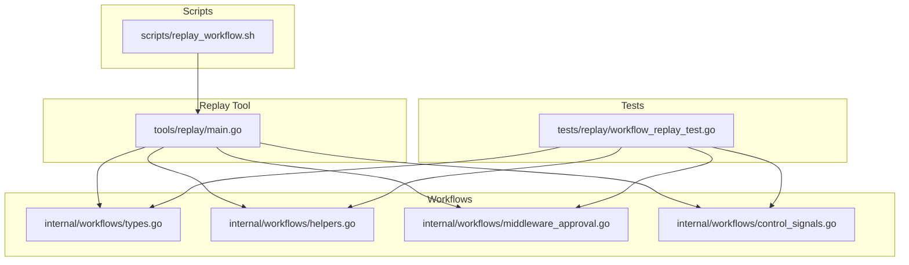
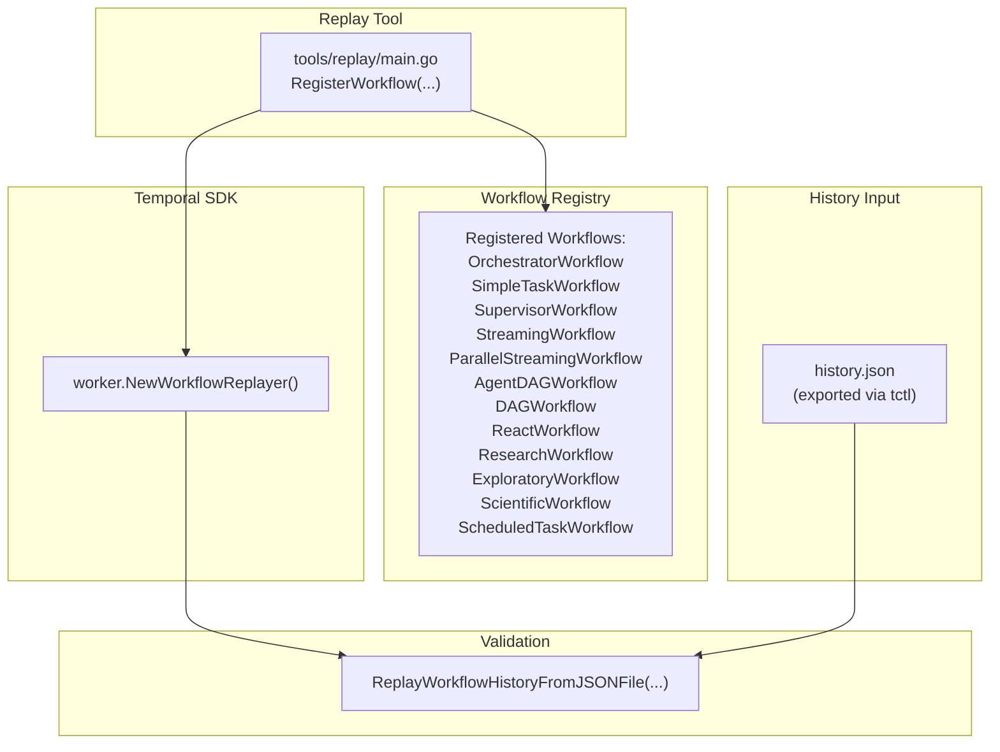
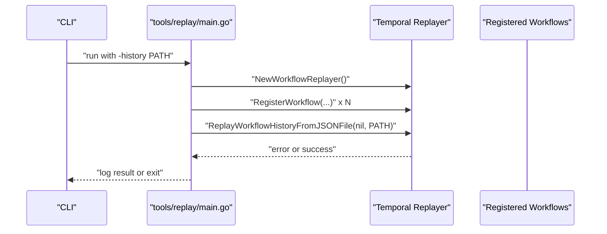
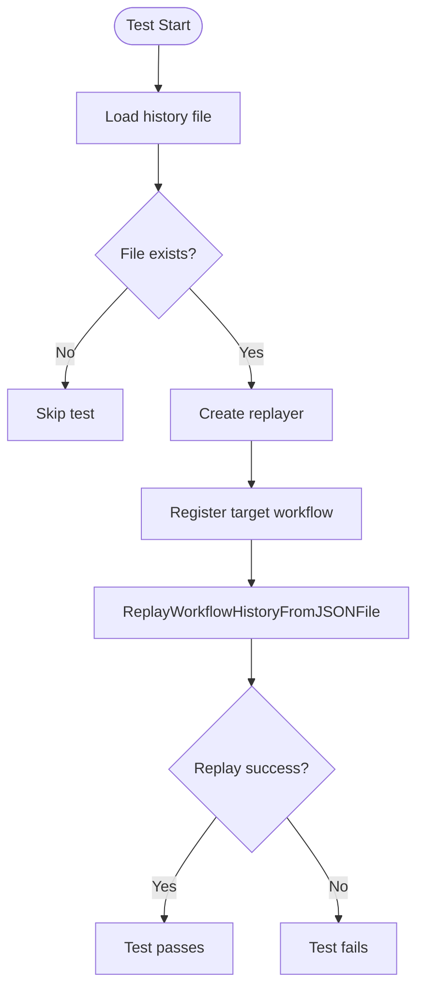
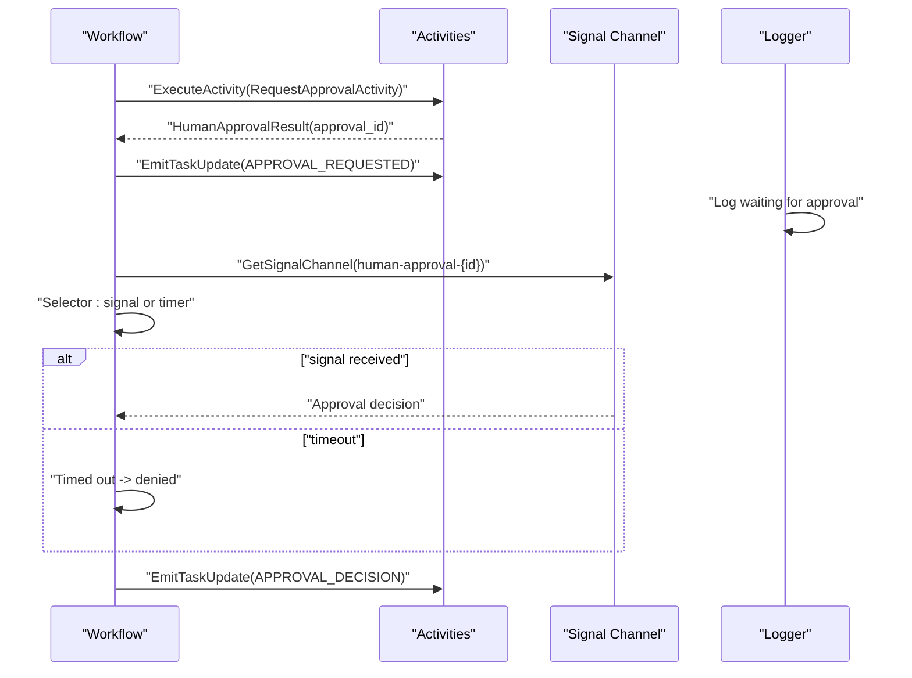
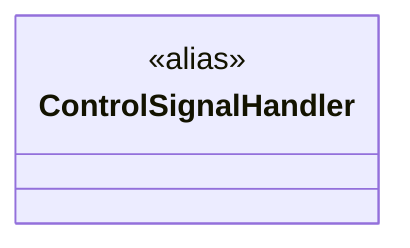
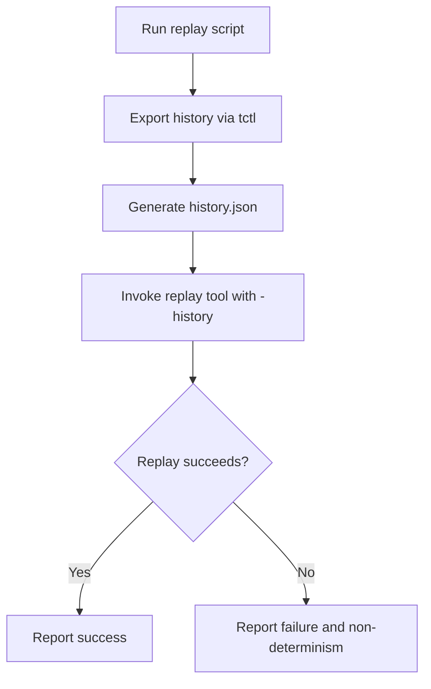
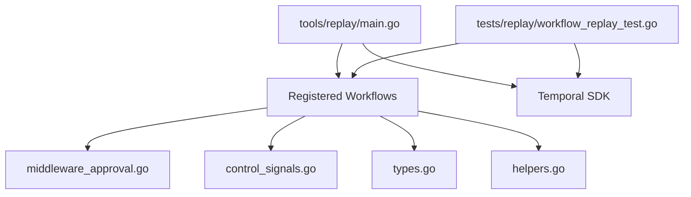

# Workflow Debugging and Replay

<cite>
**Referenced Files in This Document**
- [main.go](file://go/orchestrator/tools/replay/main.go)
- [workflow_replay_test.go](file://go/orchestrator/tests/replay/workflow_replay_test.go)
- [types.go](file://go/orchestrator/internal/workflows/types.go)
- [helpers.go](file://go/orchestrator/internal/workflows/helpers.go)
- [middleware_approval.go](file://go/orchestrator/internal/workflows/middleware_approval.go)
- [control_signals.go](file://go/orchestrator/internal/workflows/control_signals.go)
- [replay_workflow.sh](file://scripts/replay_workflow.sh)
- [README.md](file://go/orchestrator/README.md)
</cite>

## Table of Contents
1. [Introduction](#introduction)
2. [Project Structure](#project-structure)
3. [Core Components](#core-components)
4. [Architecture Overview](#architecture-overview)
5. [Detailed Component Analysis](#detailed-component-analysis)
6. [Dependency Analysis](#dependency-analysis)
7. [Performance Considerations](#performance-considerations)
8. [Troubleshooting Guide](#troubleshooting-guide)
9. [Conclusion](#conclusion)
10. [Appendices](#appendices)

## Introduction
This document explains how to debug and replay temporal workflows in Shannon’s orchestrator. It covers the replay mechanism, temporal workflow inspection, state machine analysis, and execution path reconstruction. You will learn how to use the workflow replay tools to investigate failures, analyze execution traces, and debug complex multi-agent interactions. It also documents debugging interfaces, temporal state inspection, and replay script usage, with practical examples for common issues such as deadlocks, infinite loops, and state inconsistencies. Best practices for safe debugging, minimal-impact investigations, and systematic problem resolution are included, along with guidance on monitoring and alerting during debugging sessions.

## Project Structure
Shannon’s temporal workflow system centers around the Go orchestrator service, which exposes:
- A replay tool for deterministic replay of workflow histories
- Tests validating replay determinism for key workflows
- Workflow types and helpers used across workflows
- Middleware for approvals and control signals
- Scripts to export histories and run replays



**Diagram sources**
- [main.go](file://go/orchestrator/tools/replay/main.go#L1-L49)
- [workflow_replay_test.go](file://go/orchestrator/tests/replay/workflow_replay_test.go#L1-L98)
- [types.go](file://go/orchestrator/internal/workflows/types.go#L1-L59)
- [helpers.go](file://go/orchestrator/internal/workflows/helpers.go#L1-L192)
- [middleware_approval.go](file://go/orchestrator/internal/workflows/middleware_approval.go#L1-L121)
- [control_signals.go](file://go/orchestrator/internal/workflows/control_signals.go#L1-L9)
- [replay_workflow.sh](file://scripts/replay_workflow.sh)

**Section sources**
- [main.go](file://go/orchestrator/tools/replay/main.go#L1-L49)
- [workflow_replay_test.go](file://go/orchestrator/tests/replay/workflow_replay_test.go#L1-L98)
- [types.go](file://go/orchestrator/internal/workflows/types.go#L1-L59)
- [helpers.go](file://go/orchestrator/internal/workflows/helpers.go#L1-L192)
- [middleware_approval.go](file://go/orchestrator/internal/workflows/middleware_approval.go#L1-L121)
- [control_signals.go](file://go/orchestrator/internal/workflows/control_signals.go#L1-L9)
- [replay_workflow.sh](file://scripts/replay_workflow.sh)

## Core Components
- Replay tool: A command-line tool that registers workflows and replays a recorded history to detect non-determinism.
- Replay tests: Unit tests that validate replay determinism for specific workflows using exported histories.
- Workflow types: Shared data structures used across workflows for inputs, messages, and results.
- Helpers: Utilities for history shaping, compression, provider detection, and metadata aggregation.
- Approvals middleware: Logic to request and await human approvals, emitting signals and events.
- Control signals: Signal handler type used across workflows for control and coordination.
- Replay script: A shell script to export histories and run replays.

Key responsibilities:
- Replay tool: Validates workflow determinism by replaying recorded histories.
- Replay tests: Ensures determinism for DAG and React strategies.
- Types and helpers: Provide consistent data shapes and utilities for workflows.
- Approvals middleware: Manages human-in-the-loop controls and timeouts.
- Control signals: Enables coordinated control across workflows.
- Replay script: Automates exporting histories and invoking the replay tool.

**Section sources**
- [main.go](file://go/orchestrator/tools/replay/main.go#L17-L48)
- [workflow_replay_test.go](file://go/orchestrator/tests/replay/workflow_replay_test.go#L12-L97)
- [types.go](file://go/orchestrator/internal/workflows/types.go#L8-L59)
- [helpers.go](file://go/orchestrator/internal/workflows/helpers.go#L13-L192)
- [middleware_approval.go](file://go/orchestrator/internal/workflows/middleware_approval.go#L12-L121)
- [control_signals.go](file://go/orchestrator/internal/workflows/control_signals.go#L7-L9)
- [replay_workflow.sh](file://scripts/replay_workflow.sh)

## Architecture Overview
The temporal workflow debugging and replay architecture integrates the replay tool, tests, and workflow internals. The replay tool registers all known workflows and replays a history file, surfacing non-determinism immediately. Tests complement this by validating determinism for representative workflows using exported histories. Approvals and control signals are integrated into workflows to support human-in-the-loop debugging and control.



**Diagram sources**
- [main.go](file://go/orchestrator/tools/replay/main.go#L26-L45)

## Detailed Component Analysis

### Replay Tool
The replay tool constructs a workflow replayer, registers all known workflows, and replays a history file. It exits with a fatal error if replay fails due to non-determinism or invalid history.



**Diagram sources**
- [main.go](file://go/orchestrator/tools/replay/main.go#L17-L48)

**Section sources**
- [main.go](file://go/orchestrator/tools/replay/main.go#L17-L48)

### Replay Tests
The replay tests validate determinism for DAG and React workflows using exported histories. They skip missing history files and assert replay success.



**Diagram sources**
- [workflow_replay_test.go](file://go/orchestrator/tests/replay/workflow_replay_test.go#L36-L55)
- [workflow_replay_test.go](file://go/orchestrator/tests/replay/workflow_replay_test.go#L77-L96)

**Section sources**
- [workflow_replay_test.go](file://go/orchestrator/tests/replay/workflow_replay_test.go#L12-L97)

### Workflow Types and Helpers
Workflow types define inputs, messages, and results. Helpers provide utilities for history shaping, compression, provider detection, and metadata enrichment.

```mermaid
classDiagram
class TaskInput {
+string Query
+string UserID
+string TenantID
+string SessionID
+map~string,interface{}~ Context
+string Mode
+string TemplateName
+string TemplateVersion
+bool DisableAI
+Message[] History
+map~string,interface{}~ SessionCtx
+bool RequireApproval
+int ApprovalTimeout
+bool BypassSingleResult
+string ParentWorkflowID
+string[] SuggestedTools
+map~string,interface{}~ ToolParameters
+DecompositionResult* PreplannedDecomposition
}
class Message {
+string Role
+string Content
+time.Time Timestamp
}
class TaskResult {
+string Result
+bool Success
+int TokensUsed
+string ErrorMessage
+map~string,interface{}~ Metadata
}
class Helpers {
+GetContextBool(ctx, key) bool
+convertHistoryForAgent(messages) []string
+convertHistoryMapForCompression(messages) []map~string,string~
+getPrimersRecents(ctx, defP, defR) (int,int)
+getCompressionRatios(ctx, defT, defG) (float64,float64)
+shapeHistory(messages, nP, nR) Message[]
+fallbackToBasicMemory(ctx, input, logger) void
+extractSubtaskDescriptions(subtasks) []string
+detectProviderFromModel(model) string
+AddTaskContextToMetadata(result, taskCtx) TaskResult
}
TaskInput --> Message : "contains"
Helpers --> TaskInput : "reads/writes"
Helpers --> TaskResult : "enriches"
```

**Diagram sources**
- [types.go](file://go/orchestrator/internal/workflows/types.go#L8-L59)
- [helpers.go](file://go/orchestrator/internal/workflows/helpers.go#L13-L192)

**Section sources**
- [types.go](file://go/orchestrator/internal/workflows/types.go#L8-L59)
- [helpers.go](file://go/orchestrator/internal/workflows/helpers.go#L13-L192)

### Approvals Middleware
The approvals middleware evaluates whether human approval is required, requests approval, emits events, and awaits signals or timeouts.



**Diagram sources**
- [middleware_approval.go](file://go/orchestrator/internal/workflows/middleware_approval.go#L44-L121)

**Section sources**
- [middleware_approval.go](file://go/orchestrator/internal/workflows/middleware_approval.go#L12-L121)

### Control Signals
Control signals enable coordinated control across workflows. The control signal handler type is aliased for reuse.



**Diagram sources**
- [control_signals.go](file://go/orchestrator/internal/workflows/control_signals.go#L7-L9)

**Section sources**
- [control_signals.go](file://go/orchestrator/internal/workflows/control_signals.go#L7-L9)

### Replay Script
The replay script automates exporting histories and running the replay tool. It integrates with tctl to export histories and invokes the replay binary.



**Diagram sources**
- [replay_workflow.sh](file://scripts/replay_workflow.sh)

**Section sources**
- [replay_workflow.sh](file://scripts/replay_workflow.sh)

## Dependency Analysis
The replay tool depends on the workflow registry and the Temporal SDK. Tests depend on the workflow registry and the SDK. Approvals middleware and control signals integrate into workflows to support debugging and control.



**Diagram sources**
- [main.go](file://go/orchestrator/tools/replay/main.go#L26-L45)
- [workflow_replay_test.go](file://go/orchestrator/tests/replay/workflow_replay_test.go#L41-L54)
- [middleware_approval.go](file://go/orchestrator/internal/workflows/middleware_approval.go#L12-L121)
- [control_signals.go](file://go/orchestrator/internal/workflows/control_signals.go#L7-L9)
- [types.go](file://go/orchestrator/internal/workflows/types.go#L8-L59)
- [helpers.go](file://go/orchestrator/internal/workflows/helpers.go#L13-L192)

**Section sources**
- [main.go](file://go/orchestrator/tools/replay/main.go#L26-L45)
- [workflow_replay_test.go](file://go/orchestrator/tests/replay/workflow_replay_test.go#L41-L54)
- [middleware_approval.go](file://go/orchestrator/internal/workflows/middleware_approval.go#L12-L121)
- [control_signals.go](file://go/orchestrator/internal/workflows/control_signals.go#L7-L9)
- [types.go](file://go/orchestrator/internal/workflows/types.go#L8-L59)
- [helpers.go](file://go/orchestrator/internal/workflows/helpers.go#L13-L192)

## Performance Considerations
- Keep replay histories minimal and focused on the failing scenario to reduce replay time.
- Prefer deterministic workflows and deterministic activities to minimize replay overhead.
- Use targeted replay tests to validate determinism for specific workflows rather than replaying entire systems.
- Monitor logs and metrics during replay to identify hotspots and bottlenecks.

[No sources needed since this section provides general guidance]

## Troubleshooting Guide
Common workflow issues and how to debug them using replay and inspection:

- Deadlocks
  - Symptom: Workflow appears stuck, no progress after a specific activity.
  - Action: Export the history and replay to pinpoint the exact moment of non-progress. Inspect signal channels and timers in the approvals middleware.
  - Evidence: The approvals middleware waits on a signal channel and a timer; if the signal never arrives, inspect the signal name and emission logic.

- Infinite loops
  - Symptom: Workflow repeats the same steps indefinitely.
  - Action: Export and replay the history; use helpers to shape history and compress context to reduce noise. Verify loop conditions and branching logic.
  - Evidence: Helpers provide history shaping and compression utilities that can help isolate problematic branches.

- State inconsistencies
  - Symptom: Results differ across runs despite identical inputs.
  - Action: Run replay tests to validate determinism. If replay fails, inspect workflow logic and ensure deterministic state updates.
  - Evidence: Replay tests register workflows and replay histories to surface non-determinism.

- Human approval timeouts
  - Symptom: Approval decisions never arrive, causing timeouts.
  - Action: Verify signal channel names and emission logic. Confirm that approval events are emitted and signals are properly routed.
  - Evidence: The approvals middleware emits events and awaits signals; timeouts are handled explicitly.

Best practices:
- Use the replay tool to validate determinism before deploying changes.
- Keep histories small and focused to minimize replay time.
- Use the approvals middleware to gate risky operations and enable manual intervention.
- Monitor logs and metrics during replay sessions to identify anomalies.

**Section sources**
- [middleware_approval.go](file://go/orchestrator/internal/workflows/middleware_approval.go#L44-L121)
- [workflow_replay_test.go](file://go/orchestrator/tests/replay/workflow_replay_test.go#L12-L97)
- [helpers.go](file://go/orchestrator/internal/workflows/helpers.go#L105-L133)

## Conclusion
Shannon’s temporal workflow system provides robust debugging and replay capabilities. The replay tool and tests validate determinism, while approvals middleware and control signals enable human-in-the-loop debugging and control. By exporting histories, running replays, and leveraging helpers and types, you can systematically investigate failures, analyze execution traces, and resolve complex multi-agent interactions with minimal impact.

[No sources needed since this section summarizes without analyzing specific files]

## Appendices

### Practical Examples
- Export a history using tctl and replay it with the replay tool to detect non-determinism.
- Run replay tests for DAG and React workflows to validate determinism with exported histories.
- Use the approvals middleware to request and manage human approvals during debugging sessions.
- Employ helpers to shape and compress history for clearer inspection and reduced noise.

**Section sources**
- [main.go](file://go/orchestrator/tools/replay/main.go#L17-L48)
- [workflow_replay_test.go](file://go/orchestrator/tests/replay/workflow_replay_test.go#L12-L97)
- [middleware_approval.go](file://go/orchestrator/internal/workflows/middleware_approval.go#L12-L121)
- [helpers.go](file://go/orchestrator/internal/workflows/helpers.go#L105-L133)