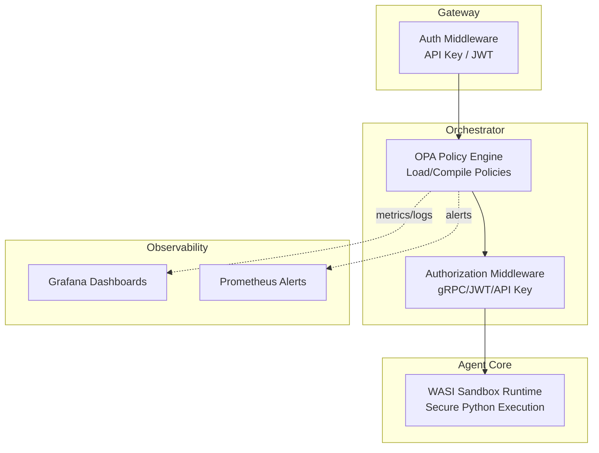
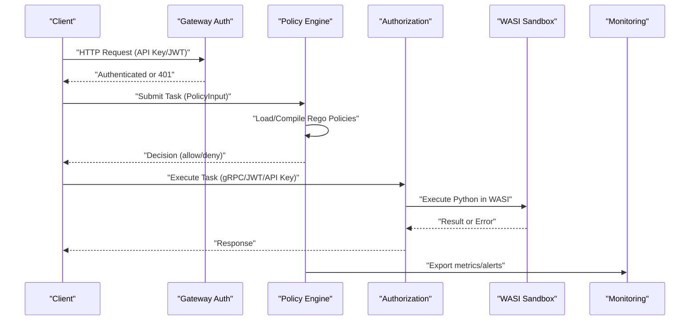
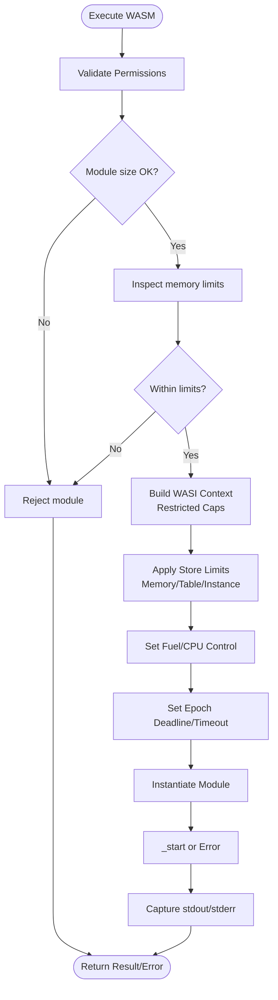
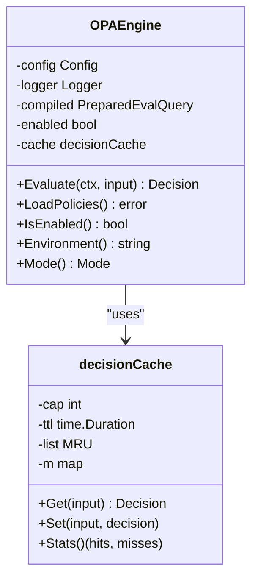
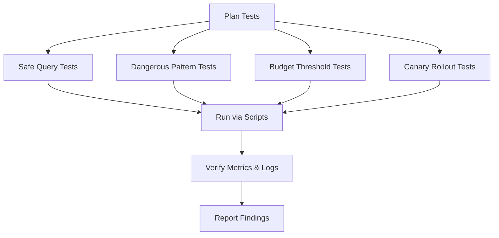
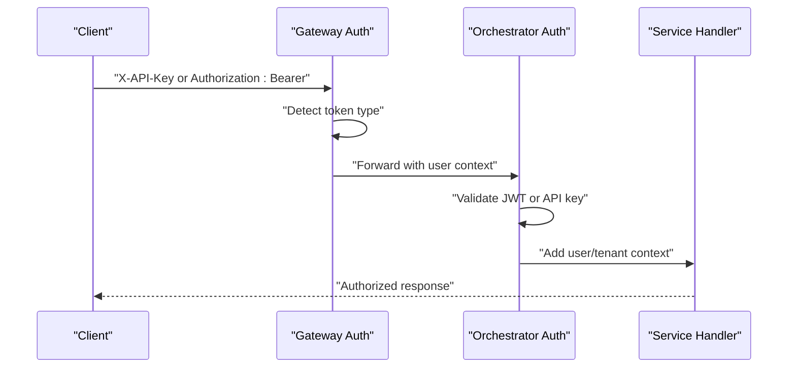
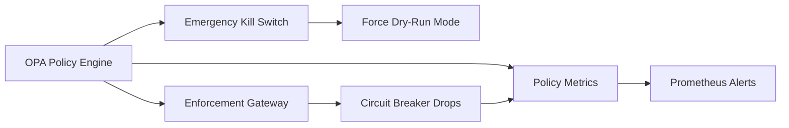
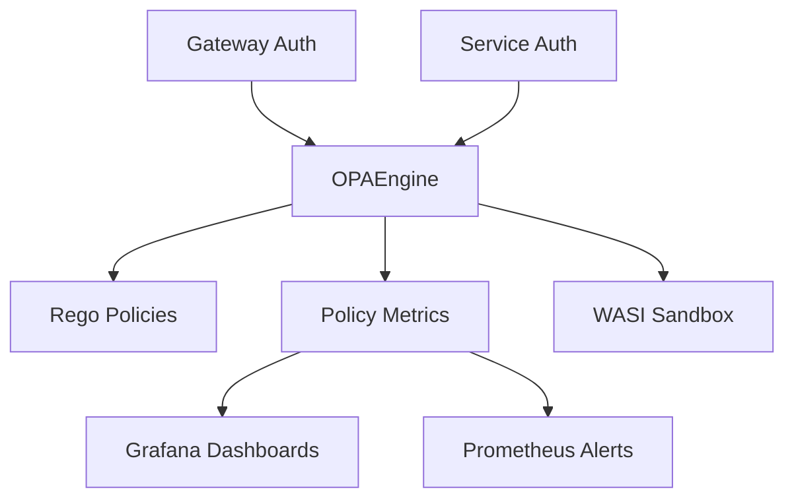

# Advanced Security Configuration

<cite>
**Referenced Files in This Document**
- [wasi_sandbox.rs](file://rust/agent-core/src/wasi_sandbox.rs)
- [python_wasi_executor.py](file://python/llm-service/llm_service/tools/builtin/python_wasi_executor.py)
- [engine.go](file://go/orchestrator/internal/policy/engine.go)
- [base.rego](file://config/opa/policies/base.rego)
- [security.rego](file://config/opa/policies/security.rego)
- [README.md](file://config/opa/README.md)
- [auth.go](file://go/orchestrator/cmd/gateway/internal/middleware/auth.go)
- [middleware.go](file://go/orchestrator/internal/auth/middleware.go)
- [enforcement.json](file://observability/grafana/dashboards/enforcement.json)
- [alerts.yml](file://observability/prometheus/alerts.yml)
</cite>

## Table of Contents
1. [Introduction](#introduction)
2. [Project Structure](#project-structure)
3. [Core Components](#core-components)
4. [Architecture Overview](#architecture-overview)
5. [Detailed Component Analysis](#detailed-component-analysis)
6. [Dependency Analysis](#dependency-analysis)
7. [Performance Considerations](#performance-considerations)
8. [Troubleshooting Guide](#troubleshooting-guide)
9. [Conclusion](#conclusion)
10. [Appendices](#appendices)

## Introduction
This document provides advanced security configuration guidance for Shannon, focusing on three pillars:
- WASI sandbox customization for secure code execution
- Open Policy Agent (OPA) policy engine optimization and testing
- Enterprise-grade security hardening including authentication, authorization, network controls, and observability

The goal is to help operators configure Shannon for production-grade security with strong isolation, robust policy enforcement, and comprehensive monitoring.

## Project Structure
Security-related components span multiple layers:
- WASI sandbox runtime in Rust for secure Python execution
- OPA-based policy engine in Go for task authorization
- Authentication and authorization middleware for API and gRPC
- Observability stack for policy and service monitoring

**Diagram sources**
- [auth.go](file://go/orchestrator/cmd/gateway/internal/middleware/auth.go#L24-L156)
- [engine.go](file://go/orchestrator/internal/policy/engine.go#L85-L195)
- [middleware.go](file://go/orchestrator/internal/auth/middleware.go#L23-L193)
- [wasi_sandbox.rs](file://rust/agent-core/src/wasi_sandbox.rs#L15-L72)
- [enforcement.json](file://observability/grafana/dashboards/enforcement.json#L1-L55)
- [alerts.yml](file://observability/prometheus/alerts.yml#L1-L143)

**Section sources**
- [auth.go](file://go/orchestrator/cmd/gateway/internal/middleware/auth.go#L1-L247)
- [engine.go](file://go/orchestrator/internal/policy/engine.go#L1-L748)
- [wasi_sandbox.rs](file://rust/agent-core/src/wasi_sandbox.rs#L1-L498)
- [enforcement.json](file://observability/grafana/dashboards/enforcement.json#L1-L55)
- [alerts.yml](file://observability/prometheus/alerts.yml#L1-L143)

## Core Components
- WASI sandbox runtime: Provides strict isolation for Python code execution using a full CPython WASM interpreter, with configurable resource limits and execution timeouts.
- OPA policy engine: Loads and compiles Rego policies, evaluates inputs, caches decisions, and supports canary rollouts and emergency kill switches.
- Authentication and authorization: Supports API keys and JWTs, with optional development bypass and tenant isolation.
- Observability: Grafana dashboards and Prometheus alerts for policy enforcement and service health.

**Section sources**
- [wasi_sandbox.rs](file://rust/agent-core/src/wasi_sandbox.rs#L15-L72)
- [engine.go](file://go/orchestrator/internal/policy/engine.go#L85-L195)
- [auth.go](file://go/orchestrator/cmd/gateway/internal/middleware/auth.go#L24-L156)
- [middleware.go](file://go/orchestrator/internal/auth/middleware.go#L23-L193)
- [enforcement.json](file://observability/grafana/dashboards/enforcement.json#L1-L55)
- [alerts.yml](file://observability/prometheus/alerts.yml#L1-L143)

## Architecture Overview
End-to-end security flow:
- Gateway authenticates requests using API keys or JWTs
- Orchestrator evaluates policy decisions using OPA
- Authorization middleware enforces scope-based access
- Agent Core executes code in a WASI sandbox with strict resource limits
- Observability captures metrics and generates alerts

**Diagram sources**
- [auth.go](file://go/orchestrator/cmd/gateway/internal/middleware/auth.go#L48-L156)
- [engine.go](file://go/orchestrator/internal/policy/engine.go#L117-L195)
- [middleware.go](file://go/orchestrator/internal/auth/middleware.go#L116-L193)
- [wasi_sandbox.rs](file://rust/agent-core/src/wasi_sandbox.rs#L124-L433)
- [enforcement.json](file://observability/grafana/dashboards/enforcement.json#L1-L55)
- [alerts.yml](file://observability/prometheus/alerts.yml#L1-L143)

## Detailed Component Analysis

### WASI Sandbox Security Policies
The WASI sandbox enforces:
- Capability restrictions: Network access disabled by default; filesystem access limited to pre-opened read-only directories; environment variables opt-in
- Resource limits: Memory guard size, memory/table/instance limits, fuel-based CPU control, and epoch-interruption timeouts
- Execution isolation: Canonicalized allowed paths, in-memory stdin/stdout/stderr pipes, and strict module validation

**Diagram sources**
- [wasi_sandbox.rs](file://rust/agent-core/src/wasi_sandbox.rs#L124-L433)

**Section sources**
- [wasi_sandbox.rs](file://rust/agent-core/src/wasi_sandbox.rs#L15-L72)
- [wasi_sandbox.rs](file://rust/agent-core/src/wasi_sandbox.rs#L124-L433)

### Open Policy Agent Configuration and Optimization
Key configuration areas:
- Policy loading and compilation: Loads all .rego files, prepares evaluation query, and records load/version metrics
- Decision evaluation: Converts input to map, evaluates, parses results, applies canary rollout and emergency kill switch, and caches decisions
- Caching: LRU cache with TTL keyed by environment, mode, user, agent, token budget, rounded complexity, and hashed query
- Canary enforcement: Deterministic rollout by user/agent hash with explicit dry-run/enforce overrides
- Metrics and SLOs: Comprehensive counters for evaluations, durations, cache stats, and mode comparisons

**Diagram sources**
- [engine.go](file://go/orchestrator/internal/policy/engine.go#L85-L195)
- [engine.go](file://go/orchestrator/internal/policy/engine.go#L361-L456)

**Section sources**
- [engine.go](file://go/orchestrator/internal/policy/engine.go#L85-L195)
- [engine.go](file://go/orchestrator/internal/policy/engine.go#L197-L282)
- [engine.go](file://go/orchestrator/internal/policy/engine.go#L458-L533)
- [engine.go](file://go/orchestrator/internal/policy/engine.go#L535-L594)
- [engine.go](file://go/orchestrator/internal/policy/engine.go#L609-L656)
- [engine.go](file://go/orchestrator/internal/policy/engine.go#L658-L692)
- [engine.go](file://go/orchestrator/internal/policy/engine.go#L694-L716)
- [engine.go](file://go/orchestrator/internal/policy/engine.go#L718-L747)

### Policy Engine Testing Strategies
Recommended testing approach:
- Allow-list tests: Validate safe queries and user allowlists
- Deny-list tests: Validate dangerous patterns and blocked users
- Budget tests: Validate token budget thresholds
- Canary tests: Verify dry-run vs enforce behavior and percentage rollout
- Regression tests: Use scripted submissions and metric verification

**Diagram sources**
- [README.md](file://config/opa/README.md#L255-L280)

**Section sources**
- [README.md](file://config/opa/README.md#L255-L280)

### Authentication and Authorization Hardening
- API key and JWT support with automatic detection and normalization
- Development bypass warnings and safeguards
- gRPC and HTTP middleware with scope enforcement
- Tenant isolation via headers/metadata

**Diagram sources**
- [auth.go](file://go/orchestrator/cmd/gateway/internal/middleware/auth.go#L159-L210)
- [middleware.go](file://go/orchestrator/internal/auth/middleware.go#L116-L193)

**Section sources**
- [auth.go](file://go/orchestrator/cmd/gateway/internal/middleware/auth.go#L24-L156)
- [middleware.go](file://go/orchestrator/internal/auth/middleware.go#L23-L193)

### Network Security and TLS Termination
- Gateway supports API key and JWT authentication for HTTP endpoints
- Streaming endpoints accommodate browser constraints via query parameters
- TLS termination occurs at the gateway layer (deployment-specific)

[No sources needed since this section provides general guidance]

### Advanced Threat Detection and Mitigation
- Policy engine emergency kill switch forces dry-run mode
- Circuit breaker drops in enforcement gateway surface via metrics
- Prometheus alerts monitor policy error rates, latency, cache hit rates, and denial spikes

**Diagram sources**
- [engine.go](file://go/orchestrator/internal/policy/engine.go#L462-L533)
- [enforcement.json](file://observability/grafana/dashboards/enforcement.json#L28-L51)
- [alerts.yml](file://observability/prometheus/alerts.yml#L6-L27)

**Section sources**
- [engine.go](file://go/orchestrator/internal/policy/engine.go#L462-L533)
- [enforcement.json](file://observability/grafana/dashboards/enforcement.json#L1-L55)
- [alerts.yml](file://observability/prometheus/alerts.yml#L1-L143)

### Security Audit Procedures and Compliance Validation
- Audit logging configuration in policy YAML enables decision logging with optional input inclusion
- Policy version tracking via hash for deployment validation
- Regular reviews of allowlists, dangerous patterns, and blocked users
- Compliance-aligned logging with environment-specific verbosity

**Section sources**
- [README.md](file://config/opa/README.md#L173-L232)
- [engine.go](file://go/orchestrator/internal/policy/engine.go#L718-L747)

### Security Monitoring and Alerting
- Grafana dashboards for enforcement drops and circuit breaker status
- Prometheus alerts for policy error rate, latency, cache hit rate, and denial spikes
- Policy SLO tracking and mode comparison metrics

**Section sources**
- [enforcement.json](file://observability/grafana/dashboards/enforcement.json#L1-L55)
- [alerts.yml](file://observability/prometheus/alerts.yml#L1-L143)
- [engine.go](file://go/orchestrator/internal/policy/engine.go#L609-L656)

## Dependency Analysis
- Policy engine depends on OPA for policy loading and evaluation
- WASI sandbox depends on configuration and metrics subsystems
- Authentication middleware integrates with both HTTP and gRPC stacks
- Observability depends on exported metrics and alert rules

**Diagram sources**
- [engine.go](file://go/orchestrator/internal/policy/engine.go#L85-L195)
- [auth.go](file://go/orchestrator/cmd/gateway/internal/middleware/auth.go#L24-L156)
- [middleware.go](file://go/orchestrator/internal/auth/middleware.go#L23-L193)
- [wasi_sandbox.rs](file://rust/agent-core/src/wasi_sandbox.rs#L15-L72)
- [enforcement.json](file://observability/grafana/dashboards/enforcement.json#L1-L55)
- [alerts.yml](file://observability/prometheus/alerts.yml#L1-L143)

**Section sources**
- [engine.go](file://go/orchestrator/internal/policy/engine.go#L85-L195)
- [auth.go](file://go/orchestrator/cmd/gateway/internal/middleware/auth.go#L24-L156)
- [middleware.go](file://go/orchestrator/internal/auth/middleware.go#L23-L193)
- [wasi_sandbox.rs](file://rust/agent-core/src/wasi_sandbox.rs#L15-L72)
- [enforcement.json](file://observability/grafana/dashboards/enforcement.json#L1-L55)
- [alerts.yml](file://observability/prometheus/alerts.yml#L1-L143)

## Performance Considerations
- Policy evaluation latency targets sub-millisecond performance with caching and efficient hash-based keys
- WASI sandbox uses memory guard size and store limits to bound resource usage
- Epoch-interruption and fuel-based CPU control prevent runaway execution
- Observability metrics track cache hit rates and SLO adherence

[No sources needed since this section provides general guidance]

## Troubleshooting Guide
Common issues and resolutions:
- Policy not loading: Verify .rego syntax, file permissions, and orchestrator logs
- Unexpected denials: Review deny rule precedence and environment-specific rules
- Policy not enforcing: Confirm enabled flag, mode, and policy path
- Authentication bypass in development: Ensure development-only usage and sanitize headers

**Section sources**
- [README.md](file://config/opa/README.md#L356-L372)
- [auth.go](file://go/orchestrator/cmd/gateway/internal/middleware/auth.go#L50-L100)

## Conclusion
Shannon’s security posture combines a hardened WASI sandbox, a flexible OPA policy engine, robust authentication/authorization, and comprehensive observability. By tuning policy allowlists, dangerous patterns, and resource limits, and by leveraging canary rollouts and emergency controls, operators can achieve production-grade security with visibility and resilience.

[No sources needed since this section summarizes without analyzing specific files]

## Appendices

### WASI Sandbox Customization Checklist
- Configure allowed paths and canonicalization rules
- Set memory/table/instance limits appropriate for workload
- Enable epoch-interruption and fuel-based CPU control
- Disable environment variable access unless explicitly required
- Validate module memory declarations prior to instantiation

**Section sources**
- [wasi_sandbox.rs](file://rust/agent-core/src/wasi_sandbox.rs#L15-L72)
- [wasi_sandbox.rs](file://rust/agent-core/src/wasi_sandbox.rs#L124-L433)

### OPA Policy Engine Optimization Checklist
- Use canary rollouts for gradual enforcement
- Monitor cache hit rate and tune TTL/capacity
- Track SLOs and adjust fail-closed behavior
- Version policies and monitor reloads

**Section sources**
- [engine.go](file://go/orchestrator/internal/policy/engine.go#L458-L533)
- [engine.go](file://go/orchestrator/internal/policy/engine.go#L609-L656)
- [engine.go](file://go/orchestrator/internal/policy/engine.go#L718-L747)

### Authentication and Authorization Hardening Checklist
- Enforce API key and JWT validation
- Avoid development bypass in non-dev environments
- Scope-based access control for gRPC endpoints
- Tenant isolation via headers/metadata

**Section sources**
- [auth.go](file://go/orchestrator/cmd/gateway/internal/middleware/auth.go#L24-L156)
- [middleware.go](file://go/orchestrator/internal/auth/middleware.go#L23-L193)

### Network Security and TLS Termination Notes
- Support API key and JWT at the gateway
- Streaming endpoints may use query parameters for browser compatibility
- TLS termination is deployment-specific

[No sources needed since this section provides general guidance]

### Threat Detection and Mitigation Notes
- Emergency kill switch forces dry-run mode
- Circuit breaker drops surfaced via metrics and dashboards
- Prometheus alerts for policy and service health

**Section sources**
- [engine.go](file://go/orchestrator/internal/policy/engine.go#L462-L533)
- [enforcement.json](file://observability/grafana/dashboards/enforcement.json#L1-L55)
- [alerts.yml](file://observability/prometheus/alerts.yml#L1-L143)

### Security Audit and Compliance Notes
- Enable audit logging with environment-appropriate verbosity
- Track policy versions and deployments
- Regularly review and update allowlists and patterns

**Section sources**
- [README.md](file://config/opa/README.md#L173-L232)
- [engine.go](file://go/orchestrator/internal/policy/engine.go#L718-L747)

### Security Monitoring and Alerting Notes
- Grafana dashboards for enforcement and circuit breaker
- Prometheus alerts for policy error rates, latency, and denial spikes
- Policy SLOs and mode comparison metrics

**Section sources**
- [enforcement.json](file://observability/grafana/dashboards/enforcement.json#L1-L55)
- [alerts.yml](file://observability/prometheus/alerts.yml#L1-L143)
- [engine.go](file://go/orchestrator/internal/policy/engine.go#L609-L656)