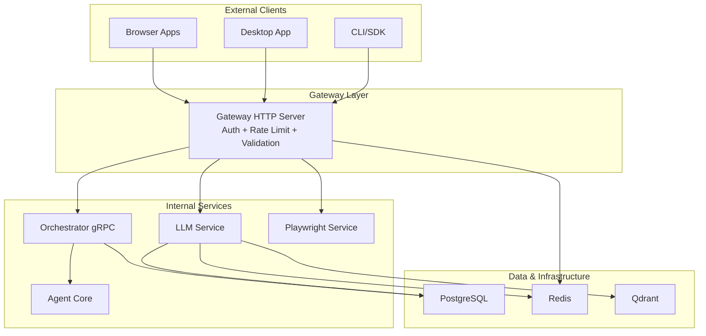
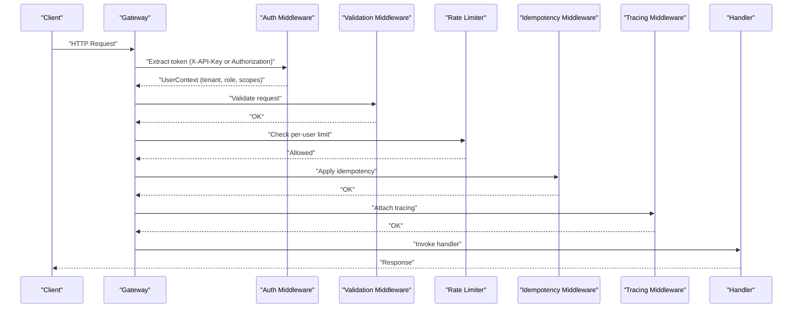
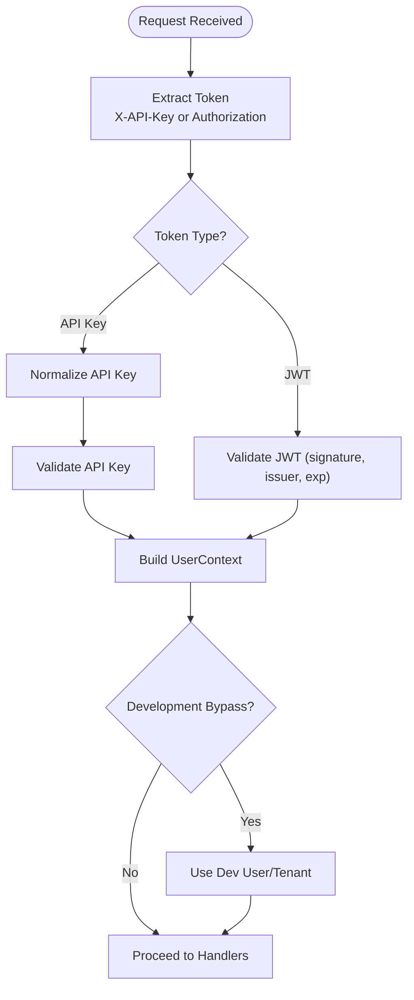
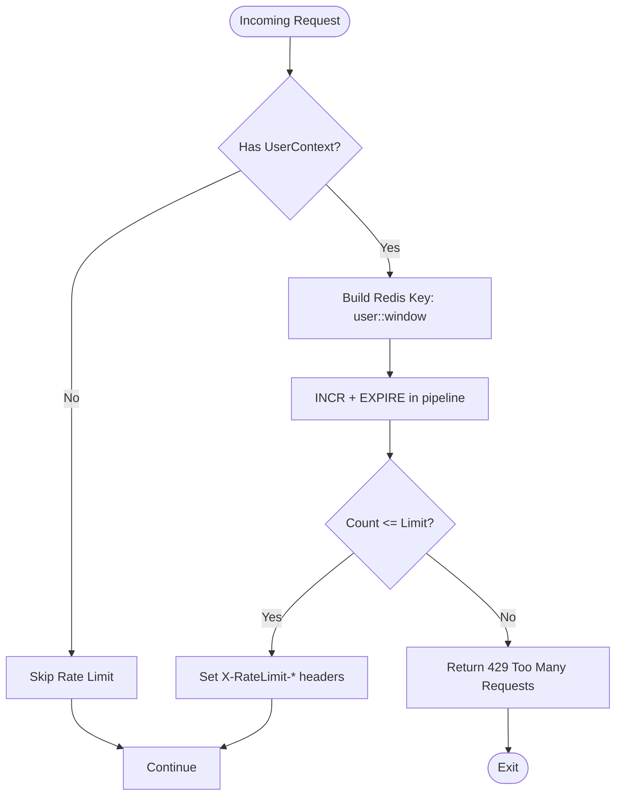
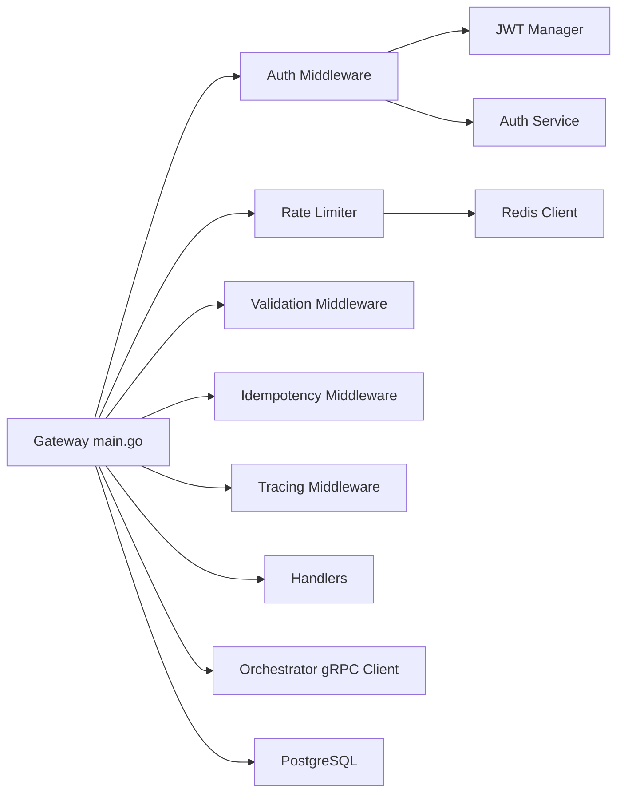

# Network Security Hardening

<cite>
**Referenced Files in This Document**
- [main.go](file://go/orchestrator/cmd/gateway/main.go)
- [auth.go](file://go/orchestrator/cmd/gateway/internal/middleware/auth.go)
- [ratelimit.go](file://go/orchestrator/cmd/gateway/internal/middleware/ratelimit.go)
- [jwt.go](file://go/orchestrator/internal/auth/jwt.go)
- [middleware.go](file://go/orchestrator/internal/auth/middleware.go)
- [types.go](file://go/orchestrator/internal/auth/types.go)
- [docker-compose.yml](file://deploy/compose/docker-compose.yml)
- [shannon.yaml](file://config/shannon.yaml)
</cite>

## Table of Contents
1. [Introduction](#introduction)
2. [Project Structure](#project-structure)
3. [Core Components](#core-components)
4. [Architecture Overview](#architecture-overview)
5. [Detailed Component Analysis](#detailed-component-analysis)
6. [Dependency Analysis](#dependency-analysis)
7. [Performance Considerations](#performance-considerations)
8. [Troubleshooting Guide](#troubleshooting-guide)
9. [Conclusion](#conclusion)
10. [Appendices](#appendices)

## Introduction
This document provides a comprehensive guide to network security hardening for Shannon’s gateway and service architecture. It covers ingress/egress filtering, TLS termination, secure communication protocols, network isolation, firewall rules, port security, authentication middleware, JWT validation, multi-tenant request isolation, secure API endpoint configurations, rate limiting, DDoS protection strategies, monitoring, intrusion detection, security event logging, certificate management, and compliance-ready deployment topologies.

## Project Structure
Shannon’s runtime stack comprises:
- Gateway HTTP server exposing REST and SSE/WebSocket endpoints
- Orchestrator gRPC backend
- LLM service, agent core, and auxiliary services
- Centralized Redis for rate limiting and idempotency
- PostgreSQL for persistence
- Qdrant for vector storage
- Grafana/Prometheus for observability

**Diagram sources**
- [docker-compose.yml](file://deploy/compose/docker-compose.yml#L1-L411)
- [main.go](file://go/orchestrator/cmd/gateway/main.go#L370-L411)

**Section sources**
- [docker-compose.yml](file://deploy/compose/docker-compose.yml#L1-L411)
- [main.go](file://go/orchestrator/cmd/gateway/main.go#L370-L411)

## Core Components
- Authentication and Authorization
  - API key and JWT support with multi-tenant isolation
  - Role-based scopes and permission checks
- Rate Limiting and DDoS Protection
  - Per-user rate limiting with Redis
  - Burst control and sliding window semantics
- Secure API Endpoints
  - Enforced middleware order: Auth → Validation → Rate Limit → Idempotency → Tracing → Handler
  - SSE/WebSocket proxies with authentication
- Network Isolation and Port Security
  - Shared Docker bridge network
  - Internal-only ports exposed via Compose
- Monitoring and Logging
  - Structured JSON logging, health/readiness endpoints
  - Prometheus/Grafana dashboards included

**Section sources**
- [auth.go](file://go/orchestrator/cmd/gateway/internal/middleware/auth.go#L24-L157)
- [jwt.go](file://go/orchestrator/internal/auth/jwt.go#L17-L143)
- [middleware.go](file://go/orchestrator/internal/auth/middleware.go#L23-L193)
- [ratelimit.go](file://go/orchestrator/cmd/gateway/internal/middleware/ratelimit.go#L15-L104)
- [main.go](file://go/orchestrator/cmd/gateway/main.go#L128-L134)

## Architecture Overview
The gateway enforces authentication, validation, rate limiting, and idempotency before forwarding requests to internal services. SSE/WebSocket streams are proxied to the admin server with authentication preserved.

**Diagram sources**
- [main.go](file://go/orchestrator/cmd/gateway/main.go#L128-L134)
- [auth.go](file://go/orchestrator/cmd/gateway/internal/middleware/auth.go#L49-L157)
- [ratelimit.go](file://go/orchestrator/cmd/gateway/internal/middleware/ratelimit.go#L35-L74)

## Detailed Component Analysis

### Authentication and Multi-Tenant Isolation
- Token extraction supports:
  - X-API-Key header (always API key)
  - Authorization: Bearer <token> (JWT detection logic distinguishes JWT vs. API key)
  - Query parameters for SSE/WebSocket endpoints
- JWT validation includes:
  - HMAC signature verification
  - Issuer check and expiration
  - Claims parsing into UserContext with tenant isolation
- API key normalization converts external format to internal format
- Development override allows bypass with controlled headers and default tenant/user

**Diagram sources**
- [auth.go](file://go/orchestrator/cmd/gateway/internal/middleware/auth.go#L159-L239)
- [jwt.go](file://go/orchestrator/internal/auth/jwt.go#L94-L143)

**Section sources**
- [auth.go](file://go/orchestrator/cmd/gateway/internal/middleware/auth.go#L159-L239)
- [jwt.go](file://go/orchestrator/internal/auth/jwt.go#L94-L143)
- [middleware.go](file://go/orchestrator/internal/auth/middleware.go#L39-L114)
- [types.go](file://go/orchestrator/internal/auth/types.go#L104-L125)

### Rate Limiting and DDoS Protection
- Per-user sliding window rate limiting using Redis
- Default: 60 requests per minute with burst allowance
- Headers expose current limits and reset time
- Fail-open behavior on Redis errors to avoid blocking traffic

**Diagram sources**
- [ratelimit.go](file://go/orchestrator/cmd/gateway/internal/middleware/ratelimit.go#L77-L104)

**Section sources**
- [ratelimit.go](file://go/orchestrator/cmd/gateway/internal/middleware/ratelimit.go#L15-L104)

### Secure API Endpoint Configuration
- Middleware order ensures consistent security posture:
  - Auth → Validation → Rate Limit → Idempotency → Tracing → Handler
- OpenAI-compatible endpoints (/v1/*) are gated behind the same middleware stack
- SSE/WebSocket endpoints are proxied with authentication preserved
- Health and OpenAPI specs are publicly accessible without authentication

**Section sources**
- [main.go](file://go/orchestrator/cmd/gateway/main.go#L128-L134)
- [main.go](file://go/orchestrator/cmd/gateway/main.go#L502-L538)
- [main.go](file://go/orchestrator/cmd/gateway/main.go#L540-L600)

### Network Isolation and Firewall Rules
- All services share a single Docker bridge network named shannon-net
- Internal-only ports are exposed:
  - Gateway: 8080
  - Orchestrator: 50052, 8081
  - LLM Service: 8000
  - Agent Core: 50051, 2113
  - Playwright: 8002
  - Temporal: 7233
  - Postgres: 5432
  - Redis: 6379
  - Qdrant: 6333
- No explicit firewall rules are defined in Compose; isolation relies on container networking and internal DNS resolution

**Section sources**
- [docker-compose.yml](file://deploy/compose/docker-compose.yml#L3-L6)
- [docker-compose.yml](file://deploy/compose/docker-compose.yml#L14-L411)

### TLS Termination and Secure Protocols
- Current deployment does not configure TLS termination at the gateway
- gRPC connections to orchestrator are insecure by default
- Recommendations:
  - Configure TLS termination at the gateway (e.g., NGINX or Envoy) with strong ciphers and modern protocol versions
  - Enforce HTTPS redirects and HSTS headers
  - Use mutual TLS (mTLS) for internal gRPC communications
  - Rotate certificates regularly and automate renewal via ACME clients

[No sources needed since this section provides general guidance]

### Certificate Management and Automated Renewal
- Generate strong secrets for JWT and database connections
- Store secrets in a secrets manager or environment vault
- Automate certificate issuance and renewal using ACME (Let’s Encrypt) with cron or Kubernetes Cert-Manager
- Enforce certificate pinning and OCSP stapling where applicable

[No sources needed since this section provides general guidance]

### Monitoring, Intrusion Detection, and Security Logging
- Structured JSON logging is enabled for production
- Health and readiness endpoints aid in monitoring
- Grafana dashboards and Prometheus are included for metrics
- Recommendations:
  - Deploy SIEM and IDS/IPS for anomaly detection
  - Centralize logs to a SIEM with correlation rules
  - Monitor rate limit exceedances, failed authentications, and unusual request patterns
  - Alert on repeated 401/403 and 429 responses

**Section sources**
- [shannon.yaml](file://config/shannon.yaml#L274-L282)
- [docker-compose.yml](file://deploy/compose/docker-compose.yml#L1-L411)

### Compliance-Ready Configurations
- Enforce least privilege with role-based scopes
- Enable audit logging for sensitive actions
- Implement idempotency to prevent duplicate processing
- Use encrypted storage and transport for sensitive data
- Regularly review and update allowed domains for OpenAPI/MCP integrations

**Section sources**
- [types.go](file://go/orchestrator/internal/auth/types.go#L165-L182)
- [middleware.go](file://go/orchestrator/internal/auth/middleware.go#L195-L217)
- [shannon.yaml](file://config/shannon.yaml#L56-L157)

## Dependency Analysis
The gateway composes multiple middleware layers and integrates with Redis and PostgreSQL. The orchestrator and LLM service depend on shared infrastructure.

**Diagram sources**
- [main.go](file://go/orchestrator/cmd/gateway/main.go#L92-L134)
- [auth.go](file://go/orchestrator/cmd/gateway/internal/middleware/auth.go#L24-L46)
- [ratelimit.go](file://go/orchestrator/cmd/gateway/internal/middleware/ratelimit.go#L15-L32)

**Section sources**
- [main.go](file://go/orchestrator/cmd/gateway/main.go#L92-L134)
- [auth.go](file://go/orchestrator/cmd/gateway/internal/middleware/auth.go#L24-L46)
- [ratelimit.go](file://go/orchestrator/cmd/gateway/internal/middleware/ratelimit.go#L15-L32)

## Performance Considerations
- Redis-based rate limiting is efficient but requires reliable connectivity
- Streaming endpoints disable write timeouts to support long-lived connections
- Circuit breakers and degradation modes protect downstream systems during incidents

[No sources needed since this section provides general guidance]

## Troubleshooting Guide
- Authentication failures:
  - Verify token format and presence in headers or query parameters
  - Confirm JWT secret matches across services
- Rate limit exceeded:
  - Inspect X-RateLimit-* headers and Retry-After
  - Review Redis connectivity and pipeline execution
- CORS issues:
  - Streaming endpoints require specific CORS headers for GET requests
- Health/readiness:
  - Use /health and /readiness endpoints for quick diagnostics

**Section sources**
- [auth.go](file://go/orchestrator/cmd/gateway/internal/middleware/auth.go#L233-L239)
- [ratelimit.go](file://go/orchestrator/cmd/gateway/internal/middleware/ratelimit.go#L106-L117)
- [main.go](file://go/orchestrator/cmd/gateway/main.go#L641-L670)

## Conclusion
Shannon’s gateway implements robust authentication, multi-tenant isolation, and rate limiting. To achieve hardened production-grade security, deploy TLS termination, enforce mTLS for internal gRPC, segment networks further with firewalls, automate certificate management, and integrate comprehensive monitoring and IDS. Align configurations with compliance requirements and continuously validate controls.

[No sources needed since this section summarizes without analyzing specific files]

## Appendices

### Secure Deployment Topologies
- Edge TLS termination with internal mTLS between gateway and orchestrator
- Dedicated subnets for data plane (Postgres, Redis, Qdrant) and control plane (Temporal)
- WAF/Cloudflare for DDoS mitigation and L7 protection
- Private link/VPC peering for cloud-native deployments

[No sources needed since this section provides general guidance]

### Port Security Checklist
- Restrict inbound ports to necessary ranges only
- Disable unused ports and services
- Enforce network policies (e.g., Calico) for pod-to-pod isolation
- Rotate credentials and secrets regularly

[No sources needed since this section provides general guidance]