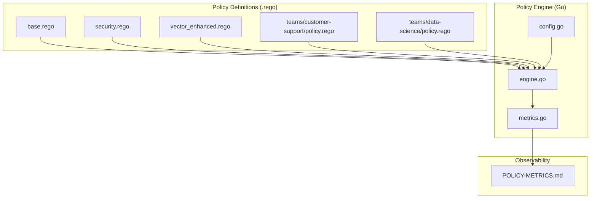
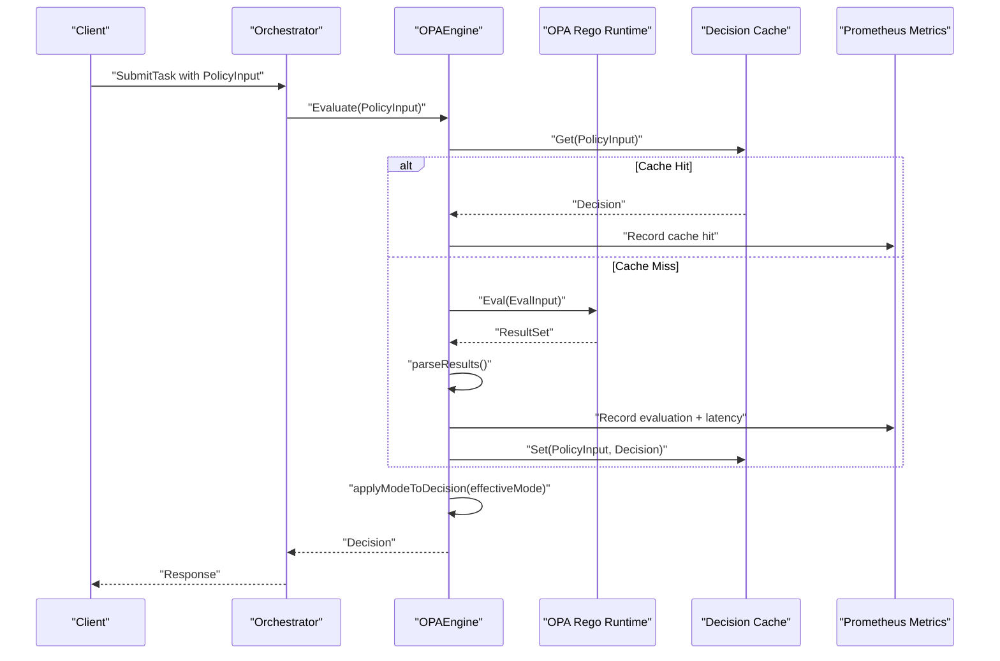
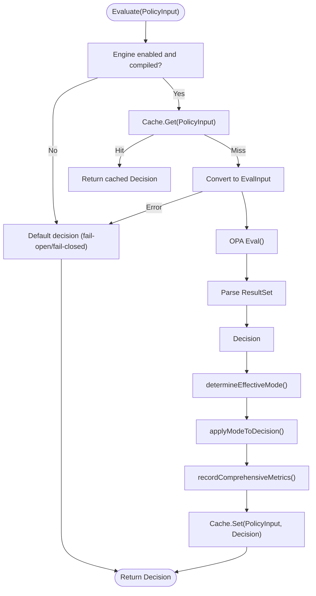
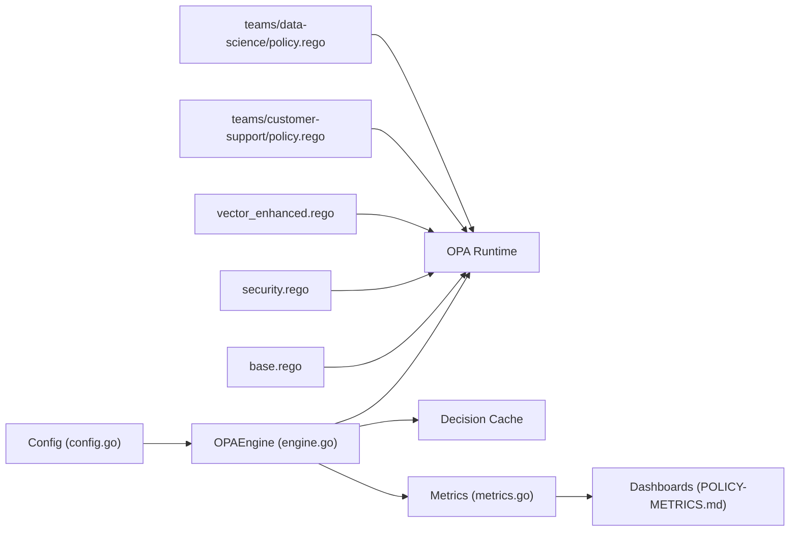

# Policy Engine Optimization

<cite>
**Referenced Files in This Document**
- [base.rego](file://config/opa/policies/base.rego)
- [security.rego](file://config/opa/policies/security.rego)
- [vector_enhanced.rego](file://config/opa/policies/vector_enhanced.rego)
- [customer-support/policy.rego](file://config/opa/policies/teams/customer-support/policy.rego)
- [data-science/policy.rego](file://config/opa/policies/teams/data-science/policy.rego)
- [shannon-policy-test.yaml](file://config/shannon-policy-test.yaml)
- [opa/README.md](file://config/opa/README.md)
- [engine.go](file://go/orchestrator/internal/policy/engine.go)
- [config.go](file://go/orchestrator/internal/policy/config.go)
- [metrics.go](file://go/orchestrator/internal/policy/metrics.go)
- [POLICY-METRICS.md](file://observability/POLICY-METRICS.md)
- [policy-killswitch.sh](file://go/orchestrator/scripts/policy-killswitch.sh)
- [run-policy-load-tests.sh](file://go/orchestrator/scripts/run-policy-load-tests.sh)
- [load_test.go](file://go/orchestrator/internal/policy/load_test.go)
- [engine_test.go](file://go/orchestrator/internal/policy/engine_test.go)
</cite>

## Table of Contents
1. [Introduction](#introduction)
2. [Project Structure](#project-structure)
3. [Core Components](#core-components)
4. [Architecture Overview](#architecture-overview)
5. [Detailed Component Analysis](#detailed-component-analysis)
6. [Dependency Analysis](#dependency-analysis)
7. [Performance Considerations](#performance-considerations)
8. [Troubleshooting Guide](#troubleshooting-guide)
9. [Conclusion](#conclusion)
10. [Appendices](#appendices)

## Introduction
This document provides a comprehensive guide to optimizing the Open Policy Agent (OPA) policy engine in Shannon. It covers policy development using the Rego language, performance optimization techniques, custom policy creation for teams, testing methodologies, debugging, monitoring, and deployment strategies. The goal is to help operators configure secure, efficient, and maintainable policy enforcement across environments from development to production.

## Project Structure
Shannon organizes policy logic in Rego files under config/opa/policies with modular composition:
- Base allow/deny rules and budget enforcement in base.rego
- Additional security controls in security.rego
- Vector-enhanced decision logic in vector_enhanced.rego
- Team-specific policies under teams/<team>/policy.rego
- Policy engine implementation in Go under go/orchestrator/internal/policy
- Observability and metrics under observability
- Test harness and scripts for load testing and emergency controls

**Diagram sources**
- [base.rego](file://config/opa/policies/base.rego#L1-L272)
- [security.rego](file://config/opa/policies/security.rego#L1-L52)
- [vector_enhanced.rego](file://config/opa/policies/vector_enhanced.rego#L1-L28)
- [customer-support/policy.rego](file://config/opa/policies/teams/customer-support/policy.rego#L1-L45)
- [data-science/policy.rego](file://config/opa/policies/teams/data-science/policy.rego#L1-L37)
- [config.go](file://go/orchestrator/internal/policy/config.go#L1-L296)
- [engine.go](file://go/orchestrator/internal/policy/engine.go#L1-L748)
- [metrics.go](file://go/orchestrator/internal/policy/metrics.go#L1-L232)
- [POLICY-METRICS.md](file://observability/POLICY-METRICS.md#L1-L203)

**Section sources**
- [base.rego](file://config/opa/policies/base.rego#L1-L272)
- [security.rego](file://config/opa/policies/security.rego#L1-L52)
- [vector_enhanced.rego](file://config/opa/policies/vector_enhanced.rego#L1-L28)
- [customer-support/policy.rego](file://config/opa/policies/teams/customer-support/policy.rego#L1-L45)
- [data-science/policy.rego](file://config/opa/policies/teams/data-science/policy.rego#L1-L37)
- [engine.go](file://go/orchestrator/internal/policy/engine.go#L1-L748)
- [config.go](file://go/orchestrator/internal/policy/config.go#L1-L296)
- [metrics.go](file://go/orchestrator/internal/policy/metrics.go#L1-L232)
- [POLICY-METRICS.md](file://observability/POLICY-METRICS.md#L1-L203)

## Core Components
- PolicyInput: Encapsulates request context (user, agent, query, mode, environment, token budget, optional vector context).
- Decision: Output of policy evaluation with allow flag, reason, optional approval requirement, and audit tags.
- OPAEngine: Loads and compiles Rego modules, evaluates inputs, applies canary enforcement, caches decisions, and records metrics.
- Config: Parses environment and YAML configuration for policy mode, path, fail-closed behavior, environment, canary rollout, and emergency kill-switch.
- Metrics: Exposes Prometheus metrics for evaluations, latency, cache performance, canary routing, deny reasons, and SLO tracking.

Key implementation highlights:
- Decision flow prioritizes deny rules over allow rules and supports dry-run vs enforce modes.
- Built-in LRU cache with TTL reduces evaluation latency for repeated inputs.
- Canary rollout with deterministic hashing ensures consistent routing across sessions.
- Comprehensive metrics enable SLO tracking and operational dashboards.

**Section sources**
- [engine.go](file://go/orchestrator/internal/policy/engine.go#L32-L83)
- [engine.go](file://go/orchestrator/internal/policy/engine.go#L197-L282)
- [engine.go](file://go/orchestrator/internal/policy/engine.go#L361-L456)
- [engine.go](file://go/orchestrator/internal/policy/engine.go#L458-L594)
- [config.go](file://go/orchestrator/internal/policy/config.go#L59-L83)
- [metrics.go](file://go/orchestrator/internal/policy/metrics.go#L11-L143)

## Architecture Overview
The policy engine integrates with the orchestrator to evaluate incoming requests against composed Rego policies. It supports staged rollouts, emergency controls, and robust observability.

**Diagram sources**
- [engine.go](file://go/orchestrator/internal/policy/engine.go#L197-L282)
- [engine.go](file://go/orchestrator/internal/policy/engine.go#L310-L359)
- [engine.go](file://go/orchestrator/internal/policy/engine.go#L535-L594)
- [metrics.go](file://go/orchestrator/internal/policy/metrics.go#L145-L179)

**Section sources**
- [engine.go](file://go/orchestrator/internal/policy/engine.go#L197-L282)
- [engine.go](file://go/orchestrator/internal/policy/engine.go#L535-L594)
- [metrics.go](file://go/orchestrator/internal/policy/metrics.go#L145-L179)

## Detailed Component Analysis

### Policy Development with Rego
- Base allow/deny rules: Define environment-specific allowances, user/agent allowlists, token budget enforcement, and deny precedence for dangerous patterns.
- Security overrides: Additional constraints such as approval requirements for complex tasks and suspicious session detection.
- Vector-enhanced decisions: Conditional allowance based on similarity to prior successful or denied queries and confidence scores.
- Team-specific policies: Granular controls by team context (e.g., model restrictions, token budgets, tool allowances).

Common patterns:
- Allow-list first approach with environment-specific overrides.
- Deny precedence: deny rules override allow rules.
- Context-aware decisions: leverage input.context and vector fields for dynamic behavior.

Examples by file:
- Base policy rules and budget enforcement: [base.rego](file://config/opa/policies/base.rego#L1-L272)
- Security overrides and approvals: [security.rego](file://config/opa/policies/security.rego#L1-L52)
- Vector-enhanced decisions: [vector_enhanced.rego](file://config/opa/policies/vector_enhanced.rego#L1-L28)
- Team-specific customer support policy: [customer-support/policy.rego](file://config/opa/policies/teams/customer-support/policy.rego#L1-L45)
- Team-specific data science policy: [data-science/policy.rego](file://config/opa/policies/teams/data-science/policy.rego#L1-L37)

**Section sources**
- [base.rego](file://config/opa/policies/base.rego#L1-L272)
- [security.rego](file://config/opa/policies/security.rego#L1-L52)
- [vector_enhanced.rego](file://config/opa/policies/vector_enhanced.rego#L1-L28)
- [customer-support/policy.rego](file://config/opa/policies/teams/customer-support/policy.rego#L1-L45)
- [data-science/policy.rego](file://config/opa/policies/teams/data-science/policy.rego#L1-L37)

### Policy Evaluation Flow and Canaries

**Diagram sources**
- [engine.go](file://go/orchestrator/internal/policy/engine.go#L197-L282)
- [engine.go](file://go/orchestrator/internal/policy/engine.go#L458-L594)
- [engine.go](file://go/orchestrator/internal/policy/engine.go#L609-L656)

**Section sources**
- [engine.go](file://go/orchestrator/internal/policy/engine.go#L197-L282)
- [engine.go](file://go/orchestrator/internal/policy/engine.go#L458-L594)
- [engine.go](file://go/orchestrator/internal/policy/engine.go#L609-L656)

### Policy Testing Methodologies
- Unit tests validate deny precedence, dry-run behavior, and configuration parsing.
- Load tests simulate high concurrency, cache stress, and security scenarios with latency budgets and error rate targets.
- Test harness supports targeted scenarios and benchmark comparisons.

Testing artifacts:
- Unit tests: [engine_test.go](file://go/orchestrator/internal/policy/engine_test.go#L1-L357)
- Load tests and scenarios: [load_test.go](file://go/orchestrator/internal/policy/load_test.go#L1-L618)
- Load test runner: [run-policy-load-tests.sh](file://go/orchestrator/scripts/run-policy-load-tests.sh#L1-L374)
- Test configuration example: [shannon-policy-test.yaml](file://config/shannon-policy-test.yaml#L1-L79)

Validation targets:
- P50 latency under 1ms for cached requests, P95 under 5ms overall.
- Error rate <1%, cache hit rate >80% for warmed scenarios.
- Throughput >500 ops/sec under high concurrency.

**Section sources**
- [engine_test.go](file://go/orchestrator/internal/policy/engine_test.go#L1-L357)
- [load_test.go](file://go/orchestrator/internal/policy/load_test.go#L1-L618)
- [run-policy-load-tests.sh](file://go/orchestrator/scripts/run-policy-load-tests.sh#L1-L374)
- [shannon-policy-test.yaml](file://config/shannon-policy-test.yaml#L1-L79)

### Policy Debugging and Monitoring
- Dry-run mode logs what would have happened in enforce mode, enabling visibility without blocking.
- Comprehensive metrics track evaluation counts, latency histograms, cache performance, canary routing, top deny reasons, and SLOs.
- Emergency kill-switch forces all requests to dry-run mode for immediate safety.
- Dashboards and alerting rules support proactive incident response.

Monitoring references:
- Metrics definitions and SLOs: [metrics.go](file://go/orchestrator/internal/policy/metrics.go#L11-L143)
- Production dashboard guidance: [POLICY-METRICS.md](file://observability/POLICY-METRICS.md#L1-L203)
- Kill-switch operations: [policy-killswitch.sh](file://go/orchestrator/scripts/policy-killswitch.sh#L1-L368)

**Section sources**
- [metrics.go](file://go/orchestrator/internal/policy/metrics.go#L11-L143)
- [POLICY-METRICS.md](file://observability/POLICY-METRICS.md#L1-L203)
- [policy-killswitch.sh](file://go/orchestrator/scripts/policy-killswitch.sh#L1-L368)

### Bundle Management, Hot-Reload, and Deployment
- Policy files are loaded from a configured directory and compiled into a prepared query for fast evaluation.
- Hot-reload: Changes to .rego files trigger automatic recompilation and reload without restarting services.
- Deployment strategies:
  - Development: dry-run mode with verbose audit logging.
  - Staging: dry-run with reduced audit verbosity.
  - Production: enforce mode with fail-closed behavior and emergency kill-switch capability.

Deployment references:
- Policy loading and compilation: [engine.go](file://go/orchestrator/internal/policy/engine.go#L117-L195)
- Policy configuration and environment integration: [config.go](file://go/orchestrator/internal/policy/config.go#L85-L209)
- Operational guidance and hot-reload: [opa/README.md](file://config/opa/README.md#L348-L355)

**Section sources**
- [engine.go](file://go/orchestrator/internal/policy/engine.go#L117-L195)
- [config.go](file://go/orchestrator/internal/policy/config.go#L85-L209)
- [opa/README.md](file://config/opa/README.md#L348-L355)

## Dependency Analysis

**Diagram sources**
- [config.go](file://go/orchestrator/internal/policy/config.go#L59-L83)
- [engine.go](file://go/orchestrator/internal/policy/engine.go#L85-L93)
- [metrics.go](file://go/orchestrator/internal/policy/metrics.go#L11-L143)
- [base.rego](file://config/opa/policies/base.rego#L1-L272)
- [security.rego](file://config/opa/policies/security.rego#L1-L52)
- [vector_enhanced.rego](file://config/opa/policies/vector_enhanced.rego#L1-L28)
- [customer-support/policy.rego](file://config/opa/policies/teams/customer-support/policy.rego#L1-L45)
- [data-science/policy.rego](file://config/opa/policies/teams/data-science/policy.rego#L1-L37)
- [POLICY-METRICS.md](file://observability/POLICY-METRICS.md#L1-L203)

**Section sources**
- [config.go](file://go/orchestrator/internal/policy/config.go#L59-L83)
- [engine.go](file://go/orchestrator/internal/policy/engine.go#L85-L93)
- [metrics.go](file://go/orchestrator/internal/policy/metrics.go#L11-L143)

## Performance Considerations
- Query optimization:
  - Prefer simple, deterministic rules and avoid expensive computations in hot paths.
  - Use allow-lists and deny precedence to minimize branching.
  - Keep patterns and sets small; leverage indexing-friendly structures.
- Caching strategies:
  - Engine includes an LRU cache with TTL keyed by environment, mode, user, agent, token budget, rounded complexity, and hashed query.
  - Aim for high cache hit rates (>80%) by reducing input variability and ensuring warm-up in load tests.
- Bundle loading:
  - Load policies once at startup; rely on hot-reload for iterative updates.
  - Validate policy syntax before deployment to avoid runtime compilation errors.
- Latency targets:
  - P50 <1ms for cached requests, P95 <5ms overall.
  - Monitor SLO latency histograms and error rates continuously.

[No sources needed since this section provides general guidance]

## Troubleshooting Guide
Common issues and resolutions:
- Policy not loading:
  - Verify .rego syntax and file permissions.
  - Check orchestrator logs for compilation errors.
- Unexpected denials:
  - Review deny precedence and environment-specific rules.
  - Confirm user IDs and agent IDs match allowlists.
- Policy not enforcing:
  - Ensure policy.enabled=true and mode=enforce.
  - Confirm policy.path points to the correct directory.
- High latency:
  - Improve cache hit rate by reducing input variance.
  - Simplify complex rules or precompute expensive checks.
- High error rate:
  - Inspect input conversion errors and policy evaluation failures.
  - Validate inputs and policy correctness.
- Emergency rollback:
  - Use kill-switch to force dry-run mode immediately.
  - Adjust canary percentage to reduce enforce traffic.

**Section sources**
- [opa/README.md](file://config/opa/README.md#L356-L372)
- [POLICY-METRICS.md](file://observability/POLICY-METRICS.md#L166-L187)
- [policy-killswitch.sh](file://go/orchestrator/scripts/policy-killswitch.sh#L101-L139)

## Conclusion
Shannon’s OPA-based policy engine provides a flexible, observable, and safe framework for enforcing security and resource governance across environments. By leveraging deny precedence, environment-specific rules, team policies, and vector-enhanced decisions, operators can tailor enforcement to organizational needs. The built-in canary rollout, emergency kill-switch, comprehensive metrics, and load testing suite enable gradual, safe adoption and continuous performance validation.

[No sources needed since this section summarizes without analyzing specific files]

## Appendices

### Policy Development Checklist
- Define environment-specific rules and user/agent allowlists.
- Implement deny precedence for dangerous patterns.
- Add security overrides and approval workflows.
- Integrate vector-enhanced decisions when context is available.
- Create team-specific policies with tailored constraints.
- Validate with unit and load tests; monitor SLOs in production.

**Section sources**
- [base.rego](file://config/opa/policies/base.rego#L1-L272)
- [security.rego](file://config/opa/policies/security.rego#L1-L52)
- [vector_enhanced.rego](file://config/opa/policies/vector_enhanced.rego#L1-L28)
- [customer-support/policy.rego](file://config/opa/policies/teams/customer-support/policy.rego#L1-L45)
- [data-science/policy.rego](file://config/opa/policies/teams/data-science/policy.rego#L1-L37)
- [engine_test.go](file://go/orchestrator/internal/policy/engine_test.go#L1-L357)
- [load_test.go](file://go/orchestrator/internal/policy/load_test.go#L1-L618)

### Multi-Tenant Isolation Patterns
- Use input.context.team to segment policies by team.
- Enforce distinct model allowlists, token budgets, and tool restrictions per tenant.
- Combine with canary rollout to gradually expand access.

**Section sources**
- [customer-support/policy.rego](file://config/opa/policies/teams/customer-support/policy.rego#L1-L45)
- [data-science/policy.rego](file://config/opa/policies/teams/data-science/policy.rego#L1-L37)