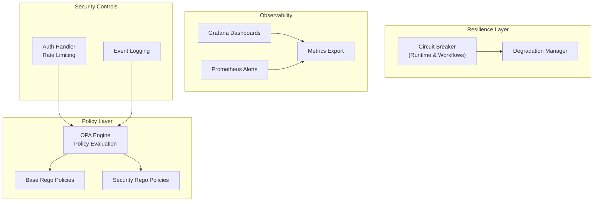
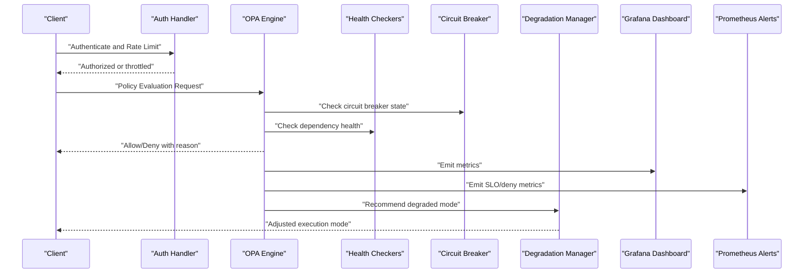
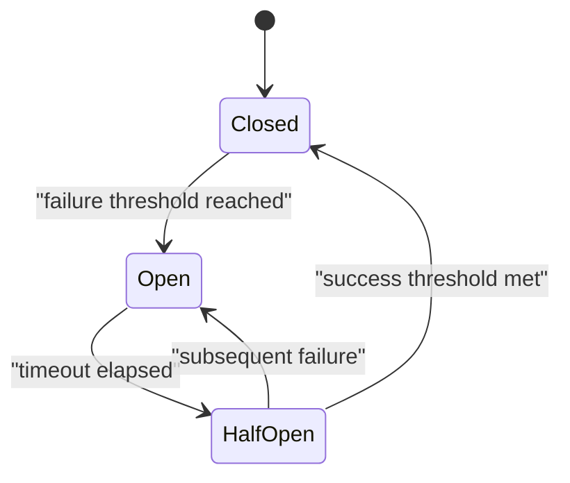
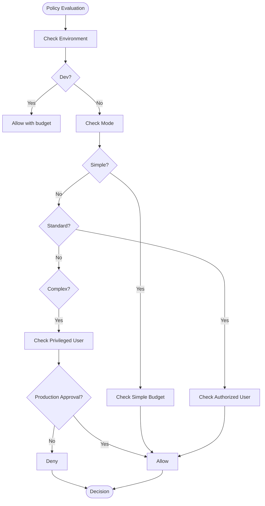
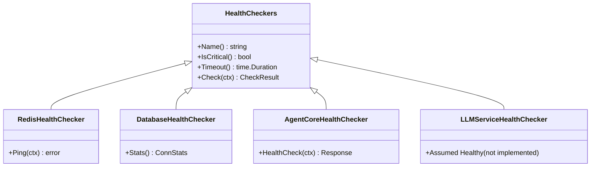
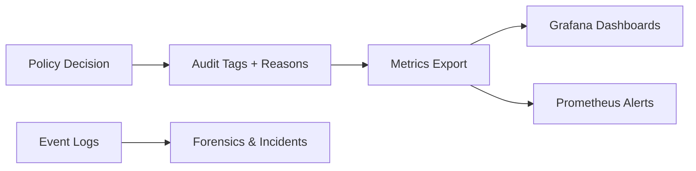
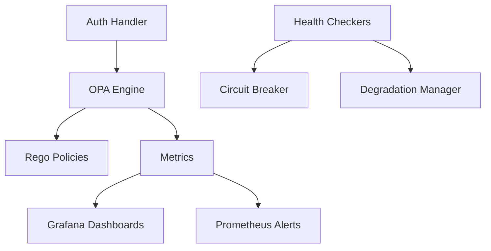

# Threat Detection and Mitigation

<cite>
**Referenced Files in This Document**
- [circuit_breaker.go](file://go/orchestrator/internal/circuitbreaker/circuit_breaker.go)
- [checkers.go](file://go/orchestrator/internal/health/checkers.go)
- [manager.go](file://go/orchestrator/internal/degradation/manager.go)
- [engine.go](file://go/orchestrator/internal/policy/engine.go)
- [security.rego](file://config/opa/policies/security.rego)
- [base.rego](file://config/opa/policies/base.rego)
- [enforcement.json](file://observability/grafana/dashboards/enforcement.json)
- [alerts.yml](file://observability/prometheus/alerts.yml)
- [metrics.go](file://go/orchestrator/internal/metrics/metrics.go)
- [event_log.go](file://go/orchestrator/internal/db/event_log.go)
- [auth.go](file://go/orchestrator/cmd/gateway/internal/handlers/auth.go)
- [circuit_breaker.go](file://go/orchestrator/internal/workflows/circuit_breaker.go)
</cite>

## Table of Contents
1. [Introduction](#introduction)
2. [Project Structure](#project-structure)
3. [Core Components](#core-components)
4. [Architecture Overview](#architecture-overview)
5. [Detailed Component Analysis](#detailed-component-analysis)
6. [Dependency Analysis](#dependency-analysis)
7. [Performance Considerations](#performance-considerations)
8. [Troubleshooting Guide](#troubleshooting-guide)
9. [Conclusion](#conclusion)
10. [Appendices](#appendices)

## Introduction
This document presents advanced threat detection and mitigation strategies implemented in Shannon. It covers anomaly detection via circuit breaker patterns, health and failure monitoring, intrusion prevention through policy engines, automated threat response, and incident containment. It also documents security event correlation, log analysis, forensic investigation, monitoring dashboards, alerting thresholds, escalation procedures, vulnerability assessment, penetration testing, security scanning integration, incident response playbooks, and compliance and audit reporting capabilities.

## Project Structure
Shannon’s threat detection and mitigation spans several layers:
- Policy enforcement using Open Policy Agent (OPA) Rego policies
- Health monitoring and circuit breakers for resilience
- Degradation management and partial-result handling
- Observability via Grafana dashboards and Prometheus alerts
- Authentication and rate-limiting controls
- Event logging for forensics

**Diagram sources**
- [engine.go](file://go/orchestrator/internal/policy/engine.go#L85-L115)
- [base.rego](file://config/opa/policies/base.rego#L1-L272)
- [security.rego](file://config/opa/policies/security.rego#L1-L52)
- [circuit_breaker.go](file://go/orchestrator/internal/circuitbreaker/circuit_breaker.go#L70-L94)
- [circuit_breaker.go](file://go/orchestrator/internal/workflows/circuit_breaker.go#L20-L41)
- [manager.go](file://go/orchestrator/internal/degradation/manager.go#L11-L46)
- [enforcement.json](file://observability/grafana/dashboards/enforcement.json#L1-L55)
- [alerts.yml](file://observability/prometheus/alerts.yml#L1-L143)
- [metrics.go](file://go/orchestrator/internal/metrics/metrics.go#L8-L630)
- [auth.go](file://go/orchestrator/cmd/gateway/internal/handlers/auth.go#L22-L42)
- [event_log.go](file://go/orchestrator/internal/db/event_log.go#L10-L22)

**Section sources**
- [engine.go](file://go/orchestrator/internal/policy/engine.go#L85-L115)
- [base.rego](file://config/opa/policies/base.rego#L1-L272)
- [security.rego](file://config/opa/policies/security.rego#L1-L52)
- [circuit_breaker.go](file://go/orchestrator/internal/circuitbreaker/circuit_breaker.go#L70-L94)
- [circuit_breaker.go](file://go/orchestrator/internal/workflows/circuit_breaker.go#L20-L41)
- [manager.go](file://go/orchestrator/internal/degradation/manager.go#L11-L46)
- [enforcement.json](file://observability/grafana/dashboards/enforcement.json#L1-L55)
- [alerts.yml](file://observability/prometheus/alerts.yml#L1-L143)
- [metrics.go](file://go/orchestrator/internal/metrics/metrics.go#L8-L630)
- [auth.go](file://go/orchestrator/cmd/gateway/internal/handlers/auth.go#L22-L42)
- [event_log.go](file://go/orchestrator/internal/db/event_log.go#L10-L22)

## Core Components
- Policy Engine (OPA): Evaluates allow/deny decisions, supports canary rollouts, dry-run, and enforcement modes. Records SLOs, cache hits/misses, and deny reasons for dashboards and alerts.
- Circuit Breaker: Prevents cascading failures by tripping under sustained errors and gradually probing recovery in half-open state.
- Health Monitoring: Periodic checks of Redis, database, agent-core, and LLM service; integrates circuit breaker state and latency thresholds.
- Degradation Manager: Coordinates system health, recommends safer execution modes, and decides partial-result returns.
- Observability: Grafana dashboards and Prometheus alerts for policy SLOs, enforcement drops, circuit breaker status, and service health.
- Authentication and Rate Limiting: Sliding window rate limiter and IP attribution for abuse prevention.
- Event Logging: Structured event logs for forensics and incident analysis.

**Section sources**
- [engine.go](file://go/orchestrator/internal/policy/engine.go#L197-L282)
- [circuit_breaker.go](file://go/orchestrator/internal/circuitbreaker/circuit_breaker.go#L70-L94)
- [checkers.go](file://go/orchestrator/internal/health/checkers.go#L19-L88)
- [manager.go](file://go/orchestrator/internal/degradation/manager.go#L101-L120)
- [enforcement.json](file://observability/grafana/dashboards/enforcement.json#L10-L51)
- [alerts.yml](file://observability/prometheus/alerts.yml#L6-L37)
- [auth.go](file://go/orchestrator/cmd/gateway/internal/handlers/auth.go#L17-L20)
- [event_log.go](file://go/orchestrator/internal/db/event_log.go#L10-L22)

## Architecture Overview
The system enforces security and resilience across request processing:
- Requests pass through authentication and rate limiting.
- Policy engine evaluates allow/deny with canary and dry-run modes.
- Health checks and circuit breakers guard downstream dependencies.
- Degradation manager adjusts execution mode and partial results.
- Metrics and logs feed dashboards and alerts for continuous monitoring.

**Diagram sources**
- [auth.go](file://go/orchestrator/cmd/gateway/internal/handlers/auth.go#L167-L274)
- [engine.go](file://go/orchestrator/internal/policy/engine.go#L197-L282)
- [checkers.go](file://go/orchestrator/internal/health/checkers.go#L41-L87)
- [circuit_breaker.go](file://go/orchestrator/internal/circuitbreaker/circuit_breaker.go#L129-L145)
- [manager.go](file://go/orchestrator/internal/degradation/manager.go#L178-L206)
- [enforcement.json](file://observability/grafana/dashboards/enforcement.json#L10-L51)
- [alerts.yml](file://observability/prometheus/alerts.yml#L6-L37)

## Detailed Component Analysis

### Anomaly Detection Using Circuit Breaker Patterns
- Runtime Circuit Breaker: Tracks consecutive successes/failures and transitions between closed, half-open, and open states. Enforces timeouts and thresholds to prevent overload and probe recovery.
- Workflow Circuit Breaker: Applies the same logic inside Temporal workflows, logging transitions and preventing execution when open.
- Health Integration: Health checks inspect circuit breaker state and surface degraded/high-latency conditions.

**Diagram sources**
- [circuit_breaker.go](file://go/orchestrator/internal/circuitbreaker/circuit_breaker.go#L15-L32)
- [circuit_breaker.go](file://go/orchestrator/internal/circuitbreaker/circuit_breaker.go#L180-L207)
- [circuit_breaker.go](file://go/orchestrator/internal/workflows/circuit_breaker.go#L14-L18)
- [circuit_breaker.go](file://go/orchestrator/internal/workflows/circuit_breaker.go#L126-L178)

**Section sources**
- [circuit_breaker.go](file://go/orchestrator/internal/circuitbreaker/circuit_breaker.go#L70-L250)
- [circuit_breaker.go](file://go/orchestrator/internal/workflows/circuit_breaker.go#L20-L191)
- [checkers.go](file://go/orchestrator/internal/health/checkers.go#L41-L87)

### Intrusion Prevention Systems and Automated Threat Response
- Policy Engine: Evaluates inputs against base and security policies, supports canary rollouts, dry-run, and enforcement modes. Records SLOs, deny reasons, and cache behavior for observability.
- Security Policies: Deny rules override allows; blocks suspicious and dangerous patterns, enforces token budgets, and restricts production approvals for complex tasks.
- Base Allowlist: Per-mode budgets, user/agent allowlists, and environment-specific rules (dev allows all; prod requires approvals and budgets).

**Diagram sources**
- [engine.go](file://go/orchestrator/internal/policy/engine.go#L197-L282)
- [base.rego](file://config/opa/policies/base.rego#L31-L76)
- [security.rego](file://config/opa/policies/security.rego#L6-L15)

**Section sources**
- [engine.go](file://go/orchestrator/internal/policy/engine.go#L85-L115)
- [engine.go](file://go/orchestrator/internal/policy/engine.go#L197-L282)
- [base.rego](file://config/opa/policies/base.rego#L16-L76)
- [security.rego](file://config/opa/policies/security.rego#L6-L15)

### Health Check Monitoring and Failure Detection Mechanisms
- Redis, Database, Agent Core, and LLM Service health checks integrate circuit breaker state and latency thresholds. Results include status, message, error, and details for diagnostics.
- Degradation Manager periodically updates dependency health metrics and overall degradation level.

**Diagram sources**
- [checkers.go](file://go/orchestrator/internal/health/checkers.go#L19-L88)
- [checkers.go](file://go/orchestrator/internal/health/checkers.go#L90-L169)
- [checkers.go](file://go/orchestrator/internal/health/checkers.go#L171-L241)
- [checkers.go](file://go/orchestrator/internal/health/checkers.go#L243-L284)

**Section sources**
- [checkers.go](file://go/orchestrator/internal/health/checkers.go#L19-L311)
- [manager.go](file://go/orchestrator/internal/degradation/manager.go#L101-L120)

### Security Event Correlation, Log Analysis, and Forensic Investigation
- Event Logging: Structured event logs capture workflow events with timestamps, sequences, and payloads for forensics.
- Policy Decisions: Audit tags and reasons are recorded for each decision, enabling correlation with metrics and dashboards.
- Observability: Grafana dashboards display enforcement drops and circuit breaker status; Prometheus alerts track SLOs and anomalies.

**Diagram sources**
- [engine.go](file://go/orchestrator/internal/policy/engine.go#L609-L656)
- [event_log.go](file://go/orchestrator/internal/db/event_log.go#L10-L22)
- [enforcement.json](file://observability/grafana/dashboards/enforcement.json#L10-L51)
- [alerts.yml](file://observability/prometheus/alerts.yml#L6-L37)

**Section sources**
- [event_log.go](file://go/orchestrator/internal/db/event_log.go#L10-L54)
- [engine.go](file://go/orchestrator/internal/policy/engine.go#L609-L656)
- [enforcement.json](file://observability/grafana/dashboards/enforcement.json#L10-L51)
- [alerts.yml](file://observability/prometheus/alerts.yml#L6-L37)

### Monitoring Dashboards, Alerting Thresholds, and Escalation Procedures
- Enforcement Dashboard: Tracks enforcement drops by reason and circuit breaker drops over time.
- Prometheus Alerts: Policy error rate, latency, emergency kill switch, cache hit rate, denial rate, service downtime, workflow errors, and token usage spikes.
- Escalation: Critical alerts (PagerDuty) for policy SLO breaches and emergency kill switch; warnings (Slack) for cache and denial rates.

**Section sources**
- [enforcement.json](file://observability/grafana/dashboards/enforcement.json#L10-L51)
- [alerts.yml](file://observability/prometheus/alerts.yml#L6-L143)

### Vulnerability Assessment, Penetration Testing, and Security Scanning Integration
- Policy Controls: Dangerous and suspicious query patterns are blocked; token budgets constrain resource usage; environment-specific rules govern approvals.
- Authentication Controls: Sliding window rate limiting protects against brute force; IP attribution mitigates spoofing.
- Recommendations:
  - Integrate static/dynamic analysis into CI pipelines gated by policy decisions.
  - Use deny rules to block known vulnerable patterns and enforce budget caps.
  - Combine rate limiting with circuit breakers to mitigate DoS.

**Section sources**
- [base.rego](file://config/opa/policies/base.rego#L105-L189)
- [security.rego](file://config/opa/policies/security.rego#L6-L15)
- [auth.go](file://go/orchestrator/cmd/gateway/internal/handlers/auth.go#L718-L749)

### Incident Response Playbooks, Containment Strategies, and Recovery Procedures
- Containment:
  - Emergency Kill Switch: Forces dry-run mode for all requests.
  - Circuit Breakers: Trip on failures; probe recovery in half-open state.
  - Degradation Manager: Recommends safer execution modes and partial results.
- Recovery:
  - Monitor enforcement dashboard and alerts; address policy SLO breaches.
  - Inspect event logs and policy reasons for root cause.
  - Gradually increase thresholds and resume enforce mode after remediation.

**Section sources**
- [engine.go](file://go/orchestrator/internal/policy/engine.go#L462-L533)
- [circuit_breaker.go](file://go/orchestrator/internal/circuitbreaker/circuit_breaker.go#L180-L207)
- [manager.go](file://go/orchestrator/internal/degradation/manager.go#L178-L206)
- [enforcement.json](file://observability/grafana/dashboards/enforcement.json#L28-L51)
- [alerts.yml](file://observability/prometheus/alerts.yml#L28-L37)

### Security Posture Measurement
- Metrics: Policy evaluation counts, durations, cache hit/miss ratios, deny reasons, and SLOs.
- Dashboards: Enforcement trends and circuit breaker status.
- Compliance: Audit tags and policy versions enable tracking of policy deployments and decisions.

**Section sources**
- [metrics.go](file://go/orchestrator/internal/metrics/metrics.go#L609-L656)
- [engine.go](file://go/orchestrator/internal/policy/engine.go#L718-L747)
- [enforcement.json](file://observability/grafana/dashboards/enforcement.json#L10-L51)

### Compliance Requirements, Audit Trails, and Regulatory Reporting
- Audit Tags: Include session, agent, mode, and routing reasons for traceability.
- Policy Version Tracking: Hash-based version recording for deployment tracking.
- Event Logs: Structured logs support forensic analysis and audits.

**Section sources**
- [engine.go](file://go/orchestrator/internal/policy/engine.go#L609-L656)
- [engine.go](file://go/orchestrator/internal/policy/engine.go#L718-L747)
- [event_log.go](file://go/orchestrator/internal/db/event_log.go#L10-L54)

## Dependency Analysis
- Policy Engine depends on OPA Rego policies and emits metrics consumed by dashboards and alerts.
- Health Checkers depend on circuit breakers and external services; they feed degradation manager and metrics.
- Authentication handler depends on rate limiting and integrates with policy decisions indirectly via request volume and patterns.

**Diagram sources**
- [engine.go](file://go/orchestrator/internal/policy/engine.go#L117-L195)
- [checkers.go](file://go/orchestrator/internal/health/checkers.go#L41-L87)
- [metrics.go](file://go/orchestrator/internal/metrics/metrics.go#L8-L630)
- [auth.go](file://go/orchestrator/cmd/gateway/internal/handlers/auth.go#L167-L274)

**Section sources**
- [engine.go](file://go/orchestrator/internal/policy/engine.go#L117-L195)
- [checkers.go](file://go/orchestrator/internal/health/checkers.go#L41-L87)
- [metrics.go](file://go/orchestrator/internal/metrics/metrics.go#L8-L630)
- [auth.go](file://go/orchestrator/cmd/gateway/internal/handlers/auth.go#L167-L274)

## Performance Considerations
- Policy Engine:
  - Decision cache reduces evaluation overhead; monitor cache hit rate via alerts.
  - SLO latency histograms guide tuning of thresholds and resource allocation.
- Circuit Breaker:
  - Proper thresholds prevent overload while allowing recovery; tune timeouts based on service SLAs.
- Health Checks:
  - Latency thresholds differentiate healthy from degraded states; circuit breaker state prevents unnecessary load.

[No sources needed since this section provides general guidance]

## Troubleshooting Guide
- Policy SLO Breaches:
  - Investigate error rate and latency alerts; review deny reasons and cache hit rate.
- Emergency Kill Switch:
  - Confirm canary routing and emergency override; revert to normal mode after remediation.
- Circuit Breaker Open:
  - Check dependency health and latency; verify circuit breaker state transitions.
- Authentication Throttling:
  - Review rate-limiting logs and IP attribution; adjust thresholds if legitimate traffic is impacted.

**Section sources**
- [alerts.yml](file://observability/prometheus/alerts.yml#L6-L37)
- [engine.go](file://go/orchestrator/internal/policy/engine.go#L462-L533)
- [circuit_breaker.go](file://go/orchestrator/internal/circuitbreaker/circuit_breaker.go#L180-L207)
- [auth.go](file://go/orchestrator/cmd/gateway/internal/handlers/auth.go#L718-L749)

## Conclusion
Shannon’s threat detection and mitigation stack combines policy-driven enforcement, robust health monitoring, circuit breakers, and degradation management. Together with observability, event logging, and structured alerting, it enables automated threat response, incident containment, and continuous security posture measurement. Organizations can tailor policies, thresholds, and escalation procedures to align with compliance and operational requirements.

[No sources needed since this section summarizes without analyzing specific files]

## Appendices
- Common Attack Vectors and Mitigations:
  - Excessive token usage: Enforce per-mode budgets and monitor token usage spikes.
  - Suspicious queries: Block dangerous and suspicious patterns via policy deny rules.
  - DoS/Brute Force: Use sliding window rate limiting and circuit breakers.
- Security Posture Measurement:
  - Track policy SLOs, cache hit rate, deny rates, and enforcement drops.
- Compliance and Auditing:
  - Maintain audit tags, policy versions, and event logs for traceability and reporting.

[No sources needed since this section provides general guidance]