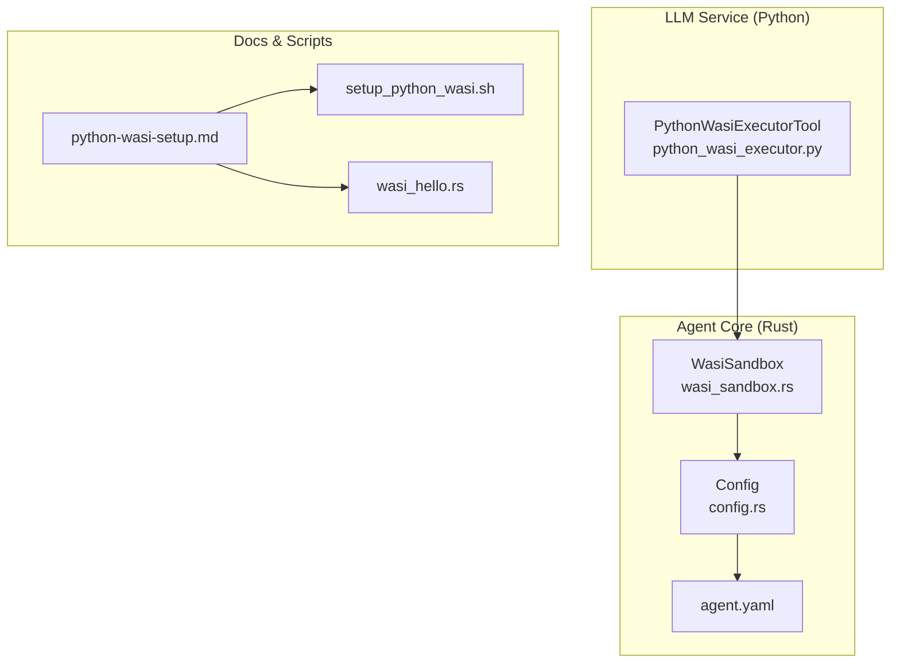
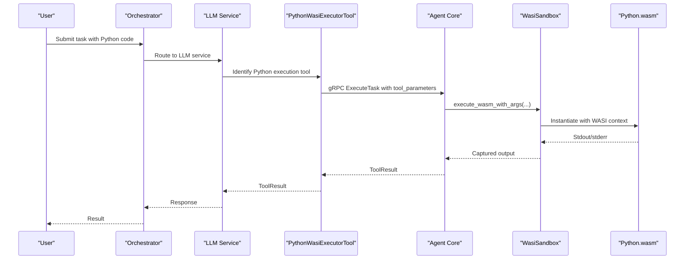
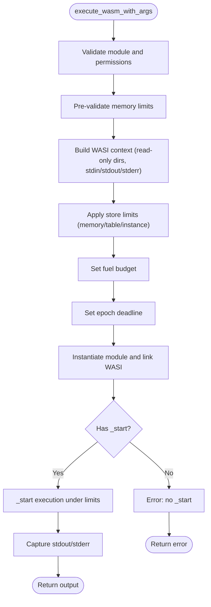
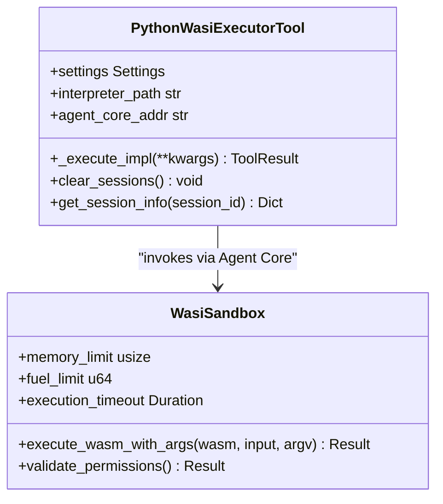

# WASI Sandbox Configuration

<cite>
**Referenced Files in This Document**
- [wasi_sandbox.rs](file://rust/agent-core/src/wasi_sandbox.rs)
- [config.rs](file://rust/agent-core/src/config.rs)
- [agent.yaml](file://rust/agent-core/config/agent.yaml)
- [python_wasi_executor.py](file://python/llm-service/llm_service/tools/builtin/python_wasi_executor.py)
- [python-wasi-setup.md](file://docs/python-wasi-setup.md)
- [setup_python_wasi.sh](file://scripts/setup_python_wasi.sh)
- [wasi_hello.rs](file://rust/agent-core/examples/wasi_hello.rs)
</cite>

## Table of Contents
1. [Introduction](#introduction)
2. [Project Structure](#project-structure)
3. [Core Components](#core-components)
4. [Architecture Overview](#architecture-overview)
5. [Detailed Component Analysis](#detailed-component-analysis)
6. [Dependency Analysis](#dependency-analysis)
7. [Performance Considerations](#performance-considerations)
8. [Troubleshooting Guide](#troubleshooting-guide)
9. [Conclusion](#conclusion)
10. [Appendices](#appendices)

## Introduction
This document explains the WASI sandbox configuration in Shannon, focusing on the security model (memory isolation, CPU limits, and resource controls), configuration parameters, and practical guidance for Python WASI integration. It covers how the Rust-based Agent Core enforces WASI sandboxing, how the LLM service integrates Python execution via WASI, and how to configure and troubleshoot WASI-based workloads.

## Project Structure
The WASI sandbox is implemented in the Rust Agent Core and integrated with the LLM service for Python execution. Configuration is centralized in the Agent Core’s YAML configuration and environment variables, and Python WASI integration is documented with setup scripts and examples.

**Diagram sources**
- [wasi_sandbox.rs](file://rust/agent-core/src/wasi_sandbox.rs#L15-L72)
- [config.rs](file://rust/agent-core/src/config.rs#L14-L37)
- [agent.yaml](file://rust/agent-core/config/agent.yaml#L4-L13)
- [python_wasi_executor.py](file://python/llm-service/llm_service/tools/builtin/python_wasi_executor.py#L54-L82)
- [python-wasi-setup.md](file://docs/python-wasi-setup.md#L1-L256)
- [setup_python_wasi.sh](file://scripts/setup_python_wasi.sh#L1-L173)
- [wasi_hello.rs](file://rust/agent-core/examples/wasi_hello.rs#L13-L29)

**Section sources**
- [wasi_sandbox.rs](file://rust/agent-core/src/wasi_sandbox.rs#L15-L72)
- [config.rs](file://rust/agent-core/src/config.rs#L14-L37)
- [agent.yaml](file://rust/agent-core/config/agent.yaml#L4-L13)
- [python_wasi_executor.py](file://python/llm-service/llm_service/tools/builtin/python_wasi_executor.py#L54-L82)
- [python-wasi-setup.md](file://docs/python-wasi-setup.md#L1-L256)
- [setup_python_wasi.sh](file://scripts/setup_python_wasi.sh#L1-L173)
- [wasi_hello.rs](file://rust/agent-core/examples/wasi_hello.rs#L13-L29)

## Core Components
- WasiSandbox: Implements WASI sandboxing with memory guards, epoch-based timeouts, fuel-based CPU limits, and read-only filesystem access. It validates module memory declarations and enforces store limits.
- Config: Defines WASI configuration fields (memory_limit_bytes, execution_timeout_secs, max_fuel, enable_filesystem, allowed_paths) and supports environment overrides.
- PythonWasiExecutorTool: Bridges Python code execution into the WASI sandbox via Agent Core, passing code as stdin and using argv conventions for the interpreter.
- Setup and Docs: Provide guidance for downloading and mounting the Python WASM interpreter, environment configuration, and troubleshooting.

Key configuration parameters:
- memory_limit_bytes: Controls linear memory growth limits.
- execution_timeout_secs: Epoch-interruption timeout for execution deadlines.
- max_fuel: Fuel-based CPU budgeting.
- enable_filesystem: Toggle for filesystem access.
- allowed_paths: Whitelist of read-only directories.

Security settings:
- Network access: Disabled by default via WASI preview1 semantics.
- Filesystem: Read-only access to whitelisted directories with canonicalization checks.
- Environment variables: Disabled by default; explicitly allowed only when configured.
- Subprocesses and clocks/random: Not exposed by default; no network or system capabilities.

**Section sources**
- [wasi_sandbox.rs](file://rust/agent-core/src/wasi_sandbox.rs#L15-L72)
- [wasi_sandbox.rs](file://rust/agent-core/src/wasi_sandbox.rs#L217-L326)
- [wasi_sandbox.rs](file://rust/agent-core/src/wasi_sandbox.rs#L435-L447)
- [config.rs](file://rust/agent-core/src/config.rs#L40-L60)
- [config.rs](file://rust/agent-core/src/config.rs#L372-L382)
- [agent.yaml](file://rust/agent-core/config/agent.yaml#L4-L13)
- [python_wasi_executor.py](file://python/llm-service/llm_service/tools/builtin/python_wasi_executor.py#L73-L82)

## Architecture Overview
The Python execution pipeline integrates the LLM service, Agent Core, and the WASI sandbox.

**Diagram sources**
- [python_wasi_executor.py](file://python/llm-service/llm_service/tools/builtin/python_wasi_executor.py#L310-L354)
- [wasi_sandbox.rs](file://rust/agent-core/src/wasi_sandbox.rs#L124-L194)
- [wasi_sandbox.rs](file://rust/agent-core/src/wasi_sandbox.rs#L333-L385)

## Detailed Component Analysis

### WasiSandbox Security Model and Resource Controls
- Memory isolation and guards: Linear memory guard size configured at engine level; store limits constrain memory growth and allocations.
- CPU limits: Fuel-based accounting; execution stops when fuel is exhausted.
- Timeouts: Epoch-interruption with periodic tick advancement; deadline set per store; configurable via execution_timeout_secs.
- Filesystem: Read-only preopened directories; canonicalization and OS-specific symlink handling; rejects non-canonical paths.
- Environment variables: Disabled by default; explicitly allowed only when configured.
- Network: Not granted by default; preview1 does not expose sockets; explicit opt-in would be required in future proposals.

**Diagram sources**
- [wasi_sandbox.rs](file://rust/agent-core/src/wasi_sandbox.rs#L124-L194)
- [wasi_sandbox.rs](file://rust/agent-core/src/wasi_sandbox.rs#L317-L385)

**Section sources**
- [wasi_sandbox.rs](file://rust/agent-core/src/wasi_sandbox.rs#L38-L72)
- [wasi_sandbox.rs](file://rust/agent-core/src/wasi_sandbox.rs#L217-L326)
- [wasi_sandbox.rs](file://rust/agent-core/src/wasi_sandbox.rs#L350-L365)
- [wasi_sandbox.rs](file://rust/agent-core/src/wasi_sandbox.rs#L435-L447)

### Configuration Parameters (Agent Core)
- memory_limit_bytes: Default 256MB; can be overridden via environment variable WASI_MEMORY_LIMIT_MB.
- execution_timeout_secs: Default 30s; can be overridden via WASI_TIMEOUT_SECONDS.
- max_fuel: Default 1 billion; controls CPU budget.
- enable_filesystem: Default true; toggles filesystem access.
- allowed_paths: Defaults to /tmp; can include additional read-only directories.

Environment overrides:
- WASI_MEMORY_LIMIT_MB
- WASI_TIMEOUT_SECONDS

These are applied in Config::from_env and consumed by WasiSandbox::with_config.

**Section sources**
- [config.rs](file://rust/agent-core/src/config.rs#L40-L60)
- [config.rs](file://rust/agent-core/src/config.rs#L372-L382)
- [agent.yaml](file://rust/agent-core/config/agent.yaml#L4-L13)

### Python WASI Integration
- Tool: PythonWasiExecutorTool submits Python code to Agent Core via gRPC, passing the Python WASM path and argv conventions (-c to execute stdin).
- Interpreter: Uses a full CPython 3.11.4 WASM interpreter by default; configurable via PYTHON_WASI_WASM_PATH.
- Sessions: Optional persistent execution sessions with variable capture and restoration.
- Limits: Tool-level timeout defaults to 30s; caller can specify up to 60s.

**Diagram sources**
- [python_wasi_executor.py](file://python/llm-service/llm_service/tools/builtin/python_wasi_executor.py#L54-L82)
- [python_wasi_executor.py](file://python/llm-service/llm_service/tools/builtin/python_wasi_executor.py#L273-L402)
- [wasi_sandbox.rs](file://rust/agent-core/src/wasi_sandbox.rs#L124-L194)

**Section sources**
- [python_wasi_executor.py](file://python/llm-service/llm_service/tools/builtin/python_wasi_executor.py#L73-L82)
- [python_wasi_executor.py](file://python/llm-service/llm_service/tools/builtin/python_wasi_executor.py#L310-L354)
- [python_wasi_executor.py](file://python/llm-service/llm_service/tools/builtin/python_wasi_executor.py#L403-L422)

### Setup Procedures and Interpreters
- Download and mount Python.wasm using the setup script or manual steps.
- Configure PYTHON_WASI_WASM_PATH and ensure Docker mounts are present.
- Test with wasmtime or via the example wasi_hello.rs.

Interpreters:
- Python.wasm (recommended): Full CPython 3.11.4 standard library.
- RustPython: Lightweight alternative (~95% compatibility).
- Pyodide: Data science stack (NumPy/Pandas) with adaptations.

**Section sources**
- [python-wasi-setup.md](file://docs/python-wasi-setup.md#L1-L256)
- [setup_python_wasi.sh](file://scripts/setup_python_wasi.sh#L1-L173)
- [wasi_hello.rs](file://rust/agent-core/examples/wasi_hello.rs#L13-L29)

## Dependency Analysis
- PythonWasiExecutorTool depends on Agent Core’s gRPC interface and WasiSandbox execution.
- WasiSandbox depends on Config for limits and timeouts; Config loads from agent.yaml and environment variables.
- Security posture depends on WasiCtxBuilder permissions and engine configuration.

**Diagram sources**
- [python_wasi_executor.py](file://python/llm-service/llm_service/tools/builtin/python_wasi_executor.py#L339-L354)
- [wasi_sandbox.rs](file://rust/agent-core/src/wasi_sandbox.rs#L37-L72)
- [config.rs](file://rust/agent-core/src/config.rs#L334-L366)
- [agent.yaml](file://rust/agent-core/config/agent.yaml#L4-L13)

**Section sources**
- [python_wasi_executor.py](file://python/llm-service/llm_service/tools/builtin/python_wasi_executor.py#L339-L354)
- [wasi_sandbox.rs](file://rust/agent-core/src/wasi_sandbox.rs#L37-L72)
- [config.rs](file://rust/agent-core/src/config.rs#L334-L366)
- [agent.yaml](file://rust/agent-core/config/agent.yaml#L4-L13)

## Performance Considerations
- Startup time: ~100–500ms for Python interpreter.
- Memory usage: Base ~50MB plus code overhead; configurable via memory_limit_bytes.
- Execution speed: ~50–70% of native Python.
- Best practices:
  - Keep code simple and focused.
  - Avoid large data structures.
  - Use efficient algorithms.
  - Minimize imports.
  - Tune timeouts and fuel budgets for workload characteristics.

[No sources needed since this section provides general guidance]

## Troubleshooting Guide
Common issues and resolutions:
- “Python WASI interpreter not found”: Ensure the WASM file exists at the configured path and Docker volume is mounted.
- “Execution timeout”: Increase execution_timeout_secs or tool-level timeout.
- “Memory limit exceeded”: Increase memory_limit_bytes.
- “Module not found”: Only standard library modules are available; external packages must be pre-bundled.
- “wat2wasm not found”: Install wasmtime or wabt for local testing; not required in production.

**Section sources**
- [python-wasi-setup.md](file://docs/python-wasi-setup.md#L145-L170)
- [python-wasi-setup.md](file://docs/python-wasi-setup.md#L147-L159)
- [python-wasi-setup.md](file://docs/python-wasi-setup.md#L161-L167)
- [setup_python_wasi.sh](file://scripts/setup_python_wasi.sh#L123-L138)

## Conclusion
Shannon’s WASI sandbox provides strong isolation through memory guards, epoch-based timeouts, fuel-based CPU limits, and read-only filesystem access. Configuration is centralized in agent.yaml with environment overrides, and Python WASI execution is integrated via the LLM service and Agent Core. By tuning resource limits and understanding interpreter constraints, operators can safely run Python workloads with predictable performance and security.

[No sources needed since this section summarizes without analyzing specific files]

## Appendices

### Practical Configuration Examples
- Resource limits:
  - Set memory_limit_bytes to 512MB via agent.yaml or WASI_MEMORY_LIMIT_MB.
  - Set execution_timeout_secs to 60s via agent.yaml or WASI_TIMEOUT_SECONDS.
- Python interpreter:
  - Configure PYTHON_WASI_WASM_PATH to point to the desired WASM.
  - Mount the interpreter directory into Agent Core and LLM service containers.
- Testing:
  - Use wasmtime with the example wasi_hello.rs to validate sandbox behavior locally.

**Section sources**
- [agent.yaml](file://rust/agent-core/config/agent.yaml#L4-L13)
- [config.rs](file://rust/agent-core/src/config.rs#L372-L382)
- [python-wasi-setup.md](file://docs/python-wasi-setup.md#L17-L31)
- [wasi_hello.rs](file://rust/agent-core/examples/wasi_hello.rs#L13-L29)