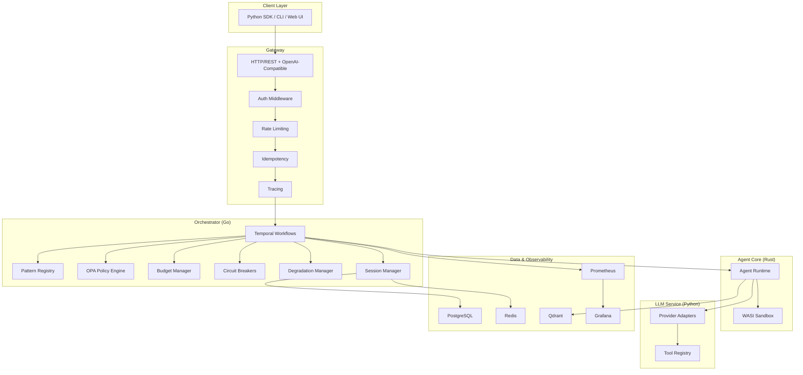
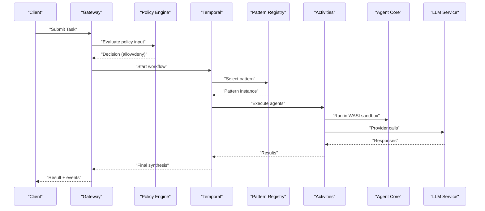
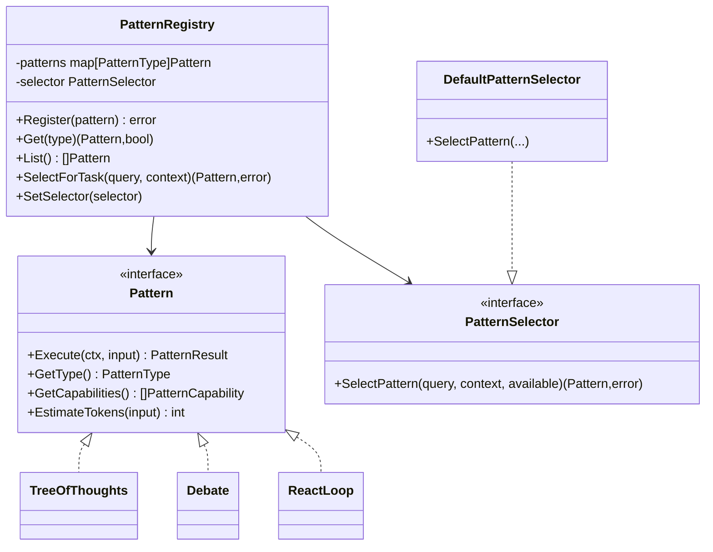
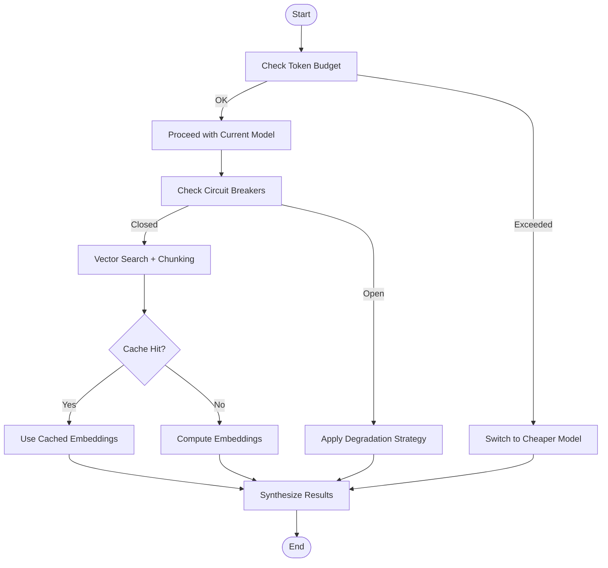
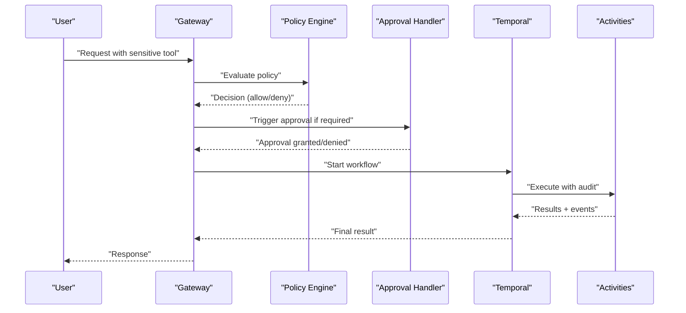
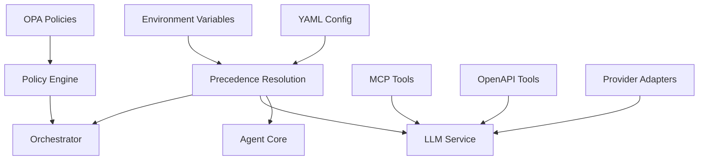
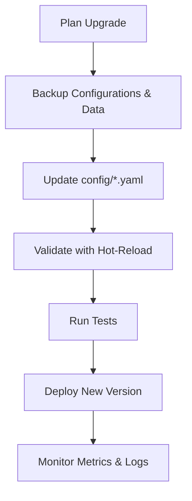
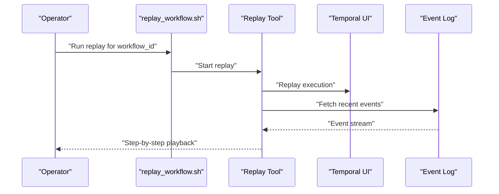
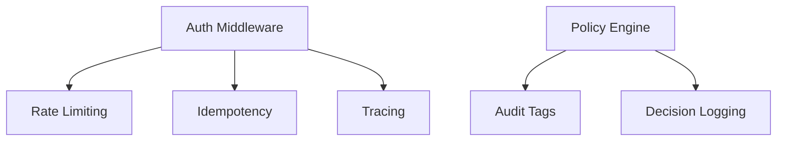
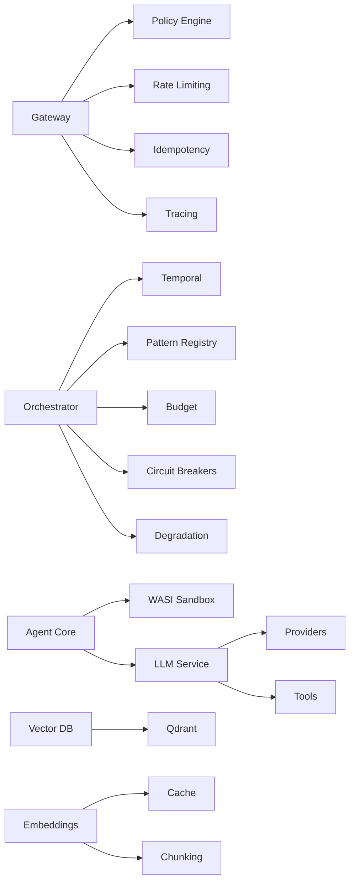

# Advanced Topics

<cite>
**Referenced Files in This Document**
- [README.md](file://README.md)
- [config/README.md](file://config/README.md)
- [config/shannon.yaml](file://config/shannon.yaml)
- [config/features.yaml](file://config/features.yaml)
- [config/models.yaml](file://config/models.yaml)
- [go/orchestrator/internal/policy/engine.go](file://go/orchestrator/internal/policy/engine.go)
- [go/orchestrator/internal/workflows/patterns/registry.go](file://go/orchestrator/internal/workflows/patterns/registry.go)
- [go/orchestrator/internal/workflows/patterns/tree_of_thoughts.go](file://go/orchestrator/internal/workflows/patterns/tree_of_thoughts.go)
- [go/orchestrator/internal/workflows/patterns/debate.go](file://go/orchestrator/internal/workflows/patterns/debate.go)
- [go/orchestrator/internal/workflows/patterns/react.go](file://go/orchestrator/internal/workflows/patterns/react.go)
- [deploy/compose/docker-compose.yml](file://deploy/compose/docker-compose.yml)
- [deploy/compose/docker-compose.release.yml](file://deploy/compose/docker-compose.release.yml)
- [scripts/replay_workflow.sh](file://scripts/replay_workflow.sh)
- [go/orchestrator/tools/replay/main.go](file://go/orchestrator/tools/replay/main.go)
- [go/orchestrator/tests/replay/workflow_replay_test.go](file://go/orchestrator/tests/replay/workflow_replay_test.go)
- [go/orchestrator/cmd/gateway/internal/handlers/approval.go](file://go/orchestrator/cmd/gateway/internal/handlers/approval.go)
- [go/orchestrator/cmd/gateway/internal/handlers/auth.go](file://go/orchestrator/cmd/gateway/internal/handlers/auth.go)
- [go/orchestrator/cmd/gateway/internal/middleware/auth.go](file://go/orchestrator/cmd/gateway/internal/middleware/auth.go)
- [go/orchestrator/cmd/gateway/internal/middleware/ratelimit.go](file://go/orchestrator/cmd/gateway/internal/middleware/ratelimit.go)
- [go/orchestrator/cmd/gateway/internal/middleware/idempotency.go](file://go/orchestrator/cmd/gateway/internal/middleware/idempotency.go)
- [go/orchestrator/cmd/gateway/internal/middleware/validation.go](file://go/orchestrator/cmd/gateway/internal/middleware/validation.go)
- [go/orchestrator/cmd/gateway/internal/middleware/tracing.go](file://go/orchestrator/cmd/gateway/internal/middleware/tracing.go)
- [go/orchestrator/internal/activities/human_intervention.go](file://go/orchestrator/internal/activities/human_intervention.go)
- [go/orchestrator/internal/db/event_log.go](file://go/orchestrator/internal/db/event_log.go)
- [go/orchestrator/internal/db/task_writer.go](file://go/orchestrator/internal/db/task_writer.go)
- [go/orchestrator/internal/health/checkers.go](file://go/orchestrator/internal/health/checkers.go)
- [go/orchestrator/internal/health/http.go](file://go/orchestrator/internal/health/http.go)
- [go/orchestrator/internal/health/manager.go](file://go/orchestrator/internal/health/manager.go)
- [go/orchestrator/internal/metrics/metrics.go](file://go/orchestrator/internal/metrics/metrics.go)
- [go/orchestrator/internal/session/manager.go](file://go/orchestrator/internal/session/manager.go)
- [go/orchestrator/internal/session/types.go](file://go/orchestrator/internal/session/types.go)
- [go/orchestrator/internal/workflows/control_signals.go](file://go/orchestrator/internal/workflows/control_signals.go)
- [go/orchestrator/internal/workflows/middleware_approval.go](file://go/orchestrator/internal/workflows/middleware_approval.go)
- [go/orchestrator/internal/workflows/middleware_budget.go](file://go/orchestrator/internal/workflows/middleware_budget.go)
- [go/orchestrator/internal/budget/manager.go](file://go/orchestrator/internal/budget/manager.go)
- [go/orchestrator/internal/circuitbreaker/circuit_breaker.go](file://go/orchestrator/internal/circuitbreaker/circuit_breaker.go)
- [go/orchestrator/internal/circuitbreaker/config.go](file://go/orchestrator/internal/circuitbreaker/config.go)
- [go/orchestrator/internal/circuitbreaker/database_wrapper.go](file://go/orchestrator/internal/circuitbreaker/database_wrapper.go)
- [go/orchestrator/internal/circuitbreaker/grpc_wrapper.go](file://go/orchestrator/internal/circuitbreaker/grpc_wrapper.go)
- [go/orchestrator/internal/circuitbreaker/http_wrapper.go](file://go/orchestrator/internal/circuitbreaker/http_wrapper.go)
- [go/orchestrator/internal/circuitbreaker/metrics.go](file://go/orchestrator/internal/circuitbreaker/metrics.go)
- [go/orchestrator/internal/circuitbreaker/redis_wrapper.go](file://go/orchestrator/internal/circuitbreaker/redis_wrapper.go)
- [go/orchestrator/internal/degradation/manager.go](file://go/orchestrator/internal/degradation/manager.go)
- [go/orchestrator/internal/degradation/metrics.go](file://go/orchestrator/internal/degradation/metrics.go)
- [go/orchestrator/internal/degradation/mode_manager.go](file://go/orchestrator/internal/degradation/mode_manager.go)
- [go/orchestrator/internal/degradation/partial_results.go](file://go/orchestrator/internal/degradation/partial_results.go)
- [go/orchestrator/internal/degradation/strategy.go](file://go/orchestrator/internal/degradation/strategy.go)
- [go/orchestrator/internal/embeddings/cache.go](file://go/orchestrator/internal/embeddings/cache.go)
- [go/orchestrator/internal/embeddings/chunking.go](file://go/orchestrator/internal/embeddings/chunking.go)
- [go/orchestrator/internal/embeddings/service.go](file://go/orchestrator/internal/embeddings/service.go)
- [go/orchestrator/internal/embeddings/types.go](file://go/orchestrator/internal/embeddings/types.go)
- [go/orchestrator/internal/vectordb/client.go](file://go/orchestrator/internal/vectordb/client.go)
- [go/orchestrator/internal/vectordb/search.go](file://go/orchestrator/internal/vectordb/search.go)
- [go/orchestrator/internal/vectordb/types.go](file://go/orchestrator/internal/vectordb/types.go)
- [go/orchestrator/internal/vectordb/validation.go](file://go/orchestrator/internal/vectordb/validation.go)
- [go/orchestrator/internal/templates/compiler.go](file://go/orchestrator/internal/templates/compiler.go)
- [go/orchestrator/internal/templates/loader.go](file://go/orchestrator/internal/templates/loader.go)
- [go/orchestrator/internal/templates/registry.go](file://go/orchestrator/internal/templates/registry.go)
- [go/orchestrator/internal/templates/types.go](file://go/orchestrator/internal/templates/types.go)
- [go/orchestrator/internal/templates/validation.go](file://go/orchestrator/internal/templates/validation.go)
- [go/orchestrator/internal/workflows/template_workflow.go](file://go/orchestrator/internal/workflows/template_workflow.go)
- [go/orchestrator/internal/workflows/template_catalog.go](file://go/orchestrator/internal/workflows/template_catalog.go)
- [go/orchestrator/internal/workflows/helpers.go](file://go/orchestrator/internal/workflows/helpers.go)
- [go/orchestrator/internal/workflows/circuit_breaker.go](file://go/orchestrator/internal/workflows/circuit_breaker.go)
- [go/orchestrator/internal/workflows/orchestrator_router.go](file://go/orchestrator/internal/workflows/orchestrator_router.go)
- [go/orchestrator/internal/workflows/persistence_helpers.go](file://go/orchestrator/internal/workflows/persistence_helpers.go)
- [go/orchestrator/internal/workflows/signals.go](file://go/orchestrator/internal/workflows/signals.go)
- [go/orchestrator/internal/workflows/supervisor_workflow.go](file://go/orchestrator/internal/workflows/supervisor_workflow.go)
- [go/orchestrator/internal/workflows/simple_workflow.go](file://go/orchestrator/internal/workflows/simple_workflow.go)
- [go/orchestrator/internal/workflows/streaming_workflow.go](file://go/orchestrator/internal/workflows/streaming_workflow.go)
- [go/orchestrator/internal/workflows/strategies/exploratory.go](file://go/orchestrator/internal/workflows/strategies/exploratory.go)
- [go/orchestrator/internal/workflows/strategies/react.go](file://go/orchestrator/internal/workflows/strategies/react.go)
- [go/orchestrator/internal/workflows/strategies/research.go](file://go/orchestrator/internal/workflows/strategies/research.go)
- [go/orchestrator/internal/workflows/strategies/scientific.go](file://go/orchestrator/internal/workflows/strategies/scientific.go)
- [go/orchestrator/internal/workflows/strategies/types.go](file://go/orchestrator/internal/workflows/strategies/types.go)
- [go/orchestrator/internal/workflows/strategies/builder_use.go](file://go/orchestrator/internal/workflows/strategies/builder_use.go)
- [go/orchestrator/internal/workflows/strategies/provider_override_test.go](file://go/orchestrator/internal/workflows/strategies/provider_override_test.go)
- [go/orchestrator/internal/workflows/strategies/strategy_helpers.go](file://go/orchestrator/internal/workflows/strategies/strategy_helpers.go)
- [go/orchestrator/internal/workflows/agent_selection.go](file://go/orchestrator/internal/workflows/agent_selection.go)
- [go/orchestrator/internal/workflows/cognitive_wrappers.go](file://go/orchestrator/internal/workflows/cognitive_wrappers.go)
- [go/orchestrator/internal/workflows/cognitive_workflows_test.go](file://go/orchestrator/internal/workflows/cognitive_workflows_test.go)
- [go/orchestrator/internal/workflows/dag_workflow_bypass_test.go](file://go/orchestrator/internal/workflows/dag_workflow_bypass_test.go)
- [go/orchestrator/internal/workflows/dag_workflow_dependent_math_test.go](file://go/orchestrator/internal/workflows/dag_workflow_dependent_math_test.go)
- [go/orchestrator/internal/workflows/supervisor_workflow.go](file://go/orchestrator/internal/workflows/supervisor_workflow.go)
- [go/orchestrator/internal/workflows/supervisor_memory.go](file://go/orchestrator/internal/workflows/supervisor_memory.go)
- [go/orchestrator/internal/workflows/supervisor_memory_test.go](file://go/orchestrator/internal/workflows/supervisor_memory_test.go)
- [go/orchestrator/internal/workflows/supervisor_memory.go](file://go/orchestrator/internal/workflows/supervisor_memory.go)
- [go/orchestrator/internal/workflows/supervisor_memory_test.go](file://go/orchestrator/internal/workflows/supervisor_memory_test.go)
- [go/orchestrator/internal/workflows/supervisor_memory.go](file://go/orchestrator/internal/workflows/supervisor_memory.go)
- [go/orchestrator/internal/workflows/supervisor_memory_test.go](file://go/orchestrator/internal/workflows/supervisor_memory_test.go)
- [go/orchestrator/internal/workflows/supervisor_memory.go](file://go/orchestrator/internal/workflows/supervisor_memory.go)
- [go/orchestrator/internal/workflows/supervisor_memory_test.go](file://go/orchestrator/internal/workflows/supervisor_memory_test.go)
- [go/orchestrator/internal/workflows/supervisor_memory.go](file://go/orchestrator/internal/workflows/supervisor_memory.go)
- [go/orchestrator/internal/workflows/supervisor_memory_test.go](file://go/orchestrator/internal/workflows/supervisor_memory_test.go)
- [go/orchestrator/internal/workflows/supervisor_memory.go](file://go/orchestrator/internal/workflows/supervisor_memory.go)
- [go/orchestrator/internal/workflows/supervisor_memory_test.go](file://go/orchestrator/internal/workflows/supervisor_memory_test.go)
- [go/orchestrator/internal/workflows/supervisor_memory.go](file://go/orchestrator/internal/workflows/supervisor_memory.go)
- [go/orchestrator/internal/workflows/supervisor_memory_test.go](file://go/orchestrator/internal/workflows/supervisor_memory_test.go)
- [go/orchestrator/internal/workflows/supervisor_memory.go](file://go/orchestrator/internal/workflows/supervisor_memory.go)
- [go/orchestrator/internal/workflows/supervisor_memory_test.go](file://go/orchestrator/internal/workflows/supervisor_memory_test.go)
- [......](file://go/orchestrator/internal/workflows/supervisor_memory.go)
</cite>

## Table of Contents
1. [Introduction](#introduction)
2. [Project Structure](#project-structure)
3. [Core Components](#core-components)
4. [Architecture Overview](#architecture-overview)
5. [Detailed Component Analysis](#detailed-component-analysis)
6. [Dependency Analysis](#dependency-analysis)
7. [Performance Considerations](#performance-considerations)
8. [Troubleshooting Guide](#troubleshooting-guide)
9. [Conclusion](#conclusion)
10. [Appendices](#appendices)

## Introduction
This document presents advanced topics for Shannon’s specialized features and enterprise capabilities. It focuses on:
- Custom pattern development for domain-specific workflow optimization
- Performance optimization techniques for high-throughput deployments and memory management
- Enterprise-grade features: multi-tenant isolation, human-in-the-loop workflows, and audit trails
- Migration and upgrade procedures for major version changes and model provider updates
- Advanced configuration scenarios, custom policy development, and integration patterns
- Advanced debugging techniques, time-travel replay analysis, and system optimization strategies
- Advanced security configurations, compliance requirements, and enterprise deployment patterns

## Project Structure
Shannon is a multi-language, distributed system composed of:
- Go-based orchestrator with Temporal workflows, policy engine, and HTTP/gRPC gateways
- Rust-based agent core with WASI sandbox and policy enforcement
- Python-based LLM service with provider adapters and tool registries
- Persistent stores (PostgreSQL, Redis, Qdrant) and observability stack (Prometheus, Grafana)
- Desktop UI and CLI for developer and operator workflows

**Diagram sources**
- [README.md](file://README.md#L201-L218)
- [deploy/compose/docker-compose.yml](file://deploy/compose/docker-compose.yml)
- [deploy/compose/docker-compose.release.yml](file://deploy/compose/docker-compose.release.yml)

**Section sources**
- [README.md](file://README.md#L201-L218)
- [config/README.md](file://config/README.md#L1-L305)

## Core Components
- Configuration system with precedence and hot-reload
- Policy engine with OPA for governance and compliance
- Multi-agent patterns (ReAct, Tree-of-Thoughts, Debate) and extensible pattern registry
- Human-in-the-loop approvals and audit trails
- Circuit breakers, degradation, and budget enforcement
- Vector memory and embeddings with chunking and caching
- Streaming and event replay for debugging and observability

**Section sources**
- [config/README.md](file://config/README.md#L5-L11)
- [config/shannon.yaml](file://config/shannon.yaml#L1-L378)
- [config/features.yaml](file://config/features.yaml#L1-L270)
- [config/models.yaml](file://config/models.yaml#L1-L776)
- [go/orchestrator/internal/policy/engine.go](file://go/orchestrator/internal/policy/engine.go#L1-L748)
- [go/orchestrator/internal/workflows/patterns/registry.go](file://go/orchestrator/internal/workflows/patterns/registry.go#L1-L190)

## Architecture Overview
Shannon’s architecture integrates a Temporal-based workflow engine with a policy-driven orchestration layer, secure agent execution via WASI, and a provider-agnostic LLM service. Configuration is layered and hot-reloadable, while observability and health checks are built-in.

**Diagram sources**
- [README.md](file://README.md#L201-L218)
- [go/orchestrator/internal/policy/engine.go](file://go/orchestrator/internal/policy/engine.go#L197-L282)
- [go/orchestrator/internal/workflows/patterns/registry.go](file://go/orchestrator/internal/workflows/patterns/registry.go#L162-L170)

## Detailed Component Analysis

### Custom Pattern Development for Domain-Specific Optimization
Shannon provides a pattern registry and interfaces to implement domain-specific multi-agent workflows. Patterns encapsulate reasoning loops, debate mechanics, and tree-of-thought exploration.

- Extensibility: Implement the Pattern interface and register via the global registry.
- Selection: Use context hints or heuristics to choose the optimal pattern per task.
- Token estimation: Provide estimates for budget-aware execution.

**Diagram sources**
- [go/orchestrator/internal/workflows/patterns/registry.go](file://go/orchestrator/internal/workflows/patterns/registry.go#L35-L108)
- [go/orchestrator/internal/workflows/patterns/tree_of_thoughts.go](file://go/orchestrator/internal/workflows/patterns/tree_of_thoughts.go#L52-L236)
- [go/orchestrator/internal/workflows/patterns/debate.go](file://go/orchestrator/internal/workflows/patterns/debate.go#L48-L473)
- [go/orchestrator/internal/workflows/patterns/react.go](file://go/orchestrator/internal/workflows/patterns/react.go#L47-L702)

**Section sources**
- [go/orchestrator/internal/workflows/patterns/registry.go](file://go/orchestrator/internal/workflows/patterns/registry.go#L110-L190)
- [go/orchestrator/internal/workflows/patterns/tree_of_thoughts.go](file://go/orchestrator/internal/workflows/patterns/tree_of_thoughts.go#L1-L631)
- [go/orchestrator/internal/workflows/patterns/debate.go](file://go/orchestrator/internal/workflows/patterns/debate.go#L1-L644)
- [go/orchestrator/internal/workflows/patterns/react.go](file://go/orchestrator/internal/workflows/patterns/react.go#L1-L905)

### Performance Optimization Techniques and Memory Management
- Token budgeting: Per-task and per-agent budgets with fallback models to cap costs.
- Model tiering: Small/medium/large tiers with provider prioritization and automatic fallback.
- Circuit breakers: Protect downstream dependencies with tripping thresholds and metrics.
- Degradation: Downgrade execution modes and partial result strategies under load.
- Vector memory: Chunking, caching, and MMR re-ranking to optimize retrieval quality and latency.
- Streaming and replay: Retain recent events for low-latency replay and debugging.

**Diagram sources**
- [config/models.yaml](file://config/models.yaml#L116-L122)
- [config/shannon.yaml](file://config/shannon.yaml#L30-L52)
- [config/shannon.yaml](file://config/shannon.yaml#L159-L213)
- [go/orchestrator/internal/embeddings/chunking.go](file://go/orchestrator/internal/embeddings/chunking.go)
- [go/orchestrator/internal/embeddings/cache.go](file://go/orchestrator/internal/embeddings/cache.go)
- [go/orchestrator/internal/vectordb/search.go](file://go/orchestrator/internal/vectordb/search.go)

**Section sources**
- [config/models.yaml](file://config/models.yaml#L1-L776)
- [config/shannon.yaml](file://config/shannon.yaml#L1-L378)
- [go/orchestrator/internal/circuitbreaker/circuit_breaker.go](file://go/orchestrator/internal/circuitbreaker/circuit_breaker.go)
- [go/orchestrator/internal/degradation/manager.go](file://go/orchestrator/internal/degradation/manager.go)
- [go/orchestrator/internal/degradation/strategy.go](file://go/orchestrator/internal/degradation/strategy.go)
- [go/orchestrator/internal/embeddings/chunking.go](file://go/orchestrator/internal/embeddings/chunking.go)
- [go/orchestrator/internal/embeddings/cache.go](file://go/orchestrator/internal/embeddings/cache.go)
- [go/orchestrator/internal/vectordb/search.go](file://go/orchestrator/internal/vectordb/search.go)

### Enterprise Features: Multi-Tenant Isolation, Human-in-the-Loop, and Audit Trails
- Multi-tenant isolation: Separate memory, budgets, and policies per tenant via configuration and session scoping.
- Human-in-the-loop: Configurable approval workflows for sensitive operations and dangerous tools.
- Audit trail: Comprehensive event logging, policy decisions, and token usage for compliance.

**Diagram sources**
- [go/orchestrator/cmd/gateway/internal/handlers/approval.go](file://go/orchestrator/cmd/gateway/internal/handlers/approval.go)
- [go/orchestrator/internal/activities/human_intervention.go](file://go/orchestrator/internal/activities/human_intervention.go)
- [go/orchestrator/internal/db/event_log.go](file://go/orchestrator/internal/db/event_log.go)
- [go/orchestrator/internal/db/task_writer.go](file://go/orchestrator/internal/db/task_writer.go)

**Section sources**
- [config/shannon.yaml](file://config/shannon.yaml#L344-L351)
- [go/orchestrator/cmd/gateway/internal/handlers/approval.go](file://go/orchestrator/cmd/gateway/internal/handlers/approval.go)
- [go/orchestrator/internal/activities/human_intervention.go](file://go/orchestrator/internal/activities/human_intervention.go)
- [go/orchestrator/internal/db/event_log.go](file://go/orchestrator/internal/db/event_log.go)
- [go/orchestrator/internal/db/task_writer.go](file://go/orchestrator/internal/db/task_writer.go)

### Advanced Configuration Scenarios, Custom Policies, and Integrations
- Configuration precedence and hot-reload: Environment variables override YAML; most changes reload without restart.
- Policy engine: OPA-based with canary rollouts, dry-run enforcement, and audit tagging.
- Integrations: MCP tools, OpenAPI tools, provider adapters, and vector databases.

**Diagram sources**
- [config/README.md](file://config/README.md#L5-L11)
- [config/shannon.yaml](file://config/shannon.yaml#L53-L159)
- [go/orchestrator/internal/policy/engine.go](file://go/orchestrator/internal/policy/engine.go#L117-L195)

**Section sources**
- [config/README.md](file://config/README.md#L181-L208)
- [config/shannon.yaml](file://config/shannon.yaml#L1-L378)
- [go/orchestrator/internal/policy/engine.go](file://go/orchestrator/internal/policy/engine.go#L1-L748)

### Migration and Upgrade Procedures
- Major version upgrades: Review breaking changes in release notes and update configuration files accordingly.
- Model provider updates: Update provider settings and pricing in model configuration; validate with hot-reload testing.
- Data migrations: Use provided migration scripts for PostgreSQL and Qdrant collections.

**Diagram sources**
- [config/README.md](file://config/README.md#L181-L208)
- [README.md](file://README.md#L422-L438)

**Section sources**
- [README.md](file://README.md#L422-L438)
- [config/README.md](file://config/README.md#L181-L208)

### Advanced Debugging Techniques and Time-Travel Replay
- Time-travel replay: Use the included replay tool to reproduce past workflows step-by-step.
- Streaming and events: SSE/WebSocket endpoints expose granular events for debugging.
- Health checks and metrics: Built-in health endpoints and Prometheus metrics for operational visibility.

**Diagram sources**
- [scripts/replay_workflow.sh](file://scripts/replay_workflow.sh)
- [go/orchestrator/tools/replay/main.go](file://go/orchestrator/tools/replay/main.go)
- [go/orchestrator/tests/replay/workflow_replay_test.go](file://go/orchestrator/tests/replay/workflow_replay_test.go)

**Section sources**
- [scripts/replay_workflow.sh](file://scripts/replay_workflow.sh)
- [go/orchestrator/tools/replay/main.go](file://go/orchestrator/tools/replay/main.go)
- [go/orchestrator/tests/replay/workflow_replay_test.go](file://go/orchestrator/tests/replay/workflow_replay_test.go)

### Security and Compliance: Advanced Configurations
- Authentication and authorization: JWT-based auth, RBAC, and API key rate limits.
- Policy enforcement: Dry-run and enforce modes with canary rollouts and emergency kill switches.
- Tracing and auditing: Structured audit tags, policy versions, and decision logs.

**Diagram sources**
- [go/orchestrator/cmd/gateway/internal/middleware/auth.go](file://go/orchestrator/cmd/gateway/internal/middleware/auth.go)
- [go/orchestrator/cmd/gateway/internal/middleware/ratelimit.go](file://go/orchestrator/cmd/gateway/internal/middleware/ratelimit.go)
- [go/orchestrator/cmd/gateway/internal/middleware/idempotency.go](file://go/orchestrator/cmd/gateway/internal/middleware/idempotency.go)
- [go/orchestrator/cmd/gateway/internal/middleware/tracing.go](file://go/orchestrator/cmd/gateway/internal/middleware/tracing.go)
- [go/orchestrator/internal/policy/engine.go](file://go/orchestrator/internal/policy/engine.go#L535-L594)

**Section sources**
- [config/shannon.yaml](file://config/shannon.yaml#L12-L22)
- [go/orchestrator/cmd/gateway/internal/middleware/auth.go](file://go/orchestrator/cmd/gateway/internal/middleware/auth.go)
- [go/orchestrator/cmd/gateway/internal/middleware/ratelimit.go](file://go/orchestrator/cmd/gateway/internal/middleware/ratelimit.go)
- [go/orchestrator/cmd/gateway/internal/middleware/idempotency.go](file://go/orchestrator/cmd/gateway/internal/middleware/idempotency.go)
- [go/orchestrator/cmd/gateway/internal/middleware/tracing.go](file://go/orchestrator/cmd/gateway/internal/middleware/tracing.go)
- [go/orchestrator/internal/policy/engine.go](file://go/orchestrator/internal/policy/engine.go#L458-L594)

## Dependency Analysis
Shannon’s components exhibit clear separation of concerns with explicit dependencies:
- Gateway depends on policy engine, rate limiting, and idempotency middleware.
- Orchestrator depends on Temporal, pattern registry, budget, circuit breakers, and degradation managers.
- Agent Core depends on WASI sandbox and communicates with LLM service.
- LLM service depends on provider adapters and tool registries.
- Vector and embedding layers depend on Qdrant and Redis caches.

**Diagram sources**
- [README.md](file://README.md#L201-L218)
- [go/orchestrator/internal/policy/engine.go](file://go/orchestrator/internal/policy/engine.go#L1-L748)
- [go/orchestrator/internal/workflows/patterns/registry.go](file://go/orchestrator/internal/workflows/patterns/registry.go#L1-L190)
- [go/orchestrator/internal/circuitbreaker/circuit_breaker.go](file://go/orchestrator/internal/circuitbreaker/circuit_breaker.go)
- [go/orchestrator/internal/degradation/manager.go](file://go/orchestrator/internal/degradation/manager.go)
- [go/orchestrator/internal/embeddings/chunking.go](file://go/orchestrator/internal/embeddings/chunking.go)
- [go/orchestrator/internal/embeddings/cache.go](file://go/orchestrator/internal/embeddings/cache.go)
- [go/orchestrator/internal/vectordb/client.go](file://go/orchestrator/internal/vectordb/client.go)

**Section sources**
- [README.md](file://README.md#L201-L218)
- [go/orchestrator/internal/policy/engine.go](file://go/orchestrator/internal/policy/engine.go#L1-L748)
- [go/orchestrator/internal/workflows/patterns/registry.go](file://go/orchestrator/internal/workflows/patterns/registry.go#L1-L190)

## Performance Considerations
- Use model tiering and token budgets to cap costs and improve throughput.
- Enable vector search caching and chunking to reduce latency.
- Tune circuit breaker thresholds and degradation rules for your workload profile.
- Prefer streaming and event replay for low-latency debugging and observability.
- Monitor Prometheus metrics and Grafana dashboards for capacity planning.

[No sources needed since this section provides general guidance]

## Troubleshooting Guide
- Health checks: Use built-in health endpoints and Docker logs to diagnose service issues.
- Configuration validation: Validate YAML syntax and test hot-reload behavior.
- Policy engine: Inspect policy load logs, canary routing, and decision metrics.
- Vector and embeddings: Verify collection creation and embedding cache behavior.

**Section sources**
- [README.md](file://README.md#L395-L438)
- [config/README.md](file://config/README.md#L267-L298)
- [go/orchestrator/internal/policy/engine.go](file://go/orchestrator/internal/policy/engine.go#L117-L195)
- [go/orchestrator/internal/vectordb/client.go](file://go/orchestrator/internal/vectordb/client.go)
- [go/orchestrator/internal/embeddings/cache.go](file://go/orchestrator/internal/embeddings/cache.go)

## Conclusion
Shannon’s advanced topics enable enterprises to build secure, scalable, and auditable AI workflows. By leveraging custom patterns, robust performance tuning, multi-tenant isolation, human-in-the-loop controls, and comprehensive observability, organizations can operate production-grade AI agents with confidence.

[No sources needed since this section summarizes without analyzing specific files]

## Appendices
- Deployment: Use Docker Compose for local development and release images for production.
- Templates and catalogs: Extend workflows with template-based orchestration and catalogs.
- Strategies: Use cognitive strategies (exploratory, research, scientific) for domain-specific tasks.

**Section sources**
- [deploy/compose/docker-compose.yml](file://deploy/compose/docker-compose.yml)
- [deploy/compose/docker-compose.release.yml](file://deploy/compose/docker-compose.release.yml)
- [go/orchestrator/internal/workflows/template_workflow.go](file://go/orchestrator/internal/workflows/template_workflow.go)
- [go/orchestrator/internal/workflows/template_catalog.go](file://go/orchestrator/internal/workflows/template_catalog.go)
- [go/orchestrator/internal/workflows/strategies/exploratory.go](file://go/orchestrator/internal/workflows/strategies/exploratory.go)
- [go/orchestrator/internal/workflows/strategies/research.go](file://go/orchestrator/internal/workflows/strategies/research.go)
- [go/orchestrator/internal/workflows/strategies/scientific.go](file://go/orchestrator/internal/workflows/strategies/scientific.go)