# Custom Pattern Development

<cite>
**Referenced Files in This Document**
- [registry.go](file://go/orchestrator/internal/workflows/patterns/registry.go)
- [options.go](file://go/orchestrator/internal/workflows/patterns/options.go)
- [wrappers.go](file://go/orchestrator/internal/workflows/patterns/wrappers.go)
- [reflection.go](file://go/orchestrator/internal/workflows/patterns/reflection.go)
- [debate.go](file://go/orchestrator/internal/workflows/patterns/debate.go)
- [react.go](file://go/orchestrator/internal/workflows/patterns/react.go)
- [chain_of_thought.go](file://go/orchestrator/internal/workflows/patterns/chain_of_thought.go)
- [tree_of_thoughts.go](file://go/orchestrator/internal/workflows/patterns/tree_of_thoughts.go)
- [sequential.go](file://go/orchestrator/internal/workflows/patterns/execution/sequential.go)
- [parallel.go](file://go/orchestrator/internal/workflows/patterns/execution/parallel.go)
</cite>

## Table of Contents
1. [Introduction](#introduction)
2. [Project Structure](#project-structure)
3. [Core Components](#core-components)
4. [Architecture Overview](#architecture-overview)
5. [Detailed Component Analysis](#detailed-component-analysis)
6. [Dependency Analysis](#dependency-analysis)
7. [Performance Considerations](#performance-considerations)
8. [Troubleshooting Guide](#troubleshooting-guide)
9. [Conclusion](#conclusion)
10. [Appendices](#appendices)

## Introduction
This document explains how to develop custom multi-agent workflow patterns in Shannon’s orchestration system. It covers the pattern registry, lifecycle management, and integration with the Temporal workflow engine. You will learn how to extend beyond built-in patterns (research, debate, reflection) by implementing the Pattern interface, configuring execution options, managing state and budgets, handling errors, and optimizing performance. Guidance is also provided for testing, debugging, and maintaining patterns that interact with memory and streaming infrastructure.

## Project Structure
Shannon organizes multi-agent patterns under a dedicated package with a registry, configuration options, and execution helpers. Built-in patterns are thin wrappers around core execution functions, while the registry exposes a selector and lifecycle hooks for registration and selection.

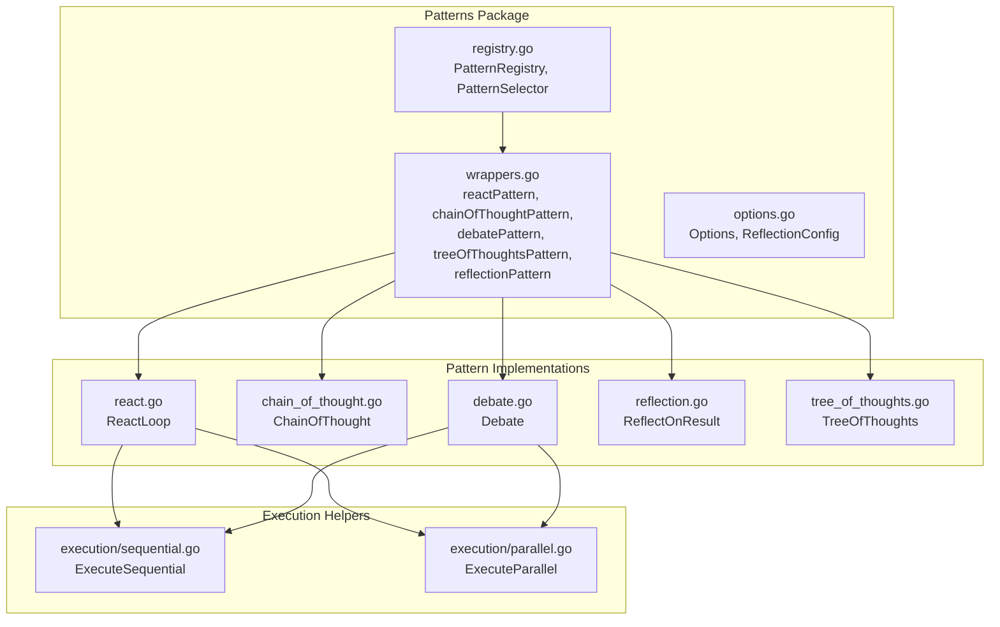

**Diagram sources**
- [registry.go](file://go/orchestrator/internal/workflows/patterns/registry.go#L71-L190)
- [wrappers.go](file://go/orchestrator/internal/workflows/patterns/wrappers.go#L14-L264)
- [options.go](file://go/orchestrator/internal/workflows/patterns/options.go#L3-L21)
- [react.go](file://go/orchestrator/internal/workflows/patterns/react.go#L47-L702)
- [chain_of_thought.go](file://go/orchestrator/internal/workflows/patterns/chain_of_thought.go#L36-L295)
- [debate.go](file://go/orchestrator/internal/workflows/patterns/debate.go#L48-L473)
- [reflection.go](file://go/orchestrator/internal/workflows/patterns/reflection.go#L17-L170)
- [tree_of_thoughts.go](file://go/orchestrator/internal/workflows/patterns/tree_of_thoughts.go#L52-L236)
- [sequential.go](file://go/orchestrator/internal/workflows/patterns/execution/sequential.go#L47-L395)
- [parallel.go](file://go/orchestrator/internal/workflows/patterns/execution/parallel.go#L48-L450)

**Section sources**
- [registry.go](file://go/orchestrator/internal/workflows/patterns/registry.go#L1-L190)
- [options.go](file://go/orchestrator/internal/workflows/patterns/options.go#L1-L21)

## Core Components
- Pattern interface: Defines Execute, GetType, GetCapabilities, and EstimateTokens. See [Pattern interface](file://go/orchestrator/internal/workflows/patterns/registry.go#L35-L48).
- PatternInput and PatternResult: Standardized inputs and outputs for all patterns. See [PatternInput](file://go/orchestrator/internal/workflows/patterns/registry.go#L50-L60) and [PatternResult](file://go/orchestrator/internal/workflows/patterns/registry.go#L62-L69).
- PatternRegistry: Thread-safe registry with selection strategy and global accessor. See [PatternRegistry](file://go/orchestrator/internal/workflows/patterns/registry.go#L71-L78).
- PatternSelector: Strategy for selecting a pattern per task. See [PatternSelector](file://go/orchestrator/internal/workflows/patterns/registry.go#L80-L83) and [DefaultPatternSelector](file://go/orchestrator/internal/workflows/patterns/registry.go#L85-L108).
- Options and ReflectionConfig: Shared configuration for execution behavior. See [Options](file://go/orchestrator/internal/workflows/patterns/options.go#L3-L11) and [ReflectionConfig](file://go/orchestrator/internal/workflows/patterns/options.go#L13-L20).

**Section sources**
- [registry.go](file://go/orchestrator/internal/workflows/patterns/registry.go#L35-L126)
- [options.go](file://go/orchestrator/internal/workflows/patterns/options.go#L3-L21)

## Architecture Overview
Patterns integrate with the Temporal workflow engine to orchestrate multi-agent reasoning and collaboration. Each pattern encapsulates a specific cognitive workflow and delegates agent execution to activities, while managing budgets, streaming, and token accounting.

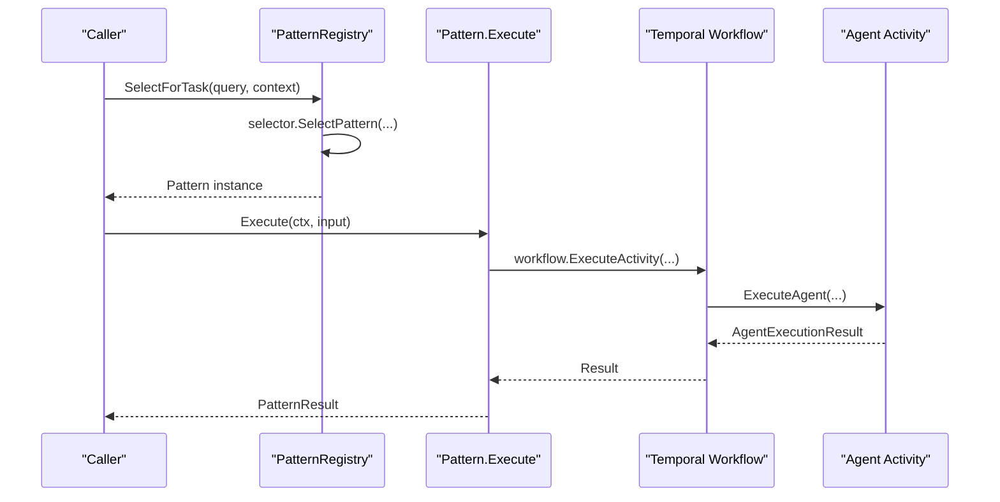

**Diagram sources**
- [registry.go](file://go/orchestrator/internal/workflows/patterns/registry.go#L162-L170)
- [wrappers.go](file://go/orchestrator/internal/workflows/patterns/wrappers.go#L31-L51)
- [react.go](file://go/orchestrator/internal/workflows/patterns/react.go#L146-L193)
- [chain_of_thought.go](file://go/orchestrator/internal/workflows/patterns/chain_of_thought.go#L88-L139)
- [debate.go](file://go/orchestrator/internal/workflows/patterns/debate.go#L136-L177)
- [reflection.go](file://go/orchestrator/internal/workflows/patterns/reflection.go#L44-L59)

## Detailed Component Analysis

### Pattern Registry and Lifecycle
- Registration: Patterns are registered globally and protected by a mutex. See [Register](file://go/orchestrator/internal/workflows/patterns/registry.go#L128-L139).
- Selection: Default selector chooses by explicit hint or falls back to first available. See [SelectPattern](file://go/orchestrator/internal/workflows/patterns/registry.go#L88-L108) and [SelectForTask](file://go/orchestrator/internal/workflows/patterns/registry.go#L162-L170).
- Global access: Singleton initialization ensures default patterns are registered once. See [GetRegistry](file://go/orchestrator/internal/workflows/patterns/registry.go#L115-L126) and [registerDefaultPatterns](file://go/orchestrator/internal/workflows/patterns/registry.go#L179-L189).

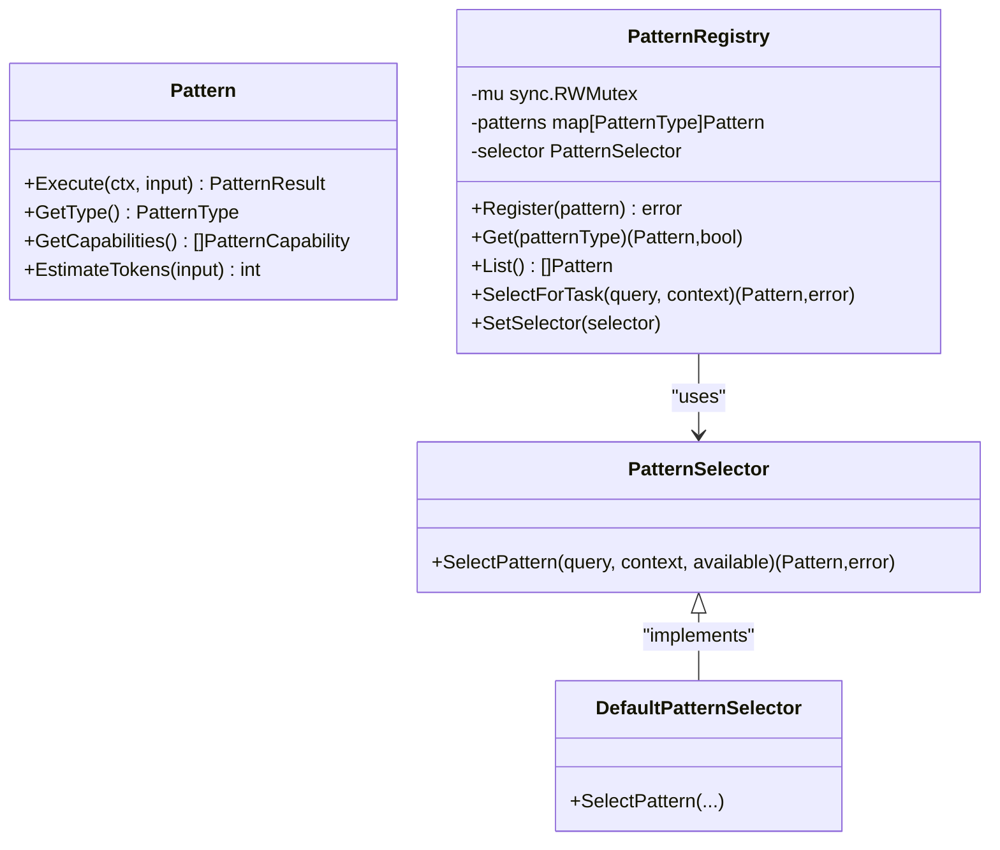

**Diagram sources**
- [registry.go](file://go/orchestrator/internal/workflows/patterns/registry.go#L35-L126)

**Section sources**
- [registry.go](file://go/orchestrator/internal/workflows/patterns/registry.go#L71-L189)

### Built-in Pattern Wrappers
Each built-in pattern is a thin wrapper implementing the Pattern interface and delegating to a core execution function. They set defaults, merge user config, and return standardized PatternResult.

- React wrapper: [reactPattern.Execute](file://go/orchestrator/internal/workflows/patterns/wrappers.go#L31-L51)
- Chain-of-thought wrapper: [chainOfThoughtPattern.Execute](file://go/orchestrator/internal/workflows/patterns/wrappers.go#L69-L81)
- Debate wrapper: [debatePattern.Execute](file://go/orchestrator/internal/workflows/patterns/wrappers.go#L99-L111)
- Tree-of-thoughts wrapper: [treeOfThoughtsPattern.Execute](file://go/orchestrator/internal/workflows/patterns/wrappers.go#L129-L141)
- Reflection wrapper: [reflectionPattern.Execute](file://go/orchestrator/internal/workflows/patterns/wrappers.go#L159-L263)

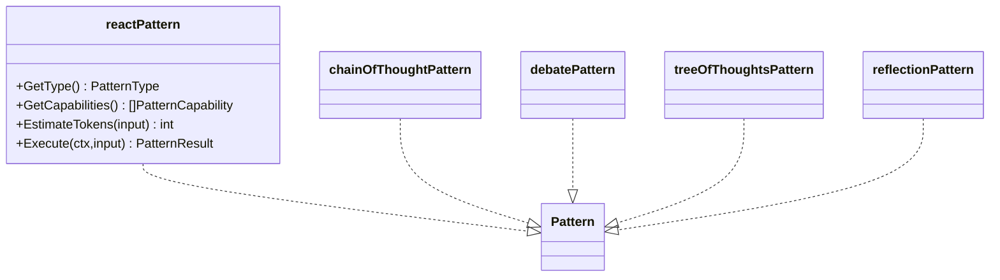

**Diagram sources**
- [wrappers.go](file://go/orchestrator/internal/workflows/patterns/wrappers.go#L14-L264)
- [registry.go](file://go/orchestrator/internal/workflows/patterns/registry.go#L35-L48)

**Section sources**
- [wrappers.go](file://go/orchestrator/internal/workflows/patterns/wrappers.go#L14-L264)

### Reflection Pattern: Iterative Improvement
The reflection pattern performs an initial agent call, evaluates quality, and optionally synthesizes improvements with feedback. It demonstrates robust error handling and token accounting.

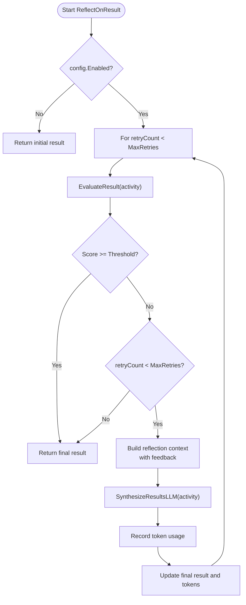

**Diagram sources**
- [reflection.go](file://go/orchestrator/internal/workflows/patterns/reflection.go#L17-L170)

**Section sources**
- [reflection.go](file://go/orchestrator/internal/workflows/patterns/reflection.go#L17-L170)

### Debate Pattern: Multi-Perspective Collaboration
The debate pattern coordinates multiple debaters in parallel, collects positions, and resolves outcomes via moderation, voting, or synthesis. It includes consensus detection and persistent storage of results.

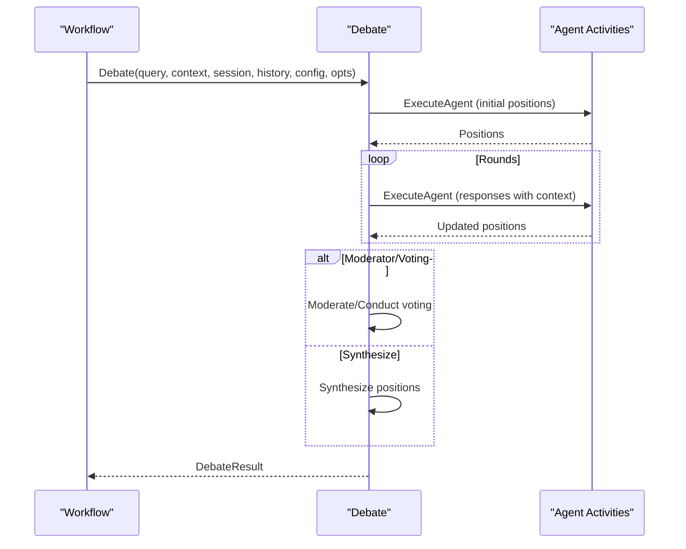

**Diagram sources**
- [debate.go](file://go/orchestrator/internal/workflows/patterns/debate.go#L48-L473)

**Section sources**
- [debate.go](file://go/orchestrator/internal/workflows/patterns/debate.go#L48-L473)

### React Pattern: Step-by-Step Reasoning
The ReAct loop alternates between reasoning, acting, and observing. It emits streaming events, enforces budgets, tracks tokens, and applies convergence heuristics to terminate early.

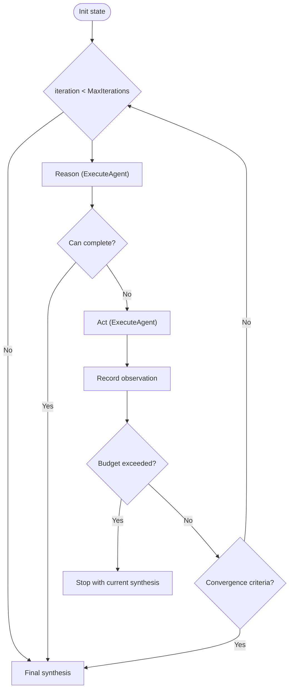

**Diagram sources**
- [react.go](file://go/orchestrator/internal/workflows/patterns/react.go#L47-L702)

**Section sources**
- [react.go](file://go/orchestrator/internal/workflows/patterns/react.go#L47-L702)

### Chain-of-Thought Pattern: Structured Reasoning
The chain-of-thought pattern guides an agent through explicit steps, parses reasoning, extracts answers, and optionally requests clarification for low-confidence outputs.

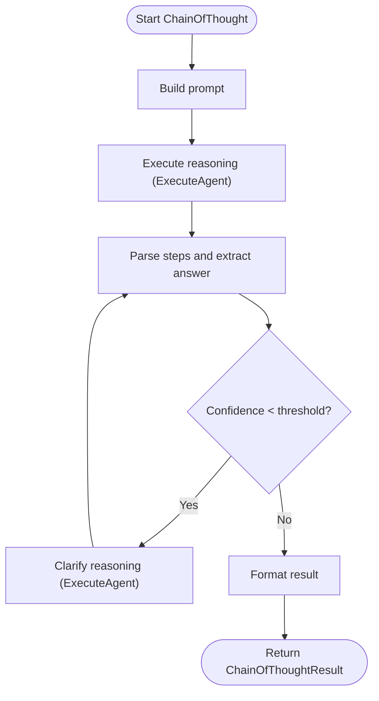

**Diagram sources**
- [chain_of_thought.go](file://go/orchestrator/internal/workflows/patterns/chain_of_thought.go#L36-L295)

**Section sources**
- [chain_of_thought.go](file://go/orchestrator/internal/workflows/patterns/chain_of_thought.go#L36-L295)

### Tree-of-Thoughts Pattern: Exploratory Search
The tree-of-thoughts pattern explores multiple reasoning branches up to a depth limit, prunes low-scoring paths, and synthesizes the best solution path.

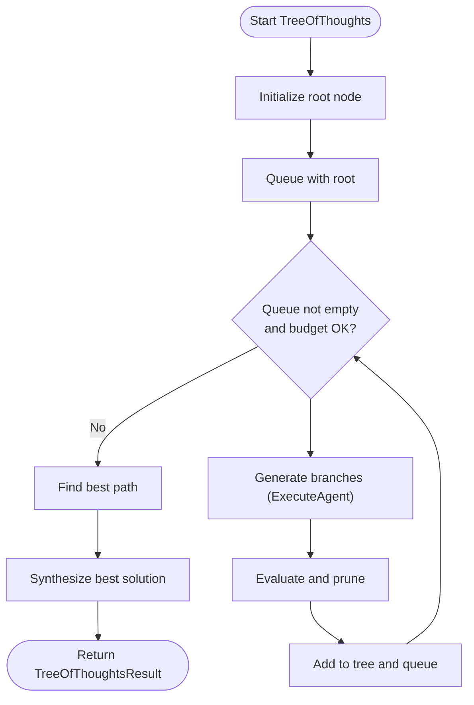

**Diagram sources**
- [tree_of_thoughts.go](file://go/orchestrator/internal/workflows/patterns/tree_of_thoughts.go#L52-L236)

**Section sources**
- [tree_of_thoughts.go](file://go/orchestrator/internal/workflows/patterns/tree_of_thoughts.go#L52-L236)

### Execution Helpers: Sequential and Parallel
- Sequential execution: Runs tasks in order, optionally passing previous results and extracting numeric values. See [ExecuteSequential](file://go/orchestrator/internal/workflows/patterns/execution/sequential.go#L47-L395).
- Parallel execution: Uses a semaphore to cap concurrency, supports per-task context overrides, and records token usage. See [ExecuteParallel](file://go/orchestrator/internal/workflows/patterns/execution/parallel.go#L48-L450).

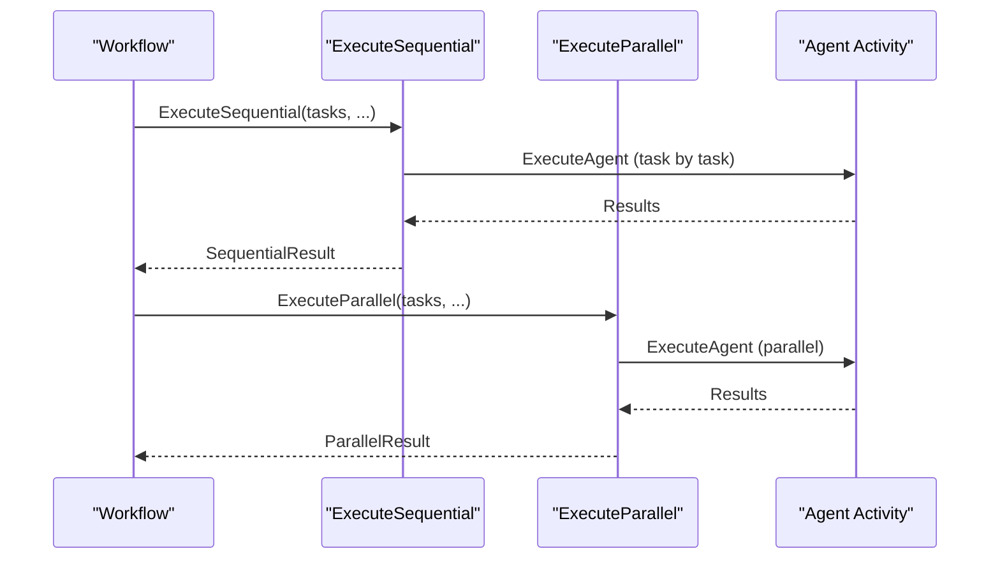

**Diagram sources**
- [sequential.go](file://go/orchestrator/internal/workflows/patterns/execution/sequential.go#L47-L395)
- [parallel.go](file://go/orchestrator/internal/workflows/patterns/execution/parallel.go#L48-L450)

**Section sources**
- [sequential.go](file://go/orchestrator/internal/workflows/patterns/execution/sequential.go#L47-L395)
- [parallel.go](file://go/orchestrator/internal/workflows/patterns/execution/parallel.go#L48-L450)

## Dependency Analysis
Patterns depend on:
- Temporal SDK for workflow orchestration and futures.
- Activities for agent execution, evaluation, synthesis, and token accounting.
- Pricing and model detection utilities for fallbacks.
- Streaming for real-time progress and events.

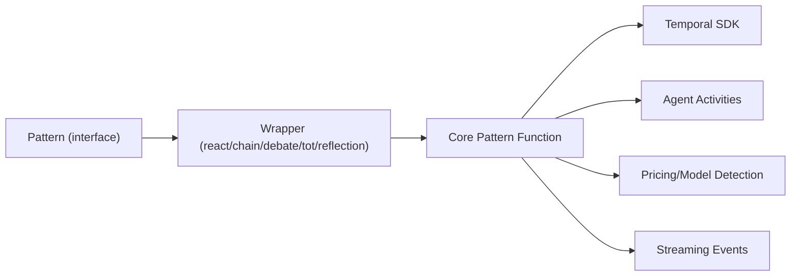

**Diagram sources**
- [wrappers.go](file://go/orchestrator/internal/workflows/patterns/wrappers.go#L14-L264)
- [react.go](file://go/orchestrator/internal/workflows/patterns/react.go#L47-L702)
- [chain_of_thought.go](file://go/orchestrator/internal/workflows/patterns/chain_of_thought.go#L36-L295)
- [debate.go](file://go/orchestrator/internal/workflows/patterns/debate.go#L48-L473)
- [reflection.go](file://go/orchestrator/internal/workflows/patterns/reflection.go#L17-L170)
- [tree_of_thoughts.go](file://go/orchestrator/internal/workflows/patterns/tree_of_thoughts.go#L52-L236)

**Section sources**
- [wrappers.go](file://go/orchestrator/internal/workflows/patterns/wrappers.go#L14-L264)
- [react.go](file://go/orchestrator/internal/workflows/patterns/react.go#L47-L702)
- [chain_of_thought.go](file://go/orchestrator/internal/workflows/patterns/chain_of_thought.go#L36-L295)
- [debate.go](file://go/orchestrator/internal/workflows/patterns/debate.go#L48-L473)
- [reflection.go](file://go/orchestrator/internal/workflows/patterns/reflection.go#L17-L170)
- [tree_of_thoughts.go](file://go/orchestrator/internal/workflows/patterns/tree_of_thoughts.go#L52-L236)

## Performance Considerations
- Budget-aware execution: Use per-agent budgets to cap token usage and avoid runaway costs. See budget usage in wrappers and core functions.
- Concurrency control: Parallel execution uses semaphores to bound resource usage. See [ExecuteParallel](file://go/orchestrator/internal/workflows/patterns/execution/parallel.go#L67-L70).
- Early termination: React loop applies convergence heuristics to reduce unnecessary iterations. See [shouldStopReactLoop](file://go/orchestrator/internal/workflows/patterns/react.go#L747-L787).
- Token accounting: Patterns record token usage via dedicated activities to avoid double-counting when using budgeted execution. See token recording in wrappers and core functions.
- Memory limits: React maintains bounded observation windows and trims old entries. See [getRecentObservations](file://go/orchestrator/internal/workflows/patterns/react.go#L706-L711).

[No sources needed since this section provides general guidance]

## Troubleshooting Guide
- Pattern selection failures: Verify context hints and ensure patterns are registered. See [SelectForTask](file://go/orchestrator/internal/workflows/patterns/registry.go#L162-L170).
- Activity failures: Inspect logs emitted during agent execution and handle errors gracefully. See [ReactLoop](file://go/orchestrator/internal/workflows/patterns/react.go#L195-L198) and [Debate](file://go/orchestrator/internal/workflows/patterns/debate.go#L180-L188).
- Token discrepancies: Confirm whether budgeted execution already recorded usage; avoid double-recording. See token recording logic in wrappers and core functions.
- Streaming correlation: Ensure parent workflow ID is forwarded to preserve streaming continuity. See usage in wrappers and debate/CoT/TOT.

**Section sources**
- [registry.go](file://go/orchestrator/internal/workflows/patterns/registry.go#L162-L170)
- [react.go](file://go/orchestrator/internal/workflows/patterns/react.go#L195-L198)
- [debate.go](file://go/orchestrator/internal/workflows/patterns/debate.go#L180-L188)

## Conclusion
Shannon’s pattern system provides a robust foundation for building domain-specific multi-agent workflows. By implementing the Pattern interface, leveraging shared configuration, and integrating with Temporal and activities, you can extend the system with custom cognitive patterns. Follow the established patterns for error handling, state management, and performance optimization to ensure reliable, maintainable, and scalable solutions.

[No sources needed since this section summarizes without analyzing specific files]

## Appendices

### Step-by-Step: Creating a Custom Pattern
1. Define configuration structs for your pattern (similar to [ReactConfig](file://go/orchestrator/internal/workflows/patterns/react.go#L26-L34)).
2. Implement the Pattern interface:
   - [Execute](file://go/orchestrator/internal/workflows/patterns/registry.go#L37-L38)
   - [GetType](file://go/orchestrator/internal/workflows/patterns/registry.go#L40-L41)
   - [GetCapabilities](file://go/orchestrator/internal/workflows/patterns/registry.go#L43-L44)
   - [EstimateTokens](file://go/orchestrator/internal/workflows/patterns/registry.go#L46-L47)
3. Implement the core execution logic (see [ReactLoop](file://go/orchestrator/internal/workflows/patterns/react.go#L47-L702), [ChainOfThought](file://go/orchestrator/internal/workflows/patterns/chain_of_thought.go#L36-L295), [Debate](file://go/orchestrator/internal/workflows/patterns/debate.go#L48-L473), [ReflectOnResult](file://go/orchestrator/internal/workflows/patterns/reflection.go#L17-L170), [TreeOfThoughts](file://go/orchestrator/internal/workflows/patterns/tree_of_thoughts.go#L52-L236)).
4. Wrap your implementation as a Pattern (similar to [wrappers](file://go/orchestrator/internal/workflows/patterns/wrappers.go#L14-L264)).
5. Register your pattern via the global registry:
   - [GetRegistry](file://go/orchestrator/internal/workflows/patterns/registry.go#L115-L126)
   - [Register](file://go/orchestrator/internal/workflows/patterns/registry.go#L128-L139)
6. Integrate with Temporal:
   - Use [workflow.ExecuteActivity](file://go/orchestrator/internal/workflows/patterns/react.go#L157-L173) for agent calls.
   - Forward parent workflow ID for streaming correlation.
7. Manage budgets and tokens:
   - Use budgeted activities when available (see wrappers).
   - Record token usage via [RecordTokenUsageActivity](file://go/orchestrator/internal/workflows/patterns/wrappers.go#L237-L247).
8. Emit streaming events for progress and diagnostics (see React loop event publishing).
9. Test and debug:
   - Validate selection logic and error paths.
   - Use logs and token records to trace execution.

**Section sources**
- [registry.go](file://go/orchestrator/internal/workflows/patterns/registry.go#L115-L139)
- [wrappers.go](file://go/orchestrator/internal/workflows/patterns/wrappers.go#L14-L264)
- [react.go](file://go/orchestrator/internal/workflows/patterns/react.go#L157-L173)

### Pattern Configuration Examples
- Options: [Options](file://go/orchestrator/internal/workflows/patterns/options.go#L3-L11)
- ReflectionConfig: [ReflectionConfig](file://go/orchestrator/internal/workflows/patterns/options.go#L13-L20)
- ReactConfig: [ReactConfig](file://go/orchestrator/internal/workflows/patterns/react.go#L26-L34)
- ChainOfThoughtConfig: [ChainOfThoughtConfig](file://go/orchestrator/internal/workflows/patterns/chain_of_thought.go#L17-L25)
- DebateConfig: [DebateConfig](file://go/orchestrator/internal/workflows/patterns/debate.go#L17-L26)
- TreeOfThoughtsConfig: [TreeOfThoughtsConfig](file://go/orchestrator/internal/workflows/patterns/tree_of_thoughts.go#L17-L26)

**Section sources**
- [options.go](file://go/orchestrator/internal/workflows/patterns/options.go#L3-L20)
- [react.go](file://go/orchestrator/internal/workflows/patterns/react.go#L26-L34)
- [chain_of_thought.go](file://go/orchestrator/internal/workflows/patterns/chain_of_thought.go#L17-L25)
- [debate.go](file://go/orchestrator/internal/workflows/patterns/debate.go#L17-L26)
- [tree_of_thoughts.go](file://go/orchestrator/internal/workflows/patterns/tree_of_thoughts.go#L17-L26)

### Integration with Memory and Streaming
- Memory: Patterns can fetch agent memory and record results for sessions. See [sequential.go](file://go/orchestrator/internal/workflows/patterns/execution/sequential.go#L100-L112) and [parallel.go](file://go/orchestrator/internal/workflows/patterns/execution/parallel.go#L385-L402).
- Streaming: Patterns publish progress and agent lifecycle events. See [react.go](file://go/orchestrator/internal/workflows/patterns/react.go#L113-L119) and [parallel.go](file://go/orchestrator/internal/workflows/patterns/execution/parallel.go#L135-L143).

**Section sources**
- [sequential.go](file://go/orchestrator/internal/workflows/patterns/execution/sequential.go#L100-L112)
- [parallel.go](file://go/orchestrator/internal/workflows/patterns/execution/parallel.go#L135-L143)
- [react.go](file://go/orchestrator/internal/workflows/patterns/react.go#L113-L119)