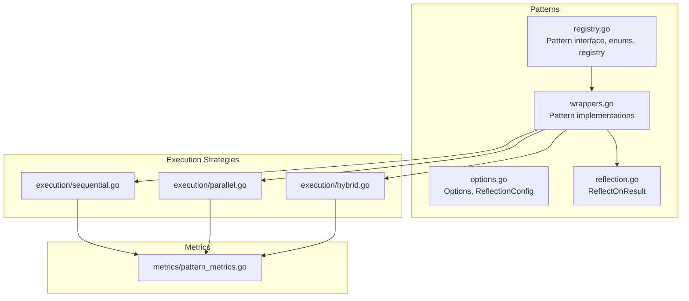
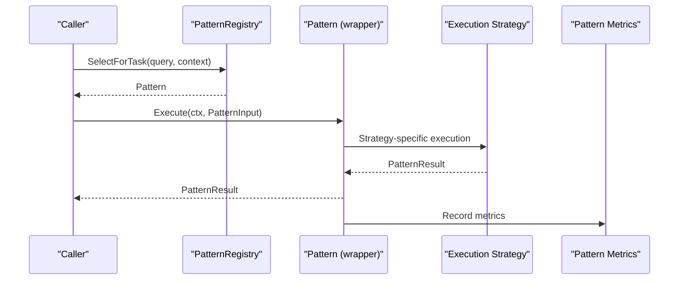
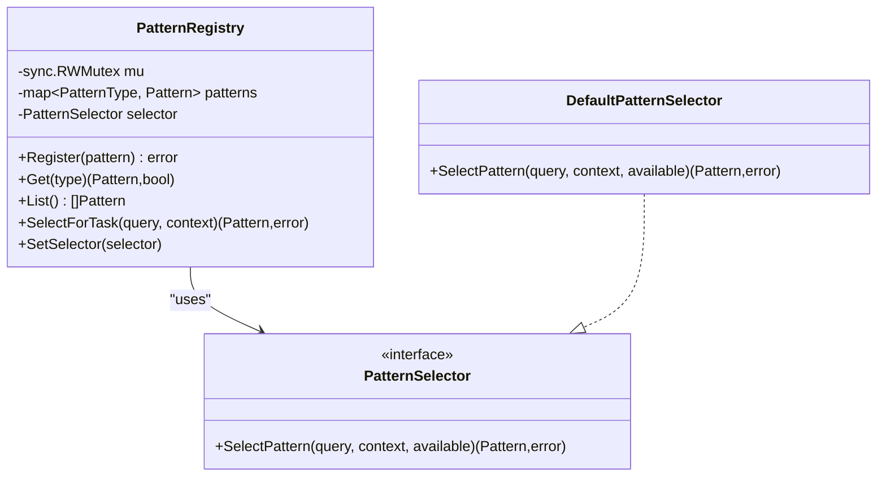
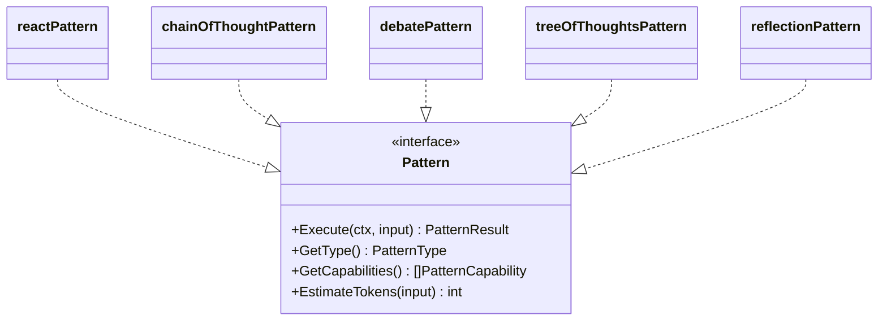
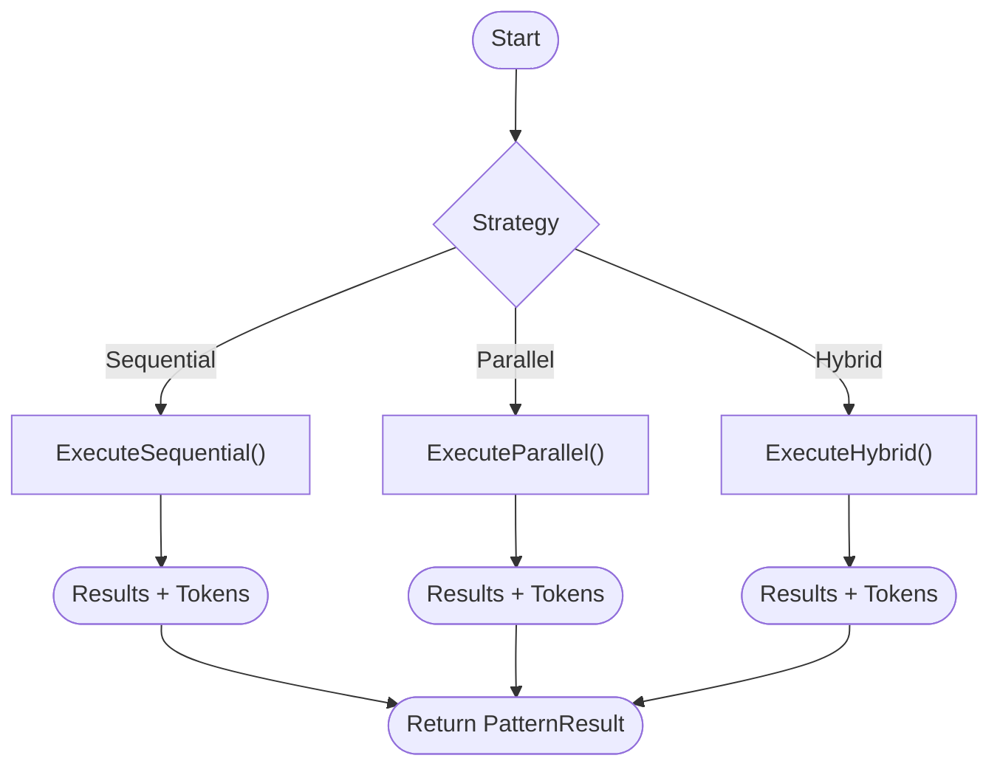
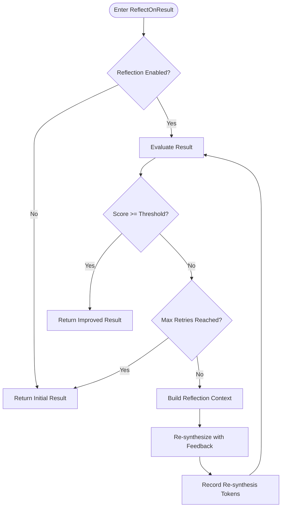
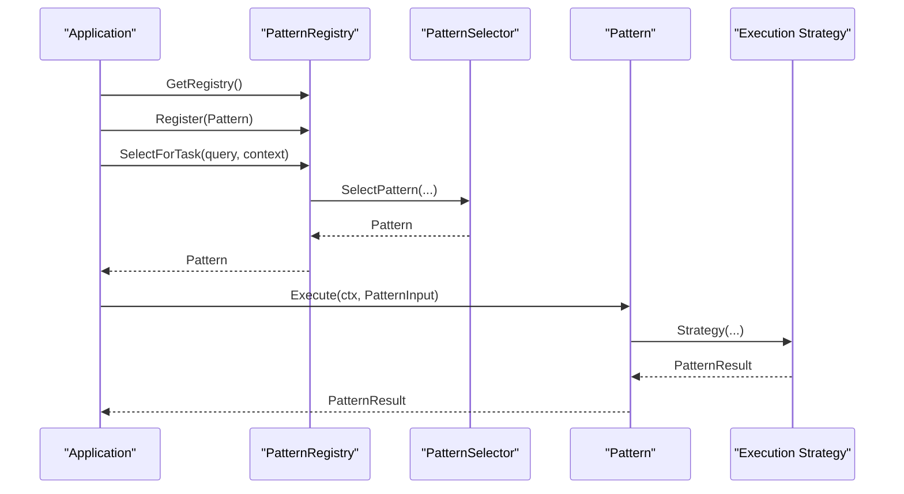
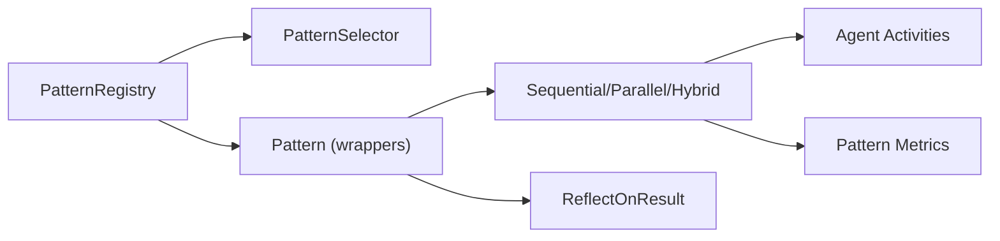

# Pattern Fundamentals

<cite>
**Referenced Files in This Document**
- [registry.go](file://go/orchestrator/internal/workflows/patterns/registry.go)
- [wrappers.go](file://go/orchestrator/internal/workflows/patterns/wrappers.go)
- [options.go](file://go/orchestrator/internal/workflows/patterns/options.go)
- [sequential.go](file://go/orchestrator/internal/workflows/patterns/execution/sequential.go)
- [parallel.go](file://go/orchestrator/internal/workflows/patterns/execution/parallel.go)
- [hybrid.go](file://go/orchestrator/internal/workflows/patterns/execution/hybrid.go)
- [reflection.go](file://go/orchestrator/internal/workflows/patterns/reflection.go)
- [pattern_metrics.go](file://go/orchestrator/internal/workflows/metrics/pattern_metrics.go)
- [patterns_exec_test.go](file://go/orchestrator/internal/workflows/patterns/patterns_exec_test.go)
- [README.md](file://README.md)
</cite>

## Table of Contents
1. [Introduction](#introduction)
2. [Project Structure](#project-structure)
3. [Core Components](#core-components)
4. [Architecture Overview](#architecture-overview)
5. [Detailed Component Analysis](#detailed-component-analysis)
6. [Dependency Analysis](#dependency-analysis)
7. [Performance Considerations](#performance-considerations)
8. [Troubleshooting Guide](#troubleshooting-guide)
9. [Conclusion](#conclusion)
10. [Appendices](#appendices)

## Introduction
This document explains the pattern fundamentals in Shannon’s multi-agent orchestration system. It covers the core Pattern interface, input/result structures, enumerations for pattern types and capabilities, and the lifecycle from registration to execution. It also documents execution strategies (sequential, parallel, hybrid), reflection-based iterative improvement, metrics, and best practices for integrating patterns with the temporal workflow engine.

## Project Structure
The pattern system lives under the orchestrator’s workflows/patterns package and integrates with execution strategies and metrics.

**Diagram sources**
- [registry.go](file://go/orchestrator/internal/workflows/patterns/registry.go#L11-L69)
- [wrappers.go](file://go/orchestrator/internal/workflows/patterns/wrappers.go#L14-L264)
- [options.go](file://go/orchestrator/internal/workflows/patterns/options.go#L3-L21)
- [reflection.go](file://go/orchestrator/internal/workflows/patterns/reflection.go#L17-L170)
- [sequential.go](file://go/orchestrator/internal/workflows/patterns/execution/sequential.go#L47-L395)
- [parallel.go](file://go/orchestrator/internal/workflows/patterns/execution/parallel.go#L48-L450)
- [hybrid.go](file://go/orchestrator/internal/workflows/patterns/execution/hybrid.go#L45-L408)
- [pattern_metrics.go](file://go/orchestrator/internal/workflows/metrics/pattern_metrics.go#L8-L94)

**Section sources**
- [registry.go](file://go/orchestrator/internal/workflows/patterns/registry.go#L1-L190)
- [README.md](file://README.md#L201-L226)

## Core Components
- Pattern interface: Defines Execute, GetType, GetCapabilities, EstimateTokens.
- PatternInput: Provides query, context, history, identifiers, config, budget, and model tier.
- PatternResult: Captures final result, tokens used, confidence, metadata, and agent results.
- PatternType: Enumerates reflection, react, chain_of_thought, debate, tree_of_thoughts, ensemble.
- PatternCapability: Enumerates iterative_improvement, step_by_step, multi_perspective, conflict_resolution, exploration, consensus_building.
- PatternRegistry: Manages registration, selection, and retrieval of patterns.
- PatternSelector: Strategy for selecting a pattern given a query and context.
- Options and ReflectionConfig: Shared configuration for pattern execution and reflection behavior.

**Section sources**
- [registry.go](file://go/orchestrator/internal/workflows/patterns/registry.go#L11-L69)
- [options.go](file://go/orchestrator/internal/workflows/patterns/options.go#L3-L21)

## Architecture Overview
The pattern system exposes a uniform interface to callers while delegating execution to specialized strategies. Patterns are registered centrally and selected based on heuristics. Execution strategies coordinate agent invocations, token accounting, persistence, and streaming events. Metrics track usage and performance.

**Diagram sources**
- [registry.go](file://go/orchestrator/internal/workflows/patterns/registry.go#L162-L177)
- [wrappers.go](file://go/orchestrator/internal/workflows/patterns/wrappers.go#L31-L51)
- [sequential.go](file://go/orchestrator/internal/workflows/patterns/execution/sequential.go#L47-L395)
- [parallel.go](file://go/orchestrator/internal/workflows/patterns/execution/parallel.go#L48-L450)
- [hybrid.go](file://go/orchestrator/internal/workflows/patterns/execution/hybrid.go#L45-L161)
- [pattern_metrics.go](file://go/orchestrator/internal/workflows/metrics/pattern_metrics.go#L65-L94)

## Detailed Component Analysis

### Pattern Interface and Structures
- Pattern interface: Execute(ctx, input) -> (*PatternResult, error), GetType(), GetCapabilities(), EstimateTokens(input).
- PatternInput: Query, Context, History, SessionID, UserID, Config, BudgetMax, ModelTier.
- PatternResult: Result, TokensUsed, Confidence, Metadata, AgentResults.

Usage patterns:
- Callers construct PatternInput with query, context, and optional budget/model tier.
- Execute returns a normalized PatternResult for downstream synthesis or streaming.

**Section sources**
- [registry.go](file://go/orchestrator/internal/workflows/patterns/registry.go#L35-L69)

### Pattern Types and Capabilities
- PatternType: reflection, react, chain_of_thought, debate, tree_of_thoughts, ensemble.
- PatternCapability: iterative_improvement, step_by_step, multi_perspective, conflict_resolution, exploration, consensus_building.

These enums define the identity and abilities of each pattern, enabling selection and capability-aware orchestration.

**Section sources**
- [registry.go](file://go/orchestrator/internal/workflows/patterns/registry.go#L14-L33)

### Pattern Registry and Selection
- Global registry initialized once and populated with default patterns.
- Register(pattern) adds implementations by type.
- Get(patternType) retrieves a registered pattern.
- List() returns all registered patterns.
- SelectForTask(query, context) delegates to PatternSelector.
- DefaultPatternSelector chooses by explicit hint or falls back to first available.

**Diagram sources**
- [registry.go](file://go/orchestrator/internal/workflows/patterns/registry.go#L71-L177)

**Section sources**
- [registry.go](file://go/orchestrator/internal/workflows/patterns/registry.go#L110-L177)

### Pattern Implementations (Wrappers)
Each built-in pattern is wrapped to satisfy the Pattern interface. They:
- Implement GetType() returning the specific PatternType.
- Implement GetCapabilities() returning applicable capabilities.
- Implement EstimateTokens() using either input budget or defaults.
- Implement Execute(ctx, input) by invoking the underlying cognitive workflow and returning a normalized PatternResult.

Examples:
- reactPattern: Uses ReactLoop with configurable iterations and budgets.
- chainOfThoughtPattern: Uses ChainOfThought with step limits.
- debatePattern: Uses Debate with debater count and rounds.
- treeOfThoughtsPattern: Uses TreeOfThoughts with depth and branching.
- reflectionPattern: Executes an initial agent call and optionally improves via ReflectOnResult.

**Diagram sources**
- [wrappers.go](file://go/orchestrator/internal/workflows/patterns/wrappers.go#L14-L264)

**Section sources**
- [wrappers.go](file://go/orchestrator/internal/workflows/patterns/wrappers.go#L14-L264)

### Execution Strategies
- Sequential: Executes tasks in order, optionally passing previous results, with budget-aware execution and token recording.
- Parallel: Runs tasks concurrently with a semaphore, emitting events and recording token usage.
- Hybrid: Combines parallelism with dependency management; tasks wait for dependencies using incremental timeouts.

**Diagram sources**
- [sequential.go](file://go/orchestrator/internal/workflows/patterns/execution/sequential.go#L47-L395)
- [parallel.go](file://go/orchestrator/internal/workflows/patterns/execution/parallel.go#L48-L450)
- [hybrid.go](file://go/orchestrator/internal/workflows/patterns/execution/hybrid.go#L45-L161)

**Section sources**
- [sequential.go](file://go/orchestrator/internal/workflows/patterns/execution/sequential.go#L47-L395)
- [parallel.go](file://go/orchestrator/internal/workflows/patterns/execution/parallel.go#L48-L450)
- [hybrid.go](file://go/orchestrator/internal/workflows/patterns/execution/hybrid.go#L45-L161)

### Reflection-Based Iterative Improvement
- ReflectOnResult evaluates the current result and iteratively synthesizes improvements if below threshold.
- Uses EvaluateResult activity to score and SynthesizeResultsLLM to re-synthesize with reflection feedback.
- Records token usage for re-synthesis and initial steps separately.

**Diagram sources**
- [reflection.go](file://go/orchestrator/internal/workflows/patterns/reflection.go#L17-L170)

**Section sources**
- [reflection.go](file://go/orchestrator/internal/workflows/patterns/reflection.go#L17-L170)

### Metrics and Observability
- PatternExecutions, PatternDuration, AgentExecutionsByPattern, TokenUsageByPattern, ReflectionImprovements, WorkflowVersions.
- Helpers to record counts, durations, agent counts, token usage, and reflection improvements.

**Section sources**
- [pattern_metrics.go](file://go/orchestrator/internal/workflows/metrics/pattern_metrics.go#L8-L94)

### Pattern Lifecycle: Registration, Selection, Execution
- Registration: GetRegistry() initializes the global registry; registerDefaultPatterns() registers built-ins; Register() adds custom patterns.
- Selection: SelectForTask() asks PatternSelector to choose a pattern; DefaultPatternSelector prefers explicit hints.
- Execution: Pattern.Execute() invokes the appropriate strategy; strategies record tokens, persist agent executions, and emit events when configured.

**Diagram sources**
- [registry.go](file://go/orchestrator/internal/workflows/patterns/registry.go#L115-L177)
- [wrappers.go](file://go/orchestrator/internal/workflows/patterns/wrappers.go#L31-L51)
- [sequential.go](file://go/orchestrator/internal/workflows/patterns/execution/sequential.go#L47-L395)
- [parallel.go](file://go/orchestrator/internal/workflows/patterns/execution/parallel.go#L48-L450)
- [hybrid.go](file://go/orchestrator/internal/workflows/patterns/execution/hybrid.go#L45-L161)

**Section sources**
- [registry.go](file://go/orchestrator/internal/workflows/patterns/registry.go#L115-L190)
- [wrappers.go](file://go/orchestrator/internal/workflows/patterns/wrappers.go#L31-L264)

### Examples: Registration, Selection, and Execution
- Registration: Register built-in patterns via registerDefaultPatterns() and custom patterns via Register().
- Selection: Use SelectForTask(query, context) to pick a pattern; DefaultPatternSelector respects context hints.
- Execution: Call Execute(ctx, PatternInput) on the selected pattern; results are normalized in PatternResult.

Integration points:
- Sequential/Parallel/Hybrid strategies coordinate agent execution, token accounting, persistence, and event emission.
- Reflection-based patterns improve quality iteratively when enabled.

**Section sources**
- [registry.go](file://go/orchestrator/internal/workflows/patterns/registry.go#L162-L177)
- [wrappers.go](file://go/orchestrator/internal/workflows/patterns/wrappers.go#L31-L264)
- [sequential.go](file://go/orchestrator/internal/workflows/patterns/execution/sequential.go#L47-L395)
- [parallel.go](file://go/orchestrator/internal/workflows/patterns/execution/parallel.go#L48-L450)
- [hybrid.go](file://go/orchestrator/internal/workflows/patterns/execution/hybrid.go#L45-L161)
- [patterns_exec_test.go](file://go/orchestrator/internal/workflows/patterns/patterns_exec_test.go#L30-L136)

## Dependency Analysis
- PatternRegistry depends on PatternSelector and holds a map of PatternType to Pattern.
- Pattern implementations depend on execution strategies and optionally reflection logic.
- Execution strategies depend on agent activities, token recording, persistence, and event emission.
- Metrics are decoupled and recorded by each strategy.

**Diagram sources**
- [registry.go](file://go/orchestrator/internal/workflows/patterns/registry.go#L71-L177)
- [wrappers.go](file://go/orchestrator/internal/workflows/patterns/wrappers.go#L14-L264)
- [sequential.go](file://go/orchestrator/internal/workflows/patterns/execution/sequential.go#L47-L395)
- [parallel.go](file://go/orchestrator/internal/workflows/patterns/execution/parallel.go#L48-L450)
- [hybrid.go](file://go/orchestrator/internal/workflows/patterns/execution/hybrid.go#L45-L161)
- [reflection.go](file://go/orchestrator/internal/workflows/patterns/reflection.go#L17-L170)
- [pattern_metrics.go](file://go/orchestrator/internal/workflows/metrics/pattern_metrics.go#L65-L94)

**Section sources**
- [registry.go](file://go/orchestrator/internal/workflows/patterns/registry.go#L71-L177)
- [wrappers.go](file://go/orchestrator/internal/workflows/patterns/wrappers.go#L14-L264)
- [sequential.go](file://go/orchestrator/internal/workflows/patterns/execution/sequential.go#L47-L395)
- [parallel.go](file://go/orchestrator/internal/workflows/patterns/execution/parallel.go#L48-L450)
- [hybrid.go](file://go/orchestrator/internal/workflows/patterns/execution/hybrid.go#L45-L161)
- [reflection.go](file://go/orchestrator/internal/workflows/patterns/reflection.go#L17-L170)
- [pattern_metrics.go](file://go/orchestrator/internal/workflows/metrics/pattern_metrics.go#L65-L94)

## Performance Considerations
- Concurrency control: Parallel execution uses a semaphore to bound concurrent agents; adjust MaxConcurrency based on provider rate limits and resource availability.
- Token accounting: Strategies record input/output tokens and total tokens; budget-aware execution prevents runaway costs.
- Reflection overhead: Reflection iterations add latency and cost; tune MaxRetries and thresholds to balance quality and performance.
- Deterministic workflows: Temporal’s single-threaded replay model ensures determinism; avoid non-deterministic side effects in patterns.

[No sources needed since this section provides general guidance]

## Troubleshooting Guide
Common issues and remedies:
- No suitable pattern found: Ensure patterns are registered and available; verify context hints if relying on explicit pattern selection.
- Reflection evaluation failures: Reflection gracefully falls back to the initial result; inspect evaluation activity errors and adjust criteria or thresholds.
- Token usage discrepancies: Verify token recording logic for budgeted vs non-budgeted paths; ensure model/provider fallbacks are applied consistently.
- Dependency wait timeouts: Hybrid tasks may wait for dependencies; confirm dependency IDs and adjust DependencyWaitTimeout and DependencyCheckInterval.

**Section sources**
- [registry.go](file://go/orchestrator/internal/workflows/patterns/registry.go#L162-L177)
- [reflection.go](file://go/orchestrator/internal/workflows/patterns/reflection.go#L56-L118)
- [parallel.go](file://go/orchestrator/internal/workflows/patterns/execution/parallel.go#L281-L361)
- [sequential.go](file://go/orchestrator/internal/workflows/patterns/execution/sequential.go#L270-L345)
- [hybrid.go](file://go/orchestrator/internal/workflows/patterns/execution/hybrid.go#L348-L407)

## Conclusion
Shannon’s pattern system provides a robust, extensible foundation for multi-agent orchestration. The Pattern interface and supporting structures enable consistent selection, execution, and monitoring across diverse reasoning strategies. Execution strategies integrate tightly with the temporal workflow engine to ensure determinism, observability, and cost control. Reflection-based improvement and comprehensive metrics further enhance reliability and quality.

[No sources needed since this section summarizes without analyzing specific files]

## Appendices

### Best Practices for Pattern Design and Integration
- Keep patterns pure: Encapsulate reasoning logic and delegate execution to strategies.
- Use Options and ReflectionConfig consistently: Centralize configuration for reproducibility.
- Respect budgets: Use EstimateTokens and budget-aware execution to prevent cost overruns.
- Emit events judiciously: Enable streaming events only when needed to reduce overhead.
- Record metrics: Instrument patterns to track execution counts, durations, agent counts, and token usage.
- Test deterministically: Use Temporal test suites to validate replayability and concurrency bounds.

**Section sources**
- [options.go](file://go/orchestrator/internal/workflows/patterns/options.go#L3-L21)
- [pattern_metrics.go](file://go/orchestrator/internal/workflows/metrics/pattern_metrics.go#L65-L94)
- [patterns_exec_test.go](file://go/orchestrator/internal/workflows/patterns/patterns_exec_test.go#L100-L136)