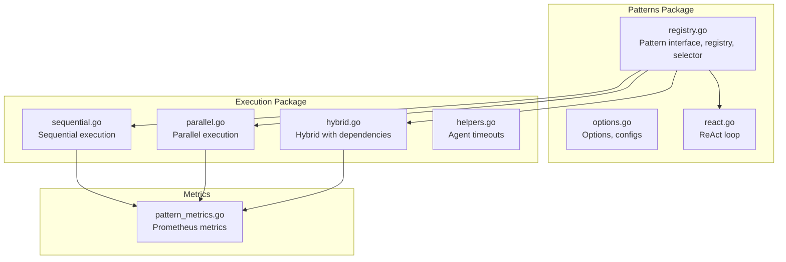
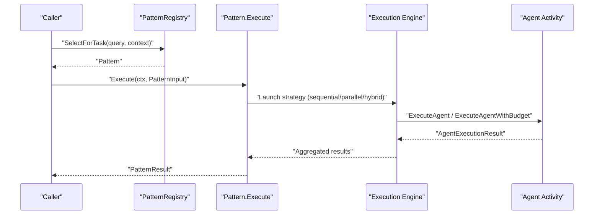
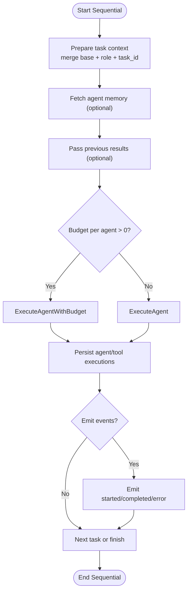
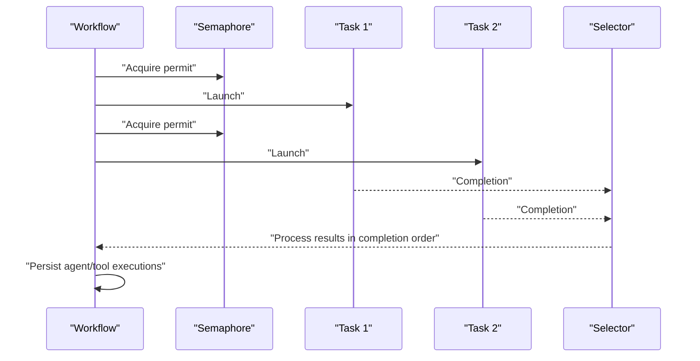
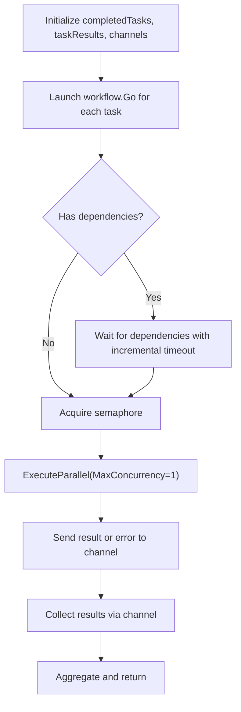
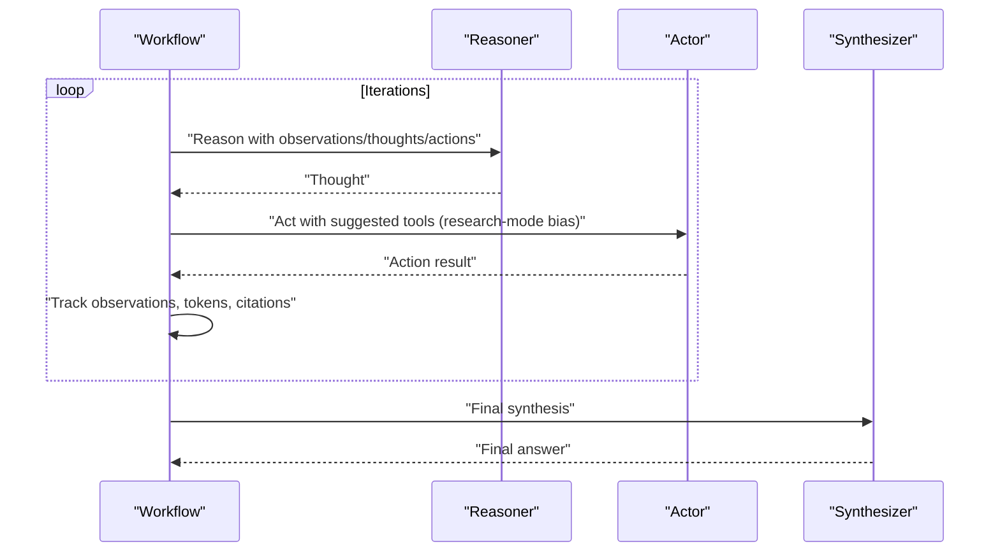
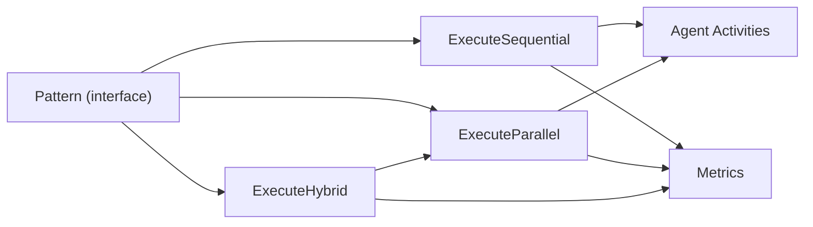

# Pattern Implementation Guide

<cite>
**Referenced Files in This Document**
- [registry.go](file://go/orchestrator/internal/workflows/patterns/registry.go)
- [options.go](file://go/orchestrator/internal/workflows/patterns/options.go)
- [sequential.go](file://go/orchestrator/internal/workflows/patterns/execution/sequential.go)
- [parallel.go](file://go/orchestrator/internal/workflows/patterns/execution/parallel.go)
- [hybrid.go](file://go/orchestrator/internal/workflows/patterns/execution/hybrid.go)
- [helpers.go](file://go/orchestrator/internal/workflows/patterns/execution/helpers.go)
- [react.go](file://go/orchestrator/internal/workflows/patterns/react.go)
- [pattern_metrics.go](file://go/orchestrator/internal/workflows/metrics/pattern_metrics.go)
- [patterns_exec_test.go](file://go/orchestrator/internal/workflows/patterns/patterns_exec_test.go)
- [registry_test.go](file://go/orchestrator/internal/workflows/patterns/registry_test.go)
</cite>

## Table of Contents
1. [Introduction](#introduction)
2. [Project Structure](#project-structure)
3. [Core Components](#core-components)
4. [Architecture Overview](#architecture-overview)
5. [Detailed Component Analysis](#detailed-component-analysis)
6. [Dependency Analysis](#dependency-analysis)
7. [Performance Considerations](#performance-considerations)
8. [Troubleshooting Guide](#troubleshooting-guide)
9. [Conclusion](#conclusion)
10. [Appendices](#appendices)

## Introduction
This guide explains how to implement custom multi-agent patterns in Shannon’s orchestration system. It covers the Pattern interface, execution flows, configuration via PatternInput.Config, error handling, state management, performance optimization, testing strategies, debugging/logging, and maintenance practices. The goal is to enable you to add robust, testable, and observable pattern implementations that integrate cleanly with the existing orchestration framework.

## Project Structure
Shannon organizes pattern-related code under the Go orchestrator module, with a dedicated patterns package and an execution subpackage for orchestration primitives. Metrics for patterns are exposed via Prometheus.

**Diagram sources**
- [registry.go](file://go/orchestrator/internal/workflows/patterns/registry.go#L35-L69)
- [options.go](file://go/orchestrator/internal/workflows/patterns/options.go#L3-L21)
- [sequential.go](file://go/orchestrator/internal/workflows/patterns/execution/sequential.go#L47-L395)
- [parallel.go](file://go/orchestrator/internal/workflows/patterns/execution/parallel.go#L48-L450)
- [hybrid.go](file://go/orchestrator/internal/workflows/patterns/execution/hybrid.go#L45-L161)
- [helpers.go](file://go/orchestrator/internal/workflows/patterns/execution/helpers.go#L8-L27)
- [pattern_metrics.go](file://go/orchestrator/internal/workflows/metrics/pattern_metrics.go#L8-L63)

**Section sources**
- [registry.go](file://go/orchestrator/internal/workflows/patterns/registry.go#L1-L190)
- [options.go](file://go/orchestrator/internal/workflows/patterns/options.go#L1-L21)

## Core Components
- Pattern interface: Defines Execute, GetType, GetCapabilities, and EstimateTokens.
- PatternInput: Provides query, context, history, session/user identifiers, Config (pattern-specific), budget, and model tier.
- PatternResult: Aggregates final result, tokens used, confidence, metadata, and per-agent results.
- PatternRegistry: Global registry with registration, selection, and selector customization.
- PatternSelector: Strategy for selecting a pattern given query and context hints.
- Options: Shared execution options (budget, session/user IDs, model tier, event emission, extra context).

Implementation highlights:
- Registry enforces a global singleton initialized once and registers default patterns.
- Selector honors explicit pattern hints in context and falls back to first available pattern.
- Pattern implementations return PatternResult with aggregated agent results for downstream synthesis or evaluation.

**Section sources**
- [registry.go](file://go/orchestrator/internal/workflows/patterns/registry.go#L35-L69)
- [registry.go](file://go/orchestrator/internal/workflows/patterns/registry.go#L110-L178)
- [options.go](file://go/orchestrator/internal/workflows/patterns/options.go#L3-L21)

## Architecture Overview
The orchestration pipeline composes patterns with execution strategies and agent activities. Patterns define the high-level orchestration logic; execution packages coordinate agent invocations, manage concurrency, and record telemetry.

**Diagram sources**
- [registry.go](file://go/orchestrator/internal/workflows/patterns/registry.go#L162-L170)
- [sequential.go](file://go/orchestrator/internal/workflows/patterns/execution/sequential.go#L47-L395)
- [parallel.go](file://go/orchestrator/internal/workflows/patterns/execution/parallel.go#L48-L450)
- [hybrid.go](file://go/orchestrator/internal/workflows/patterns/execution/hybrid.go#L45-L161)

## Detailed Component Analysis

### Pattern Interface and Registry
- Pattern interface: Execute(ctx, input) -> PatternResult, GetType(), GetCapabilities(), EstimateTokens(input).
- PatternInput.Config: Pattern-specific configuration object; patterns must validate and parse it safely.
- PatternRegistry: Thread-safe registry with Register, Get, List, SelectForTask, and SetSelector.
- DefaultPatternSelector: Heuristic selection honoring context["pattern"] hint.

Implementation steps for a new pattern:
1. Define a struct implementing Pattern interface.
2. Implement Execute(ctx, input) to:
   - Parse input.PatternInput.Config into a strongly typed config struct.
   - Validate inputs and context.
   - Coordinate agent execution via sequential/parallel/hybrid execution helpers.
   - Aggregate results into PatternResult.
3. Implement GetType() and GetCapabilities().
4. Implement EstimateTokens(input) conservatively.
5. Register the pattern via registry.Register().

Integration points:
- Use Options for shared budget/session/user/model tier.
- Use workflow logger for structured logs.
- Emit streaming events when configured.

**Section sources**
- [registry.go](file://go/orchestrator/internal/workflows/patterns/registry.go#L35-L69)
- [registry.go](file://go/orchestrator/internal/workflows/patterns/registry.go#L110-L178)
- [options.go](file://go/orchestrator/internal/workflows/patterns/options.go#L3-L21)

### Sequential Execution Flow
Sequential execution runs tasks in order, optionally passing prior results and extracting numeric/tool outputs. It supports budgeted and non-budgeted agent execution, token recording, persistence, and streaming events.

Key behaviors:
- Builds deterministic agent names from workflow ID and index.
- Optionally fetches agent memory from session.
- Passes previous results and numeric/tool extractions into subsequent contexts.
- Emits agent-started/completed/error events when enabled.
- Records token usage and persists agent/tool executions.
- Continues on failures to maintain pipeline resilience.

**Diagram sources**
- [sequential.go](file://go/orchestrator/internal/workflows/patterns/execution/sequential.go#L47-L395)

**Section sources**
- [sequential.go](file://go/orchestrator/internal/workflows/patterns/execution/sequential.go#L47-L395)

### Parallel Execution Flow
Parallel execution launches multiple tasks concurrently with a semaphore-controlled limit. It supports per-task context overrides, optional budgeting, token recording, persistence, and streaming.

Key behaviors:
- Creates a semaphore for concurrency control.
- Uses a channel-based future collection with a selector to process completions in arrival order.
- Supports per-task context overrides and optional parent area tagging.
- Emits agent-started/completed/error events and records token usage.
- Persists agent and tool executions asynchronously.

**Diagram sources**
- [parallel.go](file://go/orchestrator/internal/workflows/patterns/execution/parallel.go#L48-L450)

**Section sources**
- [parallel.go](file://go/orchestrator/internal/workflows/patterns/execution/parallel.go#L48-L450)

### Hybrid Execution Flow
Hybrid execution combines parallelism with dependency management. Tasks without dependencies run in parallel up to the concurrency limit; tasks with dependencies wait for prerequisites using incremental timeouts.

Key behaviors:
- Maintains a shared map of completed tasks and results.
- Waits for dependencies using short check intervals within a timeout window.
- Executes each task via the parallel engine with MaxConcurrency=1.
- Emits events and persists results.

**Diagram sources**
- [hybrid.go](file://go/orchestrator/internal/workflows/patterns/execution/hybrid.go#L45-L161)
- [hybrid.go](file://go/orchestrator/internal/workflows/patterns/execution/hybrid.go#L348-L407)

**Section sources**
- [hybrid.go](file://go/orchestrator/internal/workflows/patterns/execution/hybrid.go#L45-L161)
- [hybrid.go](file://go/orchestrator/internal/workflows/patterns/execution/hybrid.go#L348-L407)

### ReAct Loop Pattern
The ReAct pattern coordinates a Reason-Act-Observe loop with optional budgeting, streaming, and final synthesis. It tracks thoughts, actions, and observations, enforces minimum iterations, and supports research-mode tool suggestions.

Key behaviors:
- Alternates between reasoning and acting phases.
- Emits streaming progress and agent lifecycle events.
- Tracks tool usage and citations to inform early termination heuristics.
- Synthesizes a final answer using a dedicated synthesizer agent.
- Records token usage per phase and aggregates totals.

**Diagram sources**
- [react.go](file://go/orchestrator/internal/workflows/patterns/react.go#L47-L702)

**Section sources**
- [react.go](file://go/orchestrator/internal/workflows/patterns/react.go#L47-L702)

### Pattern Configuration via PatternInput.Config
- PatternInput.Config carries pattern-specific parameters as an interface{}.
- Best practice: Define a strongly typed config struct per pattern and parse/validate it in Execute.
- Use context hints (e.g., context["pattern"]) to influence selection.
- For budgeting, use Options.BudgetAgentMax and pass per-agent budgets to execution helpers.

Example parsing strategy:
- Type assert Config to a map or a concrete struct.
- Apply defaults for missing fields.
- Validate constraints (e.g., max iterations, timeouts).
- Propagate validated config into execution helpers.

**Section sources**
- [registry.go](file://go/orchestrator/internal/workflows/patterns/registry.go#L50-L60)
- [options.go](file://go/orchestrator/internal/workflows/patterns/options.go#L3-L11)

### Pattern Execution Flow: Input Processing, Agent Coordination, Aggregation, Error Handling
- Input processing: Merge base context with per-task overrides; compute deterministic agent IDs; optionally fetch agent memory; pass dependency results in hybrid.
- Agent coordination: Use sequential/parallel/hybrid engines; enforce concurrency limits; handle budgeting; emit streaming events.
- Result aggregation: Accumulate tokens, build PatternResult with final answer/confidence/metadata and per-agent results.
- Error handling: Log failures; continue in sequential; fail-fast in hybrid; record zero-token usage when configured; persist agent/tool executions.

**Section sources**
- [sequential.go](file://go/orchestrator/internal/workflows/patterns/execution/sequential.go#L60-L395)
- [parallel.go](file://go/orchestrator/internal/workflows/patterns/execution/parallel.go#L60-L450)
- [hybrid.go](file://go/orchestrator/internal/workflows/patterns/execution/hybrid.go#L75-L161)

## Dependency Analysis
- Pattern implementations depend on:
  - Pattern interface and registry for selection.
  - Execution helpers for orchestration.
  - Agent activities for execution.
  - Streaming for progress events.
  - Metrics for observability.
- Coupling:
  - Patterns are loosely coupled to execution helpers via function calls.
  - Registry centralizes selection and avoids tight coupling to individual patterns.
- Cohesion:
  - Each pattern encapsulates a cohesive orchestration strategy.
- External dependencies:
  - Temporal SDK for workflows and activities.
  - Prometheus client for metrics.

**Diagram sources**
- [registry.go](file://go/orchestrator/internal/workflows/patterns/registry.go#L35-L69)
- [sequential.go](file://go/orchestrator/internal/workflows/patterns/execution/sequential.go#L47-L395)
- [parallel.go](file://go/orchestrator/internal/workflows/patterns/execution/parallel.go#L48-L450)
- [hybrid.go](file://go/orchestrator/internal/workflows/patterns/execution/hybrid.go#L45-L161)
- [pattern_metrics.go](file://go/orchestrator/internal/workflows/metrics/pattern_metrics.go#L8-L63)

**Section sources**
- [registry.go](file://go/orchestrator/internal/workflows/patterns/registry.go#L35-L69)
- [pattern_metrics.go](file://go/orchestrator/internal/workflows/metrics/pattern_metrics.go#L8-L63)

## Performance Considerations
- Concurrency control: Use MaxConcurrency and semaphores to bound resource usage; validate concurrency limits in tests.
- Token accounting: Prefer budgeted agent execution to centralize token recording; avoid double-counting by checking budget flags.
- Zero-token visibility: Honor record_zero_token context flag to log or skip zero-token records.
- Human-in-the-loop timeouts: Increase activity timeouts for human-in-the-loop scenarios.
- Persistence: Use disconnected contexts for fire-and-forget persistence to avoid blocking the main workflow.
- Metrics: Record pattern executions, durations, agent counts, and token usage for trend analysis.

**Section sources**
- [parallel.go](file://go/orchestrator/internal/workflows/patterns/execution/parallel.go#L281-L361)
- [sequential.go](file://go/orchestrator/internal/workflows/patterns/execution/sequential.go#L270-L345)
- [helpers.go](file://go/orchestrator/internal/workflows/patterns/execution/helpers.go#L8-L27)
- [pattern_metrics.go](file://go/orchestrator/internal/workflows/metrics/pattern_metrics.go#L65-L94)

## Troubleshooting Guide
Common issues and remedies:
- Pattern not selected: Verify context["pattern"] hint and registry contents; ensure Register succeeded.
- Missing results in hybrid: Confirm dependency IDs exist and completedTasks are updated; check incremental timeout behavior.
- Excessive token usage: Switch to budgeted execution; validate model tier and provider fallbacks.
- Zero-token records: Enable record_zero_token context flag when diagnosing.
- Streaming gaps: Ensure EmitTaskUpdate is registered and parent workflow ID propagation is correct.

Testing tips:
- Unit-style workflow tests using the Temporal test suite to stub ExecuteAgent and validate orchestration logic.
- Concurrency tests to ensure overlapping activities respect limits.
- Dependency wait tests to validate incremental timeout behavior.

**Section sources**
- [registry_test.go](file://go/orchestrator/internal/workflows/patterns/registry_test.go#L7-L28)
- [patterns_exec_test.go](file://go/orchestrator/internal/workflows/patterns/patterns_exec_test.go#L100-L136)
- [patterns_exec_test.go](file://go/orchestrator/internal/workflows/patterns/patterns_exec_test.go#L138-L192)
- [patterns_exec_test.go](file://go/orchestrator/internal/workflows/patterns/patterns_exec_test.go#L194-L246)

## Conclusion
Implementing custom patterns in Shannon involves adhering to the Pattern interface, composing with proven execution strategies, and leveraging shared configuration and metrics. By validating inputs, managing state carefully, and instrumenting logs and metrics, you can deliver reliable, observable, and efficient multi-agent orchestration.

## Appendices

### Step-by-Step: Implementing a New Pattern
1. Define a struct implementing Pattern interface.
2. Implement Execute(ctx, input):
   - Parse input.PatternInput.Config into a typed config.
   - Validate and normalize inputs.
   - Choose and call an execution helper (sequential/parallel/hybrid).
   - Aggregate results into PatternResult.
3. Implement GetType() and GetCapabilities().
4. Implement EstimateTokens(input) conservatively.
5. Register the pattern via registry.Register().
6. Add tests using the Temporal test suite to validate orchestration and concurrency.
7. Instrument metrics and logging for observability.

### Example References
- Pattern interface and registry: [registry.go](file://go/orchestrator/internal/workflows/patterns/registry.go#L35-L69)
- Sequential execution: [sequential.go](file://go/orchestrator/internal/workflows/patterns/execution/sequential.go#L47-L395)
- Parallel execution: [parallel.go](file://go/orchestrator/internal/workflows/patterns/execution/parallel.go#L48-L450)
- Hybrid execution: [hybrid.go](file://go/orchestrator/internal/workflows/patterns/execution/hybrid.go#L45-L161)
- ReAct loop: [react.go](file://go/orchestrator/internal/workflows/patterns/react.go#L47-L702)
- Metrics: [pattern_metrics.go](file://go/orchestrator/internal/workflows/metrics/pattern_metrics.go#L8-L63)
- Tests: [patterns_exec_test.go](file://go/orchestrator/internal/workflows/patterns/patterns_exec_test.go#L30-L98), [registry_test.go](file://go/orchestrator/internal/workflows/patterns/registry_test.go#L7-L28)