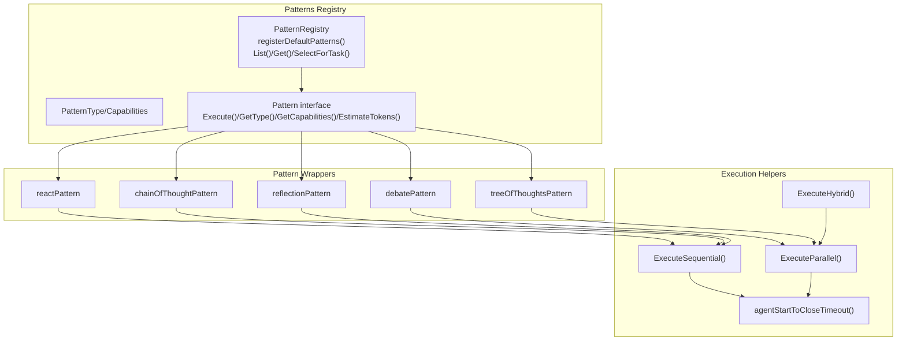
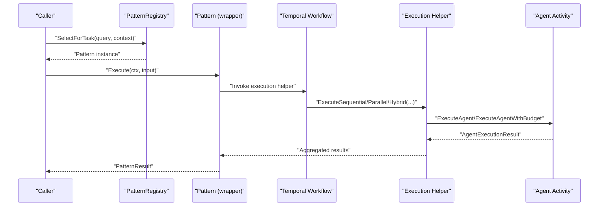
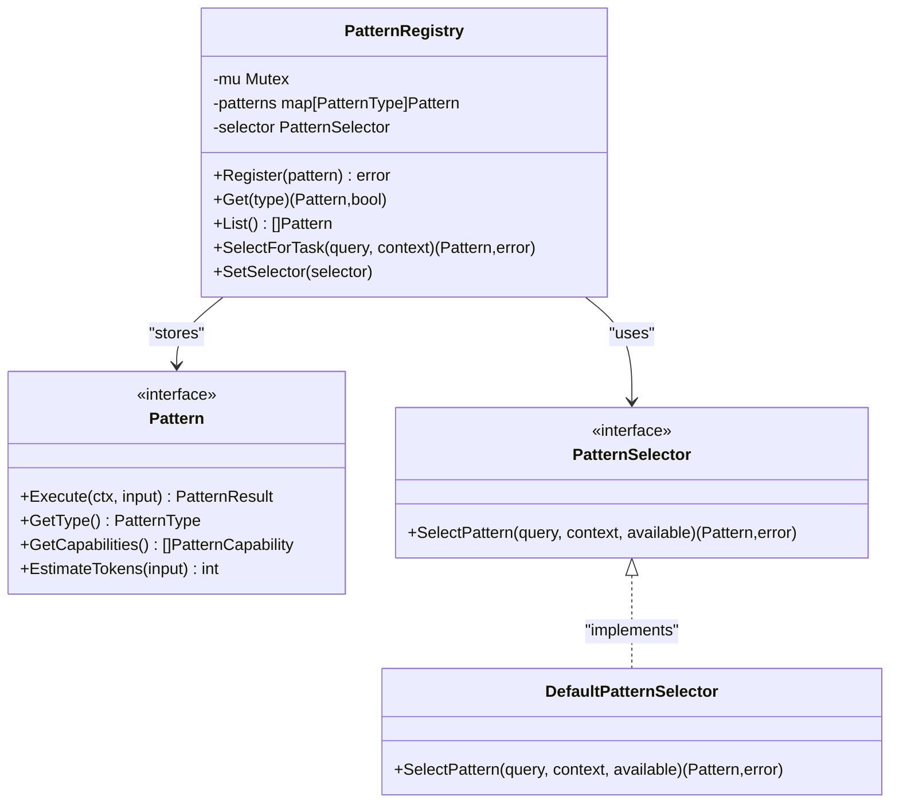
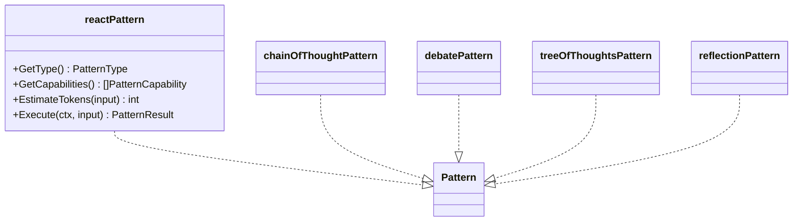
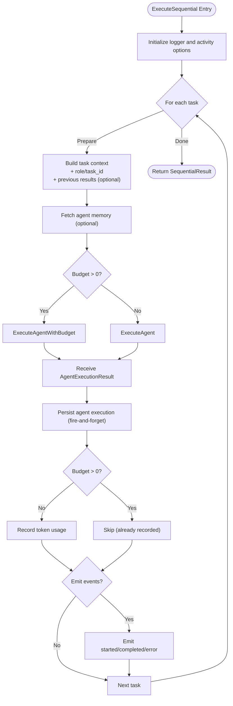
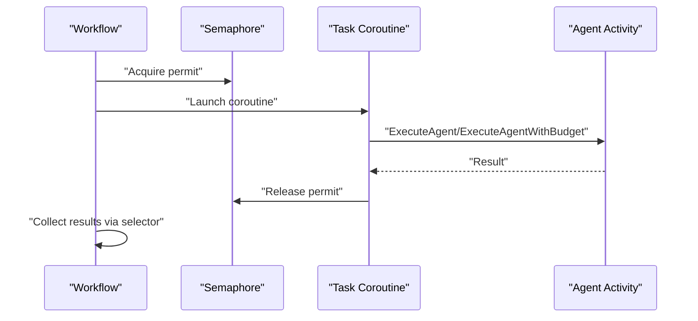
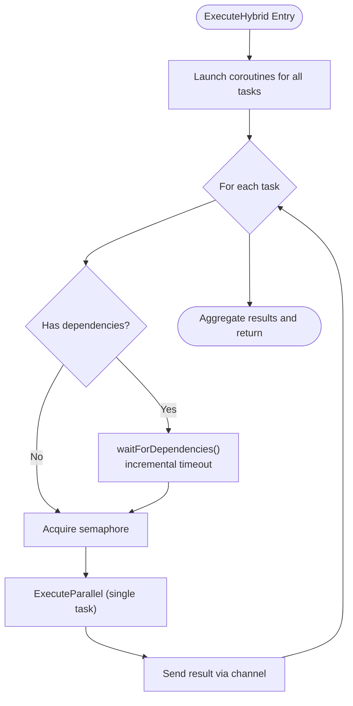
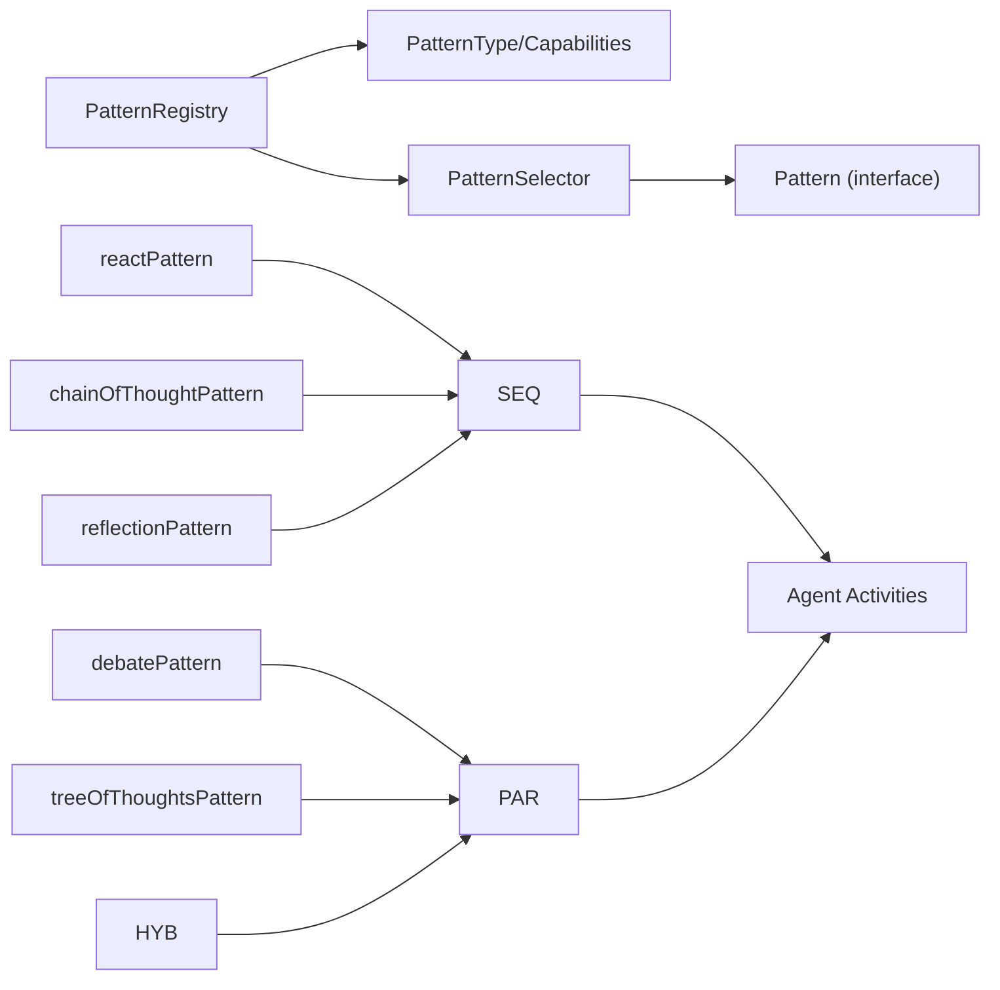

# Pattern Integration and Testing

<cite>
**Referenced Files in This Document**
- [registry.go](file://go/orchestrator/internal/workflows/patterns/registry.go)
- [options.go](file://go/orchestrator/internal/workflows/patterns/options.go)
- [wrappers.go](file://go/orchestrator/internal/workflows/patterns/wrappers.go)
- [helpers.go](file://go/orchestrator/internal/workflows/patterns/execution/helpers.go)
- [sequential.go](file://go/orchestrator/internal/workflows/patterns/execution/sequential.go)
- [parallel.go](file://go/orchestrator/internal/workflows/patterns/execution/parallel.go)
- [hybrid.go](file://go/orchestrator/internal/workflows/patterns/execution/hybrid.go)
- [patterns_exec_test.go](file://go/orchestrator/internal/workflows/patterns/patterns_exec_test.go)
- [registry_test.go](file://go/orchestrator/internal/workflows/patterns/registry_test.go)
- [degrade_test.go](file://go/orchestrator/internal/workflows/patterns/degrade_test.go)
- [README.md](file://docs/testing-strategy.md)
- [README.md](file://docs/testing.md)
- [README.md](file://README.md)
</cite>

## Table of Contents
1. [Introduction](#introduction)
2. [Project Structure](#project-structure)
3. [Core Components](#core-components)
4. [Architecture Overview](#architecture-overview)
5. [Detailed Component Analysis](#detailed-component-analysis)
6. [Dependency Analysis](#dependency-analysis)
7. [Performance Considerations](#performance-considerations)
8. [Troubleshooting Guide](#troubleshooting-guide)
9. [Conclusion](#conclusion)
10. [Appendices](#appendices)

## Introduction
This document provides comprehensive guidance for integrating and testing custom patterns within Shannon’s orchestration system. It covers unit testing patterns, integration testing with the Temporal workflow engine, and end-to-end pattern execution testing. It also documents pattern testing utilities, helper functions, and testing frameworks; presents examples of test cases for normal flows, error conditions, edge cases, and performance scenarios; and explains debugging techniques such as workflow inspection, state verification, and execution tracing. Finally, it outlines validation, capability testing, compatibility verification, documentation guidelines, test coverage requirements, and continuous integration practices.

## Project Structure
Shannon organizes pattern orchestration under the Go orchestrator module. The pattern system centers on a registry that exposes a common Pattern interface, wrapper structs that adapt legacy orchestration functions to the Pattern contract, and execution helpers for sequential, parallel, and hybrid workflows. Tests reside alongside the implementation to validate behavior across unit, integration, and end-to-end scenarios.

**Diagram sources**
- [registry.go](file://go/orchestrator/internal/workflows/patterns/registry.go#L1-L190)
- [wrappers.go](file://go/orchestrator/internal/workflows/patterns/wrappers.go#L1-L264)
- [sequential.go](file://go/orchestrator/internal/workflows/patterns/execution/sequential.go#L1-L475)
- [parallel.go](file://go/orchestrator/internal/workflows/patterns/execution/parallel.go#L1-L520)
- [hybrid.go](file://go/orchestrator/internal/workflows/patterns/execution/hybrid.go#L1-L408)
- [helpers.go](file://go/orchestrator/internal/workflows/patterns/execution/helpers.go#L1-L27)

**Section sources**
- [registry.go](file://go/orchestrator/internal/workflows/patterns/registry.go#L1-L190)
- [wrappers.go](file://go/orchestrator/internal/workflows/patterns/wrappers.go#L1-L264)
- [sequential.go](file://go/orchestrator/internal/workflows/patterns/execution/sequential.go#L1-L475)
- [parallel.go](file://go/orchestrator/internal/workflows/patterns/execution/parallel.go#L1-L520)
- [hybrid.go](file://go/orchestrator/internal/workflows/patterns/execution/hybrid.go#L1-L408)
- [helpers.go](file://go/orchestrator/internal/workflows/patterns/execution/helpers.go#L1-L27)

## Core Components
- Pattern interface and registry define the contract and lifecycle for patterns, including capability descriptors and selection strategies.
- Wrapper structs adapt core orchestration functions to the Pattern interface, standardizing inputs, outputs, and token estimation.
- Execution helpers encapsulate agent orchestration primitives: sequential, parallel, and hybrid execution with concurrency control, event emission, and persistence.

Key responsibilities:
- Pattern registry: registration, retrieval, listing, selection, and strategy customization.
- Pattern wrappers: input normalization, budget handling, token usage recording, and result shaping.
- Execution helpers: deterministic orchestration, context propagation, memory/session integration, and observability.

**Section sources**
- [registry.go](file://go/orchestrator/internal/workflows/patterns/registry.go#L35-L108)
- [wrappers.go](file://go/orchestrator/internal/workflows/patterns/wrappers.go#L14-L263)
- [sequential.go](file://go/orchestrator/internal/workflows/patterns/execution/sequential.go#L47-L395)
- [parallel.go](file://go/orchestrator/internal/workflows/patterns/execution/parallel.go#L48-L450)
- [hybrid.go](file://go/orchestrator/internal/workflows/patterns/execution/hybrid.go#L45-L161)

## Architecture Overview
The pattern system integrates with Temporal workflows and activities. Patterns are selected by the registry and executed via wrapper functions that call agent execution activities. Execution helpers manage concurrency, persistence, and token accounting. Streaming events and memory/session features are integrated for observability and continuity.

**Diagram sources**
- [registry.go](file://go/orchestrator/internal/workflows/patterns/registry.go#L162-L170)
- [wrappers.go](file://go/orchestrator/internal/workflows/patterns/wrappers.go#L31-L81)
- [sequential.go](file://go/orchestrator/internal/workflows/patterns/execution/sequential.go#L49-L395)
- [parallel.go](file://go/orchestrator/internal/workflows/patterns/execution/parallel.go#L50-L450)
- [hybrid.go](file://go/orchestrator/internal/workflows/patterns/execution/hybrid.go#L66-L161)

## Detailed Component Analysis

### Pattern Registry and Selection
The registry maintains a thread-safe map of patterns, exposes a selector interface, and registers default patterns. Selection logic honors explicit hints from context and falls back to a default heuristic.

**Diagram sources**
- [registry.go](file://go/orchestrator/internal/workflows/patterns/registry.go#L35-L108)
- [registry.go](file://go/orchestrator/internal/workflows/patterns/registry.go#L110-L190)

**Section sources**
- [registry.go](file://go/orchestrator/internal/workflows/patterns/registry.go#L110-L190)

### Pattern Wrappers and Token Estimation
Each wrapper implements the Pattern interface and delegates to the underlying orchestration functions. They normalize configuration, propagate budget and model tier, and shape results into PatternResult.

**Diagram sources**
- [wrappers.go](file://go/orchestrator/internal/workflows/patterns/wrappers.go#L14-L263)

**Section sources**
- [wrappers.go](file://go/orchestrator/internal/workflows/patterns/wrappers.go#L14-L263)

### Sequential Execution
Sequential execution runs tasks in order, optionally passing prior results and extracting numeric/tool outputs. It emits streaming events, persists agent/tool executions, and records token usage.

**Diagram sources**
- [sequential.go](file://go/orchestrator/internal/workflows/patterns/execution/sequential.go#L49-L395)

**Section sources**
- [sequential.go](file://go/orchestrator/internal/workflows/patterns/execution/sequential.go#L47-L395)

### Parallel Execution
Parallel execution launches tasks concurrently with a semaphore-controlled maximum concurrency. It aggregates results, records token usage, persists executions, and emits events.

**Diagram sources**
- [parallel.go](file://go/orchestrator/internal/workflows/patterns/execution/parallel.go#L48-L450)

**Section sources**
- [parallel.go](file://go/orchestrator/internal/workflows/patterns/execution/parallel.go#L48-L450)

### Hybrid Execution
Hybrid execution coordinates tasks with dependencies using a semaphore and channels. It waits for dependencies with incremental timeouts and executes dependent tasks in parallel up to the configured concurrency.

**Diagram sources**
- [hybrid.go](file://go/orchestrator/internal/workflows/patterns/execution/hybrid.go#L66-L161)
- [hybrid.go](file://go/orchestrator/internal/workflows/patterns/execution/hybrid.go#L348-L407)

**Section sources**
- [hybrid.go](file://go/orchestrator/internal/workflows/patterns/execution/hybrid.go#L45-L161)
- [hybrid.go](file://go/orchestrator/internal/workflows/patterns/execution/hybrid.go#L348-L407)

### Pattern Testing Utilities and Examples
Testing is organized across unit, integration, and end-to-end scopes:
- Unit tests validate registry selection, capability descriptors, and wrapper behavior.
- Integration tests exercise execution helpers against Temporal workflows.
- End-to-end tests validate complete pattern flows.

Representative test coverage areas:
- Normal execution flows: successful pattern execution, token accounting, and event emission.
- Error conditions: activity failures, dependency timeouts, and budget exhaustion.
- Edge cases: zero-token scenarios, human-in-the-loop timeouts, and dependency result extraction.
- Performance scenarios: concurrency limits, persistence overhead, and memory/session effects.

**Section sources**
- [patterns_exec_test.go](file://go/orchestrator/internal/workflows/patterns/patterns_exec_test.go)
- [registry_test.go](file://go/orchestrator/internal/workflows/patterns/registry_test.go)
- [degrade_test.go](file://go/orchestrator/internal/workflows/patterns/degrade_test.go)

## Dependency Analysis
The pattern system exhibits low coupling and high cohesion:
- PatternRegistry depends on Pattern implementations and the selector interface.
- Pattern wrappers depend on execution helpers and agent activities.
- Execution helpers depend on activities, pricing, models, and persistence utilities.

**Diagram sources**
- [registry.go](file://go/orchestrator/internal/workflows/patterns/registry.go#L110-L190)
- [wrappers.go](file://go/orchestrator/internal/workflows/patterns/wrappers.go#L14-L263)
- [sequential.go](file://go/orchestrator/internal/workflows/patterns/execution/sequential.go#L1-L475)
- [parallel.go](file://go/orchestrator/internal/workflows/patterns/execution/parallel.go#L1-L520)
- [hybrid.go](file://go/orchestrator/internal/workflows/patterns/execution/hybrid.go#L1-L408)

**Section sources**
- [registry.go](file://go/orchestrator/internal/workflows/patterns/registry.go#L110-L190)
- [wrappers.go](file://go/orchestrator/internal/workflows/patterns/wrappers.go#L14-L263)
- [sequential.go](file://go/orchestrator/internal/workflows/patterns/execution/sequential.go#L1-L475)
- [parallel.go](file://go/orchestrator/internal/workflows/patterns/execution/parallel.go#L1-L520)
- [hybrid.go](file://go/orchestrator/internal/workflows/patterns/execution/hybrid.go#L1-L408)

## Performance Considerations
- Concurrency control: Use semaphores to cap parallelism and prevent resource contention.
- Persistence overhead: Fire-and-forget persistence reduces workflow latency; ensure downstream systems handle asynchronous writes.
- Token accounting: Prefer budgeted activities for precise cost control; fall back to post-execution recording when budgets are absent.
- Human-in-the-loop: Extended timeouts enable manual intervention without compromising determinism.
- Observability: Streaming events and logging aid performance monitoring and debugging.

[No sources needed since this section provides general guidance]

## Troubleshooting Guide
Common issues and remedies:
- Pattern not selected: Verify context hints and ensure patterns are registered.
- Execution timeouts: Adjust human-in-loop timeouts and activity retry policies.
- Missing token records: Confirm budget vs. post-execution recording paths.
- Dependency deadlocks: Use incremental dependency waits and appropriate timeouts.
- Concurrency bottlenecks: Tune MaxConcurrency and semaphore usage.

Debugging techniques:
- Inspect workflow history and logs in the Temporal UI.
- Trace activity invocations and futures resolution.
- Validate session memory and agent memory integration.
- Verify streaming events and persistence activities.

**Section sources**
- [helpers.go](file://go/orchestrator/internal/workflows/patterns/execution/helpers.go#L8-L27)
- [sequential.go](file://go/orchestrator/internal/workflows/patterns/execution/sequential.go#L67-L73)
- [parallel.go](file://go/orchestrator/internal/workflows/patterns/execution/parallel.go#L83-L89)
- [hybrid.go](file://go/orchestrator/internal/workflows/patterns/execution/hybrid.go#L351-L407)

## Conclusion
Shannon’s pattern system provides a robust, extensible framework for multi-agent orchestration. By leveraging a unified Pattern interface, wrapper adapters, and execution helpers, teams can integrate custom patterns with confidence. Comprehensive testing strategies—covering unit, integration, and end-to-end scenarios—ensure reliability, performance, and maintainability. Adhering to documented validation and CI practices guarantees compatibility and quality across releases.

[No sources needed since this section summarizes without analyzing specific files]

## Appendices

### A. Pattern Testing Strategy
- Unit testing: Validate registry selection, capability descriptors, and wrapper behavior with synthetic inputs.
- Integration testing: Run execution helpers against a real Temporal worker to verify concurrency, persistence, and token accounting.
- End-to-end testing: Execute complete patterns with realistic contexts, budgets, and sessions.

**Section sources**
- [README.md](file://docs/testing-strategy.md)
- [README.md](file://docs/testing.md)

### B. Validation, Capability Testing, and Compatibility Verification
- Capability testing: Confirm that patterns expose expected capabilities and that selection logic honors hints.
- Compatibility verification: Ensure wrappers remain compatible with upstream orchestration functions and that execution helpers preserve deterministic behavior.

**Section sources**
- [registry.go](file://go/orchestrator/internal/workflows/patterns/registry.go#L23-L48)
- [wrappers.go](file://go/orchestrator/internal/workflows/patterns/wrappers.go#L14-L263)

### C. Guidelines for Pattern Documentation and Test Coverage
- Document pattern capabilities, configuration options, and token estimation heuristics.
- Provide test coverage for normal flows, error paths, edge cases, and performance scenarios.
- Include CI steps to validate pattern registration, selection, and execution.

**Section sources**
- [README.md](file://README.md)