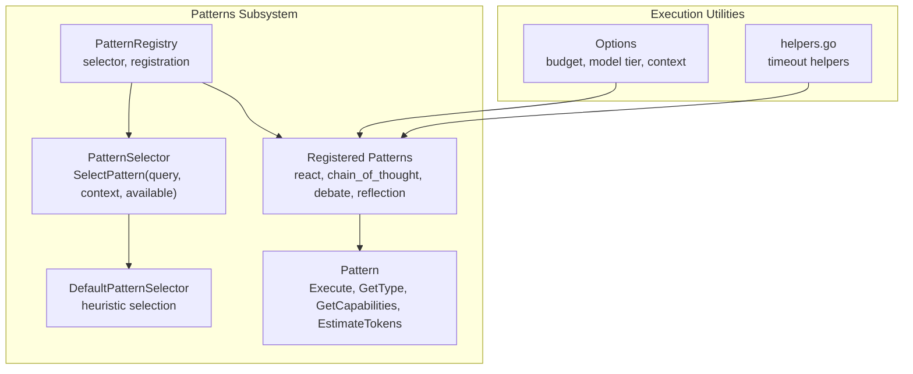
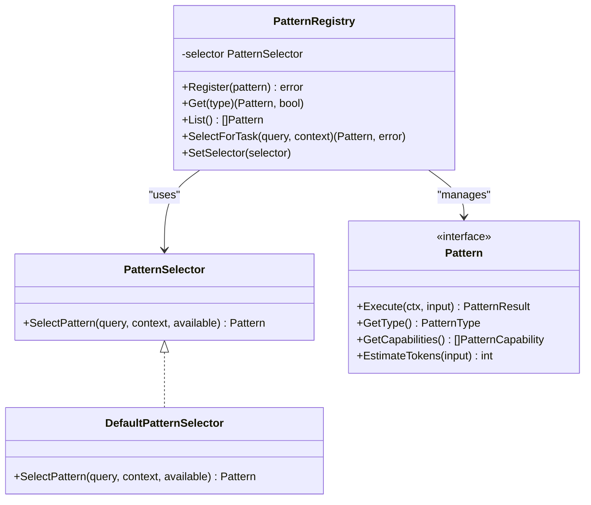
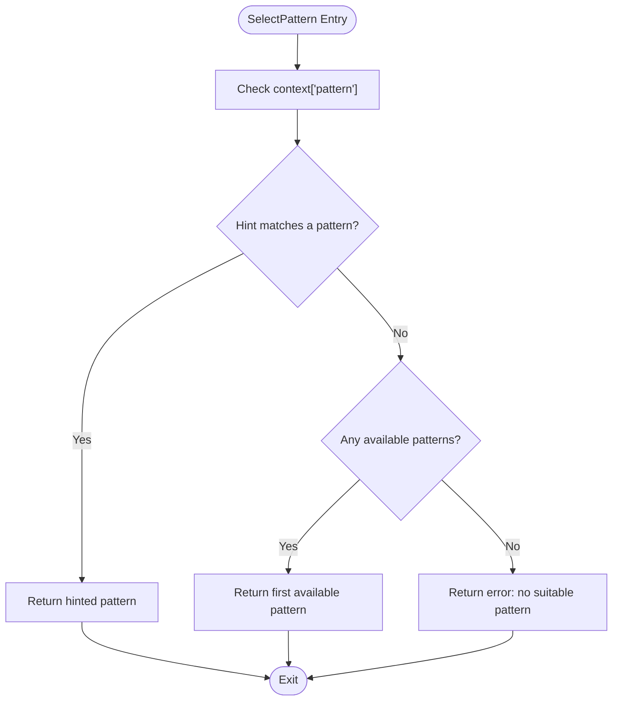
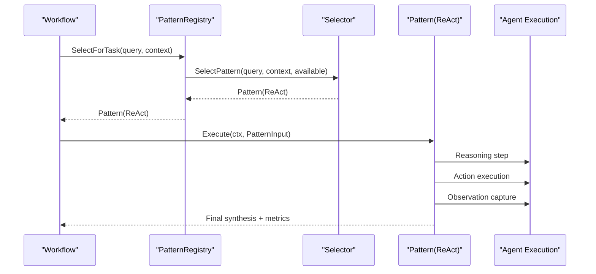
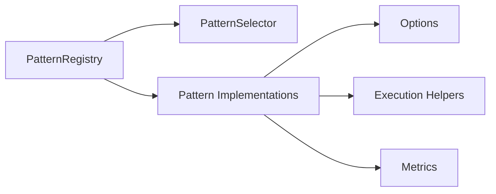

# Pattern Selection Strategies

<cite>
**Referenced Files in This Document**
- [registry.go](file://go/orchestrator/internal/workflows/patterns/registry.go)
- [options.go](file://go/orchestrator/internal/workflows/patterns/options.go)
- [react.go](file://go/orchestrator/internal/workflows/patterns/react.go)
- [chain_of_thought.go](file://go/orchestrator/internal/workflows/patterns/chain_of_thought.go)
- [debate.go](file://go/orchestrator/internal/workflows/patterns/debate.go)
- [reflection.go](file://go/orchestrator/internal/workflows/patterns/reflection.go)
- [helpers.go](file://go/orchestrator/internal/workflows/patterns/execution/helpers.go)
- [pattern_metrics.go](file://go/orchestrator/internal/workflows/metrics/pattern_metrics.go)
- [patterns_exec_test.go](file://go/orchestrator/internal/workflows/patterns/patterns_exec_test.go)
</cite>

## Table of Contents
1. [Introduction](#introduction)
2. [Project Structure](#project-structure)
3. [Core Components](#core-components)
4. [Architecture Overview](#architecture-overview)
5. [Detailed Component Analysis](#detailed-component-analysis)
6. [Dependency Analysis](#dependency-analysis)
7. [Performance Considerations](#performance-considerations)
8. [Troubleshooting Guide](#troubleshooting-guide)
9. [Conclusion](#conclusion)
10. [Appendices](#appendices)

## Introduction
This document explains pattern selection strategies in Shannon’s multi-agent system. It focuses on the PatternSelector interface and DefaultPatternSelector implementation, detailing how queries, context, and available patterns are evaluated to choose the optimal multi-agent pattern. It also covers the pattern selection algorithm, explicit pattern hints, capability matching, and heuristics. Guidance is provided for implementing custom selectors using machine learning-based selection, dynamic pattern switching, and performance-aware selection. Practical examples illustrate selection strategies for research workflows, decision-making processes, and iterative improvement scenarios. Finally, it documents pattern capability matching, compatibility considerations, optimization techniques, and testing/validation approaches.

## Project Structure
Shannon organizes pattern selection and execution under the orchestrator’s Go module. The patterns subsystem defines the Pattern interface, capability taxonomy, and the default selection logic. Individual patterns (ReAct, Chain-of-Thought, Debate, Reflection) implement the Pattern interface and expose configuration and execution utilities. Metrics and tests support observability and validation.

**Diagram sources**
- [registry.go](file://go/orchestrator/internal/workflows/patterns/registry.go#L71-L126)
- [options.go](file://go/orchestrator/internal/workflows/patterns/options.go#L3-L11)
- [helpers.go](file://go/orchestrator/internal/workflows/patterns/execution/helpers.go#L8-L26)

**Section sources**
- [registry.go](file://go/orchestrator/internal/workflows/patterns/registry.go#L1-L190)
- [options.go](file://go/orchestrator/internal/workflows/patterns/options.go#L1-L21)
- [helpers.go](file://go/orchestrator/internal/workflows/patterns/execution/helpers.go#L1-L27)

## Core Components
- PatternSelector interface: Defines the contract for selecting a pattern given a query, context, and available patterns.
- DefaultPatternSelector: Implements a simple heuristic-based selection strategy, honoring explicit hints and falling back to the first available pattern.
- PatternRegistry: Manages pattern registration, exposes selection APIs, and holds the active selector.
- Pattern interface: Standardized shape for all patterns, including capability declarations and token estimation.
- Pattern implementations: ReAct, Chain-of-Thought, Debate, and Reflection demonstrate different capabilities and execution flows.

Key responsibilities:
- Query analysis: Extract intent and constraints from the query string.
- Context evaluation: Inspect context keys such as explicit pattern hints and research modes.
- Available pattern assessment: Match capabilities and heuristics to the task.
- Capability matching: Align pattern capabilities with the desired behavior (e.g., iterative improvement, multi-perspective, step-by-step).

**Section sources**
- [registry.go](file://go/orchestrator/internal/workflows/patterns/registry.go#L35-L108)
- [options.go](file://go/orchestrator/internal/workflows/patterns/options.go#L3-L11)

## Architecture Overview
The pattern selection architecture centers on the registry and selector. The registry lists available patterns and delegates selection to the configured PatternSelector. The default selector prioritizes explicit hints and falls back to a default pattern. Pattern implementations encapsulate their own capabilities and execution logic.

**Diagram sources**
- [registry.go](file://go/orchestrator/internal/workflows/patterns/registry.go#L35-L126)

## Detailed Component Analysis

### PatternSelector and DefaultPatternSelector
- PatternSelector: Contract for selecting a pattern given a query, context, and available patterns.
- DefaultPatternSelector: Heuristic-based selection that:
  - Respects an explicit pattern hint from context['pattern'].
  - Falls back to the first available pattern if none match the hint or if no hint is provided.
- PatternRegistry:
  - Holds the selector instance and exposes SelectForTask to choose a pattern for a given task.
  - Provides Register, Get, and List for managing patterns.
  - Uses a global registry initialized with default patterns.

Selection algorithm highlights:
- Explicit pattern hint: If context['pattern'] matches a registered pattern type, select it.
- Capability matching: While the default selector does not enforce capability matching, downstream selection can incorporate capabilities exposed by the Pattern interface.
- Heuristic-based fallback: If no hint matches, select the first available pattern.

**Diagram sources**
- [registry.go](file://go/orchestrator/internal/workflows/patterns/registry.go#L88-L108)

**Section sources**
- [registry.go](file://go/orchestrator/internal/workflows/patterns/registry.go#L80-L126)

### Pattern Capabilities and Compatibility
Patterns declare capabilities that describe their behavior:
- Iterative improvement
- Step-by-step reasoning
- Multi-perspective exploration
- Conflict resolution
- Exploration
- Consensus building

These capabilities enable higher-level selection strategies to align patterns with task requirements. For example:
- Research workflows often benefit from iterative improvement and multi-perspective exploration.
- Decision-making processes may favor conflict resolution and consensus building.
- Step-by-step reasoning suits Chain-of-Thought and ReAct.

Compatibility matrices can be constructed by mapping:
- Task requirement → Required capabilities → Compatible patterns → Estimated cost/time.

Note: The default selector does not enforce capability matching; custom selectors can integrate capability checks and scoring.

**Section sources**
- [registry.go](file://go/orchestrator/internal/workflows/patterns/registry.go#L23-L48)

### Pattern Implementations and Selection Fit

#### ReAct Loop (Reason-Act-Observe)
- Purpose: Step-by-step problem solving with iterative refinement.
- Capabilities: Iterative improvement, step-by-step, exploration.
- Context awareness: Honors research mode and tool suggestions; supports human-in-the-loop timeouts.
- Typical selection fit: Tasks requiring iterative exploration, tool use, and synthesis.

**Diagram sources**
- [registry.go](file://go/orchestrator/internal/workflows/patterns/registry.go#L162-L170)
- [react.go](file://go/orchestrator/internal/workflows/patterns/react.go#L47-L702)

**Section sources**
- [react.go](file://go/orchestrator/internal/workflows/patterns/react.go#L26-L702)
- [helpers.go](file://go/orchestrator/internal/workflows/patterns/execution/helpers.go#L8-L26)

#### Chain-of-Thought
- Purpose: Structured, step-by-step reasoning leading to a final answer.
- Capabilities: Step-by-step, exploration.
- Typical selection fit: Problems requiring explicit reasoning chains and clarity of thought.

**Section sources**
- [chain_of_thought.go](file://go/orchestrator/internal/workflows/patterns/chain_of_thought.go#L17-L295)

#### Debate
- Purpose: Multi-agent debate to explore multiple perspectives and reach consensus or a resolved position.
- Capabilities: Multi-perspective, conflict resolution, consensus building.
- Typical selection fit: Situations requiring balanced viewpoints and structured argumentation.

**Section sources**
- [debate.go](file://go/orchestrator/internal/workflows/patterns/debate.go#L17-L473)

#### Reflection
- Purpose: Iterative quality improvement by evaluating results and synthesizing enhancements.
- Capabilities: Iterative improvement.
- Typical selection fit: Outputs needing refinement, validation, and synthesis.

**Section sources**
- [reflection.go](file://go/orchestrator/internal/workflows/patterns/reflection.go#L17-L170)

### Implementing Custom Pattern Selectors

#### Machine Learning-Based Selection
- Data preparation: Build a dataset of queries, contexts, and outcomes for each pattern.
- Features: Extract query intent, context signals (e.g., research flags), historical performance, and capability vectors.
- Model: Train a classifier/regressor to predict the best pattern or rank candidates.
- Integration: Replace DefaultPatternSelector with a custom selector that:
  - Encodes inputs into features.
  - Scores available patterns.
  - Returns the highest-ranked pattern.

#### Dynamic Pattern Switching
- Runtime monitoring: Track token usage, latency, and quality metrics during execution.
- Thresholds: If performance degrades, switch to a more robust pattern (e.g., from ReAct to Reflection).
- Feedback loop: Incorporate outcome quality to adjust future selections.

#### Performance-Aware Selection
- Budget constraints: Prefer patterns with lower token estimates when budgets are tight.
- Model tier alignment: Choose patterns aligned with the selected model tier.
- Timeout handling: Favor patterns suited to human-in-the-loop constraints.

### Examples of Pattern Selection Strategies

- Research workflows:
  - Strategy: Prefer ReAct with research mode and Debate for multi-perspective synthesis.
  - Heuristics: Detect research context, enable iterative improvement, and cap observations/actions.
  - Compatibility: Iterative improvement, multi-perspective, exploration.

- Decision-making processes:
  - Strategy: Use Debate with moderator/voting to converge on a position.
  - Heuristics: Require consensus or apply voting thresholds.
  - Compatibility: Conflict resolution, consensus building.

- Iterative improvement scenarios:
  - Strategy: Apply Reflection after initial synthesis to refine outputs.
  - Heuristics: Trigger reflection based on confidence thresholds and feedback.
  - Compatibility: Iterative improvement.

### Pattern Capability Matching and Compatibility Matrices
- Capability taxonomy:
  - Iterative improvement
  - Step-by-step
  - Multi-perspective
  - Conflict resolution
  - Exploration
  - Consensus building
- Matrix construction:
  - Task requirement → Required capabilities → Compatible patterns → Estimated cost/time.
- Selection scoring:
  - Weighted match against required capabilities.
  - Cost/time estimates from EstimateTokens and runtime metrics.

### Selection Optimization Techniques
- Caching: Cache frequent query/context hashes to the selected pattern.
- Pruning: Filter incompatible patterns early using capability checks.
- Ranking: Rank remaining candidates by predicted quality or cost.
- A/B testing: Randomly assign patterns and measure outcomes to improve selection accuracy.

## Dependency Analysis
Pattern selection depends on:
- PatternRegistry for pattern discovery and selection delegation.
- PatternSelector for the selection strategy.
- Pattern implementations for capabilities and execution semantics.
- Options for budget and model tier alignment.
- Execution helpers for context-aware behavior (e.g., human-in-the-loop timeouts).

**Diagram sources**
- [registry.go](file://go/orchestrator/internal/workflows/patterns/registry.go#L71-L126)
- [options.go](file://go/orchestrator/internal/workflows/patterns/options.go#L3-L11)
- [helpers.go](file://go/orchestrator/internal/workflows/patterns/execution/helpers.go#L8-L26)

**Section sources**
- [registry.go](file://go/orchestrator/internal/workflows/patterns/registry.go#L71-L126)
- [options.go](file://go/orchestrator/internal/workflows/patterns/options.go#L3-L11)
- [helpers.go](file://go/orchestrator/internal/workflows/patterns/execution/helpers.go#L8-L26)

## Performance Considerations
- Token estimation: Use Pattern.EstimateTokens to pre-screen patterns under budget constraints.
- Model tier alignment: Prefer patterns aligned with the chosen model tier to balance quality and cost.
- Human-in-the-loop timeouts: Adjust timeouts for interactive workflows using context flags.
- Metrics collection: Observe pattern execution counts, durations, agent executions, and token usage to guide selection tuning.

[No sources needed since this section provides general guidance]

## Troubleshooting Guide
- No suitable pattern found:
  - Ensure at least one pattern is registered.
  - Verify the explicit pattern hint matches a registered type.
- Unexpected pattern selection:
  - Confirm context['pattern'] is correctly set.
  - Review capability matching and selection heuristics.
- Performance issues:
  - Monitor token usage and execution durations via metrics.
  - Adjust model tier or budget to optimize cost/performance.
- Testing and validation:
  - Use unit/integration tests to validate selection logic and pattern execution flows.
  - Validate human-in-the-loop timeouts and concurrency limits.

**Section sources**
- [registry.go](file://go/orchestrator/internal/workflows/patterns/registry.go#L162-L170)
- [pattern_metrics.go](file://go/orchestrator/internal/workflows/metrics/pattern_metrics.go#L65-L93)
- [patterns_exec_test.go](file://go/orchestrator/internal/workflows/patterns/patterns_exec_test.go#L100-L136)

## Conclusion
Shannon’s pattern selection system provides a flexible foundation for choosing multi-agent patterns. The default selector offers a pragmatic heuristic, while the Pattern interface and capability taxonomy enable advanced strategies. By integrating capability matching, performance-awareness, and dynamic switching, systems can adapt selection to diverse use cases. Metrics and tests support continuous improvement and validation of selection strategies.

[No sources needed since this section summarizes without analyzing specific files]

## Appendices

### Appendix A: Pattern Capabilities Reference
- Iterative improvement: Reflection, ReAct
- Step-by-step: Chain-of-Thought, ReAct
- Multi-perspective: Debate
- Conflict resolution: Debate
- Exploration: ReAct, Debate
- Consensus building: Debate

**Section sources**
- [registry.go](file://go/orchestrator/internal/workflows/patterns/registry.go#L23-L48)

### Appendix B: Metrics for Selection Validation
- Pattern execution totals and durations
- Agent executions by pattern
- Token usage by pattern
- Reflection improvements
- Workflow version distribution

**Section sources**
- [pattern_metrics.go](file://go/orchestrator/internal/workflows/metrics/pattern_metrics.go#L8-L93)