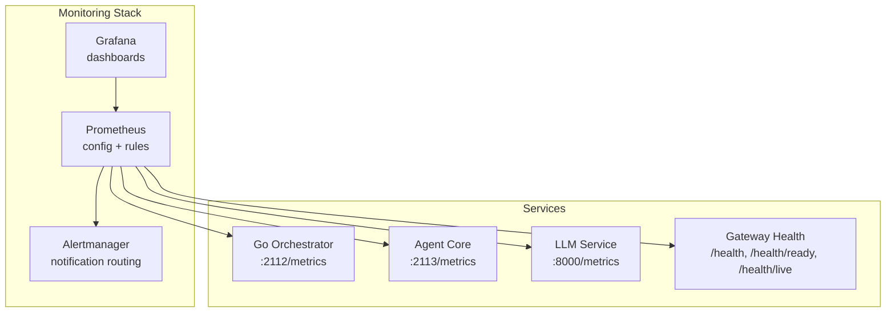
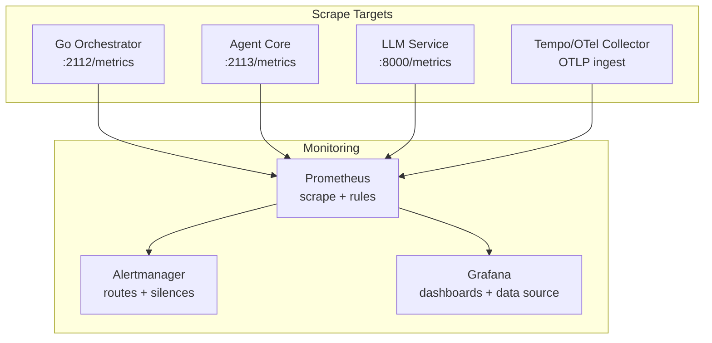
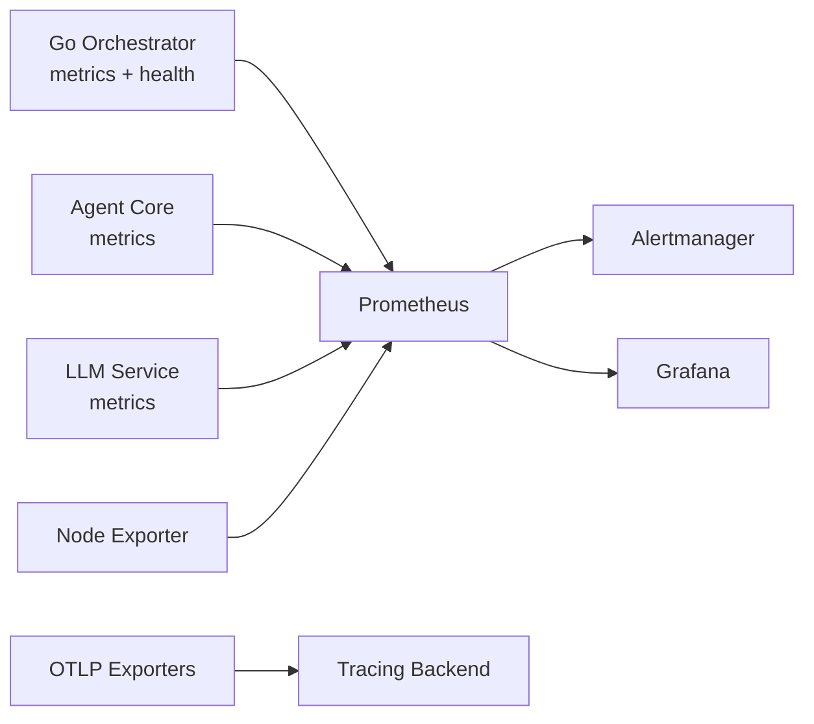
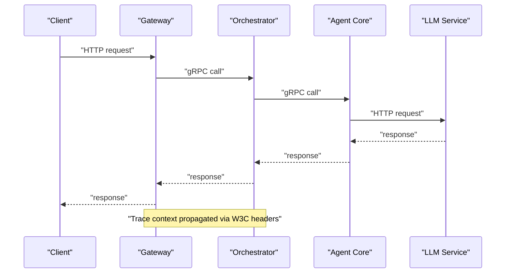
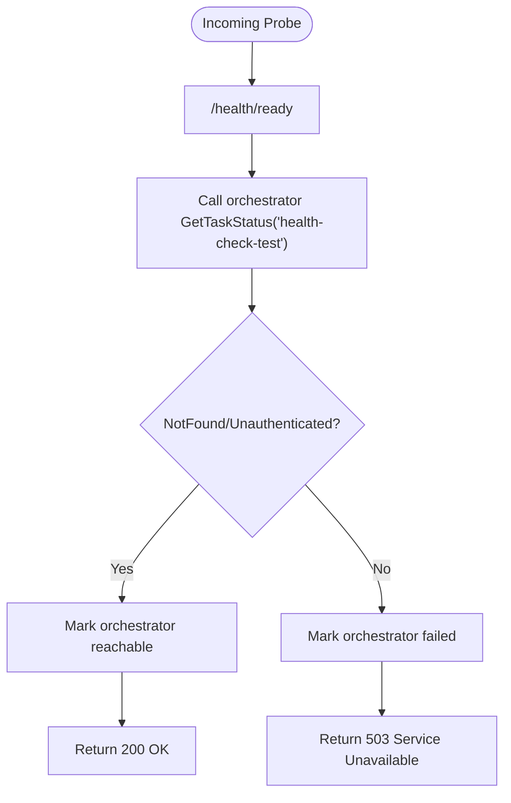

# Advanced Monitoring and Alerting

<cite>
**Referenced Files in This Document**
- [observability/README.md](file://observability/README.md)
- [observability/POLICY-METRICS.md](file://observability/POLICY-METRICS.md)
- [observability/prometheus/prometheus.yml](file://observability/prometheus/prometheus.yml)
- [observability/prometheus/alerts.yml](file://observability/prometheus/alerts.yml)
- [deploy/compose/grafana/docker-compose-grafana-prometheus.yml](file://deploy/compose/grafana/docker-compose-grafana-prometheus.yml)
- [observability/grafana/dashboards/enforcement.json](file://observability/grafana/dashboards/enforcement.json)
- [observability/grafana/dashboards/policy.json](file://observability/grafana/dashboards/policy.json)
- [go/orchestrator/internal/health/checkers.go](file://go/orchestrator/internal/health/checkers.go)
- [go/orchestrator/cmd/gateway/internal/handlers/health.go](file://go/orchestrator/cmd/gateway/internal/handlers/health.go)
- [go/orchestrator/internal/health/http.go](file://go/orchestrator/internal/health/http.go)
- [go/orchestrator/internal/metrics/metrics.go](file://go/orchestrator/internal/metrics/metrics.go)
- [go/orchestrator/cmd/gateway/internal/openai/metrics.go](file://go/orchestrator/cmd/gateway/internal/openai/metrics.go)
- [go/orchestrator/internal/policy/metrics.go](file://go/orchestrator/internal/policy/metrics.go)
- [go/orchestrator/internal/circuitbreaker/metrics.go](file://go/orchestrator/internal/circuitbreaker/metrics.go)
- [rust/agent-core/src/metrics.rs](file://rust/agent-core/src/metrics.rs)
</cite>

## Table of Contents
1. [Introduction](#introduction)
2. [Project Structure](#project-structure)
3. [Core Components](#core-components)
4. [Architecture Overview](#architecture-overview)
5. [Detailed Component Analysis](#detailed-component-analysis)
6. [Dependency Analysis](#dependency-analysis)
7. [Performance Considerations](#performance-considerations)
8. [Troubleshooting Guide](#troubleshooting-guide)
9. [Conclusion](#conclusion)
10. [Appendices](#appendices)

## Introduction
This document provides advanced monitoring and alerting guidance for enterprise deployments of Shannon. It covers Prometheus metrics collection (including custom metrics, labeling strategies, and performance indicators), Grafana dashboards for system health, workflow performance, and security monitoring, Prometheus Alertmanager configuration for threshold-based alerts and escalation, health checks for service discovery and auto-healing, distributed tracing with OpenTelemetry, and practical examples for setting up monitoring stacks, configuring custom alerts, and integrating with enterprise monitoring infrastructure. It also includes capacity planning, performance optimization, and proactive issue detection strategies.

## Project Structure
Monitoring and observability artifacts are organized under the observability directory and integrated with service-specific metrics and health endpoints. The stack includes:
- Prometheus configuration and alert rules
- Grafana dashboards for policy, enforcement, and workflow metrics
- Health endpoints for Kubernetes-style probes and service readiness
- Metrics exposed by Go orchestrator, Agent Core (Rust), and OpenAI-compatible gateway

**Diagram sources**
- [observability/prometheus/prometheus.yml](file://observability/prometheus/prometheus.yml#L20-L78)
- [go/orchestrator/internal/health/http.go](file://go/orchestrator/internal/health/http.go#L27-L33)
- [rust/agent-core/src/metrics.rs](file://rust/agent-core/src/metrics.rs#L266-L303)

**Section sources**
- [observability/README.md](file://observability/README.md#L44-L73)
- [observability/prometheus/prometheus.yml](file://observability/prometheus/prometheus.yml#L1-L78)
- [deploy/compose/grafana/docker-compose-grafana-prometheus.yml](file://deploy/compose/grafana/docker-compose-grafana-prometheus.yml#L1-L86)

## Core Components
- Prometheus metrics exposure:
  - Go Orchestrator: exposes workflow, task, agent, memory, vector DB, gRPC, cache, and policy metrics.
  - Agent Core (Rust): exposes task, FSM, memory, tool, and enforcement metrics.
  - OpenAI-compatible gateway: exposes request, token, error, rate-limit, streaming, and session metrics.
  - Policy engine: exposes evaluation counts, latency histograms, cache metrics, canary routing, and SLO error tracking.
  - Circuit breaker: exposes state, failure, and state-change counters.
- Health endpoints:
  - Dedicated health server with /health, /health/ready, /health/live, and /health/detailed endpoints.
  - Gateway readiness probe validates orchestrator reachability.
  - Component-specific health checks for Redis, database, Agent Core, and LLM service.
- Grafana dashboards:
  - Policy engine production dashboard with SLO, canary, cache, and deny reason panels.
  - Enforcement gateway dashboard for drops vs allowed and circuit breaker metrics.
- Alerting:
  - Prometheus alert rules for policy SLOs, service health, workflow performance, and token usage.
  - Alertmanager configured in Prometheus configuration.

**Section sources**
- [go/orchestrator/internal/metrics/metrics.go](file://go/orchestrator/internal/metrics/metrics.go#L8-L630)
- [go/orchestrator/cmd/gateway/internal/openai/metrics.go](file://go/orchestrator/cmd/gateway/internal/openai/metrics.go#L10-L234)
- [go/orchestrator/internal/policy/metrics.go](file://go/orchestrator/internal/policy/metrics.go#L11-L232)
- [go/orchestrator/internal/circuitbreaker/metrics.go](file://go/orchestrator/internal/circuitbreaker/metrics.go#L11-L149)
- [rust/agent-core/src/metrics.rs](file://rust/agent-core/src/metrics.rs#L10-L304)
- [go/orchestrator/internal/health/http.go](file://go/orchestrator/internal/health/http.go#L27-L33)
- [go/orchestrator/cmd/gateway/internal/handlers/health.go](file://go/orchestrator/cmd/gateway/internal/handlers/health.go#L37-L109)
- [go/orchestrator/internal/health/checkers.go](file://go/orchestrator/internal/health/checkers.go#L19-L311)
- [observability/grafana/dashboards/policy.json](file://observability/grafana/dashboards/policy.json#L1-L651)
- [observability/grafana/dashboards/enforcement.json](file://observability/grafana/dashboards/enforcement.json#L1-L55)
- [observability/prometheus/alerts.yml](file://observability/prometheus/alerts.yml#L1-L143)

## Architecture Overview
The monitoring architecture integrates Prometheus scraping, Alertmanager notifications, and Grafana visualization. Services expose metrics, health endpoints, and tracing metadata. Prometheus evaluates recording and alerting rules, and Alertmanager routes notifications to on-call systems.

**Diagram sources**
- [observability/prometheus/prometheus.yml](file://observability/prometheus/prometheus.yml#L20-L78)
- [observability/prometheus/alerts.yml](file://observability/prometheus/alerts.yml#L1-L143)
- [observability/README.md](file://observability/README.md#L20-L43)

## Detailed Component Analysis

### Prometheus Metrics Collection
- Go Orchestrator:
  - Workflow metrics: started/completed, duration histograms, by type and mode.
  - Task metrics: submitted, tokens used, cost USD histograms.
  - Agent metrics: executions, durations by agent and mode.
  - Memory/vector DB: fetches, items retrieved, search latency and counts.
  - gRPC metrics: request totals and durations by service/method.
  - Cache/session cache: hits/misses, size, evictions.
  - Pricing fallbacks, embeddings, decompositions, learning router, chunking, retrieval token budgets.
- Agent Core (Rust):
  - Tasks, FSM transitions/states, memory pool gauges, tool executions/durations, gRPC metrics, enforcement drops/allowed.
- OpenAI-compatible gateway:
  - Requests (success/error/rate-limited), latency histograms, tokens prompt/completion, errors by type/code, rate limits, sessions active/created/collisions, streaming chunks/duration/errors, time-to-first-token.
- Policy engine:
  - Evaluations by decision/mode/reason, latency histograms by mode, errors by type/mode, cache hits/misses, canary routing breakdown, top deny reasons, version info, mode comparison, SLO latency and error counters.
- Circuit breaker:
  - State gauge (closed/half-open/open), request counters by state/result, failure counters, state change counters, open-since timestamps.

Labeling strategy highlights:
- Consistent label sets across services (e.g., service/component labels in Prometheus configuration).
- Mode and status labels for policy and workflow metrics.
- Provider/model/tier labels for rate control and model tier selection drift.
- Reason labels for enforcement drops and memory fetches.
- High-cardinality avoidance via hashing/truncation for deny reasons and per-key rate limit remaining.

**Section sources**
- [go/orchestrator/internal/metrics/metrics.go](file://go/orchestrator/internal/metrics/metrics.go#L8-L630)
- [rust/agent-core/src/metrics.rs](file://rust/agent-core/src/metrics.rs#L10-L304)
- [go/orchestrator/cmd/gateway/internal/openai/metrics.go](file://go/orchestrator/cmd/gateway/internal/openai/metrics.go#L10-L234)
- [go/orchestrator/internal/policy/metrics.go](file://go/orchestrator/internal/policy/metrics.go#L11-L232)
- [go/orchestrator/internal/circuitbreaker/metrics.go](file://go/orchestrator/internal/circuitbreaker/metrics.go#L11-L149)
- [observability/prometheus/prometheus.yml](file://observability/prometheus/prometheus.yml#L20-L78)

### Grafana Dashboards Implementation
- Policy Engine Production Dashboard:
  - Panels for decision overview, error rate SLO, latency SLO (P50/P95/P99), cache hit rate, canary rollout status, policy version info, top deny reasons, dry-run vs enforce decisions, error budget, and routing breakdown.
  - Thresholds and unit configurations for SLO compliance.
- Enforcement Gateway Dashboard:
  - Timeseries for drops vs allowed, stat panel for circuit breaker open events, and rate of circuit breaker drops.

Import and configuration:
- Import dashboards via Grafana’s provisioning or API import process.
- Ensure Prometheus data source points to the configured Prometheus target.

**Section sources**
- [observability/grafana/dashboards/policy.json](file://observability/grafana/dashboards/policy.json#L1-L651)
- [observability/grafana/dashboards/enforcement.json](file://observability/grafana/dashboards/enforcement.json#L1-L55)
- [observability/README.md](file://observability/README.md#L51-L64)

### Alerting Configuration with Prometheus Alertmanager
- Alert groups:
  - Policy alerts: error rate SLO breach, latency SLO breach, emergency kill switch activation.
  - Service health alerts: orchestrator/down, agent-core/down, LLM service down.
  - Workflow alerts: error rate and scheduling latency thresholds.
  - Token usage alerts: budget exceeded rate and spikes.
- Severity and labels:
  - Critical/warning severity with service/component labels for routing.
- Alertmanager integration:
  - Prometheus configured to send alerts to Alertmanager targets.

Practical configuration steps:
- Place alert rules in the configured rule file path.
- Verify Prometheus reloads rules and scrapes targets.
- Configure Alertmanager receivers and routes for PagerDuty and Slack.

**Section sources**
- [observability/prometheus/alerts.yml](file://observability/prometheus/alerts.yml#L1-L143)
- [observability/prometheus/prometheus.yml](file://observability/prometheus/prometheus.yml#L9-L18)

### Health Checks for Service Discovery, Auto-Healing, and Failover
- Dedicated health server:
  - /health returns overall status and readiness/live flags.
  - /health/ready for Kubernetes readiness probes.
  - /health/live for liveness probes.
  - /health/detailed supports cached results for reduced overhead.
- Gateway readiness:
  - Validates orchestrator reachability by querying a non-existent task; treats NotFound/Unauthenticated as “reachable”.
- Component health checks:
  - Redis: circuit breaker state, ping, latency thresholds.
  - Database: circuit breaker state, ping, connection pool exhaustion detection, latency thresholds.
  - Agent Core: gRPC connection state, RPC health check, error classification (unavailable, deadline exceeded).
  - LLM service: placeholder for future HTTP-based checks.

Kubernetes integration:
- Use /health/ready for readinessProbe and /health/live for livenessProbe.
- Combine with service mesh or ingress health checks for traffic steering.

**Section sources**
- [go/orchestrator/internal/health/http.go](file://go/orchestrator/internal/health/http.go#L27-L33)
- [go/orchestrator/internal/health/http.go](file://go/orchestrator/internal/health/http.go#L35-L217)
- [go/orchestrator/cmd/gateway/internal/handlers/health.go](file://go/orchestrator/cmd/gateway/internal/handlers/health.go#L37-L109)
- [go/orchestrator/internal/health/checkers.go](file://go/orchestrator/internal/health/checkers.go#L19-L311)

### Distributed Tracing Integration with OpenTelemetry
- Go Orchestrator:
  - Minimal OpenTelemetry tracing with W3C traceparent propagation.
  - Spans for HTTP requests to LLM service, Qdrant operations, and gRPC calls to Agent Core.
  - Headers: W3C traceparent, X-Workflow-ID, X-Run-ID propagation; gRPC metadata includes x-workflow-id/x-run-id.
  - Export: OTLP to configurable endpoint.
- Python LLM Service:
  - FastAPI + httpx instrumentation via OpenTelemetry auto-instrumentation.
  - Export: OTLP to configurable endpoint.
- Validation:
  - Expected spans and headers when tracing is enabled.

**Section sources**
- [observability/README.md](file://observability/README.md#L5-L43)

### Practical Examples

#### Setting Up Monitoring Stacks
- Local compose stack:
  - Prometheus, Grafana, Node Exporter, and dashboard importer are orchestrated via Docker Compose.
  - Prometheus scrapes orchestrator, Agent Core, LLM service, Temporal, and exporters.
  - Grafana imports dashboards and connects to Prometheus data source.
- Enterprise integration:
  - Deploy Prometheus and Alertmanager behind your enterprise proxy/firewall.
  - Configure Prometheus scrape configs for internal endpoints and exporters.
  - Integrate Alertmanager with enterprise notification channels (PagerDuty, Slack, email).

**Section sources**
- [deploy/compose/grafana/docker-compose-grafana-prometheus.yml](file://deploy/compose/grafana/docker-compose-grafana-prometheus.yml#L1-L86)
- [observability/prometheus/prometheus.yml](file://observability/prometheus/prometheus.yml#L20-L78)

#### Configuring Custom Alerts
- Define new alert rules in the Prometheus rule file with appropriate severity and labels.
- Use existing metric names and label sets for consistency.
- Test expressions with PromQL console before deploying.

**Section sources**
- [observability/prometheus/alerts.yml](file://observability/prometheus/alerts.yml#L1-L143)

#### Integrating with Enterprise Monitoring Infrastructure
- Prometheus federation:
  - Use remote write or federation to centralize metrics.
- Grafana dashboards:
  - Export/import JSON dashboards to enterprise Grafana.
- Alertmanager:
  - Configure receivers and routes to integrate with enterprise on-call systems.

**Section sources**
- [observability/README.md](file://observability/README.md#L44-L73)

## Dependency Analysis
The monitoring stack depends on:
- Prometheus scraping targets (orchestrator, Agent Core, LLM service, exporters).
- Grafana consuming Prometheus data.
- Alertmanager receiving alerts from Prometheus.
- Tracing backend (OTLP) for telemetry ingestion.

**Diagram sources**
- [observability/prometheus/prometheus.yml](file://observability/prometheus/prometheus.yml#L20-L78)
- [observability/README.md](file://observability/README.md#L5-L43)

**Section sources**
- [observability/prometheus/prometheus.yml](file://observability/prometheus/prometheus.yml#L1-L78)

## Performance Considerations
- Label cardinality:
  - Policy deny reasons are hashed and truncated to limit cardinality.
  - Avoid per-user or high-cardinality labels on counters; prefer hashed labels where feasible.
- Histogram buckets:
  - Tune buckets for latency and token usage histograms to balance precision and storage.
- Scraping cadence:
  - Adjust scrape_interval and evaluation_interval for high-volume environments.
- Health check timeouts:
  - Keep health check timeouts short to prevent masking slow components.

[No sources needed since this section provides general guidance]

## Troubleshooting Guide
- High policy latency:
  - Check cache hit rate; investigate policy complexity and query patterns.
- High policy error rate:
  - Validate policy syntax, input formats, and review orchestrator logs.
- High denial rate:
  - Correlate with security events; review recent policy changes and user behavior.
- Low cache hit rate:
  - Investigate request variability, cache size, and TTL settings.
- Service down alerts:
  - Verify readiness probes and component health endpoints (/health/ready).
- Tracing gaps:
  - Confirm W3C traceparent propagation and OTLP export configuration.

**Section sources**
- [observability/POLICY-METRICS.md](file://observability/POLICY-METRICS.md#L166-L187)
- [go/orchestrator/internal/health/http.go](file://go/orchestrator/internal/health/http.go#L76-L144)
- [go/orchestrator/cmd/gateway/internal/handlers/health.go](file://go/orchestrator/cmd/gateway/internal/handlers/health.go#L54-L109)
- [observability/README.md](file://observability/README.md#L20-L43)

## Conclusion
Shannon’s observability stack provides comprehensive metrics, health endpoints, and alerting suitable for enterprise deployments. By leveraging Prometheus and Alertmanager for monitoring and alerting, Grafana dashboards for visualization, and OpenTelemetry for distributed tracing, operators can achieve robust visibility, proactive issue detection, and efficient incident response. Proper labeling, alert thresholds, and integration with enterprise tooling ensure scalable and maintainable operations.

[No sources needed since this section summarizes without analyzing specific files]

## Appendices

### Appendix A: End-to-End Request Flow with Tracing

**Diagram sources**
- [observability/README.md](file://observability/README.md#L9-L18)

### Appendix B: Health Check Flow

**Diagram sources**
- [go/orchestrator/cmd/gateway/internal/handlers/health.go](file://go/orchestrator/cmd/gateway/internal/handlers/health.go#L54-L109)