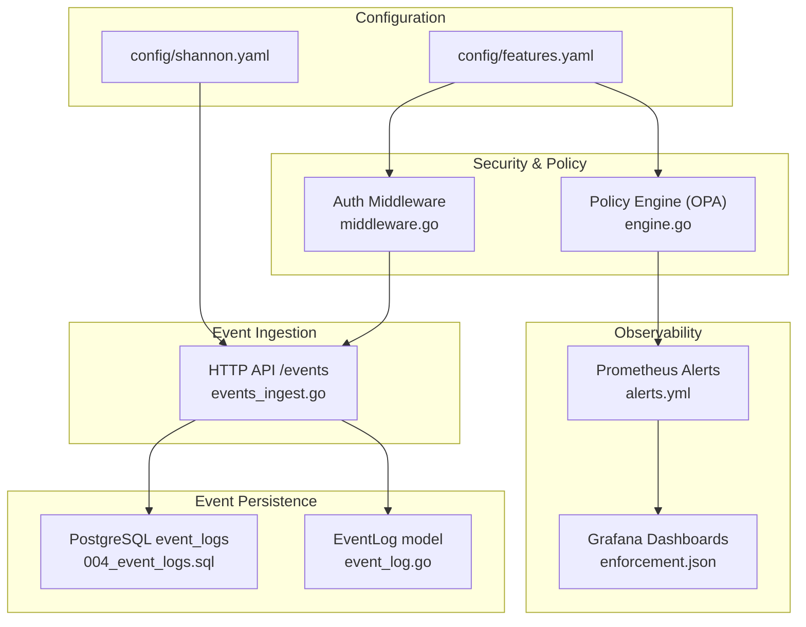
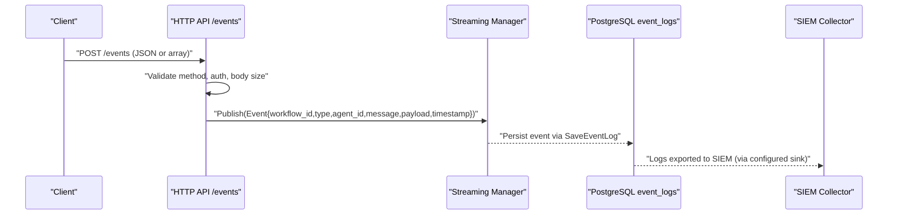
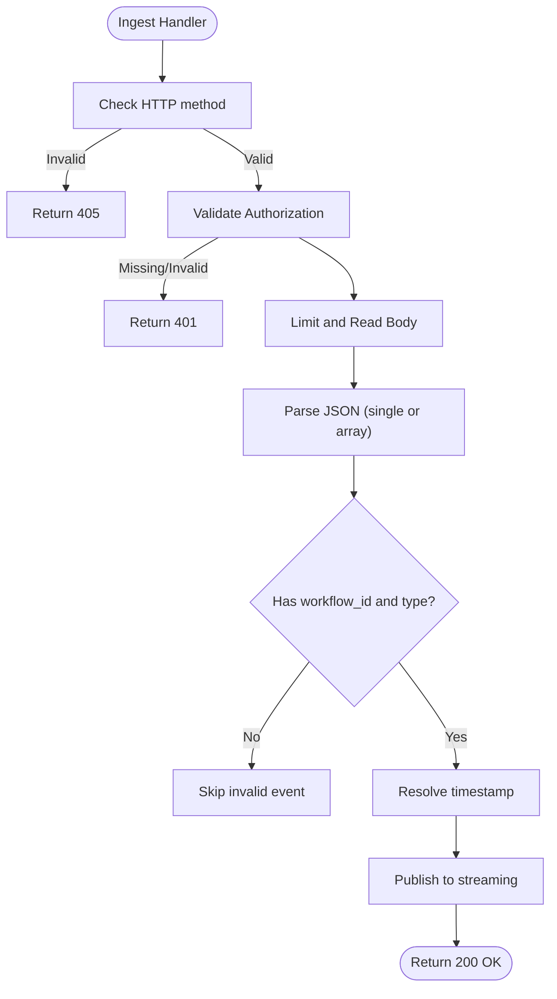
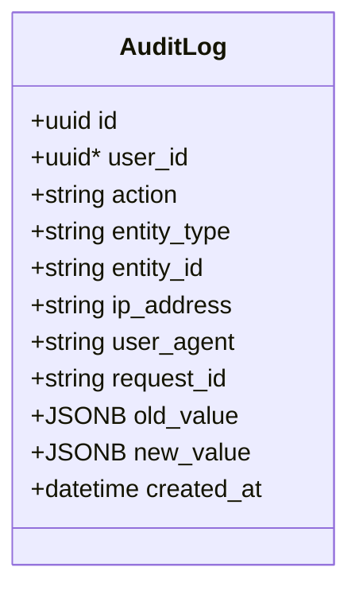
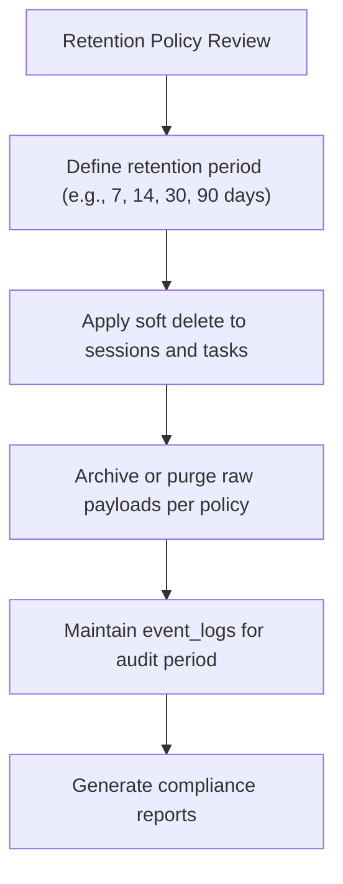
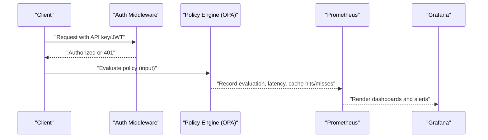
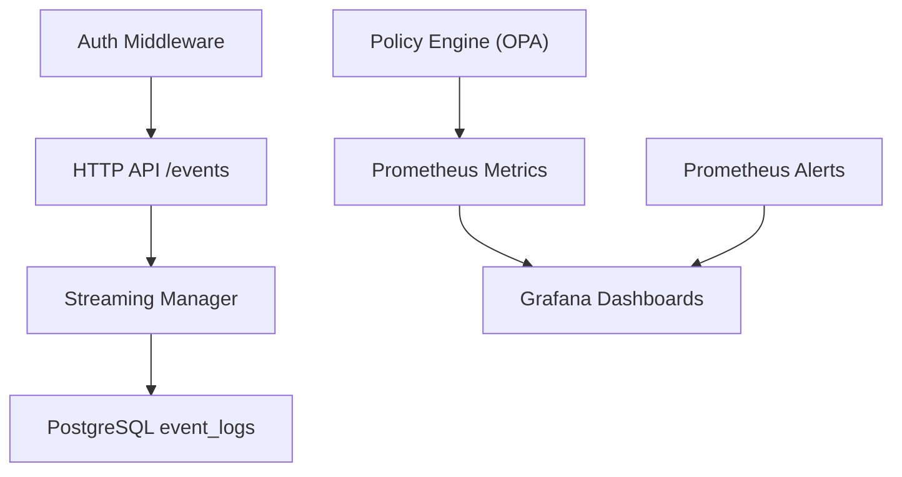

# Audit and Compliance

<cite>
**Referenced Files in This Document**
- [004_event_logs.sql](file://migrations/postgres/004_event_logs.sql)
- [event_log.go](file://go/orchestrator/internal/db/event_log.go)
- [models.go](file://go/orchestrator/internal/db/models.go)
- [events_ingest.go](file://go/orchestrator/internal/httpapi/events_ingest.go)
- [shannon.yaml](file://config/shannon.yaml)
- [features.yaml](file://config/features.yaml)
- [engine.go](file://go/orchestrator/internal/policy/engine.go)
- [middleware.go](file://go/orchestrator/internal/auth/middleware.go)
- [enforcement.json](file://observability/grafana/dashboards/enforcement.json)
- [alerts.yml](file://observability/prometheus/alerts.yml)
</cite>

## Table of Contents
1. [Introduction](#introduction)
2. [Project Structure](#project-structure)
3. [Core Components](#core-components)
4. [Architecture Overview](#architecture-overview)
5. [Detailed Component Analysis](#detailed-component-analysis)
6. [Dependency Analysis](#dependency-analysis)
7. [Performance Considerations](#performance-considerations)
8. [Troubleshooting Guide](#troubleshooting-guide)
9. [Conclusion](#conclusion)
10. [Appendices](#appendices)

## Introduction
This document provides comprehensive audit and compliance guidance for enterprise deployments of Shannon. It focuses on:
- Event logging and audit trails for user actions, system events, and workflow executions
- Compliance reporting capabilities aligned with SOX, GDPR, HIPAA, and other regulations
- Data governance features including lineage tracking, retention, and deletion
- Security event monitoring, intrusion/anomaly detection, and incident response
- Integration with enterprise SIEM systems for centralized log aggregation
- Practical examples for configuring audit policies, generating compliance reports, and automating monitoring
- Data privacy, encryption, and secure handling practices

## Project Structure
Shannon’s audit and compliance capabilities span configuration, event ingestion, persistent storage, policy enforcement, authentication, and observability. The following diagram maps the primary components involved in audit and compliance.

**Diagram sources**
- [shannon.yaml](file://config/shannon.yaml#L274-L282)
- [features.yaml](file://config/features.yaml#L148-L176)
- [events_ingest.go](file://go/orchestrator/internal/httpapi/events_ingest.go#L23-L25)
- [004_event_logs.sql](file://migrations/postgres/004_event_logs.sql#L5-L17)
- [event_log.go](file://go/orchestrator/internal/db/event_log.go#L24-L46)
- [middleware.go](file://go/orchestrator/internal/auth/middleware.go#L39-L114)
- [engine.go](file://go/orchestrator/internal/policy/engine.go#L85-L93)
- [alerts.yml](file://observability/prometheus/alerts.yml#L1-L143)
- [enforcement.json](file://observability/grafana/dashboards/enforcement.json#L1-L55)

**Section sources**
- [shannon.yaml](file://config/shannon.yaml#L274-L282)
- [features.yaml](file://config/features.yaml#L148-L176)
- [events_ingest.go](file://go/orchestrator/internal/httpapi/events_ingest.go#L23-L25)
- [004_event_logs.sql](file://migrations/postgres/004_event_logs.sql#L5-L17)
- [event_log.go](file://go/orchestrator/internal/db/event_log.go#L24-L46)
- [middleware.go](file://go/orchestrator/internal/auth/middleware.go#L39-L114)
- [engine.go](file://go/orchestrator/internal/policy/engine.go#L85-L93)
- [alerts.yml](file://observability/prometheus/alerts.yml#L1-L143)
- [enforcement.json](file://observability/grafana/dashboards/enforcement.json#L1-L55)

## Core Components
- Event logging and audit trail:
  - Persistent event storage via PostgreSQL with indexes optimized for audit queries
  - HTTP ingestion endpoint for streaming events with optional auth and rate-limiting safeguards
  - Structured event model supporting workflow, task, agent, and payload metadata
- Compliance reporting:
  - Centralized logging configuration supports JSON encoding suitable for SIEM ingestion
  - Metrics and alerts expose policy and service health for compliance dashboards
- Data governance:
  - Retention and soft-delete patterns visible in schema migrations
  - Audit log entity model supports change tracking for compliance
- Security and policy:
  - Authentication middleware supports API keys and JWT
  - Policy engine (OPA) enables configurable enforcement modes with dry-run and canary rollouts
- Observability:
  - Prometheus metrics and Grafana dashboards for enforcement and policy monitoring
  - Alert rules for policy error rates, latency, and emergency conditions

**Section sources**
- [004_event_logs.sql](file://migrations/postgres/004_event_logs.sql#L5-L17)
- [event_log.go](file://go/orchestrator/internal/db/event_log.go#L24-L46)
- [models.go](file://go/orchestrator/internal/db/models.go#L201-L219)
- [events_ingest.go](file://go/orchestrator/internal/httpapi/events_ingest.go#L36-L89)
- [shannon.yaml](file://config/shannon.yaml#L274-L282)
- [features.yaml](file://config/features.yaml#L148-L176)
- [engine.go](file://go/orchestrator/internal/policy/engine.go#L197-L282)
- [middleware.go](file://go/orchestrator/internal/auth/middleware.go#L39-L114)
- [alerts.yml](file://observability/prometheus/alerts.yml#L1-L143)
- [enforcement.json](file://observability/grafana/dashboards/enforcement.json#L1-L55)

## Architecture Overview
The audit and compliance architecture integrates event ingestion, persistence, security, and observability to support enterprise-grade auditing and reporting.

**Diagram sources**
- [events_ingest.go](file://go/orchestrator/internal/httpapi/events_ingest.go#L36-L89)
- [event_log.go](file://go/orchestrator/internal/db/event_log.go#L24-L46)
- [004_event_logs.sql](file://migrations/postgres/004_event_logs.sql#L5-L17)

## Detailed Component Analysis

### Event Logging and Audit Trails
- Schema and indexes:
  - The event_logs table captures workflow_id, task_id, type, agent_id, message, payload, timestamp, seq, and stream_id
  - Unique constraint on (workflow_id, type, seq) prevents duplicate timeline inserts
  - Multiple indexes optimize queries by workflow, type, timestamp, and sequence
- Event ingestion:
  - HTTP endpoint accepts single event or array, validates method and body size, and publishes to the streaming pipeline
  - Supports Bearer token or API key authentication when enabled
- Persistence:
  - SaveEventLog inserts rows with defaults and avoids duplicates using a conflict clause
  - nullIfEmpty helper ensures empty strings are stored as SQL NULLs

**Diagram sources**
- [events_ingest.go](file://go/orchestrator/internal/httpapi/events_ingest.go#L36-L89)

**Section sources**
- [004_event_logs.sql](file://migrations/postgres/004_event_logs.sql#L5-L17)
- [004_event_logs.sql](file://migrations/postgres/004_event_logs.sql#L46-L50)
- [event_log.go](file://go/orchestrator/internal/db/event_log.go#L24-L46)
- [events_ingest.go](file://go/orchestrator/internal/httpapi/events_ingest.go#L36-L89)

### Compliance Reporting and Standardized Formats
- Logging configuration:
  - JSON encoding and structured fields support SIEM parsing and standardized log formats
- Metrics and dashboards:
  - Prometheus metrics and Grafana dashboards provide visibility into enforcement and policy behavior
  - Alert rules detect anomalies and SLO breaches relevant to compliance
- Audit log model:
  - AuditLog captures user, action, entity, IP address, user agent, request ID, and old/new values for change tracking

**Diagram sources**
- [models.go](file://go/orchestrator/internal/db/models.go#L201-L219)

**Section sources**
- [shannon.yaml](file://config/shannon.yaml#L274-L282)
- [enforcement.json](file://observability/grafana/dashboards/enforcement.json#L1-L55)
- [alerts.yml](file://observability/prometheus/alerts.yml#L1-L143)
- [models.go](file://go/orchestrator/internal/db/models.go#L201-L219)

### Data Governance: Lineage, Retention, and Deletion
- Data lineage:
  - Event logs include workflow_id, task_id, agent_id, and payload enabling end-to-end traceability
- Retention:
  - Schema migration 007 adds soft delete for sessions; combined with event_logs retention policies, supports compliance-driven data lifecycle management
- Deletion:
  - Soft delete patterns facilitate controlled purging while maintaining audit trails

**Diagram sources**
- [004_event_logs.sql](file://migrations/postgres/004_event_logs.sql#L5-L17)
- [models.go](file://go/orchestrator/internal/db/models.go#L154-L170)

**Section sources**
- [004_event_logs.sql](file://migrations/postgres/004_event_logs.sql#L5-L17)
- [models.go](file://go/orchestrator/internal/db/models.go#L154-L170)

### Security Event Monitoring and Incident Response
- Authentication:
  - Middleware supports API key and JWT validation; development mode can bypass auth for testing
- Policy enforcement:
  - OPA-based engine supports three modes: off, dry-run, enforce
  - Canary rollouts and emergency kill switch enable controlled enforcement
  - Metrics and alerts track drops, denials, latency, and cache hit rates
- Observability:
  - Prometheus rules and Grafana dashboards visualize enforcement and policy health

**Diagram sources**
- [middleware.go](file://go/orchestrator/internal/auth/middleware.go#L39-L114)
- [engine.go](file://go/orchestrator/internal/policy/engine.go#L197-L282)
- [alerts.yml](file://observability/prometheus/alerts.yml#L1-L143)
- [enforcement.json](file://observability/grafana/dashboards/enforcement.json#L1-L55)

**Section sources**
- [middleware.go](file://go/orchestrator/internal/auth/middleware.go#L39-L114)
- [engine.go](file://go/orchestrator/internal/policy/engine.go#L197-L282)
- [alerts.yml](file://observability/prometheus/alerts.yml#L1-L143)
- [enforcement.json](file://observability/grafana/dashboards/enforcement.json#L1-L55)

### SIEM Integration for Centralized Log Aggregation
- Logging format:
  - JSON encoding and structured fields align with SIEM expectations
- Export pathways:
  - Configure your SIEM to ingest logs from the configured output paths
  - Use the event_logs table as a source for historical audit queries and exports

**Section sources**
- [shannon.yaml](file://config/shannon.yaml#L274-L282)
- [004_event_logs.sql](file://migrations/postgres/004_event_logs.sql#L5-L17)

## Dependency Analysis
The following diagram highlights dependencies among audit and compliance components.

**Diagram sources**
- [events_ingest.go](file://go/orchestrator/internal/httpapi/events_ingest.go#L36-L89)
- [event_log.go](file://go/orchestrator/internal/db/event_log.go#L24-L46)
- [middleware.go](file://go/orchestrator/internal/auth/middleware.go#L39-L114)
- [engine.go](file://go/orchestrator/internal/policy/engine.go#L197-L282)
- [alerts.yml](file://observability/prometheus/alerts.yml#L1-L143)
- [enforcement.json](file://observability/grafana/dashboards/enforcement.json#L1-L55)

**Section sources**
- [events_ingest.go](file://go/orchestrator/internal/httpapi/events_ingest.go#L36-L89)
- [event_log.go](file://go/orchestrator/internal/db/event_log.go#L24-L46)
- [middleware.go](file://go/orchestrator/internal/auth/middleware.go#L39-L114)
- [engine.go](file://go/orchestrator/internal/policy/engine.go#L197-L282)
- [alerts.yml](file://observability/prometheus/alerts.yml#L1-L143)
- [enforcement.json](file://observability/grafana/dashboards/enforcement.json#L1-L55)

## Performance Considerations
- Event ingestion throughput:
  - HTTP handler enforces a maximum request body size to mitigate DoS
  - Publishing to the streaming pipeline occurs per event; batch ingestion reduces overhead
- Database performance:
  - Indexes on workflow_id, type, timestamp, and sequence improve audit queries
  - Conflict handling on (workflow_id, type, seq) prevents duplicate inserts
- Policy evaluation:
  - Decision caching reduces repeated evaluations; tune cache capacity and TTL per workload
  - Canary rollouts and emergency kill switch protect against misconfigurations

[No sources needed since this section provides general guidance]

## Troubleshooting Guide
- Unauthorized or missing credentials:
  - Verify Authorization header or API key; ensure auth is enabled in configuration
- Invalid or malformed JSON:
  - Confirm the request body matches expected fields and structure
- Policy evaluation failures:
  - Check policy load status, mode, and canary configuration; review Prometheus metrics and alerts
- Audit trail gaps:
  - Validate indexes and unique constraints; confirm event ingestion endpoint is reachable and not rate-limited

**Section sources**
- [events_ingest.go](file://go/orchestrator/internal/httpapi/events_ingest.go#L36-L89)
- [engine.go](file://go/orchestrator/internal/policy/engine.go#L117-L195)
- [alerts.yml](file://observability/prometheus/alerts.yml#L1-L143)
- [004_event_logs.sql](file://migrations/postgres/004_event_logs.sql#L46-L50)

## Conclusion
Shannon provides a robust foundation for enterprise audit and compliance through persistent event logging, structured ingestion, configurable security and policy enforcement, and comprehensive observability. By leveraging the schema, configuration, and observability assets outlined here, organizations can establish reliable audit trails, meet regulatory requirements, and maintain strong security posture.

[No sources needed since this section summarizes without analyzing specific files]

## Appendices

### Practical Examples

- Configure audit policies
  - Enable and configure policy engine in the configuration file, set mode (off/dry-run/enforce), and define audit logging options
  - Load Rego policies into the configured directory and verify compilation and version tracking

  **Section sources**
  - [shannon.yaml](file://config/shannon.yaml#L251-L262)
  - [engine.go](file://go/orchestrator/internal/policy/engine.go#L117-L195)

- Generate compliance reports
  - Use the event_logs table to query user actions, system events, and workflow executions
  - Export logs to SIEM for standardized reporting formats

  **Section sources**
  - [004_event_logs.sql](file://migrations/postgres/004_event_logs.sql#L5-L17)
  - [shannon.yaml](file://config/shannon.yaml#L274-L282)

- Set up automated compliance monitoring
  - Configure Prometheus metrics and Grafana dashboards for enforcement and policy health
  - Define alert rules for error rates, latency, and emergency conditions

  **Section sources**
  - [enforcement.json](file://observability/grafana/dashboards/enforcement.json#L1-L55)
  - [alerts.yml](file://observability/prometheus/alerts.yml#L1-L143)

- Data privacy, encryption, and secure handling
  - Use API keys and JWT authentication; restrict development-mode bypass in production
  - Sanitize and filter inputs/outputs; enable rate limiting and circuit breakers

  **Section sources**
  - [features.yaml](file://config/features.yaml#L148-L176)
  - [middleware.go](file://go/orchestrator/internal/auth/middleware.go#L39-L114)