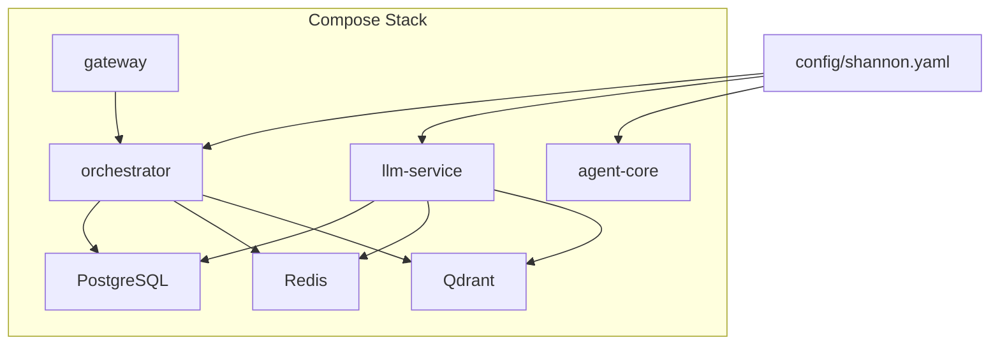
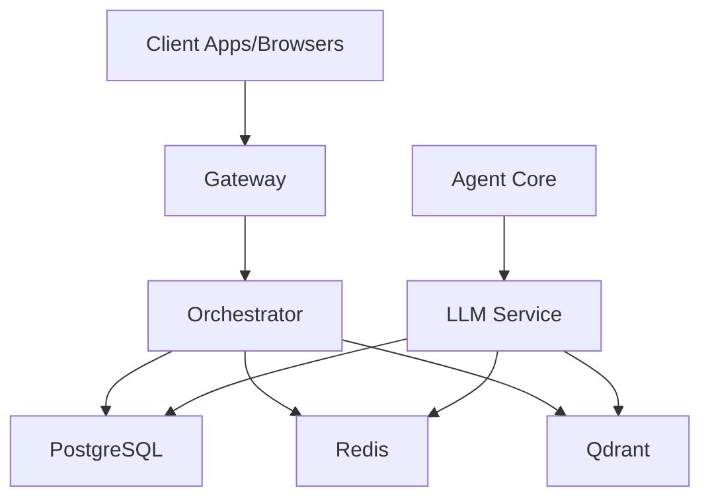
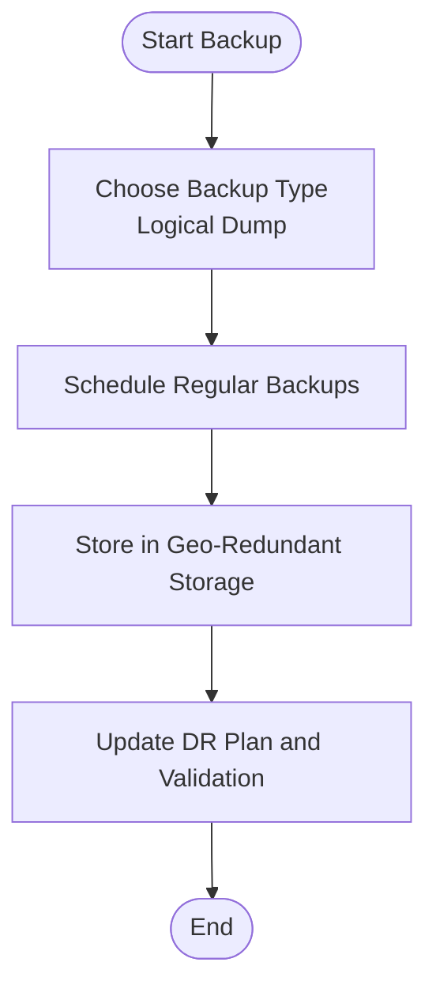
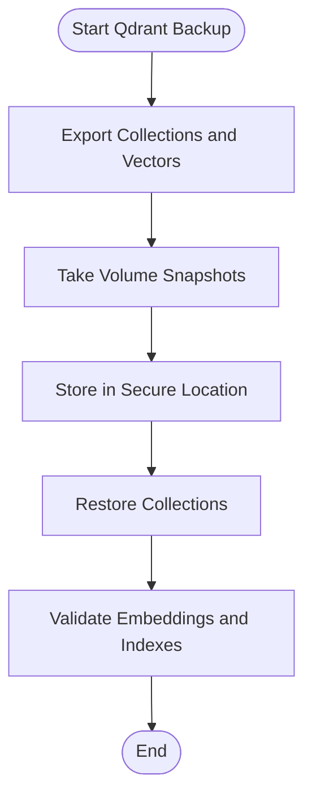
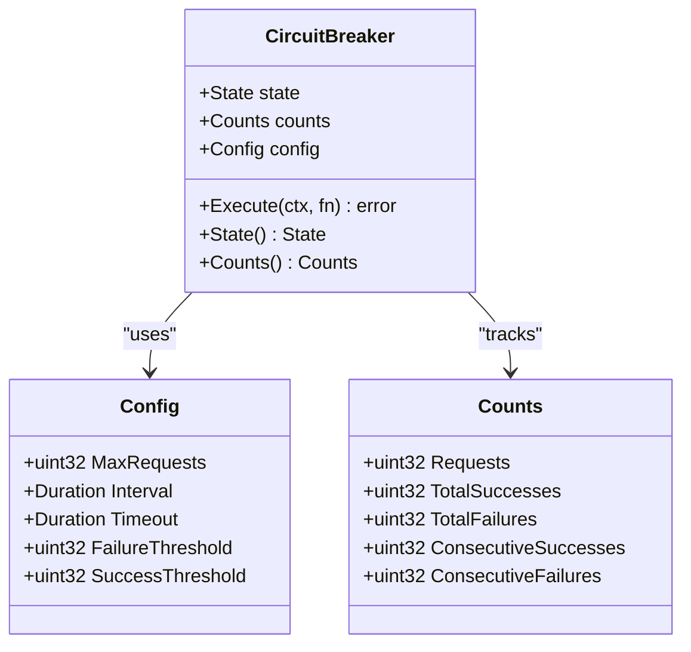
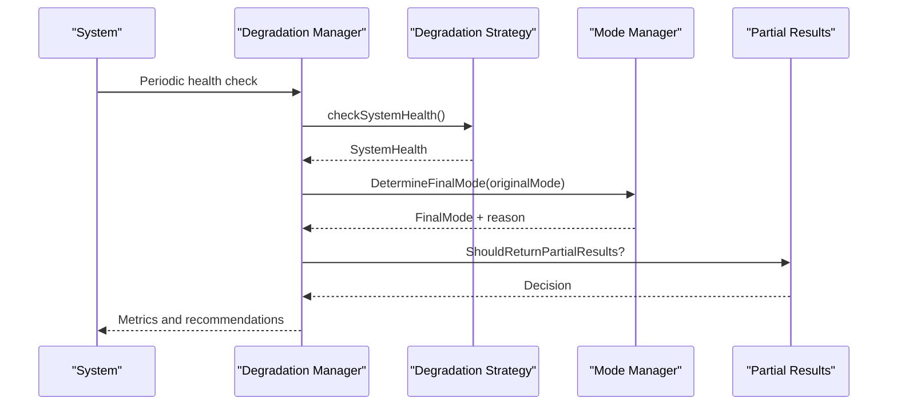
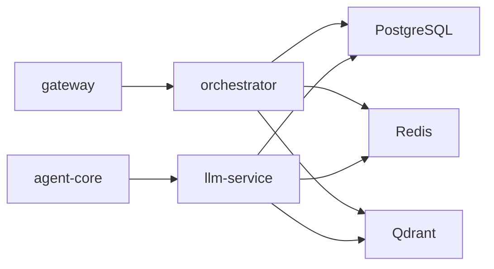

# Disaster Recovery and High Availability

<cite>
**Referenced Files in This Document**
- [config/shannon.yaml](file://config/shannon.yaml)
- [deploy/compose/docker-compose.yml](file://deploy/compose/docker-compose.yml)
- [deploy/compose/docker-compose.release.yml](file://deploy/compose/docker-compose.release.yml)
- [go/orchestrator/internal/circuitbreaker/circuit_breaker.go](file://go/orchestrator/internal/circuitbreaker/circuit_breaker.go)
- [go/orchestrator/internal/circuitbreaker/config.go](file://go/orchestrator/internal/circuitbreaker/config.go)
- [go/orchestrator/internal/degradation/manager.go](file://go/orchestrator/internal/degradation/manager.go)
- [go/orchestrator/internal/degradation/mode_manager.go](file://go/orchestrator/internal/degradation/mode_manager.go)
- [go/orchestrator/internal/db/client.go](file://go/orchestrator/internal/db/client.go)
- [migrations/postgres/001_initial_schema.sql](file://migrations/postgres/001_initial_schema.sql)
- [scripts/bootstrap_qdrant.sh](file://scripts/bootstrap_qdrant.sh)
- [scripts/init_qdrant.sh](file://scripts/init_qdrant.sh)
- [scripts/seed_postgres.sh](file://scripts/seed_postgres.sh)
</cite>

## Table of Contents
1. [Introduction](#introduction)
2. [Project Structure](#project-structure)
3. [Core Components](#core-components)
4. [Architecture Overview](#architecture-overview)
5. [Detailed Component Analysis](#detailed-component-analysis)
6. [Dependency Analysis](#dependency-analysis)
7. [Performance Considerations](#performance-considerations)
8. [Troubleshooting Guide](#troubleshooting-guide)
9. [Conclusion](#conclusion)
10. [Appendices](#appendices)

## Introduction
This document provides enterprise-grade disaster recovery and high availability guidance for Shannon deployments. It covers multi-region strategies (active-passive and active-active), backup and restore procedures for PostgreSQL, Redis, and Qdrant, fault tolerance via circuit breakers and graceful degradation, auto-scaling considerations, failover procedures, and validation of recovery plans. The content is grounded in the repository’s configuration, orchestration, and operational scripts.

## Project Structure
Shannon’s deployment assets and runtime components are organized as follows:
- Configuration: Centralized YAML configuration for service behavior, health checks, degradation, and vector/vector DB settings.
- Docker Compose: Local development and release stacks define services, volumes, and health checks for PostgreSQL, Redis, Qdrant, agent-core, orchestrator, LLM service, and gateway.
- Go runtime: Circuit breaker and degradation managers implement fault tolerance and graceful degradation.
- Database migrations: SQL scripts define persistent schemas and indexes.
- Scripts: Bootstrap and initialization helpers for Qdrant and optional Postgres seeding.

**Diagram sources**
- [config/shannon.yaml](file://config/shannon.yaml#L1-L378)
- [deploy/compose/docker-compose.yml](file://deploy/compose/docker-compose.yml#L1-L411)
- [deploy/compose/docker-compose.release.yml](file://deploy/compose/docker-compose.release.yml#L1-L345)

**Section sources**
- [config/shannon.yaml](file://config/shannon.yaml#L1-L378)
- [deploy/compose/docker-compose.yml](file://deploy/compose/docker-compose.yml#L1-L411)
- [deploy/compose/docker-compose.release.yml](file://deploy/compose/docker-compose.release.yml#L1-L345)

## Core Components
- Circuit Breaker: Implements tri-state open/half-open/closed logic with configurable thresholds and timeouts. Used around Redis, database, and gRPC calls.
- Degradation Manager: Monitors system health, computes degradation levels, and recommends execution mode downgrades and partial result strategies.
- Database Client: Wraps PostgreSQL with a circuit breaker, connection pooling, async write queue, and batched persistence.
- Vector/Embedding Layer: Qdrant-backed embedding storage with Redis caching enabled by configuration.
- Health Checks: Services expose health endpoints and compose-level healthchecks for readiness/liveness.

Key configuration touchpoints:
- Circuit breaker thresholds and intervals for Redis, database, and gRPC.
- Degradation thresholds and fallback behaviors.
- Vector DB host/port, collection names, and Redis cache settings.
- Service ports, health ports, and timeouts.

**Section sources**
- [go/orchestrator/internal/circuitbreaker/circuit_breaker.go](file://go/orchestrator/internal/circuitbreaker/circuit_breaker.go#L1-L250)
- [go/orchestrator/internal/circuitbreaker/config.go](file://go/orchestrator/internal/circuitbreaker/config.go#L1-L104)
- [go/orchestrator/internal/degradation/manager.go](file://go/orchestrator/internal/degradation/manager.go#L1-L243)
- [go/orchestrator/internal/degradation/mode_manager.go](file://go/orchestrator/internal/degradation/mode_manager.go#L1-L221)
- [go/orchestrator/internal/db/client.go](file://go/orchestrator/internal/db/client.go#L1-L498)
- [config/shannon.yaml](file://config/shannon.yaml#L30-L304)

## Architecture Overview
The system relies on:
- PostgreSQL for durable persistence (users, sessions, tasks, audit logs).
- Redis for ephemeral caching/session state and rate limiting.
- Qdrant for vector search and embeddings.
- Orchestrator and LLM service as primary compute layers with agent-core for WASI execution.
- Gateway as the ingress for client traffic.

**Diagram sources**
- [deploy/compose/docker-compose.yml](file://deploy/compose/docker-compose.yml#L14-L411)
- [config/shannon.yaml](file://config/shannon.yaml#L214-L304)

## Detailed Component Analysis

### Multi-Region Deployment Strategies
- Active-Passive: Run a standby region with warm standby services and a secondary database replica. Use external load balancers to redirect traffic on failover. Keep Redis and Qdrant synchronized via replication or snapshots.
- Active-Active: Deploy identical clusters across regions behind a global load balancer. Use database sharding or multi-master replication and cross-region synchronization for Redis/Qdrant. Ensure session affinity or stateless design for gateway and orchestrator.

Operational notes:
- The stack defines service ports and health ports suitable for regional LBs.
- Vector DB and Redis are stateful; ensure cross-region replication or snapshot-based recovery.

**Section sources**
- [config/shannon.yaml](file://config/shannon.yaml#L4-L11)
- [config/shannon.yaml](file://config/shannon.yaml#L214-L240)

### Backup and Restore Procedures

#### PostgreSQL Backups
- Use logical backups for point-in-time recovery and cross-region restoration.
- Schedule regular dumps and store them in secure, geo-redundant storage.
- Restore procedure:
  - Stop writes to the target cluster.
  - Restore the logical dump.
  - Re-seed any dependent data if needed.
  - Restart services and verify health.

Repository support:
- Initial schema and indexes are defined in SQL migrations.
- Seed script copies a seed file into the container and runs it against the database.

**Section sources**
- [migrations/postgres/001_initial_schema.sql](file://migrations/postgres/001_initial_schema.sql#L1-L141)
- [scripts/seed_postgres.sh](file://scripts/seed_postgres.sh#L1-L17)

#### Redis Persistence
- Enable AOF persistence to minimize data loss.
- Take periodic snapshots and replicate to a secondary region.
- Restore procedure:
  - Failover to secondary region.
  - Restore latest AOF/snapshot.
  - Reconfigure clients to point to the new primary.

Repository support:
- Redis is configured with AOF enabled in the compose stack.

**Section sources**
- [deploy/compose/docker-compose.yml](file://deploy/compose/docker-compose.yml#L60-L71)

#### Qdrant Collections
- Back up Qdrant storage volumes or export collection data externally.
- Restore by recreating collections and importing data.
- Initialize collections using provided scripts.

**Section sources**
- [scripts/bootstrap_qdrant.sh](file://scripts/bootstrap_qdrant.sh#L1-L23)
- [scripts/init_qdrant.sh](file://scripts/init_qdrant.sh#L1-L22)

### Circuit Breaker Patterns for Fault Tolerance
- Tri-state logic: Closed (allow traffic), Half-Open (limited probe traffic), Open (reject traffic).
- Configurable thresholds: failure and success thresholds, intervals, and timeouts.
- Environment overrides for Redis, database, gRPC, and HTTP circuit breakers.

**Diagram sources**
- [go/orchestrator/internal/circuitbreaker/circuit_breaker.go](file://go/orchestrator/internal/circuitbreaker/circuit_breaker.go#L1-L250)
- [go/orchestrator/internal/circuitbreaker/config.go](file://go/orchestrator/internal/circuitbreaker/config.go#L1-L104)

**Section sources**
- [go/orchestrator/internal/circuitbreaker/circuit_breaker.go](file://go/orchestrator/internal/circuitbreaker/circuit_breaker.go#L129-L250)
- [go/orchestrator/internal/circuitbreaker/config.go](file://go/orchestrator/internal/circuitbreaker/config.go#L18-L71)
- [config/shannon.yaml](file://config/shannon.yaml#L30-L51)

### Graceful Degradation During Outages
- Degradation Manager monitors health and emits metrics for Redis, database, agent-core, and LLM service.
- Mode Manager downgrades workflow execution modes based on degradation levels.
- Partial results and fallback behaviors are configurable.

**Diagram sources**
- [go/orchestrator/internal/degradation/manager.go](file://go/orchestrator/internal/degradation/manager.go#L86-L120)
- [go/orchestrator/internal/degradation/mode_manager.go](file://go/orchestrator/internal/degradation/mode_manager.go#L44-L120)

**Section sources**
- [go/orchestrator/internal/degradation/manager.go](file://go/orchestrator/internal/degradation/manager.go#L1-L243)
- [go/orchestrator/internal/degradation/mode_manager.go](file://go/orchestrator/internal/degradation/mode_manager.go#L1-L221)
- [config/shannon.yaml](file://config/shannon.yaml#L159-L213)

### Auto-Scaling and Resource Limits
- Kubernetes: Use HorizontalPodAutoscaler on orchestrator and LLM service. Define CPU/memory targets and min/max replicas. Set resource requests/limits per pod. Use readiness/liveness probes aligned with service health endpoints.
- Docker Swarm: Use rolling updates with parallelism and delay settings. Scale services horizontally; bind health checks to service ports and health endpoints.

Notes from configuration:
- Service ports and health ports are defined for orchestrator and gateway.
- Vector DB and Redis are stateful; scale stateless services first, then stateful ones carefully.

**Section sources**
- [config/shannon.yaml](file://config/shannon.yaml#L4-L11)
- [config/shannon.yaml](file://config/shannon.yaml#L214-L240)
- [deploy/compose/docker-compose.yml](file://deploy/compose/docker-compose.yml#L208-L226)

### Failover Procedures
- Database failover:
  - Promote standby and reconfigure orchestrator/LLM service endpoints.
  - Validate schema and indexes; re-seed if needed.
- Load balancer redirection:
  - Switch DNS or LB routing to the secondary region.
  - Ensure health endpoints are reachable.
- Service discovery updates:
  - Update DNS records or service mesh registries.
  - Verify gateway and orchestrator can reach downstream services.

Operational scripts:
- Qdrant bootstrap and initialization scripts support quick recovery of vector collections.

**Section sources**
- [scripts/bootstrap_qdrant.sh](file://scripts/bootstrap_qdrant.sh#L1-L23)
- [scripts/init_qdrant.sh](file://scripts/init_qdrant.sh#L1-L22)

### Practical Examples

#### Zero-Downtime Deployments
- Rolling updates with health checks:
  - Compose: Use restart policies and healthchecks to ensure safe rollouts.
  - Kubernetes: Use rolling updates with maxUnavailable and maxSurge; readiness gates on health endpoints.
- Canary releases:
  - Route a small percentage of traffic to the new version; monitor metrics and degrade if needed.

**Section sources**
- [deploy/compose/docker-compose.yml](file://deploy/compose/docker-compose.yml#L139-L226)
- [config/shannon.yaml](file://config/shannon.yaml#L214-L240)

#### Testing Disaster Recovery
- Simulate failures:
  - Stop Redis/PostgreSQL/Qdrant and observe circuit breaker and degradation behavior.
  - Validate partial results and mode downgrades.
- Recovery drills:
  - Practice restoring PostgreSQL from dump and re-seeding.
  - Validate Qdrant collection recreation and data import.

**Section sources**
- [go/orchestrator/internal/circuitbreaker/circuit_breaker.go](file://go/orchestrator/internal/circuitbreaker/circuit_breaker.go#L129-L250)
- [go/orchestrator/internal/degradation/manager.go](file://go/orchestrator/internal/degradation/manager.go#L86-L120)
- [scripts/seed_postgres.sh](file://scripts/seed_postgres.sh#L1-L17)

### Business Continuity Planning, RTO/RPO, and Validation
- RTO/RPO targets:
  - Define targets per component (e.g., sub-second RTO for gateway, hourly RPO for PostgreSQL).
- Recovery validation:
  - Run quarterly DR tests with documented checklists.
  - Measure actual recovery times and compare to targets.
- Monitoring:
  - Use health endpoints and metrics emitted by degradation manager.

**SectionSection sources**
- [config/shannon.yaml](file://config/shannon.yaml#L214-L240)
- [go/orchestrator/internal/degradation/manager.go](file://go/orchestrator/internal/degradation/manager.go#L102-L120)

## Dependency Analysis
The orchestrator depends on PostgreSQL, Redis, and Qdrant. The LLM service depends on the same. The agent-core depends on Redis and optionally on the LLM service. The gateway fronts orchestrator and depends on Redis and PostgreSQL.

**Diagram sources**
- [deploy/compose/docker-compose.yml](file://deploy/compose/docker-compose.yml#L369-L411)
- [config/shannon.yaml](file://config/shannon.yaml#L241-L249)

**Section sources**
- [deploy/compose/docker-compose.yml](file://deploy/compose/docker-compose.yml#L14-L411)
- [config/shannon.yaml](file://config/shannon.yaml#L241-L249)

## Performance Considerations
- Connection pooling and async writes:
  - Database client sets pool sizes and lifetime; async write queue batches and flushes periodically.
- Circuit breaker tuning:
  - Adjust failure/success thresholds and intervals to balance safety and throughput.
- Vector search:
  - Tune top-k, threshold, and MMR settings for recall/latency trade-offs.

**Section sources**
- [go/orchestrator/internal/db/client.go](file://go/orchestrator/internal/db/client.go#L80-L146)
- [go/orchestrator/internal/db/client.go](file://go/orchestrator/internal/db/client.go#L148-L196)
- [config/shannon.yaml](file://config/shannon.yaml#L283-L304)

## Troubleshooting Guide
- Health checks failing:
  - Verify service ports and health endpoints; inspect compose healthchecks.
- Circuit breaker open:
  - Inspect failure/success counters and adjust thresholds; confirm upstream dependency health.
- Degradation-induced mode downgrades:
  - Review degradation thresholds and fallback behaviors; validate partial results logic.
- Database write backlogs:
  - Inspect write queue buffer and worker count; consider increasing workers or reducing batch size.

**Section sources**
- [deploy/compose/docker-compose.yml](file://deploy/compose/docker-compose.yml#L53-L57)
- [go/orchestrator/internal/circuitbreaker/circuit_breaker.go](file://go/orchestrator/internal/circuitbreaker/circuit_breaker.go#L129-L145)
- [go/orchestrator/internal/degradation/manager.go](file://go/orchestrator/internal/degradation/manager.go#L86-L120)
- [go/orchestrator/internal/db/client.go](file://go/orchestrator/internal/db/client.go#L332-L391)

## Conclusion
Shannon’s configuration and runtime components provide a solid foundation for high availability and disaster recovery. By leveraging circuit breakers, graceful degradation, robust backups, and structured failover procedures, enterprises can achieve resilient deployments across regions. Operational scripts and health endpoints simplify recovery validation and ongoing maintenance.

## Appendices

### Appendix A: Key Configuration Reference
- Circuit breakers: Redis, database, gRPC.
- Degradation thresholds and fallback behaviors.
- Vector DB and Redis cache settings.
- Service ports and health ports.

**Section sources**
- [config/shannon.yaml](file://config/shannon.yaml#L30-L51)
- [config/shannon.yaml](file://config/shannon.yaml#L159-L213)
- [config/shannon.yaml](file://config/shannon.yaml#L283-L304)
- [config/shannon.yaml](file://config/shannon.yaml#L4-L11)