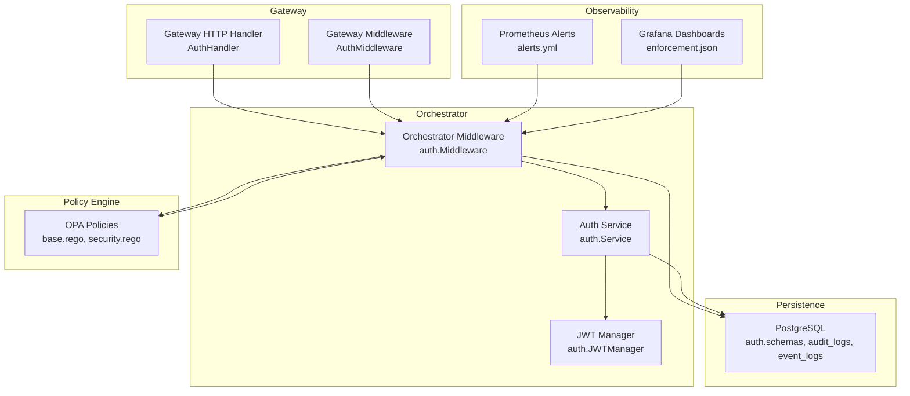
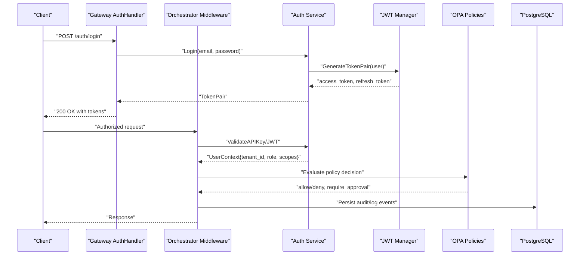
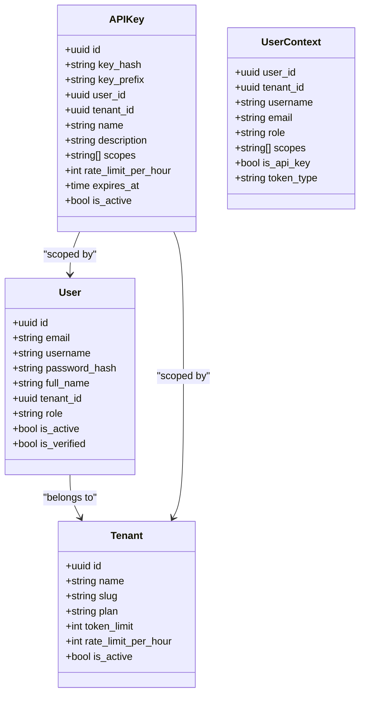
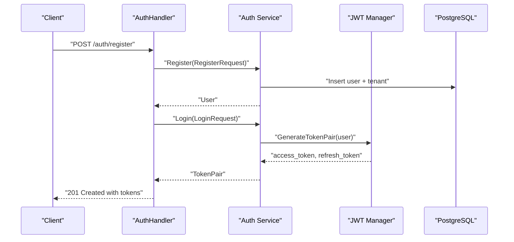
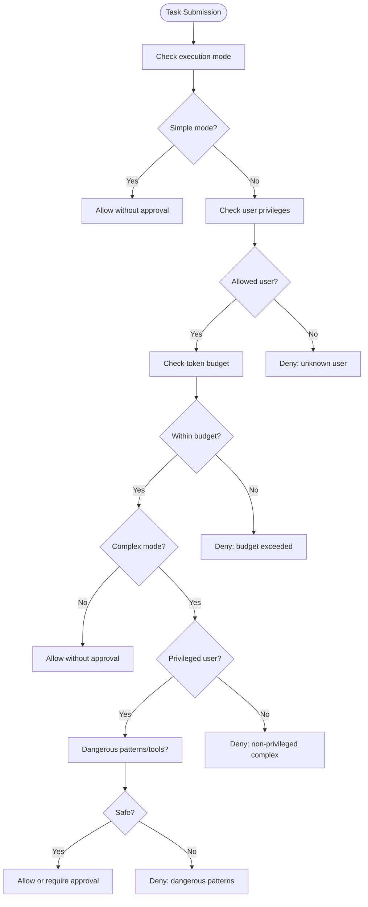
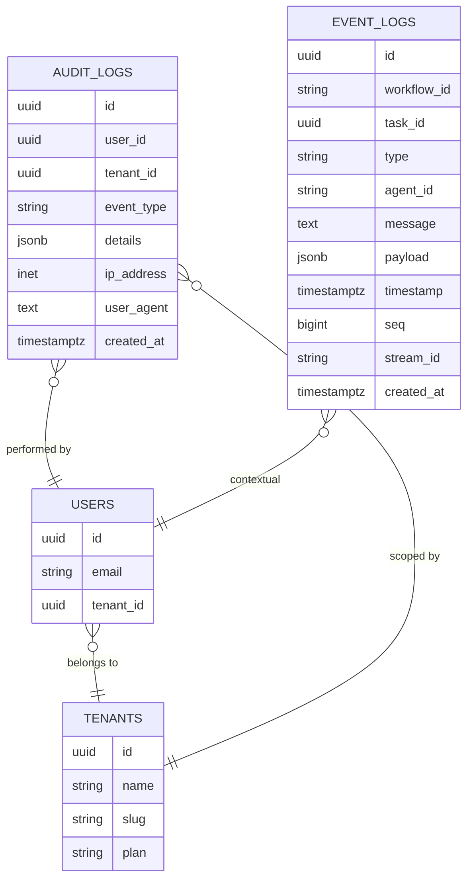
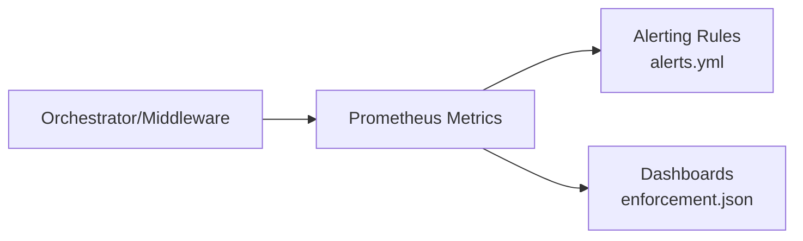
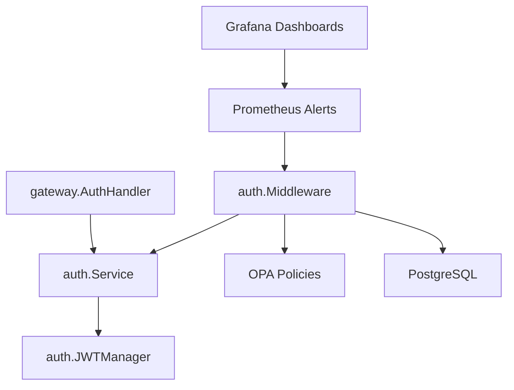

# Enterprise Features

<cite>
**Referenced Files in This Document**
- [jwt.go](file://go/orchestrator/internal/auth/jwt.go)
- [middleware.go](file://go/orchestrator/internal/auth/middleware.go)
- [service.go](file://go/orchestrator/internal/auth/service.go)
- [types.go](file://go/orchestrator/internal/auth/types.go)
- [auth.go](file://go/orchestrator/cmd/gateway/internal/handlers/auth.go)
- [auth.go](file://go/orchestrator/cmd/gateway/internal/middleware/auth.go)
- [event_log.go](file://go/orchestrator/internal/db/event_log.go)
- [models.go](file://go/orchestrator/internal/db/models.go)
- [003_authentication.sql](file://migrations/postgres/003_authentication.sql)
- [004_event_logs.sql](file://migrations/postgres/004_event_logs.sql)
- [base.rego](file://config/opa/policies/base.rego)
- [security.rego](file://config/opa/policies/security.rego)
- [alerts.yml](file://observability/prometheus/alerts.yml)
- [enforcement.json](file://observability/grafana/dashboards/enforcement.json)
- [docker-compose.yml](file://deploy/compose/docker-compose.yml)
- [shannon.yaml](file://config/shannon.yaml)
</cite>

## Table of Contents
1. [Introduction](#introduction)
2. [Project Structure](#project-structure)
3. [Core Components](#core-components)
4. [Architecture Overview](#architecture-overview)
5. [Detailed Component Analysis](#detailed-component-analysis)
6. [Dependency Analysis](#dependency-analysis)
7. [Performance Considerations](#performance-considerations)
8. [Troubleshooting Guide](#troubleshooting-guide)
9. [Conclusion](#conclusion)
10. [Appendices](#appendices)

## Introduction
This document details enterprise-grade features in Shannon, focusing on multi-tenant isolation, human-in-the-loop workflows, and comprehensive audit trail capabilities. It explains advanced authentication and authorization systems including JWT token management, role-based access control, and tenant isolation mechanisms. It also covers audit logging implementation with event tracking, compliance reporting, and data governance features. Enterprise security configurations such as network policies, encryption at rest and in transit, and secure credential management are documented alongside advanced monitoring and alerting, disaster recovery, high availability, deployment patterns, scaling strategies, and integration with enterprise infrastructure (LDAP/AD, SIEM, compliance frameworks).

## Project Structure
Shannon’s enterprise features span authentication and authorization, policy enforcement, audit logging, observability, and deployment orchestration. The authentication subsystem resides in Go under the orchestrator module, with HTTP/gRPC handlers and middleware. Policy enforcement is implemented via Open Policy Engine (OPA) Rego policies. Audit logging integrates persistent event logs and audit records. Observability includes Prometheus alerts and Grafana dashboards. Deployment leverages Docker Compose for orchestrated services.

**Diagram sources**
- [auth.go](file://go/orchestrator/cmd/gateway/internal/handlers/auth.go#L166-L274)
- [auth.go](file://go/orchestrator/cmd/gateway/internal/middleware/auth.go#L49-L156)
- [middleware.go](file://go/orchestrator/internal/auth/middleware.go#L39-L114)
- [service.go](file://go/orchestrator/internal/auth/service.go#L25-L36)
- [jwt.go](file://go/orchestrator/internal/auth/jwt.go#L26-L33)
- [base.rego](file://config/opa/policies/base.rego#L1-L272)
- [security.rego](file://config/opa/policies/security.rego#L1-L52)
- [docker-compose.yml](file://deploy/compose/docker-compose.yml#L369-L407)

**Section sources**
- [docker-compose.yml](file://deploy/compose/docker-compose.yml#L1-L411)
- [shannon.yaml](file://config/shannon.yaml#L12-L22)

## Core Components
- Multi-tenant authentication and authorization with JWT and API keys, tenant isolation, and RBAC scopes.
- Human-in-the-loop workflow approval gating via OPA policies and runtime complexity thresholds.
- Comprehensive audit logging with persistent event logs and audit records for compliance.
- Enterprise-grade observability with Prometheus alerts and Grafana dashboards.
- Secure deployment with containerized services, environment-driven configuration, and production-ready defaults.

**Section sources**
- [types.go](file://go/orchestrator/internal/auth/types.go#L150-L190)
- [service.go](file://go/orchestrator/internal/auth/service.go#L118-L169)
- [jwt.go](file://go/orchestrator/internal/auth/jwt.go#L46-L65)
- [auth.go](file://go/orchestrator/cmd/gateway/internal/handlers/auth.go#L166-L274)
- [event_log.go](file://go/orchestrator/internal/db/event_log.go#L24-L46)
- [004_event_logs.sql](file://migrations/postgres/004_event_logs.sql#L5-L26)
- [alerts.yml](file://observability/prometheus/alerts.yml#L1-L143)
- [enforcement.json](file://observability/grafana/dashboards/enforcement.json#L1-L55)

## Architecture Overview
Shannon enforces enterprise-grade security and governance through layered controls:
- Authentication and authorization at the gateway and orchestrator using JWT and API keys with tenant isolation.
- Policy enforcement via OPA to gate complex operations and require human approvals.
- Persistent audit trails for compliance and incident response.
- Observability and alerting for proactive operations and security monitoring.

**Diagram sources**
- [auth.go](file://go/orchestrator/cmd/gateway/internal/handlers/auth.go#L276-L356)
- [middleware.go](file://go/orchestrator/internal/auth/middleware.go#L116-L193)
- [service.go](file://go/orchestrator/internal/auth/service.go#L118-L169)
- [jwt.go](file://go/orchestrator/internal/auth/jwt.go#L46-L92)
- [base.rego](file://config/opa/policies/base.rego#L66-L77)
- [security.rego](file://config/opa/policies/security.rego#L6-L15)

## Detailed Component Analysis

### Multi-Tenant Isolation and RBAC
Shannon implements multi-tenant isolation by embedding tenant identifiers in user contexts and persisting tenant-scoped resources. Roles and scopes define fine-grained access control.

- Tenant creation and assignment during registration.
- JWT claims include tenant_id, role, and scopes for runtime authorization.
- API keys carry tenant-scoped scopes and optional rate limits.

**Diagram sources**
- [types.go](file://go/orchestrator/internal/auth/types.go#L36-L117)
- [service.go](file://go/orchestrator/internal/auth/service.go#L38-L116)
- [jwt.go](file://go/orchestrator/internal/auth/jwt.go#L36-L43)

**Section sources**
- [types.go](file://go/orchestrator/internal/auth/types.go#L36-L117)
- [service.go](file://go/orchestrator/internal/auth/service.go#L38-L116)
- [jwt.go](file://go/orchestrator/internal/auth/jwt.go#L36-L43)
- [003_authentication.sql](file://migrations/postgres/003_authentication.sql#L11-L104)

### Advanced Authentication and Authorization
- JWT token lifecycle: generation, validation, refresh, and issuer verification.
- API key support with hashed storage, constant-time comparison, and rate-limiting metadata.
- Middleware supports both JWT and API key validation, with normalization for external formats.

**Diagram sources**
- [auth.go](file://go/orchestrator/cmd/gateway/internal/handlers/auth.go#L166-L274)
- [service.go](file://go/orchestrator/internal/auth/service.go#L118-L169)
- [jwt.go](file://go/orchestrator/internal/auth/jwt.go#L46-L92)

**Section sources**
- [auth.go](file://go/orchestrator/cmd/gateway/internal/handlers/auth.go#L166-L274)
- [middleware.go](file://go/orchestrator/internal/auth/middleware.go#L116-L193)
- [service.go](file://go/orchestrator/internal/auth/service.go#L243-L322)
- [jwt.go](file://go/orchestrator/internal/auth/jwt.go#L46-L148)

### Human-in-the-Loop Workflows and Policy Enforcement
Shannon integrates OPA policies to gate operations based on mode, user privilege, token budgets, and complexity. Complex tasks or high-risk tools can require human approval.

**Diagram sources**
- [base.rego](file://config/opa/policies/base.rego#L42-L77)
- [security.rego](file://config/opa/policies/security.rego#L6-L15)

**Section sources**
- [base.rego](file://config/opa/policies/base.rego#L1-L272)
- [security.rego](file://config/opa/policies/security.rego#L1-L52)
- [shannon.yaml](file://config/shannon.yaml#L344-L351)

### Audit Logging and Compliance
Shannon persists comprehensive audit trails and event logs for compliance and forensics:
- Authentication and authorization events (login, token refresh, API key usage).
- Task execution and workflow events captured in event_logs.
- Centralized audit_logs with user_id, tenant_id, IP, user agent, and details.

**Diagram sources**
- [003_authentication.sql](file://migrations/postgres/003_authentication.sql#L76-L86)
- [004_event_logs.sql](file://migrations/postgres/004_event_logs.sql#L5-L26)
- [models.go](file://go/orchestrator/internal/db/models.go#L201-L219)
- [event_log.go](file://go/orchestrator/internal/db/event_log.go#L10-L22)

**Section sources**
- [service.go](file://go/orchestrator/internal/auth/service.go#L444-L465)
- [event_log.go](file://go/orchestrator/internal/db/event_log.go#L24-L46)
- [models.go](file://go/orchestrator/internal/db/models.go#L201-L219)
- [004_event_logs.sql](file://migrations/postgres/004_event_logs.sql#L5-L26)

### Enterprise Security Configurations
- Network policies: Services communicate over isolated Docker networks; gateway exposes port 8080; orchestrator exposes gRPC and admin ports.
- Encryption: Environment variables drive TLS/SSL modes; PostgreSQL SSL mode is configurable; JWT secret must be rotated in production.
- Credential management: JWT secret and API key hashing; API keys stored as hashes with prefixes; rate-limiting metadata enforced.

**Section sources**
- [docker-compose.yml](file://deploy/compose/docker-compose.yml#L3-L411)
- [shannon.yaml](file://config/shannon.yaml#L12-L22)
- [service.go](file://go/orchestrator/internal/auth/service.go#L467-L478)
- [jwt.go](file://go/orchestrator/internal/auth/jwt.go#L191-L200)

### Monitoring, Alerting, and Observability
- Prometheus alerts monitor policy engine error rates, latency, denial rates, service health, workflow errors, and token usage spikes.
- Grafana dashboards visualize enforcement drops and circuit breaker states.

**Diagram sources**
- [alerts.yml](file://observability/prometheus/alerts.yml#L1-L143)
- [enforcement.json](file://observability/grafana/dashboards/enforcement.json#L1-L55)

**Section sources**
- [alerts.yml](file://observability/prometheus/alerts.yml#L1-L143)
- [enforcement.json](file://observability/grafana/dashboards/enforcement.json#L1-L55)

### Disaster Recovery and High Availability
- Containerized services with restart policies and health checks.
- PostgreSQL persistence via named volumes; Redis persistence enabled.
- Temporal auto-setup for workflow orchestration; UI available for operational visibility.

**Section sources**
- [docker-compose.yml](file://deploy/compose/docker-compose.yml#L41-L411)

### Enterprise Deployment Patterns and Scaling
- Horizontal scaling: Separate workers per priority queue; adjustable concurrency for critical/high/normal/low queues.
- Human-in-the-loop: Approval timeouts and dangerous tools lists configurable.
- Templates and synthesis: Path configuration for workflow templates and synthesis templates.

**Section sources**
- [docker-compose.yml](file://deploy/compose/docker-compose.yml#L139-L226)
- [shannon.yaml](file://config/shannon.yaml#L344-L351)
- [shannon.yaml](file://config/shannon.yaml#L204-L205)

## Dependency Analysis
Shannon’s enterprise features depend on:
- Authentication and authorization: auth.Service, JWT Manager, and middleware.
- Policy enforcement: OPA policies evaluated by orchestrator middleware.
- Persistence: PostgreSQL tables for tenants, users, API keys, audit logs, and event logs.
- Observability: Prometheus metrics and Grafana dashboards.

**Diagram sources**
- [service.go](file://go/orchestrator/internal/auth/service.go#L25-L36)
- [jwt.go](file://go/orchestrator/internal/auth/jwt.go#L26-L33)
- [auth.go](file://go/orchestrator/cmd/gateway/internal/handlers/auth.go#L166-L274)
- [middleware.go](file://go/orchestrator/internal/auth/middleware.go#L39-L114)
- [base.rego](file://config/opa/policies/base.rego#L1-L272)
- [alerts.yml](file://observability/prometheus/alerts.yml#L1-L143)
- [enforcement.json](file://observability/grafana/dashboards/enforcement.json#L1-L55)

**Section sources**
- [service.go](file://go/orchestrator/internal/auth/service.go#L25-L36)
- [jwt.go](file://go/orchestrator/internal/auth/jwt.go#L26-L33)
- [auth.go](file://go/orchestrator/cmd/gateway/internal/handlers/auth.go#L166-L274)
- [middleware.go](file://go/orchestrator/internal/auth/middleware.go#L39-L114)
- [base.rego](file://config/opa/policies/base.rego#L1-L272)
- [alerts.yml](file://observability/prometheus/alerts.yml#L1-L143)
- [enforcement.json](file://observability/grafana/dashboards/enforcement.json#L1-L55)

## Performance Considerations
- Token budget enforcement and rate limiting prevent abuse and control costs.
- Circuit breakers protect downstream dependencies under stress.
- Vector search and embeddings caching reduce latency and cost.
- Streaming event batching minimizes database overhead.

[No sources needed since this section provides general guidance]

## Troubleshooting Guide
- Authentication failures: Validate JWT secret alignment between gateway and orchestrator, check token expiry, and confirm API key hashing and prefixes.
- Policy denials: Review OPA policy decisions and complexity thresholds; ensure user privileges and budgets meet requirements.
- Audit gaps: Confirm event_logs and audit_logs persistence; verify indexes and unique constraints for deduplication.
- Observability issues: Check Prometheus targets, alert rules, and Grafana datasource configuration.

**Section sources**
- [jwt.go](file://go/orchestrator/internal/auth/jwt.go#L94-L143)
- [service.go](file://go/orchestrator/internal/auth/service.go#L243-L322)
- [base.rego](file://config/opa/policies/base.rego#L231-L254)
- [security.rego](file://config/opa/policies/security.rego#L6-L15)
- [event_log.go](file://go/orchestrator/internal/db/event_log.go#L24-L46)
- [004_event_logs.sql](file://migrations/postgres/004_event_logs.sql#L47-L50)
- [alerts.yml](file://observability/prometheus/alerts.yml#L1-L143)

## Conclusion
Shannon’s enterprise feature set combines robust multi-tenant isolation, strict RBAC, comprehensive audit logging, and policy-driven human-in-the-loop controls. The platform’s observability stack, resilient deployment model, and extensible configuration enable secure, scalable operations aligned with enterprise security and compliance needs.

[No sources needed since this section summarizes without analyzing specific files]

## Appendices
- Configuration highlights: JWT secret rotation, API key rate limits, policy mode, and approval thresholds are configurable via environment variables and YAML.
- Compliance: Persisted audit logs and event logs support compliance reporting and forensic investigations.

**Section sources**
- [shannon.yaml](file://config/shannon.yaml#L12-L22)
- [shannon.yaml](file://config/shannon.yaml#L251-L262)
- [shannon.yaml](file://config/shannon.yaml#L344-L351)
- [docker-compose.yml](file://deploy/compose/docker-compose.yml#L376-L390)