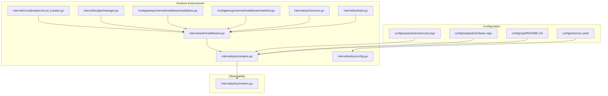
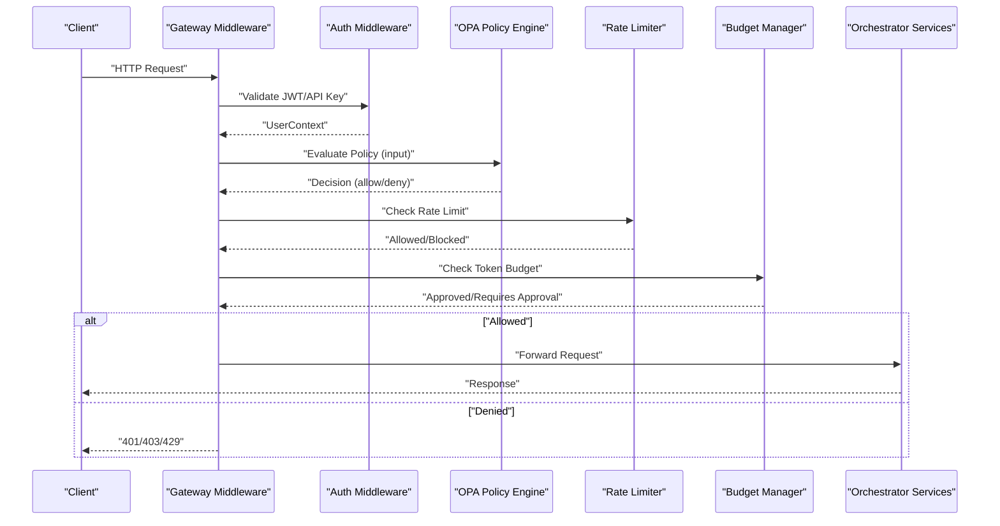
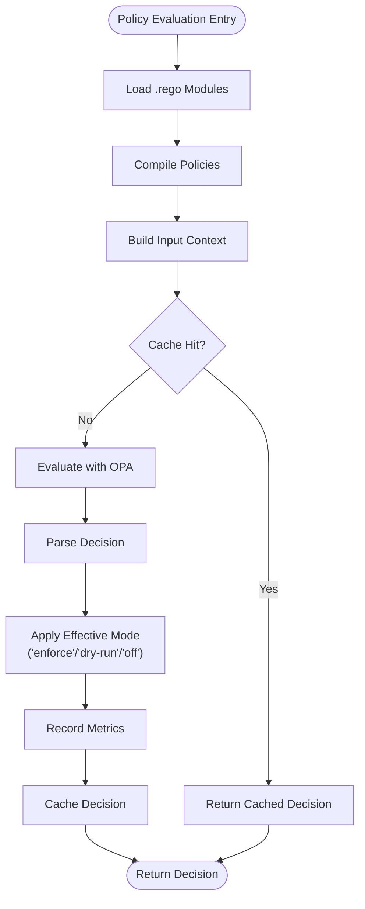
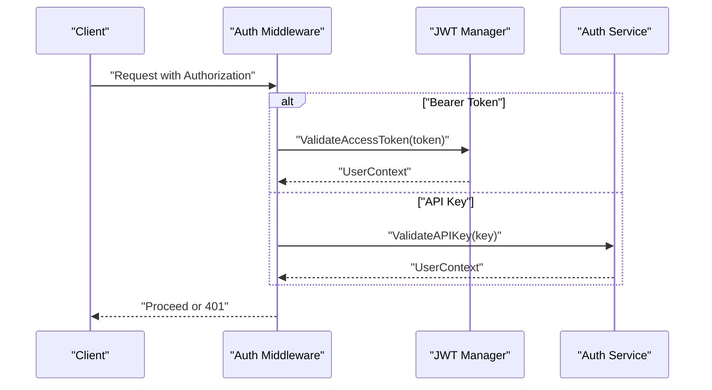
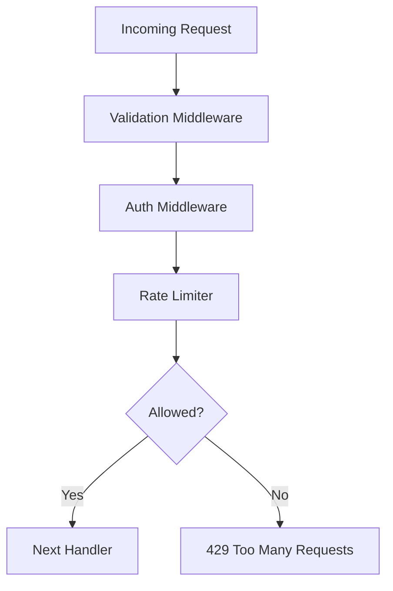
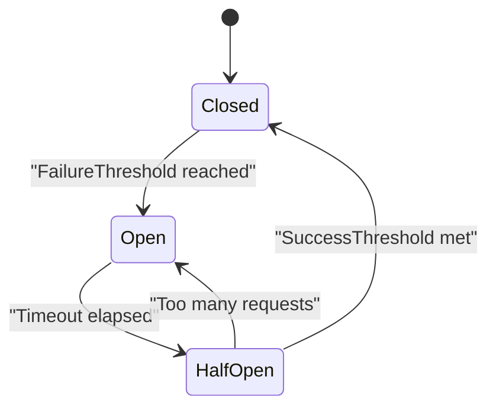
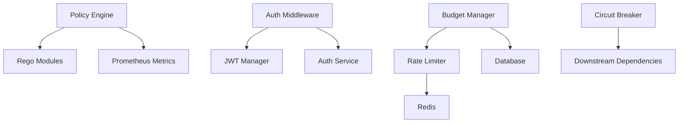

# Enterprise Security

<cite>
**Referenced Files in This Document**
- [config/opa/README.md](file://config/opa/README.md)
- [config/opa/policies/base.rego](file://config/opa/policies/base.rego)
- [config/opa/policies/security.rego](file://config/opa/policies/security.rego)
- [config/shannon.yaml](file://config/shannon.yaml)
- [go/orchestrator/internal/policy/engine.go](file://go/orchestrator/internal/policy/engine.go)
- [go/orchestrator/internal/policy/config.go](file://go/orchestrator/internal/policy/config.go)
- [go/orchestrator/internal/policy/metrics.go](file://go/orchestrator/internal/policy/metrics.go)
- [go/orchestrator/cmd/gateway/internal/middleware/ratelimit.go](file://go/orchestrator/cmd/gateway/internal/middleware/ratelimit.go)
- [go/orchestrator/cmd/gateway/internal/middleware/validation.go](file://go/orchestrator/cmd/gateway/internal/middleware/validation.go)
- [go/orchestrator/internal/auth/middleware.go](file://go/orchestrator/internal/auth/middleware.go)
- [go/orchestrator/internal/auth/jwt.go](file://go/orchestrator/internal/auth/jwt.go)
- [go/orchestrator/internal/auth/service.go](file://go/orchestrator/internal/auth/service.go)
- [go/orchestrator/internal/budget/manager.go](file://go/orchestrator/internal/budget/manager.go)
- [go/orchestrator/internal/circuitbreaker/circuit_breaker.go](file://go/orchestrator/internal/circuitbreaker/circuit_breaker.go)
</cite>

## Table of Contents
1. [Introduction](#introduction)
2. [Project Structure](#project-structure)
3. [Core Components](#core-components)
4. [Architecture Overview](#architecture-overview)
5. [Detailed Component Analysis](#detailed-component-analysis)
6. [Dependency Analysis](#dependency-analysis)
7. [Performance Considerations](#performance-considerations)
8. [Troubleshooting Guide](#troubleshooting-guide)
9. [Conclusion](#conclusion)
10. [Appendices](#appendices)

## Introduction
This document provides enterprise-grade security documentation for Shannon, focusing on advanced security configurations and protections. It covers Open Policy Agent (OPA) security policies with fine-grained access control, dynamic policy evaluation, and hot-reloading capabilities; network security including authentication, authorization, and secure credential management; encryption at rest and in transit; advanced threat protection such as DDoS mitigation, rate limiting, and anomaly detection; and practical guidance for compliance with enterprise security standards and frameworks.

## Project Structure
Security-related components span configuration, policy definition, runtime enforcement, and observability:
- Policy configuration and OPA policy definitions reside under config/opa.
- Runtime enforcement is implemented in Go modules under go/orchestrator/internal/policy, go/orchestrator/internal/auth, and go/orchestrator/cmd/gateway.
- Threat protection includes rate limiting, circuit breakers, and budget controls.
- Observability integrates Prometheus metrics for policy decisions and performance.

**Diagram sources**
- [config/shannon.yaml](file://config/shannon.yaml#L251-L262)
- [config/opa/README.md](file://config/opa/README.md#L1-L422)
- [config/opa/policies/base.rego](file://config/opa/policies/base.rego#L1-L272)
- [config/opa/policies/security.rego](file://config/opa/policies/security.rego#L1-L52)
- [go/orchestrator/internal/policy/engine.go](file://go/orchestrator/internal/policy/engine.go#L1-L748)
- [go/orchestrator/internal/policy/config.go](file://go/orchestrator/internal/policy/config.go#L1-L296)
- [go/orchestrator/internal/auth/middleware.go](file://go/orchestrator/internal/auth/middleware.go#L1-L227)
- [go/orchestrator/internal/auth/jwt.go](file://go/orchestrator/internal/auth/jwt.go#L1-L211)
- [go/orchestrator/internal/auth/service.go](file://go/orchestrator/internal/auth/service.go#L1-L485)
- [go/orchestrator/cmd/gateway/internal/middleware/ratelimit.go](file://go/orchestrator/cmd/gateway/internal/middleware/ratelimit.go#L1-L123)
- [go/orchestrator/cmd/gateway/internal/middleware/validation.go](file://go/orchestrator/cmd/gateway/internal/middleware/validation.go#L1-L205)
- [go/orchestrator/internal/budget/manager.go](file://go/orchestrator/internal/budget/manager.go#L1-L800)
- [go/orchestrator/internal/circuitbreaker/circuit_breaker.go](file://go/orchestrator/internal/circuitbreaker/circuit_breaker.go#L1-L250)
- [go/orchestrator/internal/policy/metrics.go](file://go/orchestrator/internal/policy/metrics.go#L1-L232)

**Section sources**
- [config/opa/README.md](file://config/opa/README.md#L1-L422)
- [config/opa/policies/base.rego](file://config/opa/policies/base.rego#L1-L272)
- [config/opa/policies/security.rego](file://config/opa/policies/security.rego#L1-L52)
- [config/shannon.yaml](file://config/shannon.yaml#L251-L262)
- [go/orchestrator/internal/policy/engine.go](file://go/orchestrator/internal/policy/engine.go#L1-L748)
- [go/orchestrator/internal/policy/config.go](file://go/orchestrator/internal/policy/config.go#L1-L296)
- [go/orchestrator/internal/policy/metrics.go](file://go/orchestrator/internal/policy/metrics.go#L1-L232)
- [go/orchestrator/cmd/gateway/internal/middleware/ratelimit.go](file://go/orchestrator/cmd/gateway/internal/middleware/ratelimit.go#L1-L123)
- [go/orchestrator/cmd/gateway/internal/middleware/validation.go](file://go/orchestrator/cmd/gateway/internal/middleware/validation.go#L1-L205)
- [go/orchestrator/internal/auth/middleware.go](file://go/orchestrator/internal/auth/middleware.go#L1-L227)
- [go/orchestrator/internal/auth/jwt.go](file://go/orchestrator/internal/auth/jwt.go#L1-L211)
- [go/orchestrator/internal/auth/service.go](file://go/orchestrator/internal/auth/service.go#L1-L485)
- [go/orchestrator/internal/budget/manager.go](file://go/orchestrator/internal/budget/manager.go#L1-L800)
- [go/orchestrator/internal/circuitbreaker/circuit_breaker.go](file://go/orchestrator/internal/circuitbreaker/circuit_breaker.go#L1-L250)

## Core Components
- Open Policy Agent (OPA) policy engine: Loads, compiles, and evaluates Rego policies; supports dry-run, enforce, and off modes; includes canary rollout and emergency kill switch; records comprehensive metrics.
- Authentication and authorization: JWT-based access tokens, API key support, scope-based authorization, and tenant isolation.
- Rate limiting and budget controls: Per-user rate limiting and token budget enforcement with backpressure and circuit breaker integration.
- Threat protection: Circuit breakers, anomaly detection via suspicious session patterns, and input validation.
- Observability: Prometheus metrics for policy decisions, latency, cache performance, and SLO tracking.

**Section sources**
- [go/orchestrator/internal/policy/engine.go](file://go/orchestrator/internal/policy/engine.go#L1-L748)
- [go/orchestrator/internal/policy/config.go](file://go/orchestrator/internal/policy/config.go#L1-L296)
- [go/orchestrator/internal/policy/metrics.go](file://go/orchestrator/internal/policy/metrics.go#L1-L232)
- [go/orchestrator/internal/auth/middleware.go](file://go/orchestrator/internal/auth/middleware.go#L1-L227)
- [go/orchestrator/internal/auth/jwt.go](file://go/orchestrator/internal/auth/jwt.go#L1-L211)
- [go/orchestrator/internal/auth/service.go](file://go/orchestrator/internal/auth/service.go#L1-L485)
- [go/orchestrator/cmd/gateway/internal/middleware/ratelimit.go](file://go/orchestrator/cmd/gateway/internal/middleware/ratelimit.go#L1-L123)
- [go/orchestrator/internal/budget/manager.go](file://go/orchestrator/internal/budget/manager.go#L1-L800)
- [go/orchestrator/internal/circuitbreaker/circuit_breaker.go](file://go/orchestrator/internal/circuitbreaker/circuit_breaker.go#L1-L250)

## Architecture Overview
The security architecture integrates policy evaluation, authentication, rate limiting, and observability into a cohesive pipeline. Requests pass through authentication and validation middleware, then policy evaluation, followed by rate and budget checks, and finally reach the orchestrator services.

**Diagram sources**
- [go/orchestrator/internal/auth/middleware.go](file://go/orchestrator/internal/auth/middleware.go#L1-L227)
- [go/orchestrator/internal/policy/engine.go](file://go/orchestrator/internal/policy/engine.go#L1-L748)
- [go/orchestrator/cmd/gateway/internal/middleware/ratelimit.go](file://go/orchestrator/cmd/gateway/internal/middleware/ratelimit.go#L1-L123)
- [go/orchestrator/internal/budget/manager.go](file://go/orchestrator/internal/budget/manager.go#L1-L800)

## Detailed Component Analysis

### Open Policy Agent (OPA) Security Policies
- Policy structure: Base allowlist-first rules with deny precedence; environment-specific behavior; token budget enforcement; agent allowlists; blocked users.
- Dynamic evaluation: Inputs include user identity, mode, environment, IP address, complexity score, token budget, and vector-enhanced fields; outputs include allow/deny, reason, and future-phase obligations.
- Canary rollout and emergency controls: Percentage-based enforce/dry-run routing, explicit user/agent overrides, and kill switch forcing dry-run.
- Hot reloading: File system changes detected by the configuration manager; policies reloaded without restart; version tracking and load timestamps recorded.
- Metrics: Comprehensive telemetry for evaluations, latency, cache performance, deny reasons, mode comparisons, and SLO tracking.

**Diagram sources**
- [go/orchestrator/internal/policy/engine.go](file://go/orchestrator/internal/policy/engine.go#L117-L195)
- [go/orchestrator/internal/policy/engine.go](file://go/orchestrator/internal/policy/engine.go#L197-L282)
- [go/orchestrator/internal/policy/engine.go](file://go/orchestrator/internal/policy/engine.go#L458-L594)
- [go/orchestrator/internal/policy/metrics.go](file://go/orchestrator/internal/policy/metrics.go#L145-L232)

**Section sources**
- [config/opa/policies/base.rego](file://config/opa/policies/base.rego#L1-L272)
- [config/opa/policies/security.rego](file://config/opa/policies/security.rego#L1-L52)
- [go/orchestrator/internal/policy/engine.go](file://go/orchestrator/internal/policy/engine.go#L1-L748)
- [go/orchestrator/internal/policy/config.go](file://go/orchestrator/internal/policy/config.go#L1-L296)
- [go/orchestrator/internal/policy/metrics.go](file://go/orchestrator/internal/policy/metrics.go#L1-L232)
- [config/opa/README.md](file://config/opa/README.md#L348-L355)

### Authentication and Authorization
- JWT access tokens with configurable expiry and issuer; refresh tokens stored securely hashed; scope-based authorization enforced per role.
- API key support with constant-time comparison, rate-limit metadata, and audit logging.
- Authentication middleware supports both JWT and API key validation, with special handling for SSE/WebSocket endpoints.

**Diagram sources**
- [go/orchestrator/internal/auth/middleware.go](file://go/orchestrator/internal/auth/middleware.go#L39-L114)
- [go/orchestrator/internal/auth/middleware.go](file://go/orchestrator/internal/auth/middleware.go#L116-L193)
- [go/orchestrator/internal/auth/jwt.go](file://go/orchestrator/internal/auth/jwt.go#L94-L143)
- [go/orchestrator/internal/auth/service.go](file://go/orchestrator/internal/auth/service.go#L243-L322)

**Section sources**
- [go/orchestrator/internal/auth/middleware.go](file://go/orchestrator/internal/auth/middleware.go#L1-L227)
- [go/orchestrator/internal/auth/jwt.go](file://go/orchestrator/internal/auth/jwt.go#L1-L211)
- [go/orchestrator/internal/auth/service.go](file://go/orchestrator/internal/auth/service.go#L1-L485)
- [config/shannon.yaml](file://config/shannon.yaml#L12-L21)

### Network Security and Secure Communication
- Authentication and authorization: Required for all protected endpoints; API keys supported for programmatic access.
- Input validation: Minimal, fast validation for common parameters to prevent trivial injection and malformed requests.
- Rate limiting: Per-user rate limiting with Redis-backed counters; burst control and window-based enforcement; headers expose limits and reset times.

**Diagram sources**
- [go/orchestrator/cmd/gateway/internal/middleware/validation.go](file://go/orchestrator/cmd/gateway/internal/middleware/validation.go#L22-L86)
- [go/orchestrator/internal/auth/middleware.go](file://go/orchestrator/internal/auth/middleware.go#L39-L114)
- [go/orchestrator/cmd/gateway/internal/middleware/ratelimit.go](file://go/orchestrator/cmd/gateway/internal/middleware/ratelimit.go#L34-L74)

**Section sources**
- [go/orchestrator/cmd/gateway/internal/middleware/validation.go](file://go/orchestrator/cmd/gateway/internal/middleware/validation.go#L1-L205)
- [go/orchestrator/cmd/gateway/internal/middleware/ratelimit.go](file://go/orchestrator/cmd/gateway/internal/middleware/ratelimit.go#L1-L123)
- [go/orchestrator/internal/auth/middleware.go](file://go/orchestrator/internal/auth/middleware.go#L1-L227)

### Encryption at Rest and in Transit
- In transit: Authentication via JWT and API keys; ensure HTTPS/TLS termination at gateway/load balancer; restrict Authorization header usage and normalize API key formats.
- At rest: Secrets managed via environment variables and configuration files; refresh tokens and API keys stored as hashes; database credentials and secrets should be managed externally (e.g., Vault) and injected at runtime.

**Section sources**
- [go/orchestrator/internal/auth/jwt.go](file://go/orchestrator/internal/auth/jwt.go#L1-L211)
- [go/orchestrator/internal/auth/service.go](file://go/orchestrator/internal/auth/service.go#L1-L485)
- [config/shannon.yaml](file://config/shannon.yaml#L12-L21)

### Secure Credential Management
- JWT signing key: Configurable via environment variable; rotate by updating the secret and rotating tokens.
- API key lifecycle: Generation with secure randomness, constant-time comparison, prefix-based lookup, rate-limit metadata, and audit logging; expiration and revocation supported.
- Secret rotation: Rotate JWT secret and invalidate sessions; rotate API keys and communicate new keys to clients; monitor via audit logs.

**Section sources**
- [go/orchestrator/internal/auth/jwt.go](file://go/orchestrator/internal/auth/jwt.go#L1-L211)
- [go/orchestrator/internal/auth/service.go](file://go/orchestrator/internal/auth/service.go#L324-L390)
- [go/orchestrator/internal/auth/middleware.go](file://go/orchestrator/internal/auth/middleware.go#L1-L227)

### Advanced Threat Protection
- DDoS mitigation: Per-user rate limiting with Redis; burst control; headers expose limits; can be tuned via configuration.
- Anomaly detection: Suspicious session patterns in OPA policies; circuit breakers for upstream dependencies; budget backpressure to slow traffic under pressure.
- Resilience: Circuit breaker states (closed/half-open/open) with thresholds and timeouts; degraded operation modes and partial results.

**Diagram sources**
- [go/orchestrator/internal/circuitbreaker/circuit_breaker.go](file://go/orchestrator/internal/circuitbreaker/circuit_breaker.go#L12-L32)
- [go/orchestrator/internal/circuitbreaker/circuit_breaker.go](file://go/orchestrator/internal/circuitbreaker/circuit_breaker.go#L96-L145)
- [go/orchestrator/internal/circuitbreaker/circuit_breaker.go](file://go/orchestrator/internal/circuitbreaker/circuit_breaker.go#L180-L207)

**Section sources**
- [go/orchestrator/cmd/gateway/internal/middleware/ratelimit.go](file://go/orchestrator/cmd/gateway/internal/middleware/ratelimit.go#L1-L123)
- [go/orchestrator/internal/budget/manager.go](file://go/orchestrator/internal/budget/manager.go#L641-L762)
- [go/orchestrator/internal/circuitbreaker/circuit_breaker.go](file://go/orchestrator/internal/circuitbreaker/circuit_breaker.go#L1-L250)
- [config/opa/policies/security.rego](file://config/opa/policies/security.rego#L32-L41)

### Practical Configuration Examples
- Enable and configure policy engine in configuration:
  - Set policy.enabled, mode, path, fail_closed, environment, audit, canary, and emergency controls.
- Customize OPA policies:
  - Update allowed_users, privileged_users, dangerous_patterns, max_budgets, and blocked_users in base.rego.
  - Add environment-specific rules in security.rego.
- Integrate with enterprise security infrastructure:
  - Use API keys for service-to-service authentication; enforce scope-based authorization; integrate external rate limiter into OPA deny rules.
- Conduct security assessments:
  - Review policy metrics, deny reasons, and SLOs; validate canary routing; test emergency kill switch; verify hot reload behavior.

**Section sources**
- [config/shannon.yaml](file://config/shannon.yaml#L251-L262)
- [config/opa/README.md](file://config/opa/README.md#L161-L232)
- [config/opa/policies/base.rego](file://config/opa/policies/base.rego#L78-L103)
- [config/opa/policies/base.rego](file://config/opa/policies/base.rego#L155-L189)
- [config/opa/policies/base.rego](file://config/opa/policies/base.rego#L201-L206)
- [config/opa/policies/security.rego](file://config/opa/policies/security.rego#L6-L15)

## Dependency Analysis
- Policy engine depends on OPA Rego modules and configuration; caches decisions and records metrics.
- Authentication middleware depends on JWT manager and service; validates tokens and API keys.
- Rate limiter depends on Redis; budget manager coordinates with database and rate limiters.
- Circuit breaker monitors failures and controls downstream traffic.

**Diagram sources**
- [go/orchestrator/internal/policy/engine.go](file://go/orchestrator/internal/policy/engine.go#L1-L748)
- [go/orchestrator/internal/policy/metrics.go](file://go/orchestrator/internal/policy/metrics.go#L1-L232)
- [go/orchestrator/internal/auth/middleware.go](file://go/orchestrator/internal/auth/middleware.go#L1-L227)
- [go/orchestrator/internal/auth/jwt.go](file://go/orchestrator/internal/auth/jwt.go#L1-L211)
- [go/orchestrator/internal/auth/service.go](file://go/orchestrator/internal/auth/service.go#L1-L485)
- [go/orchestrator/cmd/gateway/internal/middleware/ratelimit.go](file://go/orchestrator/cmd/gateway/internal/middleware/ratelimit.go#L1-L123)
- [go/orchestrator/internal/budget/manager.go](file://go/orchestrator/internal/budget/manager.go#L1-L800)
- [go/orchestrator/internal/circuitbreaker/circuit_breaker.go](file://go/orchestrator/internal/circuitbreaker/circuit_breaker.go#L1-L250)

**Section sources**
- [go/orchestrator/internal/policy/engine.go](file://go/orchestrator/internal/policy/engine.go#L1-L748)
- [go/orchestrator/internal/auth/middleware.go](file://go/orchestrator/internal/auth/middleware.go#L1-L227)
- [go/orchestrator/cmd/gateway/internal/middleware/ratelimit.go](file://go/orchestrator/cmd/gateway/internal/middleware/ratelimit.go#L1-L123)
- [go/orchestrator/internal/budget/manager.go](file://go/orchestrator/internal/budget/manager.go#L1-L800)
- [go/orchestrator/internal/circuitbreaker/circuit_breaker.go](file://go/orchestrator/internal/circuitbreaker/circuit_breaker.go#L1-L250)

## Performance Considerations
- Policy evaluation latency targets sub-millisecond performance; cache hits improve throughput; tune canary percentages and emergency kill switch to balance safety and speed.
- Rate limiting and budget controls introduce minimal overhead; ensure Redis availability and proper sizing.
- Circuit breakers protect downstream systems under failure; adjust thresholds to match workload characteristics.

[No sources needed since this section provides general guidance]

## Troubleshooting Guide
- Policy not loading: Verify Rego syntax, file permissions, and orchestrator logs; confirm policy path and environment configuration.
- Unexpected denials: Review deny rules precedence, user allowlists, environment-specific rules, and token budget limits.
- Policy not enforcing: Confirm policy.enabled, mode, and path; ensure fail_closed behavior aligns with environment.
- Authentication failures: Validate JWT secret, token format, and API key hashes; check scope requirements.
- Rate limiting issues: Inspect Redis connectivity, window calculations, and burst settings; review rate limit headers.
- Budget exceeded: Adjust token budgets, enable approvals, or increase limits; monitor backpressure delays.

**Section sources**
- [config/opa/README.md](file://config/opa/README.md#L356-L372)
- [go/orchestrator/internal/auth/middleware.go](file://go/orchestrator/internal/auth/middleware.go#L39-L114)
- [go/orchestrator/cmd/gateway/internal/middleware/ratelimit.go](file://go/orchestrator/cmd/gateway/internal/middleware/ratelimit.go#L76-L104)
- [go/orchestrator/internal/budget/manager.go](file://go/orchestrator/internal/budget/manager.go#L175-L288)

## Conclusion
Shannon’s enterprise security posture combines robust policy-driven access control, strong authentication and authorization, resilient rate limiting and budget controls, and comprehensive observability. By leveraging OPA’s dynamic evaluation and hot-reload capabilities, enterprises can continuously evolve security policies while maintaining operational stability. Integrating with external systems, adhering to strict secret management practices, and monitoring SLOs ensures compliance and readiness for production environments.

[No sources needed since this section summarizes without analyzing specific files]

## Appendices
- Compliance checklist:
  - Enforce policy mode in production; maintain audit logs; track policy version and reloads.
  - Rotate JWT secrets; manage API key lifecycles; enforce scope-based access.
  - Monitor rate limits, budget usage, and circuit breaker states; tune thresholds per environment.
  - Validate inputs and sanitize headers; terminate TLS at the edge; restrict exposure of sensitive metrics.

[No sources needed since this section provides general guidance]