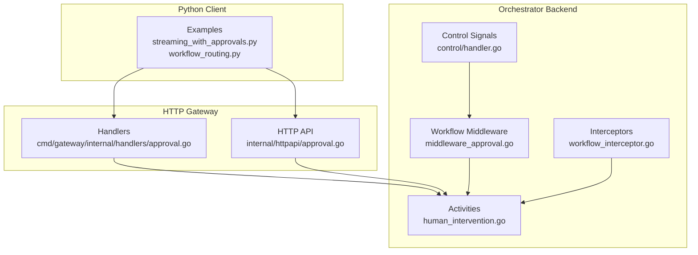
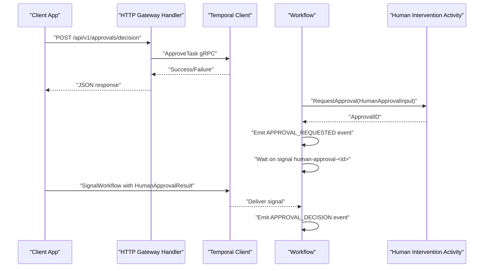
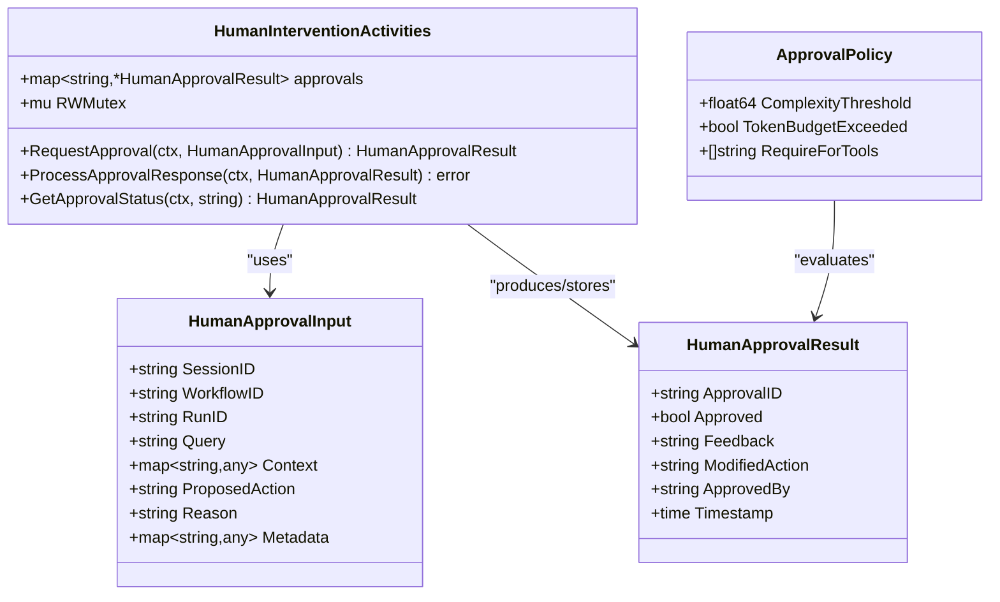
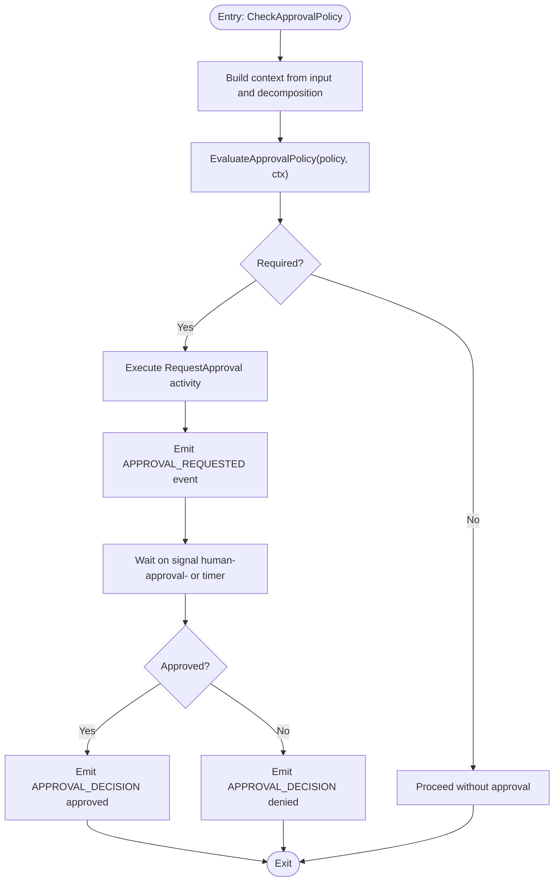
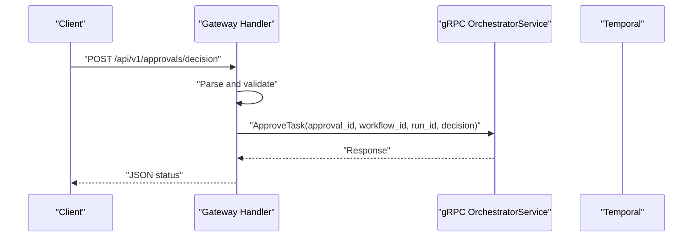
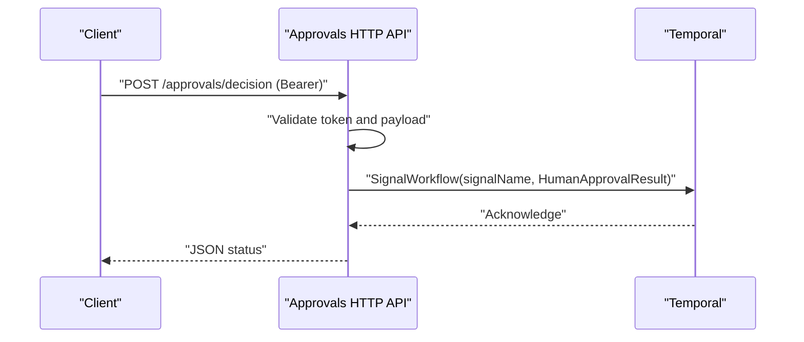
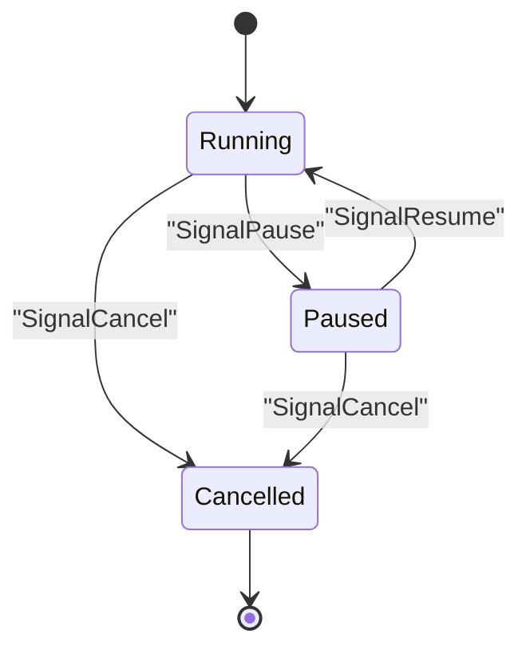
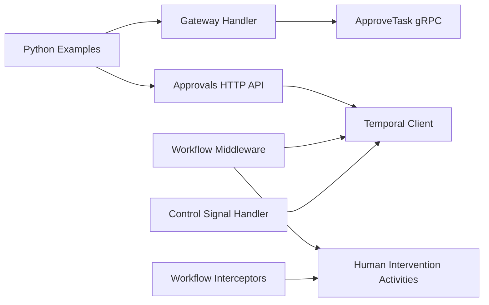

# Human-in-the-Loop Workflows

<cite>
**Referenced Files in This Document**
- [human_intervention.go](file://go/orchestrator/internal/activities/human_intervention.go)
- [middleware_approval.go](file://go/orchestrator/internal/workflows/middleware_approval.go)
- [approval.go](file://go/orchestrator/cmd/gateway/internal/handlers/approval.go)
- [approval.go](file://go/orchestrator/internal/httpapi/approval.go)
- [handler.go](file://go/orchestrator/internal/workflows/control/handler.go)
- [signals.go](file://go/orchestrator/internal/workflows/signals.go)
- [control_signals.go](file://go/orchestrator/internal/workflows/control_signals.go)
- [workflow_interceptor.go](file://go/orchestrator/internal/interceptors/workflow_interceptor.go)
- [streaming_with_approvals.py](file://clients/python/examples/streaming_with_approvals.py)
- [workflow_routing.py](file://clients/python/examples/workflow_routing.py)
</cite>

## Table of Contents
1. [Introduction](#introduction)
2. [Project Structure](#project-structure)
3. [Core Components](#core-components)
4. [Architecture Overview](#architecture-overview)
5. [Detailed Component Analysis](#detailed-component-analysis)
6. [Dependency Analysis](#dependency-analysis)
7. [Performance Considerations](#performance-considerations)
8. [Troubleshooting Guide](#troubleshooting-guide)
9. [Conclusion](#conclusion)
10. [Appendices](#appendices)

## Introduction
This document explains human-in-the-loop workflow capabilities in Shannon, focusing on approval workflows, authorization middleware, control signals, and integrations for external approval systems. It covers automated decision points, escalation procedures, manual intervention triggers, configurable approval thresholds, reviewer assignment strategies, routing, suspension/resumption/cancellation controls, and security and audit considerations.

## Project Structure
Shannon’s human-in-the-loop workflows span backend orchestration, Temporal workflows, HTTP handlers, and Python client examples. The key areas are:
- Activities for human intervention and approval policy evaluation
- Workflow middleware for requesting approvals and awaiting signals
- HTTP APIs for submitting approvals and forwarding signals to Temporal
- Control signal handlers for workflow suspension, resumption, and cancellation
- Interceptors for propagating workflow metadata to downstream services
- Python client examples demonstrating streaming and routing with approvals

**Diagram sources**
- [approval.go](file://go/orchestrator/cmd/gateway/internal/handlers/approval.go#L1-L137)
- [approval.go](file://go/orchestrator/internal/httpapi/approval.go#L1-L123)
- [human_intervention.go](file://go/orchestrator/internal/activities/human_intervention.go#L1-L174)
- [middleware_approval.go](file://go/orchestrator/internal/workflows/middleware_approval.go#L1-L121)
- [handler.go](file://go/orchestrator/internal/workflows/control/handler.go#L1-L279)
- [workflow_interceptor.go](file://go/orchestrator/internal/interceptors/workflow_interceptor.go#L1-L74)

**Section sources**
- [approval.go](file://go/orchestrator/cmd/gateway/internal/handlers/approval.go#L1-L137)
- [approval.go](file://go/orchestrator/internal/httpapi/approval.go#L1-L123)
- [human_intervention.go](file://go/orchestrator/internal/activities/human_intervention.go#L1-L174)
- [middleware_approval.go](file://go/orchestrator/internal/workflows/middleware_approval.go#L1-L121)
- [handler.go](file://go/orchestrator/internal/workflows/control/handler.go#L1-L279)
- [workflow_interceptor.go](file://go/orchestrator/internal/interceptors/workflow_interceptor.go#L1-L74)

## Core Components
- Human intervention activities define approval input/result structures, request creation, response processing, status retrieval, and an approval policy evaluator.
- Workflow middleware checks approval policies and coordinates request and wait logic with timeouts and signal channels.
- HTTP handlers accept approval decisions from users and forward them to Temporal as signals.
- Control signal handler supports pause/resume/cancel with propagation to child workflows and SSE emissions.
- Interceptors propagate workflow metadata to downstream HTTP/gRPC calls.

**Section sources**
- [human_intervention.go](file://go/orchestrator/internal/activities/human_intervention.go#L13-L174)
- [middleware_approval.go](file://go/orchestrator/internal/workflows/middleware_approval.go#L12-L121)
- [approval.go](file://go/orchestrator/internal/httpapi/approval.go#L16-L123)
- [handler.go](file://go/orchestrator/internal/workflows/control/handler.go#L14-L279)
- [workflow_interceptor.go](file://go/orchestrator/internal/interceptors/workflow_interceptor.go#L12-L74)

## Architecture Overview
The approval lifecycle integrates client submissions, HTTP handlers, Temporal workflows, and activities. The workflow requests an approval, emits events, waits on a signal channel, and proceeds based on the decision or timeout.

**Diagram sources**
- [approval.go](file://go/orchestrator/cmd/gateway/internal/handlers/approval.go#L43-L127)
- [approval.go](file://go/orchestrator/internal/httpapi/approval.go#L44-L101)
- [middleware_approval.go](file://go/orchestrator/internal/workflows/middleware_approval.go#L44-L120)
- [human_intervention.go](file://go/orchestrator/internal/activities/human_intervention.go#L50-L88)

## Detailed Component Analysis

### Human Intervention Activities
These activities encapsulate the approval request/response lifecycle and policy evaluation:
- Input and result structures define session/workflow/run identifiers, proposed actions, reasons, feedback, and metadata.
- RequestApproval generates an approval ID and logs the request.
- ProcessApprovalResponse stores human decisions safely with concurrency protection.
- GetApprovalStatus retrieves current status by approval ID.
- EvaluateApprovalPolicy enforces thresholds for complexity, token budget, and tool categories.

**Diagram sources**
- [human_intervention.go](file://go/orchestrator/internal/activities/human_intervention.go#L13-L174)

**Section sources**
- [human_intervention.go](file://go/orchestrator/internal/activities/human_intervention.go#L13-L174)

### Workflow Middleware for Approvals
The middleware evaluates whether human approval is required and coordinates the request and wait logic:
- CheckApprovalPolicy constructs a default policy and context from decomposition results.
- RequestAndWaitApproval executes an activity to request approval, emits an “APPROVAL_REQUESTED” event, waits on a signal channel, applies a configurable timeout, and emits an “APPROVAL_DECISION” event.

**Diagram sources**
- [middleware_approval.go](file://go/orchestrator/internal/workflows/middleware_approval.go#L12-L121)

**Section sources**
- [middleware_approval.go](file://go/orchestrator/internal/workflows/middleware_approval.go#L12-L121)

### HTTP Handlers for Approvals
Two HTTP pathways exist for submitting approvals:
- Gateway handler validates user context, parses decision payloads, and calls ApproveTask gRPC with propagated metadata.
- Dedicated approvals HTTP API validates bearer tokens, decodes JSON, and signals the Temporal workflow with the approval result.

**Diagram sources**
- [approval.go](file://go/orchestrator/cmd/gateway/internal/handlers/approval.go#L43-L127)
- [approval.go](file://go/orchestrator/internal/httpapi/approval.go#L44-L101)

**Section sources**
- [approval.go](file://go/orchestrator/cmd/gateway/internal/handlers/approval.go#L15-L137)
- [approval.go](file://go/orchestrator/internal/httpapi/approval.go#L16-L123)

### Control Signals for Workflow Suspension, Resumption, and Cancellation
The control signal handler enables pause/resume/cancel with:
- Query handler for control state
- Signal channels for pause/resume/cancel
- Propagation to child workflows
- SSE emissions for UI updates
- Checkpoint blocking with await semantics

**Diagram sources**
- [handler.go](file://go/orchestrator/internal/workflows/control/handler.go#L14-L279)

**Section sources**
- [handler.go](file://go/orchestrator/internal/workflows/control/handler.go#L14-L279)
- [signals.go](file://go/orchestrator/internal/workflows/signals.go#L7-L22)
- [control_signals.go](file://go/orchestrator/internal/workflows/control_signals.go#L1-L9)

### Authorization Middleware and Reviewer Assignment
- Authorization middleware validates user identity and permissions for approval decisions.
- Reviewer assignment and routing strategies are not implemented in the referenced code; however, the design allows pluggable assignment and routing by extending the approval request/response payloads and backend logic.

[No sources needed since this section synthesizes design guidance based on existing patterns]

### Escalation Procedures and Manual Intervention Triggers
- Escalation can be modeled by increasing thresholds or expanding tool categories requiring approval.
- Manual intervention triggers are integrated into the workflow via policy evaluation and signal-based continuation.

[No sources needed since this section provides conceptual guidance]

### Integration with External Approval Systems, Email Notifications, and Webhooks
- The activities layer documents production integration points for storing requests, sending notifications, and returning approval IDs.
- The approvals HTTP API demonstrates webhook-style callbacks by signaling Temporal workflows.

**Section sources**
- [human_intervention.go](file://go/orchestrator/internal/activities/human_intervention.go#L63-L67)
- [approval.go](file://go/orchestrator/internal/httpapi/approval.go#L82-L101)

### Practical Examples
- Streaming with approvals: Demonstrates real-time workflow execution with approval gating and signal handling.
- Workflow routing: Shows how workflows route tasks and integrate with approval middleware.

**Section sources**
- [streaming_with_approvals.py](file://clients/python/examples/streaming_with_approvals.py)
- [workflow_routing.py](file://clients/python/examples/workflow_routing.py)

## Dependency Analysis
The following diagram shows key dependencies among components involved in approvals and control signals.

**Diagram sources**
- [approval.go](file://go/orchestrator/cmd/gateway/internal/handlers/approval.go#L15-L137)
- [approval.go](file://go/orchestrator/internal/httpapi/approval.go#L16-L123)
- [middleware_approval.go](file://go/orchestrator/internal/workflows/middleware_approval.go#L12-L121)
- [handler.go](file://go/orchestrator/internal/workflows/control/handler.go#L14-L279)
- [workflow_interceptor.go](file://go/orchestrator/internal/interceptors/workflow_interceptor.go#L12-L74)

**Section sources**
- [approval.go](file://go/orchestrator/cmd/gateway/internal/handlers/approval.go#L15-L137)
- [approval.go](file://go/orchestrator/internal/httpapi/approval.go#L16-L123)
- [middleware_approval.go](file://go/orchestrator/internal/workflows/middleware_approval.go#L12-L121)
- [handler.go](file://go/orchestrator/internal/workflows/control/handler.go#L14-L279)
- [workflow_interceptor.go](file://go/orchestrator/internal/interceptors/workflow_interceptor.go#L12-L74)

## Performance Considerations
- Approval timeouts: Configurable per workflow input; default is set in the workflow middleware.
- Signal delivery: Dedicated approvals server with short timeouts for robustness.
- Concurrency: Human approval storage uses a mutex; consider persistence for production scale.
- Event emissions: Avoid duplicate SSE emissions by suppressing in child workflows.

[No sources needed since this section provides general guidance]

## Troubleshooting Guide
Common issues and resolutions:
- Unauthorized or invalid JSON in approvals endpoint: Validate bearer token and payload shape.
- Workflow not found or signal mismatch: Verify workflow ID, run ID, and signal name format.
- Approval timeout: Adjust workflow-level timeout or ensure timely human decision submission.
- Duplicate or missing SSE events: Confirm control signal handler suppression for child workflows.

**Section sources**
- [approval.go](file://go/orchestrator/internal/httpapi/approval.go#L44-L101)
- [handler.go](file://go/orchestrator/internal/workflows/control/handler.go#L92-L162)

## Conclusion
Shannon’s human-in-the-loop workflows combine policy-driven approval checks, signal-based coordination, and control signals for robust oversight. The design supports configurable thresholds, timeouts, and extensibility for reviewer assignment and escalation. Integrations for notifications and webhooks are present in the activities layer, enabling production-grade approval systems.

## Appendices

### Security Considerations
- Delegate approvals securely by validating user identity and permissions in the gateway handler.
- Propagate workflow metadata to downstream services using interceptors for traceability.
- Audit approvals with emitted events and persistent storage of results.

**Section sources**
- [approval.go](file://go/orchestrator/cmd/gateway/internal/handlers/approval.go#L47-L70)
- [workflow_interceptor.go](file://go/orchestrator/internal/interceptors/workflow_interceptor.go#L47-L73)

### Compliance Reporting
- Track approval requests and decisions via emitted events and stored results.
- Maintain audit trails by persisting HumanApprovalResult entries and correlating with workflow IDs.

**Section sources**
- [human_intervention.go](file://go/orchestrator/internal/activities/human_intervention.go#L75-L104)
- [middleware_approval.go](file://go/orchestrator/internal/workflows/middleware_approval.go#L70-L118)