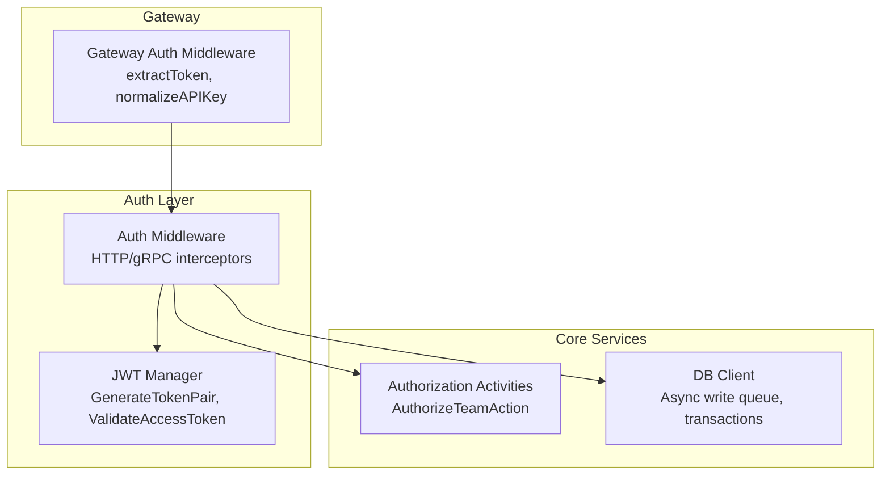
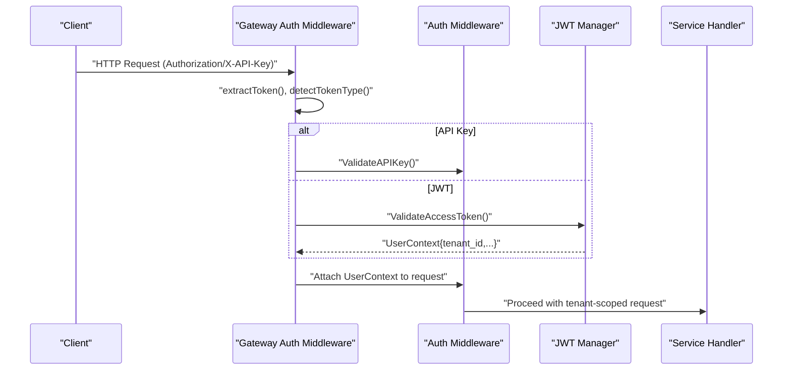
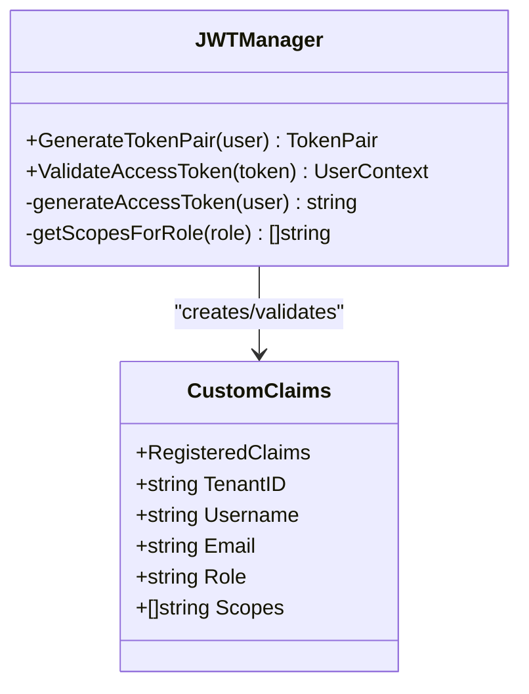
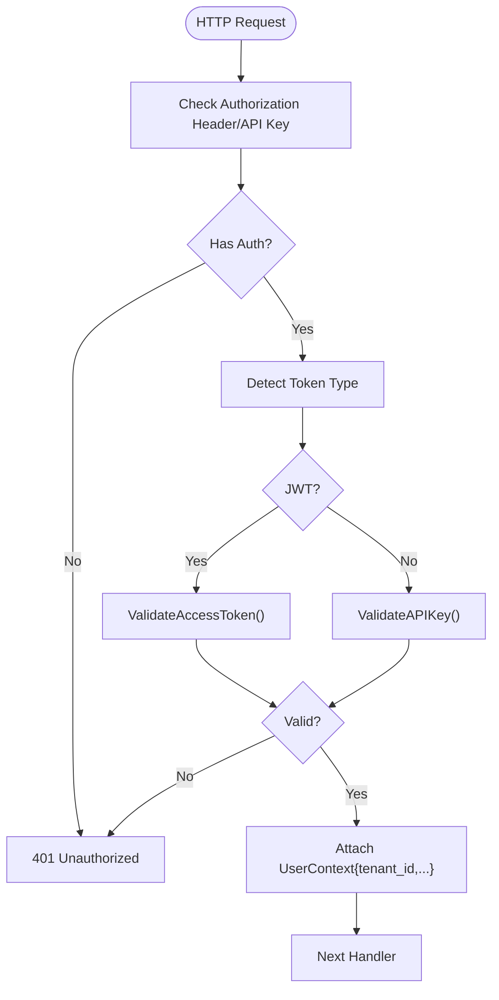
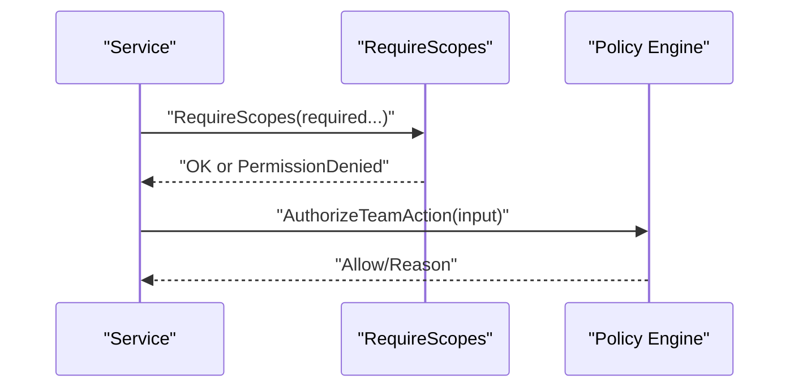
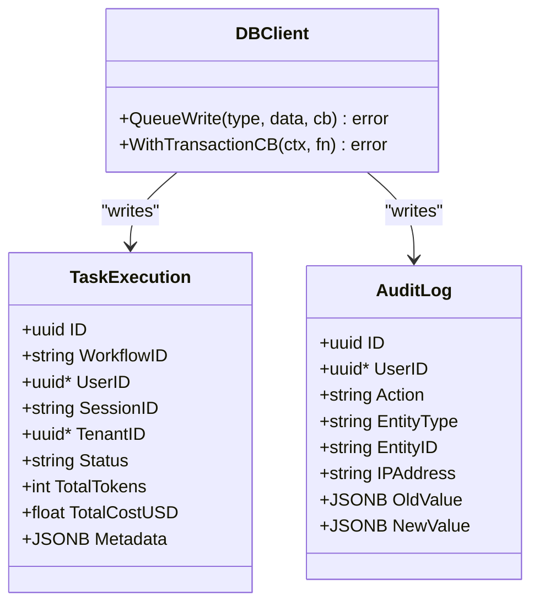
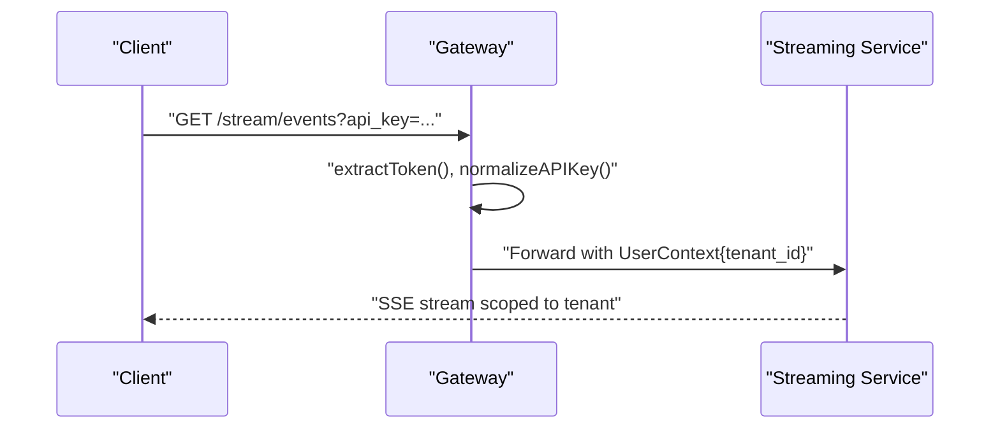
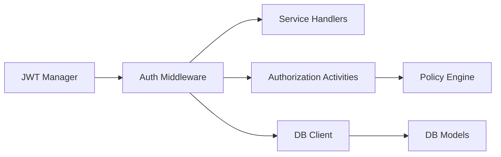

# Multi-Tenant Isolation

<cite>
**Referenced Files in This Document**
- [jwt.go](file://go/orchestrator/internal/auth/jwt.go)
- [middleware.go](file://go/orchestrator/internal/auth/middleware.go)
- [auth.go](file://go/orchestrator/cmd/gateway/internal/middleware/auth.go)
- [authorization.go](file://go/orchestrator/internal/activities/authorization.go)
- [client.go](file://go/orchestrator/internal/db/client.go)
- [models.go](file://go/orchestrator/internal/db/models.go)
- [auth.go](file://go/orchestrator/cmd/gateway/internal/handlers/auth.go)
- [auth.go](file://go/orchestrator/internal/httpapi/auth.go)
- [README.md](file://docs/authentication-and-multitenancy.md)
- [README.md](file://docs/troubleshooting.md)
</cite>

## Table of Contents
1. [Introduction](#introduction)
2. [Project Structure](#project-structure)
3. [Core Components](#core-components)
4. [Architecture Overview](#architecture-overview)
5. [Detailed Component Analysis](#detailed-component-analysis)
6. [Dependency Analysis](#dependency-analysis)
7. [Performance Considerations](#performance-considerations)
8. [Troubleshooting Guide](#troubleshooting-guide)
9. [Conclusion](#conclusion)
10. [Appendices](#appendices)

## Introduction
This document explains how Shannon implements multi-tenant isolation across authentication, authorization, database storage, caching, streaming, and billing/quota systems. It covers tenant identification via JWT claims, tenant-aware RBAC with dynamic policy evaluation, and tenant-scoped data segregation at the database, cache, and streaming layers. Practical setup and usage patterns are included, along with security considerations and troubleshooting steps for isolation issues.

## Project Structure
Shannon’s multi-tenant isolation spans several layers:
- Authentication and authorization middleware for HTTP/gRPC
- JWT token generation and validation with tenant-scoped claims
- Tenant-aware database models and write queues
- Streaming and SSE endpoints with API key or JWT-based access
- Optional policy engine for dynamic authorization decisions

**Diagram sources**
- [auth.go](file://go/orchestrator/cmd/gateway/internal/middleware/auth.go#L49-L156)
- [middleware.go](file://go/orchestrator/internal/auth/middleware.go#L39-L114)
- [jwt.go](file://go/orchestrator/internal/auth/jwt.go#L46-L92)
- [authorization.go](file://go/orchestrator/internal/activities/authorization.go#L25-L39)
- [client.go](file://go/orchestrator/internal/db/client.go#L332-L391)

**Section sources**
- [auth.go](file://go/orchestrator/cmd/gateway/internal/middleware/auth.go#L1-L247)
- [middleware.go](file://go/orchestrator/internal/auth/middleware.go#L1-L227)
- [jwt.go](file://go/orchestrator/internal/auth/jwt.go#L1-L211)
- [authorization.go](file://go/orchestrator/internal/activities/authorization.go#L1-L62)
- [client.go](file://go/orchestrator/internal/db/client.go#L1-L498)

## Core Components
- JWT token generation and validation with tenant-scoped claims
- Authentication middleware supporting API keys and JWTs
- Tenant-aware RBAC with scope-based checks
- Dynamic policy evaluation for advanced authorization
- Tenant-scoped database models and async write pipeline
- Streaming endpoints with tenant-aware access

**Section sources**
- [jwt.go](file://go/orchestrator/internal/auth/jwt.go#L35-L92)
- [middleware.go](file://go/orchestrator/internal/auth/middleware.go#L195-L217)
- [authorization.go](file://go/orchestrator/internal/activities/authorization.go#L25-L39)
- [client.go](file://go/orchestrator/internal/db/client.go#L61-L100)
- [models.go](file://go/orchestrator/internal/db/models.go#L61-L102)

## Architecture Overview
Shannon enforces multi-tenant isolation by:
- Embedding tenant identifiers in JWT claims and propagating them through middleware
- Using tenant-scoped contexts for all downstream operations
- Enforcing RBAC via scopes and optional policy engine evaluations
- Persisting tenant-aware records and segregating caches/streaming per tenant

**Diagram sources**
- [auth.go](file://go/orchestrator/cmd/gateway/internal/middleware/auth.go#L159-L210)
- [middleware.go](file://go/orchestrator/internal/auth/middleware.go#L39-L114)
- [jwt.go](file://go/orchestrator/internal/auth/jwt.go#L94-L143)

## Detailed Component Analysis

### JWT Token Claims and Tenant Identification
- JWT claims include tenant_id, username, email, role, and scopes.
- Access tokens are signed and validated centrally; issuer is verified.
- Scopes are role-derived and used for scope-based authorization checks.

**Diagram sources**
- [jwt.go](file://go/orchestrator/internal/auth/jwt.go#L17-L92)

**Section sources**
- [jwt.go](file://go/orchestrator/internal/auth/jwt.go#L35-L92)
- [jwt.go](file://go/orchestrator/internal/auth/jwt.go#L150-L177)

### Authentication Middleware and Tenant Propagation
- HTTP middleware supports API keys and JWTs; SSE/WebSocket endpoints accept tokens via query parameters.
- gRPC unary interceptor supports JWT or API key via metadata; development mode allows header-based overrides.
- On success, a tenant-aware UserContext is attached to the request context.

**Diagram sources**
- [auth.go](file://go/orchestrator/cmd/gateway/internal/middleware/auth.go#L159-L210)
- [middleware.go](file://go/orchestrator/internal/auth/middleware.go#L39-L114)

**Section sources**
- [auth.go](file://go/orchestrator/cmd/gateway/internal/middleware/auth.go#L48-L156)
- [middleware.go](file://go/orchestrator/internal/auth/middleware.go#L116-L193)

### Role-Based Access Control (RBAC) and Dynamic Authorization
- Scope-based RBAC: each role receives a predefined set of scopes; requests require all required scopes.
- Dynamic authorization: policy engine can evaluate contextual decisions for team actions.

**Diagram sources**
- [middleware.go](file://go/orchestrator/internal/auth/middleware.go#L195-L217)
- [authorization.go](file://go/orchestrator/internal/activities/authorization.go#L25-L39)

**Section sources**
- [middleware.go](file://go/orchestrator/internal/auth/middleware.go#L195-L217)
- [authorization.go](file://go/orchestrator/internal/activities/authorization.go#L25-L39)

### Tenant Data Segregation in Database
- Tenant-aware models include tenant_id fields for task execution, audit logs, and usage aggregates.
- Async write queue batches and persists tenant-scoped records; transactions wrap critical updates.
- Circuit-breaker protected database wrapper ensures resilience.

**Diagram sources**
- [models.go](file://go/orchestrator/internal/db/models.go#L61-L102)
- [models.go](file://go/orchestrator/internal/db/models.go#L201-L219)
- [client.go](file://go/orchestrator/internal/db/client.go#L332-L391)

**Section sources**
- [models.go](file://go/orchestrator/internal/db/models.go#L61-L102)
- [models.go](file://go/orchestrator/internal/db/models.go#L201-L219)
- [client.go](file://go/orchestrator/internal/db/client.go#L198-L236)
- [client.go](file://go/orchestrator/internal/db/client.go#L437-L463)

### Cache and Streaming Tenant Isolation
- Session snapshots are stored with tenant-scoped identifiers and TTL controls.
- Streaming endpoints accept API keys or JWTs; for browsers/SSE, tokens can be passed via query parameters.
- Tenant context is propagated to streaming services for per-tenant event routing.

**Diagram sources**
- [auth.go](file://go/orchestrator/cmd/gateway/internal/middleware/auth.go#L177-L187)
- [middleware.go](file://go/orchestrator/internal/auth/middleware.go#L73-L90)

**Section sources**
- [models.go](file://go/orchestrator/internal/db/models.go#L154-L170)
- [auth.go](file://go/orchestrator/cmd/gateway/internal/middleware/auth.go#L177-L187)
- [middleware.go](file://go/orchestrator/internal/auth/middleware.go#L73-L90)

### Tenant-Specific Configuration Management, Quotas, and Billing
- Configuration and feature flags can be tenant-scoped; implement per-tenant overrides in configuration loaders.
- Quota enforcement: track per-tenant token usage and enforce limits at request boundaries.
- Billing isolation: persist total cost and token usage per tenant for invoicing and reporting.

[No sources needed since this section provides general guidance]

### Practical Examples

- Tenant setup and token issuance
  - Use the token generation path to create access tokens embedding tenant_id and role-derived scopes.
  - Reference: [jwt.go](file://go/orchestrator/internal/auth/jwt.go#L46-L92)

- Multi-tenant API usage patterns
  - HTTP: send Authorization: Bearer <token> or X-API-Key: <api_key>.
  - gRPC: send metadata authorization: Bearer <token> or x-api-key: <api_key>.
  - Streaming: pass api_key or token via query parameters for SSE/WebSocket.
  - References:
    - [auth.go](file://go/orchestrator/cmd/gateway/internal/middleware/auth.go#L167-L187)
    - [middleware.go](file://go/orchestrator/internal/auth/middleware.go#L57-L113)

- RBAC and dynamic authorization
  - Enforce required scopes using the scope-check function.
  - Evaluate dynamic team actions via the policy engine.
  - References:
    - [middleware.go](file://go/orchestrator/internal/auth/middleware.go#L195-L217)
    - [authorization.go](file://go/orchestrator/internal/activities/authorization.go#L25-L39)

- Database writes with tenant scoping
  - Persist tenant-aware records via the DB client write queue and transactions.
  - References:
    - [client.go](file://go/orchestrator/internal/db/client.go#L332-L391)
    - [models.go](file://go/orchestrator/internal/db/models.go#L61-L102)

**Section sources**
- [jwt.go](file://go/orchestrator/internal/auth/jwt.go#L46-L92)
- [auth.go](file://go/orchestrator/cmd/gateway/internal/middleware/auth.go#L167-L187)
- [middleware.go](file://go/orchestrator/internal/auth/middleware.go#L57-L113)
- [middleware.go](file://go/orchestrator/internal/auth/middleware.go#L195-L217)
- [authorization.go](file://go/orchestrator/internal/activities/authorization.go#L25-L39)
- [client.go](file://go/orchestrator/internal/db/client.go#L332-L391)
- [models.go](file://go/orchestrator/internal/db/models.go#L61-L102)

## Dependency Analysis
- Authentication depends on JWT manager and API key validation.
- Middleware depends on auth service and JWT manager for tenant propagation.
- Authorization activities depend on the policy engine.
- Database client depends on circuit-breaker wrapper and models for tenant-scoped persistence.

**Diagram sources**
- [jwt.go](file://go/orchestrator/internal/auth/jwt.go#L46-L92)
- [middleware.go](file://go/orchestrator/internal/auth/middleware.go#L39-L114)
- [authorization.go](file://go/orchestrator/internal/activities/authorization.go#L25-L39)
- [client.go](file://go/orchestrator/internal/db/client.go#L332-L391)
- [models.go](file://go/orchestrator/internal/db/models.go#L61-L102)

**Section sources**
- [jwt.go](file://go/orchestrator/internal/auth/jwt.go#L46-L92)
- [middleware.go](file://go/orchestrator/internal/auth/middleware.go#L39-L114)
- [authorization.go](file://go/orchestrator/internal/activities/authorization.go#L25-L39)
- [client.go](file://go/orchestrator/internal/db/client.go#L332-L391)
- [models.go](file://go/orchestrator/internal/db/models.go#L61-L102)

## Performance Considerations
- Use the async write queue for high-throughput writes; it batches and flushes periodically to reduce DB load.
- Prefer tenant-scoped filters in queries to minimize scans.
- Circuit-breaker protected DB transactions improve resilience under failure conditions.

[No sources needed since this section provides general guidance]

## Troubleshooting Guide
Common isolation issues and resolutions:
- Invalid or missing authentication
  - Ensure Authorization header uses Bearer <token> or X-API-Key is present.
  - For SSE/WebSocket, pass api_key or token via query parameters.
  - References:
    - [auth.go](file://go/orchestrator/cmd/gateway/internal/middleware/auth.go#L102-L107)
    - [auth.go](file://go/orchestrator/cmd/gateway/internal/middleware/auth.go#L177-L187)

- Invalid or expired JWT
  - Verify signing key, issuer, and expiration; regenerate tokens if needed.
  - Reference: [jwt.go](file://go/orchestrator/internal/auth/jwt.go#L94-L143)

- Insufficient scopes
  - Confirm the token’s role grants the required scopes; adjust role or request accordingly.
  - Reference: [middleware.go](file://go/orchestrator/internal/auth/middleware.go#L195-L217)

- Cross-tenant data exposure
  - Verify tenant_id is present in UserContext and enforced in all queries and writes.
  - Confirm DB models include tenant_id and that writes attach tenant-scoped context.
  - References:
    - [models.go](file://go/orchestrator/internal/db/models.go#L61-L102)
    - [client.go](file://go/orchestrator/internal/db/client.go#L332-L391)

- Streaming access denied
  - Ensure API key or JWT is valid and passed via headers or query parameters.
  - Reference: [middleware.go](file://go/orchestrator/internal/auth/middleware.go#L73-L90)

**Section sources**
- [auth.go](file://go/orchestrator/cmd/gateway/internal/middleware/auth.go#L102-L107)
- [auth.go](file://go/orchestrator/cmd/gateway/internal/middleware/auth.go#L177-L187)
- [jwt.go](file://go/orchestrator/internal/auth/jwt.go#L94-L143)
- [middleware.go](file://go/orchestrator/internal/auth/middleware.go#L195-L217)
- [models.go](file://go/orchestrator/internal/db/models.go#L61-L102)
- [client.go](file://go/orchestrator/internal/db/client.go#L332-L391)
- [middleware.go](file://go/orchestrator/internal/auth/middleware.go#L73-L90)

## Conclusion
Shannon’s multi-tenant isolation relies on robust authentication with tenant-scoped JWT claims, middleware-driven tenant propagation, scope-based RBAC, and dynamic policy evaluation. Tenant-aware database models, async write batching, and streaming access controls ensure data segregation across layers. By following the provided patterns and troubleshooting steps, operators can maintain strong isolation and auditability for each tenant.

## Appendices

### Additional Documentation References
- Multi-tenant and authentication overview
  - [authentication-and-multitenancy.md](file://docs/authentication-and-multitenancy.md)
- Troubleshooting
  - [troubleshooting.md](file://docs/troubleshooting.md)