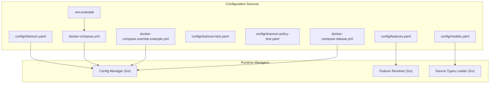
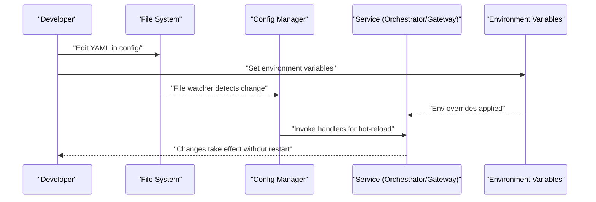
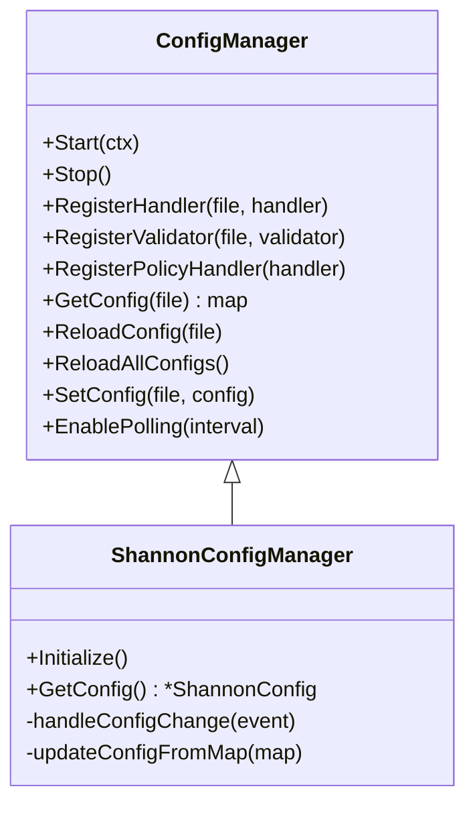
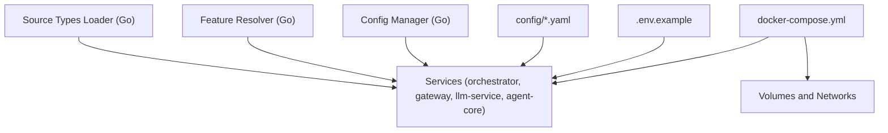

# Configuration and Environment Updates

<cite>
**Referenced Files in This Document**
- [config/README.md](file://config/README.md)
- [config/shannon.yaml](file://config/shannon.yaml)
- [config/features.yaml](file://config/features.yaml)
- [config/models.yaml](file://config/models.yaml)
- [config/shannon-test.yaml](file://config/shannon-test.yaml)
- [config/shannon-policy-test.yaml](file://config/shannon-policy-test.yaml)
- [go/orchestrator/internal/config/config.go](file://go/orchestrator/internal/config/config.go)
- [go/orchestrator/internal/config/manager.go](file://go/orchestrator/internal/config/manager.go)
- [go/orchestrator/internal/config/shannon.go](file://go/orchestrator/internal/config/shannon.go)
- [go/orchestrator/internal/config/source_types.go](file://go/orchestrator/internal/config/source_types.go)
- [go/orchestrator/cmd/gateway/main.go](file://go/orchestrator/cmd/gateway/main.go)
- [deploy/compose/docker-compose.yml](file://deploy/compose/docker-compose.yml)
- [deploy/compose/docker-compose.override.example.yml](file://deploy/compose/docker-compose.override.example.yml)
- [deploy/compose/docker-compose.release.yml](file://deploy/compose/docker-compose.release.yml)
- [.env.example](file://.env.example)
- [desktop/.env.local.example](file://desktop/.env.local.example)
</cite>

## Table of Contents
1. [Introduction](#introduction)
2. [Project Structure](#project-structure)
3. [Core Components](#core-components)
4. [Architecture Overview](#architecture-overview)
5. [Detailed Component Analysis](#detailed-component-analysis)
6. [Dependency Analysis](#dependency-analysis)
7. [Performance Considerations](#performance-considerations)
8. [Troubleshooting Guide](#troubleshooting-guide)
9. [Conclusion](#conclusion)
10. [Appendices](#appendices)

## Introduction
This document provides comprehensive guidance for managing configuration and environment updates across the Shannon platform. It covers environment variable precedence, YAML configuration updates, feature flag management, hot-reload capabilities, configuration validation, drift detection, environment-specific configuration strategies, and operational procedures for safe change management including backup, version control, validation testing, and rollbacks.

## Project Structure
Configuration in Shannon is organized around three pillars:
- YAML configuration files under config/ that define system behavior, feature flags, and model routing.
- Environment variables (.env and Docker Compose) that override sensitive and environment-specific settings.
- Runtime configuration managers that support hot-reload and validation for selected configuration surfaces.

**Diagram sources**
- [config/shannon.yaml](file://config/shannon.yaml#L1-L378)
- [config/features.yaml](file://config/features.yaml#L1-L270)
- [config/models.yaml](file://config/models.yaml#L1-L776)
- [config/shannon-test.yaml](file://config/shannon-test.yaml#L1-L113)
- [config/shannon-policy-test.yaml](file://config/shannon-policy-test.yaml#L1-L79)
- [.env.example](file://.env.example#L1-L248)
- [deploy/compose/docker-compose.yml](file://deploy/compose/docker-compose.yml#L1-L411)
- [deploy/compose/docker-compose.override.example.yml](file://deploy/compose/docker-compose.override.example.yml#L1-L107)
- [deploy/compose/docker-compose.release.yml](file://deploy/compose/docker-compose.release.yml#L1-L345)
- [go/orchestrator/internal/config/manager.go](file://go/orchestrator/internal/config/manager.go#L1-L643)
- [go/orchestrator/internal/config/config.go](file://go/orchestrator/internal/config/config.go#L1-L304)
- [go/orchestrator/internal/config/source_types.go](file://go/orchestrator/internal/config/source_types.go#L1-L485)

**Section sources**
- [config/README.md](file://config/README.md#L1-L305)
- [config/shannon.yaml](file://config/shannon.yaml#L1-L378)
- [config/features.yaml](file://config/features.yaml#L1-L270)
- [config/models.yaml](file://config/models.yaml#L1-L776)
- [.env.example](file://.env.example#L1-L248)
- [deploy/compose/docker-compose.yml](file://deploy/compose/docker-compose.yml#L1-L411)

## Core Components
- Configuration precedence and resolution:
  - Environment variables override Docker Compose defaults and YAML files.
  - YAML files under config/ are the primary source for system-wide settings.
- Hot-reload:
  - Supported for service ports/timeouts, circuit breakers, policy engine, feature flags, and model routing.
  - Requires restart for database connection strings, core service endpoints, and TLS/SSL certificate changes.
- Validation:
  - YAML syntax validation and Docker Compose config validation are supported.
  - Runtime validators ensure critical bounds and relationships (e.g., ports, thresholds, budgets).
- Environment separation:
  - Development, staging, and production environments are supported via environment variables and configuration overlays.

**Section sources**
- [config/README.md](file://config/README.md#L5-L234)
- [go/orchestrator/internal/config/shannon.go](file://go/orchestrator/internal/config/shannon.go#L572-L662)

## Architecture Overview
The configuration lifecycle spans file-based configuration, environment overrides, and runtime managers that apply changes dynamically where supported.

**Diagram sources**
- [go/orchestrator/internal/config/manager.go](file://go/orchestrator/internal/config/manager.go#L304-L446)
- [go/orchestrator/internal/config/shannon.go](file://go/orchestrator/internal/config/shannon.go#L693-L731)
- [config/README.md](file://config/README.md#L181-L207)

## Detailed Component Analysis

### Configuration Precedence and Resolution
- Precedence order:
  - Environment variables (including .env files or runtime exports)
  - Docker Compose defaults
  - YAML configuration files in config/
- Environment variables override YAML for sensitive and environment-specific settings.

**Section sources**
- [config/README.md](file://config/README.md#L5-L11)
- [.env.example](file://.env.example#L16-L102)

### YAML Configuration Files
- shannon.yaml: Main system configuration including service, auth, policy, circuit breakers, degradation, health, agents, temporal, logging, vector/embeddings, tracing, streaming, workflow, session, and features.
- features.yaml: Feature flags and execution modes for agents, orchestration, workflows, enforcement, security, storage, vector intelligence, observability, and experimental features. Includes environment-specific overrides.
- models.yaml: Model tiers, selection strategy, cost controls, prompt caching, provider settings, model catalog, feature flags, capabilities matrix, rate limits, monitoring, and alerts.
- shannon-test.yaml: Demonstrates hot-reload testing by modifying ports, timeouts, thresholds, and enabling vector/tracing.
- shannon-policy-test.yaml: Enables policy engine in dry-run mode for testing.

**Section sources**
- [config/shannon.yaml](file://config/shannon.yaml#L1-L378)
- [config/features.yaml](file://config/features.yaml#L1-L270)
- [config/models.yaml](file://config/models.yaml#L1-L776)
- [config/shannon-test.yaml](file://config/shannon-test.yaml#L1-L113)
- [config/shannon-policy-test.yaml](file://config/shannon-policy-test.yaml#L1-L79)

### Environment Variables and Overrides
- Core runtime variables:
  - ENVIRONMENT, DEBUG, SERVICE_NAME
  - LLM provider API keys (OPENAI_API_KEY, ANTHROPIC_API_KEY, etc.)
  - Web search providers (WEB_SEARCH_PROVIDER, GOOGLE_SEARCH_API_KEY, etc.)
  - Data stores (POSTGRES_*, REDIS_*, QDRANT_*)
  - Service endpoints (TEMPORAL_HOST, LLM_SERVICE_URL, AGENT_CORE_ADDR, ADMIN_SERVER, ORCHESTRATOR_GRPC)
  - Configuration file paths (CONFIG_PATH, MODELS_CONFIG_PATH, SHANNON_CONFIG_PATH)
  - Model routing and budgets (DEFAULT_MODEL_TIER, MAX_TOKENS, MAX_COST_PER_REQUEST, etc.)
  - Cache and rate limiting (ENABLE_CACHE, RATE_LIMIT_REQUESTS, PROVIDER_RATE_CONTROL_ENABLED)
  - Tool execution and workflow controls (TOOL_PARALLELISM, ENABLE_TOOL_SELECTION, PRIORITY_QUEUES)
  - Approvals and security (APPROVAL_ENABLED, JWT_SECRET, GATEWAY_SKIP_AUTH)
  - Templates (TEMPLATE_FALLBACK_ENABLED, TEMPLATES_PATH)
  - Observability (OTEL_SERVICE_NAME, OTEL_EXPORTER_OTLP_ENDPOINT, OTEL_ENABLED, LOG_FORMAT, METRICS_PORT)
  - Python WASI sandbox (PYTHON_WASI_WASM_PATH, WASI_MEMORY_LIMIT_MB, WASI_TIMEOUT_SECONDS)
  - OpenAPI and MCP integrations (OPENAPI_ALLOWED_DOMAINS, MCP_ALLOWED_DOMAINS, etc.)
  - Browser automation (PLAYWRIGHT_SERVICE_URL, BROWSER_* settings)
  - Advanced orchestrator controls (EVENTLOG_BATCH_SIZE, BACKPRESSURE_THRESHOLD, etc.)
  - Miscellaneous (SHANNON_WORKSPACE, SEED_DATA, AGENT_TIMEOUT_SECONDS)
- Desktop environment:
  - NEXT_PUBLIC_API_URL for the desktop app.

**Section sources**
- [.env.example](file://.env.example#L1-L248)
- [desktop/.env.local.example](file://desktop/.env.local.example#L1-L1)

### Hot-Reload Configuration Management
- File watching and polling:
  - ConfigManager watches YAML/JSON files and policy .rego files.
  - Supports polling fallback for unreliable filesystems.
- Handlers and validators:
  - Handlers receive change events and update runtime state.
  - Validators ensure configuration correctness before applying changes.
- Supported hot-reload areas:
  - Service ports/timeouts, circuit breakers, policy engine, feature flags, model routing.
- Requires restart:
  - Database connection strings, core service endpoints, TLS/SSL certificate changes.

**Diagram sources**
- [go/orchestrator/internal/config/manager.go](file://go/orchestrator/internal/config/manager.go#L37-L150)
- [go/orchestrator/internal/config/shannon.go](file://go/orchestrator/internal/config/shannon.go#L667-L731)

**Section sources**
- [go/orchestrator/internal/config/manager.go](file://go/orchestrator/internal/config/manager.go#L1-L643)
- [config/README.md](file://config/README.md#L181-L207)

### Feature Flags and Runtime Toggles
- features.yaml controls execution modes, agent limits, orchestration, workflows, enforcement, security, storage, vector intelligence, observability, and experimental features.
- Environment-specific overrides:
  - development: debug on, authentication disabled, tracing sampling increased.
  - staging: authentication enabled, continuous learning enabled.
  - production: authentication and authorization enabled, experimental features disabled.
- Runtime resolution:
  - Feature flags are loaded from features.yaml and can be overridden by environment variables for specific toggles (e.g., GATEWAY_SKIP_AUTH).
  - Workflow runtime settings (e.g., tool parallelism, synthesis bypass) are resolved with environment variable precedence.

**Section sources**
- [config/features.yaml](file://config/features.yaml#L1-L270)
- [go/orchestrator/internal/config/config.go](file://go/orchestrator/internal/config/config.go#L33-L304)
- [go/orchestrator/cmd/gateway/main.go](file://go/orchestrator/cmd/gateway/main.go#L30-L60)

### Model Configuration and Migration
- models.yaml defines model tiers, selection strategy, cost controls, prompt caching, provider settings, model catalog, feature flags, capabilities matrix, rate limits, monitoring, and alerts.
- Migration considerations:
  - Update model catalogs and provider settings carefully.
  - Adjust cost controls and rate limits when changing providers or models.
  - Validate model capabilities and pricing matrices before deployment.

**Section sources**
- [config/models.yaml](file://config/models.yaml#L1-L776)

### Source Types Configuration
- source_types.yaml governs search strategies, result merging, entity relevance, and prefetch sources.
- Hot-reload support:
  - Source types can be reloaded programmatically for dynamic adjustments.

**Section sources**
- [go/orchestrator/internal/config/source_types.go](file://go/orchestrator/internal/config/source_types.go#L107-L168)

### Environment-Specific Configuration Management
- Development:
  - docker-compose.override.example.yml enables GATEWAY_SKIP_AUTH, debug logging, and local ports.
- Staging/Production:
  - docker-compose.yml and docker-compose.release.yml define production-ready images, ports, and environment variables.
- Environment variables:
  - .env.example provides comprehensive defaults and overrides for all services.

**Section sources**
- [deploy/compose/docker-compose.override.example.yml](file://deploy/compose/docker-compose.override.example.yml#L1-L107)
- [deploy/compose/docker-compose.yml](file://deploy/compose/docker-compose.yml#L1-L411)
- [deploy/compose/docker-compose.release.yml](file://deploy/compose/docker-compose.release.yml#L1-L345)
- [.env.example](file://.env.example#L1-L248)

## Dependency Analysis
Configuration dependencies span file-based configuration, environment variables, and runtime managers.

**Diagram sources**
- [deploy/compose/docker-compose.yml](file://deploy/compose/docker-compose.yml#L14-L411)
- [.env.example](file://.env.example#L1-L248)
- [config/shannon.yaml](file://config/shannon.yaml#L1-L378)
- [config/features.yaml](file://config/features.yaml#L1-L270)
- [config/models.yaml](file://config/models.yaml#L1-L776)
- [go/orchestrator/internal/config/manager.go](file://go/orchestrator/internal/config/manager.go#L1-L643)
- [go/orchestrator/internal/config/config.go](file://go/orchestrator/internal/config/config.go#L1-L304)
- [go/orchestrator/internal/config/source_types.go](file://go/orchestrator/internal/config/source_types.go#L1-L485)

**Section sources**
- [deploy/compose/docker-compose.yml](file://deploy/compose/docker-compose.yml#L1-L411)
- [go/orchestrator/internal/config/manager.go](file://go/orchestrator/internal/config/manager.go#L1-L643)

## Performance Considerations
- Hot-reload reduces downtime by avoiding service restarts for supported settings.
- Proper validation prevents invalid configurations from causing runtime issues.
- Environment-specific tuning (e.g., development vs. production) ensures optimal performance and security posture.

[No sources needed since this section provides general guidance]

## Troubleshooting Guide
- Configuration not loading:
  - Check file permissions and YAML syntax.
  - Review orchestrator logs for errors.
- Hot-reload not working:
  - Verify file watcher activity and polling fallback.
  - Confirm changes appear in logs within the expected timeframe.
- Invalid configuration values:
  - Inspect validation errors in logs.
  - Revert to a known-good configuration backup.

**Section sources**
- [config/README.md](file://config/README.md#L267-L297)

## Conclusion
Shannon’s configuration system combines YAML-based definitions, environment variable overrides, and robust runtime managers supporting hot-reload and validation. By following the documented precedence, validation, and environment-specific practices, teams can safely manage configuration changes across development, staging, and production environments.

[No sources needed since this section summarizes without analyzing specific files]

## Appendices

### Configuration Validation Procedures
- Syntax validation:
  - Use yaml-lint on config/*.yaml.
  - Validate Docker Compose configuration with docker compose config.
- Integration testing:
  - Start services with make dev and run smoke tests.
  - Test specific configuration files by copying test configurations and verifying behavior.

**Section sources**
- [config/README.md](file://config/README.md#L235-L256)

### Hot-Reload Capabilities
- Supported:
  - Service ports/timeouts, circuit breakers, policy engine, feature flags, model routing.
- Requires restart:
  - Database connection strings, core service endpoints, TLS/SSL certificate changes.

**Section sources**
- [config/README.md](file://config/README.md#L181-L196)

### Configuration Drift Detection
- Monitor configuration changes via logs emitted by the ConfigManager.
- Use polling fallback when file watching is unreliable.
- Validate configuration against expected bounds and relationships.

**Section sources**
- [go/orchestrator/internal/config/manager.go](file://go/orchestrator/internal/config/manager.go#L292-L381)
- [go/orchestrator/internal/config/shannon.go](file://go/orchestrator/internal/config/shannon.go#L572-L662)

### Environment-Specific Configuration Management
- Development:
  - Use docker-compose.override.example.yml to enable development-friendly settings.
- Staging/Production:
  - Use docker-compose.yml and docker-compose.release.yml for production images and ports.
- Environment variables:
  - Customize .env.example for your deployment needs.

**Section sources**
- [deploy/compose/docker-compose.override.example.yml](file://deploy/compose/docker-compose.override.example.yml#L1-L107)
- [deploy/compose/docker-compose.yml](file://deploy/compose/docker-compose.yml#L1-L411)
- [deploy/compose/docker-compose.release.yml](file://deploy/compose/docker-compose.release.yml#L1-L345)
- [.env.example](file://.env.example#L1-L248)

### Feature Flag Management and Gradual Rollout
- Define feature flags in features.yaml.
- Use environment-specific overrides for controlled activation.
- Leverage environment variables for quick toggles in production.

**Section sources**
- [config/features.yaml](file://config/features.yaml#L253-L270)
- [go/orchestrator/internal/config/config.go](file://go/orchestrator/internal/config/config.go#L33-L304)

### Configuration Backup and Version Control
- Commit configuration changes to version control.
- Maintain separate branches for environment-specific configurations.
- Keep backups of working configurations before applying changes.

**Section sources**
- [config/README.md](file://config/README.md#L258-L266)

### Configuration Migration Scripts and Rollback Procedures
- Migration scripts:
  - Use database migration scripts under migrations/ for schema changes.
  - Validate model catalog updates in models.yaml before deployment.
- Rollback procedures:
  - Revert to a known-good configuration backup.
  - Restore previous Docker Compose configuration if necessary.

**Section sources**
- [config/README.md](file://config/README.md#L295-L297)