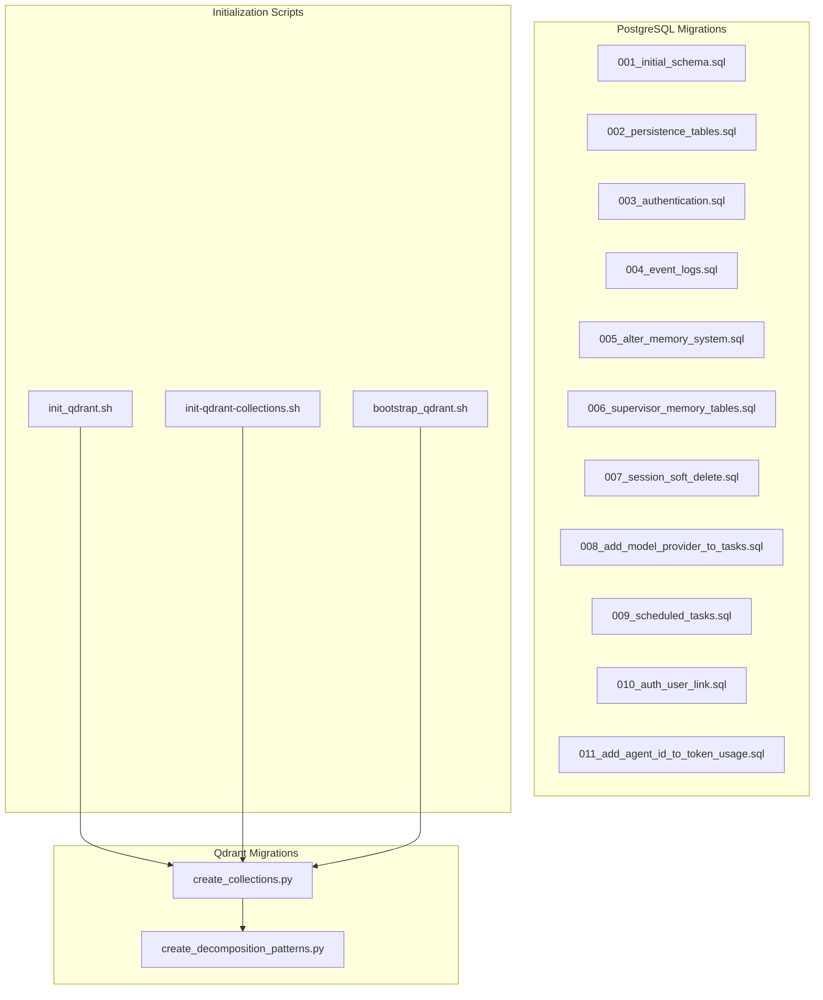
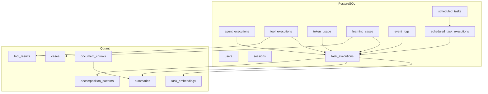
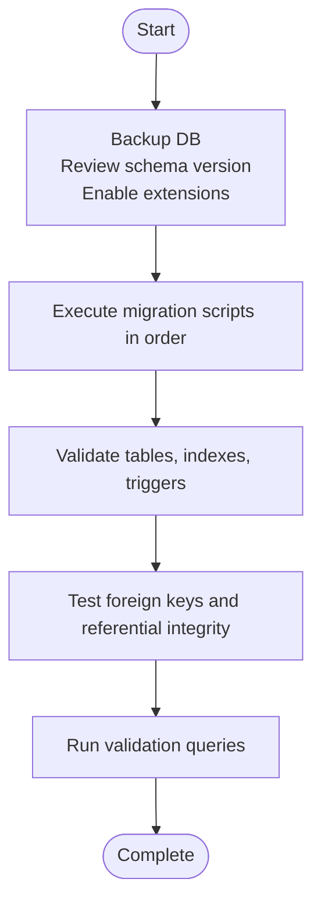
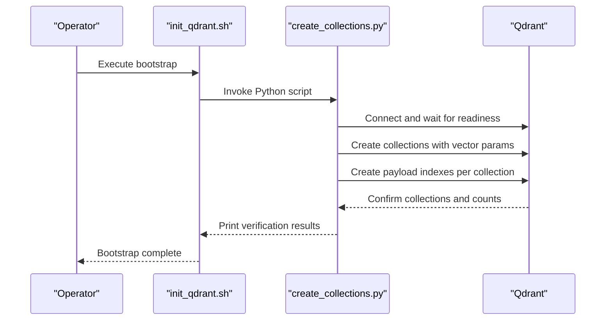
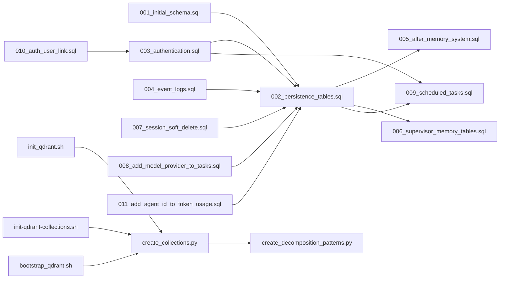

# Database Migration Procedures

<cite>
**Referenced Files in This Document**
- [001_initial_schema.sql](file://migrations/postgres/001_initial_schema.sql)
- [002_persistence_tables.sql](file://migrations/postgres/002_persistence_tables.sql)
- [003_authentication.sql](file://migrations/postgres/003_authentication.sql)
- [004_event_logs.sql](file://migrations/postgres/004_event_logs.sql)
- [005_alter_memory_system.sql](file://migrations/postgres/005_alter_memory_system.sql)
- [006_supervisor_memory_tables.sql](file://migrations/postgres/006_supervisor_memory_tables.sql)
- [007_session_soft_delete.sql](file://migrations/postgres/007_session_soft_delete.sql)
- [008_add_model_provider_to_tasks.sql](file://migrations/postgres/008_add_model_provider_to_tasks.sql)
- [009_scheduled_tasks.sql](file://migrations/postgres/009_scheduled_tasks.sql)
- [010_auth_user_link.sql](file://migrations/postgres/010_auth_user_link.sql)
- [011_add_agent_id_to_token_usage.sql](file://migrations/postgres/011_add_agent_id_to_token_usage.sql)
- [create_collections.py](file://migrations/qdrant/create_collections.py)
- [create_decomposition_patterns.py](file://migrations/qdrant/create_decomposition_patterns.py)
- [bootstrap_qdrant.sh](file://scripts/bootstrap_qdrant.sh)
- [init-qdrant-collections.sh](file://scripts/init-qdrant-collections.sh)
- [init_qdrant.sh](file://scripts/init_qdrant.sh)
</cite>

## Table of Contents
1. [Introduction](#introduction)
2. [Project Structure](#project-structure)
3. [Core Components](#core-components)
4. [Architecture Overview](#architecture-overview)
5. [Detailed Component Analysis](#detailed-component-analysis)
6. [Dependency Analysis](#dependency-analysis)
7. [Performance Considerations](#performance-considerations)
8. [Troubleshooting Guide](#troubleshooting-guide)
9. [Conclusion](#conclusion)
10. [Appendices](#appendices)

## Introduction
This document provides comprehensive guidance for database migrations across PostgreSQL and Qdrant within the Shannon platform. It covers step-by-step procedures for preparing, executing, validating, and rolling back migrations, along with script structure, version numbering, dependency management, and operational best practices. The focus areas include:
- PostgreSQL schema migrations across multiple logical versions
- Qdrant vector database collection creation and payload indexing
- Automated initialization scripts and validation steps
- Rollback strategies and testing approaches
- Performance impact assessment and downtime minimization techniques

## Project Structure
The migration assets are organized under dedicated directories:
- PostgreSQL migrations: sequential SQL scripts numbered with zero-padded prefixes indicating version order
- Qdrant migrations: Python scripts for collection creation and payload indexing
- Initialization scripts: shell scripts to bootstrap Qdrant collections and orchestrate Python-based setup

**Diagram sources**
- [001_initial_schema.sql](file://migrations/postgres/001_initial_schema.sql#L1-L141)
- [002_persistence_tables.sql](file://migrations/postgres/002_persistence_tables.sql#L1-L254)
- [003_authentication.sql](file://migrations/postgres/003_authentication.sql#L1-L153)
- [004_event_logs.sql](file://migrations/postgres/004_event_logs.sql#L1-L50)
- [005_alter_memory_system.sql](file://migrations/postgres/005_alter_memory_system.sql#L1-L117)
- [006_supervisor_memory_tables.sql](file://migrations/postgres/006_supervisor_memory_tables.sql#L1-L161)
- [007_session_soft_delete.sql](file://migrations/postgres/007_session_soft_delete.sql#L1-L50)
- [008_add_model_provider_to_tasks.sql](file://migrations/postgres/008_add_model_provider_to_tasks.sql#L1-L20)
- [009_scheduled_tasks.sql](file://migrations/postgres/009_scheduled_tasks.sql#L1-L155)
- [010_auth_user_link.sql](file://migrations/postgres/010_auth_user_link.sql#L1-L20)
- [011_add_agent_id_to_token_usage.sql](file://migrations/postgres/011_add_agent_id_to_token_usage.sql#L1-L7)
- [create_collections.py](file://migrations/qdrant/create_collections.py#L1-L263)
- [create_decomposition_patterns.py](file://migrations/qdrant/create_decomposition_patterns.py#L1-L132)
- [bootstrap_qdrant.sh](file://scripts/bootstrap_qdrant.sh#L1-L23)
- [init-qdrant-collections.sh](file://scripts/init-qdrant-collections.sh#L1-L62)
- [init_qdrant.sh](file://scripts/init_qdrant.sh#L1-L22)

**Section sources**
- [001_initial_schema.sql](file://migrations/postgres/001_initial_schema.sql#L1-L141)
- [create_collections.py](file://migrations/qdrant/create_collections.py#L1-L263)
- [bootstrap_qdrant.sh](file://scripts/bootstrap_qdrant.sh#L1-L23)

## Core Components
This section outlines the primary migration components and their responsibilities.

- PostgreSQL migrations
  - Versioned SQL scripts define schema changes, indexes, triggers, and data transformations in a deterministic order.
  - Dependencies between scripts are implicit via sequential numbering and inter-script references (e.g., later scripts add foreign keys referencing earlier tables).
  - Examples include initial schema creation, persistence tables, authentication, event logging, memory system adjustments, supervisor memory tables, session soft-delete enhancements, scheduled tasks, and token usage augmentation.

- Qdrant migrations
  - Python scripts create vector collections with optimized configurations and payload indexes tailored to use cases such as task embeddings, tool results, cases, document chunks, summaries, and decomposition patterns.
  - Initialization scripts provide both HTTP-based and Python-based bootstrap options.

**Section sources**
- [002_persistence_tables.sql](file://migrations/postgres/002_persistence_tables.sql#L1-L254)
- [003_authentication.sql](file://migrations/postgres/003_authentication.sql#L1-L153)
- [004_event_logs.sql](file://migrations/postgres/004_event_logs.sql#L1-L50)
- [005_alter_memory_system.sql](file://migrations/postgres/005_alter_memory_system.sql#L1-L117)
- [006_supervisor_memory_tables.sql](file://migrations/postgres/006_supervisor_memory_tables.sql#L1-L161)
- [007_session_soft_delete.sql](file://migrations/postgres/007_session_soft_delete.sql#L1-L50)
- [009_scheduled_tasks.sql](file://migrations/postgres/009_scheduled_tasks.sql#L1-L155)
- [010_auth_user_link.sql](file://migrations/postgres/010_auth_user_link.sql#L1-L20)
- [011_add_agent_id_to_token_usage.sql](file://migrations/postgres/011_add_agent_id_to_token_usage.sql#L1-L7)
- [create_collections.py](file://migrations/qdrant/create_collections.py#L1-L263)
- [create_decomposition_patterns.py](file://migrations/qdrant/create_decomposition_patterns.py#L1-L132)
- [init-qdrant-collections.sh](file://scripts/init-qdrant-collections.sh#L1-L62)

## Architecture Overview
The migration architecture comprises two primary systems: PostgreSQL for relational persistence and Qdrant for vector search and retrieval.

**Diagram sources**
- [001_initial_schema.sql](file://migrations/postgres/001_initial_schema.sql#L9-L126)
- [002_persistence_tables.sql](file://migrations/postgres/002_persistence_tables.sql#L8-L253)
- [004_event_logs.sql](file://migrations/postgres/004_event_logs.sql#L5-L49)
- [006_supervisor_memory_tables.sql](file://migrations/postgres/006_supervisor_memory_tables.sql#L6-L115)
- [009_scheduled_tasks.sql](file://migrations/postgres/009_scheduled_tasks.sql#L30-L154)
- [create_collections.py](file://migrations/qdrant/create_collections.py#L56-L226)
- [create_decomposition_patterns.py](file://migrations/qdrant/create_decomposition_patterns.py#L24-L125)

## Detailed Component Analysis

### PostgreSQL Migration Script Structure and Versioning
- Version numbering
  - Zero-padded three-digit numbering indicates chronological order and dependency sequencing.
  - Typical progression: 001 → 002 → ... → 011.
- Script structure
  - Each script defines a coherent set of schema changes, including tables, indexes, triggers, and comments.
  - Many scripts conditionally apply changes using constructs like IF NOT EXISTS and DO blocks to support idempotent runs.
- Dependency management
  - Later scripts depend on earlier tables and columns being present (e.g., foreign keys referencing task_executions).
  - Some scripts introduce schema-level changes (e.g., auth schema) that alter cross-table relationships.

Examples of structural patterns:
- Initial schema creation with UUID generation and common indexes
- Persistence tables introducing agent and tool execution tracking
- Authentication schema and tenant/user linkage
- Event logs and response column additions
- Memory system adjustments and supervisor memory tables
- Session soft-delete and dual-ID support
- Scheduled tasks and unified task execution model
- Token usage augmentation with agent attribution

**Section sources**
- [001_initial_schema.sql](file://migrations/postgres/001_initial_schema.sql#L1-L141)
- [002_persistence_tables.sql](file://migrations/postgres/002_persistence_tables.sql#L1-L254)
- [003_authentication.sql](file://migrations/postgres/003_authentication.sql#L1-L153)
- [004_event_logs.sql](file://migrations/postgres/004_event_logs.sql#L1-L50)
- [005_alter_memory_system.sql](file://migrations/postgres/005_alter_memory_system.sql#L1-L117)
- [006_supervisor_memory_tables.sql](file://migrations/postgres/006_supervisor_memory_tables.sql#L1-L161)
- [007_session_soft_delete.sql](file://migrations/postgres/007_session_soft_delete.sql#L1-L50)
- [009_scheduled_tasks.sql](file://migrations/postgres/009_scheduled_tasks.sql#L1-L155)
- [010_auth_user_link.sql](file://migrations/postgres/010_auth_user_link.sql#L1-L20)
- [011_add_agent_id_to_token_usage.sql](file://migrations/postgres/011_add_agent_id_to_token_usage.sql#L1-L7)

### Step-by-Step PostgreSQL Migration Procedure
- Pre-migration preparation
  - Backup the target database to enable rollback.
  - Review the current schema version and confirm dependencies among scripts.
  - Set up required PostgreSQL extensions (e.g., uuid-ossp, pgcrypto, pg_trgm, btree_gin).
  - Ensure environment variables for authentication and tenant defaults are configured as needed.
- Migration execution
  - Apply migrations in strict numerical order (001 → 002 → ... → 011).
  - For each script, execute the SQL statements and verify table/index creation.
  - Pay special attention to foreign key additions and index creation in later scripts.
- Post-migration validation
  - Confirm presence of tables, indexes, and triggers.
  - Validate referential integrity for foreign keys.
  - Test representative queries leveraging new indexes and views.
  - Verify audit and logging entries if applicable.

[No sources needed since this diagram shows conceptual workflow, not actual code structure]

### PostgreSQL Rollback Procedures
Rollback strategies vary by migration complexity:
- Reversible changes
  - Use DROP statements for newly added tables or indexes where safe.
  - Remove added columns and revert comments.
- Non-reversible changes
  - Restore from pre-migration backups.
  - Recreate dependent objects after restoring base schema.
- Idempotent scripts
  - Many scripts use IF NOT EXISTS; re-running older scripts generally does not cause harm but will not undo destructive changes.

Operational tips:
- Maintain a change log per migration with rationale and rollback steps.
- Prefer point-in-time recovery (PITR) for full rollback scenarios.
- Test rollback procedures in staging environments before production.

**Section sources**
- [002_persistence_tables.sql](file://migrations/postgres/002_persistence_tables.sql#L237-L253)
- [005_alter_memory_system.sql](file://migrations/postgres/005_alter_memory_system.sql#L1-L117)
- [009_scheduled_tasks.sql](file://migrations/postgres/009_scheduled_tasks.sql#L114-L124)

### Qdrant Migration Script Structure and Versioning
- Collection creation
  - Python scripts define vector collections with optimized configurations (e.g., HNSW parameters, optimizer thresholds).
  - Payload indexes are created per collection to support filtering and search performance.
- Decomposition patterns
  - Dedicated collection for storing decomposition history with payload indexes for session_id, user_id, strategy, success_rate, timestamp, and pattern text.
- Initialization scripts
  - Shell scripts provide HTTP-based bootstrap for minimal setups.
  - Python-based initialization supports containerized or local environments.

**Section sources**
- [create_collections.py](file://migrations/qdrant/create_collections.py#L1-L263)
- [create_decomposition_patterns.py](file://migrations/qdrant/create_decomposition_patterns.py#L1-L132)
- [bootstrap_qdrant.sh](file://scripts/bootstrap_qdrant.sh#L1-L23)
- [init-qdrant-collections.sh](file://scripts/init-qdrant-collections.sh#L1-L62)
- [init_qdrant.sh](file://scripts/init_qdrant.sh#L1-L22)

### Step-by-Step Qdrant Migration Procedure
- Pre-migration preparation
  - Ensure Qdrant is reachable via configured host/port or URL.
  - Confirm environment variables for vector dimensions and connection settings.
- Migration execution
  - Run the Python collection creation script to create all required collections and payload indexes.
  - Optionally seed sample data for testing if environment variable permits.
- Post-migration validation
  - Verify collections exist and report counts.
  - Confirm payload indexes are created and searchable.
  - Perform basic vector upsert and filter queries to validate performance.

**Diagram sources**
- [init_qdrant.sh](file://scripts/init_qdrant.sh#L1-L22)
- [create_collections.py](file://migrations/qdrant/create_collections.py#L27-L226)

### Qdrant Rollback Procedures
- Collection recreation
  - Delete and recreate collections if necessary, noting potential data loss.
- Index reconfiguration
  - Drop and recreate payload indexes if misconfigured.
- Environment resets
  - Use container restarts or cluster reset procedures to restore clean state.

**Section sources**
- [create_decomposition_patterns.py](file://migrations/qdrant/create_decomposition_patterns.py#L34-L45)
- [create_collections.py](file://migrations/qdrant/create_collections.py#L218-L226)

### Automated Migration Scripts and Validation
- PostgreSQL
  - Use psql to execute scripts in order; wrap in transactions for multi-statement scripts where appropriate.
  - Validate with information_schema queries and targeted SELECT statements.
- Qdrant
  - Use init_qdrant.sh wrapper to invoke Python scripts consistently across environments.
  - Validate via collection listing and point counts.

**Section sources**
- [init_qdrant.sh](file://scripts/init_qdrant.sh#L1-L22)
- [create_collections.py](file://migrations/qdrant/create_collections.py#L258-L263)

### Migration Testing Strategies
- PostgreSQL
  - Unit-level: Validate DDL statements and index creation.
  - Integration-level: Execute representative queries and joins to ensure performance characteristics meet expectations.
  - Regression-level: Compare query plans and timing against baselines.
- Qdrant
  - Functional-level: Upsert vectors, filter by payload, and measure recall/time trade-offs.
  - Load-level: Stress test with concurrent writes and searches.

[No sources needed since this section provides general guidance]

### Performance Impact Assessment and Downtime Minimization
- PostgreSQL
  - Use partial indexes and composite indexes judiciously to minimize write overhead while optimizing reads.
  - Batch DDL operations where possible; avoid long table rebuilds during peak hours.
  - Monitor replication lag and apply migrations during maintenance windows.
- Qdrant
  - Tune HNSW parameters and optimizer thresholds for workload characteristics.
  - Use payload indexes to reduce full-scan costs; monitor segment sizes and indexing thresholds.
  - Schedule bulk operations outside peak hours and validate performance before rollout.

[No sources needed since this section provides general guidance]

## Dependency Analysis
This section maps dependencies between migration components and their runtime integration points.

**Diagram sources**
- [001_initial_schema.sql](file://migrations/postgres/001_initial_schema.sql#L1-L141)
- [002_persistence_tables.sql](file://migrations/postgres/002_persistence_tables.sql#L1-L254)
- [003_authentication.sql](file://migrations/postgres/003_authentication.sql#L1-L153)
- [004_event_logs.sql](file://migrations/postgres/004_event_logs.sql#L1-L50)
- [005_alter_memory_system.sql](file://migrations/postgres/005_alter_memory_system.sql#L1-L117)
- [006_supervisor_memory_tables.sql](file://migrations/postgres/006_supervisor_memory_tables.sql#L1-L161)
- [007_session_soft_delete.sql](file://migrations/postgres/007_session_soft_delete.sql#L1-L50)
- [008_add_model_provider_to_tasks.sql](file://migrations/postgres/008_add_model_provider_to_tasks.sql#L1-L20)
- [009_scheduled_tasks.sql](file://migrations/postgres/009_scheduled_tasks.sql#L1-L155)
- [010_auth_user_link.sql](file://migrations/postgres/010_auth_user_link.sql#L1-L20)
- [011_add_agent_id_to_token_usage.sql](file://migrations/postgres/011_add_agent_id_to_token_usage.sql#L1-L7)
- [create_collections.py](file://migrations/qdrant/create_collections.py#L1-L263)
- [create_decomposition_patterns.py](file://migrations/qdrant/create_decomposition_patterns.py#L1-L132)
- [init-qdrant-collections.sh](file://scripts/init-qdrant-collections.sh#L1-L62)
- [bootstrap_qdrant.sh](file://scripts/bootstrap_qdrant.sh#L1-L23)
- [init_qdrant.sh](file://scripts/init_qdrant.sh#L1-L22)

**Section sources**
- [002_persistence_tables.sql](file://migrations/postgres/002_persistence_tables.sql#L237-L253)
- [005_alter_memory_system.sql](file://migrations/postgres/005_alter_memory_system.sql#L1-L117)
- [009_scheduled_tasks.sql](file://migrations/postgres/009_scheduled_tasks.sql#L114-L124)
- [create_collections.py](file://migrations/qdrant/create_collections.py#L44-L226)

## Performance Considerations
- PostgreSQL
  - Index selection: composite and partial indexes improve query performance for analytics and filtering.
  - Triggers and functions: maintain lightweight logic to avoid write amplification.
  - Partitioning: consider table partitioning for large tables (e.g., task_executions) when justified by volume.
- Qdrant
  - Vector size and distance metric: align with embedding provider specifications.
  - HNSW configuration: tune M, ef_construct, and thresholds for recall vs. latency.
  - Payload indexing: create indexes on frequently filtered fields to reduce search cost.

[No sources needed since this section provides general guidance]

## Troubleshooting Guide
Common issues and remedies:
- PostgreSQL
  - Extension not found: ensure uuid-ossp, pgcrypto, pg_trgm, and btree_gin are enabled before running migrations.
  - Foreign key failures: verify referenced tables exist and required columns are added in earlier migrations.
  - Index creation conflicts: drop conflicting indexes or adjust naming to avoid duplicates.
- Qdrant
  - Connection refused: confirm Qdrant endpoint configuration and network reachability.
  - Collection creation errors: check vector size and distance compatibility with embedding provider.
  - Payload index errors: validate field types and schema definitions.

Validation checks:
- PostgreSQL: query information_schema and run EXPLAIN ANALYZE on critical queries.
- Qdrant: list collections, inspect point counts, and perform targeted search queries.

**Section sources**
- [003_authentication.sql](file://migrations/postgres/003_authentication.sql#L5-L6)
- [002_persistence_tables.sql](file://migrations/postgres/002_persistence_tables.sql#L237-L253)
- [create_collections.py](file://migrations/qdrant/create_collections.py#L27-L42)
- [create_decomposition_patterns.py](file://migrations/qdrant/create_decomposition_patterns.py#L30-L45)

## Conclusion
The Shannon platform’s migration framework combines ordered PostgreSQL scripts with robust Qdrant collection initialization. By following structured preparation, execution, validation, and rollback procedures, teams can safely evolve schema and vector capabilities while minimizing risk and downtime. Automated scripts and validation steps further streamline operations, enabling repeatable and reliable deployments.

[No sources needed since this section summarizes without analyzing specific files]

## Appendices
- Appendix A: Migration Execution Checklist
  - PostgreSQL
    - Confirm extensions enabled
    - Execute scripts in order
    - Validate indexes and foreign keys
    - Test analytics queries
  - Qdrant
    - Verify connectivity
    - Confirm collection creation and payload indexes
    - Validate vector upsert and search
- Appendix B: Rollback Reference
  - PostgreSQL: DROP statements for new tables/indexes; restore from backups for non-reversible changes
  - Qdrant: delete/recreate collections; reapply payload indexes

[No sources needed since this section provides general guidance]