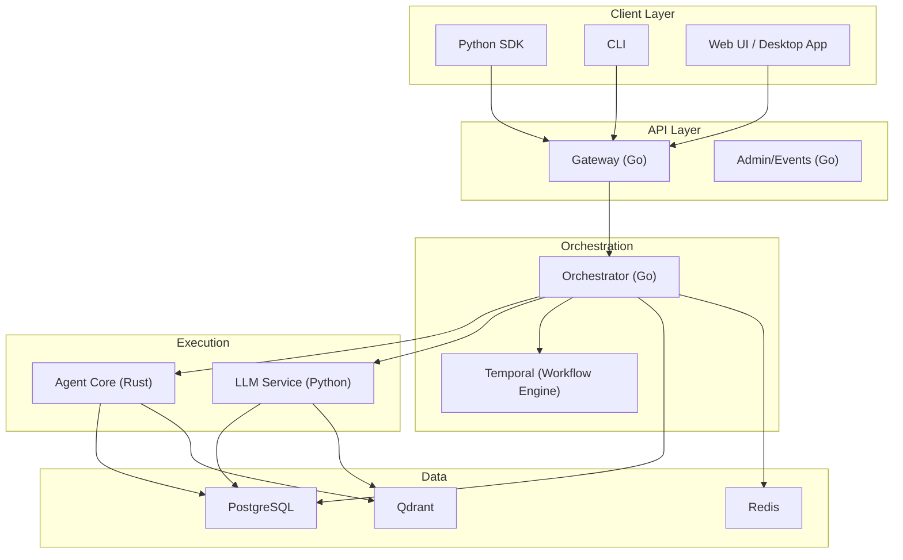
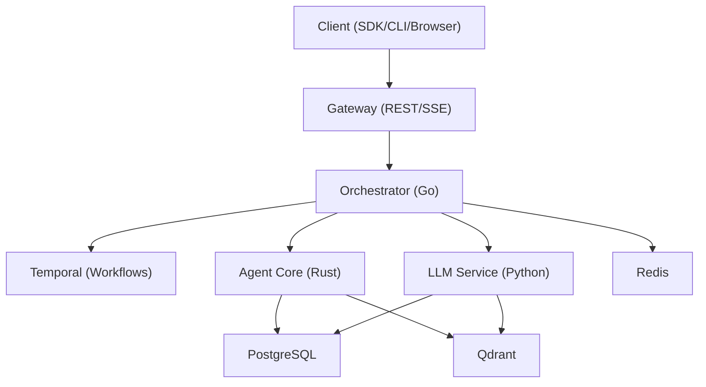
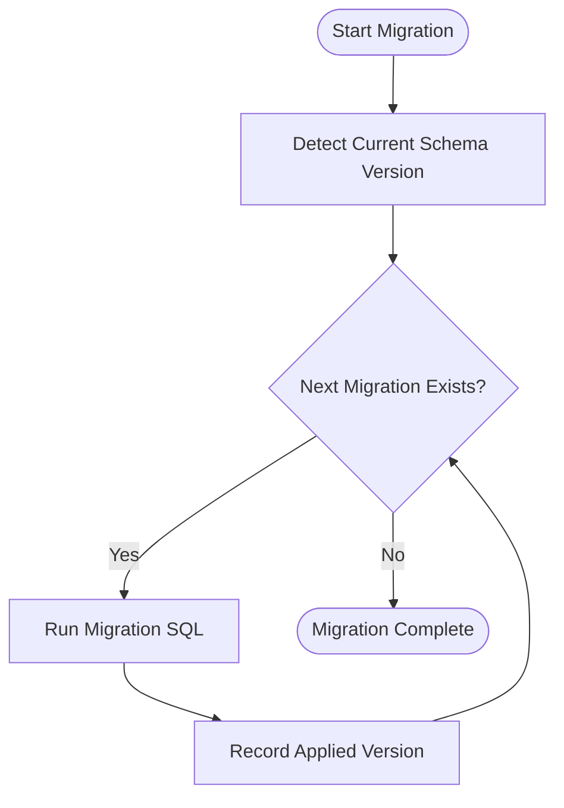
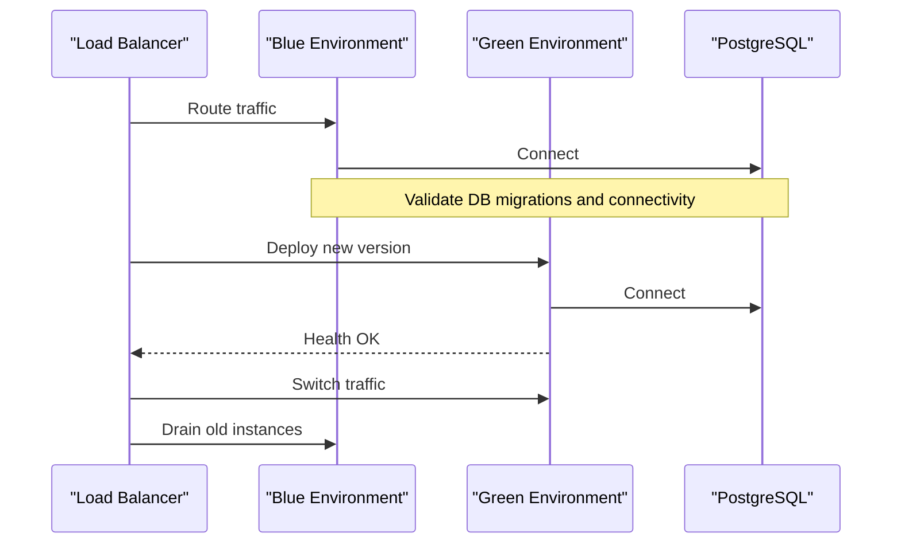
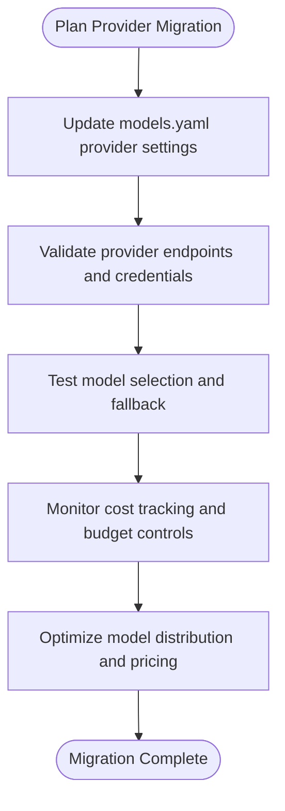
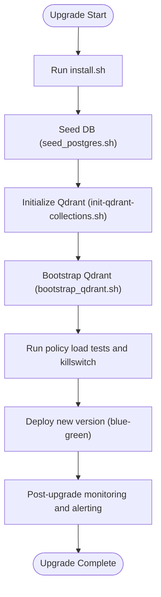
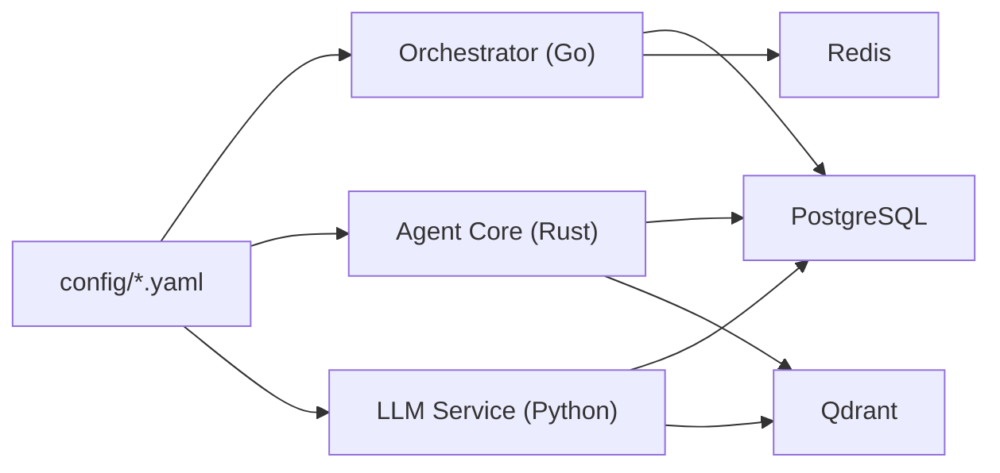

# Migration and Upgrade Procedures

<cite>
**Referenced Files in This Document**
- [README.md](file://README.md)
- [ROADMAP.md](file://ROADMAP.md)
- [changelog.md](file://docs/changelog.md)
- [001_initial_schema.sql](file://migrations/postgres/001_initial_schema.sql)
- [002_persistence_tables.sql](file://migrations/postgres/002_persistence_tables.sql)
- [003_authentication.sql](file://migrations/postgres/003_authentication.sql)
- [004_event_logs.sql](file://migrations/postgres/004_event_logs.sql)
- [005_alter_memory_system.sql](file://migrations/postgres/005_alter_memory_system.sql)
- [006_supervisor_memory_tables.sql](file://migrations/postgres/006_supervisor_memory_tables.sql)
- [007_session_soft_delete.sql](file://migrations/postgres/007_session_soft_delete.sql)
- [008_add_model_provider_to_tasks.sql](file://migrations/postgres/008_add_model_provider_to_tasks.sql)
- [models.yaml](file://config/models.yaml)
- [features.yaml](file://config/features.yaml)
- [docker-compose.release.yml](file://deploy/compose/docker-compose.release.yml)
- [docker-compose.yml](file://deploy/compose/docker-compose.yml)
- [install.sh](file://scripts/install.sh)
- [seed_postgres.sh](file://scripts/seed_postgres.sh)
- [init-qdrant-collections.sh](file://scripts/init-qdrant-collections.sh)
- [init_qdrant.sh](file://scripts/init_qdrant.sh)
- [bootstrap_qdrant.sh](file://scripts/bootstrap_qdrant.sh)
- [create_test_api_key.sql](file://scripts/create_test_api_key.sql)
- [policy-killswitch.sh](file://go/orchestrator/scripts/policy-killswitch.sh)
- [run-policy-load-tests.sh](file://go/orchestrator/scripts/run-policy-load-tests.sh)
- [generate_v2_histories.sh](file://go/orchestrator/scripts/generate_v2_histories.sh)
- [health.go](file://go/orchestrator/internal/health/http.go)
- [manager.go](file://go/orchestrator/internal/health/manager.go)
- [checkers.go](file://go/orchestrator/internal/health/checkers.go)
- [README.md](file://go/orchestrator/README.md)
- [README.md](file://go/orchestrator/cmd/gateway/README.md)
- [README.md](file://python/llm-service/README.md)
- [README.md](file://rust/agent-core/README.md)
- [README.md](file://desktop/README.md)
</cite>

## Table of Contents
1. [Introduction](#introduction)
2. [Project Structure](#project-structure)
3. [Core Components](#core-components)
4. [Architecture Overview](#architecture-overview)
5. [Detailed Component Analysis](#detailed-component-analysis)
6. [Dependency Analysis](#dependency-analysis)
7. [Performance Considerations](#performance-considerations)
8. [Troubleshooting Guide](#troubleshooting-guide)
9. [Conclusion](#conclusion)
10. [Appendices](#appendices)

## Introduction
This document provides comprehensive migration and upgrade procedures for major version changes and system updates in Shannon. It covers step-by-step migration between major versions, breaking changes, deprecated features, compatibility considerations, database migration strategies, service upgrade procedures, model provider migration, automated scripts, validation/testing strategies, rollback procedures, emergency response protocols, and post-upgrade monitoring.

## Project Structure
Shannon is a multi-service system composed of:
- Gateway and Orchestrator (Go)
- Agent Core (Rust)
- LLM Service (Python)
- Data layer: PostgreSQL, Redis, Qdrant
- Configuration: YAML files under config/
- Deployment: Docker Compose
- Observability: Grafana, Prometheus, OpenTelemetry

**Diagram sources**
- [README.md](file://README.md#L201-L226)
- [docker-compose.release.yml](file://deploy/compose/docker-compose.release.yml)

**Section sources**
- [README.md](file://README.md#L191-L226)
- [docker-compose.release.yml](file://deploy/compose/docker-compose.release.yml)

## Core Components
- Gateway and Admin services expose REST and streaming endpoints and manage health checks.
- Orchestrator coordinates workflows, enforces budgets, manages sessions, and persists execution telemetry.
- Agent Core executes tasks in a WASI sandbox with policy enforcement.
- LLM Service abstracts multiple providers and exposes completions, embeddings, and tools.
- Data layer persists tasks, agent/tool executions, token usage, and event logs; integrates with Redis and Qdrant.

**Section sources**
- [README.md](file://README.md#L220-L226)
- [README.md](file://README.md#L395-L421)

## Architecture Overview
Shannon’s architecture supports production-grade reliability with observability, multi-tenant isolation, and provider abstraction. Upgrades should preserve service contracts, maintain backward compatibility where possible, and leverage health checks and blue-green deployments.

**Diagram sources**
- [README.md](file://README.md#L201-L226)

**Section sources**
- [README.md](file://README.md#L201-L226)

## Detailed Component Analysis

### Database Migration Strategies
Shannon’s PostgreSQL schema evolves through ordered migrations. Each migration file defines schema changes, indexes, and data transformations. Use the provided scripts to initialize and seed the database.

Key migration highlights:
- Initial schema creation and triggers for updated_at timestamps.
- Persistence tables for tasks, agents, and tools; daily aggregates and partitioning guidance.
- Authentication and multi-tenancy tables and indexes.
- Event logs for audit trail and UI replay.
- Memory system consolidation and tool execution schema normalization.
- Supervisor memory tables for decomposition patterns, strategy performance, team compositions, failure patterns, and user preferences.
- Session soft-delete and dual-ID indexing for improved lookups.
- Model and provider tracking at the task level.

**Diagram sources**
- [001_initial_schema.sql](file://migrations/postgres/001_initial_schema.sql#L1-L141)
- [002_persistence_tables.sql](file://migrations/postgres/002_persistence_tables.sql#L1-L254)
- [003_authentication.sql](file://migrations/postgres/003_authentication.sql#L1-L153)
- [004_event_logs.sql](file://migrations/postgres/004_event_logs.sql#L1-L50)
- [005_alter_memory_system.sql](file://migrations/postgres/005_alter_memory_system.sql#L1-L117)
- [006_supervisor_memory_tables.sql](file://migrations/postgres/006_supervisor_memory_tables.sql#L1-L161)
- [007_session_soft_delete.sql](file://migrations/postgres/007_session_soft_delete.sql#L1-L50)
- [008_add_model_provider_to_tasks.sql](file://migrations/postgres/008_add_model_provider_to_tasks.sql#L1-L20)

Operational steps:
- Backup current database before applying migrations.
- Apply migrations in order using your database client or migration runner.
- Seed initial data if required using provided scripts.
- Validate indexes and constraints created by migrations.
- Re-index or optimize as needed for large datasets.

Validation checklist:
- Confirm presence of expected tables and indexes.
- Verify triggers for updated_at columns.
- Test event_logs and task_executions response indexing.
- Confirm multi-tenant and soft-delete indexes for performance.

Rollback strategy:
- Maintain backups prior to each migration.
- Keep a reverse migration plan for critical schema changes.
- Use transactional migrations where possible; otherwise, document manual steps to revert.

**Section sources**
- [001_initial_schema.sql](file://migrations/postgres/001_initial_schema.sql#L1-L141)
- [002_persistence_tables.sql](file://migrations/postgres/002_persistence_tables.sql#L1-L254)
- [003_authentication.sql](file://migrations/postgres/003_authentication.sql#L1-L153)
- [004_event_logs.sql](file://migrations/postgres/004_event_logs.sql#L1-L50)
- [005_alter_memory_system.sql](file://migrations/postgres/005_alter_memory_system.sql#L1-L117)
- [006_supervisor_memory_tables.sql](file://migrations/postgres/006_supervisor_memory_tables.sql#L1-L161)
- [007_session_soft_delete.sql](file://migrations/postgres/007_session_soft_delete.sql#L1-L50)
- [008_add_model_provider_to_tasks.sql](file://migrations/postgres/008_add_model_provider_to_tasks.sql#L1-L20)
- [seed_postgres.sh](file://scripts/seed_postgres.sh)
- [create_test_api_key.sql](file://scripts/create_test_api_key.sql)

### Service Upgrade Procedures
Zero-downtime upgrades can be achieved using blue-green deployments or rolling restarts with health checks.

Recommended approach:
- Prepare two identical environments (green and blue).
- Deploy the new version to the inactive environment.
- Run health checks against the new environment.
- Switch traffic (or container labels/services) to the new environment.
- Terminate the old environment after verification.

Health checks:
- Use built-in health endpoints to validate service readiness and liveness.
- Monitor metrics and logs during the switch.

**Diagram sources**
- [README.md](file://README.md#L395-L421)
- [docker-compose.release.yml](file://deploy/compose/docker-compose.release.yml)

**Section sources**
- [README.md](file://README.md#L395-L421)
- [docker-compose.release.yml](file://deploy/compose/docker-compose.release.yml)

### Model Provider Migration Procedures
Model provider migration involves updating configuration, validating provider endpoints, and optimizing costs during transitions.

Steps:
- Update provider settings and base URLs in configuration.
- Adjust model catalogs and pricing to reflect new provider offerings.
- Validate model capabilities and context windows.
- Test streaming and function calling support.
- Monitor cost tracking and adjust budget controls.

**Diagram sources**
- [models.yaml](file://config/models.yaml#L138-L198)
- [models.yaml](file://config/models.yaml#L533-L776)

**Section sources**
- [models.yaml](file://config/models.yaml#L1-L776)

### Automated Scripts and Validation
Automated scripts support installation, seeding, and initialization of supporting systems.

- Installation script sets up environment and pulls images.
- Seed script initializes database with baseline data.
- Qdrant bootstrap scripts create collections and patterns.
- Policy killswitch and load tests assist in safe rollouts.

**Diagram sources**
- [install.sh](file://scripts/install.sh)
- [seed_postgres.sh](file://scripts/seed_postgres.sh)
- [init-qdrant-collections.sh](file://scripts/init-qdrant-collections.sh)
- [init_qdrant.sh](file://scripts/init_qdrant.sh)
- [bootstrap_qdrant.sh](file://scripts/bootstrap_qdrant.sh)
- [policy-killswitch.sh](file://go/orchestrator/scripts/policy-killswitch.sh)
- [run-policy-load-tests.sh](file://go/orchestrator/scripts/run-policy-load-tests.sh)

**Section sources**
- [install.sh](file://scripts/install.sh)
- [seed_postgres.sh](file://scripts/seed_postgres.sh)
- [init-qdrant-collections.sh](file://scripts/init-qdrant-collections.sh)
- [init_qdrant.sh](file://scripts/init_qdrant.sh)
- [bootstrap_qdrant.sh](file://scripts/bootstrap_qdrant.sh)
- [policy-killswitch.sh](file://go/orchestrator/scripts/policy-killswitch.sh)
- [run-policy-load-tests.sh](file://go/orchestrator/scripts/run-policy-load-tests.sh)

### Breaking Changes and Compatibility
Review the changelog for recent breaking changes and compatibility notes. Pay attention to:
- Streaming event format changes and SSE routing corrections.
- Model updates and provider routing adjustments.
- Configuration reloads and thread safety fixes.
- Tool references and role presets.

Compatibility considerations:
- Maintain backward-compatible API endpoints where feasible.
- Use feature flags and environment overrides for gradual adoption.
- Validate SDK and CLI compatibility after upgrades.

**Section sources**
- [changelog.md](file://docs/changelog.md#L1-L82)

### Testing Strategies for Upgrade Success
- Smoke tests: End-to-end tests to validate core workflows.
- Regression tests: Ensure previously working features remain intact.
- Load tests: Validate performance under expected load.
- Policy tests: Confirm OPA policies and killswitch behavior.
- Integration tests: Validate provider integrations and tool execution.

Testing commands and suites are available in the repository.

**Section sources**
- [README.md](file://README.md#L450-L496)

## Dependency Analysis
Shannon’s services depend on shared configuration and data layers. Upgrades should minimize coupling and leverage configuration-driven behavior.

**Diagram sources**
- [features.yaml](file://config/features.yaml#L1-L270)
- [models.yaml](file://config/models.yaml#L1-L776)

**Section sources**
- [features.yaml](file://config/features.yaml#L1-L270)
- [models.yaml](file://config/models.yaml#L1-L776)

## Performance Considerations
- Use indexes created by migrations to optimize analytics queries.
- Monitor daily aggregates and adjust partitioning for large-scale deployments.
- Tune provider timeouts and retries based on workload characteristics.
- Enable prompt caching and rate limiting to control costs.

[No sources needed since this section provides general guidance]

## Troubleshooting Guide
Common issues and remedies:
- Services not starting: verify environment variables, ports, and image availability.
- Task execution failures: check API keys, provider endpoints, and configuration files.
- Out of memory: reduce WASI memory limits and history window settings.

Health checks:
- Use built-in health endpoints to validate service status.
- Inspect logs for errors and stack traces.

Emergency response:
- Use policy killswitch to disable problematic policies.
- Roll back to previous version using blue-green or tagged images.
- Validate database migrations and re-seed if necessary.

**Section sources**
- [README.md](file://README.md#L395-L438)
- [README.md](file://README.md#L450-L496)
- [policy-killswitch.sh](file://go/orchestrator/scripts/policy-killswitch.sh)

## Conclusion
Shannon’s upgrade and migration procedures emphasize safety, observability, and operational resilience. By following ordered database migrations, validating with automated tests, implementing blue-green deployments, and maintaining robust health checks, teams can confidently move between major versions while minimizing risk.

[No sources needed since this section summarizes without analyzing specific files]

## Appendices

### Appendix A: Step-by-Step Upgrade Checklist
- Backup database and configuration.
- Review changelog for breaking changes.
- Apply migrations in order.
- Seed database if required.
- Initialize Qdrant collections.
- Deploy new version using blue-green strategy.
- Run smoke and regression tests.
- Monitor metrics and logs.
- Validate provider configurations and cost controls.
- Roll back if issues arise.

**Section sources**
- [changelog.md](file://docs/changelog.md#L1-L82)
- [README.md](file://README.md#L395-L438)
- [README.md](file://README.md#L450-L496)

### Appendix B: Configuration Reference
- models.yaml: Model tiers, provider settings, pricing, and capabilities.
- features.yaml: Execution modes, orchestration, security, and observability settings.

**Section sources**
- [models.yaml](file://config/models.yaml#L1-L776)
- [features.yaml](file://config/features.yaml#L1-L270)