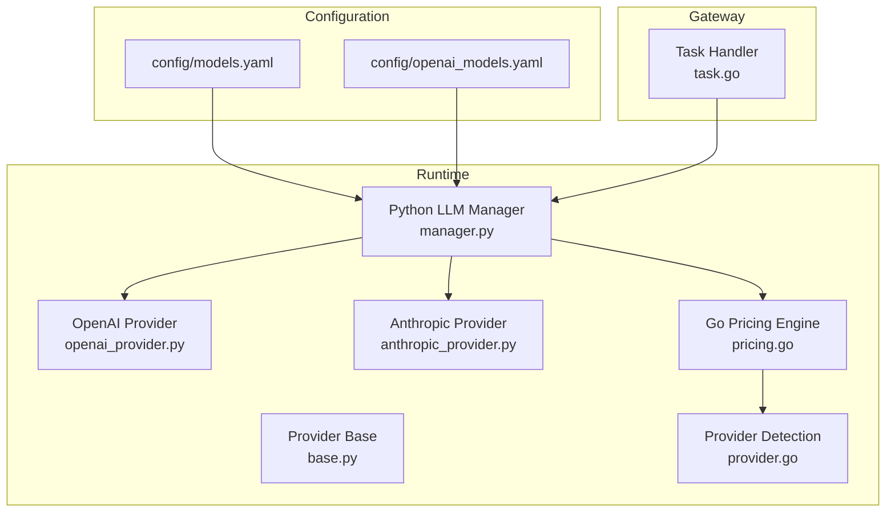
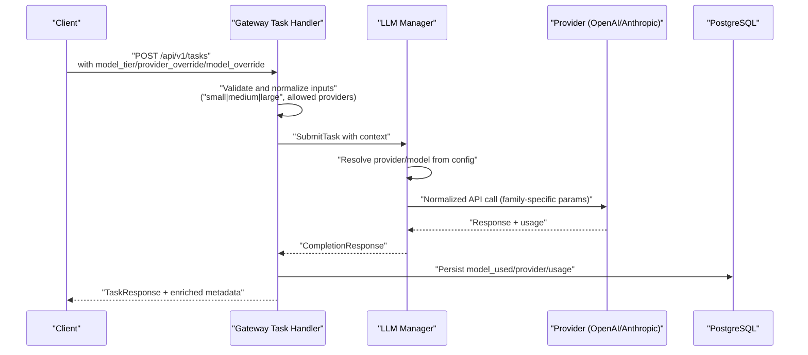
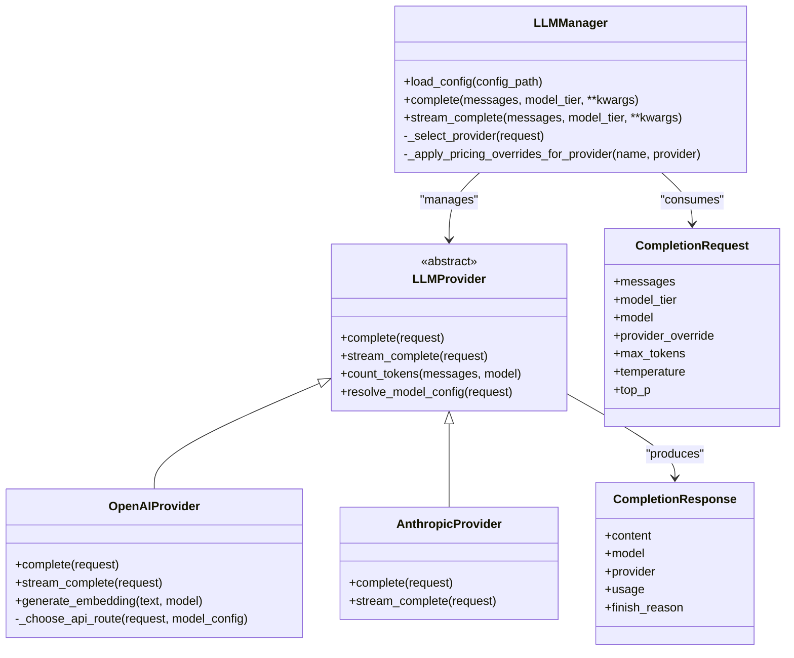
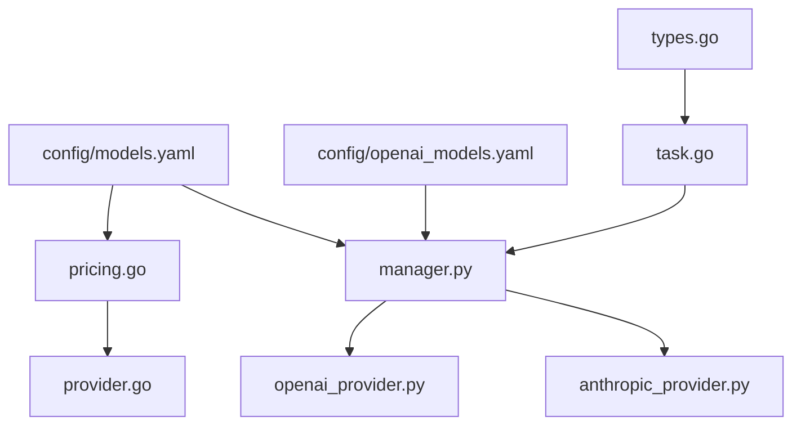

# Model Provider Migration

<cite>
**Referenced Files in This Document**
- [migration-gpt5-claude4.md](file://docs/migration-gpt5-claude4.md)
- [providers-models.md](file://docs/providers-models.md)
- [models.yaml](file://config/models.yaml)
- [openai_models.yaml](file://config/openai_models.yaml)
- [provider.go](file://go/orchestrator/internal/models/provider.go)
- [types.go](file://go/orchestrator/internal/models/types.go)
- [pricing.go](file://go/orchestrator/internal/pricing/pricing.go)
- [manager.py](file://python/llm-service/llm_provider/manager.py)
- [base.py](file://python/llm-service/llm_provider/base.py)
- [openai_provider.py](file://python/llm-service/llm_provider/openai_provider.py)
- [anthropic_provider.py](file://python/llm-service/llm_provider/anthropic_provider.py)
- [task.go](file://go/orchestrator/cmd/gateway/internal/handlers/task.go)
- [008_add_model_provider_to_tasks.sql](file://migrations/postgres/008_add_model_provider_to_tasks.sql)
- [44_model_tiers_e2e_test.sh](file://tests/e2e/44_model_tiers_e2e_test.sh)
- [testing-strategy.md](file://docs/testing-strategy.md)
</cite>

## Table of Contents
1. [Introduction](#introduction)
2. [Project Structure](#project-structure)
3. [Core Components](#core-components)
4. [Architecture Overview](#architecture-overview)
5. [Detailed Component Analysis](#detailed-component-analysis)
6. [Dependency Analysis](#dependency-analysis)
7. [Performance Considerations](#performance-considerations)
8. [Troubleshooting Guide](#troubleshooting-guide)
9. [Conclusion](#conclusion)
10. [Appendices](#appendices)

## Introduction
This document provides comprehensive guidance for migrating model providers within the Shannon platform from legacy models (GPT-3.5, GPT-4, Claude 3) to the new generation (GPT-5, Claude 4.5). It covers breaking changes, configuration updates, cost optimization strategies, provider override precedence, validation procedures, error handling, API parameter restrictions, migration testing, cost estimation validation, and performance impact assessment.

## Project Structure
The migration spans three primary areas:
- Configuration: central model catalog and pricing in YAML
- Runtime: provider selection, parameter handling, and cost tracking
- Gateway: request validation, model tier precedence, and metadata enrichment

**Diagram sources**
- [models.yaml](file://config/models.yaml#L1-L776)
- [openai_models.yaml](file://config/openai_models.yaml#L1-L109)
- [manager.py](file://python/llm-service/llm_provider/manager.py#L1-L800)
- [base.py](file://python/llm-service/llm_provider/base.py#L1-L486)
- [openai_provider.py](file://python/llm-service/llm_provider/openai_provider.py#L1-L800)
- [anthropic_provider.py](file://python/llm-service/llm_provider/anthropic_provider.py#L1-L303)
- [pricing.go](file://go/orchestrator/internal/pricing/pricing.go#L1-L428)
- [provider.go](file://go/orchestrator/internal/models/provider.go#L1-L133)
- [task.go](file://go/orchestrator/cmd/gateway/internal/handlers/task.go#L1-L800)

**Section sources**
- [models.yaml](file://config/models.yaml#L1-L776)
- [openai_models.yaml](file://config/openai_models.yaml#L1-L109)
- [manager.py](file://python/llm-service/llm_provider/manager.py#L1-L800)
- [base.py](file://python/llm-service/llm_provider/base.py#L1-L486)
- [openai_provider.py](file://python/llm-service/llm_provider/openai_provider.py#L1-L800)
- [anthropic_provider.py](file://python/llm-service/llm_provider/anthropic_provider.py#L1-L303)
- [pricing.go](file://go/orchestrator/internal/pricing/pricing.go#L1-L428)
- [provider.go](file://go/orchestrator/internal/models/provider.go#L1-L133)
- [task.go](file://go/orchestrator/cmd/gateway/internal/handlers/task.go#L1-L800)

## Core Components
- Model catalog and pricing: defines canonical model IDs, tiers, capabilities, and pricing per provider
- Provider selection and routing: selects providers and models based on tier, overrides, and availability
- Parameter normalization: adapts API parameters per model family (GPT-5 vs others)
- Metadata enrichment: attaches model_used, provider, and usage to responses and database
- Validation and error handling: enforces provider and model validity, rejects invalid inputs

Key migration impacts:
- Canonical model ID requirement replaces aliases
- GPT-5 parameter restrictions (max_tokens vs max_completion_tokens, sampling defaults)
- Enhanced metadata in API responses and database persistence
- Strict provider override precedence and validation

**Section sources**
- [migration-gpt5-claude4.md](file://docs/migration-gpt5-claude4.md#L1-L401)
- [models.yaml](file://config/models.yaml#L1-L776)
- [manager.py](file://python/llm-service/llm_provider/manager.py#L538-L800)
- [openai_provider.py](file://python/llm-service/llm_provider/openai_provider.py#L122-L173)
- [task.go](file://go/orchestrator/cmd/gateway/internal/handlers/task.go#L178-L195)

## Architecture Overview
The migration introduces stricter model identity and parameter handling across the stack.

**Diagram sources**
- [task.go](file://go/orchestrator/cmd/gateway/internal/handlers/task.go#L178-L195)
- [manager.py](file://python/llm-service/llm_provider/manager.py#L538-L687)
- [openai_provider.py](file://python/llm-service/llm_provider/openai_provider.py#L122-L173)
- [anthropic_provider.py](file://python/llm-service/llm_provider/anthropic_provider.py#L140-L153)
- [008_add_model_provider_to_tasks.sql](file://migrations/postgres/008_add_model_provider_to_tasks.sql#L1-L20)

## Detailed Component Analysis

### Model Catalog and Pricing
- Canonical model IDs replace aliases; tier assignments updated
- Pricing centralized in YAML for consistent cost tracking across services
- Capabilities matrix enables function calling, vision, and reasoning flags

Migration actions:
- Update all references to legacy model names to canonical IDs
- Verify tier assignments align with workload complexity
- Confirm pricing entries exist for all used models

**Section sources**
- [migration-gpt5-claude4.md](file://docs/migration-gpt5-claude4.md#L17-L46)
- [models.yaml](file://config/models.yaml#L16-L129)
- [models.yaml](file://config/models.yaml#L533-L748)

### Provider Override Precedence and Validation
- Precedence: provider_override > provider > llm_provider (legacy)
- Validation: only allowed provider names accepted; invalid names rejected with clear error
- Tier precedence: top-level model_tier > context.model_tier > mode-based default

Validation logic:
- Gateway validates provider_override against allowed list
- Manager enforces provider circuit breaker state and model availability

**Section sources**
- [migration-gpt5-claude4.md](file://docs/migration-gpt5-claude4.md#L207-L231)
- [task.go](file://go/orchestrator/cmd/gateway/internal/handlers/task.go#L178-L195)
- [manager.py](file://python/llm-service/llm_provider/manager.py#L747-L763)

### API Parameter Restrictions for GPT-5
- GPT-5 chat models (excluding gpt-5-pro) require max_completion_tokens and use default sampling parameters
- GPT-4.1 and older models retain support for max_tokens and sampling parameters
- Parameter normalization handled per provider implementation

Provider-specific handling:
- OpenAI provider conditionally includes sampling parameters for non-GPT-5 models
- Anthropic maintains temperature/top_p exclusivity rules

**Section sources**
- [migration-gpt5-claude4.md](file://docs/migration-gpt5-claude4.md#L115-L174)
- [openai_provider.py](file://python/llm-service/llm_provider/openai_provider.py#L122-L173)
- [anthropic_provider.py](file://python/llm-service/llm_provider/anthropic_provider.py#L140-L153)

### Metadata Population and Database Persistence
- API responses include model_used, provider, and usage breakdown
- Database migration adds model_used and provider columns to task_executions
- Gateway enriches responses with persisted metadata

Verification:
- End-to-end tests confirm metadata completeness
- Database queries validate persistence

**Section sources**
- [migration-gpt5-claude4.md](file://docs/migration-gpt5-claude4.md#L178-L204)
- [008_add_model_provider_to_tasks.sql](file://migrations/postgres/008_add_model_provider_to_tasks.sql#L1-L20)
- [task.go](file://go/orchestrator/cmd/gateway/internal/handlers/task.go#L619-L714)
- [44_model_tiers_e2e_test.sh](file://tests/e2e/44_model_tiers_e2e_test.sh#L87-L245)

### Cost Estimation and Budget Controls
- Centralized pricing in YAML drives cost calculations across services
- Default fallback pricing increased; ensure all models are configured
- Cost controls include per-request and daily budget thresholds

Optimization strategies:
- Use tier assignments aligned with workload complexity
- Monitor cost metrics and adjust budgets/alerts
- Leverage prompt caching to reduce token usage

**Section sources**
- [migration-gpt5-claude4.md](file://docs/migration-gpt5-claude4.md#L55-L66)
- [models.yaml](file://config/models.yaml#L123-L129)
- [models.yaml](file://config/models.yaml#L533-L700)
- [pricing.go](file://go/orchestrator/internal/pricing/pricing.go#L168-L250)

### Provider Detection and Catalog Resolution
- Provider detection prioritizes explicit mapping from model catalog
- Pattern-based fallback supports common model naming conventions
- Pricing engine resolves provider for model lookups

**Section sources**
- [provider.go](file://go/orchestrator/internal/models/provider.go#L9-L48)
- [pricing.go](file://go/orchestrator/internal/pricing/pricing.go#L396-L427)

### Class Relationships

**Diagram sources**
- [manager.py](file://python/llm-service/llm_provider/manager.py#L110-L800)
- [base.py](file://python/llm-service/llm_provider/base.py#L154-L486)
- [openai_provider.py](file://python/llm-service/llm_provider/openai_provider.py#L17-L800)
- [anthropic_provider.py](file://python/llm-service/llm_provider/anthropic_provider.py#L22-L303)

## Dependency Analysis

**Diagram sources**
- [models.yaml](file://config/models.yaml#L1-L776)
- [openai_models.yaml](file://config/openai_models.yaml#L1-L109)
- [pricing.go](file://go/orchestrator/internal/pricing/pricing.go#L1-L428)
- [manager.py](file://python/llm-service/llm_provider/manager.py#L1-L800)
- [openai_provider.py](file://python/llm-service/llm_provider/openai_provider.py#L1-L800)
- [anthropic_provider.py](file://python/llm-service/llm_provider/anthropic_provider.py#L1-L303)
- [provider.go](file://go/orchestrator/internal/models/provider.go#L1-L133)
- [types.go](file://go/orchestrator/internal/models/types.go#L1-L123)
- [task.go](file://go/orchestrator/cmd/gateway/internal/handlers/task.go#L1-L800)

**Section sources**
- [models.yaml](file://config/models.yaml#L1-L776)
- [openai_models.yaml](file://config/openai_models.yaml#L1-L109)
- [pricing.go](file://go/orchestrator/internal/pricing/pricing.go#L1-L428)
- [manager.py](file://python/llm-service/llm_provider/manager.py#L1-L800)
- [openai_provider.py](file://python/llm-service/llm_provider/openai_provider.py#L1-L800)
- [anthropic_provider.py](file://python/llm-service/llm_provider/anthropic_provider.py#L1-L303)
- [provider.go](file://go/orchestrator/internal/models/provider.go#L1-L133)
- [types.go](file://go/orchestrator/internal/models/types.go#L1-L123)
- [task.go](file://go/orchestrator/cmd/gateway/internal/handlers/task.go#L1-L800)

## Performance Considerations
- Token usage normalization reduces variability across providers
- Hedged requests and circuit breakers improve resilience
- Prompt caching reduces repeated computation and latency
- Tier-based selection balances cost and performance

Recommendations:
- Enable Redis cache for distributed caching
- Monitor latency histograms and circuit breaker metrics
- Adjust tier preferences based on workload characteristics

[No sources needed since this section provides general guidance]

## Troubleshooting Guide
Common issues and resolutions:
- Invalid provider_override: ensure provider name is in allowed list
- GPT-5 parameter errors: use max_completion_tokens and omit sampling parameters
- Missing metadata: verify database migration and gateway enrichment logic
- Cost always zero: confirm pricing overrides are loaded and alias resolution

Validation steps:
- Run end-to-end tests for all tiers and providers
- Check logs for 400 errors and parameter mismatches
- Verify database columns exist and are populated

**Section sources**
- [task.go](file://go/orchestrator/cmd/gateway/internal/handlers/task.go#L178-L195)
- [openai_provider.py](file://python/llm-service/llm_provider/openai_provider.py#L122-L173)
- [008_add_model_provider_to_tasks.sql](file://migrations/postgres/008_add_model_provider_to_tasks.sql#L1-L20)
- [44_model_tiers_e2e_test.sh](file://tests/e2e/44_model_tiers_e2e_test.sh#L87-L245)
- [testing-strategy.md](file://docs/testing-strategy.md#L421-L475)

## Conclusion
The migration to GPT-5 and Claude 4.5 requires updating model references to canonical IDs, adjusting API parameters for GPT-5, enforcing provider override validation, and leveraging enhanced metadata for cost tracking. By following the configuration updates, validation procedures, and testing strategies outlined here, teams can achieve predictable cost optimization, robust error handling, and reliable performance across the platform.

[No sources needed since this section summarizes without analyzing specific files]

## Appendices

### Migration Checklist
- Update model references to canonical IDs
- Configure pricing for all used models
- Validate provider_override values
- Test GPT-5 parameter handling
- Verify metadata and database persistence
- Run end-to-end tests for all tiers
- Monitor cost and performance metrics

**Section sources**
- [migration-gpt5-claude4.md](file://docs/migration-gpt5-claude4.md#L318-L347)
- [testing-strategy.md](file://docs/testing-strategy.md#L186-L223)