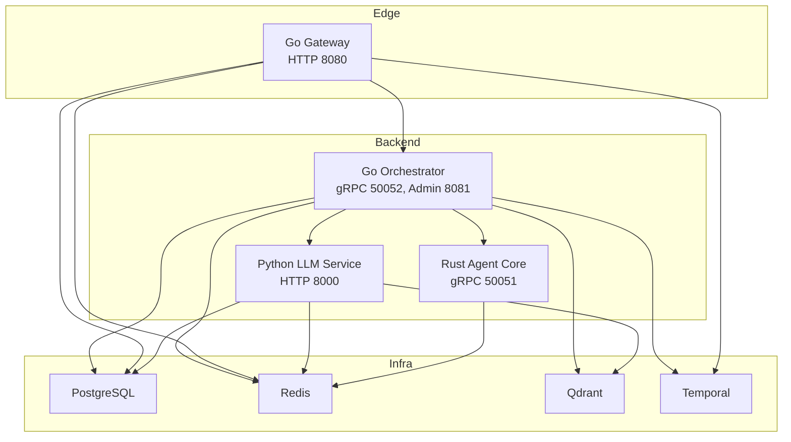
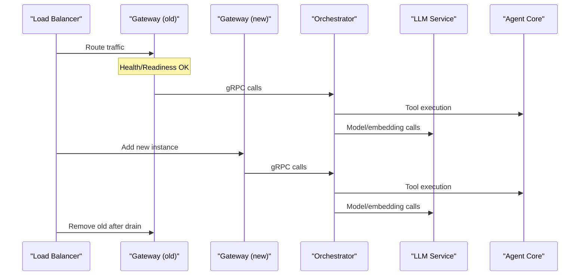
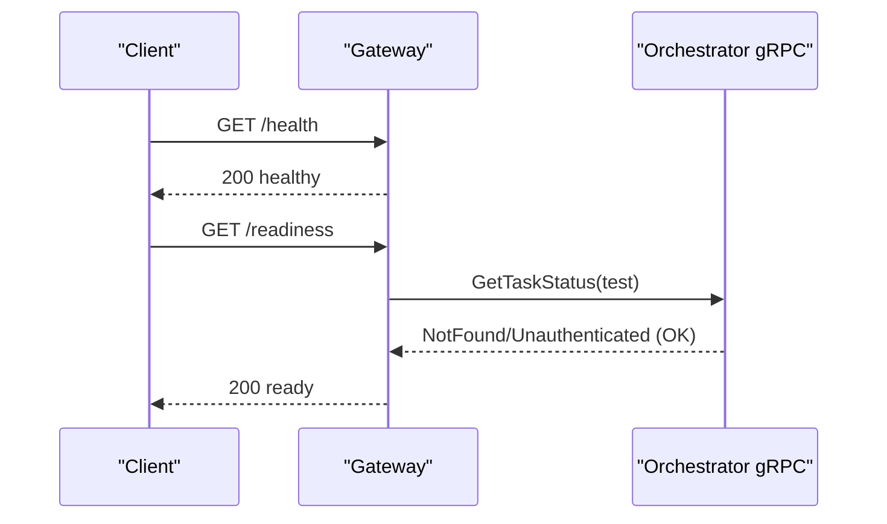
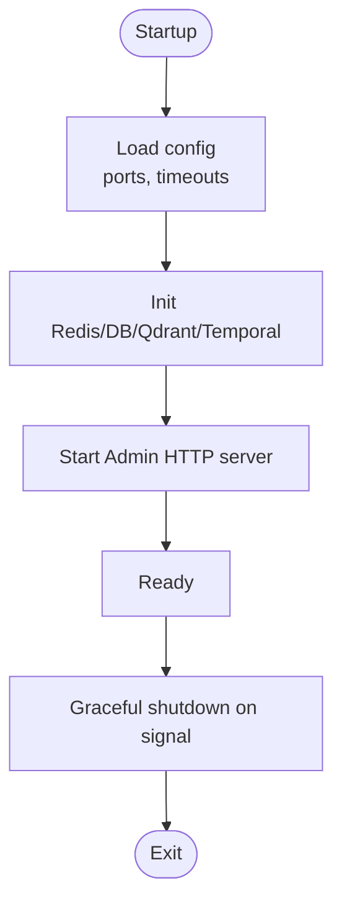
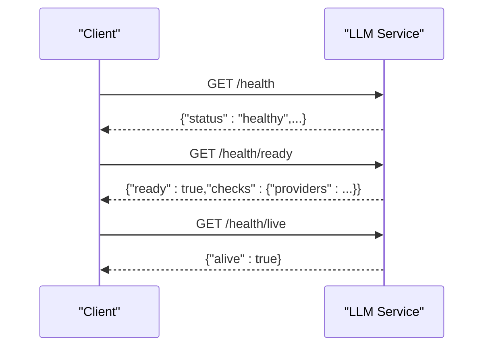
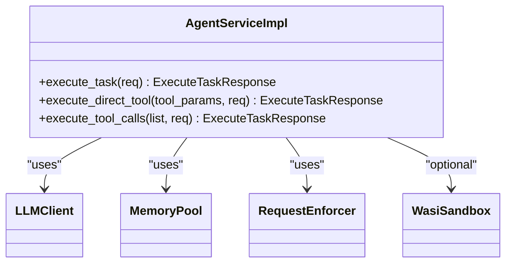
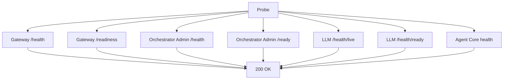

# Service Upgrade Procedures

<cite>
**Referenced Files in This Document**
- [go.mod](file://go/orchestrator/go.mod)
- [Dockerfile (Go gateway)](file://go/orchestrator/cmd/gateway/Dockerfile)
- [Dockerfile (Go orchestrator)](file://go/orchestrator/Dockerfile)
- [main.go (Go gateway)](file://go/orchestrator/cmd/gateway/main.go)
- [health.go (Go gateway handlers)](file://go/orchestrator/cmd/gateway/internal/handlers/health.go)
- [docker-compose.yml](file://deploy/compose/docker-compose.yml)
- [.env.example](file://.env.example)
- [requirements.txt (Python LLM service)](file://python/llm-service/requirements.txt)
- [main.py (Python LLM service)](file://python/llm-service/main.py)
- [health.py (Python LLM service API)](file://python/llm-service/llm_service/api/health.py)
- [Cargo.toml (Rust agent-core)](file://rust/agent-core/Cargo.toml)
- [Dockerfile (Rust agent-core)](file://rust/agent-core/Dockerfile)
- [main.rs (Rust agent-core)](file://rust/agent-core/src/main.rs)
- [grpc_server.rs (Rust agent-core)](file://rust/agent-core/src/grpc_server.rs)
- [install.sh](file://scripts/install.sh)
- [shannon.yaml](file://config/shannon.yaml)
</cite>

## Table of Contents
1. [Introduction](#introduction)
2. [Project Structure](#project-structure)
3. [Core Components](#core-components)
4. [Architecture Overview](#architecture-overview)
5. [Detailed Component Analysis](#detailed-component-analysis)
6. [Dependency Management](#dependency-management)
7. [Zero-Downtime Deployment Strategies](#zero-downtime-deployment-strategies)
8. [Health Checks, Readiness, and Graceful Shutdown](#health-checks-readiness-and-graceful-shutdown)
9. [Configuration Migration](#configuration-migration)
10. [Automated Upgrade Scripts and Rollback](#automated-upgrade-scripts-and-rollback)
11. [Upgrade Validation and Monitoring](#upgrade-validation-and-monitoring)
12. [Troubleshooting Guide](#troubleshooting-guide)
13. [Conclusion](#conclusion)

## Introduction
This document defines comprehensive upgrade procedures for the Go, Python, and Rust services in the Shannon platform. It covers dependency management, zero-downtime strategies (blue-green and rolling updates), health checks and readiness, graceful shutdown, configuration migration, automated upgrade scripts, rollback procedures, and validation/testing with monitoring.

## Project Structure
The platform comprises three primary services:
- Go gateway: HTTP entrypoint with auth, rate limiting, and OpenAI-compatible endpoints.
- Go orchestrator: gRPC backend implementing workflows, sessions, approvals, scheduling, and administrative APIs.
- Python LLM service: FastAPI service exposing completions, embeddings, tools, and health/readiness/liveness endpoints.
- Rust agent-core: gRPC service for tool execution, WASI sandboxing, enforcement, and metrics.

These services are orchestrated via Docker Compose with shared dependencies (PostgreSQL, Redis, Qdrant, Temporal).

**Diagram sources**
- [docker-compose.yml](file://deploy/compose/docker-compose.yml#L14-L411)
- [main.go (Go gateway)](file://go/orchestrator/cmd/gateway/main.go#L605-L639)
- [main.py (Python LLM service)](file://python/llm-service/main.py#L116-L164)
- [main.rs (Rust agent-core)](file://rust/agent-core/src/main.rs#L31-L48)

**Section sources**
- [docker-compose.yml](file://deploy/compose/docker-compose.yml#L14-L411)

## Core Components
- Go gateway: HTTP server with health/readiness endpoints, CORS, auth middleware, rate limiting, and SSE/WS proxy to admin.
- Go orchestrator: gRPC server with admin HTTP endpoints, health checks against dependencies, and graceful shutdown.
- Python LLM service: FastAPI app with OTel tracing, Prometheus metrics, and health/readiness/liveness endpoints.
- Rust agent-core: gRPC server with metrics server, reflection, enforcement, and tool execution.

**Section sources**
- [main.go (Go gateway)](file://go/orchestrator/cmd/gateway/main.go#L135-L639)
- [health.go (Go gateway handlers)](file://go/orchestrator/cmd/gateway/internal/handlers/health.go#L37-L108)
- [main.py (Python LLM service)](file://python/llm-service/main.py#L71-L164)
- [health.py (Python LLM service API)](file://python/llm-service/llm_service/api/health.py#L7-L43)
- [main.rs (Rust agent-core)](file://rust/agent-core/src/main.rs#L10-L51)

## Architecture Overview
The upgrade process must preserve availability by ensuring:
- Rolling or blue-green deployments with health/readiness gating.
- Proper dependency readiness (PostgreSQL, Redis, Qdrant, Temporal).
- Graceful shutdown with timeouts to drain connections.
- Observability via health endpoints, metrics, and logs.

**Diagram sources**
- [docker-compose.yml](file://deploy/compose/docker-compose.yml#L369-L407)
- [main.go (Go gateway)](file://go/orchestrator/cmd/gateway/main.go#L623-L639)
- [main.py (Python LLM service)](file://python/llm-service/main.py#L160-L164)
- [main.rs (Rust agent-core)](file://rust/agent-core/src/main.rs#L31-L48)

## Detailed Component Analysis

### Go Gateway Upgrade
- Health and readiness: /health and /readiness endpoints; readiness validates orchestrator connectivity.
- Graceful shutdown: listens for SIGINT/SIGTERM, starts server in goroutine, then shuts down with timeout.
- Environment variables: PORT, ORCHESTRATOR_GRPC, ADMIN_SERVER, JWT_SECRET, GATEWAY_SKIP_AUTH, REDIS_URL, Postgres credentials.

**Diagram sources**
- [health.go (Go gateway handlers)](file://go/orchestrator/cmd/gateway/internal/handlers/health.go#L37-L108)
- [main.go (Go gateway)](file://go/orchestrator/cmd/gateway/main.go#L135-L140)

**Section sources**
- [main.go (Go gateway)](file://go/orchestrator/cmd/gateway/main.go#L135-L140)
- [health.go (Go gateway handlers)](file://go/orchestrator/cmd/gateway/internal/handlers/health.go#L37-L108)

### Go Orchestrator Upgrade
- Admin HTTP endpoints: health/readiness exposed on configured port.
- Health checks probe Redis, database, agent-core, and llm-service.
- Graceful shutdown with configurable timeout.

**Diagram sources**
- [docker-compose.yml](file://deploy/compose/docker-compose.yml#L139-L226)
- [shannon.yaml](file://config/shannon.yaml#L214-L240)

**Section sources**
- [docker-compose.yml](file://deploy/compose/docker-compose.yml#L139-L226)
- [shannon.yaml](file://config/shannon.yaml#L214-L240)

### Python LLM Service Upgrade
- Health endpoints: /health/, /health/ready, /health/live.
- OTel tracing and Prometheus metrics mount.
- Environment variables: REDIS_* and POSTGRES_* for caches and persistence; model routing and budgets; OpenAPI/MCP hardening; events ingestion; browser service URL.

**Diagram sources**
- [health.py (Python LLM service API)](file://python/llm-service/llm_service/api/health.py#L7-L43)
- [main.py (Python LLM service)](file://python/llm-service/main.py#L137-L151)

**Section sources**
- [main.py (Python LLM service)](file://python/llm-service/main.py#L71-L164)
- [health.py (Python LLM service API)](file://python/llm-service/llm_service/api/health.py#L7-L43)

### Rust Agent Core Upgrade
- gRPC server with reflection and metrics server on configured port.
- Tool execution supports direct LLM tools and batch tool calls with optional parallelism.
- Enforcement and WASI sandboxing guarded by feature flags.

**Diagram sources**
- [grpc_server.rs (Rust agent-core)](file://rust/agent-core/src/grpc_server.rs#L37-L83)

**Section sources**
- [main.rs (Rust agent-core)](file://rust/agent-core/src/main.rs#L10-L51)
- [grpc_server.rs (Rust agent-core)](file://rust/agent-core/src/grpc_server.rs#L37-L83)

## Dependency Management
- Go modules: managed via go.mod with explicit versions for core libraries, gRPC, Temporal, OpenTelemetry, Prometheus, Redis, and others.
- Python packages: pinned in requirements.txt for FastAPI, uvicorn, gRPC, OpenAI/Anthropic clients, Redis, asyncpg, SQLAlchemy, Prometheus, OpenTelemetry, and testing.
- Rust crates: defined in Cargo.toml with Tokio, Tonic, Prost, tracing, opentelemetry, Prometheus, Redis, WASM runtimes gated by features.

Recommendations:
- Pin versions in requirements.txt and go.mod; avoid floating constraints.
- Use lock files (e.g., Cargo.lock) to ensure reproducible builds.
- Periodically audit dependencies and update patch/minor versions; test upgrades in staging.

**Section sources**
- [go.mod](file://go/orchestrator/go.mod#L1-L99)
- [requirements.txt (Python LLM service)](file://python/llm-service/requirements.txt#L1-L62)
- [Cargo.toml (Rust agent-core)](file://rust/agent-core/Cargo.toml#L1-L90)

## Zero-Downtime Deployment Strategies
- Blue-Green Deployment:
  - Run two identical environments (green and blue).
  - Switch traffic after validating readiness on the new environment.
  - Roll back by switching back if health/readiness fails.
- Rolling Updates:
  - Replace instances gradually while maintaining minimum replicas.
  - Use PodDisruptionBudgets and readiness gates to prevent serving unhealthy pods.
- Canary Releases:
  - Route a small percentage of traffic to the new version; scale up on success.

Operational notes:
- Ensure health/readiness endpoints are functional before switching traffic.
- Verify dependency readiness (PostgreSQL, Redis, Qdrant, Temporal) in Compose.
- Use rolling updates with proper termination signals for graceful shutdown.

[No sources needed since this section provides general guidance]

## Health Checks, Readiness, and Graceful Shutdown
- Go Gateway:
  - /health returns basic service status.
  - /readiness probes orchestrator via gRPC; returns 503 if orchestrator is unreachable.
  - Graceful shutdown on SIGINT/SIGTERM with 10s timeout.
- Go Orchestrator:
  - Admin HTTP exposes health/readiness; checks Redis, database, agent-core, and llm-service.
- Python LLM Service:
  - /health, /health/ready, /health/live endpoints; readiness validates providers and models.
- Rust Agent Core:
  - gRPC server with metrics endpoint; health via dependency checks and readiness in orchestrator.

**Diagram sources**
- [health.go (Go gateway handlers)](file://go/orchestrator/cmd/gateway/internal/handlers/health.go#L37-L108)
- [main.go (Go gateway)](file://go/orchestrator/cmd/gateway/main.go#L135-L140)
- [health.py (Python LLM service API)](file://python/llm-service/llm_service/api/health.py#L7-L43)
- [docker-compose.yml](file://deploy/compose/docker-compose.yml#L139-L226)

**Section sources**
- [main.go (Go gateway)](file://go/orchestrator/cmd/gateway/main.go#L623-L639)
- [health.go (Go gateway handlers)](file://go/orchestrator/cmd/gateway/internal/handlers/health.go#L54-L108)
- [health.py (Python LLM service API)](file://python/llm-service/llm_service/api/health.py#L17-L36)

## Configuration Migration
- Environment variables:
  - Go gateway: PORT, ORCHESTRATOR_GRPC, ADMIN_SERVER, JWT_SECRET, GATEWAY_SKIP_AUTH, REDIS_URL, Postgres credentials.
  - Go orchestrator: TEMPORAL_HOST, Postgres credentials, CONFIG_PATH, MODELS_CONFIG_PATH, METRICS_PORT, timeouts, budgets, provider controls, worker concurrency, approvals, events ingestion, templates.
  - Python LLM service: REDIS_* and POSTGRES_* variables, service name, model routing/budgets, cache and rate limits, web search providers, OpenAPI/MCP hardening, events ingestion, browser service URL.
  - Rust agent-core: CONFIG_PATH, METRICS_PORT, TOOL_PARALLELISM, ENFORCE_* variables, LLM_SERVICE_URL, LLM_TIMEOUT_SECONDS, WASI settings.
- Configuration files:
  - shannon.yaml governs orchestrator behavior, health checks, policy, vector/search, logging, streaming, workflows, and features.
- Migration steps:
  - Validate new environment variables in .env and Compose before upgrade.
  - Apply configuration changes gradually; monitor health/readiness.
  - Keep backward compatibility where possible; document breaking changes.

**Section sources**
- [.env.example](file://.env.example)
- [docker-compose.yml](file://deploy/compose/docker-compose.yml#L144-L320)
- [shannon.yaml](file://config/shannon.yaml#L4-L378)

## Automated Upgrade Scripts and Rollback
- Installation script:
  - Downloads release Compose, Grafana configs, example .env, configs, WASM interpreter, and migrations; pulls images and starts services.
- Rollback procedure:
  - Stop new containers, redeploy previous images, re-apply last-known good configuration, and re-validate health/readiness.
- Emergency response:
  - Disable problematic features via environment variables or config toggles.
  - Use kill switches (policy or feature flags) to mitigate regressions.

**Section sources**
- [install.sh](file://scripts/install.sh#L1-L168)

## Upgrade Validation and Monitoring
- Pre-upgrade:
  - Smoke tests for gateway, orchestrator admin, LLM service, and agent core.
  - Regression tests for memory, streaming, and tool execution.
- During upgrade:
  - Monitor health endpoints, metrics, and logs.
  - Use Grafana dashboards and Prometheus alerts.
- Post-upgrade:
  - Validate end-to-end flows, latency, error rates, and throughput.
  - Confirm observability (OTel spans, Prometheus metrics) remains intact.

[No sources needed since this section provides general guidance]

## Troubleshooting Guide
- Gateway readiness failures:
  - Verify orchestrator connectivity and that /readiness returns 200.
  - Check orchestrator admin health and dependency readiness.
- LLM service readiness failures:
  - Ensure providers/models are initialized; in dev mode, readiness may tolerate missing providers.
- Agent core health:
  - Confirm gRPC server is listening and metrics endpoint reachable.
- Graceful shutdown:
  - Ensure SIGINT/SIGTERM propagation and 10s shutdown window are respected.

**Section sources**
- [health.go (Go gateway handlers)](file://go/orchestrator/cmd/gateway/internal/handlers/health.go#L54-L108)
- [main.py (Python LLM service)](file://python/llm-service/main.py#L71-L114)
- [main.rs (Rust agent-core)](file://rust/agent-core/src/main.rs#L24-L29)

## Conclusion
Upgrades across Go, Python, and Rust services should be executed with careful attention to health checks, readiness, graceful shutdown, and configuration migration. Adopt blue-green or rolling updates, validate with smoke/regression tests, and maintain robust observability to ensure zero-downtime deployments and rapid rollbacks when needed.