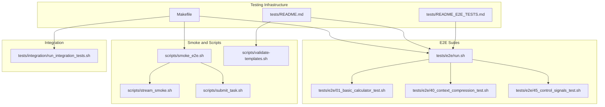
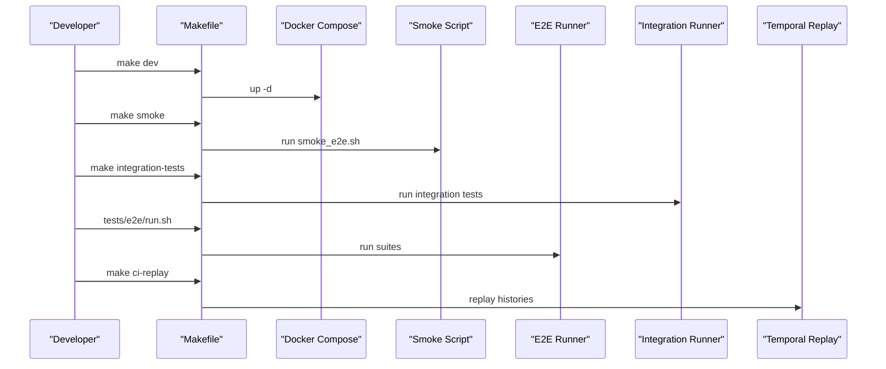
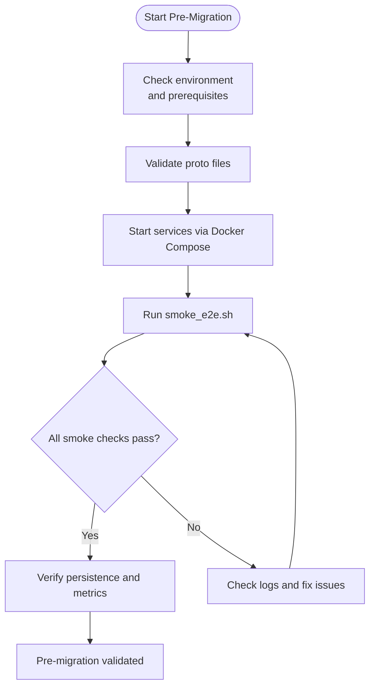
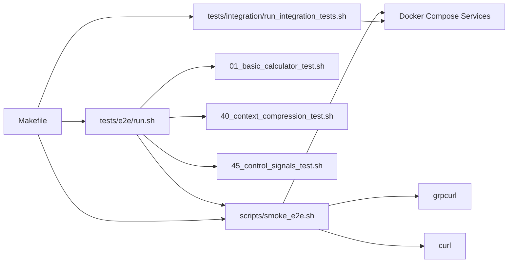

# Testing and Validation Procedures

<cite>
**Referenced Files in This Document**
- [docs/testing.md](file://docs/testing.md)
- [docs/testing-strategy.md](file://docs/testing-strategy.md)
- [tests/README.md](file://tests/README.md)
- [tests/README_E2E_TESTS.md](file://tests/README_E2E_TESTS.md)
- [tests/e2e/run.sh](file://tests/e2e/run.sh)
- [tests/e2e/01_basic_calculator_test.sh](file://tests/e2e/01_basic_calculator_test.sh)
- [tests/e2e/40_context_compression_test.sh](file://tests/e2e/40_context_compression_test.sh)
- [tests/e2e/45_control_signals_test.sh](file://tests/e2e/45_control_signals_test.sh)
- [tests/integration/run_integration_tests.sh](file://tests/integration/run_integration_tests.sh)
- [scripts/smoke_e2e.sh](file://scripts/smoke_e2e.sh)
- [scripts/stream_smoke.sh](file://scripts/stream_smoke.sh)
- [scripts/submit_task.sh](file://scripts/submit_task.sh)
- [scripts/validate-templates.sh](file://scripts/validate-templates.sh)
- [Makefile](file://Makefile)
</cite>

## Table of Contents
1. [Introduction](#introduction)
2. [Project Structure](#project-structure)
3. [Core Components](#core-components)
4. [Architecture Overview](#architecture-overview)
5. [Detailed Component Analysis](#detailed-component-analysis)
6. [Dependency Analysis](#dependency-analysis)
7. [Performance Considerations](#performance-considerations)
8. [Troubleshooting Guide](#troubleshooting-guide)
9. [Conclusion](#conclusion)
10. [Appendices](#appendices)

## Introduction
This document defines comprehensive testing and validation procedures for the Shannon platform, covering pre-migration validation, automated testing strategies (unit, integration, end-to-end), validation checklists, regression testing, performance validation, and monitoring during migration phases. It consolidates repository-provided guidance and test scripts to support reproducible, reliable validation across environments.

## Project Structure
The testing ecosystem is organized around:
- Unit tests co-located with source code (Go, Rust, Python)
- Integration tests validating cross-service flows
- End-to-end (E2E) tests exercising full workflows and persistence
- Deterministic replay tests for Temporal workflows
- Scripts for smoke checks, streaming validation, template validation, and task submission
- Makefile targets orchestrating builds, tests, coverage, and CI-friendly workflows

**Diagram sources**
- [Makefile](file://Makefile#L125-L131)
- [tests/README.md](file://tests/README.md#L22-L61)
- [tests/README_E2E_TESTS.md](file://tests/README_E2E_TESTS.md#L1-L300)
- [scripts/smoke_e2e.sh](file://scripts/smoke_e2e.sh#L1-L141)
- [scripts/stream_smoke.sh](file://scripts/stream_smoke.sh#L1-L39)
- [scripts/submit_task.sh](file://scripts/submit_task.sh#L1-L62)
- [scripts/validate-templates.sh](file://scripts/validate-templates.sh#L1-L126)
- [tests/e2e/run.sh](file://tests/e2e/run.sh#L1-L195)
- [tests/e2e/01_basic_calculator_test.sh](file://tests/e2e/01_basic_calculator_test.sh#L1-L127)
- [tests/e2e/40_context_compression_test.sh](file://tests/e2e/40_context_compression_test.sh#L1-L149)
- [tests/e2e/45_control_signals_test.sh](file://tests/e2e/45_control_signals_test.sh#L1-L435)
- [tests/integration/run_integration_tests.sh](file://tests/integration/run_integration_tests.sh#L1-L158)

**Section sources**
- [docs/testing.md](file://docs/testing.md#L1-L233)
- [tests/README.md](file://tests/README.md#L1-L109)
- [tests/README_E2E_TESTS.md](file://tests/README_E2E_TESTS.md#L1-L300)

## Core Components
- Unit tests: Go (co-located *_test.go), Rust (inline cfg(test)), Python (tests/)
- Integration tests: In-memory Temporal workflows, session memory, Qdrant vector ops
- E2E tests: Multi-service scenarios, streaming, control signals, context compression
- Deterministic replay: Export and replay Temporal histories for compatibility
- Coverage: Go and Python thresholds; informational Rust coverage
- CI: GitHub Actions jobs for linting, tests, and replay validation

**Section sources**
- [docs/testing.md](file://docs/testing.md#L5-L122)
- [docs/testing-strategy.md](file://docs/testing-strategy.md#L1-L577)
- [tests/README.md](file://tests/README.md#L1-L109)

## Architecture Overview
The testing architecture integrates Docker Compose-managed services with targeted validation scripts and suites. Smoke tests validate health, persistence, and metrics; E2E suites exercise workflows and streaming; integration tests validate cross-service behavior; and replay tests ensure backward compatibility.

**Diagram sources**
- [Makefile](file://Makefile#L44-L67)
- [Makefile](file://Makefile#L125-L131)
- [Makefile](file://Makefile#L230-L247)
- [Makefile](file://Makefile#L174-L179)
- [tests/e2e/run.sh](file://tests/e2e/run.sh#L1-L195)
- [tests/integration/run_integration_tests.sh](file://tests/integration/run_integration_tests.sh#L1-L158)
- [scripts/smoke_e2e.sh](file://scripts/smoke_e2e.sh#L1-L141)

## Detailed Component Analysis

### Pre-Migration Testing and Validation
- Environment setup and prerequisites:
  - Ensure services are healthy and ports are free
  - Validate proto generation and environment symlinks
  - Seed test API key if needed for auth-disabled development
- Smoke validation checklist:
  - Temporal UI reachable
  - Agent-Core gRPC health and ExecuteTask
  - Orchestrator gRPC availability and SubmitTask
  - Task reaches terminal status and persists
  - Metrics endpoints reachable
  - LLM service health and readiness
  - MCP tool registration and execution
  - Qdrant readiness and required collections
  - PostgreSQL connectivity

**Diagram sources**
- [Makefile](file://Makefile#L12-L31)
- [Makefile](file://Makefile#L44-L67)
- [Makefile](file://Makefile#L138-L143)
- [scripts/smoke_e2e.sh](file://scripts/smoke_e2e.sh#L1-L141)

**Section sources**
- [docs/testing.md](file://docs/testing.md#L65-L94)
- [docs/testing.md](file://docs/testing.md#L163-L210)
- [Makefile](file://Makefile#L12-L31)
- [Makefile](file://Makefile#L44-L67)
- [Makefile](file://Makefile#L138-L143)
- [scripts/smoke_e2e.sh](file://scripts/smoke_e2e.sh#L1-L141)

### Automated Testing Strategies

#### Unit Tests
- Go: run with race detection
- Rust: inline tests with captured output
- Python: pytest with coverage
- WASI sandbox example included

**Section sources**
- [docs/testing.md](file://docs/testing.md#L35-L50)

#### Integration Tests
- Single agent flow, session memory persistence, Qdrant vector operations
- Pre-flight checks for required services and readiness endpoints
- Executable runners and pass/fail reporting

**Section sources**
- [tests/integration/run_integration_tests.sh](file://tests/integration/run_integration_tests.sh#L1-L158)
- [tests/README.md](file://tests/README.md#L48-L57)

#### End-to-End (E2E) Tests
- Master runner aggregates suites and reports results
- Calculator, supervisor workflow, cognitive patterns, session memory, P2P coordination, OpenAPI integration
- Metrics and database statistics checks
- Cleanup of stuck workflows

**Section sources**
- [tests/e2e/run.sh](file://tests/e2e/run.sh#L1-L195)
- [tests/README_E2E_TESTS.md](file://tests/README_E2E_TESTS.md#L1-L300)

#### Deterministic Replay (Temporal)
- Export workflow histories and replay against current code
- CI automation to replay all histories

**Section sources**
- [tests/README.md](file://tests/README.md#L62-L109)
- [Makefile](file://Makefile#L146-L180)

### Validation Procedures and Checklists

#### Provider and Model Validation (Post-Model Update)
- Tier-based selection (small, medium, large) for OpenAI and Anthropic
- Parameter validation (max_tokens vs max_completion_tokens)
- Metadata completeness (model_used, provider, usage, cost)
- Streaming response validation (future enhancement)
- Cost estimation accuracy and alias resolution

**Section sources**
- [docs/testing-strategy.md](file://docs/testing-strategy.md#L46-L224)
- [docs/testing-strategy.md](file://docs/testing-strategy.md#L226-L377)
- [docs/testing-strategy.md](file://docs/testing-strategy.md#L380-L418)
- [docs/testing-strategy.md](file://docs/testing-strategy.md#L477-L514)

#### Template Validation
- Validate YAML syntax and required fields (name/version)
- Detect duplicates by name@version
- Optional directory and tool availability fallbacks

**Section sources**
- [scripts/validate-templates.sh](file://scripts/validate-templates.sh#L1-L126)

#### Control Signals Validation
- Pause/resume/cancel via gRPC and HTTP APIs
- DB status synchronization and Temporal control state queries
- HTTP endpoints coverage and cleanup

**Section sources**
- [tests/e2e/45_control_signals_test.sh](file://tests/e2e/45_control_signals_test.sh#L1-L435)

#### Context Compression Validation
- Build histories, trigger compression with low budgets, verify continuity
- Monitor compression metrics and SSE events
- Configurable primers/recents parameters

**Section sources**
- [tests/e2e/40_context_compression_test.sh](file://tests/e2e/40_context_compression_test.sh#L1-L149)

#### Calculator Tool Validation
- Simple arithmetic handled by LLM; complex expressions should suggest calculator tool
- Tool registration and execution verification

**Section sources**
- [tests/e2e/01_basic_calculator_test.sh](file://tests/e2e/01_basic_calculator_test.sh#L1-L127)

### Regression Testing Procedures
- Deterministic replay of historical workflows to prevent behavioral regressions
- CI job to replay all histories on every build
- Pre-merge requirements: smoke tests passing, no 400 errors, cost estimation non-zero, both providers verified

**Section sources**
- [tests/README.md](file://tests/README.md#L62-L109)
- [docs/testing-strategy.md](file://docs/testing-strategy.md#L380-L418)

### Performance Validation Requirements
- Load testing with concurrent requests and metric monitoring
- Metrics endpoints for orchestrator and agent-core
- Database statistics for task throughput and status distribution

**Section sources**
- [docs/testing.md](file://docs/testing.md#L212-L223)
- [tests/e2e/run.sh](file://tests/e2e/run.sh#L112-L139)

### Monitoring Validation During Migration Testing Phases
- Metrics scraping and trending during smoke and E2E runs
- Database statistics for recent tasks and session continuity
- Log inspection for errors and readiness

**Section sources**
- [tests/e2e/run.sh](file://tests/e2e/run.sh#L112-L139)
- [docs/testing.md](file://docs/testing.md#L190-L210)

## Dependency Analysis
Testing components depend on:
- Docker Compose services (Temporal, PostgreSQL, Redis, Qdrant, Orchestrator, Agent Core, LLM Service)
- Protobuf-generated gRPC clients and reflection
- grpcurl and curl for API and health checks
- jq for JSON parsing in scripts

**Diagram sources**
- [scripts/smoke_e2e.sh](file://scripts/smoke_e2e.sh#L1-L141)
- [tests/e2e/run.sh](file://tests/e2e/run.sh#L1-L195)
- [tests/e2e/01_basic_calculator_test.sh](file://tests/e2e/01_basic_calculator_test.sh#L1-L127)
- [tests/e2e/40_context_compression_test.sh](file://tests/e2e/40_context_compression_test.sh#L1-L149)
- [tests/e2e/45_control_signals_test.sh](file://tests/e2e/45_control_signals_test.sh#L1-L435)
- [tests/integration/run_integration_tests.sh](file://tests/integration/run_integration_tests.sh#L1-L158)
- [Makefile](file://Makefile#L125-L131)

**Section sources**
- [tests/README.md](file://tests/README.md#L13-L21)
- [tests/README_E2E_TESTS.md](file://tests/README_E2E_TESTS.md#L37-L65)

## Performance Considerations
- Concurrent load testing with task submission scripts
- Monitor orchestrator and agent-core metrics during load
- Use database statistics to track throughput and status distribution
- Adjust timeouts and budgets for long-running workflows

**Section sources**
- [docs/testing.md](file://docs/testing.md#L212-L223)
- [tests/e2e/run.sh](file://tests/e2e/run.sh#L112-L139)

## Troubleshooting Guide
Common issues and remedies:
- Orchestrator cannot connect to Temporal: verify host/port and worker logs
- PostgreSQL migration failures: down volumes and re-up stack
- LLM service not ready: provider keys optional in dev mode
- Port conflicts: ensure required ports are free
- Debugging: logs, database state, Redis sessions, Temporal workflow listing

**Section sources**
- [docs/testing.md](file://docs/testing.md#L163-L210)

## Conclusion
The Shannon testing framework provides a robust, multi-layered validation pipeline spanning unit, integration, and E2E tests, complemented by deterministic replay and performance monitoring. The included scripts and Makefile targets enable repeatable pre-migration, validation, and post-migration verification across environments.

## Appendices

### Test Environment Setup
- One-stop setup: generate protos, configure environment, and start services
- Seed test API key for development
- Validate proto files before running tests

**Section sources**
- [Makefile](file://Makefile#L21-L31)
- [Makefile](file://Makefile#L138-L143)
- [Makefile](file://Makefile#L49-L58)

### Test Data Management
- Use environment variables to customize base URLs and gateway endpoints
- Leverage session IDs for persistent memory continuity
- Validate UTF-8 handling and streaming completion

**Section sources**
- [tests/README_E2E_TESTS.md](file://tests/README_E2E_TESTS.md#L78-L91)
- [tests/e2e/40_context_compression_test.sh](file://tests/e2e/40_context_compression_test.sh#L14-L20)

### Test Result Interpretation
- E2E suite summary with pass/fail counts
- Integration suite coverage and pass/fail assessment
- Smoke checks for health, persistence, and metrics

**Section sources**
- [tests/README_E2E_TESTS.md](file://tests/README_E2E_TESTS.md#L109-L124)
- [tests/integration/run_integration_tests.sh](file://tests/integration/run_integration_tests.sh#L114-L158)
- [scripts/smoke_e2e.sh](file://scripts/smoke_e2e.sh#L1-L141)

### Migration Validation Scripts
- Template validation: validate YAML and detect duplicates
- Streaming smoke: SSE and gRPC stream validation
- Task submission: unified CLI for task submission and status polling

**Section sources**
- [scripts/validate-templates.sh](file://scripts/validate-templates.sh#L1-L126)
- [scripts/stream_smoke.sh](file://scripts/stream_smoke.sh#L1-L39)
- [scripts/submit_task.sh](file://scripts/submit_task.sh#L1-L62)