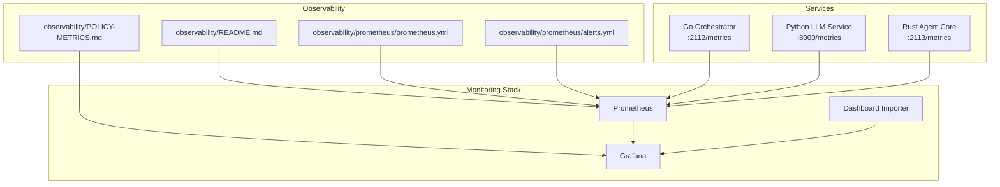
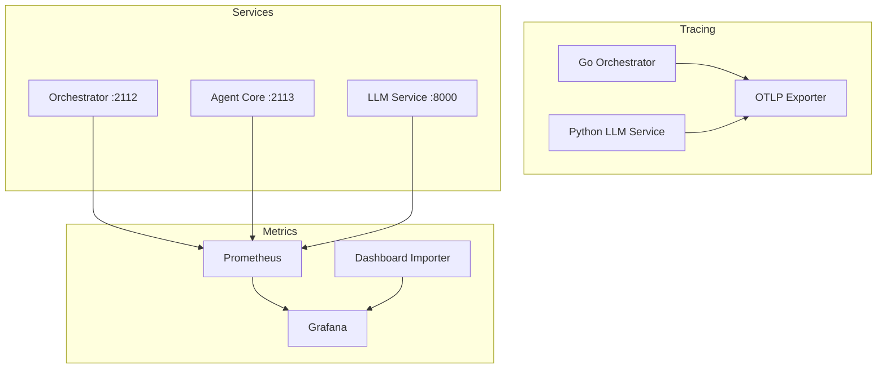
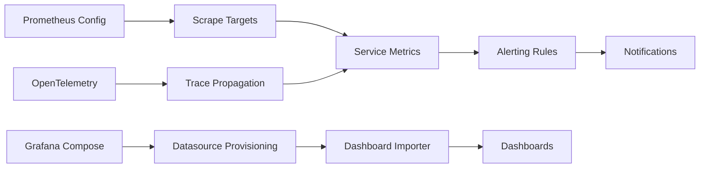

# Benchmarking and Monitoring

<cite>
**Referenced Files in This Document**
- [observability/README.md](file://observability/README.md)
- [observability/POLICY-METRICS.md](file://observability/POLICY-METRICS.md)
- [deploy/compose/grafana/docker-compose-grafana-prometheus.yml](file://deploy/compose/grafana/docker-compose-grafana-prometheus.yml)
- [observability/prometheus/prometheus.yml](file://observability/prometheus/prometheus.yml)
- [observability/prometheus/alerts.yml](file://observability/prometheus/alerts.yml)
- [go/orchestrator/internal/metrics/metrics.go](file://go/orchestrator/internal/metrics/metrics.go)
- [go/orchestrator/internal/activities/metrics.go](file://go/orchestrator/internal/activities/metrics.go)
- [go/orchestrator/internal/activities/memory_bench_test.go](file://go/orchestrator/internal/activities/memory_bench_test.go)
- [go/orchestrator/internal/policy/engine_bench_test.go](file://go/orchestrator/internal/policy/engine_bench_test.go)
- [python/llm-service/llm_service/metrics.py](file://python/llm-service/llm_service/metrics.py)
- [rust/agent-core/src/metrics.rs](file://rust/agent-core/src/metrics.rs)
</cite>

## Table of Contents
1. [Introduction](#introduction)
2. [Project Structure](#project-structure)
3. [Core Components](#core-components)
4. [Architecture Overview](#architecture-overview)
5. [Detailed Component Analysis](#detailed-component-analysis)
6. [Dependency Analysis](#dependency-analysis)
7. [Performance Considerations](#performance-considerations)
8. [Troubleshooting Guide](#troubleshooting-guide)
9. [Conclusion](#conclusion)
10. [Appendices](#appendices)

## Introduction
This document provides comprehensive benchmarking and monitoring guidance for the Shannon platform. It covers:
- Benchmarking methodologies: load testing strategies, performance regression detection, and capacity planning metrics
- Monitoring setup with Prometheus, Grafana, and OpenTelemetry: key performance indicators, alerting thresholds, and dashboard configuration
- Performance profiling techniques for Go services, Rust components, and Python tools
- Practical examples: performance testing scenarios, A/B testing for optimization changes, and continuous performance monitoring
- Metrics collection for workflows, agent performance, and system resources
- Troubleshooting workflows, bottleneck identification, and optimization validation techniques

## Project Structure
The monitoring and benchmarking ecosystem spans three primary areas:
- Observability configuration and dashboards
- Prometheus scraping and alerting rules
- Service-side metrics instrumentation across Go, Python, and Rust

**Diagram sources**
- [observability/README.md](file://observability/README.md#L44-L73)
- [observability/prometheus/prometheus.yml](file://observability/prometheus/prometheus.yml#L20-L78)
- [observability/prometheus/alerts.yml](file://observability/prometheus/alerts.yml#L1-L143)
- [deploy/compose/grafana/docker-compose-grafana-prometheus.yml](file://deploy/compose/grafana/docker-compose-grafana-prometheus.yml#L1-L86)

**Section sources**
- [observability/README.md](file://observability/README.md#L1-L73)
- [observability/prometheus/prometheus.yml](file://observability/prometheus/prometheus.yml#L1-L78)
- [observability/prometheus/alerts.yml](file://observability/prometheus/alerts.yml#L1-L143)
- [deploy/compose/grafana/docker-compose-grafana-prometheus.yml](file://deploy/compose/grafana/docker-compose-grafana-prometheus.yml#L1-L86)

## Core Components
- Prometheus configuration defines jobs for orchestrator, agent-core, llm-service, temporal, and exporters.
- Alerting rules define SLOs and operational thresholds for policy engine, service health, workflows, and token usage.
- Grafana dashboards visualize policy enforcement, workflow execution, and system resource metrics.
- OpenTelemetry tracing is enabled across Go and Python services with W3C traceparent propagation.

Key capabilities:
- Metrics exposure: Prometheus endpoints per service
- Tracing: OTLP export with cross-language header propagation
- Dashboards: Policy engine, enforcement gateway, and workflow metrics
- Alerts: PagerDuty and Slack notifications for critical and warning conditions

**Section sources**
- [observability/README.md](file://observability/README.md#L44-L73)
- [observability/prometheus/prometheus.yml](file://observability/prometheus/prometheus.yml#L20-L78)
- [observability/prometheus/alerts.yml](file://observability/prometheus/alerts.yml#L1-L143)

## Architecture Overview
The monitoring stack integrates Prometheus scraping, alerting, and Grafana visualization with service instrumentation and OpenTelemetry tracing.

**Diagram sources**
- [observability/README.md](file://observability/README.md#L5-L43)
- [observability/prometheus/prometheus.yml](file://observability/prometheus/prometheus.yml#L20-L78)
- [deploy/compose/grafana/docker-compose-grafana-prometheus.yml](file://deploy/compose/grafana/docker-compose-grafana-prometheus.yml#L1-L86)

## Detailed Component Analysis

### Prometheus and Alerting
- Scraping configuration includes jobs for orchestrator, agent-core, llm-service, temporal, and optional exporters.
- Alert groups cover policy engine SLOs, service health, workflow performance, and token usage spikes.
- External labels standardize environment tagging for multi-tenant or multi-environment deployments.

Practical guidance:
- Add new service endpoints by extending the static_configs with appropriate labels.
- Tune alert thresholds based on historical baselines and SLO targets.
- Use rule evaluation intervals aligned with scrape frequency for timely reactions.

**Section sources**
- [observability/prometheus/prometheus.yml](file://observability/prometheus/prometheus.yml#L1-L78)
- [observability/prometheus/alerts.yml](file://observability/prometheus/alerts.yml#L1-L143)

### Grafana Dashboards and Dashboard Importer
- Grafana is provisioned with Prometheus datasource and dashboard importer.
- Dashboards include enforcement and policy metrics for production visibility.
- The importer script automates dashboard import after Grafana startup.

Operational tips:
- Validate Prometheus connectivity and scrape targets before importing dashboards.
- Adjust dashboard time ranges for real-time monitoring versus trend analysis.
- Use dashboard filters to isolate service or component-specific views.

**Section sources**
- [deploy/compose/grafana/docker-compose-grafana-prometheus.yml](file://deploy/compose/grafana/docker-compose-grafana-prometheus.yml#L1-L86)
- [observability/README.md](file://observability/README.md#L51-L64)

### OpenTelemetry Tracing
- Go orchestrator and Python LLM service support OTLP export with W3C traceparent propagation.
- Headers propagate workflow and run identifiers for end-to-end trace correlation.
- Validation steps confirm span presence and header propagation across service boundaries.

Implementation highlights:
- Configure service_name and OTLP endpoint in YAML and environment variables respectively.
- Verify trace continuity by correlating trace IDs across HTTP and gRPC calls.

**Section sources**
- [observability/README.md](file://observability/README.md#L5-L43)

### Go Orchestrator Metrics Instrumentation
The Go service exports a comprehensive set of metrics covering workflows, templates, patterns, rate control, tasks, agents, sessions, memory, compression, gRPC, caches, vector DB, pricing fallbacks, embeddings, decomposition, research refinement, learning router, chunking, complexity, memory writes, model tier selection, and provider overrides.

Key categories:
- Workflow metrics: started, completed, duration histograms
- Task metrics: submitted, tokens used, cost USD
- Agent metrics: executions, durations
- Memory metrics: fetches, items retrieved, hit rate derived via PromQL
- Vector DB metrics: searches, latency
- Embedding metrics: requests, latency
- Chunking metrics: chunks per QA, chunk size, aggregation latency
- Model tier/provider drift: requested vs selected
- Strategy selection distribution and router confidence

Best practices:
- Use labeled counters/histograms to segment by provider, tier, mode, and status.
- Derive composite metrics (e.g., hit rate) with PromQL to reduce storage overhead.
- Record durations in consistent units (seconds for histograms) for accurate quantiles.

**Section sources**
- [go/orchestrator/internal/metrics/metrics.go](file://go/orchestrator/internal/metrics/metrics.go#L1-L630)

### Activity-Level Pattern Metrics
Activity-level metrics capture pattern execution, agent counts, token usage, duration, reflection improvements, and workflow versioning. These are aggregated into the workflow metrics subsystem.

Usage:
- Record pattern metrics after activity completion to enrich workflow telemetry.
- Track reflection improvements to validate iterative enhancements.

**Section sources**
- [go/orchestrator/internal/activities/metrics.go](file://go/orchestrator/internal/activities/metrics.go#L1-L53)

### Python LLM Service Metrics
The Python service instruments LLM requests, durations, tokens, cost, active connections, errors, MCP operations, and planner fallbacks. It also provides a TimedOperation context manager for automatic error recording.

Key metrics:
- LLM_REQUESTS_TOTAL, LLM_REQUEST_DURATION, LLM_TOKENS_TOTAL, LLM_COST_TOTAL
- ACTIVE_CONNECTIONS gauge
- ERROR_REQUESTS_TOTAL categorized by error_type and component
- MCP metrics for tool interactions
- PLANNER_FALLBACKS_TOTAL for fallback detection

Guidance:
- Use cache_status labels to distinguish cached vs. uncached LLM calls.
- Track prompt vs. completion token breakdown for cost attribution.
- Monitor MCP latency and success rates for tool reliability.

**Section sources**
- [python/llm-service/llm_service/metrics.py](file://python/llm-service/llm_service/metrics.py#L1-L161)

### Rust Agent Core Metrics
The Rust service registers metrics for tasks, finite-state machine (FSM), memory pool, tool execution, gRPC, and enforcement. It exposes a metrics HTTP endpoint and initializes metrics safely with OnceLock synchronization.

Core metrics:
- Tasks: total, duration, tokens
- FSM: state transitions, current state
- Memory: pool used and total bytes
- Tools: executions, duration, selection latency
- gRPC: requests, durations
- Enforcement: drops and allowed outcomes

Operational notes:
- Metrics server binds to 0.0.0.0 on the configured port.
- Gauges initialized with sensible defaults (e.g., memory pool size).
- Use TaskTimer to record task durations and optional token counts.

**Section sources**
- [rust/agent-core/src/metrics.rs](file://rust/agent-core/src/metrics.rs#L1-L304)

### Benchmarking Methodologies

#### Load Testing Strategies
- Define steady-state and spike load profiles aligned with production traffic patterns.
- Use synthetic workloads that exercise key paths: memory retrieval, embedding generation, vector search, and workflow orchestration.
- Measure latency percentiles (p50/p95/p99), error rates, and throughput under increasing concurrency.

Validation:
- Correlate service-level metrics with end-to-end latency to identify saturation points.
- Track cache hit rates and vector search latencies to detect infrastructure bottlenecks.

#### Performance Regression Detection
- Establish baselines using nightly or CI benchmarks.
- Compare recent runs against historical baselines with statistical significance thresholds.
- Use dedicated regression suites for memory systems, policy evaluation, and chunking pipelines.

#### Capacity Planning Metrics
- Monitor token usage, cost, and throughput to estimate required compute and storage scaling.
- Track model tier selection drift to anticipate provider availability and rate-limit impacts.
- Observe memory pool utilization and tool execution durations to size WASM sandboxes and tool registries.

#### Benchmark Suites in the Repository
- Memory system benchmarks: chunking pipeline, batch vs. single embedding, MMR reranking, semantic search, hierarchical memory retrieval, chunking overhead, and memory allocation.
- Policy engine benchmarks: cold/warm cache evaluation, concurrent evaluation, mode comparisons, cache hit/miss scenarios, and memory usage.

Example scenarios:
- Evaluate embedding batch performance across varying batch sizes to optimize throughput.
- Benchmark semantic search with different TopK values to tune retrieval latency and recall.
- Stress-test policy evaluation under concurrent inputs to validate cache effectiveness and SLO adherence.

**Section sources**
- [go/orchestrator/internal/activities/memory_bench_test.go](file://go/orchestrator/internal/activities/memory_bench_test.go#L1-L386)
- [go/orchestrator/internal/policy/engine_bench_test.go](file://go/orchestrator/internal/policy/engine_bench_test.go#L1-L352)

### Monitoring Setup: Prometheus, Grafana, OpenTelemetry

#### Prometheus Configuration
- Jobs: orchestrator, agent-core, llm-service, temporal, and optional exporters.
- External labels: environment tagging for multi-environment deployments.
- Rule files: centralized alert definitions.

#### Grafana Configuration
- Datasource: Prometheus configured via provisioning.
- Dashboards: enforcement and policy dashboards imported programmatically.
- Credentials: admin credentials set in compose configuration.

#### OpenTelemetry Tracing
- Go: W3C traceparent propagation, X-Workflow-ID/X-Run-ID headers, OTLP export.
- Python: FastAPI + httpx auto-instrumentation with environment-based configuration.
- Validation: spans present, headers propagated, trace continuity verified.

**Section sources**
- [observability/prometheus/prometheus.yml](file://observability/prometheus/prometheus.yml#L1-L78)
- [observability/prometheus/alerts.yml](file://observability/prometheus/alerts.yml#L1-L143)
- [observability/README.md](file://observability/README.md#L5-L43)
- [deploy/compose/grafana/docker-compose-grafana-prometheus.yml](file://deploy/compose/grafana/docker-compose-grafana-prometheus.yml#L1-L86)

### Performance Profiling Techniques

#### Go Services
- Use built-in benchmark tests to measure memory retrieval, embedding generation, and policy evaluation performance.
- Instrument hot paths with Prometheus histograms for latency and counters for throughput.
- Validate cache effectiveness and vector search performance under realistic loads.

#### Rust Components
- Expose metrics via the metrics HTTP endpoint and integrate with Prometheus scraping.
- Profile tool execution durations and memory pool usage to tune sandbox sizing and tool selection latency.

#### Python Tools
- Instrument LLM requests, MCP operations, and planner fallbacks.
- Use TimedOperation context managers to automatically record errors and durations.

**Section sources**
- [go/orchestrator/internal/activities/memory_bench_test.go](file://go/orchestrator/internal/activities/memory_bench_test.go#L1-L386)
- [go/orchestrator/internal/policy/engine_bench_test.go](file://go/orchestrator/internal/policy/engine_bench_test.go#L1-L352)
- [rust/agent-core/src/metrics.rs](file://rust/agent-core/src/metrics.rs#L1-L304)
- [python/llm-service/llm_service/metrics.py](file://python/llm-service/llm_service/metrics.py#L1-L161)

### Practical Examples

#### Performance Testing Scenarios
- Memory retrieval: vary TopK and pool sizes to observe latency and hit rate trade-offs.
- Embedding throughput: compare single vs. batch generation to determine optimal batch sizes.
- Policy evaluation: simulate concurrent inputs to assess cache hit rate and SLO compliance.

#### A/B Testing for Optimization Changes
- Canary rollout of policy engine changes with dry-run vs enforce comparison panels.
- Monitor error rates, latency, and denial patterns during gradual rollouts.
- Use kill switch to immediately revert if SLOs breach.

#### Continuous Performance Monitoring
- Run periodic benchmarks in CI to detect regressions.
- Combine Prometheus metrics with Grafana dashboards for real-time visibility.
- Integrate PagerDuty and Slack alerts for critical and warning conditions.

**Section sources**
- [observability/POLICY-METRICS.md](file://observability/POLICY-METRICS.md#L103-L143)
- [observability/prometheus/alerts.yml](file://observability/prometheus/alerts.yml#L1-L143)

### Metrics Collection for Workflows, Agents, and System Resources
- Workflow metrics: started, completed, duration histograms
- Agent metrics: executions, durations
- System resources: node-exporter metrics for CPU, memory, disk, and network
- Vector DB and embeddings: search latency, request counts
- Token usage and costs: task-level and session-level aggregation

**Section sources**
- [go/orchestrator/internal/metrics/metrics.go](file://go/orchestrator/internal/metrics/metrics.go#L1-L630)
- [python/llm-service/llm_service/metrics.py](file://python/llm-service/llm_service/metrics.py#L1-L161)
- [rust/agent-core/src/metrics.rs](file://rust/agent-core/src/metrics.rs#L1-L304)
- [observability/prometheus/prometheus.yml](file://observability/prometheus/prometheus.yml#L47-L78)

## Dependency Analysis
The monitoring stack depends on:
- Prometheus for scraping and alerting
- Grafana for visualization and dashboard provisioning
- Service-side metrics instrumentation for accurate telemetry
- OpenTelemetry for distributed tracing across services

**Diagram sources**
- [observability/prometheus/prometheus.yml](file://observability/prometheus/prometheus.yml#L20-L78)
- [observability/prometheus/alerts.yml](file://observability/prometheus/alerts.yml#L1-L143)
- [deploy/compose/grafana/docker-compose-grafana-prometheus.yml](file://deploy/compose/grafana/docker-compose-grafana-prometheus.yml#L1-L86)
- [observability/README.md](file://observability/README.md#L5-L43)

**Section sources**
- [observability/prometheus/prometheus.yml](file://observability/prometheus/prometheus.yml#L1-L78)
- [observability/prometheus/alerts.yml](file://observability/prometheus/alerts.yml#L1-L143)
- [deploy/compose/grafana/docker-compose-grafana-prometheus.yml](file://deploy/compose/grafana/docker-compose-grafana-prometheus.yml#L1-L86)
- [observability/README.md](file://observability/README.md#L1-L73)

## Performance Considerations
- Choose appropriate histogram buckets for latency and throughput metrics to balance precision and cardinality.
- Use external labels and job names consistently to simplify multi-service queries.
- Derive composite metrics (e.g., cache hit rate) with PromQL to minimize raw series volume.
- Align alert evaluation intervals with scrape intervals for timely incident detection.
- Validate tracing end-to-end to ensure cross-service correlation for performance investigations.

[No sources needed since this section provides general guidance]

## Troubleshooting Guide
Common issues and resolutions:
- High policy latency: review cache hit rate, policy complexity, and request patterns; adjust TTL or cache size if needed.
- High error rate: check policy syntax and input validation; inspect orchestrator logs for detailed errors.
- High denial rate: correlate with security events; validate policy changes and user behavior.
- Low cache hit rate: reduce request variability or increase cache capacity; adjust TTL to match workload patterns.
- Service downtime: verify up{job="..."} alerts and container health; check Prometheus connectivity.
- Workflow latency: inspect scheduling latency histograms and retry/backoff behavior; tune provider tiers and rate limits.

**Section sources**
- [observability/POLICY-METRICS.md](file://observability/POLICY-METRICS.md#L166-L187)
- [observability/prometheus/alerts.yml](file://observability/prometheus/alerts.yml#L62-L143)

## Conclusion
The Shannon platform provides robust observability foundations with Prometheus, Grafana, and OpenTelemetry, complemented by comprehensive service-side metrics and benchmark suites. By leveraging these tools and following the recommended practices, teams can continuously monitor performance, detect regressions early, and scale confidently while maintaining SLOs.

[No sources needed since this section summarizes without analyzing specific files]

## Appendices

### Key Metrics Reference
- Workflow: started, completed, duration histograms
- Task: submitted, tokens used, cost USD
- Agent: executions, durations
- Memory: fetches, items retrieved, hit rate via PromQL
- Vector DB: searches, latency
- Embedding: requests, latency
- Chunking: chunks per QA, chunk size, aggregation latency
- Model tier/provider: requested vs selected, drift reasons
- Policy engine: evaluations, latency SLO, cache hit rate, canary routing

**Section sources**
- [go/orchestrator/internal/metrics/metrics.go](file://go/orchestrator/internal/metrics/metrics.go#L1-L630)
- [python/llm-service/llm_service/metrics.py](file://python/llm-service/llm_service/metrics.py#L1-L161)
- [rust/agent-core/src/metrics.rs](file://rust/agent-core/src/metrics.rs#L1-L304)
- [observability/POLICY-METRICS.md](file://observability/POLICY-METRICS.md#L140-L157)