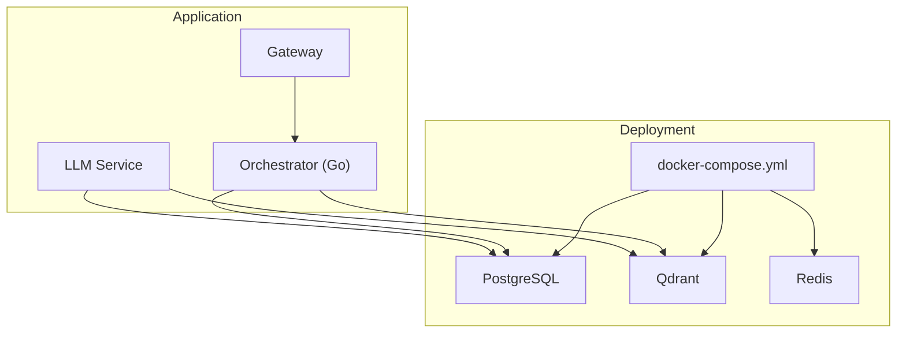
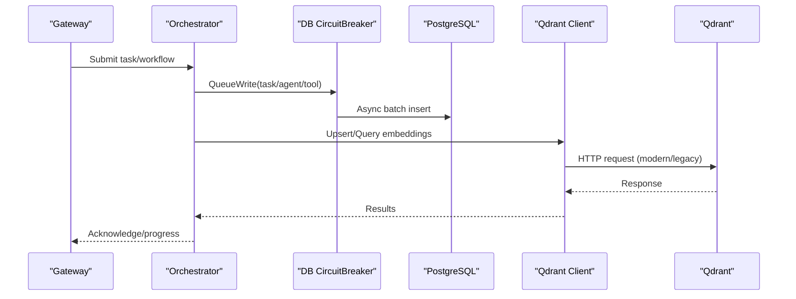
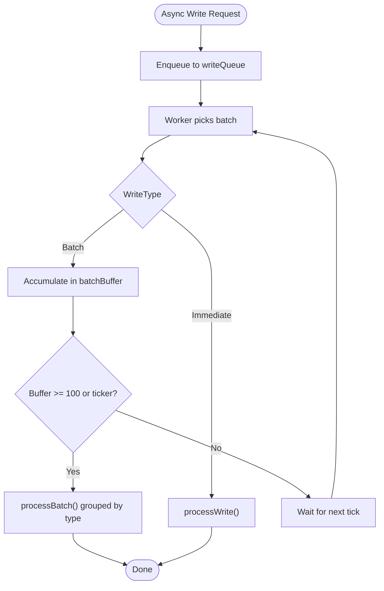
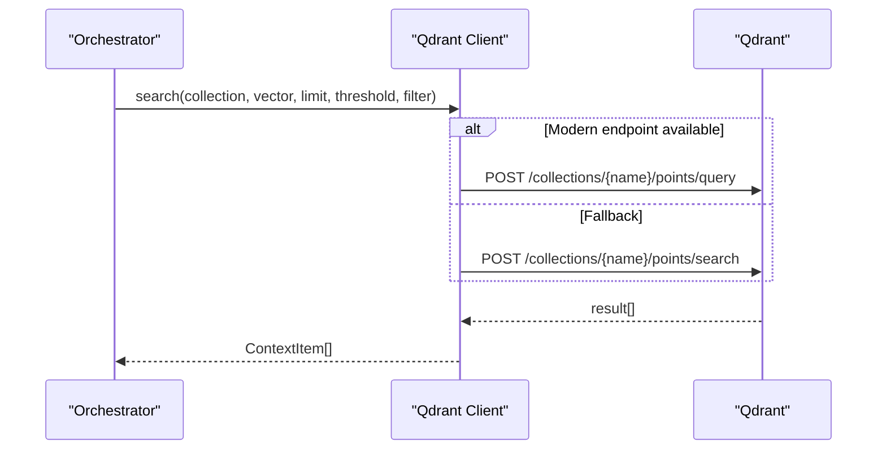
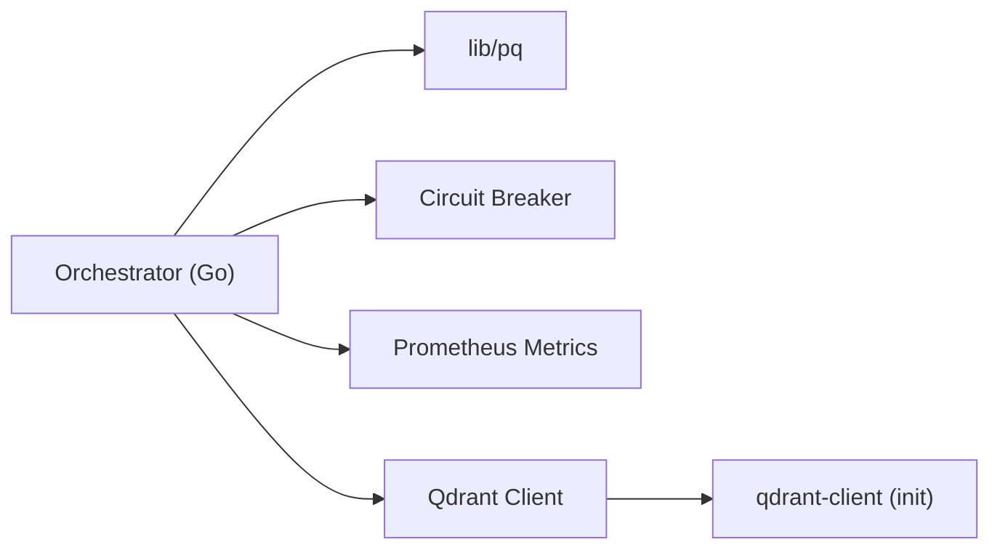

# Database Optimization

<cite>
**Referenced Files in This Document**
- [001_initial_schema.sql](file://migrations/postgres/001_initial_schema.sql)
- [002_persistence_tables.sql](file://migrations/postgres/002_persistence_tables.sql)
- [003_authentication.sql](file://migrations/postgres/003_authentication.sql)
- [004_event_logs.sql](file://migrations/postgres/004_event_logs.sql)
- [create_collections.py](file://migrations/qdrant/create_collections.py)
- [create_decomposition_patterns.py](file://migrations/qdrant/create_decomposition_patterns.py)
- [docker-compose.yml](file://deploy/compose/docker-compose.yml)
- [init-qdrant-collections.sh](file://scripts/init-qdrant-collections.sh)
- [client.go](file://go/orchestrator/internal/db/client.go)
- [models.go](file://go/orchestrator/internal/db/models.go)
- [database_wrapper.go](file://go/orchestrator/internal/circuitbreaker/database_wrapper.go)
- [http_wrapper.go](file://go/orchestrator/internal/circuitbreaker/http_wrapper.go)
- [client.go](file://go/orchestrator/internal/vectordb/client.go)
- [metrics.go](file://go/orchestrator/internal/metrics/metrics.go)
- [shannon.yaml](file://config/shannon.yaml)
</cite>

## Table of Contents
1. [Introduction](#introduction)
2. [Project Structure](#project-structure)
3. [Core Components](#core-components)
4. [Architecture Overview](#architecture-overview)
5. [Detailed Component Analysis](#detailed-component-analysis)
6. [Dependency Analysis](#dependency-analysis)
7. [Performance Considerations](#performance-considerations)
8. [Troubleshooting Guide](#troubleshooting-guide)
9. [Conclusion](#conclusion)
10. [Appendices](#appendices)

## Introduction
This document provides comprehensive database optimization guidance for PostgreSQL and Qdrant within the Shannon platform. It covers query optimization, index strategies, connection pooling, transaction management, vector database tuning, batch operations, schema optimization, partitioning, data archiving, and horizontal scaling patterns. Practical examples focus on profiling, identifying slow queries, resolving bottlenecks, and configuring observability.

## Project Structure
The platform integrates PostgreSQL for relational persistence and Qdrant for vector similarity search. Deployment uses Docker Compose to orchestrate services, with migrations initializing schemas and collections. The Go orchestrator manages database connections with a circuit-breaker wrapper and asynchronous write batching, while the vector DB client supports flexible search and upsert operations.

**Diagram sources**
- [docker-compose.yml](file://deploy/compose/docker-compose.yml#L1-L411)

**Section sources**
- [docker-compose.yml](file://deploy/compose/docker-compose.yml#L1-L411)

## Core Components
- PostgreSQL schema and migrations define tables, indexes, triggers, and partitioning guidance.
- Qdrant collections and payload indexes enable semantic search and filtering.
- Database client with connection pooling, async write batching, and circuit breaker protection.
- Vector DB client supporting modern and legacy search endpoints with tracing and metrics.
- Metrics subsystem capturing vector search latency, throughput, and operational signals.

**Section sources**
- [001_initial_schema.sql](file://migrations/postgres/001_initial_schema.sql#L1-L141)
- [002_persistence_tables.sql](file://migrations/postgres/002_persistence_tables.sql#L1-L254)
- [003_authentication.sql](file://migrations/postgres/003_authentication.sql#L1-L153)
- [004_event_logs.sql](file://migrations/postgres/004_event_logs.sql#L1-L50)
- [create_collections.py](file://migrations/qdrant/create_collections.py#L1-L263)
- [create_decomposition_patterns.py](file://migrations/qdrant/create_decomposition_patterns.py#L1-L132)
- [client.go](file://go/orchestrator/internal/db/client.go#L1-L498)
- [client.go](file://go/orchestrator/internal/vectordb/client.go#L1-L439)
- [metrics.go](file://go/orchestrator/internal/metrics/metrics.go#L1-L630)

## Architecture Overview
The system separates concerns across relational and vector stores. PostgreSQL persists structured workflow, execution, and audit data with JSONB for flexibility. Qdrant stores embeddings and payloads for semantic search. The orchestrator coordinates writes asynchronously, applies circuit breaker protections, and records metrics for observability.

**Diagram sources**
- [client.go](file://go/orchestrator/internal/db/client.go#L148-L196)
- [client.go](file://go/orchestrator/internal/vectordb/client.go#L96-L169)

## Detailed Component Analysis

### PostgreSQL Schema and Indexing Strategy
- Extensions: UUID, trigram, and GIN support enable robust identifiers and text similarity.
- Tables:
  - Users, sessions, prompts, learning cases, token usage, audit logs, task/agent/tool execution history, session archives, daily aggregates.
- Indexes:
  - Composite and selective indexes on foreign keys, timestamps, and frequently filtered columns.
  - JSONB GIN index on response payloads for fast retrieval.
- Triggers: Automatic updated_at updates for auditability.
- Partitioning guidance: Monthly partitioning for task_executions suggested for scale.

Practical optimization tips:
- Use selective indexes for high-cardinality filters (user_id, tenant_id).
- Leverage trigram GIN indexes for text similarity searches.
- Monitor index usage with EXPLAIN ANALYZE and remove unused indexes.
- Consider partial indexes for active/expiring rows (e.g., expires_at).

**Section sources**
- [001_initial_schema.sql](file://migrations/postgres/001_initial_schema.sql#L4-L141)
- [002_persistence_tables.sql](file://migrations/postgres/002_persistence_tables.sql#L42-L224)
- [003_authentication.sql](file://migrations/postgres/003_authentication.sql#L92-L104)
- [004_event_logs.sql](file://migrations/postgres/004_event_logs.sql#L19-L49)

### Connection Pooling and Async Writes
- Connection pool configuration: max open/idle connections, max lifetime, SSL mode.
- Health checks: periodic PING to maintain pool viability.
- Async write queue: prioritized batching with worker pool and backpressure.
- Retry and fallback mechanisms: queue full -> synchronous write to avoid data loss.
- Circuit breaker: protects DB operations from cascading failures.

Operational guidance:
- Tune MaxConnections and IdleConnections based on workload concurrency.
- Use QueueWriteWithRetry for transient backpressure scenarios.
- Monitor pool stats and adjust MaxLifetime to balance freshness vs. overhead.

**Diagram sources**
- [client.go](file://go/orchestrator/internal/db/client.go#L148-L196)
- [client.go](file://go/orchestrator/internal/db/client.go#L238-L309)

**Section sources**
- [client.go](file://go/orchestrator/internal/db/client.go#L80-L146)
- [client.go](file://go/orchestrator/internal/db/client.go#L148-L196)
- [client.go](file://go/orchestrator/internal/db/client.go#L238-L309)
- [client.go](file://go/orchestrator/internal/db/client.go#L332-L391)
- [client.go](file://go/orchestrator/internal/db/client.go#L393-L410)
- [database_wrapper.go](file://go/orchestrator/internal/circuitbreaker/database_wrapper.go#L11-L51)

### Transaction Management and Backups
- Transaction helpers: WithTransactionCB (circuit breaker) and legacy WithTransaction.
- Rollback safety: Panic guards and explicit rollback on errors.
- Backup optimization: Use logical backups (e.g., pg_dump) for point-in-time recovery; schedule during low-traffic windows.

Best practices:
- Keep transactions short; move heavy work outside transactions.
- Use circuit breaker-protected transactions for critical paths.
- Validate rollback paths and ensure idempotency where possible.

**Section sources**
- [client.go](file://go/orchestrator/internal/db/client.go#L437-L492)
- [database_wrapper.go](file://go/orchestrator/internal/circuitbreaker/database_wrapper.go#L131-L165)

### Vector Database Optimization (Qdrant)
- Collections: task_embeddings, tool_results, cases, document_chunks, summaries, decomposition_patterns.
- Payload indexes: keyword, float, integer, and text indexes for filtering and ranking.
- Search: Prefer modern /points/query endpoint with fallback to /points/search.
- MMR: Diversity re-ranking supported via configuration.
- Upsert batching: Efficient bulk insertion for embeddings.

Tuning guidelines:
- Adjust TopK and ScoreThreshold to balance precision/recall.
- Use payload filters to constrain search space (session_id, tenant_id).
- Monitor vector search latency and adjust collection sizes and HNSW parameters.

**Diagram sources**
- [client.go](file://go/orchestrator/internal/vectordb/client.go#L96-L169)

**Section sources**
- [create_collections.py](file://migrations/qdrant/create_collections.py#L44-L227)
- [create_decomposition_patterns.py](file://migrations/qdrant/create_decomposition_patterns.py#L24-L125)
- [client.go](file://go/orchestrator/internal/vectordb/client.go#L96-L169)
- [client.go](file://go/orchestrator/internal/vectordb/client.go#L171-L205)
- [shannon.yaml](file://config/shannon.yaml#L283-L304)

### Observability and Metrics
- Prometheus metrics capture vector search counts and latencies, embedding latencies, and operational signals.
- Circuit breaker metrics: state transitions and success rates for DB and HTTP.
- Use Grafana dashboards to correlate latency spikes with DB pool saturation or Qdrant throughput.

Actionable insights:
- Alert on sustained vector search latency increases.
- Track cache hit ratios for session and embedding caches.
- Correlate DB pool utilization with async write queue depth.

**Section sources**
- [metrics.go](file://go/orchestrator/internal/metrics/metrics.go#L263-L280)
- [metrics.go](file://go/orchestrator/internal/metrics/metrics.go#L289-L306)
- [http_wrapper.go](file://go/orchestrator/internal/circuitbreaker/http_wrapper.go#L32-L61)
- [database_wrapper.go](file://go/orchestrator/internal/circuitbreaker/database_wrapper.go#L42-L50)

## Dependency Analysis
- PostgreSQL dependencies: lib/pq driver, pgvector extension, UUID/GIN/trigram extensions.
- Qdrant dependencies: qdrant-client Python library for initialization scripts.
- Runtime dependencies: Redis for session caching, Temporal for workflow orchestration.

**Diagram sources**
- [client.go](file://go/orchestrator/internal/db/client.go#L10-L14)
- [create_collections.py](file://migrations/qdrant/create_collections.py#L11-L19)

**Section sources**
- [client.go](file://go/orchestrator/internal/db/client.go#L10-L14)
- [create_collections.py](file://migrations/qdrant/create_collections.py#L11-L19)

## Performance Considerations
- PostgreSQL
  - Use composite indexes for multi-column filters (user_id, session_id).
  - Leverage JSONB GIN indexes for semi-structured queries.
  - Apply partitioning for large time-series tables (monthly for task_executions).
  - Monitor autovacuum and tune retention policies for audit/event logs.
- Qdrant
  - Tune HNSW parameters (M, ef_construct) and indexing thresholds for collection sizes.
  - Use payload indexes judiciously; avoid over-indexing.
  - Batch upserts and limit vector dimensions to reduce memory pressure.
- Observability
  - Track DB pool saturation and async write queue depth.
  - Monitor vector search latency and success rates.

[No sources needed since this section provides general guidance]

## Troubleshooting Guide
Common issues and resolutions:
- Slow queries
  - Use EXPLAIN ANALYZE to inspect query plans; add missing indexes for filters.
  - Review JSONB queries and consider materialized columns if frequent.
- Connection pool exhaustion
  - Increase MaxConnections and tune IdleConnections; monitor pool stats.
  - Investigate long-running transactions and reduce their duration.
- Vector search slowness
  - Reduce TopK or increase ScoreThreshold; add payload filters.
  - Ensure payload indexes exist for session_id/tenant_id filters.
- Circuit breaker tripping
  - Inspect breaker state and failure rates; scale resources or adjust thresholds.
  - Review HTTP 5xx classification and upstream service health.

**Section sources**
- [client.go](file://go/orchestrator/internal/db/client.go#L393-L410)
- [http_wrapper.go](file://go/orchestrator/internal/circuitbreaker/http_wrapper.go#L32-L61)
- [database_wrapper.go](file://go/orchestrator/internal/circuitbreaker/database_wrapper.go#L42-L50)

## Conclusion
Optimizing the Shannon platform requires a balanced approach across relational and vector stores. PostgreSQL benefits from targeted indexing, partitioning, and connection pooling; Qdrant thrives with payload indexing and tuned HNSW parameters. Asynchronous writes, circuit breakers, and comprehensive metrics form a resilient operational foundation for high-throughput deployments.

[No sources needed since this section summarizes without analyzing specific files]

## Appendices

### Practical Examples

- Profiling slow queries
  - Use EXPLAIN (ANALYZE, BUFFERS, FORMAT JSON) to capture query plans.
  - Identify missing indexes and add composite indexes for multi-column filters.
  - Validate JSONB GIN index usage for payload queries.

- Identifying slow vector searches
  - Compare modern vs. fallback endpoints; prefer modern /points/query.
  - Adjust TopK and ScoreThreshold; add payload filters to narrow scope.
  - Monitor vector search latency histograms and alert on regressions.

- Resolving bottlenecks
  - PostgreSQL: reduce long transactions, enable partitioning, and tune autovacuum.
  - Qdrant: optimize HNSW parameters, add payload indexes, and batch upserts.

- Connection management
  - Align pool sizes with workload concurrency; monitor Stats().
  - Use circuit breaker-protected transactions for critical paths.

- Transaction optimization
  - Keep transactions short; move heavy work outside transactions.
  - Use panic guards and explicit rollbacks to ensure safety.

- Read/write scaling patterns
  - Read scaling: standby replicas for reporting/analytics; ensure consistent reads.
  - Write scaling: async batching, worker pools, and backpressure controls.

- Schema optimization and partitioning
  - Add composite indexes for high-cardinality filters.
  - Consider monthly partitions for task_executions to improve maintenance and pruning.

- Data archiving policies
  - Archive session snapshots and event logs to reduce primary table size.
  - Retain audit trails per compliance requirements; anonymize where possible.

- Horizontal scaling and replication
  - PostgreSQL: use managed replicas for read scaling; apply logical replication for cross-region.
  - Qdrant: operate cluster nodes behind load balancers; monitor shard distribution.

**Section sources**
- [002_persistence_tables.sql](file://migrations/postgres/002_persistence_tables.sql#L219-L224)
- [004_event_logs.sql](file://migrations/postgres/004_event_logs.sql#L27-L38)
- [client.go](file://go/orchestrator/internal/db/client.go#L80-L146)
- [client.go](file://go/orchestrator/internal/db/client.go#L148-L196)
- [client.go](file://go/orchestrator/internal/db/client.go#L332-L391)
- [client.go](file://go/orchestrator/internal/vectordb/client.go#L96-L169)
- [create_collections.py](file://migrations/qdrant/create_collections.py#L98-L113)
- [metrics.go](file://go/orchestrator/internal/metrics/metrics.go#L263-L280)