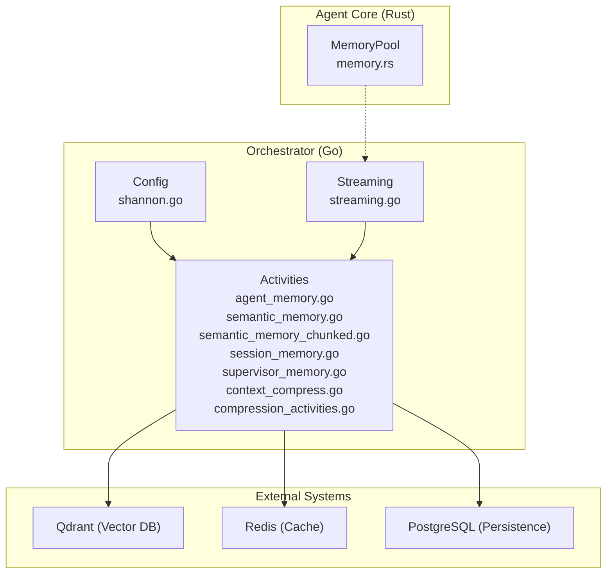
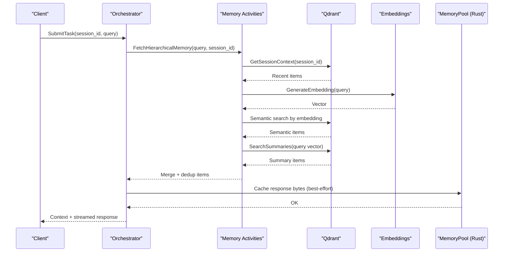
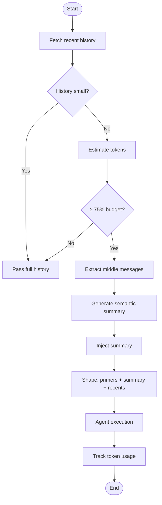
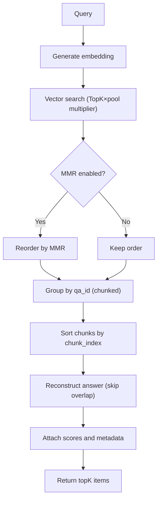
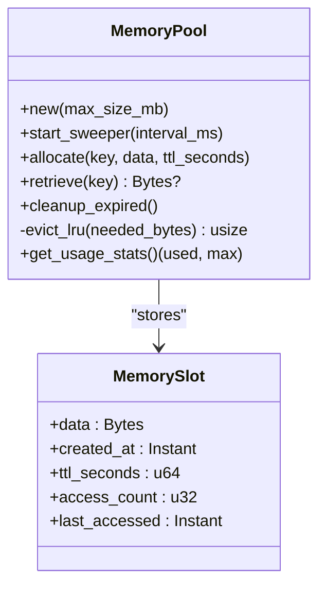
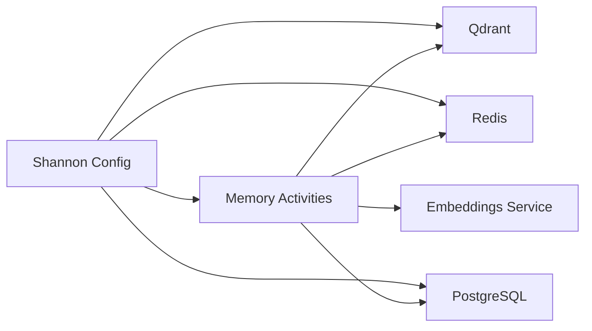

# Memory Management

<cite>
**Referenced Files in This Document**
- [memory-system-architecture.md](file://docs/memory-system-architecture.md)
- [context-window-management.md](file://docs/context-window-management.md)
- [agent_memory.go](file://go/orchestrator/internal/activities/agent_memory.go)
- [semantic_memory.go](file://go/orchestrator/internal/activities/semantic_memory.go)
- [semantic_memory_chunked.go](file://go/orchestrator/internal/activities/semantic_memory_chunked.go)
- [session_memory.go](file://go/orchestrator/internal/activities/session_memory.go)
- [supervisor_memory.go](file://go/orchestrator/internal/activities/supervisor_memory.go)
- [context_compress.go](file://go/orchestrator/internal/activities/context_compress.go)
- [compression_activities.go](file://go/orchestrator/internal/activities/compression_activities.go)
- [truncation.go](file://go/orchestrator/internal/activities/truncation.go)
- [shannon.go](file://go/orchestrator/internal/config/shannon.go)
- [memory.rs](file://rust/agent-core/src/memory.rs)
- [streaming.go](file://go/orchestrator/internal/activities/streaming.go)
- [streaming_manager.go](file://go/orchestrator/internal/streaming/manager.go)
- [memory_evaluation.py](file://tests/evaluation/memory_evaluation.py)
- [memory_bench_test.go](file://go/orchestrator/internal/activities/memory_bench_test.go)
- [memory_integration_test.go](file://go/orchestrator/internal/activities/memory_integration_test.go)
</cite>

## Table of Contents
1. [Introduction](#introduction)
2. [Project Structure](#project-structure)
3. [Core Components](#core-components)
4. [Architecture Overview](#architecture-overview)
5. [Detailed Component Analysis](#detailed-component-analysis)
6. [Dependency Analysis](#dependency-analysis)
7. [Performance Considerations](#performance-considerations)
8. [Troubleshooting Guide](#troubleshooting-guide)
9. [Conclusion](#conclusion)
10. [Appendices](#appendices)

## Introduction
This document provides a comprehensive guide to memory management optimization in Shannon’s multi-agent system. It covers context window strategies (dynamic trimming, semantic chunking, and intelligent prioritization), agent memory lifecycle and cleanup, garbage collection and leak prevention, memory pooling for concurrent execution, streaming buffer management, and efficient serialization. It also includes practical guidance for memory profiling, heap analysis, and monitoring, along with configuration parameters for memory limits, eviction policies, and cache warming strategies tailored for large-scale deployments with hundreds of concurrent agents.

## Project Structure
Shannon’s memory system spans multiple layers:
- Orchestrator (Go): Activities for memory retrieval, semantic chunking, compression, and supervisor memory enrichment.
- Agent Core (Rust): In-process memory pool with LRU eviction, TTL-based cleanup, and metrics.
- Streaming: Ring-buffer streaming and truncation limits for SSE outputs.
- Configuration: Typed configuration for context windows, token budgets, and vector DB parameters.

**Diagram sources**
- [agent_memory.go](file://go/orchestrator/internal/activities/agent_memory.go#L1-L89)
- [semantic_memory.go](file://go/orchestrator/internal/activities/semantic_memory.go#L1-L222)
- [semantic_memory_chunked.go](file://go/orchestrator/internal/activities/semantic_memory_chunked.go#L1-L351)
- [session_memory.go](file://go/orchestrator/internal/activities/session_memory.go#L1-L68)
- [supervisor_memory.go](file://go/orchestrator/internal/activities/supervisor_memory.go#L1-L957)
- [context_compress.go](file://go/orchestrator/internal/activities/context_compress.go#L1-L215)
- [compression_activities.go](file://go/orchestrator/internal/activities/compression_activities.go#L1-L158)
- [shannon.go](file://go/orchestrator/internal/config/shannon.go#L1-L800)
- [streaming.go](file://go/orchestrator/internal/activities/streaming.go#L1-L239)
- [memory.rs](file://rust/agent-core/src/memory.rs#L1-L680)

**Section sources**
- [memory-system-architecture.md](file://docs/memory-system-architecture.md#L1-L239)
- [context-window-management.md](file://docs/context-window-management.md#L1-L370)
- [shannon.go](file://go/orchestrator/internal/config/shannon.go#L277-L294)

## Core Components
- Memory retrieval and fusion: Hierarchical retrieval combining recent, semantic, and summary sources with deduplication.
- Context compression: Sliding window compression with primers, summary, and recents to fit token budgets.
- Semantic chunking: Intelligent chunking of long Q&A pairs with overlap-aware reconstruction.
- Supervisor memory: Enhanced memory with decomposition patterns, strategy performance, failure patterns, and user preferences.
- Memory pool (Rust): In-process memory pool with LRU eviction, TTL cleanup, and metrics.
- Streaming buffer management: Truncation limits and ring-buffer streaming for SSE.

**Section sources**
- [semantic_memory.go](file://go/orchestrator/internal/activities/semantic_memory.go#L50-L221)
- [context_compress.go](file://go/orchestrator/internal/activities/context_compress.go#L42-L177)
- [semantic_memory_chunked.go](file://go/orchestrator/internal/activities/semantic_memory_chunked.go#L16-L276)
- [supervisor_memory.go](file://go/orchestrator/internal/activities/supervisor_memory.go#L186-L253)
- [memory.rs](file://rust/agent-core/src/memory.rs#L86-L523)
- [streaming.go](file://go/orchestrator/internal/activities/streaming.go#L12-L239)

## Architecture Overview
The memory architecture integrates vector search, session history, and supervisor insights with strict budgeting and compression.

**Diagram sources**
- [semantic_memory.go](file://go/orchestrator/internal/activities/semantic_memory.go#L50-L221)
- [semantic_memory_chunked.go](file://go/orchestrator/internal/activities/semantic_memory_chunked.go#L16-L276)
- [session_memory.go](file://go/orchestrator/internal/activities/session_memory.go#L26-L67)
- [supervisor_memory.go](file://go/orchestrator/internal/activities/supervisor_memory.go#L186-L253)
- [memory.rs](file://rust/agent-core/src/memory.rs#L564-L612)

## Detailed Component Analysis

### Context Window Optimization
- Configurable windows: Defaults and presets (e.g., debugging) with environment overrides.
- Token budget management: Per-agent and per-task budgets with enforcement and backpressure.
- Sliding window compression: Primers, summary, recents to fit budget; privacy-preserving PII redaction.
- Metrics and events: Compression triggers, token savings, and budget usage visibility.

**Diagram sources**
- [context_compress.go](file://go/orchestrator/internal/activities/context_compress.go#L42-L177)
- [context-window-management.md](file://docs/context-window-management.md#L125-L145)

**Section sources**
- [context-window-management.md](file://docs/context-window-management.md#L1-L370)
- [context_compress.go](file://go/orchestrator/internal/activities/context_compress.go#L1-L215)
- [compression_activities.go](file://go/orchestrator/internal/activities/compression_activities.go#L1-L158)

### Semantic Memory Chunking and Reconstruction
- Intelligent chunking: Configurable max tokens and overlap; deduplication via ids.
- Chunked aggregation: Reconstruct full answers from ordered chunks with overlap handling.
- Diversity-aware reranking: Optional MMR to balance relevance and diversity.
- Metrics: Chunk aggregation timing and hit/miss tracking.

**Diagram sources**
- [semantic_memory_chunked.go](file://go/orchestrator/internal/activities/semantic_memory_chunked.go#L16-L276)

**Section sources**
- [semantic_memory_chunked.go](file://go/orchestrator/internal/activities/semantic_memory_chunked.go#L1-L351)
- [shannon.go](file://go/orchestrator/internal/config/shannon.go#L246-L263)

### Hierarchical Memory Fusion and Deduplication
- Combines recent, semantic, and summary sources with source tagging.
- Deduplication keys prefer point IDs or composite keys; tracks duplicates.
- Limits total items to prevent context explosion.

**Section sources**
- [semantic_memory.go](file://go/orchestrator/internal/activities/semantic_memory.go#L50-L221)

### Supervisor Memory Enrichment and Cleanup
- Fetches decomposition patterns, strategy performance, failure patterns, and user preferences.
- Implements TTL-based cleanup for strategy performance cache to prevent memory leaks.
- Records metrics for learning router and decomposition patterns.

**Section sources**
- [supervisor_memory.go](file://go/orchestrator/internal/activities/supervisor_memory.go#L186-L253)
- [supervisor_memory.go](file://go/orchestrator/internal/activities/supervisor_memory.go#L881-L933)

### Agent Memory Recording and Retrieval
- Agent-specific memory retrieval via Qdrant with session and agent filters.
- Recording uses shared record query core with metadata tagging.

**Section sources**
- [agent_memory.go](file://go/orchestrator/internal/activities/agent_memory.go#L22-L89)

### Session Memory Retrieval
- Retrieves recent session items from Qdrant with metrics and friendly events.

**Section sources**
- [session_memory.go](file://go/orchestrator/internal/activities/session_memory.go#L26-L67)

### Memory Pooling and Garbage Collection (Rust)
- MemoryPool: thread-safe pool with LRU eviction, TTL semantics, and background sweeper.
- Metrics: allocations, evictions, allocation size histogram.
- Pressure thresholds and warnings; high-water mark tracking.

**Diagram sources**
- [memory.rs](file://rust/agent-core/src/memory.rs#L86-L523)

**Section sources**
- [memory.rs](file://rust/agent-core/src/memory.rs#L1-L680)

### Streaming Buffer Management and Truncation
- Streaming activities simulate tokenized streaming with heartbeat progress.
- Truncation constants define maximum lengths for synthesis, LLM outputs, prompts, and “thinking” snippets.

**Section sources**
- [streaming.go](file://go/orchestrator/internal/activities/streaming.go#L12-L239)
- [truncation.go](file://go/orchestrator/internal/activities/truncation.go#L1-L18)

## Dependency Analysis
- Vector DB (Qdrant) dependencies: Embeddings service, payload indexes, HNSW configuration, and collection organization.
- Redis: Session cache, token budgets, compression state.
- PostgreSQL: Task executions, agent/tool execution tracking, supervisor memory tables.
- Configuration: Typed config for context windows, token budgets, MMR, and chunking.

**Diagram sources**
- [shannon.go](file://go/orchestrator/internal/config/shannon.go#L220-L245)
- [memory-system-architecture.md](file://docs/memory-system-architecture.md#L126-L144)

**Section sources**
- [shannon.go](file://go/orchestrator/internal/config/shannon.go#L220-L294)
- [memory-system-architecture.md](file://docs/memory-system-architecture.md#L1-L239)

## Performance Considerations
- Intelligent chunking reduces storage and improves retrieval throughput.
- MMR diversity improves recall quality with minimal cost.
- Batch embedding processing and smart caching reduce API calls.
- Compression saves tokens and reduces latency for long sessions.
- MemoryPool prevents OOM with LRU and TTL; metrics enable proactive scaling.

[No sources needed since this section provides general guidance]

## Troubleshooting Guide
Common issues and resolutions:
- Context seems truncated: increase context window or use debugging preset; verify compression events.
- Token budget exceeded: raise per-agent/task budgets; ensure compression triggers.
- Compression not triggering: lower per-request budget to force compression; verify history length and thresholds.
- Compression too aggressive: adjust primers/recents counts; tune target ratio.

**Section sources**
- [context-window-management.md](file://docs/context-window-management.md#L307-L362)

## Conclusion
Shannon’s memory system balances long-context retention with strict budgeting and intelligent compression. The combination of hierarchical retrieval, semantic chunking, supervisor memory enrichment, and robust in-process memory pooling enables scalable multi-agent execution. Proper configuration, metrics, and cleanup mechanisms ensure stability under heavy loads.

[No sources needed since this section summarizes without analyzing specific files]

## Appendices

### Practical Memory Profiling and Monitoring
- Use Prometheus metrics for compression events, token savings, and memory pool usage.
- Monitor memory pool pressure thresholds and eviction rates.
- Evaluate chunk aggregation performance and hit/miss rates for semantic retrieval.

**Section sources**
- [context-window-management.md](file://docs/context-window-management.md#L59-L62)
- [memory.rs](file://rust/agent-core/src/memory.rs#L13-L73)
- [semantic_memory_chunked.go](file://go/orchestrator/internal/activities/semantic_memory_chunked.go#L267-L275)

### Configuration Parameters for Memory Limits and Policies
- Context windows: default and debugging presets; primers and recents counts.
- Token budgets: per-agent and per-task with validation bounds.
- Vector DB: TopK, threshold, MMR settings, and collection names.
- Memory pool: max size MB, pressure thresholds, and sweeper interval.

**Section sources**
- [context-window-management.md](file://docs/context-window-management.md#L64-L107)
- [shannon.go](file://go/orchestrator/internal/config/shannon.go#L277-L294)
- [shannon.go](file://go/orchestrator/internal/config/shannon.go#L220-L245)
- [memory.rs](file://rust/agent-core/src/memory.rs#L109-L138)

### Memory-Efficient Serialization and Streaming
- Use streaming heartbeats to avoid buffering full responses.
- Apply truncation limits for synthesis, LLM outputs, and logged prompts.
- Cache response bytes in MemoryPool with TTL for best-effort reuse.

**Section sources**
- [streaming.go](file://go/orchestrator/internal/activities/streaming.go#L40-L92)
- [truncation.go](file://go/orchestrator/internal/activities/truncation.go#L1-L18)
- [memory.rs](file://rust/agent-core/src/memory.rs#L579-L595)

### Large-Scale Deployment Recommendations
- Scale Redis and Qdrant horizontally; ensure payload indexes and HNSW parameters are tuned.
- Use MemoryPool with appropriate max size and sweeper intervals.
- Monitor compression effectiveness and adjust thresholds based on workload.
- Implement cache warming for embeddings and supervisor memory patterns.

**Section sources**
- [memory-system-architecture.md](file://docs/memory-system-architecture.md#L164-L190)
- [memory.rs](file://rust/agent-core/src/memory.rs#L140-L207)