# Performance Optimization

<cite>
**Referenced Files in This Document**
- [agent_memory.go](file://go/orchestrator/internal/activities/agent_memory.go)
- [context_compress.go](file://go/orchestrator/internal/activities/context_compress.go)
- [truncation.go](file://go/orchestrator/internal/activities/truncation.go)
- [semantic_memory.go](file://go/orchestrator/internal/activities/semantic_memory.go)
- [memory_bench_test.go](file://go/orchestrator/internal/activities/memory_bench_test.go)
- [parallel.go](file://go/orchestrator/internal/workflows/patterns/execution/parallel.go)
- [client.go (DB)](file://go/orchestrator/internal/db/client.go)
- [client.go (VectorDB)](file://go/orchestrator/internal/vectordb/client.go)
- [service.go (Embeddings)](file://go/orchestrator/internal/embeddings/service.go)
- [metrics.go](file://go/orchestrator/internal/metrics/metrics.go)
- [grpc_wrapper.go](file://go/orchestrator/internal/circuitbreaker/grpc_wrapper.go)
- [workflow_interceptor.go](file://go/orchestrator/internal/interceptors/workflow_interceptor.go)
- [manager.go (Streaming)](file://go/orchestrator/internal/streaming/manager.go)
- [config.go](file://go/orchestrator/internal/config/config.go)
- [util.go](file://go/orchestrator/internal/util/util.go)
</cite>

## Table of Contents
1. [Introduction](#introduction)
2. [Project Structure](#project-structure)
3. [Core Components](#core-components)
4. [Architecture Overview](#architecture-overview)
5. [Detailed Component Analysis](#detailed-component-analysis)
6. [Dependency Analysis](#dependency-analysis)
7. [Performance Considerations](#performance-considerations)
8. [Troubleshooting Guide](#troubleshooting-guide)
9. [Conclusion](#conclusion)
10. [Appendices](#appendices)

## Introduction
This document provides comprehensive performance optimization guidance for high-throughput Shannon deployments. It focuses on memory management strategies (context window optimization, agent memory cleanup, garbage collection patterns), CPU and I/O optimization for multi-agent workflows (parallel execution patterns and resource pooling), database and vector database optimization (PostgreSQL and Qdrant), network optimization (gRPC connection management and streaming performance tuning), and operational practices (benchmarking, monitoring, and capacity planning). The goal is to help operators scale Shannon safely and predictably under heavy load.

## Project Structure
Shannon’s performance-critical subsystems are organized around:
- Activities: memory retrieval and compression, agent memory persistence, truncation limits
- Workflows: parallel execution orchestration with concurrency control and budgeting
- Persistence: PostgreSQL client with async write queues and batching
- Vector DB: Qdrant client with HTTP transport, circuit breaking, and search optimization
- Embeddings: batched embedding generation with caching and tracing
- Streaming: Redis Streams-based event publishing with batching and persistence
- Interceptors and circuit breakers: gRPC and HTTP round-trip enhancements
- Metrics: Prometheus metrics for workflows, memory, vector search, embeddings, and streaming
- Configuration: environment-driven runtime tuning knobs

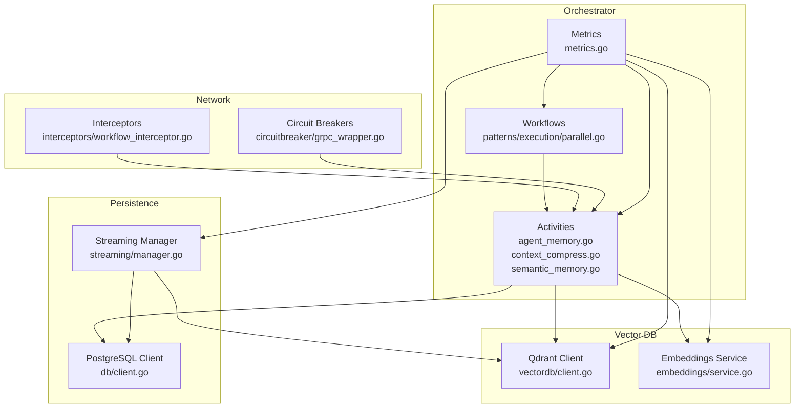

**Diagram sources**
- [parallel.go](file://go/orchestrator/internal/workflows/patterns/execution/parallel.go#L1-L520)
- [agent_memory.go](file://go/orchestrator/internal/activities/agent_memory.go#L1-L89)
- [context_compress.go](file://go/orchestrator/internal/activities/context_compress.go#L1-L215)
- [semantic_memory.go](file://go/orchestrator/internal/activities/semantic_memory.go#L1-L222)
- [client.go (DB)](file://go/orchestrator/internal/db/client.go#L1-L498)
- [manager.go (Streaming)](file://go/orchestrator/internal/streaming/manager.go#L1-L921)
- [client.go (VectorDB)](file://go/orchestrator/internal/vectordb/client.go#L1-L439)
- [service.go (Embeddings)](file://go/orchestrator/internal/embeddings/service.go#L1-L274)
- [grpc_wrapper.go](file://go/orchestrator/internal/circuitbreaker/grpc_wrapper.go#L1-L178)
- [workflow_interceptor.go](file://go/orchestrator/internal/interceptors/workflow_interceptor.go#L1-L74)
- [metrics.go](file://go/orchestrator/internal/metrics/metrics.go#L1-L630)

**Section sources**
- [parallel.go](file://go/orchestrator/internal/workflows/patterns/execution/parallel.go#L1-L520)
- [client.go (DB)](file://go/orchestrator/internal/db/client.go#L1-L498)
- [client.go (VectorDB)](file://go/orchestrator/internal/vectordb/client.go#L1-L439)
- [service.go (Embeddings)](file://go/orchestrator/internal/embeddings/service.go#L1-L274)
- [manager.go (Streaming)](file://go/orchestrator/internal/streaming/manager.go#L1-L921)
- [metrics.go](file://go/orchestrator/internal/metrics/metrics.go#L1-L630)

## Core Components
- Memory management
  - Context compression and summarization to reduce context size
  - Hierarchical memory retrieval combining recent, semantic, and summary sources with deduplication
  - Agent memory persistence with PII redaction and optional extra metadata
  - Truncation limits for streaming outputs and prompts
- Parallel execution
  - Semaphore-based concurrency control for multi-agent workflows
  - Budget-aware agent execution with token accounting
  - Asynchronous persistence and event emission
- Persistence and I/O
  - PostgreSQL client with configurable connection pool, async write queue, and batching
  - Streaming manager with Redis Streams, batching, and selective DB persistence
- Vector database and embeddings
  - Qdrant HTTP client with fallback search, tracing, and circuit breaking
  - Embeddings service with LRU and Redis caching, batch generation, and tracing
- Network and reliability
  - gRPC circuit breaker with interceptors for unary and streaming
  - Workflow-aware HTTP and gRPC interceptors for correlation headers
- Monitoring and observability
  - Comprehensive Prometheus metrics for workflows, memory, vector search, embeddings, and streaming

**Section sources**
- [context_compress.go](file://go/orchestrator/internal/activities/context_compress.go#L1-L215)
- [semantic_memory.go](file://go/orchestrator/internal/activities/semantic_memory.go#L1-L222)
- [agent_memory.go](file://go/orchestrator/internal/activities/agent_memory.go#L1-L89)
- [truncation.go](file://go/orchestrator/internal/activities/truncation.go#L1-L18)
- [parallel.go](file://go/orchestrator/internal/workflows/patterns/execution/parallel.go#L1-L520)
- [client.go (DB)](file://go/orchestrator/internal/db/client.go#L1-L498)
- [manager.go (Streaming)](file://go/orchestrator/internal/streaming/manager.go#L1-L921)
- [client.go (VectorDB)](file://go/orchestrator/internal/vectordb/client.go#L1-L439)
- [service.go (Embeddings)](file://go/orchestrator/internal/embeddings/service.go#L1-L274)
- [grpc_wrapper.go](file://go/orchestrator/internal/circuitbreaker/grpc_wrapper.go#L1-L178)
- [workflow_interceptor.go](file://go/orchestrator/internal/interceptors/workflow_interceptor.go#L1-L74)
- [metrics.go](file://go/orchestrator/internal/metrics/metrics.go#L1-L630)

## Architecture Overview
High-throughput Shannon relies on:
- Workflows spawning parallel agents with bounded concurrency
- Activities performing memory retrieval and compression, and persisting agent interactions
- Embeddings and vector DB for semantic search and retrieval
- Streaming manager publishing events to Redis Streams and persisting selected events to PostgreSQL
- Circuit breakers and interceptors ensuring resilient network calls
- Metrics driving capacity planning and performance tuning

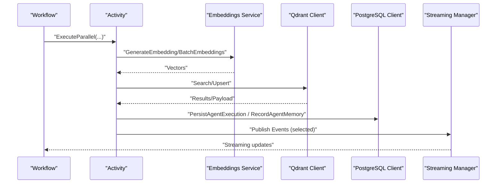

**Diagram sources**
- [parallel.go](file://go/orchestrator/internal/workflows/patterns/execution/parallel.go#L1-L520)
- [service.go (Embeddings)](file://go/orchestrator/internal/embeddings/service.go#L1-L274)
- [client.go (VectorDB)](file://go/orchestrator/internal/vectordb/client.go#L1-L439)
- [client.go (DB)](file://go/orchestrator/internal/db/client.go#L1-L498)
- [manager.go (Streaming)](file://go/orchestrator/internal/streaming/manager.go#L1-L921)

## Detailed Component Analysis

### Memory Management Strategies
- Context window optimization
  - Compress long conversation histories into summaries with PII redaction and deterministic IDs for deduplication
  - Use truncation limits for synthesis, LLM outputs, prompts, and “thinking” snippets
- Agent memory cleanup
  - Persist agent interactions with optional extra metadata and PII redaction
  - Fetch agent memory scoped to session and agent with TopK limiting
- Garbage collection patterns
  - Hierarchical retrieval with deduplication across recent, semantic, and summary sources
  - Limit total retrieved items to prevent context explosion

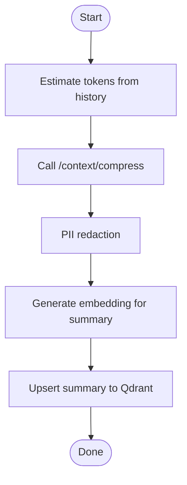

**Diagram sources**
- [context_compress.go](file://go/orchestrator/internal/activities/context_compress.go#L42-L177)

**Section sources**
- [context_compress.go](file://go/orchestrator/internal/activities/context_compress.go#L1-L215)
- [truncation.go](file://go/orchestrator/internal/activities/truncation.go#L1-L18)
- [agent_memory.go](file://go/orchestrator/internal/activities/agent_memory.go#L1-L89)
- [semantic_memory.go](file://go/orchestrator/internal/activities/semantic_memory.go#L50-L222)

### Parallel Execution Patterns and Resource Pooling
- Concurrency control
  - Semaphore-based parallel execution with configurable max concurrency
  - Optional budget enforcement per agent with token accounting
- Resource pooling
  - Asynchronous persistence via disconnected contexts and fire-and-forget
  - Streaming events emitted with parent workflow correlation
- Backpressure and resilience
  - Retry policies and timeouts on agent activities
  - Circuit breaker protection for downstream services

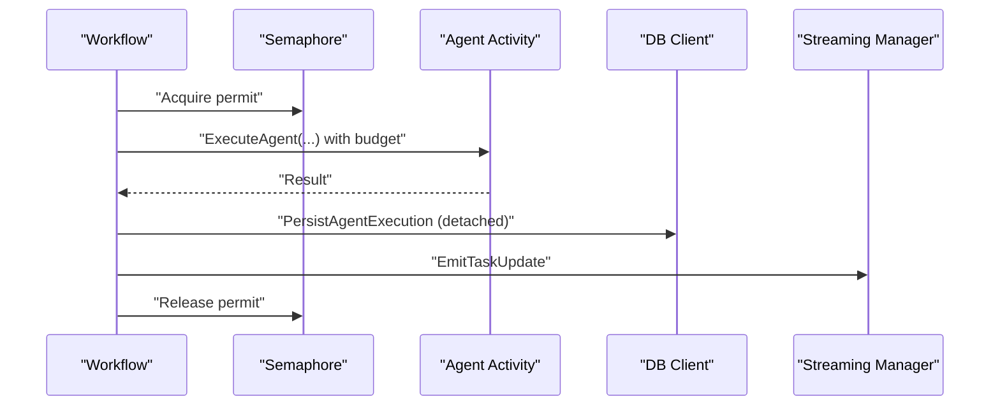

**Diagram sources**
- [parallel.go](file://go/orchestrator/internal/workflows/patterns/execution/parallel.go#L48-L450)

**Section sources**
- [parallel.go](file://go/orchestrator/internal/workflows/patterns/execution/parallel.go#L1-L520)

### Database Optimization (PostgreSQL)
- Connection pooling
  - Configurable max open/idle connections and max lifetime
  - Health checks and graceful shutdown
- Async write queue and batching
  - Dedicated workers process write requests from a buffered queue
  - Periodic flush and batch insertion grouped by type
- Transaction safety
  - Circuit breaker protected transactions and legacy fallback APIs

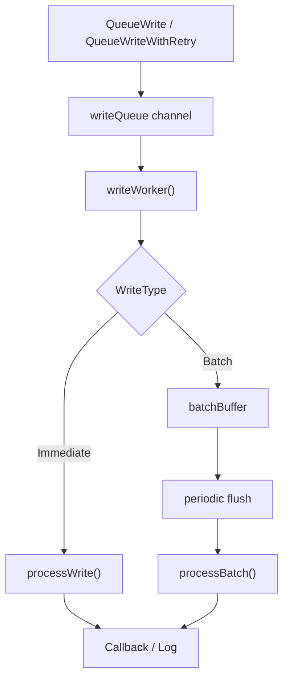

**Diagram sources**
- [client.go (DB)](file://go/orchestrator/internal/db/client.go#L148-L391)

**Section sources**
- [client.go (DB)](file://go/orchestrator/internal/db/client.go#L1-L498)

### Vector Database Optimization (Qdrant)
- HTTP client with tracing and circuit breaking
- Fallback search for compatibility and robustness
- Filtering by session and tenant IDs; optional MMR vector inclusion
- Upsert helpers for task embeddings and summaries with configurable collections

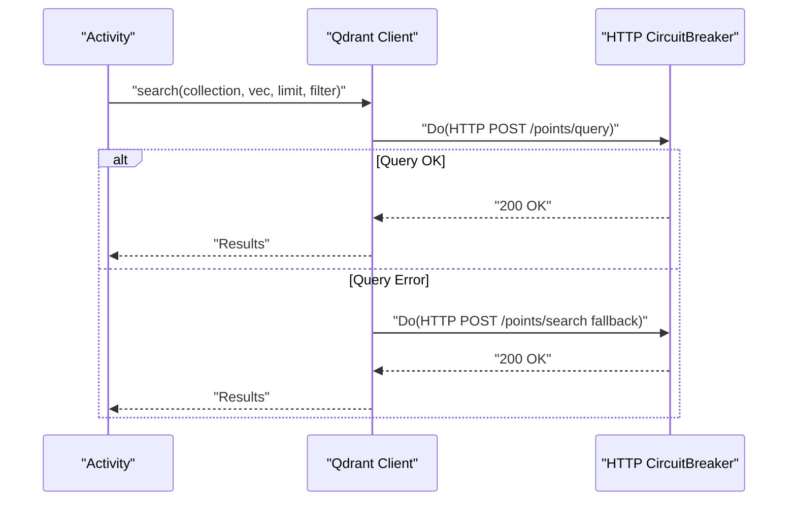

**Diagram sources**
- [client.go (VectorDB)](file://go/orchestrator/internal/vectordb/client.go#L96-L169)

**Section sources**
- [client.go (VectorDB)](file://go/orchestrator/internal/vectordb/client.go#L1-L439)

### Embeddings Optimization
- Caching layers
  - Local LRU cache and Redis cache with TTL and key hashing
- Batch generation
  - Batch embedding requests to reduce overhead and improve throughput
- Tracing and metrics
  - Latency histograms and status counters for embeddings

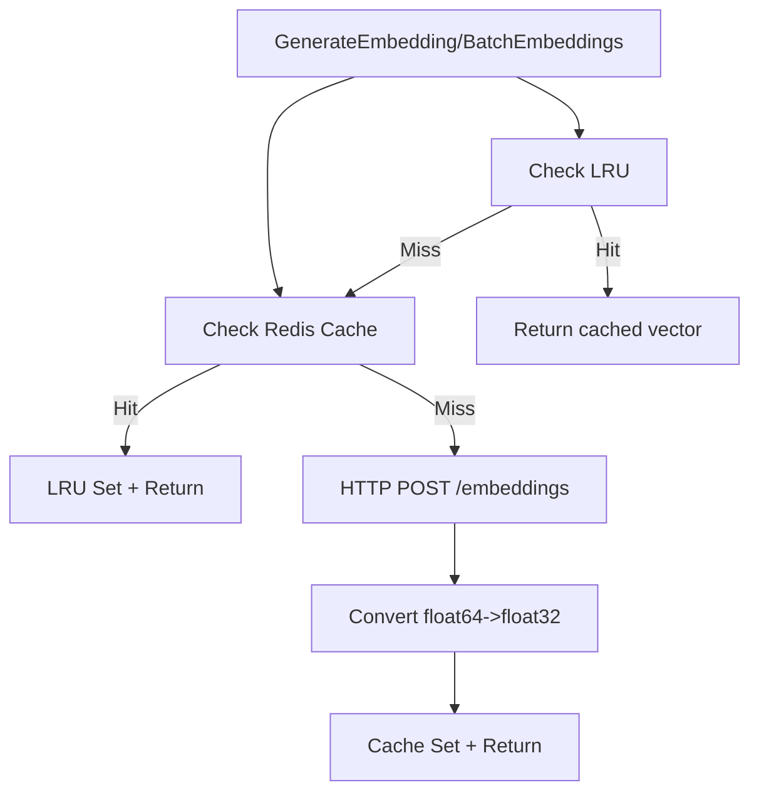

**Diagram sources**
- [service.go (Embeddings)](file://go/orchestrator/internal/embeddings/service.go#L82-L273)

**Section sources**
- [service.go (Embeddings)](file://go/orchestrator/internal/embeddings/service.go#L1-L274)

### Streaming Performance Tuning
- Redis Streams
  - Publish events with sequence numbers and TTL on stream keys
  - Selective persistence to PostgreSQL for important events only
- Batching and backpressure
  - Configurable batch size and flush interval
  - Dropping non-critical events when buffers are full
- Deduplication and sanitization
  - Stream IDs and sequence numbers for deduplication
  - Sanitization of large base64 images and invalid UTF-8

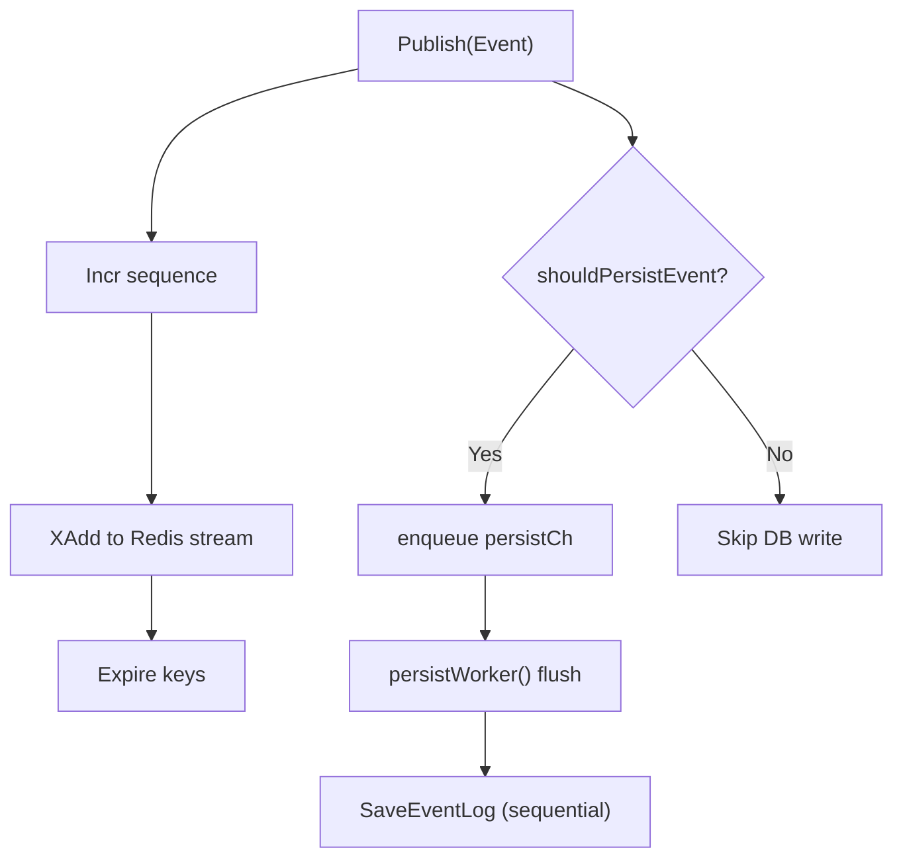

**Diagram sources**
- [manager.go (Streaming)](file://go/orchestrator/internal/streaming/manager.go#L364-L492)
- [manager.go (Streaming)](file://go/orchestrator/internal/streaming/manager.go#L661-L696)

**Section sources**
- [manager.go (Streaming)](file://go/orchestrator/internal/streaming/manager.go#L1-L921)

### Network Optimization (gRPC and HTTP)
- gRPC circuit breaker
  - Wraps unary and streaming interceptors with circuit breaker logic
  - Classifies transient vs client errors to avoid false positives
- Workflow-aware interceptors
  - Inject workflow and run IDs into HTTP and gRPC metadata for correlation
- Connection wrapping
  - Circuit breaker for gRPC dial operations

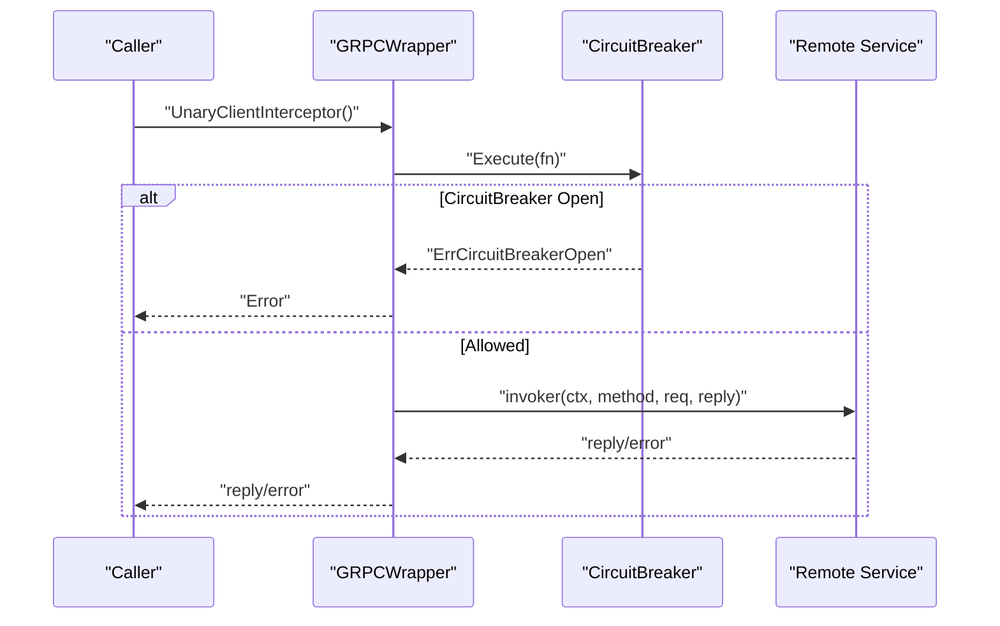

**Diagram sources**
- [grpc_wrapper.go](file://go/orchestrator/internal/circuitbreaker/grpc_wrapper.go#L36-L90)
- [workflow_interceptor.go](file://go/orchestrator/internal/interceptors/workflow_interceptor.go#L47-L73)

**Section sources**
- [grpc_wrapper.go](file://go/orchestrator/internal/circuitbreaker/grpc_wrapper.go#L1-L178)
- [workflow_interceptor.go](file://go/orchestrator/internal/interceptors/workflow_interceptor.go#L1-L74)

### Benchmarking and Performance Monitoring
- Benchmarks
  - Chunking pipeline, batch vs single embeddings, MMR reranking, semantic search, hierarchical memory, chunk overhead, metrics overhead, and memory allocations
- Metrics
  - Workflows, memory, vector search, embeddings, streaming, and cache metrics
  - Recording functions for embedding, vector search, and chunking

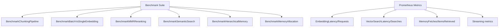

**Diagram sources**
- [memory_bench_test.go](file://go/orchestrator/internal/activities/memory_bench_test.go#L18-L386)
- [metrics.go](file://go/orchestrator/internal/metrics/metrics.go#L1-L630)

**Section sources**
- [memory_bench_test.go](file://go/orchestrator/internal/activities/memory_bench_test.go#L1-L386)
- [metrics.go](file://go/orchestrator/internal/metrics/metrics.go#L1-L630)

## Dependency Analysis
- Coupling and cohesion
  - Activities depend on embeddings and vector DB for retrieval and upsert
  - Workflows orchestrate activities and manage concurrency
  - Streaming and DB clients are decoupled from business logic via event publishing and persistence
- External dependencies
  - PostgreSQL via lib/pq with circuit breaker protection
  - Qdrant via HTTP with fallback and tracing
  - Redis for streaming and event log batching
- Potential circular dependencies
  - Streaming manager references DB client; ensure initialization order and avoid mutual imports
- Interface contracts
  - Embeddings service exposes GenerateEmbedding and GenerateBatchEmbeddings
  - Vector DB client exposes search and upsert helpers
  - DB client exposes transaction helpers and async write APIs

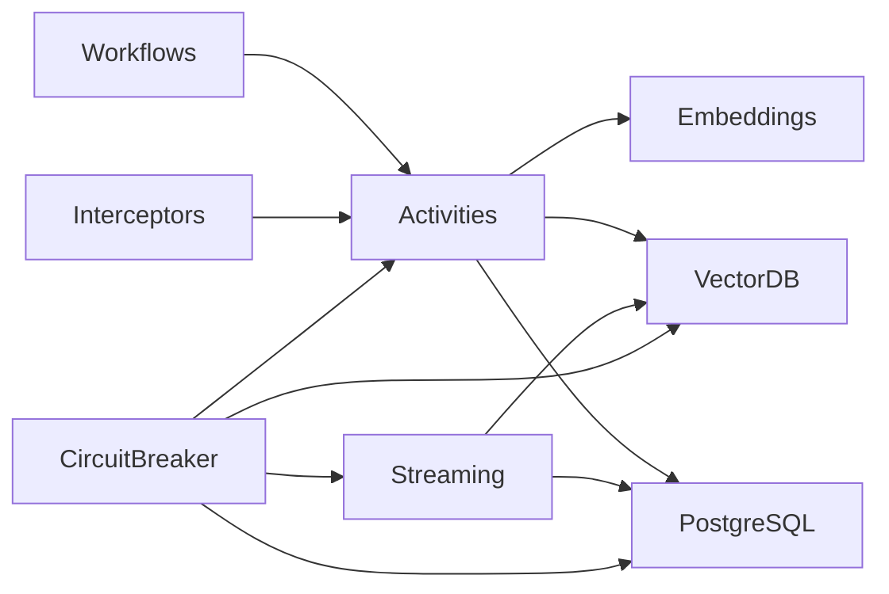

**Diagram sources**
- [parallel.go](file://go/orchestrator/internal/workflows/patterns/execution/parallel.go#L1-L520)
- [agent_memory.go](file://go/orchestrator/internal/activities/agent_memory.go#L1-L89)
- [service.go (Embeddings)](file://go/orchestrator/internal/embeddings/service.go#L1-L274)
- [client.go (VectorDB)](file://go/orchestrator/internal/vectordb/client.go#L1-L439)
- [client.go (DB)](file://go/orchestrator/internal/db/client.go#L1-L498)
- [manager.go (Streaming)](file://go/orchestrator/internal/streaming/manager.go#L1-L921)
- [workflow_interceptor.go](file://go/orchestrator/internal/interceptors/workflow_interceptor.go#L1-L74)
- [grpc_wrapper.go](file://go/orchestrator/internal/circuitbreaker/grpc_wrapper.go#L1-L178)

**Section sources**
- [parallel.go](file://go/orchestrator/internal/workflows/patterns/execution/parallel.go#L1-L520)
- [client.go (DB)](file://go/orchestrator/internal/db/client.go#L1-L498)
- [client.go (VectorDB)](file://go/orchestrator/internal/vectordb/client.go#L1-L439)
- [service.go (Embeddings)](file://go/orchestrator/internal/embeddings/service.go#L1-L274)
- [manager.go (Streaming)](file://go/orchestrator/internal/streaming/manager.go#L1-L921)
- [workflow_interceptor.go](file://go/orchestrator/internal/interceptors/workflow_interceptor.go#L1-L74)
- [grpc_wrapper.go](file://go/orchestrator/internal/circuitbreaker/grpc_wrapper.go#L1-L178)

## Performance Considerations
- Memory management
  - Use context compression to reduce tokens; monitor compression ratio and tokens saved
  - Apply truncation limits for synthesis, LLM outputs, prompts, and “thinking”
  - Deduplicate memory results across recent, semantic, and summary sources
- CPU and I/O
  - Prefer batch embeddings over single requests; tune batch size for throughput
  - Use parallel execution with bounded concurrency; leverage budgeting to cap token usage
  - Offload persistence and streaming to background workers; avoid blocking critical paths
- Database and vector DB
  - Tune PostgreSQL connection pool sizing; enable async writes and batching
  - Use Qdrant filters by session and tenant; enable vector inclusion only when needed
  - Monitor vector search latency and hit rates; adjust TopK and thresholds
- Network
  - Enable gRPC circuit breakers and interceptors for correlation and resilience
  - Use workflow-aware headers for observability across services
- Monitoring and capacity planning
  - Track embedding latency and vector search latency; watch memory fetches and items retrieved
  - Observe streaming throughput and DB persistence backlog; adjust batch sizes and worker counts

[No sources needed since this section provides general guidance]

## Troubleshooting Guide
- Symptom: Slow memory retrieval
  - Check vector search latency metrics and TopK thresholds; reduce TopK or increase payload indexes
  - Verify hierarchical retrieval deduplication and item limits
- Symptom: High embedding latency
  - Confirm batch embedding usage; verify cache hits; inspect embedding latency histograms
- Symptom: Streaming drops critical events
  - Increase subscriber buffer or reduce event volume; review critical event classification
  - Check eventlog batcher capacity and flush intervals
- Symptom: DB write backlogs
  - Increase async worker count; tune batch size and flush interval; monitor health checks
- Symptom: gRPC failures
  - Inspect circuit breaker state and error classification; verify interceptors inject workflow IDs

**Section sources**
- [metrics.go](file://go/orchestrator/internal/metrics/metrics.go#L263-L630)
- [manager.go (Streaming)](file://go/orchestrator/internal/streaming/manager.go#L323-L343)
- [manager.go (Streaming)](file://go/orchestrator/internal/streaming/manager.go#L442-L473)
- [client.go (DB)](file://go/orchestrator/internal/db/client.go#L393-L430)
- [grpc_wrapper.go](file://go/orchestrator/internal/circuitbreaker/grpc_wrapper.go#L102-L127)

## Conclusion
Scaling Shannon requires deliberate attention to memory, CPU, I/O, and network resources. By leveraging context compression, hierarchical memory retrieval, batched embeddings, parallel execution with bounded concurrency, resilient streaming, and comprehensive metrics, operators can achieve predictable performance under high load. Use the provided benchmarks and monitoring signals to guide capacity planning and iterative tuning.

[No sources needed since this section summarizes without analyzing specific files]

## Appendices
- Capacity planning guidelines
  - Use embedding and vector search latency histograms to set SLOs
  - Track memory fetches and items retrieved to size caches and TopK
  - Monitor streaming throughput and DB persistence backlog to size workers and batch sizes
- Advanced techniques
  - Workflow caching: reuse results when inputs are identical; deduplicate outputs
  - Intelligent workload distribution: route tasks to agents based on availability and model tiers
  - Result deduplication: apply composite keys across recent, semantic, and summary sources

[No sources needed since this section provides general guidance]